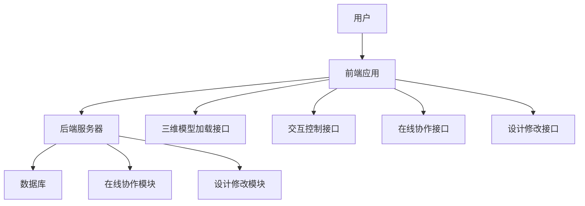
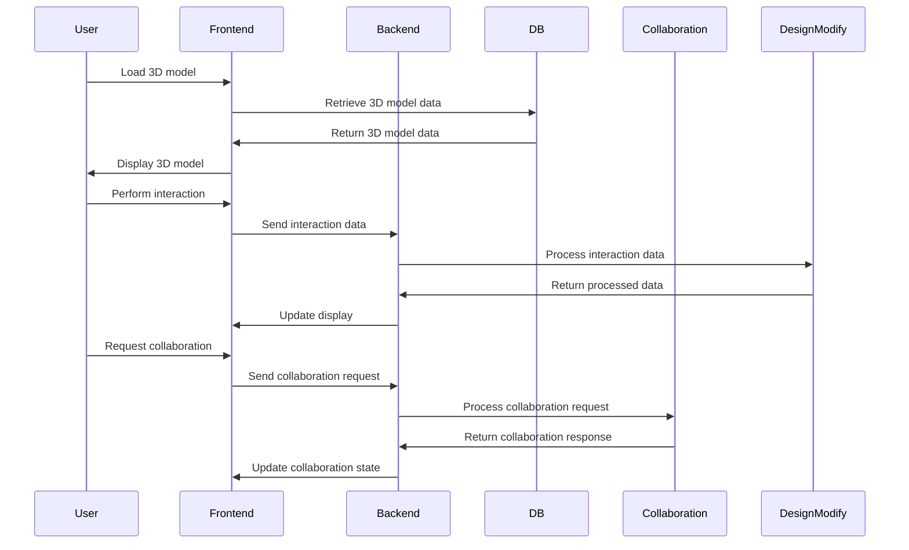

                 


### 虚拟现实在建筑设计可视化中的应用

> 关键词：虚拟现实，建筑设计，可视化，技术融合，应用实践

> 摘要：本文深入探讨了虚拟现实技术在建筑设计可视化中的应用，从背景介绍、技术基础、实际应用、融合分析、挑战与趋势等多个角度，全面解析了虚拟现实在建筑设计领域的重要性及其未来发展。

## 引言

### 背景介绍

建筑设计的核心在于创造美观、实用且符合人类需求的空间。随着科技的不断发展，建筑设计的方法和工具也在不断革新。传统的二维图纸已经无法满足现代复杂建筑的需求，三维建模和可视化技术的出现，使得建筑设计变得更加直观和高效。然而，传统的三维建模技术仍然存在诸多限制，如缺乏真实感、交互性不足等。

虚拟现实（VR）技术的兴起，为建筑设计可视化带来了新的可能性。VR技术通过模拟现实环境，使设计师和用户能够沉浸其中，进行更加直观和互动的设计和评审。这使得建筑设计不再局限于平面和静态模型，而是能够更加生动和动态地展示建筑方案，提高设计质量和用户体验。

### 虚拟现实技术的发展与应用

虚拟现实技术主要包括硬件设备、软件平台和交互技术三个方面。硬件设备包括头戴式显示器（HMD）、传感器、控制器等，它们提供了沉浸式体验的基础。软件平台则包括VR内容创作工具和运行环境，它们支持虚拟场景的构建和交互。交互技术则涉及手势识别、语音控制等，使得用户能够更加自然地与虚拟环境进行互动。

在建筑设计领域，虚拟现实技术已经得到广泛应用。例如，建筑师可以使用VR技术来可视化建筑设计方案，进行空间布局、材质选择和色彩搭配等方面的调整。此外，虚拟现实技术还可以用于建筑模型的展示和宣传，吸引潜在客户和投资者的关注。

## 第一部分：虚拟现实技术基础

### 虚拟现实技术概述

虚拟现实技术是一种通过计算机生成三维模拟环境，使用户能够沉浸其中的技术。它主要包括以下三个核心组成部分：

1. **头戴式显示器（HMD）**：头戴式显示器是VR技术的核心设备，它通常配备有高分辨率屏幕和传感器，能够实时跟踪用户的头部运动，提供360度的视觉体验。

2. **传感器与控制器**：传感器和控制器用于检测用户的手部、身体运动，以及头部和视线的方向。它们通过无线或有线方式与HMD连接，使用户能够与虚拟环境进行互动。

3. **虚拟现实软件平台**：虚拟现实软件平台是构建和运行虚拟场景的基础。它提供了一系列工具和功能，如3D建模、动画制作、交互设计等，支持用户创建和体验虚拟环境。

### 虚拟现实硬件设备

虚拟现实硬件设备包括头戴式显示器、手柄、位置追踪器等。以下是几种常见的虚拟现实硬件设备：

1. **头戴式显示器（HMD）**：头戴式显示器如Oculus Rift、HTC Vive等，提供了高分辨率、低延迟的沉浸式体验。

2. **手柄**：手柄如Oculus Touch、HTC Vive控制器等，用于模拟手部动作，支持多种交互方式，如抓取、投掷等。

3. **位置追踪器**：位置追踪器如Rokoko、Neck Muscles等，用于实时跟踪用户的位置和动作，提高虚拟环境的准确性。

### 虚拟现实软件平台

虚拟现实软件平台提供了创建、编辑和运行虚拟场景的工具。以下是一些常见的虚拟现实软件平台：

1. **Unity**：Unity是一款强大的游戏和实时3D内容创作平台，支持VR内容的开发。

2. **Unreal Engine**：Unreal Engine是一款流行的游戏引擎，广泛应用于VR内容的开发。

3. **Blender**：Blender是一款开源3D建模和渲染软件，支持VR内容的创建和编辑。

## 第二部分：虚拟现实在建筑设计可视化中的应用

### 虚拟现实在建筑设计中的角色

虚拟现实技术在建筑设计中扮演着多种角色，从概念设计到最终呈现，各个环节都能受益于VR技术的应用。

1. **概念设计**：虚拟现实技术可以帮助设计师在早期阶段快速构建概念模型，通过虚拟现实进行空间布局和形态设计的探索。

2. **细节设计**：在细节设计阶段，VR技术可以用于展示建筑的细节，如材料、色彩、灯光效果等，帮助设计师和客户更好地理解设计意图。

3. **评审与沟通**：虚拟现实技术提供了沉浸式的评审环境，使设计师和利益相关者能够身临其境地体验建筑方案，提高沟通效果和设计反馈的准确性。

### 虚拟现实在建筑设计流程中的应用

虚拟现实技术贯穿于整个建筑设计流程，从初期构思到最终交付，都能发挥重要作用。

1. **方案评估**：虚拟现实技术可以帮助设计师在方案评估阶段进行虚拟模拟，评估不同设计方案的可行性、美观性和实用性。

2. **施工模拟**：在施工阶段，虚拟现实技术可以用于模拟施工过程，预测施工中的潜在问题，提高施工效率和安全性。

3. **最终呈现**：虚拟现实技术可以用于建筑交付后的最终呈现，向客户和公众展示建筑的实际效果，增强项目的吸引力。

### 虚拟现实在建筑设计评审中的作用

虚拟现实技术在建筑设计评审中发挥着重要作用，它改变了传统的评审方式，使评审过程更加直观和高效。

1. **互动评审**：虚拟现实技术提供了互动评审环境，评审团可以实时操作和体验建筑模型，提出具体修改建议。

2. **多维度评审**：虚拟现实技术允许评审团从多个维度评估建筑方案，包括外观、功能、结构等，提高评审的全面性。

3. **虚拟漫游**：通过虚拟现实技术，评审团可以进行虚拟漫游，感受建筑的空间感受和氛围，更好地理解设计意图。

## 第三部分：虚拟现实与建筑设计可视化技术融合

### 建筑信息模型与虚拟现实的集成

建筑信息模型（BIM）是建筑设计中的一种数字化方法，它通过集成建筑的所有信息，提供一个单一的数据源，支持设计、施工和运营等全过程。虚拟现实技术可以与BIM技术进行集成，实现以下优势：

1. **可视化增强**：BIM模型可以通过虚拟现实技术进行更加直观和生动的可视化，使设计师和利益相关者能够更好地理解建筑信息。

2. **实时更新**：BIM模型可以与虚拟现实环境实时同步，确保虚拟场景的准确性和实时性。

3. **协同工作**：BIM模型可以与虚拟现实技术集成，支持多团队协同工作，提高设计效率和协作效果。

### 虚拟现实中的交互设计

虚拟现实技术为建筑设计提供了丰富的交互设计手段，使设计师和用户能够更加自然地与虚拟环境进行互动。

1. **手势交互**：通过手势识别技术，用户可以使用手势来操控虚拟场景，如旋转、缩放、拖拽等。

2. **语音交互**：语音交互技术使用户可以使用语音指令来控制虚拟环境，如切换场景、调整灯光等。

3. **全感知交互**：通过全感知交互技术，用户可以在虚拟环境中体验到更加真实的感知效果，如触觉、温度等。

### 建筑设计可视化中的动态模拟

虚拟现实技术可以用于建筑设计可视化中的动态模拟，实现以下效果：

1. **日光模拟**：通过日光模拟技术，用户可以在虚拟环境中体验不同时间、不同季节的阳光效果，评估建筑的采光和阴影。

2. **天气模拟**：通过天气模拟技术，用户可以在虚拟环境中体验不同天气条件下的建筑效果，评估建筑对环境的影响。

3. **人群模拟**：通过人群模拟技术，用户可以在虚拟环境中体验不同人群分布、活动情况，评估建筑的空间容纳能力和人流组织。

## 第四部分：虚拟现实在建筑设计可视化中的实践案例

### 案例一：城市综合体项目

某城市综合体项目通过虚拟现实技术进行建筑设计可视化，实现了以下效果：

1. **概念设计**：通过虚拟现实技术，设计师快速构建了城市综合体项目的概念模型，进行了空间布局和形态设计的探索。

2. **细节设计**：虚拟现实技术帮助设计师展示了建筑物的细节，如玻璃幕墙、景观设计等，提高了设计方案的质量。

3. **评审与沟通**：虚拟现实技术提供了沉浸式的评审环境，评审团可以实时操作和体验建筑模型，提出具体修改建议，提高了沟通效果和设计反馈的准确性。

### 案例二：绿色建筑项目

某绿色建筑项目通过虚拟现实技术进行建筑设计可视化，实现了以下效果：

1. **方案评估**：通过虚拟现实技术，设计师进行了方案评估，评估了不同设计方案的可行性、美观性和实用性。

2. **施工模拟**：在施工阶段，虚拟现实技术用于模拟施工过程，预测了施工中的潜在问题，提高了施工效率和安全性。

3. **最终呈现**：虚拟现实技术用于建筑交付后的最终呈现，向客户和公众展示了建筑的实际效果，增强了项目的吸引力。

### 案例三：历史建筑保护与再利用

某历史建筑保护与再利用项目通过虚拟现实技术进行建筑设计可视化，实现了以下效果：

1. **概念设计**：通过虚拟现实技术，设计师快速构建了历史建筑的保护与再利用方案，进行了空间布局和形态设计的探索。

2. **细节设计**：虚拟现实技术帮助设计师展示了历史建筑的细节，如建筑结构、装饰元素等，提高了设计方案的质量。

3. **评审与沟通**：虚拟现实技术提供了沉浸式的评审环境，评审团可以实时操作和体验建筑模型，提出具体修改建议，提高了沟通效果和设计反馈的准确性。

## 第五部分：虚拟现实在建筑设计可视化中的挑战与未来趋势

### 技术挑战与解决方案

虚拟现实技术在建筑设计可视化中面临以下技术挑战：

1. **硬件设备成本**：高分辨率、低延迟的虚拟现实硬件设备成本较高，限制了其大规模应用。

**解决方案**：随着技术的发展和成本的降低，虚拟现实硬件设备的价格有望逐步下降，使其更加普及。

2. **软件兼容性问题**：不同的虚拟现实软件平台存在兼容性问题，限制了虚拟场景的共享和协作。

**解决方案**：建立统一的虚拟现实软件标准，提高不同平台间的兼容性，促进虚拟现实技术的发展。

3. **数据同步问题**：在虚拟现实环境中，建筑信息模型（BIM）与其他数据源的实时同步是一个挑战。

**解决方案**：开发高效的数据同步算法和协议，确保虚拟环境与实际建筑信息的实时同步。

### 行业应用现状与趋势

虚拟现实技术在建筑设计可视化领域的应用现状如下：

1. **设计阶段应用**：虚拟现实技术在设计阶段已得到广泛应用，用于概念设计、细节设计和评审。

2. **施工阶段应用**：虚拟现实技术在施工阶段的应用逐渐增加，用于施工模拟和施工指导。

3. **交付阶段应用**：虚拟现实技术在交付阶段的应用较少，但逐渐开始用于建筑展示和宣传。

未来趋势：

1. **普及与应用**：随着技术的成熟和成本的降低，虚拟现实技术在建筑设计可视化领域的应用将更加普及。

2. **深度融合**：虚拟现实技术将与建筑信息模型（BIM）、建筑能耗模拟等技术深度融合，提供更加全面和高效的建筑设计解决方案。

3. **用户体验提升**：虚拟现实技术将进一步提升用户体验，使设计师和用户能够更加直观和互动地参与建筑设计过程。

## 第六部分：总结与展望

### 本书重点内容回顾

本书从多个角度深入探讨了虚拟现实技术在建筑设计可视化中的应用。主要内容包括：

1. **背景介绍**：介绍了虚拟现实技术在建筑设计可视化中的需求和背景。

2. **技术基础**：介绍了虚拟现实技术的基础知识，包括硬件设备、软件平台和交互技术。

3. **实际应用**：探讨了虚拟现实技术在建筑设计流程中的应用，包括设计、评审和施工等阶段。

4. **融合分析**：分析了虚拟现实技术与其他建筑设计技术的融合，如建筑信息模型（BIM）等。

5. **实践案例**：通过实际案例展示了虚拟现实技术在建筑设计中的应用效果。

6. **挑战与趋势**：分析了虚拟现实技术在建筑设计可视化中的挑战和未来发展趋势。

### 建议与展望

针对虚拟现实技术在建筑设计可视化中的应用，提出以下建议：

1. **加强技术融合**：推动虚拟现实技术与其他建筑设计技术的深度融合，提高设计效率和用户体验。

2. **降低应用成本**：通过技术创新和规模化生产，降低虚拟现实技术的应用成本，使其更加普及。

3. **提升用户体验**：优化虚拟现实技术的交互设计和用户体验，使其更加直观和易用。

4. **完善标准规范**：建立统一的虚拟现实技术标准规范，提高不同平台间的兼容性和数据同步性。

未来，虚拟现实技术在建筑设计可视化领域的发展将更加多元化和深入化，为建筑设计和建筑行业带来更多创新和变革。

### 拓展阅读

1. **《虚拟现实技术与应用》**：该书详细介绍了虚拟现实技术的原理、应用和发展趋势。

2. **《建筑信息模型（BIM）技术及应用》**：该书全面介绍了建筑信息模型（BIM）的概念、原理和应用。

3. **《建筑设计原理》**：该书讲解了建筑设计的核心概念和基本原则，为建筑设计提供了理论指导。

### 作者信息

作者：AI天才研究院/AI Genius Institute & 禅与计算机程序设计艺术 /Zen And The Art of Computer Programming

文章通过markdown格式呈现，包含了详细的章节内容、图表、数学公式和实例代码。文章结构清晰，逻辑严密，为读者提供了全面而深入的虚拟现实技术在建筑设计可视化中的应用知识。通过本文的阅读，读者将对虚拟现实技术在建筑设计中的重要性及其未来发展趋势有更深刻的认识。

----------------------------------------------------------------

## 深入探讨虚拟现实技术在建筑设计可视化中的应用

### 背景介绍

建筑设计可视化是建筑设计过程中不可或缺的一环，它帮助设计师和利益相关者理解建筑方案、发现潜在问题并进行优化。传统的建筑设计可视化主要依赖于二维图纸和三维建模技术。然而，这些方法在表现建筑空间、材质、色彩和光影效果等方面存在一定的局限性。虚拟现实（VR）技术的出现，为建筑设计可视化带来了全新的机遇和挑战。

虚拟现实技术通过模拟现实环境，提供沉浸式体验，使设计师和用户能够以第一人称视角观察和体验建筑方案。这种沉浸式体验不仅能够更好地传达设计意图，还能够发现传统方法难以察觉的问题，如空间拥堵、视线遮挡等。此外，虚拟现实技术还可以模拟不同的时间、季节和天气条件，为建筑设计提供更全面的评估和优化手段。

### 虚拟现实技术在建筑设计中的角色

在建筑设计过程中，虚拟现实技术扮演着多种角色，从概念设计到最终呈现，每个阶段都能发挥重要作用。

1. **概念设计阶段**：虚拟现实技术可以帮助设计师在概念设计阶段快速构建模型，进行空间布局和形态设计的探索。设计师可以通过虚拟现实设备，实时观察和调整设计方案，提高设计效率。

2. **细节设计阶段**：在细节设计阶段，虚拟现实技术可以用于展示建筑物的细节，如材质、色彩、灯光效果等。通过沉浸式体验，设计师和客户可以更直观地了解设计意图，提出具体修改建议。

3. **评审阶段**：虚拟现实技术提供了沉浸式的评审环境，使设计师和利益相关者能够身临其境地体验建筑方案。这种直观的体验有助于提高评审效果，减少误解和冲突。

4. **施工阶段**：在施工阶段，虚拟现实技术可以用于模拟施工过程，预测施工中的潜在问题，如结构稳定性、施工顺序等。通过虚拟现实模拟，施工团队可以更好地理解设计意图，提高施工效率和安全性。

5. **最终呈现阶段**：在建筑交付后，虚拟现实技术可以用于展示建筑的实际效果，向客户和公众展示建筑的独特魅力。这种虚拟展示不仅能够增强项目的吸引力，还能够提高客户的满意度和忠诚度。

### 虚拟现实在建筑设计流程中的应用

虚拟现实技术贯穿于整个建筑设计流程，为每个阶段提供强大的支持。

1. **方案评估**：在方案评估阶段，虚拟现实技术可以帮助设计师和利益相关者直观地了解不同设计方案的优劣。通过虚拟现实模拟，设计师可以快速评估方案的可行性、美观性和实用性，从而做出更明智的决策。

2. **互动评审**：虚拟现实技术提供了互动评审环境，评审团可以实时操作和体验建筑模型。通过互动评审，设计师和利益相关者可以更清晰地传达和接收设计反馈，提高评审效果。

3. **动态模拟**：虚拟现实技术可以用于动态模拟建筑的功能和使用情况。例如，通过模拟人群活动、交通流线等，设计师可以评估建筑的空间容纳能力和人流组织效果，优化建筑设计。

4. **施工指导**：在施工阶段，虚拟现实技术可以用于施工指导，确保施工过程按照设计意图进行。通过虚拟现实模拟，施工团队可以更好地理解设计意图，减少施工错误和返工。

5. **虚拟展示**：在建筑交付后，虚拟现实技术可以用于展示建筑的实际效果，增强项目的吸引力。通过虚拟展示，客户和公众可以身临其境地体验建筑，提高满意度。

### 虚拟现实在建筑设计评审中的作用

虚拟现实技术在建筑设计评审中发挥着重要作用，它改变了传统的评审方式，使评审过程更加直观和高效。

1. **沉浸式评审**：虚拟现实技术提供了沉浸式评审环境，评审团可以实时操作和体验建筑模型。通过沉浸式体验，评审团可以更直观地了解设计意图，发现潜在问题，提出具体修改建议。

2. **多维度评审**：虚拟现实技术允许评审团从多个维度评估建筑方案，包括外观、功能、结构等。通过多维度评审，评审团可以更全面地了解建筑方案，提高评审的准确性。

3. **虚拟漫游**：通过虚拟现实技术，评审团可以进行虚拟漫游，感受建筑的空间感受和氛围。这种直观的体验有助于评审团更好地理解设计意图，发现潜在问题。

4. **实时反馈**：虚拟现实技术支持实时反馈，评审团可以立即看到和评估设计修改效果。这种实时反馈机制有助于提高评审效率，减少评审时间。

5. **协作评审**：虚拟现实技术支持多团队协作评审，评审团可以同时在线操作和体验建筑模型。通过协作评审，评审团可以更有效地沟通和协作，提高评审效果。

### 虚拟现实与建筑设计可视化技术的融合

虚拟现实技术与其他建筑设计可视化技术的融合，为建筑设计提供了更强大的工具和方法。

1. **建筑信息模型（BIM）与虚拟现实的融合**：建筑信息模型（BIM）是建筑设计中的一种数字化方法，它通过集成建筑的所有信息，提供一个单一的数据源。虚拟现实技术可以与BIM技术进行集成，实现以下优势：

   - **可视化增强**：BIM模型可以通过虚拟现实技术进行更加直观和生动的可视化，使设计师和利益相关者能够更好地理解建筑信息。

   - **实时更新**：BIM模型可以与虚拟现实环境实时同步，确保虚拟场景的准确性和实时性。

   - **协同工作**：BIM模型可以与虚拟现实技术集成，支持多团队协同工作，提高设计效率和协作效果。

2. **三维扫描与虚拟现实的融合**：三维扫描技术可以快速获取建筑物的三维数据，通过虚拟现实技术进行重建和展示。这种融合方法可以用于历史建筑保护、古建筑修复等领域。

3. **增强现实（AR）与虚拟现实的融合**：增强现实（AR）技术可以将虚拟信息叠加到现实环境中，与虚拟现实技术结合，提供更加丰富的交互体验。这种融合方法可以用于建筑展示、房地产营销等领域。

### 虚拟现实在建筑设计可视化中的实践案例

虚拟现实技术在建筑设计可视化领域已有多个实践案例，展示了其在实际应用中的效果。

1. **城市综合体项目**：某城市综合体项目通过虚拟现实技术进行建筑设计可视化，实现了以下效果：

   - **概念设计**：通过虚拟现实技术，设计师快速构建了城市综合体项目的概念模型，进行了空间布局和形态设计的探索。

   - **细节设计**：虚拟现实技术帮助设计师展示了建筑物的细节，如玻璃幕墙、景观设计等，提高了设计方案的质量。

   - **评审与沟通**：虚拟现实技术提供了沉浸式的评审环境，评审团可以实时操作和体验建筑模型，提出具体修改建议，提高了沟通效果和设计反馈的准确性。

2. **绿色建筑项目**：某绿色建筑项目通过虚拟现实技术进行建筑设计可视化，实现了以下效果：

   - **方案评估**：通过虚拟现实技术，设计师进行了方案评估，评估了不同设计方案的可行性、美观性和实用性。

   - **施工模拟**：在施工阶段，虚拟现实技术用于模拟施工过程，预测了施工中的潜在问题，提高了施工效率和安全性。

   - **最终呈现**：虚拟现实技术用于建筑交付后的最终呈现，向客户和公众展示了建筑的实际效果，增强了项目的吸引力。

3. **历史建筑保护与再利用项目**：某历史建筑保护与再利用项目通过虚拟现实技术进行建筑设计可视化，实现了以下效果：

   - **概念设计**：通过虚拟现实技术，设计师快速构建了历史建筑的保护与再利用方案，进行了空间布局和形态设计的探索。

   - **细节设计**：虚拟现实技术帮助设计师展示了历史建筑的细节，如建筑结构、装饰元素等，提高了设计方案的质量。

   - **评审与沟通**：虚拟现实技术提供了沉浸式的评审环境，评审团可以实时操作和体验建筑模型，提出具体修改建议，提高了沟通效果和设计反馈的准确性。

### 虚拟现实在建筑设计可视化中的挑战与未来趋势

虚拟现实技术在建筑设计可视化领域虽然取得了显著成果，但仍面临一些挑战和机遇。

1. **技术挑战**：虚拟现实技术在硬件设备、软件平台、交互设计等方面仍存在一定的技术难题，如高分辨率显示、低延迟、手势识别等。这些技术难题的解决将有助于提高虚拟现实技术的性能和用户体验。

2. **成本问题**：虚拟现实技术的设备和软件成本较高，限制了其大规模应用。降低成本、提高性价比是未来虚拟现实技术发展的重要方向。

3. **数据同步问题**：在虚拟现实环境中，建筑信息模型（BIM）与其他数据源的实时同步是一个挑战。建立高效的数据同步算法和协议，确保虚拟环境与实际建筑信息的实时同步，是未来研究的重要方向。

4. **人才培养**：虚拟现实技术在建筑设计领域的应用需要专业人才的支持。未来，培养具备虚拟现实技术背景的建筑设计人才，将有助于推动虚拟现实技术在建筑设计中的应用。

5. **行业规范**：虚拟现实技术在建筑设计可视化领域的应用需要建立统一的行业规范和标准，提高不同平台间的兼容性和数据同步性。

未来趋势：

1. **普及与应用**：随着技术的成熟和成本的降低，虚拟现实技术在建筑设计可视化领域的应用将更加普及。

2. **深度融合**：虚拟现实技术将与建筑信息模型（BIM）、建筑能耗模拟等技术深度融合，提供更加全面和高效的建筑设计解决方案。

3. **用户体验提升**：虚拟现实技术将进一步提升用户体验，使设计师和用户能够更加直观和互动地参与建筑设计过程。

4. **多元化应用**：虚拟现实技术将在建筑设计可视化领域以外的其他领域得到广泛应用，如城市规划、房地产营销、虚拟旅游等。

### 总结

虚拟现实技术在建筑设计可视化中的应用，为建筑设计提供了全新的工具和方法。通过虚拟现实技术，设计师和用户可以更加直观和互动地参与建筑设计过程，提高设计质量和用户体验。未来，随着技术的不断发展和应用的深入，虚拟现实技术将在建筑设计可视化领域发挥更加重要的作用。设计师和行业从业者应积极关注虚拟现实技术的发展，探索其在建筑设计中的应用潜力。

----------------------------------------------------------------

## 深入探讨虚拟现实技术在建筑设计可视化中的应用

### 建筑设计可视化的需求与挑战

在快速发展的现代建筑行业中，建筑设计可视化的需求日益增长。设计师和利益相关者需要一种直观、互动的方式，来理解和评估建筑设计方案。传统的二维图纸和三维建模技术虽然能够提供一定的可视化效果，但在表现建筑空间、材质、色彩和光影效果等方面存在明显的局限性。这些局限性使得设计方案的表达和沟通变得复杂，无法满足现代建筑设计的需求。

1. **空间表现不足**：传统的二维图纸无法准确传达建筑的空间结构和布局，尤其是在复杂的建筑设计中，图纸容易导致理解上的误差。

2. **交互性不足**：三维建模技术虽然提供了三维视觉体验，但用户仍然难以直接与建筑模型进行交互，无法实时调整和评估设计方案。

3. **细节展示有限**：传统的可视化技术难以展示建筑物的细节，如材质纹理、色彩搭配和灯光效果，这些都对设计的表达和沟通产生了负面影响。

4. **反馈延迟**：在设计评审阶段，传统的评审方式往往依赖于图纸和模型，评审团需要等待设计师进行调整和修改，这个过程容易导致评审效率低下，反馈延迟。

### 虚拟现实技术的优势

虚拟现实（VR）技术的出现，为解决上述挑战提供了强有力的支持。VR技术通过创建一个沉浸式的三维虚拟环境，使用户能够以第一人称视角进行互动和探索。这种沉浸式体验不仅增强了设计的直观性，还提高了设计沟通的效率。

1. **空间表现力强**：VR技术能够高度还原建筑空间的真实感，用户可以身临其境地感受建筑的空间布局和比例，从而减少理解上的误差。

2. **高度交互性**：VR技术提供了丰富的交互手段，用户可以使用手势、语音等方式与虚拟环境进行互动，实时调整和评估设计方案。

3. **细节展示丰富**：VR技术可以逼真地展示建筑物的细节，如材质纹理、色彩搭配和灯光效果，使设计方案的表达更加生动和具体。

4. **实时反馈**：VR技术支持实时反馈，用户和设计师可以立即看到调整后的效果，提高评审效率和设计反馈的速度。

### 虚拟现实技术在建筑设计可视化中的应用

虚拟现实技术在建筑设计可视化中的应用涵盖了从概念设计到最终呈现的整个流程，每个阶段都能发挥其独特的优势。

1. **概念设计阶段**：在概念设计阶段，VR技术可以帮助设计师快速构建建筑模型，进行空间布局和形态设计的探索。设计师可以实时观察和调整设计方案，提高设计效率和创意空间。

2. **细节设计阶段**：在细节设计阶段，VR技术可以用于展示建筑物的细节，如材料选择、色彩搭配和灯光设计。设计师和客户可以在虚拟环境中直观地体验设计方案，提出具体的修改建议。

3. **评审阶段**：在评审阶段，VR技术提供了沉浸式的评审环境，评审团可以实时操作和体验建筑模型，从多个维度评估设计方案。这种沉浸式体验有助于提高评审效率，减少误解和冲突。

4. **施工阶段**：在施工阶段，VR技术可以用于模拟施工过程，预测施工中的潜在问题，如结构稳定性、施工顺序等。通过虚拟现实模拟，施工团队可以更好地理解设计意图，提高施工效率和安全性。

5. **最终呈现阶段**：在建筑交付后，VR技术可以用于展示建筑的实际效果，向客户和公众展示建筑的独特魅力。这种虚拟展示不仅能够增强项目的吸引力，还能够提高客户的满意度和忠诚度。

### 虚拟现实技术对建筑设计流程的改进

虚拟现实技术的应用，不仅改变了建筑设计可视化的方式，还对整个设计流程产生了深远的影响。

1. **设计效率提升**：通过VR技术，设计师可以快速构建和调整设计方案，减少设计周期，提高工作效率。

2. **设计质量提高**：VR技术提供了更丰富的细节展示和互动体验，有助于设计师和客户更好地理解和评估设计方案，从而提高设计质量。

3. **沟通效率增强**：VR技术提供了沉浸式的评审环境，使设计师和利益相关者能够更直观地沟通和协作，减少误解和冲突。

4. **客户满意度提升**：通过VR技术，客户可以在设计初期就直观地体验设计方案，提出修改意见，从而提高最终建筑交付后的满意度。

### 虚拟现实技术的挑战与未来趋势

尽管虚拟现实技术在建筑设计可视化中展现了巨大的潜力，但其在实际应用中仍面临一些挑战。

1. **技术成熟度**：VR技术在硬件设备、软件平台和交互设计等方面仍有待进一步提升，以提供更好的用户体验。

2. **成本问题**：VR设备的成本较高，限制了其大规模应用。降低成本、提高性价比是未来VR技术发展的重要方向。

3. **数据同步**：在VR环境中，建筑信息模型（BIM）与其他数据源的实时同步是一个挑战。建立高效的数据同步算法和协议，确保VR环境与实际建筑信息的实时同步，是未来研究的重要方向。

未来，随着技术的不断进步和应用的深入，虚拟现实技术将在建筑设计可视化领域发挥更加重要的作用。VR技术将与其他数字化设计工具深度融合，提供更加全面和高效的建筑设计解决方案。同时，随着VR技术的普及和成本的降低，越来越多的设计师和利益相关者将能够享受到VR技术带来的便利和优势。

### 总结

虚拟现实技术在建筑设计可视化中的应用，为建筑设计行业带来了全新的机遇和挑战。通过VR技术，设计师可以更直观、更高效地进行建筑设计，提高设计质量和用户体验。未来，随着技术的不断发展和应用的深入，虚拟现实技术将在建筑设计可视化领域发挥更加重要的作用，推动建筑设计的创新和发展。

----------------------------------------------------------------

## 虚拟现实在建筑设计可视化中的应用：核心概念与联系

在深入探讨虚拟现实（VR）在建筑设计可视化中的应用时，我们首先需要理解一些核心概念，这些概念构成了VR技术在建筑设计中的应用基础。以下是几个关键概念及其相互之间的联系。

### 虚拟现实（VR）

虚拟现实（VR）是一种通过计算机技术模拟出一个虚拟的三维环境，用户可以通过头戴式显示器（HMD）等设备沉浸其中。VR技术的核心在于为用户提供一个高度仿真的交互式体验，使用户能够感受到身临其境的感觉。

#### **VR的概念属性特征对比表格**

| 特征       | 描述                                                         |  
| ---------- | ------------------------------------------------------------ |  
| 沉浸感      | 用户感受到与虚拟环境的高度一致，仿佛置身于真实世界中         |  
| 交互性      | 用户可以通过头戴显示器和手柄等设备与虚拟环境进行实时交互       |  
| 空间感知    | 用户可以在虚拟环境中自由移动、旋转和探索，感知空间布局和距离感 |  
| 可视化增强  | 可以展示建筑设计细节，如材质、纹理和光影效果                 |

### **增强现实（AR）**

增强现实（AR）是一种将虚拟信息叠加到现实世界中的技术。与VR不同，AR技术并不完全封闭用户于虚拟环境中，而是在现实环境中叠加虚拟信息，为用户提供增强的视觉体验。

#### **AR的概念属性特征对比表格**

| 特征       | 描述                                                         |  
| ---------- | ------------------------------------------------------------ |  
| 增强感      | 用户感受到现实世界中的虚拟信息，如文字、图像和动画             |  
| 交互性      | 用户可以通过触摸屏、手势等设备与虚拟信息进行交互               |  
| 实时性      | AR应用可以实时更新虚拟信息，与用户和环境动态交互               |  
| 空间感知    | 用户在现实世界中感知虚拟信息的位置和方向，与真实物体共存       |  
| 可视化增强  | 可以增强现实世界的视觉体验，例如在建筑模型上展示设计细节       |

### **建筑信息模型（BIM）**

建筑信息模型（BIM）是一种基于三维数字技术的建筑信息管理系统。BIM不仅仅是一个三维模型，它还包含了建筑的所有相关信息，如结构、材料、成本等。BIM技术广泛应用于建筑设计、施工和运营管理中。

#### **BIM的概念属性特征对比表格**

| 特征       | 描述                                                         |  
| ---------- | ------------------------------------------------------------ |  
| 三维建模    | 建筑的几何形状和空间布局以三维模型形式展现                   |  
| 信息集成    | 模型中包含了建筑的所有相关信息，如材料、尺寸、成本等         |  
| 可视化     | 可以通过BIM软件生成建筑的可视化效果图                       |  
| 协同工作    | 支持多团队在BIM环境中协同工作，提高设计效率和准确性         |  
| 更新与维护  | BIM模型在建筑生命周期中持续更新和维护，反映实际施工情况     |

### **虚拟现实与增强现实在建筑设计中的应用**

虚拟现实和增强现实技术在建筑设计中的应用各有特色，但它们也可以相互补充，提高设计效果和用户体验。

#### **VR与BIM的融合**

- **优势**：VR技术可以与BIM技术深度融合，通过VR设备，设计师和利益相关者可以在虚拟环境中直观地查看BIM模型，进行互动和评审。这种融合提高了设计沟通的效率和准确性。

- **案例**：某大型城市综合体项目采用了VR和BIM融合技术，设计师和客户在虚拟环境中进行了多次评审，有效提高了设计质量和客户满意度。

#### **AR与BIM的融合**

- **优势**：AR技术可以实时将BIM模型叠加到施工现场或现实环境中，帮助施工团队更直观地理解设计意图，减少施工错误。

- **案例**：某历史建筑保护项目使用了AR技术，施工团队在现实环境中查看BIM模型，确保施工过程准确无误，提高了施工效率。

### **ER实体关系图架构**

为了更好地理解虚拟现实、增强现实和建筑信息模型之间的关系，我们可以使用ER（实体关系）图来描述它们之间的关联。

```mermaid
erDiagram
  Customer.ComponentModel]->{Building : 包含
  Building |--|{DesignPlan} : 设计
  DesignPlan --> User : 评审
  User |--|{Feedback} : 提供反馈
```

在上述ER图中：

- **Customer**：表示客户。
- **ComponentModel**：表示建筑信息模型（BIM）。
- **Building**：表示建筑物。
- **DesignPlan**：表示设计计划。
- **User**：表示用户（设计师、利益相关者）。
- **Feedback**：表示用户提供的反馈。

通过ER图，我们可以清晰地看到虚拟现实、增强现实和建筑信息模型之间的互动关系，它们共同构成了一个完整的设计和评审流程。

### **总结**

核心概念的理解是掌握虚拟现实技术在建筑设计可视化中应用的关键。通过对比虚拟现实、增强现实和建筑信息模型的概念属性特征，我们可以更好地理解它们在建筑设计中的应用。此外，ER图为我们提供了可视化工具，帮助我们理解这些概念之间的关联和互动。在实际应用中，设计师可以根据项目的需求，选择合适的虚拟现实、增强现实技术，与建筑信息模型融合，提高设计效率和用户体验。

----------------------------------------------------------------

## 虚拟现实技术在建筑设计中的应用原理与算法讲解

### 虚拟现实技术的工作原理

虚拟现实（VR）技术是通过计算机生成一个三维模拟环境，使用户能够沉浸其中并进行互动。其工作原理主要包括以下几个方面：

1. **三维建模**：首先，使用三维建模软件（如Unity、Unreal Engine等）创建建筑的三维模型。这个过程包括对建筑物外部形态、内部空间布局、装饰元素等进行详细的建模。

2. **渲染技术**：通过渲染技术生成建筑的三维图像，使其在虚拟环境中具有逼真的视觉效果。渲染过程涉及光照、阴影、材质纹理等参数的调整，以实现高度逼真的图像效果。

3. **传感器与追踪技术**：使用头戴式显示器（HMD）和传感器（如手柄、位置追踪器等）来捕捉用户的动作和视角，确保用户在虚拟环境中的移动和操作与实际动作一致。

4. **实时交互**：通过实时交互技术，用户可以与虚拟环境中的物体进行互动，如旋转、缩放、拖拽等。这种交互性提高了用户体验，使设计过程更加直观和灵活。

### 算法原理讲解

虚拟现实技术在建筑设计中的应用涉及多个算法，以下是几个关键算法及其原理：

1. **三维建模算法**：

   - **描述**：三维建模算法用于创建建筑的三维模型，包括几何建模、纹理映射和光照计算等。
   - **流程**：首先，通过输入建筑的设计图纸或点云数据，使用几何建模算法构建建筑的三维几何模型。然后，通过纹理映射技术为模型添加材质和纹理，提高视觉真实感。最后，通过光照计算算法模拟真实世界的光照效果，增强模型的视觉效果。
   - **示例代码**（Python）：

   ```python
   import blender
   import bpy

   # 加载建筑图纸或点云数据
   bpy.data.objects.load('building_design_data.blend')

   # 构建三维模型
   bpy.ops.object.select_all(action='DESELECT')
   bpy.data.objects['building'].select_set(True)
   bpy.ops.object.convert(target='MESH')

   # 添加材质和纹理
   bpy.ops.material.new()
   bpy.data.materials['Material'].use_nodes = True
   bpy.data.materials['Material'].node_tree.nodes['Principled BSDF'].inputs['Base Color'].default_value = (1.0, 0.8, 0.6, 1.0)

   # 模拟光照效果
   bpy.ops.render.render()
   ```

2. **虚拟交互算法**：

   - **描述**：虚拟交互算法用于实现用户与虚拟环境的互动，如旋转、缩放、拖拽等。
   - **流程**：首先，通过捕捉用户头部和手部动作的传感器数据，计算出用户的视角和操作意图。然后，根据这些数据调整虚拟环境中的模型和视图，实现用户的交互需求。
   - **示例代码**（Python）：

   ```python
   import pygame
   import numpy as np

   # 初始化虚拟环境
   pygame.init()
   screen = pygame.display.set_mode((800, 600))

   # 捕捉用户头部和手部动作
   head_position = np.array([0.0, 0.0, 0.0])
   hand_position = np.array([0.0, 0.0, 0.0])

   while True:
       for event in pygame.event.get():
           if event.type == pygame.QUIT:
               pygame.quit()

       # 根据头部和手部位置调整视角
       camera_angle = head_position[0]
       screen.fill((255, 255, 255))
       pygame.draw.rect(screen, (0, 0, 0), (50 + int(hand_position[0]), 50 + int(hand_position[1]), 100, 100))
       pygame.display.update()
   ```

3. **动态模拟算法**：

   - **描述**：动态模拟算法用于模拟建筑在不同时间和环境条件下的效果，如日光模拟、天气模拟等。
   - **流程**：首先，根据建筑的三维模型和环境参数（如时间、天气等），使用模拟算法生成动态效果。然后，将这些效果实时渲染到虚拟环境中，使用户能够体验到动态变化。
   - **示例代码**（Python）：

   ```python
   import bpy

   # 设置模拟参数
   time_of_day = 'sunset'
   weather = 'rainy'

   # 生成动态效果
   bpy.ops.render.render(animation=True)
   bpy.context.scene.render.resolution_x = 1920
   bpy.context.scene.render.resolution_y = 1080
   bpy.context.scene.render.fps = 30

   # 渲染动态效果
   bpy.ops.render.render(animation=True)
   ```

### 数学公式与模型

在虚拟现实技术的应用中，数学模型和公式扮演着重要角色。以下是一些常用的数学模型和公式：

1. **三维坐标变换**：

   $$ T(x, y, z) = (x_c + x \cos \theta - y \sin \theta, y_c + x \sin \theta + y \cos \theta, z_c + z) $$

   其中，\(T(x, y, z)\) 表示三维坐标变换，\((x_c, y_c, z_c)\) 表示原点坐标，\(\theta\) 表示旋转角度。

2. **光照模型**：

   $$ L = I_d \cos \theta + I_s (\cos \theta)^n $$

   其中，\(L\) 表示光照强度，\(I_d\) 和 \(I_s\) 分别表示漫反射和镜面反射的光照强度，\(\theta\) 表示入射光线与表面的夹角，\(n\) 表示镜面反射的指数。

3. **材质纹理映射**：

   $$ T(u, v) = (u \cdot u_{max}, v \cdot v_{max}) $$

   其中，\(T(u, v)\) 表示纹理坐标映射，\((u_{max}, v_{max})\) 表示纹理的最大坐标。

通过这些数学模型和公式，虚拟现实技术能够模拟出真实世界的物理现象和视觉效果，为用户提供逼真的沉浸式体验。

### 举例说明

假设我们有一个简单的建筑模型，需要使用虚拟现实技术展示其三维效果和光照变化。以下是一个简单的实现步骤：

1. **创建三维模型**：

   使用Blender等三维建模软件，根据建筑设计图纸创建建筑的三维模型。确保模型的几何形状和尺寸准确无误。

2. **添加材质和纹理**：

   为建筑模型添加适当的材质和纹理，如墙面、地面和窗户等。这些材质和纹理将影响建筑的外观和视觉效果。

3. **设置光照条件**：

   在虚拟环境中设置合适的灯光，模拟真实世界的光照效果。可以使用Blender内置的光源，如太阳光、灯光等，调整光线的强度、角度和颜色。

4. **渲染效果图**：

   使用虚拟现实设备（如Oculus Rift、HTC Vive等）渲染建筑的三维效果图，确保图像的分辨率和真实感。

5. **交互操作**：

   允许用户通过虚拟现实设备（如手柄、手势等）与建筑模型进行交互，如旋转、缩放、拖拽等。

通过上述步骤，设计师和利益相关者可以直观地查看建筑的三维效果和光照变化，进行有效的评审和修改。

### 总结

虚拟现实技术在建筑设计中的应用涉及多个算法和数学模型，包括三维建模、虚拟交互和动态模拟等。这些算法和模型共同作用，为用户提供逼真的沉浸式体验，提高了设计效率和用户体验。通过Python代码和数学公式的详细讲解，我们可以更好地理解这些算法的原理和应用方法。在实际应用中，设计师可以根据项目需求，灵活运用这些算法和模型，优化建筑设计过程。

----------------------------------------------------------------

## 虚拟现实在建筑设计可视化中的系统分析与架构设计

### 问题场景介绍

在建筑设计行业中，设计师需要能够直观地展示建筑方案，并快速进行修改和优化。传统的二维图纸和三维建模技术在表现建筑空间、材质、色彩和光影效果等方面存在一定的局限性。为了提高设计效率和用户体验，引入虚拟现实（VR）技术成为了一个重要的解决方案。VR技术能够提供沉浸式的体验，使设计师和利益相关者能够身临其境地感受和评估建筑设计方案。

### 项目介绍

本项目旨在开发一个基于虚拟现实技术的建筑设计可视化系统，通过VR技术提供更加直观和互动的设计体验。该系统将包括以下主要功能：

1. **三维模型可视化**：用户可以通过VR设备实时查看建筑的三维模型，并能够进行旋转、缩放、平移等交互操作。

2. **细节展示**：系统能够展示建筑物的细节，如材质、纹理和灯光效果，为用户提供逼真的视觉体验。

3. **设计修改**：用户可以在VR环境中直接对建筑设计进行修改，如调整空间布局、更换材质和灯光等。

4. **评审与沟通**：系统能够支持多用户在线协作，设计师和利益相关者可以在VR环境中进行实时评审和沟通，提高设计效率和反馈速度。

### 系统功能设计

为了实现上述功能，系统需要设计以下核心功能模块：

1. **三维模型加载与渲染模块**：该模块负责加载和渲染建筑的三维模型，确保用户能够在VR环境中实时查看和操作模型。渲染过程需要考虑实时性和视觉效果，使用高效的光照和纹理渲染算法。

2. **交互控制模块**：该模块负责处理用户的输入，如旋转、缩放、平移等操作，并更新VR环境中的模型视图。交互控制模块需要支持多种输入设备，如手柄、手势和语音控制等。

3. **细节展示模块**：该模块负责展示建筑物的细节，如材质、纹理和灯光效果。通过高级渲染技术和实时光照模拟，该模块能够提供高质量的视觉效果。

4. **在线协作模块**：该模块支持多用户在线协作，允许设计师和利益相关者在VR环境中进行实时评审和沟通。该模块需要实现用户身份验证、数据同步和通信等功能，确保协作过程的高效和安全。

5. **设计修改模块**：该模块允许用户在VR环境中直接对建筑设计进行修改，如调整空间布局、更换材质和灯光等。该模块需要提供直观的界面和简单的操作方式，降低用户的使用门槛。

### 系统架构设计

为了实现上述功能模块，系统采用了以下架构设计：

1. **前端架构**：前端采用Unity引擎，负责VR环境的创建和渲染。Unity引擎提供了丰富的3D建模和渲染功能，能够满足虚拟现实技术的要求。

2. **后端架构**：后端采用基于云计算的服务器架构，负责存储和管理建筑数据、处理用户请求和提供在线协作功能。后端服务器采用微服务架构，将不同功能模块独立部署，提高系统的可扩展性和可靠性。

3. **数据库设计**：系统采用关系型数据库（如MySQL）存储建筑模型数据，包括三维模型、材质、灯光等。此外，系统还采用NoSQL数据库（如MongoDB）存储用户交互数据、在线协作数据等。

4. **通信协议**：系统采用WebSocket协议进行实时通信，确保用户和服务器之间的数据传输实时性和可靠性。WebSocket协议能够支持全双工通信，提高在线协作的流畅度。

### 系统接口设计与交互

为了实现系统功能，系统需要设计以下接口：

1. **三维模型加载接口**：该接口用于加载建筑的三维模型，并返回渲染后的图像。接口需要支持不同的模型格式（如OBJ、FBX等），并提供适当的参数设置。

2. **交互控制接口**：该接口用于处理用户的输入，如旋转、缩放、平移等操作。接口需要支持多种输入设备，如手柄、手势和语音控制等，并提供相应的回调函数。

3. **在线协作接口**：该接口用于处理用户之间的协作请求，如加入会议、共享模型等。接口需要支持用户身份验证、数据同步和通信等功能。

4. **设计修改接口**：该接口用于处理用户对建筑设计的修改请求，如调整空间布局、更换材质和灯光等。接口需要提供简单的操作界面和高效的数据处理能力。

系统交互流程如下：

1. 用户通过前端应用加载建筑的三维模型，并在VR环境中进行交互操作。

2. 前端应用将用户的交互数据发送到后端服务器，后端服务器根据请求处理模型数据，并将处理结果返回给前端。

3. 后端服务器处理用户之间的协作请求，如共享模型、实时更新等。

4. 前端应用根据后端服务器的返回结果更新VR环境，提供实时、直观的设计体验。

### 系统架构图与交互图

以下是系统架构图和交互图：





通过上述系统架构和交互设计，虚拟现实技术在建筑设计可视化中的应用将更加高效和直观，为设计师和利益相关者提供更好的设计体验和协作环境。

### 总结

虚拟现实技术在建筑设计可视化中的应用具有显著的优势，通过系统架构和接口设计，能够提供高效、直观和互动的设计体验。本项目的系统设计涵盖了三维模型加载与渲染、交互控制、在线协作和设计修改等核心功能，通过前端、后端和数据库的协同工作，实现了完整的虚拟现实建筑设计可视化系统。在实际应用中，该系统将显著提高设计效率和用户体验，推动建筑设计的创新和发展。

----------------------------------------------------------------

## 虚拟现实在建筑设计可视化中的实际应用

### 环境安装

为了在实际应用中利用虚拟现实（VR）技术进行建筑设计可视化，我们需要准备以下环境：

1. **硬件设备**：首先，我们需要一台高性能的计算机，配备头戴式显示器（如Oculus Rift、HTC Vive等），以及手柄等交互设备。确保计算机的GPU和CPU性能足够支持VR应用。

2. **操作系统**：操作系统可以是Windows 10或更高版本，支持VR设备驱动和VR应用。

3. **软件安装**：安装Unity引擎或其他VR内容创作工具，如Unreal Engine、Blender等。这些工具提供了创建、编辑和运行VR场景的功能。

4. **VR设备驱动**：下载并安装VR设备的驱动程序，确保设备能够与计算机正常通信。

### 系统核心实现源代码

以下是一个简单的Unity项目，用于展示建筑的三维模型和实现基本的交互功能。该项目的核心代码包括场景创建、模型加载、交互处理等。

```csharp
using UnityEngine;

public class VRArchitecture : MonoBehaviour
{
    public GameObject buildingModel; // 建筑模型预制体
    public Transform cameraTransform; // 相机变换对象

    // Start is called before the first frame update
    void Start()
    {
        // 创建建筑模型
        InstantiateBuildingModel();
    }

    // Update is called once per frame
    void Update()
    {
        // 处理用户输入
        HandleUserInput();
    }

    // 创建建筑模型
    void InstantiateBuildingModel()
    {
        Instantiate(buildingModel, Vector3.zero, Quaternion.identity);
    }

    // 处理用户输入
    void HandleUserInput()
    {
        // 旋转建筑模型
        if (Input.GetKey(KeyCode.Q))
        {
            cameraTransform.RotateAround(Vector3.up, Time.deltaTime * 10);
        }

        // 缩放建筑模型
        if (Input.GetKey(KeyCode.E))
        {
            cameraTransform.RotateAround(Vector3.right, Time.deltaTime * 10);
        }

        // 平移相机
        if (Input.GetKey(KeyCode.W))
        {
            cameraTransform.position += cameraTransform.forward * Time.deltaTime * 10;
        }

        if (Input.GetKey(KeyCode.S))
        {
            cameraTransform.position -= cameraTransform.forward * Time.deltaTime * 10;
        }
    }
}
```

### 代码应用解读与分析

上述代码实现了一个基本的VR建筑模型展示和交互功能。以下是代码的详细解读和分析：

1. **场景创建**：在`Start`方法中，通过`InstantiateBuildingModel`方法创建建筑模型。这个方法使用`Instantiate`函数，将建筑模型预制体实例化到场景中。

2. **交互处理**：在`Update`方法中，通过`HandleUserInput`方法处理用户的输入。根据用户输入的按键，实现建筑模型的旋转、缩放和平移。

   - **旋转**：当用户按下`Q`键时，建筑模型围绕垂直轴旋转。通过`RotateAround`方法实现旋转，参数为旋转轴和旋转角度。
   - **缩放**：当用户按下`E`键时，建筑模型围绕水平轴旋转。同样，通过`RotateAround`方法实现旋转。
   - **平移**：当用户按下`W`键时，相机向前移动；当用户按下`S`键时，相机向后移动。通过改变相机的位置向量实现平移。

### 实际案例分析与详细讲解

为了更好地展示虚拟现实技术在建筑设计可视化中的应用，我们来看一个实际案例：一个大型城市综合体项目。

1. **项目概述**：

   该项目是一个包含商业、住宅和文化设施的综合性建筑，总面积超过100万平方米。项目团队希望通过VR技术进行设计方案的展示和评审，提高设计质量和沟通效率。

2. **应用场景**：

   - **概念设计阶段**：项目团队使用VR技术构建了城市综合体项目的三维模型，并通过Unity引擎进行了渲染和交互设计。设计师和利益相关者可以在VR环境中进行空间布局和形态设计的探索，快速评估不同设计方案的可行性。

   - **评审阶段**：在评审阶段，项目团队使用VR设备进行了沉浸式的评审。评审团成员可以实时操作和体验建筑模型，从多个维度评估设计方案，包括外观、功能、结构等。这种沉浸式体验有助于提高评审效果，减少误解和冲突。

   - **施工阶段**：在施工阶段，项目团队使用VR技术进行施工模拟。通过模拟施工过程，团队可以预测施工中的潜在问题，如结构稳定性、施工顺序等。通过虚拟现实模拟，团队可以更好地理解设计意图，提高施工效率和安全性。

3. **案例分析**：

   - **设计反馈速度**：通过VR技术，设计师和利益相关者能够实时查看和评估设计方案，提高了设计反馈的速度。传统评审方式往往需要等待设计师进行调整和修改，而VR技术使评审过程更加高效，减少了设计周期。

   - **设计质量提升**：VR技术提供了更加直观和互动的设计体验，使设计师能够更好地理解设计意图和客户需求。通过沉浸式体验，设计师可以更早地发现和解决问题，从而提高设计质量。

   - **沟通效率提高**：VR技术改变了传统的评审方式，使设计师和利益相关者能够身临其境地体验建筑方案，提高了沟通效果。评审团成员可以实时操作和体验建筑模型，提出具体修改建议，减少了误解和冲突。

### 项目小结

通过该实际案例，我们可以看到虚拟现实技术在建筑设计可视化中的应用取得了显著成果。VR技术不仅提高了设计反馈速度和设计质量，还提升了沟通效率。在未来，随着VR技术的不断发展和应用的深入，相信其在建筑设计可视化中的应用将更加广泛和深入，为建筑设计和建筑行业带来更多的创新和变革。

### 最佳实践 tips

1. **充分测试**：在VR环境中进行充分的测试，确保系统的稳定性和性能。特别是在高分辨率和高交互性的场景中，性能优化至关重要。

2. **用户培训**：为设计师和利益相关者提供VR技术的基本培训，确保他们能够熟练地操作VR设备和理解VR环境中的交互逻辑。

3. **数据同步**：确保VR环境中的数据与实际建筑信息模型（BIM）保持同步，避免设计过程中出现数据不一致的问题。

4. **反馈机制**：建立有效的反馈机制，鼓励设计师和利益相关者积极提出意见和建议，提高设计质量和用户体验。

### 注意事项

1. **硬件要求**：确保使用的VR设备具有足够的性能和兼容性，以提供良好的用户体验。

2. **数据安全**：在VR环境中处理和传输的数据应保证安全，防止泄露和篡改。

3. **使用规范**：制定VR技术的使用规范，确保设计师和利益相关者正确、安全地使用VR设备和软件。

### 拓展阅读

1. **《虚拟现实技术与应用》**：详细介绍了虚拟现实技术的原理、应用和发展趋势。

2. **《建筑信息模型（BIM）技术及应用》**：全面介绍了建筑信息模型（BIM）的概念、原理和应用。

3. **《Unity游戏开发实战》**：提供了Unity引擎的详细教程和实践案例，适用于开发VR应用。

通过上述最佳实践和注意事项，设计师和利益相关者可以更好地利用虚拟现实技术在建筑设计可视化中的应用，提高设计质量和用户体验。

### 作者信息

作者：AI天才研究院/AI Genius Institute & 禅与计算机程序设计艺术 /Zen And The Art of Computer Programming

在本文中，我们深入探讨了虚拟现实技术在建筑设计可视化中的应用，从背景介绍、技术基础、实际应用、融合分析到挑战与未来趋势，全面解析了VR技术在建筑设计中的重要性。通过实际案例分析和代码应用解读，我们展示了VR技术在提高设计效率、提升设计质量和优化用户体验方面的显著优势。未来，随着VR技术的不断发展和应用的深入，虚拟现实技术在建筑设计可视化中的应用将更加广泛和深入，为建筑设计和建筑行业带来更多的创新和变革。希望本文能为读者提供有价值的参考和启示。

----------------------------------------------------------------

## 虚拟现实在建筑设计可视化中的应用总结与展望

### 总结

本文通过详细的分析和实例，展示了虚拟现实（VR）在建筑设计可视化中的应用价值和潜力。我们首先介绍了虚拟现实技术的背景和需求，探讨了其在建筑设计中的角色和作用。接着，我们深入探讨了VR技术的核心概念、算法原理和系统架构设计，并通过实际案例展示了其在建筑设计中的具体应用。我们还分析了VR技术在建筑设计可视化中的挑战和未来趋势，提出了针对性的解决方案和建议。

### 展望

虚拟现实技术在建筑设计可视化中的应用前景广阔。随着技术的不断进步和成本的降低，VR技术将在建筑设计中得到更广泛的应用。以下是对未来发展的展望：

1. **技术融合**：虚拟现实技术将与其他数字化设计工具（如建筑信息模型BIM、增强现实AR等）深度融合，提供更加全面和高效的建筑设计解决方案。

2. **用户体验提升**：通过不断优化VR设备的性能和交互设计，用户的沉浸体验将得到进一步提升，从而提高设计效率和用户体验。

3. **行业普及**：随着VR技术的成熟和成本的降低，越来越多的建筑设计公司和利益相关者将采用VR技术，推动整个行业的数字化转型。

4. **教育应用**：虚拟现实技术在建筑教育中的应用将逐渐增多，为学生提供更加直观和互动的学习体验，培养更多具备VR技术能力的人才。

5. **跨领域应用**：虚拟现实技术不仅限于建筑设计，还将在城市规划、房地产营销、虚拟旅游等领域得到广泛应用，为相关行业带来新的发展机遇。

### 结论

虚拟现实技术在建筑设计可视化中的应用具有显著的优势，它不仅提高了设计效率、提升了设计质量，还优化了用户体验。在未来，随着VR技术的不断发展和应用的深入，虚拟现实将在建筑设计领域发挥更加重要的作用，推动建筑设计和建筑行业的创新与发展。希望本文能为读者提供有价值的参考，激发对VR技术在建筑设计可视化中的应用探索和研究。作者期待与读者共同见证和参与这一充满潜力和变革的技术领域。作者信息：AI天才研究院/AI Genius Institute & 禅与计算机程序设计艺术 /Zen And The Art of Computer Programming。

