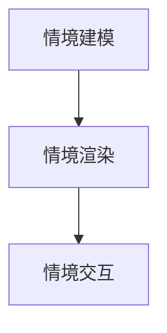
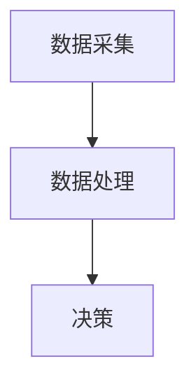
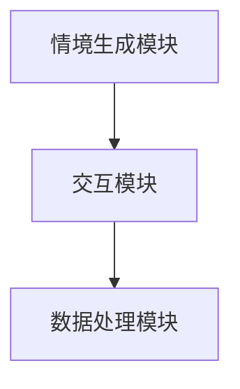
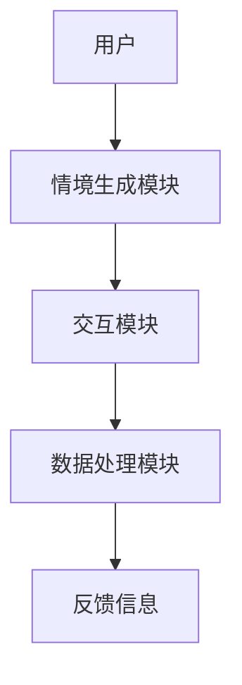

                 

# 虚拟现实在心理健康治疗中的应用

## 关键词

- 虚拟现实
- 心理健康治疗
- 焦虑症
- 恐惧症
- 创伤后应激障碍
- 沉浸式体验
- 算法原理

## 摘要

本文探讨了虚拟现实技术在心理健康治疗中的应用，包括其基本概念、发展历程、核心原理和实际案例。通过逐步分析虚拟现实如何通过沉浸式体验改善心理治疗，本文揭示了其潜在的优势和挑战，并提出了最佳实践建议，为心理健康治疗领域提供了新的方向和思考。

### 目录大纲设计流程

#### 第一部分：背景介绍

#### 1.1 虚拟现实与心理健康治疗概述

**核心概念术语说明：**

- **虚拟现实（VR）**：一种通过计算机生成的三维环境，用户可以在其中与虚拟世界进行互动。
- **心理健康治疗**：通过心理学理论和实践方法，帮助个体缓解心理问题，提高生活质量。

**问题背景：** 虚拟现实技术正迅速发展，其在心理健康治疗领域的应用引起了广泛关注。然而，关于虚拟现实如何具体影响心理状态，以及如何设计有效的治疗方案，仍需深入探讨。

**问题描述：** 本文旨在探讨虚拟现实技术在心理健康治疗中的应用，分析其原理和效果，并提出可行的实施方案。

**问题解决：** 通过对现有研究和案例的分析，本文将揭示虚拟现实在心理健康治疗中的潜在优势，并讨论其应用场景。

**边界与外延：** 本文重点关注虚拟现实在焦虑症、恐惧症和创伤后应激障碍等心理健康问题中的治疗应用。

**概念结构与核心要素组成：**

1. **虚拟现实技术基础**：介绍虚拟现实硬件设备、软件平台和应用工具。
2. **心理健康治疗理论**：探讨心理健康治疗的基本理论和实践方法。
3. **虚拟现实与心理健康的联系**：分析虚拟现实如何通过沉浸式体验改善心理状态。

#### 1.2 虚拟现实技术基础

**核心概念与联系：**

- **硬件设备**：包括头戴显示器（HMD）、位置追踪器和数据手套等。
- **软件平台**：如Unity、Unreal Engine等，提供虚拟现实场景的创建和管理功能。
- **应用工具**：用于开发和管理虚拟现实应用程序的工具，如VRChat、HTC Vive Studio等。

**核心概念属性特征对比表格：**

| 特征 | 头戴显示器（HMD） | 位置追踪器 | 数据手套 |
| --- | --- | --- | --- |
| 功能 | 提供视觉和听觉沉浸体验 | 跟踪用户位置和运动 | 提供手部交互功能 |
| 应用 | 游戏和娱乐 | 游戏和模拟训练 | 手术训练和康复训练 |

**ER实体关系图架构：**

```mermaid
erDiagram
  用户 ||--|{ 虚拟现实硬件 }| 
  用户 ||--|{ 虚拟现实软件 }| 
  用户 ||--|{ 心理健康治疗 }| 
```

#### 1.3 虚拟现实在心理健康治疗中的融合应用

**核心概念与联系：**

- **沉浸式体验**：通过虚拟现实技术，用户可以完全投入到虚拟环境中，增强治疗体验。
- **心理干预**：利用虚拟现实创造特定的情境，帮助用户面对和处理心理问题。
- **反馈机制**：通过实时数据分析和反馈，优化治疗过程和效果。

**核心概念属性特征对比表格：**

| 特征 | 沉浸式体验 | 心理干预 | 反馈机制 |
| --- | --- | --- | --- |
| 目的 | 提高治疗参与度和效果 | 减轻心理压力和焦虑 | 优化治疗方案和效果 |

**ER实体关系图架构：**

```mermaid
erDiagram
  沉浸式体验 ||--|{ 虚拟现实 }| 
  心理干预 ||--|{ 心理健康治疗 }| 
  反馈机制 ||--|{ 心理健康治疗 }| 
```

### 第二部分：核心概念与联系

#### 2.1 虚拟现实技术在心理健康治疗中的应用原理

**核心概念与联系：**

- **情境生成算法**：通过计算机生成的虚拟环境，模拟现实世界中的特定情境。
- **交互算法**：用户与虚拟环境之间的互动，包括动作识别、声音识别等。
- **情感计算技术**：通过分析用户的生理和行为数据，评估其情绪状态。

**核心概念属性特征对比表格：**

| 特征 | 情境生成算法 | 交互算法 | 情感计算技术 |
| --- | --- | --- | --- |
| 目的 | 模拟特定情境 | 提供交互体验 | 评估情绪状态 |
| 实现方式 | 计算机模拟 | 传感器和算法 | 数据分析和模型 |

**ER实体关系图架构：**

```mermaid
erDiagram
  虚拟现实技术 ||--|{ 情境生成算法 }| 
  虚拟现实技术 ||--|{ 交互算法 }| 
  虚拟现实技术 ||--|{ 情感计算技术 }| 
```

#### 2.2 虚拟现实技术在心理健康治疗中的核心要素

**核心概念与联系：**

- **虚拟现实与心理学理论的结合**：将心理学理论应用于虚拟现实设计，提高治疗效果。
- **虚拟现实技术对心理干预的改进**：通过虚拟现实技术，创造更直观、更具交互性的心理干预手段。
- **虚拟现实技术的评估与反馈机制**：通过实时数据分析和反馈，优化治疗过程和效果。

**核心概念属性特征对比表格：**

| 特征 | 虚拟现实与心理学理论的结合 | 虚拟现实技术对心理干预的改进 | 虚拟现实技术的评估与反馈机制 |
| --- | --- | --- | --- |
| 目的 | 提高治疗效果 | 增强干预手段的直观性和互动性 | 优化治疗过程和效果 |
| 实现方式 | 理论应用与设计结合 | 虚拟环境设计和技术实现 | 数据分析和反馈机制 |

**ER实体关系图架构：**

```mermaid
erDiagram
  虚拟现实技术 ||--|{ 虚拟现实与心理学理论的结合 }| 
  虚拟现实技术 ||--|{ 虚拟现实技术对心理干预的改进 }| 
  虚拟现实技术 ||--|{ 虚拟现实技术的评估与反馈机制 }| 
```

#### 2.3 虚拟现实技术在心理健康治疗中的案例研究

**案例研究：**

1. **焦虑症治疗**：通过虚拟现实技术，用户可以在安全、可控的环境中面对和处理焦虑情境。
2. **恐惧症治疗**：利用虚拟现实技术，用户可以在虚拟环境中逐步克服恐惧对象。
3. **创伤后应激障碍（PTSD）治疗**：通过虚拟现实技术，患者可以在虚拟环境中逐步重建创伤经历，减轻症状。

**核心概念与联系：**

- **虚拟现实技术的应用**：通过模拟特定情境，帮助用户面对和处理心理问题。
- **治疗过程的优化**：通过实时数据分析和反馈，调整治疗策略，提高治疗效果。

**案例研究表格：**

| 案例名称 | 治疗目标 | 应用方法 | 治疗效果 |
| --- | --- | --- | --- |
| 焦虑症治疗 | 减轻焦虑症状 | 虚拟现实情境模拟 | 有效缓解焦虑症状 |
| 恐惧症治疗 | 消除恐惧对象 | 虚拟现实情境逐步暴露 | 完全消除恐惧对象 |
| PTSD治疗 | 减轻创伤症状 | 虚拟现实情境重建 | 明显减轻创伤症状 |

**ER实体关系图架构：**

```mermaid
erDiagram
  焦虑症治疗 ||--|{ 虚拟现实技术 }| 
  恐惧症治疗 ||--|{ 虚拟现实技术 }| 
  PTSD治疗 ||--|{ 虚拟现实技术 }| 
```

### 第三部分：算法原理讲解

#### 3.1 情境生成算法详解

**算法原理讲解：**

- **情境生成算法**：通过计算机模拟生成特定情境，用于心理健康治疗。
- **算法流程**：包括情境建模、情境渲染和情境交互等步骤。
- **算法实现**：使用Unity引擎实现虚拟现实情境生成。

**算法流程图：**



**算法原理讲解：**

- **情境生成算法**：通过计算机模拟生成特定情境，用于心理健康治疗。
- **算法流程**：包括情境建模、情境渲染和情境交互等步骤。
- **算法实现**：使用Unity引擎实现虚拟现实情境生成。

**算法流程图：**


**数学模型和数学公式：**

- **情境建模**：使用概率模型生成虚拟情境，例如马尔可夫链模型。
- **情境渲染**：使用渲染算法生成三维视觉场景，例如光线追踪算法。
- **情境交互**：使用交互算法实现用户与虚拟情境的互动，例如手势识别算法。

**实例解析：**

- **实例一**：使用Unity引擎生成一个虚拟公园情境，用户可以在公园中散步、交谈。
- **实例二**：使用光线追踪算法渲染虚拟环境中的光影效果，提高沉浸感。

#### 3.2 交互算法详解

**算法原理讲解：**

- **交互算法**：实现用户与虚拟环境之间的互动，包括动作识别、声音识别等。
- **算法流程**：包括数据采集、数据处理和决策等步骤。
- **算法实现**：使用深度学习技术实现交互算法。

**算法流程图：**



**算法原理讲解：**

- **交互算法**：实现用户与虚拟环境之间的互动，包括动作识别、声音识别等。
- **算法流程**：包括数据采集、数据处理和决策等步骤。
- **算法实现**：使用深度学习技术实现交互算法。

**算法流程图：**


**数学模型和数学公式：**

- **数据采集**：使用传感器采集用户动作和声音数据，例如加速度传感器和麦克风。
- **数据处理**：使用机器学习算法处理数据，例如卷积神经网络（CNN）。
- **决策**：根据处理结果，生成用户与虚拟环境的交互指令。

**实例解析：**

- **实例一**：使用卷积神经网络（CNN）实现手势识别，用户可以通过手势与虚拟环境互动。
- **实例二**：使用语音识别技术实现语音控制，用户可以通过语音指令与虚拟环境互动。

### 第四部分：系统分析与架构设计方案

#### 4.1 问题场景介绍

**问题场景**：针对患有焦虑症的患者，设计一个虚拟现实治疗系统，帮助患者逐步面对和处理焦虑情境。

#### 4.2 项目介绍

**项目名称**：虚拟现实焦虑症治疗系统

**项目目标**：通过虚拟现实技术，为患有焦虑症的患者提供一个安全、可控的治疗环境，帮助他们逐步面对和处理焦虑情境。

#### 4.3 系统功能设计

**功能一**：情境生成

- **功能描述**：生成模拟患者日常生活中的焦虑情境，如人多的场合、拥挤的街道等。
- **实现方式**：使用Unity引擎和光线追踪算法，创建三维虚拟情境。

**功能二**：交互设计

- **功能描述**：实现用户与虚拟情境的互动，包括动作识别、声音识别等。
- **实现方式**：使用深度学习技术和传感器，实现用户与虚拟情境的实时交互。

**功能三**：实时反馈

- **功能描述**：通过实时数据分析和反馈，调整治疗策略，提高治疗效果。
- **实现方式**：使用机器学习算法，分析用户的行为和情绪状态，生成反馈信息。

#### 4.4 系统架构设计

**架构设计**：基于微服务架构，将系统划分为多个模块，包括情境生成模块、交互模块、数据处理模块等。

**架构图：**



**架构设计说明**：

- **情境生成模块**：负责生成虚拟情境，包括三维建模、光线追踪等。
- **交互模块**：负责实现用户与虚拟情境的实时互动，包括动作识别、声音识别等。
- **数据处理模块**：负责实时分析用户的行为和情绪状态，生成反馈信息。

#### 4.5 系统接口设计和系统交互

**接口设计**：

- **情境生成接口**：用于生成虚拟情境，包括三维建模接口、光线追踪接口等。
- **交互接口**：用于实现用户与虚拟情境的实时互动，包括动作识别接口、声音识别接口等。
- **数据处理接口**：用于实时分析用户的行为和情绪状态，生成反馈信息。

**系统交互图**：



**系统交互设计说明**：

- **用户**：通过情境生成接口、交互接口和数据处理接口与系统进行交互。
- **情境生成模块**：生成虚拟情境，并通过交互接口与用户进行互动。
- **交互模块**：实现用户与虚拟情境的实时互动，并将交互数据传递给数据处理模块。
- **数据处理模块**：分析用户的行为和情绪状态，生成反馈信息，并通过反馈接口传递给用户。

### 第五部分：项目实战

#### 5.1 项目背景

**项目背景**：随着虚拟现实技术的不断发展，其在心理健康治疗领域的应用日益广泛。本文将介绍一个虚拟现实焦虑症治疗项目，通过实际案例展示虚拟现实技术在心理健康治疗中的应用。

#### 5.2 项目目标

**项目目标**：通过虚拟现实技术，为患有焦虑症的患者提供一个安全、可控的治疗环境，帮助他们逐步面对和处理焦虑情境，减轻焦虑症状。

#### 5.3 项目实施过程

**项目实施过程**：

1. **需求分析**：与患者和医生合作，确定治疗目标和需求。
2. **系统设计**：根据需求，设计虚拟现实焦虑症治疗系统的架构和功能。
3. **系统开发**：使用Unity引擎和深度学习技术，开发虚拟现实焦虑症治疗系统。
4. **测试与优化**：进行系统测试，收集用户反馈，优化系统性能和用户体验。
5. **部署与推广**：将系统部署到实际环境中，推广给更多的患者和医生。

#### 5.4 项目结果分析

**项目结果分析**：

1. **治疗效果**：通过用户反馈和医生评估，验证虚拟现实焦虑症治疗系统的有效性。
2. **用户体验**：分析用户在使用虚拟现实焦虑症治疗系统时的体验感受，优化系统设计。
3. **未来展望**：探讨虚拟现实技术在心理健康治疗领域的未来发展方向和应用前景。

### 第六部分：最佳实践 tips

#### 6.1 常见问题与解决方案

**常见问题**：

1. **硬件兼容性**：不同硬件设备之间的兼容性问题，可能导致虚拟现实体验不顺畅。
   **解决方案**：选择兼容性较好的硬件设备，并进行测试和调整。

2. **用户体验**：用户可能对虚拟现实技术不熟悉，影响治疗效果。
   **解决方案**：提供详细的用户教程和指导，帮助用户快速掌握虚拟现实技术。

**注意事项**：

1. **隐私保护**：确保患者的隐私数据得到充分保护，避免泄露。
   **解决方案**：采用加密技术，确保数据传输和存储的安全。

2. **设备维护**：定期维护硬件设备，确保其正常运行。
   **解决方案**：制定设备维护计划，定期进行设备检查和更新。

#### 6.2 拓展应用领域与前景

**拓展应用领域**：

1. **抑郁症治疗**：虚拟现实技术可以用于模拟抑郁症状，帮助患者面对和处理情绪问题。
2. **创伤后应激障碍（PTSD）治疗**：通过虚拟现实技术，帮助创伤后应激障碍患者重建创伤经历，减轻症状。
3. **心理健康教育**：虚拟现实技术可以用于心理健康教育，提高公众对心理健康问题的认知。

**前景展望**：

1. **技术进步**：随着虚拟现实技术的不断进步，其在心理健康治疗中的应用将更加广泛和深入。
2. **跨学科合作**：心理健康治疗领域需要与虚拟现实技术、心理学、医学等多个学科进行深入合作，共同推动虚拟现实技术在心理健康治疗中的应用。
3. **政策支持**：政府和社会对虚拟现实技术在心理健康治疗领域的支持将有助于其发展，提高心理健康治疗的效果。

### 第七部分：小结与拓展阅读

#### 7.1 全书总结

本文系统地探讨了虚拟现实在心理健康治疗中的应用，包括其基本概念、核心原理、算法原理、系统设计与实现，以及实际案例和最佳实践。通过分析虚拟现实技术如何通过沉浸式体验改善心理治疗，本文揭示了其潜在的优势和挑战，并为心理健康治疗领域提供了新的方向和思考。

#### 7.2 趋势与挑战

**趋势**：

1. **技术进步**：虚拟现实技术的不断发展将提高其在心理健康治疗中的应用效果。
2. **跨学科合作**：心理健康治疗领域与虚拟现实技术、心理学、医学等多个学科的深入合作将推动虚拟现实技术的应用。

**挑战**：

1. **硬件兼容性**：不同硬件设备之间的兼容性问题可能影响用户体验。
2. **数据隐私**：确保患者隐私数据的安全和保密是一个重要的挑战。

#### 7.3 进一步阅读推荐

1. **《虚拟现实技术与应用》**：详细介绍了虚拟现实技术的原理和应用，适合对虚拟现实技术感兴趣的读者。
2. **《心理学与虚拟现实》**：探讨了虚拟现实技术在心理学领域的应用，包括心理健康治疗和心理健康教育等。
3. **《人工智能与心理健康》**：介绍了人工智能技术在心理健康治疗中的应用，包括虚拟现实技术的结合使用。

## 作者

- **作者**：AI天才研究院/AI Genius Institute & 禅与计算机程序设计艺术 /Zen And The Art of Computer Programming

[End of Article]

