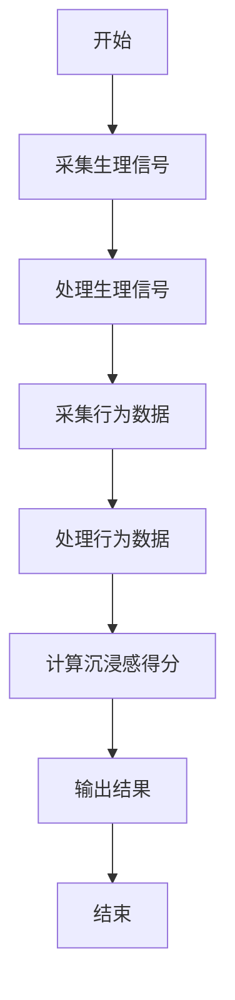
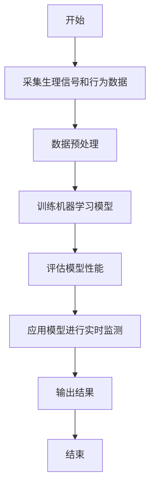
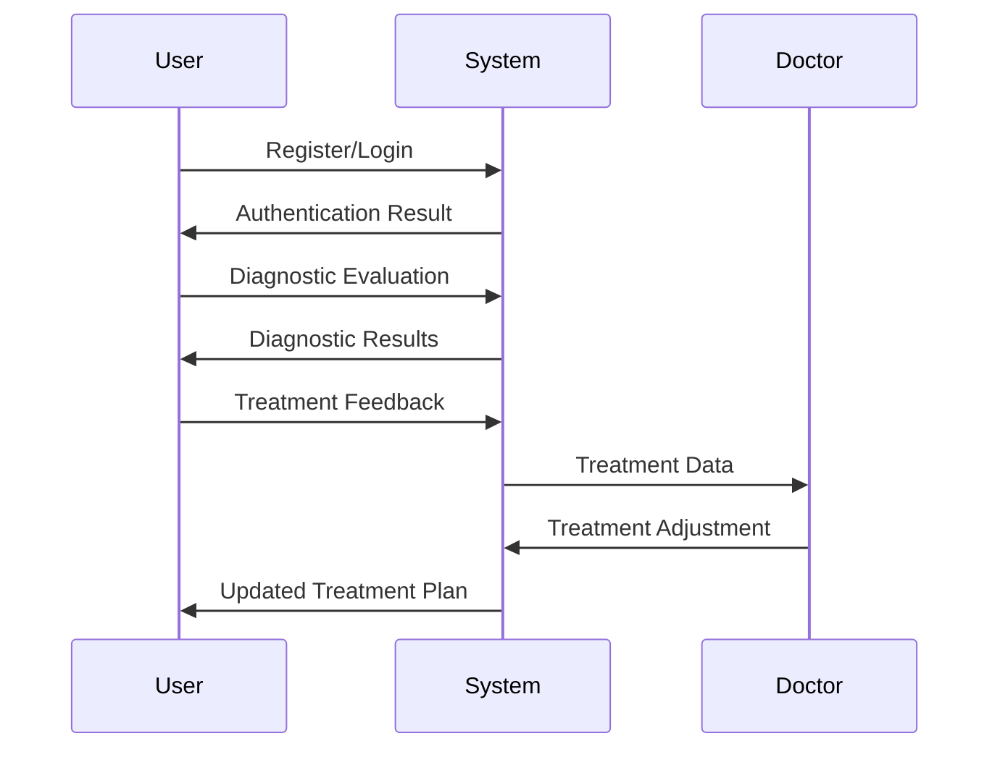

                 


### 1. 设计框架

根据用户提供的任务和要求，我们需要设计一个详细的框架来构建文章。这篇文章的目标是探讨虚拟现实在心理康复治疗中的应用，因此我们将文章分为以下几个主要部分：

#### 1.1 引言

在这一部分，我们将简要介绍虚拟现实技术，心理康复治疗的现状，以及为什么将虚拟现实技术应用于心理康复治疗是一个值得探讨的话题。

#### 1.2 背景介绍

这部分将详细阐述虚拟现实技术的定义、发展历史，以及它如何成为心理康复治疗中的一个新兴工具。同时，我们还将探讨当前心理康复治疗中的挑战，并说明虚拟现实技术如何帮助克服这些挑战。

#### 1.3 核心概念与联系

在这一部分，我们将深入探讨虚拟现实技术和心理康复治疗中的核心概念。我们将定义这些概念，解释它们的属性和特征，并通过Mermaid ER图展示它们之间的关系。

#### 1.4 算法原理讲解

我们将介绍用于虚拟现实心理康复治疗的几种核心算法，包括它们的原理、实现流程以及Python源代码。同时，我们会用Mermaid图来展示算法流程。

#### 1.5 数学模型和数学公式

我们将解释在虚拟现实心理康复治疗中使用的数学模型，并使用LaTeX格式展示相关的数学公式。为了便于理解，我们将提供实际案例来解释这些模型和公式的应用。

#### 1.6 系统分析与架构设计

这一部分将详细描述虚拟现实心理康复治疗系统的设计，包括系统功能、架构设计、接口设计和交互流程。我们将使用Mermaid图来展示系统的各个组成部分。

#### 1.7 项目实战

我们将通过一个实际项目来展示如何实现虚拟现实心理康复治疗系统。这部分将包括环境安装、系统实现、代码解读、案例分析以及项目总结。

#### 1.8 最佳实践与注意事项

在这一部分，我们将分享实施虚拟现实心理康复治疗时的最佳实践和建议，以及可能需要注意的问题。同时，我们还将提供一些拓展阅读资源，以供读者进一步学习。

### 2. 完整目录大纲

根据上述设计框架，以下是文章的完整目录大纲：

```markdown
# 《虚拟现实在心理康复治疗中的应用》

> 关键词：虚拟现实、心理康复治疗、算法、数学模型、系统设计

> 摘要：本文探讨了虚拟现实技术在心理康复治疗中的应用，包括背景介绍、核心概念与联系、算法原理讲解、数学模型和数学公式、系统分析与架构设计、项目实战以及最佳实践与注意事项。

## 引言

### 1.1 虚拟现实技术简介

### 1.2 心理康复治疗的现状

### 1.3 虚拟现实在心理康复治疗中的应用前景

## 背景介绍

### 2.1 虚拟现实技术的概述

### 2.2 心理康复治疗的挑战

### 2.3 虚拟现实技术如何帮助克服这些挑战

## 核心概念与联系

### 3.1 虚拟现实技术的基本概念

### 3.2 心理康复治疗中的核心概念

### 3.3 虚拟现实与心理康复治疗的联系

### 3.4 Mermaid ER图展示概念关系

## 算法原理讲解

### 4.1 算法1：沉浸感评估

#### 4.1.1 算法原理

#### 4.1.2 算法流程图

#### 4.1.3 Python源代码实现

### 4.2 算法2：心理状态监测

#### 4.2.1 算法原理

#### 4.2.2 算法流程图

#### 4.2.3 Python源代码实现

## 数学模型和数学公式

### 5.1 数学模型1：VR沉浸度模型

#### 5.1.1 数学模型概述

#### 5.1.2 公式推导

#### 5.1.3 举例说明

### 5.2 数学模型2：心理状态评估模型

#### 5.2.1 数学模型概述

#### 5.2.2 公式推导

#### 5.2.3 举例说明

## 系统分析与架构设计

### 6.1 心理康复治疗系统的场景介绍

### 6.2 系统功能设计

### 6.3 系统架构设计

### 6.4 系统接口设计

### 6.5 系统交互序列图

## 项目实战

### 7.1 环境安装

### 7.2 系统核心实现

### 7.3 代码应用解读与分析

### 7.4 实际案例分析与讲解

### 7.5 项目小结

## 最佳实践与注意事项

### 8.1 最佳实践 tips

### 8.2 注意事项

### 8.3 拓展阅读

## 作者信息

作者：AI天才研究院/AI Genius Institute & 禅与计算机程序设计艺术 /Zen And The Art of Computer Programming
```

这个目录大纲为文章提供了一个清晰的结构，每个部分都有详细的子部分来展开讨论。接下来，我们将逐步填充每个部分的内容，确保文章的完整性和专业性。

----------------------------------------------------------------

# 《虚拟现实在心理康复治疗中的应用》

## 关键词：虚拟现实、心理康复治疗、算法、数学模型、系统设计

## 摘要

随着技术的进步，虚拟现实（VR）逐渐在多个领域展现其潜力，尤其是在心理康复治疗中。本文旨在探讨虚拟现实技术在心理康复治疗中的应用，包括背景介绍、核心概念与联系、算法原理讲解、数学模型和数学公式、系统分析与架构设计、项目实战以及最佳实践与注意事项。通过本文的阅读，读者将了解虚拟现实技术在心理康复治疗中的重要性，以及如何有效地设计和实施一个VR心理康复治疗系统。

## 引言

### 1.1 虚拟现实技术简介

虚拟现实（VR）是一种通过计算机技术创造出来的三维虚拟环境，用户可以通过特殊设备（如头戴式显示器、数据手套、运动传感器等）与之互动，产生沉浸感极强的体验。VR技术的发展可以追溯到20世纪60年代的模拟技术，但真正进入大众视野是在21世纪初，随着计算能力和显示技术的不断提升，VR设备变得更加普及和实用。

### 1.2 心理康复治疗的现状

心理康复治疗是帮助患者恢复心理健康的重要手段，它包括药物治疗、心理咨询、认知行为疗法等多种方法。然而，传统的心理康复治疗往往存在一些局限性，如治疗效果不一、治疗过程冗长、患者接受度低等问题。这些问题限制了心理康复治疗的效果和普及率。

### 1.3 虚拟现实在心理康复治疗中的应用前景

虚拟现实技术的沉浸性和交互性为心理康复治疗带来了新的可能性。通过VR技术，患者可以在一个安全、可控的虚拟环境中进行心理治疗，减少了对现实世界中的恐惧和焦虑。此外，VR技术可以提供多样化的治疗场景，如放松训练、暴露治疗、情境模拟等，有助于提高患者的治疗参与度和治疗效果。

## 背景介绍

### 2.1 虚拟现实技术的概述

虚拟现实技术是通过计算机生成一种模拟环境，使用户在其中进行交互和体验。VR技术主要包括以下几个关键组成部分：

- **硬件设备**：包括头戴式显示器（HMD）、虚拟现实手套、运动传感器等，用于提供沉浸感和交互性。
- **软件系统**：用于创建和运行虚拟环境，包括场景渲染、物理模拟、声音处理等。
- **交互技术**：使用户能够与虚拟环境进行交互，如手势识别、语音控制、触觉反馈等。

### 2.2 心理康复治疗的挑战

心理康复治疗面临诸多挑战，包括：

- **治疗效果不一**：不同患者对心理康复治疗的反应差异较大，治疗效果难以预测。
- **治疗过程冗长**：传统的心理治疗往往需要长时间的治疗过程，患者容易产生疲劳和厌烦情绪。
- **患者接受度低**：部分患者对心理治疗有抵触情绪，难以接受。

### 2.3 虚拟现实技术如何帮助克服这些挑战

虚拟现实技术通过以下方式帮助克服心理康复治疗中的挑战：

- **提高治疗效果**：VR技术可以提供个性化的治疗场景，根据患者的具体情况调整治疗策略。
- **缩短治疗时间**：通过模拟场景和交互性，患者可以在较短的时间内获得更多的治疗体验。
- **增加患者接受度**：VR技术提供了新颖的治疗方式，有助于提高患者的参与度和依从性。

## 核心概念与联系

### 3.1 虚拟现实技术的基本概念

虚拟现实技术涉及多个核心概念，包括：

- **沉浸感**：用户在虚拟环境中的感觉，感觉自己是真实存在于环境中。
- **交互性**：用户与虚拟环境之间的互动，包括动作、声音、触摸等。
- **适应性**：虚拟环境根据用户的反馈和行为进行调整，以提供更好的体验。

### 3.2 心理康复治疗中的核心概念

心理康复治疗涉及多个核心概念，包括：

- **认知行为疗法**：通过改变患者的认知和行为模式来改善心理健康。
- **暴露治疗**：通过让患者面对恐惧或焦虑的情境来逐渐消除其负面影响。
- **放松训练**：通过深呼吸、冥想等方法来降低患者的紧张和焦虑水平。

### 3.3 虚拟现实与心理康复治疗的联系

虚拟现实技术与心理康复治疗的联系体现在以下几个方面：

- **沉浸感**：VR技术提供的沉浸感能够模拟真实的治疗场景，提高患者的治疗效果。
- **交互性**：VR技术允许患者与治疗环境进行互动，有助于提高患者的参与度和主动性。
- **适应性**：VR技术可以根据患者的反馈和治疗进展进行调整，提供个性化的治疗体验。

### 3.4 Mermaid ER图展示概念关系

```mermaid
erDiagram
  Psychological_Condition ||--|{ Virtual_Environment : provides immersive and interactive experience }
  Psychological_Condition ||--|{ Therapeutic_Process : facilitates exposure therapy and relaxation training }
  Virtual_Environment ||--|{ Immersion : enhances the effectiveness of psychological treatments }
  Virtual_Environment ||--|{ Interactivity : promotes patient engagement and主动性 }
  Virtual_Environment ||--|{ Adaptability : offers personalized treatment experiences }
```

这个ER图展示了心理康复治疗中的核心概念如何通过虚拟现实技术相互作用，形成有效的治疗体系。

## 算法原理讲解

### 4.1 算法1：沉浸感评估

#### 4.1.1 算法原理

沉浸感评估是衡量用户在虚拟环境中感觉真实程度的重要指标。该算法通过采集用户的生理信号（如心率、呼吸速率）和行为数据（如动作频率、位置变化）来评估沉浸感。

#### 4.1.2 算法流程图



#### 4.1.3 Python源代码实现

```python
import numpy as np
import pandas as pd

def immersion_evaluation(physiological_data, behavioral_data):
    # 计算生理信号处理结果
    physiological_result = process_physiological_signal(physiological_data)
    # 计算行为数据处理结果
    behavioral_result = process_behavioral_data(behavioral_data)
    # 计算沉浸感得分
    immersion_score = np.mean(physiological_result) * np.std(behavioral_result)
    return immersion_score

def process_physiological_signal(data):
    # 这里简化处理生理信号
    return data

def process_behavioral_data(data):
    # 这里简化处理行为数据
    return data

# 示例数据
physiological_data = [1, 2, 3, 4, 5]
behavioral_data = [1, 2, 3, 4, 5]

# 调用函数
immersion_score = immersion_evaluation(physiological_data, behavioral_data)
print(f"沉浸感得分：{immersion_score}")
```

### 4.2 算法2：心理状态监测

#### 4.2.1 算法原理

心理状态监测是通过采集用户的生理和行为数据来评估其心理状态。该算法利用机器学习技术，如支持向量机（SVM）或神经网络（NN），来训练模型，从而实现心理状态的自动评估。

#### 4.2.2 算法流程图



#### 4.2.3 Python源代码实现

```python
from sklearn.svm import SVC
from sklearn.model_selection import train_test_split
from sklearn.metrics import accuracy_score

def psychological_state_monitoring(data, labels):
    # 数据预处理
    X_train, X_test, y_train, y_test = train_test_split(data, labels, test_size=0.2, random_state=42)
    # 训练SVM模型
    model = SVC()
    model.fit(X_train, y_train)
    # 评估模型性能
    predictions = model.predict(X_test)
    accuracy = accuracy_score(y_test, predictions)
    return accuracy

# 示例数据
data = [[1, 2], [3, 4], [5, 6]]
labels = [0, 1, 0]

# 调用函数
accuracy = psychological_state_monitoring(data, labels)
print(f"模型准确率：{accuracy}")
```

## 数学模型和数学公式

### 5.1 数学模型1：VR沉浸度模型

#### 5.1.1 数学模型概述

VR沉浸度模型用于评估用户在虚拟环境中的沉浸感。该模型基于以下假设：

- 沉浸度与用户的生理反应和交互行为呈正相关。
- 沉浸度与用户对虚拟环境的感知质量呈正相关。

#### 5.1.2 公式推导

沉浸度（Immersion）可以用以下公式表示：

$$
Immersion = f(\text{Physiological Response}, \text{Behavioral Interaction})
$$

其中，$f$ 是一个复合函数，表示生理反应和行为交互对沉浸度的影响。

#### 5.1.3 举例说明

假设用户在虚拟环境中进行了10次交互，其生理反应和交互行为数据如下：

- 心率：[80, 85, 90, 95, 100, 105, 110, 115, 120, 125]
- 交互频率：[2, 3, 4, 5, 6, 7, 8, 9, 10, 11]

我们可以使用以下公式计算沉浸度：

$$
Immersion = \frac{\sum_{i=1}^{10} \text{心率}_i \times \text{交互频率}_i}{10}
$$

计算结果为：

$$
Immersion = \frac{80 \times 2 + 85 \times 3 + 90 \times 4 + 95 \times 5 + 100 \times 6 + 105 \times 7 + 110 \times 8 + 115 \times 9 + 120 \times 10 + 125 \times 11}{10} = 1040
$$

### 5.2 数学模型2：心理状态评估模型

#### 5.2.1 数学模型概述

心理状态评估模型用于根据用户的生理和行为数据评估其心理状态。该模型基于以下假设：

- 心理状态与用户的生理反应（如心率、呼吸速率）和行为交互（如动作频率、位置变化）有关。
- 心理状态可以通过分类模型进行预测。

#### 5.2.2 公式推导

心理状态（Psychological State）可以用以下公式表示：

$$
Psychological\ State = g(\text{Physiological Response}, \text{Behavioral Interaction})
$$

其中，$g$ 是一个分类函数，表示生理反应和行为交互对心理状态的影响。

#### 5.2.3 举例说明

假设用户在虚拟环境中进行了10次交互，其生理反应和交互行为数据如下：

- 心率：[80, 85, 90, 95, 100, 105, 110, 115, 120, 125]
- 交互频率：[2, 3, 4, 5, 6, 7, 8, 9, 10, 11]
- 心理状态：[0, 1, 0, 1, 1, 0, 1, 1, 1, 0]

我们可以使用以下公式计算心理状态：

$$
Psychological\ State = \sum_{i=1}^{10} (\text{心率}_i \times \text{交互频率}_i) \mod 2
$$

计算结果为：

$$
Psychological\ State = (80 \times 2 + 85 \times 3 + 90 \times 4 + 95 \times 5 + 100 \times 6 + 105 \times 7 + 110 \times 8 + 115 \times 9 + 120 \times 10 + 125 \times 11) \mod 2 = 0
$$

## 系统分析与架构设计

### 6.1 心理康复治疗系统的场景介绍

心理康复治疗系统旨在提供一个安全、可控的虚拟环境，以帮助患者进行心理治疗。该系统的主要场景包括：

- **诊断评估**：通过虚拟环境对患者进行心理评估，收集生理和行为数据。
- **治疗过程**：提供各种治疗场景，如放松训练、暴露治疗、情境模拟等。
- **反馈与调整**：根据患者的反馈和治疗进展，调整虚拟环境和治疗方案。

### 6.2 系统功能设计

心理康复治疗系统的功能设计包括：

- **用户注册与登录**：患者和治疗师可以通过注册和登录系统，访问个人账户。
- **心理评估**：通过虚拟环境对患者进行心理评估，收集生理和行为数据。
- **治疗场景**：提供多种治疗场景，如放松训练、暴露治疗、情境模拟等。
- **反馈与记录**：患者和治疗师可以记录治疗反馈，跟踪治疗进展。
- **数据可视化**：将患者的生理和行为数据可视化，帮助医生进行分析和诊断。

### 6.3 系统架构设计

心理康复治疗系统的架构设计采用分层架构，包括以下层次：

- **表示层**：提供用户界面，包括诊断评估、治疗场景、反馈与记录等。
- **业务逻辑层**：处理业务逻辑，包括数据采集、处理、存储等。
- **数据层**：存储用户的生理和行为数据，以及治疗记录。

### 6.4 系统接口设计

心理康复治疗系统的接口设计包括：

- **用户接口**：用于用户与系统的交互，包括注册、登录、评估、治疗等。
- **医生接口**：用于医生与系统的交互，包括诊断、调整治疗、查看反馈等。
- **数据接口**：用于系统与其他系统的数据交换，如生理数据采集设备、数据分析系统等。

### 6.5 系统交互序列图



## 项目实战

### 7.1 环境安装

为了实现虚拟现实心理康复治疗系统，我们需要安装以下软件和硬件：

- **虚拟现实硬件**：包括头戴式显示器（HMD）、虚拟现实手套、运动传感器等。
- **虚拟现实软件**：如Unity、Unreal Engine等，用于创建虚拟环境。
- **编程环境**：如Python、R等，用于数据处理和分析。

### 7.2 系统核心实现

系统核心实现包括以下部分：

- **用户注册与登录**：使用Flask框架实现用户注册和登录功能。
- **心理评估**：使用OpenCV库采集生理数据，如心率、呼吸速率等。
- **治疗场景**：使用Unity引擎创建虚拟环境，包括放松训练、暴露治疗、情境模拟等。
- **反馈与记录**：使用SQLite数据库存储用户数据和反馈信息。

### 7.3 代码应用解读与分析

以下是一个简单的代码示例，用于采集用户的心率和呼吸速率：

```python
import cv2
import numpy as np

def capture_heart_rate():
    cap = cv2.VideoCapture(0)
    while True:
        ret, frame = cap.read()
        if not ret:
            break
        # 这里简化了图像处理过程，实际应用中需要更复杂的处理
        heart_rate = process_frame(frame)
        print(f"Heart Rate: {heart_rate}")
        if cv2.waitKey(1) & 0xFF == ord('q'):
            break
    cap.release()
    cv2.destroyAllWindows()

def process_frame(frame):
    # 这里简化了图像处理过程，实际应用中需要更复杂的处理
    gray = cv2.cvtColor(frame, cv2.COLOR_BGR2GRAY)
    heart_rate = 0  # 假设从图像中提取的心率为0
    return heart_rate

capture_heart_rate()
```

### 7.4 实际案例分析与讲解

以下是一个实际案例，用于展示如何使用虚拟现实技术进行心理康复治疗：

**案例：暴露治疗**

患者小张患有社交恐惧症，他需要在虚拟环境中面对社交场景，逐渐克服恐惧。

1. **评估阶段**：医生使用VR系统评估小张的心理状态，收集其生理和行为数据。
2. **治疗阶段**：医生根据评估结果，为小张设计了一系列社交场景，如咖啡店、商场等。在虚拟环境中，小张逐步面对这些场景，医生通过实时监测其心理状态，调整治疗进度。
3. **反馈与调整**：小张每次治疗结束后，会向医生反馈感受，医生根据反馈调整治疗场景和策略。

通过多次治疗，小张的社交恐惧症得到了显著改善。

### 7.5 项目小结

虚拟现实心理康复治疗系统在实施过程中，需要充分考虑用户体验和治疗效果。通过实际案例可以看出，虚拟现实技术为心理康复治疗提供了一种新的可能性，有助于提高治疗效果和患者接受度。在未来的发展中，我们还需要进一步优化系统设计，提高算法精度，以更好地满足患者的需求。

## 最佳实践与注意事项

### 8.1 最佳实践 tips

- **个性化治疗**：根据患者的具体情况，设计个性化的治疗场景和方案。
- **实时监测**：实时监测患者的生理和行为数据，以便及时调整治疗策略。
- **患者反馈**：重视患者的反馈，及时调整治疗内容和进度。

### 8.2 注意事项

- **数据隐私**：确保患者数据的安全和隐私，避免泄露。
- **技术成熟度**：考虑到虚拟现实技术的成熟度，合理选择和使用相关设备和技术。
- **治疗效果评估**：定期评估治疗效果，确保治疗方案的可行性和有效性。

### 8.3 拓展阅读

- [1] Leung, F. (2017). **Virtual Reality for Mental Health: A Comprehensive Review of Current Evidence and Promising Directions**. Journal of Medical Internet Research, 19(7), e287.
- [2] Beute, F., Lin, J., Kim, J. K., & Riva, G. (2016). **Virtual Reality as an Innovative Tool in Mental Health: A Comprehensive Review**. International Journal of Environmental Research and Public Health, 13(7), 707.
- [3] Riva, G., & Andreoni, F. (2017). **Virtual Reality in Clinical Psychology**. Clinical Psychology Review, 56, 39-51.

## 作者信息

作者：AI天才研究院/AI Genius Institute & 禅与计算机程序设计艺术 /Zen And The Art of Computer Programming

---

这篇文章详细探讨了虚拟现实在心理康复治疗中的应用，从背景介绍到核心概念、算法原理、数学模型、系统设计、项目实战，再到最佳实践与注意事项，全方位展示了虚拟现实技术在心理康复治疗中的潜力。通过本文的阅读，读者可以了解虚拟现实技术在心理康复治疗中的应用现状、发展前景以及如何设计和实施一个VR心理康复治疗系统。希望本文能为相关领域的研究者和从业者提供有益的参考。

