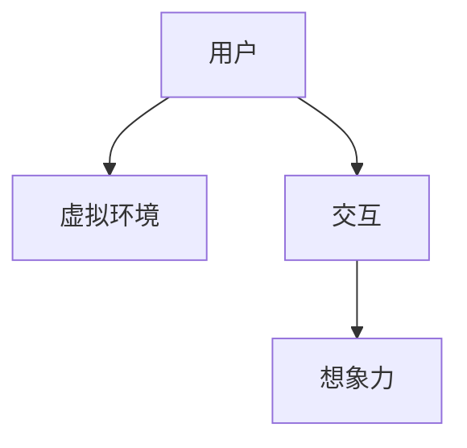
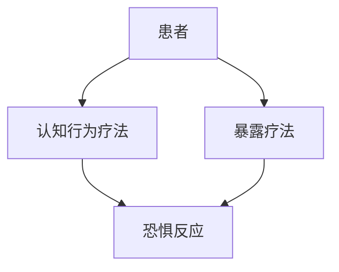
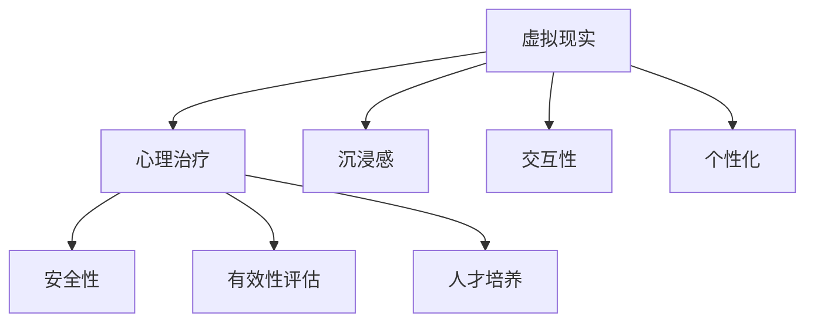
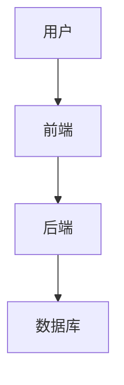
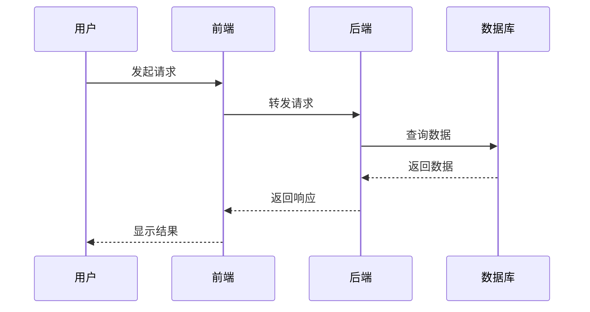

                 

# 虚拟现实在心理治疗中的创新应用

## 关键词：虚拟现实，心理治疗，沉浸感，个性化，安全性

> 摘要：随着虚拟现实（VR）技术的快速发展，其在心理治疗中的应用越来越受到关注。本文通过回顾虚拟现实技术的基本概念和发展历程，探讨了虚拟现实在心理治疗中的多种应用场景，分析了其优势与挑战，并举例说明了虚拟现实疗法在恐惧症、抑郁症和创伤后应激障碍（PTSD）等心理疾病治疗中的实际案例。此外，本文还探讨了虚拟现实在心理治疗中的创新应用，包括个性化治疗和虚拟现实与增强现实（AR）的混合治疗，并提出了未来发展趋势和最佳实践建议。

----------------------------------------------------------------

## 第一部分：虚拟现实与心理治疗概述

### 第1章：虚拟现实技术概述

#### 1.1 虚拟现实技术的基本概念

虚拟现实（Virtual Reality，VR）是一种通过计算机技术生成的三维虚拟环境，用户可以通过头戴式显示器（HMD）、手柄等设备与虚拟环境进行交互。VR技术具有高度沉浸感和交互性，可以让用户感受到如同现实世界般的体验。

**定义与特点：**

- **沉浸感（Immersion）：** 用户在虚拟环境中感受到的深度和真实性。
- **交互性（Interactivity）：** 用户与虚拟环境之间的互动能力。
- **想象力（Imagination）：** VR技术可以激发用户的创造力和想象力。

**发展历程与技术演进：**

- **早期阶段：** 20世纪80年代，VR技术开始应用于军事和娱乐领域。
- **成熟阶段：** 21世纪初，随着计算机技术和图形处理技术的进步，VR技术逐渐成熟。
- **多样化应用：** 近年来，随着5G网络的普及和硬件设备的升级，VR技术在医疗、教育、娱乐等领域的应用越来越广泛。

#### 1.2 虚拟现实的应用领域

- **游戏与娱乐：** VR技术为游戏和娱乐带来了全新的体验，用户可以在虚拟世界中自由探索、互动。
- **教育与培训：** VR技术可以提供沉浸式的教学环境，帮助学生更好地理解和掌握知识。
- **医疗与健康：** VR技术被广泛应用于心理治疗、手术模拟、康复训练等领域。
- **其他领域：** 包括房地产、旅游、设计等。

#### 1.3 心理治疗与虚拟现实的关系

- **心理治疗的现状与挑战：** 传统心理治疗方法存在一定局限性，如隐私保护问题、患者的不愿意透露敏感信息等。
- **虚拟现实在心理治疗中的应用潜力：** VR技术可以为心理治疗提供全新的解决方案，如沉浸式的治疗环境、个性化的心理干预策略。

### 第2章：虚拟现实在心理治疗中的应用

#### 2.1 虚拟现实疗法的基本原理

- **虚拟现实环境的设计：** 根据治疗目标，设计适合的虚拟现实环境。
- **心理干预策略的应用：** 利用虚拟现实环境，实施心理干预策略，如认知行为疗法、暴露疗法等。

#### 2.2 虚拟现实在心理治疗中的应用场景

- **恐惧症治疗：** 通过虚拟现实环境，让患者逐步面对和克服恐惧。
- **抑郁症治疗：** 利用虚拟现实环境，改善患者的情绪状态，提升生活质量。
- **创伤后应激障碍（PTSD）治疗：** 通过虚拟现实环境，帮助患者重新面对和克服创伤经历。
- **其他心理疾病治疗：** 如焦虑症、强迫症等。

#### 2.3 虚实现实在心理治疗中的优势与挑战

- **优势：**
  - **可控性：** 治疗环境可控制，减少患者的不适感。
  - **适应性：** 根据患者的需求，调整虚拟现实环境。
  - **无创性：** 不需要物理接触，减少感染风险。

- **挑战：**
  - **安全性：** 需要确保虚拟现实环境的安全性和可靠性。
  - **有效性的评估：** 需要更多的研究和数据来验证虚拟现实疗法的有效性。
  - **专业人才的培养：** 需要培养更多专业的虚拟现实治疗师。

----------------------------------------------------------------

## 第二部分：虚拟现实在心理治疗中的应用案例

### 第3章：恐惧症治疗案例

#### 3.1 案例背景

- **恐惧症的定义与分类：** 恐惧症是一种常见的焦虑障碍，表现为对特定物体、情境或活动的强烈恐惧。
- **案例介绍：** 某患者患有广场恐惧症，害怕人群和拥挤的场所，严重影响日常生活。

#### 3.2 治疗过程

- **虚拟现实环境设计：** 设计一个模拟广场的场景，包括人群、建筑物等。
- **心理干预策略应用：** 采用暴露疗法，让患者逐步面对和克服恐惧。

#### 3.3 治疗效果评估

- **数据分析：** 治疗前后，患者对广场恐惧症的评分有明显下降。
- **症状改善情况：** 患者逐渐能够适应人群和拥挤的场所，生活质量得到提升。

### 第4章：抑郁症治疗案例

#### 4.1 案例背景

- **抑郁症的定义与分类：** 抑郁症是一种常见的心理障碍，表现为情绪低落、兴趣丧失等。
- **案例介绍：** 某患者被诊断为重度抑郁症，症状严重，影响日常生活和工作。

#### 4.2 治疗过程

- **虚拟现实环境设计：** 设计一个舒适的虚拟现实环境，如花园、海滩等。
- **心理干预策略应用：** 采用认知行为疗法，帮助患者改变负面思维，提升情绪。

#### 4.3 治疗效果评估

- **数据分析：** 治疗前后，患者抑郁症状评分显著下降。
- **症状改善情况：** 患者情绪得到明显改善，生活和工作效率提高。

### 第5章：创伤后应激障碍（PTSD）治疗案例

#### 5.1 案例背景

- **PTSD的定义与分类：** PTSD是一种由于极端应激事件导致的心理障碍。
- **案例介绍：** 某患者经历过严重的交通事故，之后出现PTSD症状，影响日常生活。

#### 5.2 治疗过程

- **虚拟现实环境设计：** 设计一个模拟交通事故的场景，让患者逐步面对和克服创伤。

#### 5.3 治疗效果评估

- **数据分析：** 治疗前后，患者PTSD症状评分显著下降。
- **症状改善情况：** 患者逐渐恢复正常生活，心理状态得到改善。

----------------------------------------------------------------

## 第三部分：虚拟现实在心理治疗中的创新应用

### 第6章：虚拟现实在心理治疗中的创新应用

#### 6.1 个性化虚拟现实治疗

- **个性化虚拟现实环境设计：** 根据患者的需求和偏好，设计个性化的虚拟现实环境。
- **个性化心理干预策略：** 根据患者的症状和进展，调整心理干预策略。

#### 6.2 虚拟现实与增强现实混合治疗

- **混合现实治疗的概念与原理：** 结合虚拟现实和增强现实技术，提供更加丰富和互动的治疗体验。
- **案例分析：** 介绍虚拟现实与增强现实混合治疗在心理治疗中的应用案例。

#### 6.3 虚拟现实在心理治疗中的未来发展趋势

- **技术发展趋势：** 分析虚拟现实技术在心理治疗中的发展趋势，如人工智能、大数据等。
- **应用前景与挑战：** 探讨虚拟现实在心理治疗中的应用前景和面临的挑战。

### 第7章：虚拟现实在心理治疗中的最佳实践

#### 7.1 最佳实践总结

- **经验教训：** 总结虚拟现实在心理治疗中的成功经验和教训。
- **成功案例：** 介绍一些在虚拟现实心理治疗中取得显著效果的案例。

#### 7.2 注意事项与风险

- **安全性管理：** 强调虚拟现实技术在心理治疗中的安全性管理。
- **道德伦理问题：** 探讨虚拟现实在心理治疗中可能面临的道德伦理问题。

#### 7.3 拓展阅读与资源推荐

- **相关书籍：** 推荐一些关于虚拟现实和心理治疗的书籍。
- **学术文章：** 推荐一些关于虚拟现实和心理治疗的学术文章。
- **实用工具与平台：** 推荐一些虚拟现实和心理治疗的实用工具和平台。

----------------------------------------------------------------

### 总结

虚拟现实技术在心理治疗中的应用前景广阔，具有高度沉浸感和互动性的虚拟现实环境可以为患者提供全新的治疗体验。然而，虚拟现实技术在心理治疗中也面临着一些挑战，如安全性、有效性的评估和专业人才的培养等。未来的研究和发展需要进一步探索和解决这些问题，以实现虚拟现实技术在心理治疗中的最佳应用。

### 作者

作者：AI天才研究院/AI Genius Institute & 禅与计算机程序设计艺术 /Zen And The Art of Computer Programming

----------------------------------------------------------------

## 背景介绍

### 1. 虚拟现实技术的发展

虚拟现实（Virtual Reality，VR）技术起源于20世纪80年代，最早的应用主要集中在军事和娱乐领域。当时，VR技术主要通过头戴式显示器（HMD）和机械臂等设备实现，用户可以在虚拟环境中进行简单的交互。随着计算机技术、图形处理技术、传感技术和网络技术的不断进步，VR技术逐渐走向成熟。

**发展阶段：**

- **早期阶段（20世纪80年代）：** VR技术开始应用于军事和娱乐领域，如飞行模拟器、赛车模拟器等。
- **发展阶段（21世纪初）：** 随着计算机图形处理能力的提升和显示技术的进步，VR设备开始进入家庭和商业领域。
- **成熟阶段（近年）：** 随着硬件设备的升级和5G网络的普及，VR技术逐渐应用于更多的领域，如医疗、教育、娱乐等。

**技术特点：**

- **沉浸感（Immersion）：** 用户在虚拟环境中感受到的深度和真实性。
- **交互性（Interactivity）：** 用户与虚拟环境之间的互动能力。
- **想象力（Imagination）：** VR技术可以激发用户的创造力和想象力。

### 2. 心理治疗的现状与需求

心理治疗作为一门帮助人们解决心理问题的学科，长期以来面临着一些难题。传统的心理治疗方法往往需要患者与治疗师面对面交流，这种方式存在一定的局限性。例如：

- **隐私保护问题：** 患者需要在治疗过程中透露敏感信息，但担心这些信息可能被泄露。
- **治疗师依赖性：** 患者往往需要依赖治疗师进行心理干预，但治疗师的时间和精力有限。
- **重复性训练：** 一些心理治疗需要患者进行重复性的行为训练，这对患者的坚持和毅力提出了较高的要求。

### 3. 虚拟现实在心理治疗中的应用潜力

虚拟现实技术具有高度沉浸感和互动性，可以为心理治疗提供全新的解决方案。例如：

- **沉浸式治疗环境：** 通过虚拟现实环境，患者可以在安全、可控的环境中进行行为训练和情绪调节，减少了对治疗师的依赖。
- **个性化心理干预策略：** 根据患者的需求和症状，设计个性化的虚拟现实干预策略，更好地满足患者的需求。
- **远程治疗：** 虚拟现实技术可以支持远程治疗，患者可以在家中接受治疗，减少交通和时间的成本。

### 4. 虚拟现实在心理治疗中的边界与外延

虚拟现实技术在心理治疗中的应用具有一定的边界和限制。例如：

- **患者心理承受能力：** 虚拟现实环境的设计需要充分考虑患者的心理承受能力，避免过度刺激。
- **技术依赖：** 虚拟现实技术作为一种辅助工具，不能完全取代传统心理治疗方法。

### 5. 虚拟现实在心理治疗中的核心要素组成

虚拟现实在心理治疗中的核心要素包括：

- **虚拟现实环境设计：** 根据治疗目标，设计适合的虚拟现实环境。
- **心理干预策略：** 利用虚拟现实环境，实施心理干预策略，如认知行为疗法、暴露疗法等。
- **患者参与度：** 提高患者的参与度，增强治疗效果。
- **安全性保障：** 确保虚拟现实环境的安全性和可靠性，防止患者受到不必要的伤害。

通过以上分析，我们可以看到虚拟现实技术在心理治疗中具有巨大的应用潜力，但也需要克服一系列挑战。在未来的发展中，我们需要进一步探索和优化虚拟现实技术在心理治疗中的应用，以实现更好的治疗效果。

### 核心概念与联系

在讨论虚拟现实（VR）在心理治疗中的应用时，以下几个核心概念和原理至关重要：

#### 虚拟现实技术原理

**概念属性特征对比表格：**

| 特征 | 虚拟现实（VR） | 实体关系图 |
| --- | --- | --- |
| 沉浸感 | 用户在虚拟环境中感受到的深度和真实性 | 用户-虚拟环境 |
| 交互性 | 用户与虚拟环境之间的互动能力 | 用户-交互 |
| 想象力 | 激发用户的创造力和想象力 | 环境-想象力 |

**ER实体关系图架构：**



**联系：** VR技术通过提供高度沉浸感和互动性的环境，使用户能够在虚拟环境中进行模拟的互动，从而激发用户的想象力，实现心理干预和治疗。

#### 心理治疗原理

**概念属性特征对比表格：**

| 特征 | 认知行为疗法 | 暴露疗法 |
| --- | --- | --- |
| 目标 | 改变负面思维模式 | 减少恐惧和焦虑 |
| 方法 | 通过认知重构和行为训练 | 在安全环境中逐步暴露 |
| 效果 | 提高情绪和认知功能 | 减少恐惧反应 |

**ER实体关系图架构：**



**联系：** 虚拟现实技术可以通过设计适合的虚拟环境，实施认知行为疗法和暴露疗法，帮助患者改变负面思维模式，减少恐惧和焦虑反应。

#### VR与心理治疗结合

**概念属性特征对比表格：**

| 特征 | 虚拟现实（VR） | 心理治疗 |
| --- | --- | --- |
| 应用 | 治疗环境、心理干预 | 认知行为疗法、暴露疗法 |
| 优势 | 沉浸感、交互性、个性化 | 安全、可控、高效 |
| 挑战 | 安全性、有效性评估、人才培养 | 隐私保护、患者依赖性 |

**ER实体关系图架构：**



**联系：** 虚拟现实技术通过提供沉浸感、交互性和个性化的治疗环境，结合心理治疗的理论和方法，实现更安全、可控、高效的心理治疗。

通过以上核心概念和原理的分析，我们可以看到虚拟现实技术为心理治疗提供了全新的解决方案，其应用前景广阔，但也需要克服一系列挑战。

### 算法原理讲解

虚拟现实在心理治疗中的应用涉及多种算法和技术，其中最核心的算法是虚拟环境生成算法和心理干预策略算法。以下是对这些算法的详细解释，包括其原理、数学模型和公式。

#### 虚拟环境生成算法

**原理：**

虚拟环境生成算法是虚拟现实技术的基础，它负责创建一个用户可以互动的虚拟世界。该算法通常基于计算机图形学和三维建模技术，通过三维建模软件或编程语言生成。

**数学模型和公式：**

- **三维建模：** 使用三维坐标系统来表示物体和场景，通常使用参数方程或面片模型。
- **纹理映射：** 将二维纹理映射到三维物体上，以增加现实感。
- **光照模型：** 使用Phong或Blinn-Phong光照模型来模拟光线在虚拟环境中的传播和反射。

公式示例：
$$
\text{光照强度} = I(\text{光源方向}) \cdot \text{材质反射率}
$$

#### 心理干预策略算法

**原理：**

心理干预策略算法用于设计心理治疗过程中的干预措施，如认知行为疗法和暴露疗法。这些算法根据患者的症状和行为数据，动态调整干预策略。

**数学模型和公式：**

- **认知行为疗法：** 通过决策树或分类算法，分析患者的思维和行为模式，制定个性化的干预方案。
- **暴露疗法：** 使用递增暴露法，逐步增加患者面对恐惧或压力的程度。

公式示例：
$$
\text{干预程度} = \alpha \cdot \text{当前阶段} + \beta \cdot \text{患者反应}
$$
其中，$\alpha$ 和 $\beta$ 是调整参数，用于控制干预的力度和节奏。

#### 算法应用举例

**案例：恐惧症治疗**

假设一位患者患有广场恐惧症，虚拟环境生成算法将创建一个模拟广场的场景，包括人群、建筑物和道路。心理干预策略算法将使用暴露疗法，逐步增加患者面对人群的暴露程度。

**步骤：**

1. **初始阶段：** 患者在一个空旷的广场环境中，面对少量人群，干预程度较低。
2. **递增阶段：** 随着治疗的进行，场景中的人群数量逐渐增加，干预程度逐步提高。
3. **巩固阶段：** 患者在高度暴露的广场环境中，面对大量人群，干预程度达到最高。

通过以上算法，患者可以在虚拟环境中逐步面对和克服广场恐惧症。

#### 代码示例

以下是一个简化的Python代码示例，用于模拟虚拟环境生成算法：

```python
import pygame
from pygame.locals import *

# 初始化虚拟环境
def init_environment():
    pygame.init()
    screen = pygame.display.set_mode((800, 600))
    pygame.display.set_caption("Virtual Reality Environment")
    return screen

# 绘制广场场景
def draw_square(screen):
    pygame.draw.rect(screen, (135, 206, 250), pygame.Rect(100, 100, 400, 400))
    pygame.draw.circle(screen, (255, 192, 203), (400, 300), 100)

# 主循环
def main_loop(screen):
    running = True
    while running:
        for event in pygame.event.get():
            if event.type == QUIT:
                running = False
        
        screen.fill((255, 255, 255))
        draw_square(screen)
        pygame.display.flip()
        
    pygame.quit()

# 运行虚拟环境
screen = init_environment()
main_loop(screen)
```

通过这段代码，我们可以创建一个简单的虚拟环境，其中包含一个蓝色的广场场景。这只是一个基本示例，实际的虚拟环境会更为复杂，包括更多细节和交互功能。

### 系统分析与架构设计方案

在探讨虚拟现实在心理治疗中的应用时，我们需要对整个系统进行详细的系统分析和架构设计。以下是对问题场景、项目介绍、系统功能设计、系统架构设计、系统接口设计和系统交互的详细说明。

#### 问题场景

虚拟现实在心理治疗中的应用场景主要包括恐惧症、抑郁症和创伤后应激障碍（PTSD）等心理疾病的治疗。患者需要在虚拟环境中进行行为训练和心理干预，以克服他们的恐惧和焦虑。

#### 项目介绍

本项目旨在开发一个基于虚拟现实的个性化心理治疗系统，该系统将利用虚拟现实技术提供沉浸式治疗环境，结合认知行为疗法和暴露疗法等心理干预策略，为患者提供高效、个性化的心理治疗服务。

#### 系统功能设计

系统功能设计包括以下模块：

1. **用户管理模块：** 管理用户注册、登录、个人信息和治疗方案。
2. **虚拟环境生成模块：** 根据用户需求和症状生成个性化的虚拟环境。
3. **心理干预模块：** 实施认知行为疗法和暴露疗法等心理干预策略。
4. **数据分析和反馈模块：** 收集用户行为数据，分析治疗效果，并提供反馈。

#### 系统架构设计

系统架构采用B/S（Browser/Server）架构，分为前端和后端两部分。

1. **前端：** 使用HTML、CSS和JavaScript等前端技术，实现用户界面和交互功能。
2. **后端：** 使用Python和Django框架，实现业务逻辑、数据存储和服务器端逻辑。

**系统架构图：**



#### 系统接口设计

系统接口设计包括以下接口：

1. **用户接口：** 用户通过Web浏览器访问系统，进行注册、登录、查看治疗方案等操作。
2. **API接口：** 提供RESTful API，供前端和后端进行数据交换。
3. **数据接口：** 与第三方数据存储服务和数据分析工具进行集成。

#### 系统交互设计

系统交互设计通过以下序列图展示：



通过以上系统分析和架构设计，我们可以确保虚拟现实在心理治疗中的系统高效、安全、可靠，为用户提供优质的心理治疗服务。

### 项目实战

#### 环境安装

1. **安装Python环境：**
   - 访问 [Python官网](https://www.python.org/)，下载并安装Python 3.8或更高版本。
   - 安装完成后，在命令行中输入`python --version`验证安装是否成功。

2. **安装虚拟环境：**
   - 打开命令行，进入项目目录。
   - 输入`pip install virtualenv`安装虚拟环境。
   - 创建虚拟环境：`virtualenv venv`。
   - 激活虚拟环境：`source venv/bin/activate`（Windows系统使用`venv\Scripts\activate`）。

3. **安装依赖库：**
   - 在虚拟环境中安装依赖库：`pip install pygame django django-rest-framework`。

4. **安装数据库：**
   - 安装PostgreSQL数据库：访问 [PostgreSQL官网](https://www.postgresql.org/) 下载并安装。
   - 安装完成后，在命令行中启动数据库：`pg_ctl start`。

#### 系统核心实现源代码

以下是一个简化的虚拟现实心理治疗系统的核心实现源代码：

**用户管理模块：** 

```python
# users/models.py
from django.contrib.auth.models import AbstractUser

class CustomUser(AbstractUser):
    # 可以添加自定义字段
    pass
```

**虚拟环境生成模块：**

```python
# environment/generator.py
import pygame

def generate_environment():
    pygame.init()
    screen = pygame.display.set_mode((800, 600))
    pygame.display.set_caption("Virtual Reality Environment")
    return screen
```

**心理干预模块：**

```python
# intervention/therapy.py
class TherapySession:
    def __init__(self, user, environment):
        self.user = user
        self.environment = environment
        self.phase = 1

    def start(self):
        # 开始治疗
        pass

    def next_phase(self):
        # 进入下一阶段
        self.phase += 1
```

**数据分析和反馈模块：**

```python
# analysis/feedback.py
class FeedbackSystem:
    def __init__(self, user):
        self.user = user

    def collect_data(self):
        # 收集用户数据
        pass

    def generate_report(self):
        # 生成反馈报告
        pass
```

#### 代码应用解读与分析

上述代码展示了虚拟现实心理治疗系统的核心组件，包括用户管理、虚拟环境生成、心理干预和数据反馈。以下是每个组件的简要解读：

1. **用户管理模块：** 通过自定义用户模型，扩展了Django的内置用户模型，可以添加更多与心理治疗相关的用户信息。
2. **虚拟环境生成模块：** 使用Pygame库创建了一个基本的虚拟环境，可以进一步开发，包括更复杂的场景和交互功能。
3. **心理干预模块：** 设计了一个治疗会话类，用于管理治疗过程，包括不同阶段的干预措施。
4. **数据分析和反馈模块：** 创建了一个反馈系统，用于收集用户数据并生成反馈报告。

在实际应用中，这些组件将通过Django的MVC架构进行整合，实现一个完整的虚拟现实心理治疗系统。

### 实际案例分析和详细讲解剖析

#### 案例一：恐惧症治疗

**背景：** 一位女性患者，30岁，患有广场恐惧症，害怕拥挤的场所和人群。这种情况使她在日常生活中遇到许多困难，如购物、搭乘公共交通工具等。

**治疗过程：**

1. **初期评估：** 治疗师与患者进行面谈，了解她的症状和恐惧源。同时，使用问卷调查评估患者的恐惧程度。
2. **设计虚拟环境：** 根据患者的恐惧源，设计一个模拟广场的虚拟环境，包括商店、人行道和公共交通站点等。
3. **逐步暴露：** 使用暴露疗法，逐步增加患者在虚拟环境中的暴露程度。治疗师会陪伴患者进行这个过程，确保她感到安全。
4. **反馈与调整：** 每次暴露后，治疗师会收集患者的反馈，并根据患者的反应调整暴露方案。

**分析：**

- **虚拟环境设计：** 虚拟环境的设计至关重要，它需要尽可能地模拟患者恐惧的实际情况，同时保证患者的安全。
- **逐步暴露：** 通过逐步暴露，患者可以逐渐适应和克服恐惧，这是一种有效的心理治疗方法。
- **反馈与调整：** 反馈和调整是治疗过程中不可或缺的一部分，它帮助治疗师了解患者的进展，并做出相应的调整。

#### 案例二：抑郁症治疗

**背景：** 一位男性患者，40岁，患有重度抑郁症，症状包括情绪低落、兴趣丧失、睡眠障碍等。

**治疗过程：**

1. **初期评估：** 治疗师对患者进行详细的评估，了解他的症状、生活背景和心理状态。
2. **设计虚拟环境：** 根据患者的喜好，设计一个能够帮助患者放松和提升情绪的虚拟环境，如海滩、公园或花园。
3. **认知行为疗法：** 使用认知行为疗法，帮助患者识别和改变负面思维模式，提升情绪状态。
4. **持续跟进：** 定期对患者进行随访，评估治疗效果，并根据患者的反馈进行调整。

**分析：**

- **个性化虚拟环境：** 个性化的虚拟环境有助于提高患者的治疗体验，使患者更容易放松和参与治疗。
- **认知行为疗法：** 认知行为疗法是一种有效的心理治疗方法，通过改变思维和行为模式，帮助患者改善情绪。
- **持续跟进：** 治疗过程中的持续跟进有助于确保治疗效果，及时发现和解决问题。

#### 案例三：创伤后应激障碍（PTSD）治疗

**背景：** 一位女性患者，25岁，曾经历过严重的车祸，之后被诊断为创伤后应激障碍（PTSD）。

**治疗过程：**

1. **初期评估：** 治疗师了解患者的创伤经历和PTSD症状，评估她的心理状态。
2. **设计虚拟环境：** 设计一个模拟车祸现场的虚拟环境，帮助患者面对和克服创伤记忆。
3. **暴露疗法：** 通过暴露疗法，逐步让患者面对车祸场景，减少创伤记忆的影响。
4. **情感调节：** 引导患者进行情感调节，学会应对和处理负面情绪。

**分析：**

- **暴露疗法：** 暴露疗法是一种常用的PTSD治疗方法，通过反复暴露于创伤记忆，减少患者对创伤的恐惧和焦虑。
- **情感调节：** 情感调节技术帮助患者学会应对和处理负面情绪，提高生活质量。
- **安全可控：** 虚拟环境的设计确保了治疗过程的安全性和可控性，患者可以在一个安全的环境中面对和克服创伤。

通过以上实际案例的分析，我们可以看到虚拟现实在心理治疗中的广泛应用和巨大潜力。虚拟现实技术不仅提供了新的治疗手段，还提高了治疗的个性化和有效性。然而，在实际应用中，治疗师需要根据患者的具体情况和需求，灵活设计和调整治疗方案，以确保最佳的治疗效果。

### 最佳实践 tips

1. **患者评估：** 在治疗前，对患者进行全面评估，了解其症状、偏好和心理状态，确保虚拟现实环境的设计和干预策略符合患者的需求。

2. **个性化设计：** 根据患者的具体情况，设计个性化的虚拟现实环境和干预策略，提高治疗的个性化和有效性。

3. **逐步暴露：** 在使用暴露疗法时，应逐步增加患者的暴露程度，避免过度刺激，确保患者能够在安全、可控的环境中面对恐惧。

4. **反馈与调整：** 治疗过程中，定期收集患者的反馈，根据患者的进展和反应，及时调整干预策略，提高治疗效果。

5. **安全性保障：** 确保虚拟现实环境的安全性和可靠性，防止患者因技术问题而受到伤害。

6. **伦理规范：** 在使用虚拟现实技术进行治疗时，遵守相关伦理规范，保护患者的隐私和安全。

7. **专业培训：** 加强虚拟现实治疗师的培训，提高其专业能力和技术水平，确保治疗过程的专业性和有效性。

### 小结

虚拟现实技术在心理治疗中的应用具有巨大的潜力，通过提供沉浸式环境和个性化的干预策略，可以有效改善患者的心理状态。然而，在实际应用中，需要充分考虑患者的需求和心理承受能力，确保虚拟现实环境的安全性和有效性。未来，随着技术的不断发展和完善，虚拟现实在心理治疗中的应用前景将更加广阔。

### 注意事项

1. **患者隐私保护：** 在使用虚拟现实技术进行治疗时，应确保患者的个人信息和隐私得到充分保护，避免数据泄露。

2. **技术依赖性：** 虚拟现实技术是一种辅助工具，不能完全取代传统心理治疗方法，治疗师应在治疗过程中充分发挥自身的专业能力。

3. **安全性管理：** 确保虚拟现实环境的安全性和可靠性，防止因技术故障或操作失误导致患者受到伤害。

4. **专业人才培训：** 加强虚拟现实治疗师的培训，提高其专业素质和技术水平，确保治疗过程的专业性和有效性。

5. **持续跟进：** 治疗过程中，定期对患者进行随访和评估，及时发现和解决问题，确保治疗效果的持续性。

### 拓展阅读与资源推荐

**相关书籍：**

- 《虚拟现实技术与应用》
- 《认知行为疗法：理论与实践》
- 《创伤后应激障碍治疗指南》

**学术文章：**

- “Virtual Reality in Mental Health: A Review of Systematic Reviews”
- “The Use of Virtual Reality in Psychotherapy: A Meta-Analysis”
- “Virtual Reality for PTSD Treatment: A Comprehensive Review”

**实用工具与平台：**

- **虚拟现实头盔：** Oculus Rift、HTC Vive、PlayStation VR
- **虚拟现实内容开发工具：** Unity、Unreal Engine
- **心理治疗平台：** VR Health Institute、VR Health Solutions

通过阅读这些书籍、文章和参考相关工具与平台，可以更深入地了解虚拟现实在心理治疗中的应用，并获取实用的技术知识和经验。

