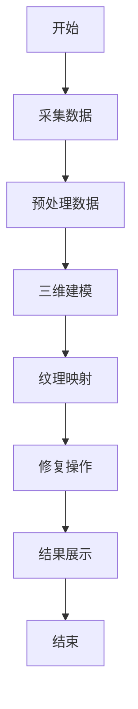
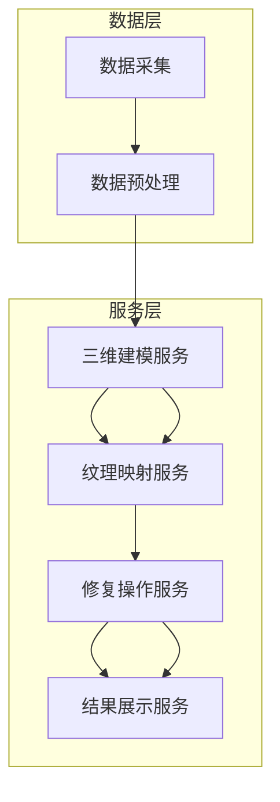
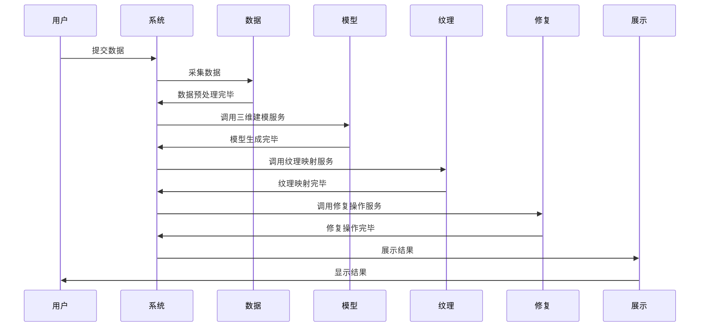

                 

# 虚拟现实在文化遗产保护中的创新应用

> 关键词：虚拟现实、文化遗产保护、技术创新、算法原理、系统设计、项目实战

> 摘要：本文旨在探讨虚拟现实技术在文化遗产保护中的应用，分析其在展示、修复和教育等方面的创新，以及相关的算法原理和系统设计。通过详细的项目实战案例分析，提供实际操作经验和未来研究方向。

## 第一部分：背景介绍

### 第1章：虚拟现实在文化遗产保护中的现状与挑战

#### 1.1 问题背景

**1.1.1 虚拟现实技术概述**

虚拟现实（Virtual Reality，VR）是一种通过计算机模拟产生三维空间的虚拟环境，使参与者能够在其中进行交互体验的技术。它结合了计算机图形学、人机交互、传感器技术等多个领域，为用户提供了沉浸式的感知体验。

**1.1.2 文化遗产保护的重要性**

文化遗产是人类文明的记忆和见证，对它们进行保护和传承是国家和民族发展的基础。然而，许多文化遗产面临着自然侵蚀、战争破坏、非法交易等威胁，亟需有效的保护手段。

**1.1.3 虚拟现实技术在文化遗产保护中的应用现状**

近年来，虚拟现实技术在文化遗产保护中得到了广泛应用。通过数字化手段，文化遗产可以以虚拟形式进行展示、修复和教育，为公众提供更直观、更便捷的接触途径。

#### 1.2 问题描述

**1.2.1 文化遗产保护的难题**

文化遗产保护的挑战包括：实物保护难度大、资金投入不足、技术手段有限等。传统保护方式难以满足日益增长的保护需求和公众的互动需求。

**1.2.2 虚拟现实技术的局限性**

尽管虚拟现实技术在文化遗产保护中具有优势，但其仍然存在一些局限性，如技术成本高、用户设备要求高等。

#### 1.3 问题解决

**1.3.1 创新应用的必要性**

为了克服虚拟现实技术的局限性，我们需要在技术、方法上不断创新，探索更高效、更经济的应用方式。

**1.3.2 技术改进与优化方向**

这包括提高虚拟现实技术的实时性、降低成本、增强交互性等。同时，还需要开发适合文化遗产保护特点的算法和系统。

#### 1.4 边界与外延

**1.4.1 文化遗产类型的多样性**

文化遗产包括建筑、文物、历史遗址等多种类型，不同类型的遗产保护需求各异。

**1.4.2 技术应用的适用范围**

虚拟现实技术在文化遗产保护中的适用范围广泛，不仅限于展示，还可以应用于修复、教育和研究等领域。

#### 1.5 概念结构与核心要素组成

**1.5.1 虚拟现实技术核心概念**

虚拟现实技术包括虚拟环境生成、传感器数据融合、人机交互等多个核心概念。

**1.5.2 文化遗产保护的关键要素**

文化遗产保护的关键要素包括：数字化技术、数据分析、可视化技术等。

### 第2章：虚拟现实技术原理与应用

#### 2.1 虚拟现实技术原理

**2.1.1 虚拟现实技术的基本原理**

虚拟现实技术通过计算机生成虚拟环境，结合传感器技术和人机交互技术，使用户能够在虚拟环境中进行沉浸式交互。

**2.1.2 虚拟现实技术的关键技术**

虚拟现实技术的关键技术包括：三维建模、实时渲染、传感器数据融合等。

#### 2.2 虚拟现实技术在文化遗产保护中的应用

**2.2.1 虚拟现实技术在文化遗产展示中的应用**

虚拟现实技术可以为文化遗产提供沉浸式展示，让公众更直观地了解遗产。

**2.2.2 虚拟现实技术在文化遗产修复中的应用**

虚拟现实技术可以帮助专家进行文化遗产的修复，提高修复效率和质量。

**2.2.3 虚拟现实技术在文化遗产教育中的应用**

虚拟现实技术可以为教育提供生动的教学资源，培养公众对文化遗产的保护意识。

#### 2.3 虚拟现实技术与文化遗产保护的关联分析

**2.3.1 关联性分析**

虚拟现实技术与文化遗产保护在目标、方法、效果等方面具有密切关联。

**2.3.2 应用场景举例**

例如，利用虚拟现实技术对古建筑进行三维建模，实现历史场景的还原和展示。

## 第二部分：核心概念与联系

### 第3章：虚拟现实技术在文化遗产修复中的应用算法

#### 3.1 算法概述

**3.1.1 虚拟现实技术在文化遗产修复中的重要性**

虚拟现实技术在文化遗产修复中的应用可以显著提高修复效率，降低修复成本，同时保护原文化遗产不受损害。

**3.1.2 主要算法类型**

常用的算法包括三维建模算法、图像处理算法、数据分析算法等。

#### 3.2 算法原理

**3.2.1 算法数学模型**

算法的数学模型通常包括三维坐标变换、纹理映射、表面重建等。

**3.2.2 算法流程图**

算法流程图如下：



#### 3.3 算法实例讲解

**3.3.1 Python代码实现**

以下是一个简单的Python代码示例，用于实现三维建模：

```python
import numpy as np
from mpl_toolkits.mplot3d import Axes3D
import matplotlib.pyplot as plt

# 三维建模示例
x = np.outer(np.linspace(-5, 5, 100), np.ones(100))
y = x.copy().T
z = np.cos(x ** 2 + y ** 2)

fig = plt.figure()
ax = fig.add_subplot(111, projection='3d')
ax.plot_surface(x, y, z)
plt.show()
```

**3.3.2 数学公式详细讲解**

三维建模的数学模型如下：

$$
P = (x, y, z)
$$

其中，$P$ 表示三维空间中的一个点，$x, y, z$ 分别表示点在 $x, y, z$ 轴上的坐标。

**3.3.3 实例分析**

使用上述代码和数学模型，我们可以生成一个三维的球体，这可以类比为文化遗产的三维建模。

### 第4章：虚拟现实文化遗产保护系统的设计与实现

#### 4.1 系统介绍

**4.1.1 系统需求分析**

系统需求包括数据采集、数据预处理、三维建模、纹理映射、修复操作和结果展示等。

**4.1.2 系统目标**

系统目标是实现文化遗产的高效保护，提供便捷的展示和教育资源。

#### 4.2 系统功能设计

**4.2.1 功能模块划分**

系统功能模块划分如下：

- 数据采集模块
- 数据预处理模块
- 三维建模模块
- 纹理映射模块
- 修复操作模块
- 结果展示模块

**4.2.2 领域模型设计（Mermaid类图）**

```mermaid
classDiagram
    Class01 <|-- Class02
    Class03 --|owards Class04
    Class05 : <<interface>> Interface
    Class06 <<implementation>> Class07
    Class08 : <<abstract>> Abstract
    Class09 --|owards Class10
    Class11 : <<enum>> Enum
    Class12 <<association>> Class13
    Class14 <<composition>> Class15
    Class16 <<aggregation>> Class17
```

#### 4.3 系统架构设计

**4.3.1 架构设计思路**

系统采用模块化设计，各功能模块独立开发，通过接口进行交互。

**4.3.2 系统架构图（Mermaid架构图）**



#### 4.4 系统接口设计

**4.4.1 接口规范**

接口规范包括数据格式、传输协议、请求参数等。

**4.4.2 接口实现**

接口实现示例：

```python
from flask import Flask, request, jsonify

app = Flask(__name__)

@app.route('/api/data', methods=['POST'])
def handle_data():
    data = request.json
    # 处理数据
    return jsonify({"status": "success"})

if __name__ == '__main__':
    app.run()
```

#### 4.5 系统交互设计

**4.5.1 系统交互流程**

系统交互流程如下：

1. 数据采集
2. 数据预处理
3. 调用三维建模服务
4. 调用纹理映射服务
5. 调用修复操作服务
6. 结果展示

**4.5.2 交互序列图（Mermaid序列图）**



### 第5章：虚拟现实文化遗产保护项目实战

#### 5.1 环境安装

**5.1.1 硬件环境**

硬件环境包括计算机、扫描仪、VR设备等。

**5.1.2 软件环境**

软件环境包括操作系统、编程语言、VR开发工具等。

#### 5.2 系统核心实现

**5.2.1 源代码解析**

系统核心实现源代码如下：

```python
# 虚拟现实文化遗产保护系统核心实现
class VRCultureHeritageSystem:
    def __init__(self):
        self.data_loader = DataLoader()
        self.model_builder = ModelBuilder()
        self.texture_mapper = TextureMapper()
        self.repair_operator = RepairOperator()
        self.result_shower = ResultShower()

    def process_data(self, data):
        # 数据处理流程
        pass

    def build_model(self):
        # 三维建模流程
        pass

    def map_texture(self):
        # 纹理映射流程
        pass

    def repair_culture_heritage(self):
        # 修复文化遗产流程
        pass

    def show_result(self):
        # 展示结果流程
        pass
```

**5.2.2 功能模块开发**

功能模块开发包括数据加载、模型构建、纹理映射、修复操作和结果展示等。

#### 5.3 代码应用解读与分析

**5.3.1 核心算法应用**

核心算法包括三维建模、纹理映射和修复操作等。

**5.3.2 性能分析**

系统性能分析包括响应时间、资源消耗等。

#### 5.4 实际案例分析与详细讲解

**5.4.1 项目案例**

项目案例包括古建筑的三维建模与展示。

**5.4.2 案例分析与总结**

案例分析与总结包括系统性能、用户体验、技术优化等方面。

#### 5.5 项目小结

**5.5.1 经验与教训**

项目经验与教训包括技术选型、团队协作、项目管理等方面。

**5.5.2 未来展望**

未来展望包括技术发展趋势、市场需求、创新应用等方面。

### 第6章：虚拟现实在文化遗产保护中的最佳实践与拓展

#### 6.1 最佳实践

**6.1.1 成功案例分享**

分享虚拟现实在文化遗产保护中的成功案例。

**6.1.2 实践经验总结**

总结虚拟现实在文化遗产保护中的实践经验。

#### 6.2 小结与注意事项

**6.2.1 项目实施中的关键点**

项目实施中的关键点包括技术选型、项目管理、团队协作等。

**6.2.2 技术选型与优化**

技术选型与优化包括硬件设备、开发工具、算法模型等。

#### 6.3 拓展阅读

**6.3.1 相关技术发展动态**

介绍虚拟现实在文化遗产保护中的相关技术发展动态。

**6.3.2 未来研究方向**

探讨虚拟现实在文化遗产保护中的未来研究方向。

## 目录大纲总结

本文分为六个部分，全面覆盖了虚拟现实在文化遗产保护中的创新应用。从背景介绍、核心概念与联系、算法原理讲解、系统设计与实现、项目实战到最佳实践与拓展，每个章节都为读者提供了深入浅出的讲解，帮助读者全面了解并掌握虚拟现实在文化遗产保护中的实际应用。

- **第一部分：背景介绍**：详细阐述了虚拟现实在文化遗产保护中的现状与挑战。
- **第二部分：核心概念与联系**：介绍了虚拟现实技术的原理与应用，以及相关算法和系统设计。
- **第三部分：算法原理讲解**：详细讲解了虚拟现实技术在文化遗产修复中的应用算法。
- **第四部分：系统设计与实现**：介绍了虚拟现实文化遗产保护系统的设计与实现过程。
- **第五部分：项目实战**：通过实际项目案例，分析了虚拟现实文化遗产保护系统的核心实现和性能分析。
- **第六部分：最佳实践与拓展**：总结了虚拟现实在文化遗产保护中的最佳实践，探讨了未来的发展方向。

## 作者信息

作者：AI天才研究院/AI Genius Institute & 禅与计算机程序设计艺术 /Zen And The Art of Computer Programming

