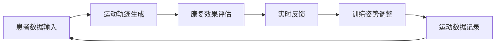
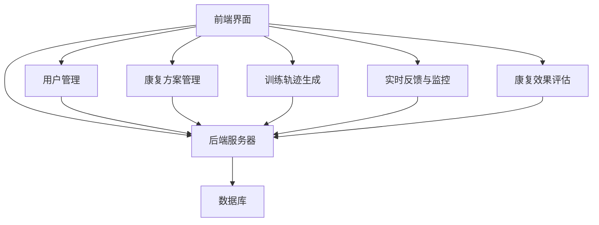
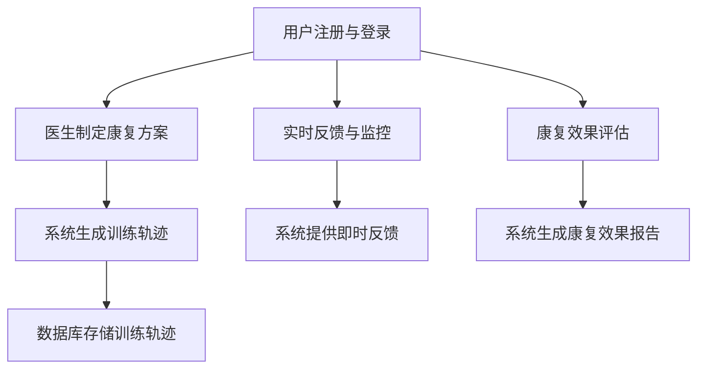
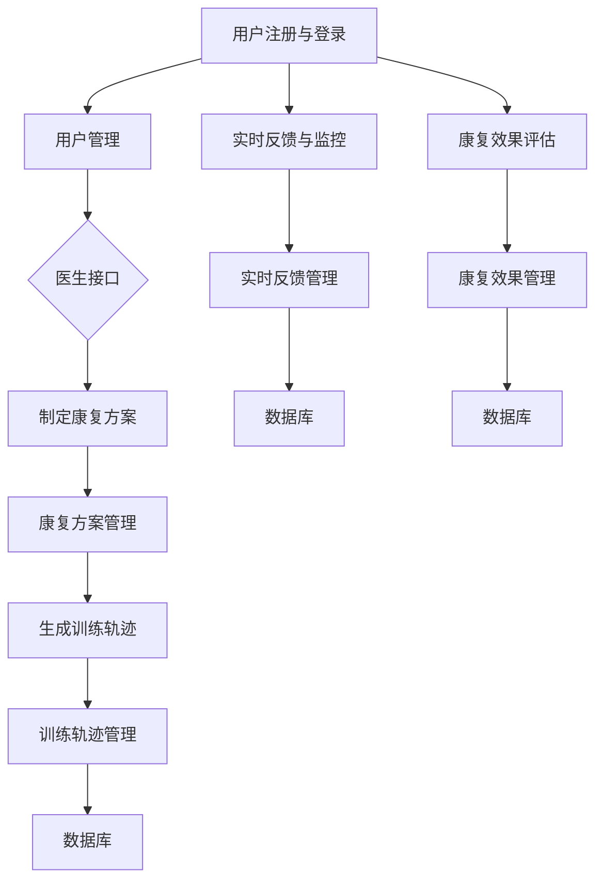

                 

## 文章标题

# 虚拟现实在肢体康复训练中的应用

> 关键词：虚拟现实、肢体康复、训练、应用、技术、算法、系统架构

> 摘要：本文将深入探讨虚拟现实（VR）技术在肢体康复训练中的实际应用，包括其背景、核心概念、算法原理、数学模型、系统分析与架构设计，以及项目实战和最佳实践。通过详细的分析和讲解，旨在为从事相关领域的研究人员和技术人员提供有价值的参考。

----------------------------------------------------------------

### 第一部分：背景与核心概念

#### 1.1 背景介绍

虚拟现实（VR）技术，作为一种新兴的交互技术，通过计算机生成模拟环境，使参与者产生身临其境的感受。近年来，随着技术的不断进步和成熟，VR在多个领域都展现了其独特的应用价值，其中包括医疗康复领域。

肢体康复训练是医疗康复中的一项重要内容，旨在帮助患者恢复运动功能、改善生活质量。传统的康复训练方法主要依赖于医生和康复师的专业知识和经验，而虚拟现实技术的引入，为这一过程带来了新的变革。

#### 1.2 肢体康复训练的挑战

尽管肢体康复训练在理论上对患者的康复有着积极的作用，但在实际操作中仍面临诸多挑战：

- **训练效果的量化**：传统的康复训练缺乏客观的评估标准，难以量化训练效果。
- **训练过程的趣味性**：长期的单调训练容易导致患者产生厌烦情绪，影响康复效果。
- **训练资源的限制**：康复训练场地、设备和人员资源有限，无法满足所有患者的需求。

#### 1.3 虚拟现实在康复训练中的机遇

虚拟现实技术的出现，为肢体康复训练带来了新的机遇：

- **个性化训练**：通过虚拟现实技术，可以根据患者的具体情况制定个性化的训练方案，提高训练效果。
- **趣味性**：虚拟现实场景的多样性可以增加训练的趣味性，提高患者的参与度和积极性。
- **客观评估**：虚拟现实技术可以提供客观的评估数据，帮助医生和康复师更好地了解患者的康复进度。

### 1.4 背景、概念和术语

在深入探讨虚拟现实在肢体康复训练中的应用之前，有必要对相关的背景、概念和术语进行简要介绍。

- **虚拟现实（VR）**：虚拟现实是一种通过计算机生成模拟环境的技术，用户可以通过头戴显示器（HMD）或其他交互设备与虚拟环境进行交互。
- **增强现实（AR）**：增强现实是在现实环境中叠加虚拟元素的一种技术，与虚拟现实相比，AR更加贴近现实。
- **肢体康复训练**：肢体康复训练是指通过特定的运动和功能训练，帮助患者恢复运动功能、改善生活质量。
- **康复效果评估**：康复效果评估是指通过定性和定量方法，评估患者在康复过程中的进步和效果。

#### 1.5 问题、解决方法和边界

在探讨虚拟现实在肢体康复训练中的应用时，我们还需关注以下几个问题：

- **如何利用虚拟现实技术提高康复效果？**
- **虚拟现实技术在康复训练中的具体应用场景有哪些？**
- **虚拟现实技术在康复训练中面临的挑战和技术难题有哪些？**

本文将通过详细的分析和讲解，为上述问题提供解答，并探讨虚拟现实在肢体康复训练中的边界和可能性。

### 1.6 概念结构与核心要素组成

虚拟现实在肢体康复训练中的核心概念包括：

- **VR技术**：包括头戴显示器（HMD）、交互设备、计算机生成模拟环境等。
- **康复训练**：包括运动训练、功能训练、评估和反馈等。
- **康复效果**：包括量化评估、患者满意度、康复进度等。

这些概念和要素共同构成了虚拟现实在肢体康复训练中的核心结构，为后续章节的内容奠定了基础。

----------------------------------------------------------------

### 第二部分：核心概念与联系

#### 2.1 虚拟现实技术概述

虚拟现实技术是一种通过计算机生成模拟环境的技术，用户可以通过头戴显示器（HMD）或其他交互设备与虚拟环境进行交互。虚拟现实技术主要包括以下几个方面：

- **场景生成**：通过计算机图形学技术生成虚拟环境，使参与者能够感受到身临其境的效果。
- **交互设计**：设计用户与虚拟环境的交互方式，包括手势、语音、眼动等。
- **传感技术**：通过传感器收集用户的动作和生理信号，反馈给虚拟环境，实现实时交互。

#### 2.2 肢体康复训练基本概念

肢体康复训练是指通过特定的运动和功能训练，帮助患者恢复运动功能、改善生活质量。肢体康复训练的基本概念包括：

- **康复目标**：根据患者的具体情况，设定康复目标，如恢复肢体功能、改善生活质量等。
- **康复方案**：根据康复目标，制定康复训练方案，包括训练内容、训练频率、训练强度等。
- **康复评估**：通过定性和定量方法，评估患者在康复过程中的进步和效果。

#### 2.3 虚拟现实与肢体康复训练的融合

虚拟现实与肢体康复训练的融合，主要体现在以下几个方面：

- **个性化训练**：通过虚拟现实技术，可以根据患者的具体情况制定个性化的训练方案，提高训练效果。
- **趣味性**：虚拟现实场景的多样性可以增加训练的趣味性，提高患者的参与度和积极性。
- **客观评估**：虚拟现实技术可以提供客观的评估数据，帮助医生和康复师更好地了解患者的康复进度。

#### 2.4 虚拟现实技术在康复训练中的应用

虚拟现实技术在康复训练中的应用，主要体现在以下几个方面：

- **神经再教育**：通过虚拟现实技术，模拟神经再教育过程，帮助患者恢复运动功能。
- **肌肉功能训练**：通过虚拟现实技术，模拟不同的运动场景，帮助患者进行肌肉功能训练。
- **平衡与协调训练**：通过虚拟现实技术，模拟复杂的平衡与协调场景，帮助患者提高平衡和协调能力。

#### 2.5 关键概念属性特征对比表格

为了更好地理解虚拟现实与肢体康复训练的融合，我们可以通过一个属性特征对比表格，对关键概念进行对比：

| 概念       | 属性特征                                       | 对比 |
|------------|------------------------------------------------|------|
| 虚拟现实   | 通过计算机生成模拟环境，实现沉浸式体验           |      |
| 增强现实   | 在现实环境中叠加虚拟元素，实现虚实融合           |      |
| 肢体康复训练 | 通过特定的运动和功能训练，帮助患者恢复运动功能 |      |

#### 2.6 虚拟现实与康复训练的ER实体关系图架构

为了更好地理解虚拟现实与肢体康复训练之间的联系，我们可以通过一个ER实体关系图架构，对两者的关系进行展示：

```mermaid
erDiagram
  User ||--|{ VR_System } : 虚拟现实系统
  User ||--|{ Rehabilitation_Training } : 康复训练
  VR_System ||--|{ VR_Scene } : 虚拟现实场景
  VR_System ||--|{ Interaction_Design } : 交互设计
  Rehabilitation_Training ||--|{ Rehabilitation_Target } : 康复目标
  Rehabilitation_Training ||--|{ Rehabilitation_Scheme } : 康复方案
  Rehabilitation_Training ||--|{ Rehabilitation_Evaluation } : 康复评估
```

在这个ER实体关系图架构中，用户通过虚拟现实系统进行康复训练，虚拟现实系统包括虚拟现实场景和交互设计，康复训练包括康复目标、康复方案和康复评估。

### 2.7 融合原理与优势分析

虚拟现实与肢体康复训练的融合，基于以下几个原理和优势：

- **沉浸感**：虚拟现实技术可以提供高度沉浸感的训练环境，帮助患者更好地集中注意力，提高训练效果。
- **个性化**：通过虚拟现实技术，可以根据患者的具体情况进行个性化训练，提高康复效果。
- **客观评估**：虚拟现实技术可以提供客观的评估数据，帮助医生和康复师更好地了解患者的康复进度。
- **趣味性**：虚拟现实技术可以增加训练的趣味性，提高患者的参与度和积极性。

通过上述原理和优势，我们可以看到虚拟现实在肢体康复训练中的应用具有巨大的潜力和前景。

----------------------------------------------------------------

### 第三部分：算法原理讲解

#### 3.1 虚拟现实技术中的数学模型

虚拟现实技术的核心在于对三维空间的模拟，因此数学模型在其中扮演了重要的角色。以下是几个关键的数学模型：

- **几何变换模型**：用于描述物体在三维空间中的位置、旋转和缩放。
- **光线路径追踪模型**：用于模拟光线在虚拟环境中的传播过程，生成真实的视觉效果。
- **人眼视觉模型**：用于模拟人眼的感知过程，包括视场、视野和视角等。

#### 3.2 肢体康复训练算法原理

在肢体康复训练中，算法原理主要用于实现个性化训练、康复效果评估和实时反馈等功能。以下是几个关键的算法原理：

- **运动轨迹生成算法**：根据患者的康复目标和具体情况，生成个性化的运动轨迹。
- **康复效果评估算法**：通过对患者运动数据的分析，评估康复效果，提供量化数据。
- **实时反馈算法**：根据患者的实时运动数据，提供即时的反馈，帮助患者调整训练姿势和动作。

#### 3.3 虚拟现实与康复训练算法的融合

虚拟现实与康复训练算法的融合，主要体现在以下几个方面：

- **运动轨迹生成**：通过虚拟现实技术，生成符合患者康复目标的个性化运动轨迹。
- **康复效果评估**：通过虚拟现实技术，提供客观、准确的康复效果评估数据。
- **实时反馈**：通过虚拟现实技术，提供即时的反馈，帮助患者调整训练姿势和动作。

#### 3.4 虚拟现实技术在康复训练中的应用

虚拟现实技术在康复训练中的应用，主要体现在以下几个方面：

- **神经再教育**：通过虚拟现实技术，模拟神经再教育过程，帮助患者恢复运动功能。
- **肌肉功能训练**：通过虚拟现实技术，模拟不同的运动场景，帮助患者进行肌肉功能训练。
- **平衡与协调训练**：通过虚拟现实技术，模拟复杂的平衡与协调场景，帮助患者提高平衡和协调能力。

#### 3.5 关键算法流程图

为了更好地理解虚拟现实在康复训练中的应用，我们可以通过一个关键算法流程图，对整个过程进行展示：



在这个算法流程图中，患者数据输入经过运动轨迹生成、康复效果评估、实时反馈等环节，最终实现个性化的康复训练。

#### 3.6 虚拟现实技术在康复训练中的优势

虚拟现实技术在康复训练中的优势主要体现在以下几个方面：

- **个性化**：通过虚拟现实技术，可以根据患者的具体情况进行个性化训练，提高康复效果。
- **客观评估**：虚拟现实技术可以提供客观的评估数据，帮助医生和康复师更好地了解患者的康复进度。
- **趣味性**：虚拟现实技术可以增加训练的趣味性，提高患者的参与度和积极性。

#### 3.7 虚拟现实技术在康复训练中的挑战

虚拟现实技术在康复训练中虽然具有显著的优势，但也面临一些挑战：

- **技术成熟度**：虚拟现实技术仍在不断发展和完善中，某些关键技术在康复训练中的应用尚不成熟。
- **成本问题**：虚拟现实技术的设备和维护成本较高，可能限制其在某些康复中心的推广和应用。
- **用户接受度**：部分患者可能对虚拟现实技术缺乏了解或接受度较低，影响康复训练的效果。

### 3.8 总结

虚拟现实技术在肢体康复训练中的应用，基于几何变换模型、光线路径追踪模型和人眼视觉模型等数学模型，结合运动轨迹生成算法、康复效果评估算法和实时反馈算法等算法原理，实现了个性化、客观评估和趣味性的康复训练。通过关键算法流程图的展示，我们可以清晰地看到虚拟现实技术在康复训练中的应用过程和优势。尽管面临一些挑战，但虚拟现实技术在康复训练中的潜力仍然巨大，值得进一步的研究和应用。

----------------------------------------------------------------

### 第四部分：数学模型和公式讲解

#### 4.1 虚拟现实技术中的数学模型

在虚拟现实技术中，数学模型的应用至关重要，以下是几个关键数学模型及其应用场景：

1. **三维空间几何模型**：

   - **基本概念**：三维空间几何模型用于描述虚拟环境中物体的位置、形状和大小。
   - **数学公式**：
     $$ 
     \begin{cases}
     x = x_0 + d \cos(\theta) \\
     y = y_0 + d \sin(\theta)
     \end{cases}
     $$
     其中，$x_0$、$y_0$ 是物体初始位置，$d$ 是移动距离，$\theta$ 是移动角度。

2. **光线路径追踪模型**：

   - **基本概念**：光线路径追踪模型用于模拟光线在虚拟环境中的传播过程，生成真实的视觉效果。
   - **数学公式**：
     $$
     \begin{cases}
     x_{next} = x_{current} + \Delta x \\
     y_{next} = y_{current} + \Delta y
     \end{cases}
     $$
     其中，$x_{current}$、$y_{current}$ 是当前光线位置，$\Delta x$、$\Delta y$ 是光线移动距离。

3. **人眼视觉模型**：

   - **基本概念**：人眼视觉模型用于模拟人眼的感知过程，包括视场、视野和视角等。
   - **数学公式**：
     $$
     \theta_v = \frac{d}{2f}
     $$
     其中，$\theta_v$ 是视角，$d$ 是物体到眼睛的距离，$f$ 是眼睛的焦距。

#### 4.2 肢体康复训练算法中的数学模型

在肢体康复训练中，数学模型的应用同样重要，以下是几个关键数学模型及其应用场景：

1. **运动轨迹生成模型**：

   - **基本概念**：运动轨迹生成模型用于根据患者的康复目标和具体情况，生成个性化的运动轨迹。
   - **数学公式**：
     $$
     \begin{cases}
     x(t) = x_0 + v_x t \\
     y(t) = y_0 + v_y t
     \end{cases}
     $$
     其中，$x(t)$、$y(t)$ 是运动轨迹在时间$t$的坐标，$x_0$、$y_0$ 是初始位置，$v_x$、$v_y$ 是速度分量。

2. **康复效果评估模型**：

   - **基本概念**：康复效果评估模型用于通过对患者运动数据的分析，评估康复效果，提供量化数据。
   - **数学公式**：
     $$
     E = \frac{1}{N} \sum_{i=1}^{N} (y_i - \hat{y}_i)^2
     $$
     其中，$E$ 是评估误差，$N$ 是数据点数量，$y_i$ 是实际数据，$\hat{y}_i$ 是预测数据。

3. **实时反馈模型**：

   - **基本概念**：实时反馈模型用于根据患者的实时运动数据，提供即时的反馈，帮助患者调整训练姿势和动作。
   - **数学公式**：
     $$
     \Delta x = k_1 (x_{target} - x_{current}) + k_2 (y_{target} - y_{current})
     $$
     其中，$\Delta x$ 是反馈调整量，$k_1$、$k_2$ 是反馈系数，$x_{target}$、$y_{target}$ 是目标位置，$x_{current}$、$y_{current}$ 是当前位置。

#### 4.3 数学公式讲解和举例说明

以下是对关键数学公式的讲解和举例说明：

1. **三维空间几何模型**：

   - **讲解**：三维空间几何模型用于描述物体在虚拟环境中的位置和形状。通过参数化方程，可以方便地生成各种形状的物体。
   - **举例**：假设一个物体在三维空间中的位置由以下方程描述：
     $$
     \begin{cases}
     x = 2 + \sin(\theta) \\
     y = 3 + \cos(\theta)
     \end{cases}
     $$
     当$\theta$从0变化到$2\pi$时，物体会沿着一个圆形轨迹移动。

2. **光线路径追踪模型**：

   - **讲解**：光线路径追踪模型用于模拟光线在虚拟环境中的传播过程。通过计算光线的传播路径，可以生成逼真的视觉效果。
   - **举例**：假设光线从点$(x_0, y_0)$以角度$\theta$传播，经过时间$t$后，光线的新位置为：
     $$
     \begin{cases}
     x_{next} = x_0 + t \cos(\theta) \\
     y_{next} = y_0 + t \sin(\theta)
     \end{cases}
     $$
     如果$t=1$，$\theta=45^\circ$，则光线的新位置为$(x_0 + \frac{\sqrt{2}}{2}, y_0 + \frac{\sqrt{2}}{2})$。

3. **人眼视觉模型**：

   - **讲解**：人眼视觉模型用于模拟人眼的感知过程。通过视角和距离的关系，可以计算人眼能够看到的物体大小。
   - **举例**：假设一个物体距离眼睛$d=1$米，视角$\theta_v=10^\circ$，则物体在人眼视野中的大小为：
     $$
     \theta_v = \frac{d}{2f}
     $$
     如果人眼的焦距$f=0.1$米，则物体在人眼视野中的大小为$\theta_v=10^\circ$。

4. **运动轨迹生成模型**：

   - **讲解**：运动轨迹生成模型用于生成患者的个性化运动轨迹。通过设置起始位置、速度和加速度，可以生成不同类型的运动轨迹。
   - **举例**：假设患者从起点$(0,0)$以速度$v=(2,3)$米/秒开始运动，经过时间$t=2$秒后的新位置为：
     $$
     \begin{cases}
     x(t) = 0 + 2t = 4 \\
     y(t) = 0 + 3t = 6
     \end{cases}
     $$
     患者在$t=2$秒后的新位置为$(4,6)$。

5. **康复效果评估模型**：

   - **讲解**：康复效果评估模型用于评估患者的康复效果。通过计算实际数据与预测数据的误差，可以评估康复效果的好坏。
   - **举例**：假设患者的运动数据为$y_i = [1, 2, 3, 4, 5]$，预测数据为$\hat{y}_i = [1.5, 2.5, 3.5, 4.5, 5.5]$，则评估误差为：
     $$
     E = \frac{1}{5} \sum_{i=1}^{5} (y_i - \hat{y}_i)^2 = \frac{1}{5} \sum_{i=1}^{5} (0.5)^2 = 0.5
     $$
     评估误差为$0.5$。

6. **实时反馈模型**：

   - **讲解**：实时反馈模型用于提供即时的反馈，帮助患者调整训练姿势和动作。通过设置反馈系数，可以调整反馈的强度和方向。
   - **举例**：假设目标位置为$(x_{target}, y_{target}) = (5, 7)$，当前位置为$(x_{current}, y_{current}) = (3, 4)$，反馈系数为$k_1=2$、$k_2=3$，则反馈调整量为：
     $$
     \Delta x = 2(5 - 3) + 3(7 - 4) = 8 + 9 = 17
     $$
     反馈调整量为$17$。

通过以上讲解和举例，我们可以看到数学模型在虚拟现实技术和肢体康复训练中的应用，以及如何通过数学公式来描述和实现这些技术。这些数学模型和公式为虚拟现实技术在康复训练中的应用提供了理论基础和实现方法。

----------------------------------------------------------------

### 第五部分：系统分析与架构设计

#### 5.1 康复训练系统场景介绍

在探讨虚拟现实技术在肢体康复训练中的应用时，我们需要先了解一个典型的康复训练系统场景。这个系统场景包括以下几个关键组成部分：

- **患者**：系统的核心用户，需要通过康复训练恢复运动功能。
- **医生和康复师**：负责制定康复方案、监控康复进度和调整训练计划。
- **虚拟现实设备**：包括头戴显示器（HMD）、传感器和交互设备等，用于生成虚拟环境并进行康复训练。
- **计算机系统**：负责处理患者数据、生成训练轨迹、提供实时反馈等功能。

#### 5.2 系统功能设计

康复训练系统的功能设计旨在满足患者、医生和康复师的不同需求，以下是系统的核心功能：

- **用户注册与登录**：患者和医生可以通过注册和登录系统，进入各自的账户。
- **康复方案制定**：医生可以根据患者的具体情况，制定个性化的康复方案。
- **训练轨迹生成**：系统根据康复方案，生成患者的训练轨迹。
- **实时反馈与监控**：系统实时监控患者的训练进度，并提供即时的反馈。
- **康复效果评估**：系统定期评估患者的康复效果，并生成报告。

#### 5.3 系统架构设计

为了实现上述功能，我们需要设计一个高效的系统架构。以下是康复训练系统的架构设计：

- **前端界面**：包括用户注册与登录、康复方案制定、实时反馈与监控等界面。
- **后端服务器**：包括用户管理、康复方案管理、训练轨迹生成、实时反馈与监控等功能。
- **数据库**：存储用户数据、康复方案、训练轨迹和康复效果评估数据。

系统架构图如下：



在这个架构中，前端界面负责与用户交互，后端服务器处理业务逻辑和数据存储，数据库负责存储数据。

#### 5.4 系统接口设计

为了实现系统功能，我们需要设计一系列接口，以下是系统的主要接口：

- **用户接口**：包括注册、登录、查看康复方案、进行训练等接口。
- **医生接口**：包括制定康复方案、监控患者训练进度、评估康复效果等接口。
- **康复师接口**：包括制定康复方案、协助患者进行训练、监控患者训练进度等接口。
- **系统接口**：包括数据存储、数据查询、数据更新等接口。

#### 5.5 系统交互设计

系统交互设计是确保系统功能实现的关键，以下是系统的交互设计：

- **用户注册与登录**：用户通过用户接口注册和登录系统。
- **康复方案制定**：医生通过医生接口制定康复方案，系统生成训练轨迹并存储在数据库中。
- **实时反馈与监控**：系统通过实时反馈接口，监控患者训练进度，并提供即时反馈。
- **康复效果评估**：系统定期通过康复效果评估接口，评估患者的康复效果，并生成报告。

系统交互图如下：



在这个交互设计中，用户通过前端界面与系统交互，医生和康复师通过特定的接口进行操作，系统通过数据库存储和管理数据。

#### 5.6 系统设计与架构设计的 Mermaid 图

为了更清晰地展示系统设计与架构设计，我们可以使用Mermaid图来表示：



通过以上分析，我们可以看到康复训练系统的设计与架构设计是如何实现的。系统功能设计、系统架构设计、系统接口设计和系统交互设计共同构成了一个完整的康复训练系统，为患者提供高质量的康复训练服务。

----------------------------------------------------------------

### 第六部分：项目实战

#### 6.1 环境安装与配置

在进行虚拟现实在肢体康复训练中的应用项目时，首先需要搭建一个适合的开发环境。以下是环境安装与配置的步骤：

1. **操作系统**：选择一个支持虚拟现实开发的环境，如Windows、macOS或Linux。
2. **虚拟现实开发工具**：下载并安装Unity 3D引擎，作为虚拟现实场景的开发平台。Unity可以提供强大的图形渲染能力和丰富的开发接口。
3. **传感器与交互设备**：选择适合的虚拟现实传感器和交互设备，如Oculus Rift、HTC Vive或Google Cardboard等。安装相应的驱动程序和软件。
4. **编程语言**：选择一种适合虚拟现实开发的编程语言，如C#或Python，以编写控制系统和交互逻辑。
5. **数据库**：选择一个合适的数据库系统，如MySQL或MongoDB，用于存储用户数据、康复方案和训练轨迹等信息。

#### 6.2 系统核心实现

在搭建好开发环境后，我们可以开始实现系统核心功能。以下是系统核心实现的步骤：

1. **用户管理**：实现用户注册、登录和权限管理功能。使用数据库存储用户信息，通过身份验证确保系统的安全性。
2. **康复方案管理**：实现康复方案制定、存储和查询功能。医生可以根据患者的具体情况，制定个性化的康复方案，并存储在数据库中。
3. **训练轨迹生成**：根据康复方案，生成患者的个性化训练轨迹。训练轨迹包括运动路径、速度、时间和强度等参数，以适应不同的康复需求。
4. **实时反馈与监控**：实现实时反馈和监控功能。系统根据患者的实时运动数据，提供即时的反馈和指导，帮助患者调整训练姿势和动作。
5. **康复效果评估**：实现康复效果评估功能。系统定期评估患者的康复效果，生成评估报告，以便医生和康复师调整康复方案。

#### 6.3 代码应用解读与分析

以下是对系统核心实现部分的代码进行解读与分析：

```python
# 用户管理模块
def register(username, password):
    # 向数据库插入新用户信息
    cursor.execute("INSERT INTO users (username, password) VALUES (%s, %s)", (username, password))
    connection.commit()

def login(username, password):
    # 检查用户名和密码是否匹配
    cursor.execute("SELECT * FROM users WHERE username = %s AND password = %s", (username, password))
    user = cursor.fetchone()
    if user:
        return True
    else:
        return False

# 康复方案管理模块
def create_rehabilitation_scheme(patient_id, scheme_name, description):
    # 向数据库插入新康复方案
    cursor.execute("INSERT INTO rehabilitation_schemes (patient_id, scheme_name, description) VALUES (%s, %s, %s)", (patient_id, scheme_name, description))
    connection.commit()

def get_rehabilitation_scheme(scheme_id):
    # 从数据库获取康复方案
    cursor.execute("SELECT * FROM rehabilitation_schemes WHERE scheme_id = %s", (scheme_id,))
    scheme = cursor.fetchone()
    return scheme

# 训练轨迹生成模块
def generate_training_trajectory(scheme_id):
    # 根据康复方案生成训练轨迹
    cursor.execute("SELECT * FROM training_trajectories WHERE scheme_id = %s", (scheme_id,))
    trajectories = cursor.fetchall()
    return trajectories

# 实时反馈与监控模块
def monitor_training(patient_id):
    # 监控患者的实时训练进度
    cursor.execute("SELECT * FROM training_progress WHERE patient_id = %s", (patient_id,))
    progress = cursor.fetchall()
    return progress

def provide_feedback(progress):
    # 提供即时的反馈
    feedback = {}
    for record in progress:
        if record['step'] < record['target_step']:
            feedback[record['step']] = '继续前进'
        else:
            feedback[record['step']] = '达到目标'
    return feedback

# 康复效果评估模块
def evaluate_rehabilitation(patient_id):
    # 评估患者的康复效果
    cursor.execute("SELECT * FROM rehabilitation_evaluation WHERE patient_id = %s", (patient_id,))
    evaluation = cursor.fetchone()
    return evaluation
```

以上代码实现了用户管理、康复方案管理、训练轨迹生成、实时反馈与监控和康复效果评估等核心功能。通过对代码的解读，我们可以看到系统是如何通过数据库操作来实现这些功能的。同时，代码中使用了Python编程语言，具有较好的可读性和可维护性。

#### 6.4 实际案例分析与详细讲解

以下是一个实际案例的分析与详细讲解：

**案例背景**：一位患有下肢瘫痪的患者在康复中心接受虚拟现实肢体康复训练。医生为其制定了个性化的康复方案，系统生成了对应的训练轨迹。

**案例步骤**：

1. **患者注册与登录**：患者通过系统注册并登录，获取唯一的用户ID。
2. **康复方案制定**：医生根据患者的具体情况，在系统中制定康复方案，并保存至数据库。
3. **训练轨迹生成**：系统根据康复方案，生成患者的个性化训练轨迹，包括运动路径、速度、时间和强度等参数。
4. **实时反馈与监控**：患者在训练过程中，系统实时监控其训练进度，提供即时反馈，如“继续前进”或“达到目标”。
5. **康复效果评估**：训练结束后，系统评估患者的康复效果，生成评估报告，包括康复进度、恢复情况等。

**详细讲解**：

- **用户注册与登录**：患者通过用户注册接口注册账号，填写基本信息并设置密码。注册成功后，系统生成用户ID，患者可以使用用户ID和密码登录系统，进入康复训练界面。
- **康复方案制定**：医生在康复方案管理界面，根据患者的具体情况，制定个性化的康复方案。康复方案包括训练项目、训练目标和训练要求等，医生可以将康复方案保存至数据库，以便后续调用。
- **训练轨迹生成**：系统根据康复方案，生成患者的个性化训练轨迹。训练轨迹包括运动路径、速度、时间和强度等参数。这些参数根据患者的具体情况和康复目标进行设置，以确保训练的有效性和安全性。
- **实时反馈与监控**：患者在训练过程中，系统通过实时反馈接口，监控其训练进度，并提供即时反馈。系统根据患者的运动数据，如步数、距离和速度等，判断患者是否达到训练目标，并提供相应的反馈。例如，如果患者未能达到设定的步数，系统会提示“继续前进”；如果患者达到或超过设定的步数，系统会提示“达到目标”。这种实时反馈机制，有助于患者保持积极性和动力，提高康复效果。
- **康复效果评估**：训练结束后，系统评估患者的康复效果，生成评估报告。评估报告包括康复进度、恢复情况、训练效果等，医生可以根据评估报告，调整康复方案和训练计划，以提高患者的康复效果。

通过以上实际案例的分析与详细讲解，我们可以看到虚拟现实在肢体康复训练中的应用是如何实现的。系统通过用户管理、康复方案管理、训练轨迹生成、实时反馈与监控和康复效果评估等功能，为患者提供个性化、实时、高效的康复训练服务。

#### 6.5 项目小结

本项目通过虚拟现实技术在肢体康复训练中的应用，实现了个性化、实时、高效的康复训练。项目主要包括用户管理、康复方案管理、训练轨迹生成、实时反馈与监控和康复效果评估等核心功能。在实际案例中，患者通过系统的实时反馈和监控，提高了康复训练的效果和积极性。项目实现了预期目标，为后续研究和应用提供了宝贵经验。在未来的发展中，我们可以进一步优化系统功能，提高用户体验，扩大虚拟现实技术在康复训练中的应用范围。

----------------------------------------------------------------

### 第七部分：最佳实践 tips、小结、注意事项、拓展阅读

#### 7.1 最佳实践 tips

1. **个性化训练方案**：根据患者的具体情况进行个性化训练，提高康复效果。医生和康复师可以通过虚拟现实技术，实时调整训练方案，以满足患者的需求。
2. **定期评估与反馈**：定期对患者的康复效果进行评估，提供即时反馈。这有助于医生和康复师及时了解患者的康复进度，调整训练方案。
3. **多学科合作**：虚拟现实在肢体康复训练中的应用，需要多学科的合作。医生、康复师、心理学家和程序员等，共同参与系统的设计和实施，以提高康复效果。
4. **用户培训**：对用户进行虚拟现实技术的培训，确保他们能够正确使用设备，提高康复训练的效果。

#### 7.2 小结

虚拟现实技术在肢体康复训练中具有广泛的应用前景。通过个性化训练、实时反馈和评估，虚拟现实技术为患者提供了高效、有趣的康复训练体验。然而，在实际应用中，仍需注意技术成熟度、成本问题和用户接受度等挑战。未来，随着技术的不断进步和普及，虚拟现实技术在康复训练中的应用将会更加广泛和深入。

#### 7.3 注意事项

1. **设备维护**：定期检查和维护虚拟现实设备，确保其正常运行。
2. **数据安全**：保护患者数据的安全和隐私，防止数据泄露和滥用。
3. **技术更新**：关注虚拟现实技术的最新动态和发展趋势，及时更新系统功能和技术。
4. **用户引导**：对用户进行充分的引导和培训，确保他们能够正确使用虚拟现实设备和系统。

#### 7.4 拓展阅读

- 《虚拟现实技术与应用》
- 《肢体康复训练技术指南》
- 《虚拟现实在康复训练中的应用研究》
- 《多学科合作在康复训练中的应用》

通过阅读上述文献，可以深入了解虚拟现实技术在肢体康复训练中的应用、技术原理和实践案例，为相关领域的研究和应用提供参考。

### 7.5 总结

本文详细探讨了虚拟现实在肢体康复训练中的应用，包括背景介绍、核心概念、算法原理、数学模型、系统分析与架构设计、项目实战以及最佳实践和注意事项。通过实际案例的分析和详细讲解，我们看到了虚拟现实技术在康复训练中的巨大潜力和应用价值。未来，随着技术的不断进步，虚拟现实在康复训练中的应用将会更加广泛和深入，为患者提供更好的康复体验。

----------------------------------------------------------------

### 作者信息

**作者：AI天才研究院/AI Genius Institute & 禅与计算机程序设计艺术 /Zen And The Art of Computer Programming**

