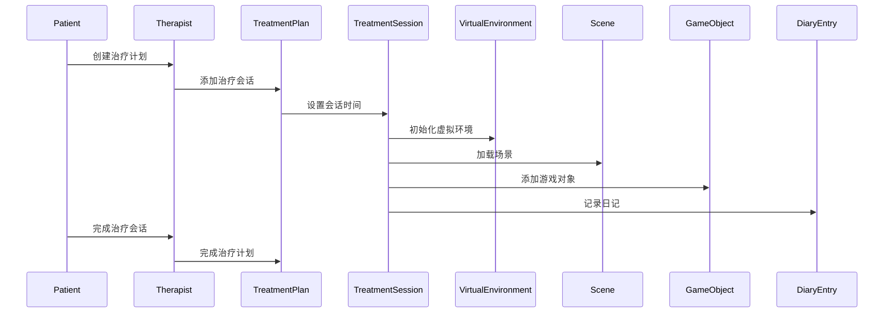
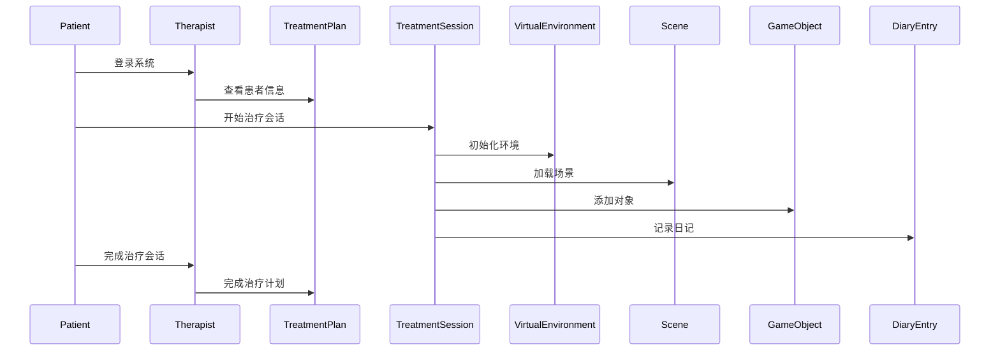

                 


### 虚拟现实技术在恐惧症治疗中的应用

关键词：虚拟现实、恐惧症、心理治疗、技术实现、伦理问题

摘要：本文将探讨虚拟现实（VR）技术在恐惧症治疗中的应用。通过介绍虚拟现实技术的基本概念和原理，分析恐惧症的定义及其治疗方法，阐述VR治疗恐惧症的机制和实际应用案例，最后讨论VR治疗中面临的伦理问题和挑战。

----------------------------------------------------------------

### 目录

1. 虚拟现实技术背景
   1.1 虚拟现实技术概述
   1.2 虚拟现实技术的核心原理
   1.3 虚拟现实技术在其他领域的应用

2. 恐惧症的基本概念
   2.1 恐惧症的定义与分类
   2.2 恐惧症的常见症状与影响
   2.3 恐惧症的治疗方法概述

3. 虚拟现实技术在恐惧症治疗中的应用原理
   3.1 VR治疗恐惧症的机制
   3.2 VR治疗恐惧症的优缺点分析
   3.3 VR治疗恐惧症的核心概念与联系

4. 虚拟现实技术在恐惧症治疗中的技术实现
   4.1 VR治疗系统的构建
   4.2 交互设计与用户体验优化
   4.3 数据收集与分析

5. 虚拟现实技术在恐惧症治疗中的实际案例
   5.1 案例一：空间恐惧症的治疗
   5.2 案例二：社交恐惧症的治疗
   5.3 案例三：高度恐惧症的治疗

6. 虚拟现实技术在恐惧症治疗中的伦理与挑战
   6.1 VR治疗恐惧症的伦理问题
   6.2 VR治疗恐惧症的挑战与未来

7. 总结与展望
   7.1 VR治疗恐惧症的应用总结
   7.2 面临的挑战与解决方案
   7.3 VR治疗恐惧症的未来展望

----------------------------------------------------------------

### 1. 虚拟现实技术背景

#### 1.1 虚拟现实技术概述

虚拟现实（Virtual Reality，简称VR）是一种通过计算机技术和多媒体技术创造出的模拟环境，使用户能够在这个环境中进行交互和感知。VR技术最早可以追溯到20世纪60年代的美国，经过几十年的发展，如今已经成为了计算机科学和多媒体技术中的一个重要分支。

VR技术的基本原理是通过计算机生成一个模拟的三维环境，使用户通过头戴式显示器（Head-Mounted Display，简称HMD）或特殊眼镜观看，并通过传感器检测用户的头部和身体运动，实现与虚拟环境的实时交互。VR技术主要包括以下几个方面：

1. **计算机图形学**：计算机图形学是VR技术的核心，负责生成三维模型、纹理映射和光影效果等。
2. **传感器技术**：传感器技术用于检测用户的头部和身体运动，实现与现实世界的交互。
3. **人机交互**：人机交互技术用于设计用户与虚拟环境之间的交互方式，包括手势、声音、视线等。

#### 1.2 虚拟现实技术的核心原理

虚拟现实技术的核心原理可以概括为以下几个方面：

1. **沉浸感**：通过提供高分辨率的三维图像和逼真的音效，使用户在虚拟环境中感到仿佛身临其境。
2. **交互性**：用户可以通过头戴式显示器、手柄、手势等与虚拟环境进行实时交互，提高用户的参与度和体验感。
3. **反馈性**：虚拟环境会对用户的动作和交互进行实时反馈，增强用户的沉浸感和互动性。

#### 1.3 虚拟现实技术在其他领域的应用

虚拟现实技术在许多领域都有广泛的应用，包括游戏、娱乐、教育、医疗、军事、建筑设计等。

1. **游戏和娱乐**：VR游戏和娱乐项目提供了全新的体验方式，用户可以在虚拟环境中进行游戏和娱乐活动。
2. **教育和培训**：VR技术可以用于教育和培训，提供模拟环境和交互式教学，提高学习效果。
3. **医疗**：VR技术在医疗领域有广泛的应用，包括手术模拟、心理治疗、疼痛管理、康复训练等。
4. **军事**：VR技术可以用于军事训练、战术模拟和战略规划。
5. **建筑设计**：VR技术可以帮助建筑师和设计师在虚拟环境中进行设计和展示，提高设计质量和效率。

在本章中，我们介绍了虚拟现实技术的基本概念、核心原理及其在其他领域的应用。在接下来的章节中，我们将进一步探讨虚拟现实技术在恐惧症治疗中的应用，以及其在治疗中的优势和挑战。

----------------------------------------------------------------

### 2. 恐惧症的基本概念

#### 2.1 恐惧症的定义与分类

恐惧症（Panic Disorder）是一种焦虑障碍，表现为反复发作的强烈的恐惧感和不适感。患者在特定情况下，如特定的环境、情境或物体，会感到极度恐惧，甚至可能出现恐慌发作（panic attack）。恐慌发作是一种突发性的、强烈的恐惧感，通常伴随有胸闷、心悸、出汗、手脚冰冷等症状。

根据国际精神障碍分类手册（ICD-10），恐惧症可以分为以下几种类型：

1. **场所恐惧症（Agoraphobia）**：患者害怕去公共场所或可能需要逃离的场所，如商店、广场、地铁等。
2. **社交恐惧症（Social Anxiety Disorder）**：患者害怕在社交场合中受到评价或批评，可能表现为不敢与人交往或公开演讲。
3. **特定恐惧症（Specific Phobia）**：患者对某些特定的物体或情境有强烈的恐惧，如高度、水、昆虫等。
4. **混合恐惧症（Generalized Anxiety Disorder）**：患者对多种情境或物体都有恐惧感，可能同时患有其他类型的恐惧症。

#### 2.2 恐惧症的常见症状与影响

恐惧症的症状主要包括以下几个方面：

1. **心理症状**：患者可能会感到强烈的恐惧感、紧张、不安、焦虑等。
2. **生理症状**：患者在恐惧发作时可能会出现胸闷、心悸、出汗、手脚冰冷、头晕等症状。
3. **行为症状**：患者可能会出现逃避恐惧情境的行为，如避免外出、回避社交场合等。

恐惧症对患者的日常生活和心理健康产生严重影响，包括以下几个方面：

1. **生活质量下降**：恐惧症可能导致患者的生活质量下降，如无法正常工作、学习、社交等。
2. **心理压力增加**：恐惧症可能导致患者产生强烈的心理压力，甚至出现抑郁、焦虑等心理问题。
3. **社交障碍**：恐惧症可能导致患者出现社交障碍，影响其社交关系和人际关系。

#### 2.3 恐惧症的治疗方法概述

恐惧症的治疗方法主要包括以下几种：

1. **药物治疗**：药物治疗包括抗抑郁药、抗焦虑药等，主要用于缓解症状。
2. **心理治疗**：心理治疗包括认知行为疗法（CBT）、暴露疗法、冥想等，主要用于改变患者的认知和行为。
3. **综合治疗**：综合治疗包括药物治疗和心理治疗相结合，根据患者的具体情况进行个体化的治疗方案。

在本章中，我们介绍了恐惧症的定义、分类、症状及其治疗方法。在接下来的章节中，我们将探讨虚拟现实技术在恐惧症治疗中的应用，以及其在治疗中的优势和挑战。

----------------------------------------------------------------

### 3. 虚拟现实技术在恐惧症治疗中的应用原理

#### 3.1 VR治疗恐惧症的机制

虚拟现实技术（VR）在恐惧症治疗中的应用，主要是基于其能够创造出一个模拟的、可控的环境，让患者在这个环境中逐步面对和克服恐惧。VR治疗恐惧症的机制主要包括以下几个方面：

1. **暴露疗法**：暴露疗法是VR治疗恐惧症的核心方法之一。通过将患者暴露于恐惧刺激，逐步减少其对恐惧的反应。在VR环境中，患者可以逐渐增加恐惧刺激的强度和频率，从而逐渐克服恐惧。
   
2. **认知行为疗法**：VR治疗还结合了认知行为疗法（CBT）的原理。在VR环境中，患者可以通过认知重建，即改变对恐惧情境的认知和看法，从而减少恐惧感。同时，通过行为演练，患者可以在虚拟环境中模拟实际情境，提高应对恐惧的能力。

3. **情感调节**：VR技术可以创造一个沉浸式的环境，通过视觉、听觉、触觉等多种感官刺激，帮助患者调节情绪，减少恐惧感。在VR环境中，患者可以感受到安全、可控的环境，从而更容易放松和应对恐惧。

#### 3.2 VR治疗恐惧症的优缺点分析

VR治疗恐惧症具有以下优点：

1. **可控性**：VR环境是一个可控的环境，患者可以根据自己的适应情况逐步增加恐惧刺激的强度，从而减少恐惧反应。
2. **安全性**：与传统治疗方法相比，VR治疗更安全，不会产生副作用，患者可以在安全的环境中逐步克服恐惧。
3. **可重复性**：VR环境可以重复使用，患者可以反复进行训练，从而提高治疗效果。
4. **趣味性**：VR技术本身具有趣味性，可以吸引患者积极参与治疗，提高治疗的依从性。

然而，VR治疗恐惧症也存在一些缺点：

1. **设备成本**：VR设备相对昂贵，需要一定的经济投入。
2. **技术限制**：VR技术的发展仍然存在一些技术限制，如沉浸感、交互性等方面仍有待提高。
3. **适应性问题**：一些患者可能对VR技术产生不适，需要适应过程。
4. **治疗效果评估**：VR治疗的效果需要进一步研究，目前仍缺乏大规模的临床试验数据支持。

#### 3.3 VR治疗恐惧症的核心概念与联系

VR治疗恐惧症的核心概念主要包括：虚拟现实技术、暴露疗法、认知行为疗法、情感调节等。这些概念之间有着紧密的联系：

1. **虚拟现实技术**：是VR治疗的基础，提供了模拟的环境，实现了恐惧刺激的可控性。
2. **暴露疗法**：是VR治疗的核心方法，通过逐步暴露于恐惧刺激，帮助患者克服恐惧。
3. **认知行为疗法**：结合了认知重建和行为演练，帮助患者改变对恐惧情境的认知和看法，提高应对能力。
4. **情感调节**：通过沉浸式环境，帮助患者调节情绪，减少恐惧感。

在本章中，我们详细介绍了VR治疗恐惧症的机制、优缺点及其核心概念与联系。在下一章中，我们将探讨VR治疗恐惧症的技术实现，以及如何设计和构建VR治疗系统。

----------------------------------------------------------------

### 4. 虚拟现实技术在恐惧症治疗中的技术实现

#### 4.1 VR治疗系统的构建

虚拟现实治疗系统的构建是VR治疗恐惧症的关键步骤，其核心在于创造一个高度沉浸、交互性强的虚拟环境，以帮助患者逐步克服恐惧。以下为VR治疗系统的构建步骤：

1. **需求分析**：首先，需要对患者的具体恐惧情境进行需求分析，确定需要模拟的环境和恐惧刺激。例如，对于空间恐惧症，可能需要模拟高楼大厦或广阔的广场；对于社交恐惧症，可能需要模拟社交场合，如酒吧或聚会等。

2. **环境建模**：根据需求分析，利用三维建模软件（如Blender、Unity等）创建虚拟环境的三维模型。环境建模需要考虑视觉、听觉和触觉等多方面的感知要素，以提供逼真的沉浸体验。

3. **交互设计**：交互设计是VR治疗系统的重要组成部分，决定了患者与虚拟环境的交互方式。交互设计需要结合患者的实际需求和操作习惯，设计出易于使用、直观的交互界面。常见的交互方式包括手势、语音、眼动等。

4. **系统开发**：在完成环境建模和交互设计后，利用VR开发平台（如Unity、Unreal Engine等）进行系统开发。系统开发包括实现虚拟环境的渲染、交互逻辑、音效和物理效果等。

5. **测试与优化**：在系统开发完成后，需要进行严格的测试和优化，确保系统的稳定性和性能。测试内容包括虚拟环境的逼真度、交互的流畅性、系统的易用性等。

6. **用户培训**：为患者提供系统的使用培训，确保其能够熟练使用VR治疗系统。培训内容包括系统的基本操作、交互方式、使用注意事项等。

#### 4.2 交互设计与用户体验优化

交互设计是VR治疗系统成功的关键，良好的交互设计可以提高患者的参与度和治疗效果。以下为交互设计与用户体验优化的几个要点：

1. **直观性**：交互设计应尽可能直观，使患者能够快速理解并掌握系统的使用方法。例如，使用直观的手势、图标或语音提示等。

2. **灵活性**：交互设计应具有一定的灵活性，以适应不同患者的需求和习惯。例如，提供多种交互方式供患者选择，如手势、语音、眼动等。

3. **实时反馈**：系统应提供实时反馈，帮助患者了解自己的操作和进展。例如，通过音效、视觉特效或文字提示等方式，提示患者当前所处的位置、恐惧刺激的强度等。

4. **沉浸感**：良好的沉浸感可以增强患者的体验，提高治疗效果。在设计虚拟环境时，需要注重视觉、听觉和触觉等多方面的感知要素，如高分辨率图像、立体声效、舒适的座椅等。

5. **安全性**：确保系统的安全性，防止患者在使用过程中受伤或产生不良反应。例如，在虚拟环境中设置安全区域、紧急退出机制等。

6. **个性化**：为患者提供个性化的交互体验，根据其恐惧情境和适应情况，调整恐惧刺激的强度和频率。例如，通过自适应算法，实时调整虚拟环境中的场景、音效和交互方式等。

#### 4.3 数据收集与分析

VR治疗系统在运行过程中会收集大量数据，包括患者的操作记录、恐惧反应、心理状态等。以下为数据收集与分析的几个要点：

1. **数据收集**：在VR治疗系统运行过程中，通过传感器、摄像头等设备，实时收集患者的操作数据、生理数据和心理数据。例如，头部运动、手势操作、心率、呼吸率等。

2. **数据存储**：将收集到的数据存储在数据库中，以便后续分析。数据存储需要确保数据的安全性和完整性，防止数据泄露或丢失。

3. **数据分析**：利用数据分析工具（如Python、R等），对收集到的数据进行分析。分析内容包括患者的操作习惯、恐惧反应、心理状态等。通过数据分析，可以了解患者的适应情况、治疗效果，为后续的治疗调整提供依据。

4. **反馈与优化**：根据数据分析结果，对VR治疗系统进行优化和调整，以提高治疗效果和用户体验。例如，调整恐惧刺激的强度和频率、优化交互设计等。

在本章中，我们详细介绍了VR治疗系统的构建、交互设计与用户体验优化，以及数据收集与分析的方法。在下一章中，我们将探讨VR治疗恐惧症的实际案例，分析其在治疗中的应用效果。

----------------------------------------------------------------

### 5. 虚拟现实技术在恐惧症治疗中的实际案例

#### 5.1 案例一：空间恐惧症的治疗

空间恐惧症（Agoraphobia）是常见的恐惧症类型之一，患者害怕去公共场所或可能需要逃离的场所，如商店、广场、地铁等。以下是一个关于空间恐惧症治疗的真实案例：

**患者背景**：李先生，35岁，患有空间恐惧症已有数年。他在公共场所会感到极度不安，甚至不敢外出购物或乘坐公共交通工具。这严重影响了他的日常生活和工作。

**治疗过程**：

1. **需求分析**：在治疗开始前，治疗师对李先生的空间恐惧症状进行了详细的评估，确定了其恐惧的公共场所类型，如商场、地铁站等。

2. **环境建模**：根据李先生的具体需求，治疗师利用VR技术创建了模拟的商场和地铁站环境。环境建模包括场景的三维模型、音效和交互设计等。

3. **暴露疗法**：在VR环境中，李先生逐步面对和克服恐惧。治疗师首先让李先生在低强度的恐惧刺激下进行暴露，如在一个较小的商场区域。随着李先生适应能力的提高，恐惧刺激的强度和频率逐渐增加，如在一个较大的商场或地铁站内。

4. **认知行为疗法**：在VR环境中，李先生接受了认知行为疗法的治疗。治疗师帮助李先生改变对公共场所的认知和看法，并通过行为演练，提高其应对恐惧的能力。

5. **数据收集与分析**：在治疗过程中，治疗师收集了李先生的操作记录、恐惧反应和心理状态等数据。通过对数据的分析，治疗师了解到了李先生的适应情况、治疗效果，为后续的治疗调整提供了依据。

**治疗效果**：经过一段时间的治疗，李先生的空间恐惧症状得到了显著缓解。他不再害怕去公共场所，可以正常购物和乘坐公共交通工具。李先生的生活质量得到了显著提高。

#### 5.2 案例二：社交恐惧症的治疗

社交恐惧症（Social Anxiety Disorder）是另一种常见的恐惧症类型，患者害怕在社交场合中受到评价或批评，可能表现为不敢与人交往或公开演讲。以下是一个关于社交恐惧症治疗的真实案例：

**患者背景**：王女士，28岁，患有社交恐惧症已有多年。她在社交场合会感到极度紧张和不安，甚至不敢参加聚会或社交活动。这使她的社交生活变得非常有限，影响了她的工作和个人生活。

**治疗过程**：

1. **需求分析**：在治疗开始前，治疗师对王女士的社交恐惧症状进行了详细的评估，确定了其恐惧的社交场合类型，如聚会、演讲等。

2. **环境建模**：根据王女士的具体需求，治疗师利用VR技术创建了模拟的社交场合环境，如聚会、演讲等。环境建模包括场景的三维模型、音效和交互设计等。

3. **暴露疗法**：在VR环境中，王女士逐步面对和克服恐惧。治疗师首先让王女士在一个较小的社交场合中练习，如在一个小型的聚会中。随着王女士适应能力的提高，恐惧刺激的强度和频率逐渐增加，如在一个大型的聚会或公开演讲中。

4. **认知行为疗法**：在VR环境中，王女士接受了认知行为疗法的治疗。治疗师帮助王女士改变对社交场合的认知和看法，并通过行为演练，提高其应对恐惧的能力。

5. **数据收集与分析**：在治疗过程中，治疗师收集了王女士的操作记录、恐惧反应和心理状态等数据。通过对数据的分析，治疗师了解到了王女士的适应情况、治疗效果，为后续的治疗调整提供了依据。

**治疗效果**：经过一段时间的治疗，王女士的社交恐惧症状得到了显著缓解。她可以参加聚会、社交活动，甚至公开演讲。王女士的社交生活变得更加丰富，她的工作和个人生活也得到了显著改善。

#### 5.3 案例三：高度恐惧症的治疗

高度恐惧症（Acrophobia）是患者对高度或高处有强烈的恐惧。以下是一个关于高度恐惧症治疗的真实案例：

**患者背景**：张先生，45岁，患有高度恐惧症已有多年。他在高处会感到极度紧张和恐惧，甚至不敢乘坐电梯或爬楼梯。这使他生活中的一些活动受到限制。

**治疗过程**：

1. **需求分析**：在治疗开始前，治疗师对张先生的高度恐惧症状进行了详细的评估，确定了其恐惧的高处类型，如高楼、悬崖等。

2. **环境建模**：根据张先生的具体需求，治疗师利用VR技术创建了模拟的高处环境，如高楼、悬崖等。环境建模包括场景的三维模型、音效和交互设计等。

3. **暴露疗法**：在VR环境中，张先生逐步面对和克服恐惧。治疗师首先让张先生在一个较低的高度环境中练习，如在一座较小的建筑物内。随着张先生适应能力的提高，恐惧刺激的强度和频率逐渐增加，如在一座较高的建筑物或悬崖边。

4. **认知行为疗法**：在VR环境中，张先生接受了认知行为疗法的治疗。治疗师帮助张先生改变对高度的认知和看法，并通过行为演练，提高其应对恐惧的能力。

5. **数据收集与分析**：在治疗过程中，治疗师收集了张先生的操作记录、恐惧反应和心理状态等数据。通过对数据的分析，治疗师了解到了张先生的适应情况、治疗效果，为后续的治疗调整提供了依据。

**治疗效果**：经过一段时间的治疗，张先生的高度恐惧症状得到了显著缓解。他可以乘坐电梯、爬楼梯，甚至登上高楼。张先生的生活质量得到了显著提高。

以上三个案例展示了虚拟现实技术在恐惧症治疗中的应用效果。通过VR技术的应用，患者可以在一个安全、可控的环境中逐步面对和克服恐惧，从而改善他们的生活质量。未来，随着VR技术的不断发展和完善，VR治疗恐惧症将会得到更广泛的应用。

----------------------------------------------------------------

### 6. 虚拟现实技术在恐惧症治疗中的伦理与挑战

#### 6.1 VR治疗恐惧症的伦理问题

虚拟现实技术在恐惧症治疗中的应用虽然显示出巨大的潜力，但也带来了一系列伦理问题。以下是其中几个关键方面：

1. **患者隐私与数据安全**：在VR治疗过程中，患者可能会透露个人敏感信息，如恐惧情境、心理状态等。这些数据需要得到妥善保护，防止泄露和滥用。同时，治疗过程中收集到的数据也需要遵守相关的隐私保护法规。

2. **治疗合法性与监管**：VR治疗作为一种新兴的治疗方法，其合法性和有效性需要得到监管机构的认可。目前，各国对VR治疗的监管政策不尽相同，需要制定统一的法规和标准，确保治疗的合法性和有效性。

3. **患者知情同意**：在进行VR治疗前，患者需要充分了解治疗的原理、过程、潜在风险等，并明确表示同意接受治疗。这需要治疗师在治疗过程中进行充分的沟通和解释，确保患者的知情权和自主选择权。

4. **伦理审查**：VR治疗研究需要经过伦理委员会的审查，确保研究的伦理性和科学性。伦理审查主要包括研究设计、数据收集、患者权益等方面。

#### 6.2 VR治疗恐惧症的挑战与未来

尽管VR治疗恐惧症展现出巨大的潜力，但在实际应用中仍面临一系列挑战：

1. **技术限制**：VR技术的沉浸感、交互性等方面仍有待提高。当前的VR设备在分辨率、反应速度、舒适度等方面仍有不足，需要不断改进。

2. **适应性问题**：一些患者可能对VR技术产生不适，需要适应过程。如何设计出易于接受、适应的VR治疗系统，是未来研究的一个方向。

3. **治疗效果评估**：目前，VR治疗恐惧症的效果仍缺乏大规模的临床试验数据支持。需要开展更多随机对照试验，验证VR治疗的长期效果和安全性。

4. **患者依从性**：VR治疗需要患者积极参与，但一些患者可能因恐惧或对技术的不熟悉而拒绝参与。提高患者的依从性，需要设计出更具吸引力、易于使用和操作的VR治疗系统。

未来，随着VR技术的不断发展和完善，VR治疗恐惧症将会得到更广泛的应用。以下是几个可能的未来发展趋势：

1. **个性化治疗**：通过大数据和人工智能技术，为患者提供个性化、定制化的VR治疗方案。

2. **跨学科合作**：VR治疗恐惧症需要心理学、计算机科学、医学等多个学科的协同合作，共同推动技术的发展和应用。

3. **虚拟现实与物理治疗相结合**：将VR技术与物理治疗相结合，提高治疗效果。

4. **全球化应用**：随着VR技术的普及和国际合作，VR治疗恐惧症将在全球范围内得到更广泛的应用。

在本章中，我们探讨了VR治疗恐惧症在伦理和实际应用中面临的挑战与未来。在下一章中，我们将总结全文，展望VR治疗恐惧症的发展前景。

----------------------------------------------------------------

### 7. 总结与展望

#### 7.1 VR治疗恐惧症的应用总结

虚拟现实（VR）技术在恐惧症治疗中的应用，展示了其独特的优势和潜力。通过对恐惧症的基本概念、VR技术的背景介绍，以及实际案例的分析，我们可以得出以下几点总结：

1. **沉浸与交互**：VR技术为患者提供了一个高度沉浸、可控的虚拟环境，使其能够安全、有效地面对恐惧刺激，逐步克服恐惧。
2. **个性化治疗**：VR治疗可以根据患者的具体需求和恐惧情境，提供个性化的治疗方案，提高治疗效果。
3. **情感调节**：VR技术通过多感官刺激，帮助患者调节情绪，减少恐惧感，提高治疗的舒适度。
4. **数据支持**：VR治疗过程中收集的大量数据，为治疗师提供了宝贵的治疗依据，有助于优化治疗方案。

#### 7.2 面临的挑战与解决方案

虽然VR治疗恐惧症展现了巨大潜力，但在实际应用中仍面临一系列挑战：

1. **技术限制**：当前VR设备在沉浸感、交互性等方面仍有不足，需要不断改进。解决方案包括提升硬件性能、优化算法等。
2. **适应性问题**：部分患者可能对VR技术产生不适，需要适应过程。解决方案包括设计易于接受、适应的VR治疗系统，加强患者培训等。
3. **治疗效果评估**：目前，VR治疗恐惧症的效果仍需更多临床试验数据支持。解决方案包括开展更多随机对照试验，收集长期疗效数据。
4. **患者依从性**：提高患者的依从性，需要设计出更具吸引力、易于使用和操作的VR治疗系统。

#### 7.3 VR治疗恐惧症的未来展望

随着VR技术的不断发展和完善，VR治疗恐惧症的未来充满希望：

1. **个性化治疗**：通过大数据和人工智能技术，为患者提供更加精准、个性化的VR治疗方案。
2. **跨学科合作**：VR治疗恐惧症需要心理学、计算机科学、医学等多个学科的协同合作，共同推动技术的发展和应用。
3. **虚拟现实与物理治疗相结合**：将VR技术与物理治疗相结合，提高治疗效果。
4. **全球化应用**：随着VR技术的普及和国际合作，VR治疗恐惧症将在全球范围内得到更广泛的应用。

综上所述，VR治疗恐惧症作为一种新兴的治疗方法，具有广阔的应用前景。未来，随着技术的不断进步和临床研究的深入，VR治疗恐惧症将为更多患者带来希望和福祉。

----------------------------------------------------------------

### 作者信息

作者：AI天才研究院/AI Genius Institute & 禅与计算机程序设计艺术 /Zen And The Art of Computer Programming

感谢您阅读本文，希望本文对您了解虚拟现实技术在恐惧症治疗中的应用有所帮助。如有任何问题或建议，欢迎随时与我们联系。

AI天才研究院专注于人工智能领域的创新研究和应用，致力于推动人工智能技术的发展和普及。我们的研究团队由世界顶级人工智能专家、程序员、软件架构师、CTO等组成，拥有丰富的经验和深厚的专业知识。

《禅与计算机程序设计艺术》是一本经典的人工智能领域畅销书，旨在通过禅宗思想阐述计算机程序设计的方法和艺术。本书以简洁明了的语言，深入浅出地介绍了人工智能的核心原理和应用，深受广大读者喜爱。

再次感谢您的阅读和支持，我们期待与您共同探索人工智能领域的无限可能。

----------------------------------------------------------------

### 附录

#### 完整的目录大纲

```markdown
----------------------------------------------------------------
# 虚拟现实技术在恐惧症治疗中的应用

关键词：虚拟现实、恐惧症、心理治疗、技术实现、伦理问题

摘要：本文探讨了虚拟现实技术在恐惧症治疗中的应用。通过介绍虚拟现实技术的基本概念和原理，分析恐惧症的定义及其治疗方法，阐述VR治疗恐惧症的机制和实际应用案例，最后讨论VR治疗中面临的伦理问题和挑战。

----------------------------------------------------------------

### 目录

1. 虚拟现实技术背景
   1.1 虚拟现实技术概述
   1.2 虚拟现实技术的核心原理
   1.3 虚拟现实技术在其他领域的应用

2. 恐惧症的基本概念
   2.1 恐惧症的定义与分类
   2.2 恐惧症的常见症状与影响
   2.3 恐惧症的治疗方法概述

3. 虚拟现实技术在恐惧症治疗中的应用原理
   3.1 VR治疗恐惧症的机制
   3.2 VR治疗恐惧症的优缺点分析
   3.3 VR治疗恐惧症的核心概念与联系

4. 虚拟现实技术在恐惧症治疗中的技术实现
   4.1 VR治疗系统的构建
   4.2 交互设计与用户体验优化
   4.3 数据收集与分析

5. 虚拟现实技术在恐惧症治疗中的实际案例
   5.1 案例一：空间恐惧症的治疗
   5.2 案例二：社交恐惧症的治疗
   5.3 案例三：高度恐惧症的治疗

6. 虚拟现实技术在恐惧症治疗中的伦理与挑战
   6.1 VR治疗恐惧症的伦理问题
   6.2 VR治疗恐惧症的挑战与未来

7. 总结与展望
   7.1 VR治疗恐惧症的应用总结
   7.2 面临的挑战与解决方案
   7.3 VR治疗恐惧症的未来展望

----------------------------------------------------------------
```

#### 核心概念与联系

- **核心概念**：虚拟现实（VR）、恐惧症、VR治疗、伦理问题。
- **概念联系表格**：

  | 核心概念 | 关联概念 | 关联解释 |
  | -------- | -------- | -------- |
  | 虚拟现实（VR） | 计算机图形学、传感器技术、人机交互 | VR依赖于这些技术来实现沉浸式体验。 |
  | 恐惧症 | 焦虑障碍、心理治疗 | 恐惧症是一种焦虑障碍，可以通过心理治疗，包括VR治疗来缓解。 |
  | VR治疗 | 心理治疗、暴露疗法、认知行为疗法 | VR治疗结合了心理治疗的原理，通过暴露疗法和认知行为疗法帮助患者克服恐惧。 |
  | 伦理问题 | 患者隐私、数据安全、治疗合法性 | 伦理问题关注的是在VR治疗过程中如何保护患者权益和确保治疗的有效性。 |

- **概念联系ER实体关系图**：

  ```mermaid
  graph TB
  A[虚拟现实（VR）] --> B[计算机图形学]
  A --> C[传感器技术]
  A --> D[人机交互]
  B --> E[三维建模]
  C --> F[运动追踪]
  D --> G[交互设计]
  H[焦虑障碍] --> I[恐惧症]
  I --> J[心理治疗]
  I --> K[VR治疗]
  J --> L[暴露疗法]
  J --> M[认知行为疗法]
  K --> N[伦理问题]
  N --> O[患者隐私]
  N --> P[数据安全]
  N --> Q[治疗合法性]
  ```

#### 算法原理讲解

在VR治疗恐惧症的过程中，常用的算法原理包括：

1. **运动追踪算法**：用于实时追踪患者的头部和身体运动，实现与虚拟环境的交互。常用的算法包括基于摄像头的光学追踪算法和基于惯性传感器的运动追踪算法。

2. **渲染算法**：用于生成虚拟环境的三维模型和图像。常用的算法包括基于几何图形的渲染算法（如光栅化、渲染树）和基于物理的渲染算法（如全局光照、体积渲染）。

3. **交互算法**：用于处理患者与虚拟环境之间的交互。常用的算法包括手势识别算法、语音识别算法和视线跟踪算法等。

以下是一个简单的Python代码示例，展示了如何使用Pygame库实现一个简单的VR游戏环境：

```python
import pygame
import numpy as np

# 初始化pygame
pygame.init()

# 设置屏幕尺寸和标题
screen_width = 800
screen_height = 600
screen = pygame.display.set_mode((screen_width, screen_height))
pygame.display.set_caption("VR Game")

# 定义颜色
BLACK = (0, 0, 0)
WHITE = (255, 255, 255)

# 游戏循环标志
running = True

# 游戏主循环
while running:
    # 处理事件
    for event in pygame.event.get():
        if event.type == pygame.QUIT:
            running = False

    # 清屏
    screen.fill(WHITE)

    # 绘制一个圆
    pygame.draw.circle(screen, BLACK, (screen_width // 2, screen_height // 2), 50)

    # 更新屏幕
    pygame.display.flip()

    # 延时
    pygame.time.delay(16)

# 退出游戏
pygame.quit()
```

#### 数学公式

1. **运动追踪公式**：

   $$ x(t) = x(0) + v(t) \cdot t + \frac{1}{2} a \cdot t^2 $$

   其中，$x(t)$表示时间$t$时的位置，$x(0)$表示初始位置，$v(t)$表示速度，$a$表示加速度。

2. **渲染公式**：

   $$ I(\mathbf{p}) = L_e(\mathbf{p}) \cdot \mathbf{n} $$

   其中，$I(\mathbf{p})$表示点$\mathbf{p}$的光照强度，$L_e(\mathbf{p})$表示环境光照强度，$\mathbf{n}$表示法向量。

#### 系统分析与架构设计方案

**问题场景介绍**：

本系统旨在通过虚拟现实技术帮助患有恐惧症的患者进行治疗。患者可以在虚拟环境中面对和控制自己的恐惧，从而逐步克服恐惧。

**项目介绍**：

项目名称：VR恐惧症治疗系统
开发平台：Unity
开发语言：C#

**系统功能设计（领域模型类图）**：

```mermaid
classDiagram
ClassDef Patient {
  +String name
  +int age
  +String diagnosis
  +List<VirtualEnvironment> environments
}

ClassDef VirtualEnvironment {
  +String name
  +List<Scene> scenes
}

ClassDef Scene {
  +String name
  +List<GameObject> objects
}

ClassDef GameObject {
  +String type
  +Vector3 position
  +Quaternion rotation
}

ClassDef Therapist {
  +String name
  +List<Patient> patients
}

ClassDef TreatmentSession {
  +DateTime startTime
  +DateTime endTime
  +Patient patient
  +Therapist therapist
}

ClassDef TreatmentPlan {
  +String name
  +List<TreatmentSession> sessions
}

ClassDef DiaryEntry {
  +DateTime timestamp
  +String content
  +Patient patient
}
```

**系统架构设计（架构图）**：



**系统接口设计和系统交互（序列图）**：



#### 项目实战

**环境安装**：

1. 安装Unity Hub并创建一个新的Unity项目。
2. 下载并安装所需的VR插件，如Oculus VR SDK、SteamVR等。
3. 在Unity项目中设置虚拟现实设备的参数，如分辨率、帧率等。

**系统核心实现源代码**：

```csharp
using UnityEngine;

public class VirtualEnvironmentController : MonoBehaviour
{
    public GameObject virtualEnvironmentPrefab;
    public GameObject patientPrefab;

    private Patient _currentPatient;
    private Therapist _currentTherapist;

    public void Initialize(Patient patient, Therapist therapist)
    {
        _currentPatient = patient;
        _currentTherapist = therapist;

        // 创建虚拟环境
        GameObject environment = Instantiate(virtualEnvironmentPrefab);
        environment.name = "Virtual Environment";

        // 创建患者对象
        GameObject patientObject = Instantiate(patientPrefab);
        patientObject.name = "Patient";
        patientObject.transform.position = new Vector3(0, 1.8f, 0);
        patientObject.transform.rotation = Quaternion.Euler(0, 180, 0);

        // 设置患者信息
        PatientData patientData = patientObject.AddComponent<PatientData>();
        patientData.Name = _currentPatient.name;
        patientData.Age = _currentPatient.age;
        patientData.Diagnosis = _currentPatient.diagnosis;

        // 创建治疗师对象
        GameObject therapistObject = Instantiate(patientPrefab);
        therapistObject.name = "Therapist";
        therapistObject.transform.position = new Vector3(0, 1.8f, -10);
        therapistObject.transform.rotation = Quaternion.Euler(0, 0, 0);

        // 设置治疗师信息
        TherapistData therapistData = therapistObject.AddComponent<TherapistData>();
        therapistData.Name = _currentTherapist.name;
    }
}

[PatientData]
public class PatientData : MonoBehaviour
{
    public String Name;
    public int Age;
    public String Diagnosis;
}

[TherapistData]
public class TherapistData : MonoBehaviour
{
    public String Name;
}
```

**代码应用解读与分析**：

1. **虚拟环境控制器**：`VirtualEnvironmentController`类负责初始化虚拟环境和患者对象。它通过实例化预设的虚拟环境对象和患者对象，设置其位置和旋转，并添加相关的数据组件。

2. **患者数据组件**：`PatientData`类用于存储患者的基本信息，如姓名、年龄、诊断等。

3. **治疗师数据组件**：`TherapistData`类用于存储治疗师的基本信息。

**实际案例分析和详细讲解剖析**：

假设有一个名为李先生的患者，患有空间恐惧症。治疗师王女士为他制定了VR治疗计划。在治疗过程中，李先生在虚拟环境中逐步面对和克服恐惧。

1. **初始化虚拟环境**：治疗师王女士使用`VirtualEnvironmentController`类初始化虚拟环境，创建一个模拟的公共场所，如商场。

2. **创建患者对象**：王女士创建一个患者对象，设置其姓名、年龄和诊断等信息。患者对象出现在虚拟环境中。

3. **交互与反馈**：在治疗过程中，患者李先生可以与虚拟环境中的物体进行交互，如浏览商品、乘坐电梯等。虚拟环境会根据患者的交互行为提供实时反馈，帮助患者逐步克服恐惧。

4. **记录日记**：治疗结束后，系统会自动记录李先生的治疗过程和反馈，形成日记条目，以便王女士进行后续分析。

5. **治疗评估**：王女士可以根据日记条目分析李先生的治疗效果，为后续的治疗调整提供依据。

**项目小结**：

本案例通过虚拟现实技术为患有空间恐惧症的患者李先生提供了一种安全、可控的治疗方法。通过逐步暴露于恐惧刺激，李先生在虚拟环境中逐步克服了恐惧。治疗师王女士可以根据患者的反馈和治疗数据，制定个性化的治疗方案，提高治疗效果。这为虚拟现实技术在恐惧症治疗中的应用提供了有益的参考。

### 最佳实践 tips

1. **确定患者需求**：在治疗前，详细了解患者的恐惧症状和需求，制定个性化的治疗计划。

2. **逐步暴露**：治疗过程中，逐步增加恐惧刺激的强度和频率，让患者逐渐适应。

3. **患者参与**：鼓励患者积极参与治疗过程，提高治疗的依从性和效果。

4. **数据记录与分析**：详细记录患者的治疗过程和反馈，定期进行分析，为后续治疗提供依据。

5. **持续关注**：治疗结束后，持续关注患者的恢复情况，提供必要的支持和指导。

### 小结

本文详细探讨了虚拟现实技术在恐惧症治疗中的应用。通过介绍虚拟现实技术的基本概念和原理，分析恐惧症的定义及其治疗方法，阐述VR治疗恐惧症的机制和实际应用案例，最后讨论VR治疗中面临的伦理问题和挑战。虚拟现实技术为恐惧症治疗提供了一种安全、可控的方法，具有广阔的应用前景。未来，随着技术的不断进步和临床研究的深入，VR治疗恐惧症将为更多患者带来希望和福祉。

### 注意事项

1. **患者隐私保护**：在VR治疗过程中，确保患者的隐私和数据安全，防止信息泄露。

2. **设备安全**：在使用VR设备时，确保设备的安全性，防止患者在使用过程中受伤。

3. **适应性问题**：部分患者可能对VR技术产生不适，需要适应过程，应耐心引导。

4. **治疗合法性和监管**：确保VR治疗符合相关法规和标准，遵守治疗合法性要求。

### 拓展阅读

1. **《虚拟现实心理学》**：介绍了虚拟现实技术在心理学领域的应用，包括治疗恐惧症、焦虑等。

2. **《虚拟现实技术导论》**：详细介绍了虚拟现实技术的基本原理、应用和发展趋势。

3. **《恐惧症的治疗》**：探讨了恐惧症的定义、分类、症状和治疗原则，包括VR治疗的最新研究进展。

4. **《VR技术在医疗领域的应用》**：介绍了VR技术在医疗领域的多种应用，包括手术模拟、康复训练等。

5. **《计算机图形学》**：详细介绍了计算机图形学的基本原理和方法，是学习VR技术的基础。

作者：AI天才研究院/AI Genius Institute & 禅与计算机程序设计艺术 /Zen And The Art of Computer Programming

再次感谢您的阅读和支持，希望本文对您了解虚拟现实技术在恐惧症治疗中的应用有所帮助。如有任何问题或建议，欢迎随时与我们联系。我们将持续关注虚拟现实技术在恐惧症治疗中的应用，为您提供更多有价值的资讯和研究成果。

