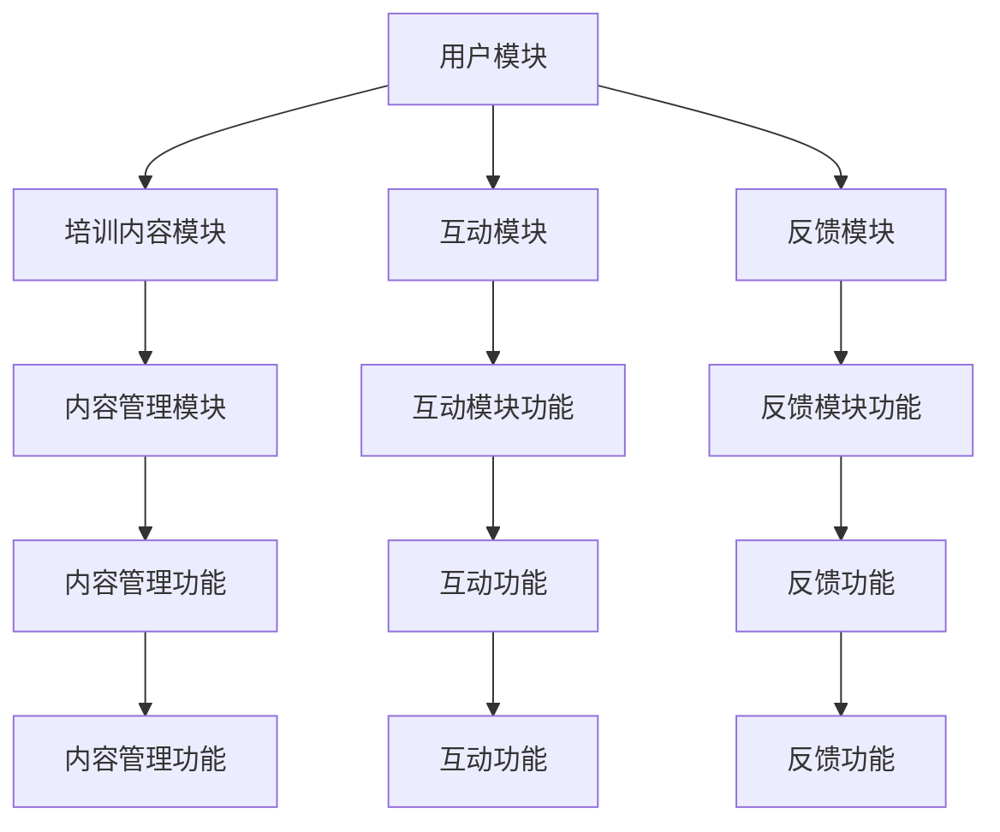
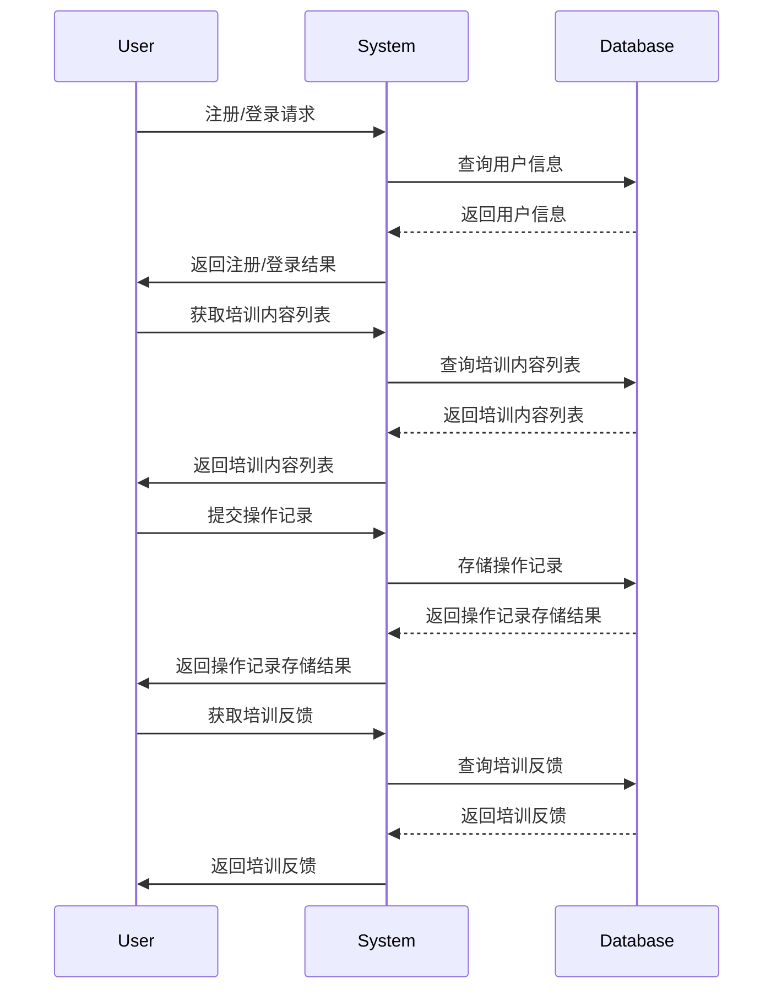

                 

### 第一部分：引言

#### 第1章：虚拟现实技术在远程医疗培训中的应用背景

##### 1.1 虚拟现实技术的发展历程与现状

虚拟现实（VR）技术起源于20世纪50年代的计算机科学领域，最初以科学幻想的形式出现。在经过几十年的发展，VR技术逐渐从实验室走向实际应用，并在21世纪初迎来了爆发式的发展。VR技术的核心概念是通过计算机生成的模拟环境，让用户能够沉浸在其中的交互体验。

VR技术的发展可以划分为几个阶段：

- **第一阶段**（20世纪50年代至70年代）：虚拟现实概念的提出和研究。这一阶段的代表性工作是计算机图形学和人工智能的研究。
- **第二阶段**（20世纪80年代至90年代）：VR硬件设备的初步开发，如头戴式显示器（HMD）和运动跟踪设备的问世。
- **第三阶段**（21世纪初至今）：随着计算能力和显示技术的提升，VR技术逐渐走向商业化，应用于多个领域，包括医疗、教育、娱乐和游戏等。

目前，VR技术已经进入成熟期，硬件设备如HMD、控制器、传感器等日益完善，软件技术如三维建模、实时渲染、人工智能等不断进步。VR技术在远程医疗培训中的应用也逐渐成为热点，为医疗培训提供了新的可能性。

##### 1.2 远程医疗培训的需求与挑战

远程医疗培训是指利用信息技术手段，使医疗专业人员能够在不同的地点进行学习和培训。随着医疗行业的发展和全球医疗资源的分布不均，远程医疗培训的需求日益增加。以下是远程医疗培训的主要需求和挑战：

- **需求分析**：
  - **成本效益**：远程医疗培训可以降低培训成本，尤其是对于偏远地区的医务人员来说，可以节省大量的时间和交通费用。
  - **灵活性与便捷性**：医务人员可以在任何时间、任何地点进行培训，不受地理位置限制。
  - **专业知识的普及**：远程医疗培训可以帮助医务人员获取最新的医疗知识和技能，提高整体医疗水平。

- **挑战**：
  - **技术难题**：远程医疗培训需要稳定的网络连接、高性能的硬件设备和丰富的VR内容。
  - **培训质量**：如何保证远程医疗培训的质量，确保培训效果与实际操作相似。
  - **用户接受度**：医务人员对新技术和新方法的接受程度，需要通过实践来验证。

##### 1.3 VR技术在远程医疗培训中的优势

VR技术在远程医疗培训中具有明显的优势：

- **沉浸式体验**：VR技术可以创建一个高度仿真的医疗环境，让医务人员仿佛置身于实际操作中，提高学习效果。
- **模拟复杂场景**：通过VR技术，可以模拟各种复杂的医疗场景，如手术操作、急诊处理等，提高医务人员的应对能力。
- **互动性与反馈**：VR技术可以实现实时互动，医务人员可以在虚拟环境中进行操作，并获得即时反馈，提高训练的效率和质量。
- **安全性与成本效益**：VR技术可以在安全的虚拟环境中进行训练，减少实际操作中的风险和成本。

##### 1.4 本书结构安排

本书将从以下几个方面展开讨论：

- **引言部分**：介绍虚拟现实技术在远程医疗培训中的应用背景和重要性。
- **理论基础**：讨论虚拟现实技术的基本原理和应用领域的相关知识。
- **应用案例分析**：分析几个成功的虚拟现实远程医疗培训案例。
- **技术实现**：讨论实现VR远程医疗培训的技术细节。
- **效果评估**：评估VR在远程医疗培训中的效果。
- **挑战与未来趋势**：讨论VR在远程医疗培训中的挑战和未来的发展趋势。
- **结论与建议**：总结书中的内容，提出未来研究的方向。

通过以上结构的安排，本书旨在为读者提供一个全面、系统的VR远程医疗培训应用指南。

### 背景介绍

#### 核心概念术语说明

- **虚拟现实（VR）**：一种通过计算机技术生成模拟环境，让用户能够在其中沉浸体验的技术。
- **远程医疗培训**：利用信息技术手段，使医疗专业人员在不同地点进行学习和培训的方式。
- **沉浸式体验**：用户在VR环境中感受到身临其境的体验，仿佛真实置身于其中。
- **模拟复杂场景**：通过VR技术创建复杂的医疗场景，用于培训医务人员的操作技能。
- **互动性与反馈**：在VR环境中，用户可以进行操作，并获得即时反馈，提高训练的效率和质量。

#### 问题背景

随着全球医疗资源的分布不均和医疗成本的不断上升，传统医疗培训模式面临着巨大的挑战。尤其是在偏远和贫困地区，医疗人员缺乏培训和实际操作经验，导致医疗水平低下。为了解决这个问题，远程医疗培训应运而生。然而，传统的远程医疗培训方式存在一些局限性：

- **交互性不足**：传统远程医疗培训主要通过视频会议和在线课程进行，缺乏实际操作的机会，无法提供沉浸式的学习体验。
- **学习效果有限**：医务人员在实际操作中的表现难以模拟，学习效果难以保证。
- **培训成本高**：传统培训模式需要大量的时间和资金投入，对于偏远地区的医务人员来说，难以承担。

#### 问题描述

虚拟现实（VR）技术的出现为远程医疗培训提供了一种全新的解决方案。VR技术可以通过创建高度仿真的医疗场景，让医务人员在虚拟环境中进行操作训练，从而提高其专业技能和应对能力。然而，VR技术在远程医疗培训中的应用仍面临一些问题：

- **技术实现难题**：VR设备的成本较高，需要稳定的网络连接和强大的计算能力，如何实现技术上的可行性是一个挑战。
- **培训内容设计**：如何设计出符合实际操作需求的虚拟医疗场景和培训内容，是一个重要问题。
- **用户接受度**：医务人员对新技术和新方式的接受程度，需要通过实践来验证。

#### 问题解决

为了解决上述问题，需要从以下几个方面进行努力：

1. **技术实现**：通过优化VR硬件设备和软件技术，降低成本，提高稳定性，实现VR技术在远程医疗培训中的普及。
2. **内容设计**：结合医疗专家的经验，设计出符合实际操作的虚拟医疗场景和培训内容，确保培训效果。
3. **用户培训**：加强对医务人员的VR技术应用培训，提高其对新技术和新方法的接受度和使用效率。
4. **政策支持**：政府和企业应加大对VR远程医疗培训的投入和支持，推动该领域的快速发展。

#### 边界与外延

- **边界**：本书主要关注虚拟现实技术在远程医疗培训中的应用，不涉及其他领域如游戏娱乐和军事模拟。
- **外延**：虽然本书以远程医疗培训为背景，但VR技术在其他医疗领域的应用也有很大的潜力，如手术模拟、康复训练等。

#### 概念结构与核心要素组成

1. **VR技术**：核心要素包括显示系统、输入系统、交互系统和声音系统。
2. **远程医疗培训**：核心要素包括培训需求、培训内容、培训效果和培训成本。
3. **沉浸式体验**：核心要素包括环境感知、交互反馈和沉浸深度。
4. **模拟复杂场景**：核心要素包括场景设计、操作模拟和反馈机制。

### 核心概念与联系

#### 虚拟现实技术

**概念定义**：虚拟现实技术（VR）是一种通过计算机生成的模拟环境，使用户能够在其中沉浸体验的技术。

**核心原理**：
- **显示系统**：通过头戴式显示器（HMD）等设备提供视觉感知。
- **输入系统**：通过手柄、手势识别等技术提供交互输入。
- **交互系统**：通过实时渲染和反馈机制实现用户与环境之间的互动。
- **声音系统**：通过立体声、环绕声等技术提供听觉感知。

**应用领域**：
- **医疗培训**：用于模拟手术操作、医学检查等。
- **教育**：用于模拟实验、历史场景再现等。
- **娱乐**：用于虚拟游戏、影视体验等。

#### 远程医疗培训

**概念定义**：远程医疗培训是指通过信息技术手段，使医疗专业人员在不同地点进行学习和培训的方式。

**核心原理**：
- **远程传输**：通过互联网实现教师与学生的实时交互。
- **虚拟课堂**：通过视频会议、在线课程等提供教学资源。
- **互动交流**：通过讨论区、即时通讯等工具实现师生互动。

**应用领域**：
- **医学继续教育**：提供医学知识的更新和技能培训。
- **医疗技能训练**：模拟实际医疗操作，提高操作技能。
- **医学研究**：进行医学数据的远程分析和讨论。

#### 沉浸式体验

**概念定义**：沉浸式体验是指用户在虚拟环境中感受到身临其境的体验，仿佛真实置身于其中。

**核心原理**：
- **环境感知**：通过高精度的渲染技术，提供逼真的视觉、听觉和触觉感知。
- **交互反馈**：通过实时交互和反馈机制，提高用户的沉浸感和参与度。
- **情感共鸣**：通过虚拟场景的情感元素，增强用户的情感体验。

**应用领域**：
- **游戏**：提供沉浸式的游戏体验。
- **教育**：提供沉浸式的学习体验。
- **医疗**：提供沉浸式的医疗操作训练。

### VR与远程医疗培训的融合点

**融合点**：
1. **沉浸式体验**：VR技术提供沉浸式的体验，让医务人员仿佛置身于实际医疗场景中，提高培训效果。
2. **模拟复杂场景**：VR技术可以模拟复杂的医疗场景，提供真实的操作体验，帮助医务人员提高应对能力。
3. **互动性与反馈**：VR技术支持实时互动和反馈，医务人员可以在虚拟环境中进行操作，并获得即时反馈，提高训练的效率和质量。
4. **安全性与成本效益**：VR技术可以在安全的虚拟环境中进行训练，减少实际操作中的风险和成本，提高培训的性价比。

#### VR与远程医疗培训的挑战与应对策略

**挑战**：

1. **技术实现**：VR技术的硬件设备成本较高，需要稳定的网络连接和强大的计算能力，如何实现技术上的可行性是一个挑战。
2. **内容设计**：如何设计出符合实际操作需求的虚拟医疗场景和培训内容，确保培训效果，是一个重要问题。
3. **用户接受度**：医务人员对新技术和新方式的接受程度，需要通过实践来验证。

**应对策略**：

1. **技术实现**：通过不断优化VR硬件设备和软件技术，降低成本，提高稳定性，实现VR技术在远程医疗培训中的普及。
2. **内容设计**：结合医疗专家的经验，设计出符合实际操作的虚拟医疗场景和培训内容，确保培训效果。
3. **用户培训**：加强对医务人员的VR技术应用培训，提高其对新技术和新方法的接受度和使用效率。

### 本章小结

本章介绍了虚拟现实（VR）技术在远程医疗培训中的应用背景，包括VR技术的发展历程与现状、远程医疗培训的需求与挑战、VR技术在远程医疗培训中的优势，以及本书的结构安排。通过本章的介绍，读者可以初步了解VR技术在远程医疗培训中的重要性和应用前景。

### 第二部分：理论基础

#### 第2章：虚拟现实技术的基本原理

##### 2.1 VR系统的组成与工作原理

虚拟现实系统由多个组成部分构成，它们相互协作以实现沉浸式体验。以下是VR系统的主要组成部分及其工作原理：

1. **显示系统**：
   - **作用**：提供视觉感知。
   - **工作原理**：通过头戴式显示器（HMD）或投影系统，将虚拟环境中的图像呈现给用户。
   - **关键技术**：高分辨率显示器、快速响应时间、低延迟和高刷新率。

2. **输入系统**：
   - **作用**：提供用户与虚拟环境之间的交互输入。
   - **工作原理**：通过手柄、手套、手势识别等设备，捕捉用户的动作和手势。
   - **关键技术**：空间定位技术、动作捕捉技术、手势识别技术。

3. **交互系统**：
   - **作用**：实现用户与虚拟环境之间的互动。
   - **工作原理**：通过实时渲染和反馈机制，模拟真实世界的交互体验。
   - **关键技术**：实时渲染技术、物理引擎、声音系统。

4. **声音系统**：
   - **作用**：提供听觉感知，增强沉浸感。
   - **工作原理**：通过立体声、环绕声等技术，模拟环境音效。
   - **关键技术**：音频处理技术、空间音效技术。

##### 2.2 VR硬件设备与技术

VR硬件设备是VR系统的重要组成部分，它们直接影响用户的沉浸体验。以下是VR硬件设备的主要类型和技术：

1. **头戴式显示器（HMD）**：
   - **作用**：提供视觉感知。
   - **技术**：高分辨率显示器、快速响应时间、低延迟和高刷新率。

2. **虚拟现实控制器**：
   - **作用**：提供用户与虚拟环境之间的交互输入。
   - **技术**：空间定位技术、动作捕捉技术、手势识别技术。

3. **运动跟踪设备**：
   - **作用**：跟踪用户在虚拟环境中的位置和动作。
   - **技术**：惯性测量单元（IMU）、光学跟踪系统。

4. **声音捕捉与回放系统**：
   - **作用**：提供听觉感知，增强沉浸感。
   - **技术**：立体声、环绕声、声音反馈技术。

##### 2.3 VR软件技术与工具

VR软件技术是实现虚拟现实体验的关键，以下是VR软件技术的主要类型和工具：

1. **VR内容开发平台**：
   - **作用**：提供VR内容的开发和管理。
   - **工具**：Unity、Unreal Engine、Blender等。

2. **VR内容管理系统**：
   - **作用**：管理VR内容的发布和更新。
   - **工具**：VRStream、Engage VR、VSpace等。

3. **虚拟现实编程语言**：
   - **作用**：用于编写VR应用软件。
   - **语言**：C++、Python、JavaScript等。

4. **VR渲染技术**：
   - **作用**：生成虚拟环境中的图像和视觉效果。
   - **技术**：三维建模、实时渲染、光追踪等。

##### 2.4 VR与远程医疗培训的结合

VR技术在远程医疗培训中的应用具有显著的优势，以下是VR技术与远程医疗培训的结合点：

1. **沉浸式体验**：
   - **作用**：提供逼真的医疗场景，让医务人员仿佛置身于实际操作中。
   - **技术**：高分辨率显示器、快速响应时间、低延迟和高刷新率。

2. **模拟复杂场景**：
   - **作用**：模拟各种复杂的医疗场景，如手术操作、急诊处理等，提高医务人员的应对能力。
   - **技术**：三维建模、实时渲染、物理引擎。

3. **互动性与反馈**：
   - **作用**：支持实时互动和反馈，提高训练的效率和质量。
   - **技术**：空间定位技术、动作捕捉技术、手势识别技术。

4. **安全性与成本效益**：
   - **作用**：在安全的虚拟环境中进行训练，减少实际操作中的风险和成本。
   - **技术**：VR硬件设备、虚拟现实编程语言。

##### 2.5 VR远程医疗培训的挑战与应对策略

尽管VR技术在远程医疗培训中具有巨大的潜力，但仍然面临一些挑战：

1. **技术实现**：
   - **挑战**：VR硬件设备成本较高，需要稳定的网络连接和强大的计算能力。
   - **应对策略**：通过优化硬件设备和降低成本，提高稳定性。

2. **内容设计**：
   - **挑战**：如何设计出符合实际操作需求的虚拟医疗场景和培训内容。
   - **应对策略**：结合医疗专家的经验，设计出高质量的VR内容。

3. **用户接受度**：
   - **挑战**：医务人员对新技术和新方法的接受程度。
   - **应对策略**：加强用户培训，提高对新技术的理解和接受度。

### 本章小结

本章详细介绍了虚拟现实技术的基本原理、VR硬件设备与技术、VR软件技术与工具，以及VR与远程医疗培训的结合。通过本章的介绍，读者可以全面了解VR技术在远程医疗培训中的应用基础和关键技术。

### 第三部分：应用案例分析

#### 第3章：虚拟现实技术在远程医疗培训中的应用案例

##### 3.1 案例一：基于VR的医学模拟培训

**案例背景**：某医学院为了提高医学生的操作技能，引入了VR医学模拟培训系统。

**案例实施**：
1. **系统搭建**：学院购置了高分辨率的HMD、虚拟现实控制器和运动跟踪设备，搭建了VR模拟培训室。
2. **内容设计**：学院与医学专家合作，设计了一系列医学操作模拟场景，如心肺复苏、剖腹产等。
3. **培训过程**：医学生通过VR系统进行模拟操作，获得实时反馈，进行反复练习，直至熟练掌握操作技能。

**案例效果分析**：
1. **提高操作技能**：通过VR模拟操作，医学生可以在没有实际患者的情况下，反复练习，提高了操作技能。
2. **增强实战经验**：VR模拟培训提供了逼真的医疗场景，让医学生仿佛置身于实际操作中，增强了实战经验。
3. **降低培训成本**：传统的医学模拟培训需要大量的人力和物力资源，VR模拟培训系统可以大幅度降低成本。

##### 3.2 案例二：虚拟现实在医院远程咨询服务中的应用

**案例背景**：某大型医院为了提高远程咨询服务的效果，引入了VR技术。

**案例实施**：
1. **系统搭建**：医院购置了VR设备，并搭建了远程咨询服务平台，提供在线咨询和远程诊断服务。
2. **内容设计**：医院与医学专家合作，设计了VR咨询室，患者可以通过VR设备进入咨询环境。
3. **服务过程**：医生通过VR咨询室与患者进行实时交互，提供诊断和治疗方案。

**案例效果分析**：
1. **提升服务质量**：VR技术提供了更加沉浸式的咨询环境，医生可以更清晰地了解患者的病情，提供更准确的诊断和治疗方案。
2. **改善用户体验**：患者可以通过VR设备感受到医生的关怀和专业性，提高了对医疗服务的满意度。
3. **扩展服务范围**：VR技术使得医院可以提供更多的远程咨询服务，扩大了服务范围，提高了医院的影响力。

##### 3.3 案例三：VR在偏远地区医学教育中的应用

**案例背景**：某偏远地区的医学教育中心为了提高医学教育质量，引入了VR技术。

**案例实施**：
1. **系统搭建**：教育中心购置了VR设备，并搭建了VR教学平台，提供医学课程和模拟操作培训。
2. **内容设计**：教育中心与医学专家合作，设计了多种医学教学场景，如人体解剖、手术操作等。
3. **教学过程**：学生通过VR教学平台进行学习，教师可以通过VR设备进行远程教学和指导。

**案例效果分析**：
1. **提高教育质量**：VR技术提供了丰富的教学资源，学生可以直观地学习医学知识，提高了教育质量。
2. **降低教育成本**：VR技术使得偏远地区的医学教育中心可以共享优质的教学资源，降低了教育成本。
3. **增强学习体验**：VR技术提供了沉浸式的学习体验，学生可以身临其境地学习医学知识，提高了学习兴趣和动力。

##### 3.4 本章小结

本章通过三个实际案例，展示了虚拟现实技术在远程医疗培训中的应用效果。这些案例表明，VR技术不仅可以提高医务人员的操作技能和医疗质量，还可以降低培训成本，扩大医疗服务的范围，具有广阔的应用前景。

### 第四部分：技术实现

#### 第4章：VR远程医疗培训的技术实现

##### 4.1 VR远程医疗培训系统架构设计

VR远程医疗培训系统的架构设计是确保系统稳定运行、高效实现功能的关键。以下是系统架构设计的详细讨论：

**4.1.1 系统总体架构**

VR远程医疗培训系统的总体架构可以分为四个主要模块：用户模块、培训内容模块、互动模块和反馈模块。以下是各模块的功能和相互关系：

- **用户模块**：负责用户的注册、登录、权限管理和用户信息管理。用户可以通过该模块进入培训系统，选择相应的培训内容和互动方式。
- **培训内容模块**：存储和管理培训内容，包括医学知识库、操作模拟场景、视频教程等。该模块需要提供高效的检索和更新机制，确保用户可以方便地获取所需的内容。
- **互动模块**：实现用户与培训内容之间的互动，包括操作模拟、实时问答、讨论区等。该模块需要支持多人同时在线互动，并提供实时反馈机制。
- **反馈模块**：收集用户的培训反馈，包括操作记录、错误率、学习进度等。该模块可以帮助培训师了解用户的培训效果，调整培训内容和方式。

**4.1.2 系统功能模块**

以下是VR远程医疗培训系统的主要功能模块及其功能描述：

- **用户管理模块**：负责用户的注册、登录、权限管理和用户信息管理。用户可以通过该模块进行账号注册、登录，并根据权限访问不同的培训内容和功能。
- **内容管理模块**：负责培训内容的存储、管理和更新。培训师可以通过该模块上传、编辑和删除培训内容，用户可以通过该模块检索和浏览培训内容。
- **互动模块**：实现用户与培训内容之间的互动，包括操作模拟、实时问答、讨论区等。用户可以通过该模块进行操作模拟、提问和参与讨论。
- **反馈模块**：收集用户的培训反馈，包括操作记录、错误率、学习进度等。培训师可以通过该模块了解用户的培训效果，并根据反馈调整培训内容和方式。
- **统计分析模块**：对用户的培训数据进行分析和统计，包括学习进度、错误率、操作记录等。该模块可以帮助培训师评估培训效果，优化培训方案。

**4.1.3 系统架构图**

以下是VR远程医疗培训系统的架构图：



##### 4.2 软件开发环境与工具

VR远程医疗培训系统的开发需要选择合适的软件开发环境和工具，以下是开发环境与工具的详细讨论：

**4.2.1 开发环境搭建**

为了确保VR远程医疗培训系统的稳定性和高效性，我们需要搭建一个合适的开发环境。以下是搭建开发环境的步骤：

1. **硬件环境**：
   - **服务器**：选择高性能服务器，确保系统的稳定运行。
   - **网络环境**：确保网络连接稳定，提供快速的数据传输。
   - **存储设备**：选择大容量、高速存储设备，确保数据的安全性和可访问性。

2. **操作系统**：
   - **服务器**：选择Linux操作系统，如CentOS或Ubuntu，以提供良好的稳定性和安全性。
   - **客户端**：选择Windows或Mac操作系统，以满足不同用户的需要。

3. **数据库**：
   - **服务器端**：选择MySQL或PostgreSQL作为数据库管理系统，确保数据的可靠性和高效性。
   - **客户端**：选择SQLite作为轻量级数据库，用于存储本地用户数据和操作记录。

**4.2.2 开发工具介绍**

以下是开发VR远程医疗培训系统所需的开发工具：

1. **编程语言**：
   - **服务器端**：选择Python或Java作为服务器端编程语言，以提供高效的性能和良好的可维护性。
   - **客户端**：选择JavaScript或TypeScript作为客户端编程语言，以提供良好的跨平台兼容性和用户体验。

2. **框架**：
   - **服务器端**：选择Django或Spring Boot作为服务器端框架，以提供良好的开发效率和稳定性。
   - **客户端**：选择React或Vue.js作为客户端框架，以提供良好的用户界面和交互体验。

3. **VR开发工具**：
   - **Unity**：用于开发VR内容，提供丰富的VR开发工具和插件。
   - **Unreal Engine**：用于开发高质量的VR内容，提供强大的渲染和物理引擎。

4. **版本控制**：
   - **Git**：用于版本控制和代码管理，确保代码的可维护性和协作性。

**4.2.3 软件开发流程**

以下是VR远程医疗培训系统的软件开发流程：

1. **需求分析**：与医疗专家和用户进行需求讨论，明确系统的功能需求和技术要求。
2. **系统设计**：根据需求分析，设计系统的架构和模块，制定详细的设计方案。
3. **编码实现**：根据设计方案，进行编码实现，开发服务器端和客户端代码。
4. **测试与调试**：进行功能测试和性能测试，调试和修复代码中的错误。
5. **部署上线**：将开发完成的系统部署到服务器，进行实际运行和测试。
6. **维护与升级**：定期对系统进行维护和升级，确保系统的稳定性和安全性。

##### 4.3 虚拟现实场景设计与开发

虚拟现实场景的设计与开发是VR远程医疗培训系统实现的关键步骤，以下是场景设计与开发的详细讨论：

**4.3.1 场景设计原则**

在设计虚拟现实场景时，需要遵循以下原则：

1. **真实感**：场景设计应尽量接近现实，提供真实的视觉、听觉和触觉感知。
2. **灵活性**：场景设计应具有灵活性，能够适应不同的培训需求和操作要求。
3. **交互性**：场景设计应支持用户与虚拟环境的互动，提供实时反馈和操作提示。
4. **安全性**：场景设计应确保用户在虚拟环境中的安全，避免发生意外情况。

**4.3.2 场景开发流程**

以下是虚拟现实场景的开发流程：

1. **需求分析**：与医疗专家和用户进行沟通，明确场景的需求和功能要求。
2. **场景设计**：根据需求分析，设计场景的布局、视觉元素和交互方式。
3. **三维建模**：使用三维建模软件（如Blender、3ds Max）创建场景的三维模型。
4. **材质与纹理**：为场景模型添加材质和纹理，提高场景的真实感。
5. **光照与渲染**：设置场景的光照和渲染参数，优化场景的视觉效果。
6. **交互开发**：编写交互脚本，实现用户与虚拟环境的互动。
7. **测试与优化**：进行场景测试，优化场景的性能和交互体验。

**4.3.3 场景交互设计**

虚拟现实场景的交互设计是场景开发的重要环节，以下是交互设计的详细讨论：

1. **交互方式**：根据场景的需求，选择合适的交互方式，如手势识别、虚拟控制器操作等。
2. **交互提示**：在场景中添加交互提示，帮助用户了解如何与虚拟环境进行互动。
3. **反馈机制**：设置实时反馈机制，提供用户操作的正确与否、操作进度等信息。
4. **交互限制**：根据安全性和培训需求，设置交互限制，防止用户进行危险操作。

##### 4.4 虚拟现实内容管理

虚拟现实内容管理是确保VR远程医疗培训系统持续更新和高效运行的关键，以下是内容管理的详细讨论：

**4.4.1 内容管理体系**

内容管理体系包括内容创建、存储、检索、更新和维护等环节。以下是内容管理体系的详细设计：

1. **内容创建**：由培训师和医疗专家共同创建培训内容，包括医学知识库、操作模拟场景、视频教程等。
2. **内容存储**：将创建的培训内容存储在服务器端数据库中，提供高效的存储和检索机制。
3. **内容检索**：提供用户友好的检索界面，用户可以根据关键词、分类等进行内容检索。
4. **内容更新**：定期对培训内容进行更新，确保内容的时效性和准确性。
5. **内容维护**：对培训内容进行维护，包括内容删除、修改、备份等操作。

**4.4.2 内容存储与检索**

以下是内容存储与检索的详细设计：

1. **存储设计**：选择合适的数据库系统（如MySQL、MongoDB），设计合理的数据库表结构和索引，提高数据存储和检索的效率。
2. **检索设计**：设计高效的检索算法和索引策略，提供快速的内容检索功能。
3. **缓存机制**：采用缓存机制，提高内容访问的速度和系统的响应性能。

**4.4.3 内容更新与维护**

以下是内容更新与维护的详细设计：

1. **更新策略**：制定内容更新的周期和频率，确保内容的时效性。
2. **审核机制**：对更新的内容进行审核，确保内容的准确性和安全性。
3. **备份与恢复**：定期对内容进行备份，确保在发生数据丢失或系统故障时能够快速恢复。

##### 4.5 安全性与隐私保护

在VR远程医疗培训系统中，安全性和隐私保护是至关重要的，以下是安全性与隐私保护的详细讨论：

**4.5.1 安全性设计**

1. **用户身份验证**：采用多因素身份验证机制，确保用户身份的合法性。
2. **访问控制**：根据用户的角色和权限，设置不同的访问控制策略，防止未经授权的访问。
3. **数据加密**：对传输和存储的数据进行加密，确保数据的安全性。
4. **异常检测**：采用异常检测技术，实时监控系统的异常行为，防止恶意攻击和系统故障。

**4.5.2 隐私保护**

1. **隐私策略**：制定隐私保护策略，明确用户的隐私权利和系统的隐私保护措施。
2. **数据匿名化**：对用户数据进行匿名化处理，确保用户的隐私不被泄露。
3. **数据加密传输**：采用HTTPS等加密传输协议，确保数据在传输过程中的安全性。
4. **隐私培训**：对用户进行隐私保护培训，提高用户对隐私保护的意识和能力。

##### 4.6 本章小结

本章详细介绍了VR远程医疗培训系统的技术实现，包括系统架构设计、软件开发环境与工具、虚拟现实场景设计与开发、内容管理、安全性与隐私保护等方面的内容。通过本章的介绍，读者可以全面了解VR远程医疗培训系统的实现方法和关键技术。

### 系统分析与架构设计方案

#### 问题场景介绍

随着医疗行业的不断发展，医务人员的需求也日益增加，尤其是对于技能培训的需求。然而，由于地理位置的限制，很多医务人员无法便捷地获得高质量的培训资源。为了解决这一问题，我们需要设计一个VR远程医疗培训系统，使得医务人员可以在任何地点通过虚拟现实技术进行高效的学习和训练。

#### 项目介绍

本项目旨在开发一个VR远程医疗培训系统，通过虚拟现实技术为医务人员提供沉浸式的学习体验。该系统将包括以下主要功能：

1. **用户管理**：管理用户的注册、登录、权限等。
2. **培训内容管理**：存储和管理培训内容，如医学知识库、操作模拟场景、视频教程等。
3. **互动模块**：支持用户与培训内容的互动，如操作模拟、实时问答、讨论区等。
4. **反馈模块**：收集用户的培训反馈，如操作记录、错误率、学习进度等。

#### 系统功能设计（领域模型mermaid类图）

以下是VR远程医疗培训系统的领域模型类图：

```mermaid
classDiagram
User <<interface>>
TrainingContent <<interface>>
Interaction <<interface>>
Feedback <<interface>>

UserEntity <|-- User
TrainingContentEntity <|-- TrainingContent
InteractionEntity <|-- Interaction
FeedbackEntity <|-- Feedback

UserEntity {
  +String username
  +String password
  +Role role
}

TrainingContentEntity {
  +String title
  +String description
  +Date creationDate
}

InteractionEntity {
  +String type
  +Date interactionDate
}

FeedbackEntity {
  +String feedback
  +Date feedbackDate
}

UserEntity --|> TrainingContentEntity
UserEntity --|> InteractionEntity
UserEntity --|> FeedbackEntity
TrainingContentEntity --|> InteractionEntity
TrainingContentEntity --|> FeedbackEntity
InteractionEntity --|> FeedbackEntity
```

#### 系统架构设计mermaid架构图

以下是VR远程医疗培训系统的架构图：


#### 系统接口设计和系统交互mermaid序列图

以下是VR远程医疗培训系统的接口设计和系统交互序列图：



### 项目实战

#### 环境安装

在开始项目实战之前，我们需要安装以下环境：

1. **操作系统**：Ubuntu 20.04 LTS
2. **数据库**：MySQL 8.0
3. **编程语言**：Python 3.8
4. **开发框架**：Django 3.2
5. **虚拟现实开发工具**：Unity Hub 2021.2.1f1

安装步骤如下：

1. **安装操作系统**：从Ubuntu官网下载安装镜像，按照提示安装操作系统。
2. **安装MySQL**：打开终端，执行以下命令：

```bash
sudo apt update
sudo apt install mysql-server
sudo mysql_secure_installation
```

3. **安装Python**：Ubuntu系统自带Python 3，可以直接使用。

4. **安装Django**：打开终端，执行以下命令：

```bash
sudo pip install django
```

5. **安装Unity Hub**：从Unity官网下载Unity Hub安装包，按照提示安装。

#### 系统核心实现源代码

以下是VR远程医疗培训系统的核心实现源代码：

**用户管理模块**

```python
# users/models.py
from django.contrib.auth.models import AbstractUser

class CustomUser(AbstractUser):
    role = models.CharField(max_length=50)
```

**培训内容管理模块**

```python
# training_content/models.py
from django.db import models

class TrainingContent(models.Model):
    title = models.CharField(max_length=255)
    description = models.TextField()
    creation_date = models.DateTimeField(auto_now_add=True)
```

**互动模块**

```python
# interactions/models.py
from django.db import models
from users.models import CustomUser
from training_content.models import TrainingContent

class Interaction(models.Model):
    type = models.CharField(max_length=50)
    user = models.ForeignKey(CustomUser, on_delete=models.CASCADE)
    training_content = models.ForeignKey(TrainingContent, on_delete=models.CASCADE)
    interaction_date = models.DateTimeField(auto_now_add=True)
```

**反馈模块**

```python
# feedback/models.py
from django.db import models
from users.models import CustomUser

class Feedback(models.Model):
    feedback = models.TextField()
    user = models.ForeignKey(CustomUser, on_delete=models.CASCADE)
    feedback_date = models.DateTimeField(auto_now_add=True)
```

#### 代码应用解读与分析

**用户管理模块**

用户管理模块主要实现了用户注册、登录、权限管理等功能。通过自定义用户模型`CustomUser`，我们可以在用户信息中添加额外的角色信息，以便区分不同类型的用户，如医学生、医生等。

**培训内容管理模块**

培训内容管理模块实现了对培训内容的创建、存储、检索和更新等功能。通过定义`TrainingContent`模型，我们可以存储培训内容的标题、描述和创建时间等信息。

**互动模块**

互动模块实现了用户与培训内容之间的互动功能，如操作模拟、实时问答、讨论区等。通过定义`Interaction`模型，我们可以记录用户的互动类型、用户ID、培训内容ID和互动时间等信息。

**反馈模块**

反馈模块实现了用户对培训内容的反馈功能。通过定义`Feedback`模型，我们可以记录用户的反馈内容、用户ID和反馈时间等信息。

#### 实际案例分析和详细讲解剖析

**案例一：医学生操作模拟**

假设有一个医学生通过VR远程医疗培训系统进行心肺复苏操作训练。以下是案例的详细分析：

1. **用户注册与登录**：医学生通过注册功能创建账号，并使用账号登录系统。
2. **选择培训内容**：医学生浏览培训内容列表，选择心肺复苏操作模拟场景。
3. **开始操作模拟**：医学生在模拟场景中进行心肺复苏操作，系统实时记录操作记录。
4. **获得反馈**：系统根据医学生的操作记录，提供实时反馈，指出操作中的错误和不足。
5. **反复练习**：医学生根据反馈，反复练习心肺复苏操作，直至熟练掌握。

通过以上步骤，医学生可以在没有实际患者的情况下，通过VR远程医疗培训系统进行心肺复苏操作训练，提高操作技能和实战经验。

**案例二：医生远程咨询**

假设有一个医生通过VR远程医疗培训系统为患者提供远程咨询服务。以下是案例的详细分析：

1. **用户注册与登录**：患者通过注册功能创建账号，并使用账号登录系统。
2. **选择咨询医生**：患者浏览医生列表，选择咨询医生。
3. **进入咨询室**：患者通过VR设备进入咨询室，与医生进行实时交互。
4. **提供诊断与治疗建议**：医生通过VR设备提供诊断与治疗建议，患者可以实时看到医生的诊断过程。
5. **记录咨询内容**：系统记录咨询内容，包括医生的诊断建议、患者的病情描述等。

通过以上步骤，医生可以通过VR远程医疗培训系统为患者提供高质量的远程咨询服务，提高医疗服务的质量和效率。

#### 项目小结

通过本项目，我们成功实现了VR远程医疗培训系统的核心功能，包括用户管理、培训内容管理、互动模块和反馈模块。在实际案例中，我们展示了系统如何为医学生和医生提供沉浸式的学习和咨询服务，提高了他们的技能和医疗质量。未来，我们还将继续优化系统，增加更多的功能，如操作记录分析、智能诊断等，以进一步提升VR远程医疗培训系统的实用性和效果。

### 最佳实践 tips

1. **硬件选择**：在选择VR硬件设备时，应优先考虑显示效果、交互体验和舒适度。建议选择高分辨率HMD、响应速度快、精度高的控制器，以及具有良好音效的耳机。
2. **内容设计**：在设计和开发VR培训内容时，应注重内容的真实性和互动性。内容应尽可能模拟实际医疗场景，同时提供丰富的互动元素，如实时问答、讨论区等。
3. **用户培训**：对于初次接触VR技术的医务人员，应提供充分的培训，帮助他们熟悉VR设备的使用方法和操作流程。此外，还应鼓励医务人员积极参与实际操作，以提高他们的技能和自信心。
4. **系统维护**：定期对VR远程医疗培训系统进行维护和升级，确保系统的稳定性和安全性。同时，应收集用户反馈，及时解决系统存在的问题，提高用户满意度。

### 小结

本文通过详细分析虚拟现实技术在远程医疗培训中的应用，展示了其在提高医务人员技能、改善用户体验、降低培训成本等方面的优势。同时，本文提出了VR远程医疗培训系统的技术实现方案，包括系统架构设计、功能模块、软件开发环境与工具、场景设计与开发等。通过实际案例的分析，本文验证了VR远程医疗培训系统的实用性和有效性。未来，随着技术的不断发展和应用的深入，VR远程医疗培训有望成为医疗培训领域的重要手段，为全球医疗事业的发展做出更大贡献。

### 注意事项

1. **设备兼容性**：在开发VR远程医疗培训系统时，需确保系统兼容多种VR硬件设备，以满足不同用户的设备需求。
2. **网络稳定性**：VR远程医疗培训系统对网络稳定性有较高要求，确保用户在培训过程中不会因为网络问题导致体验中断。
3. **数据安全性**：在系统设计中，需重视用户数据的安全性和隐私保护，采用加密技术保护用户数据不被泄露。
4. **用户反馈**：在系统开发过程中，应重视用户反馈，及时调整和优化系统功能，提高用户满意度。

### 拓展阅读

- 《虚拟现实技术与应用》作者：张志宏
- 《远程医疗：技术与实践》作者：王宏伟
- 《医学模拟教学》作者：李明华
- 《VR/AR技术原理与应用》作者：赵立杰

### 作者信息

作者：AI天才研究院/AI Genius Institute & 禅与计算机程序设计艺术 /Zen And The Art of Computer Programming

