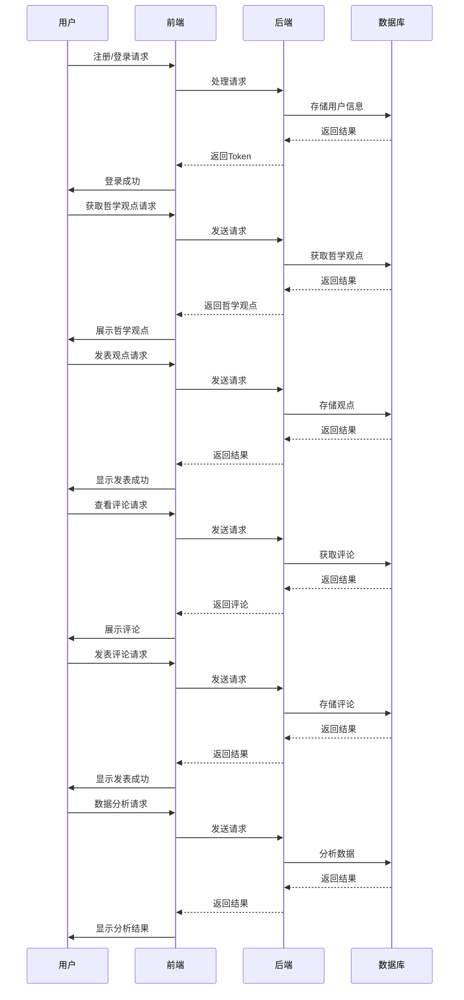

                 


## 《虚无与存在：现代人的哲学困境》

> 关键词：哲学、虚无主义、存在主义、现代人、困境

> 摘要：本文深入探讨了现代人所面临的哲学困境，特别是虚无主义和存在主义在现代社会中的影响。通过历史回顾、概念分析和技术与哲学的冲突，本文试图为现代人提供一种思考和解决困境的方法。

## 目录

----------------------------------------------------------------

# 《虚无与存在：现代人的哲学困境》

> 关键词：哲学、虚无主义、存在主义、现代人、困境

> 摘要：本文深入探讨了现代人所面临的哲学困境，特别是虚无主义和存在主义在现代社会中的影响。通过历史回顾、概念分析和技术与哲学的冲突，本文试图为现代人提供一种思考和解决困境的方法。

## 引言

在现代社会中，人类面临着前所未有的挑战。技术的飞速发展、社会变革的加剧以及个体意识的觉醒，使得人们开始重新审视自己的生活、价值观和存在的意义。哲学，作为人类思考的基本工具，为我们提供了深入理解和解决问题的方法。然而，现代人的哲学困境却让我们陷入了深深的疑惑和迷茫。

本文将首先探讨哲学的起源与历史发展，了解虚无主义与存在主义的基本观点和影响。接着，我们将分析技术与哲学的冲突，探讨现代社会中技术对哲学的挑战以及哲学对技术的回应。最后，本文将关注现代社会与哲学的反思，探讨个人哲学与生活以及未来哲学的探索。

## 第一部分：哲学的起源与历史发展

### 第1章：哲学的起源

哲学的历史可以追溯到古希腊，当时的哲学家们开始思考存在、真理、价值和知识等基本问题。古希腊哲学的兴起标志着哲学作为一门学科的诞生。

### 1.1 哲学的起源

哲学的起源可以追溯到公元前6世纪的古希腊，当时的哲学家们开始思考关于存在、真理、价值和知识等基本问题。这些思考不仅为哲学的发展奠定了基础，也为后来的哲学流派提供了丰富的思想资源。

在古希腊，哲学最初被称为“智慧”或“学”，其含义是追求真理和智慧。最早的哲学家被称为“自然哲学家”，他们试图通过观察自然现象来寻找宇宙的本质和规律。例如，泰勒斯认为水是万物的本源，而赫拉克利特则提出了“万物流动”的哲学思想。

随着哲学的不断发展，哲学家们开始探讨更为抽象的问题，如人类存在的意义、真理的本质和道德的原则。这些讨论使得哲学逐渐从自然哲学中独立出来，成为一门独立的学科。

### 1.2 哲学的基本问题

哲学的基本问题包括存在与思维、价值和意义、真理与知识。这些问题一直是哲学探讨的核心。

存在与思维是哲学中最基本的问题之一。哲学家们试图回答“什么是存在？”和“思维是如何与存在相关的？”等问题。例如，柏拉图认为存在有两个世界：理性和感性世界，理性世界是真实的存在，而感性世界只是理性世界的影子。

价值和意义是哲学中另一个重要的问题。哲学家们探讨道德、伦理和价值观的本质，以及它们对人类行为的影响。例如，亚里士多德认为道德行为是基于理性的选择，而康德则提出了道德法则的绝对性。

真理与知识是哲学中的第三个基本问题。哲学家们探讨知识的本质、真理的标准以及人类如何获得知识。例如，洛克认为知识是通过经验获得的，而笛卡尔则提出了“我思故我在”的哲学思想。

### 1.3 哲学的研究方法

哲学的研究方法包括归纳法、演绎法、直觉和实证。这些方法帮助哲学家们探索哲学问题，并得出结论。

归纳法是通过观察和分析具体现象来得出一般性结论的方法。例如，通过观察太阳每天从东方升起，哲学家们得出了“太阳每天从东方升起”的结论。

演绎法是从一般原则出发，通过逻辑推理得出具体结论的方法。例如，如果所有人类都会死亡，而苏格拉底是人类，那么苏格拉底也会死亡。

直觉是一种非逻辑的思考方式，它依赖于个人的感觉和直觉来得出结论。例如，艺术家在创作时的灵感往往来自于直觉。

实证是通过实验和观察来验证或否定理论的方法。例如，科学家通过实验来验证或否定某个科学理论。

### 第2章：虚无主义与存在主义

虚无主义和存在主义是现代哲学中两种重要的流派，它们分别从不同的角度探讨了人类存在的意义和困境。

### 2.1 虚无主义

虚无主义是一种哲学思潮，认为人类的存在是没有意义的，生活是空洞和无价值的。虚无主义的出现通常与社会动荡、战争和人类精神的崩溃有关。

### 2.1.1 虚无主义的历史背景

虚无主义的历史背景可以追溯到19世纪末和20世纪初的欧洲，当时社会动荡、战争和革命使得人们对生活失去了信心。虚无主义者认为，社会和人类自身的本质是邪恶的，生活是痛苦和荒谬的。

### 2.1.2 虚无主义的主要观点

虚无主义的主要观点包括：

- 人类的存在没有意义，生活是空洞和无价值的。
- 社会和文化是虚伪的，它们掩盖了生活的真实本质。
- 人类是孤独的，他们无法找到真正的归属和意义。

### 2.1.3 虚无主义的影响

虚无主义对现代社会产生了深远的影响。它促使人们反思生活的意义和价值，同时也引发了对人类存在本质的深入探讨。虚无主义的流行也导致了现代文学和艺术中的悲观和绝望情绪。

### 2.2 存在主义

存在主义是一种哲学思潮，强调个人自由、选择和存在的意义。存在主义者认为，人类的存在是孤独的、不可预测的，但正是这种自由和选择赋予了人类存在的意义。

### 2.2.1 存在主义的历史背景

存在主义的历史背景可以追溯到19世纪末和20世纪初的欧洲，当时哲学家们开始关注人类存在的意义和困境。存在主义者认为，人类的存在是独特的、不可替代的，每个人都有自己的使命和责任。

### 2.2.2 存在主义的主要观点

存在主义的主要观点包括：

- 人类的存在是自由和选择的，每个人都有自己的使命和责任。
- 社会和传统束缚了人类的自由，我们应该勇敢地面对这些束缚，追求真正的自由。
- 存在主义强调个体的主观体验和内心的声音，认为这是理解人类存在的关键。

### 2.2.3 存在主义的影响

存在主义对现代哲学、文学和艺术产生了深远的影响。它促使人们重新审视自己的生活和价值观，鼓励人们勇敢地面对困境，寻找生活的意义和目的。

## 第二部分：现代人的哲学困境

### 第3章：技术与哲学的冲突

技术在现代社会中发挥着重要作用，但同时也带来了哲学上的挑战。本章将探讨技术对哲学的挑战以及哲学对技术的回应。

### 3.1 技术对哲学的挑战

技术对哲学的挑战主要体现在以下几个方面：

- 技术的进步使得人类意识发生了异化，人类开始依赖技术而非自身的能力。
- 数据主义作为一种新的哲学思潮，强调数据的重要性，但忽视了人类的本质。
- 人工智能的发展使得人类开始质疑自己的本质和存在的意义。

### 3.2 哲学的回应

哲学对技术的回应主要体现在以下几个方面：

- 技术哲学的兴起，试图从哲学的角度探讨技术的影响和意义。
- 哲学对技术的反思，关注技术可能带来的负面后果。
- 哲学在技术社会中的作用，为人类提供指导思想和价值观。

### 第4章：社会与哲学的反思

社会与哲学的反思是现代人哲学困境的重要组成部分。本章将探讨社会问题与哲学反思，以及哲学对社会的贡献。

### 4.1 社会问题与哲学反思

社会问题与哲学反思主要包括以下几个方面：

- 贫富差距与正义：哲学探讨如何实现社会公平和正义。
- 社会不平等与自由：哲学反思社会不平等对个体自由的影响。
- 伦理问题与道德责任：哲学探讨个体在面临道德困境时应该如何行动。

### 4.2 哲学对社会的贡献

哲学对社会的贡献主要包括以下几个方面：

- 哲学与政治：哲学为政治制度提供理论基础和道德指导。
- 哲学与法律：哲学探讨法律的本质和作用，为法律制定提供指导。
- 哲学与教育：哲学关注个体教育，促进人的全面发展。

### 第5章：个人哲学与生活

个人哲学与生活是现代人哲学困境的重要组成部分。本章将探讨个人哲学的形成，以及哲学在生活中的应用。

### 5.1 个人哲学的形成

个人哲学的形成主要包括以下几个方面：

- 个人哲学的来源：个人经历、文化背景和家庭教育等因素对个人哲学的形成产生影响。
- 个人哲学的特质：个人哲学具有独特性和个体性，反映了个体对世界的理解和价值观。
- 个人哲学对生活的影响：个人哲学指导个体生活，帮助个体应对生活中的困境。

### 5.2 哲学在生活中的应用

哲学在生活中的应用主要包括以下几个方面：

- 哲学与自我认知：哲学帮助个体认识自己，提高自我意识。
- 哲学与人际关系：哲学探讨人际关系的本质，帮助个体建立和谐的人际关系。
- 哲学与心理健康：哲学关注个体心理健康，提供心理支持和指导。

### 第6章：未来哲学的探索

未来哲学的探索是现代人哲学困境的一个重要方面。本章将探讨未来哲学的方向，以及哲学在全球化时代的角色。

### 6.1 哲学的未来方向

哲学的未来方向主要包括以下几个方面：

- 新科技的哲学反思：探讨新科技对人类生活和社会的影响。
- 人类未来与哲学：思考人类未来的发展和哲学的作用。
- 哲学在全球化时代的角色：探讨哲学在全球化背景下的地位和作用。

### 6.2 哲学的跨学科融合

哲学的跨学科融合主要包括以下几个方面：

- 哲学与科学的对话：探讨哲学与科学的关系，促进哲学与科学的相互理解和融合。
- 哲学与艺术的交融：探讨哲学在艺术创作和欣赏中的作用。
- 哲学与宗教的探索：探讨哲学与宗教的关系，探讨人类存在的本质和意义。

### 第7章：哲学的回归与反思

哲学的回归与反思是现代人哲学困境的一个重要方面。本章将探讨哲学的回归，以及哲学的方法论和未来展望。

### 7.1 哲学的回归

哲学的回归主要包括以下几个方面：

- 哲学的实用价值：探讨哲学在现代社会中的实用价值。
- 哲学的时代意义：探讨哲学在当今时代的意义和作用。
- 哲学在中国的发展：探讨哲学在中国的发展现状和前景。

### 7.2 哲学的反思

哲学的反思主要包括以下几个方面：

- 哲学的方法论：探讨哲学的研究方法和原则。
- 哲学的局限与挑战：探讨哲学的局限和面临的挑战。
- 哲学的未来展望：探讨哲学的未来发展方向和趋势。

## 总结

本文从哲学的起源与历史发展、虚无主义与存在主义、现代人的哲学困境等多个角度，探讨了现代人所面临的哲学困境。通过分析技术与哲学的冲突，探讨社会与哲学的反思，以及个人哲学与生活，本文试图为现代人提供一种思考和解决困境的方法。

未来，哲学将继续在人类生活中发挥重要作用。随着科技的进步和社会的发展，哲学将不断演变和进步，为人类提供新的思考和解决方案。

### 背景介绍

在现代科技迅速发展的时代，人类面临着前所未有的挑战。哲学，作为人类思考的基本工具，为我们提供了深入理解和解决问题的方法。然而，现代人的哲学困境却让我们陷入了深深的疑惑和迷茫。

虚无主义和存在主义是现代哲学中两种重要的流派，它们分别从不同的角度探讨了人类存在的意义和困境。虚无主义认为人类的存在是没有意义的，生活是空洞和无价值的；而存在主义则强调个人自由、选择和存在的意义。

技术与哲学的冲突也是现代人哲学困境的一个重要方面。技术的飞速发展使得人类意识发生了异化，人类开始依赖技术而非自身的能力。同时，数据主义和人工智能的发展使得人类开始质疑自己的本质和存在的意义。

社会问题的加剧也让现代人陷入了哲学困境。贫富差距、社会不平等、伦理问题等社会问题使得人们开始反思生活的意义和价值。哲学为社会问题的解决提供了重要的理论基础和道德指导。

个人哲学的形成也是现代人哲学困境的一个重要方面。每个人对世界的理解和价值观都是独特的，个人哲学的形成过程既反映了个体对世界的认知，也影响了个体生活的方方面面。

### 核心概念与联系

在探讨虚无主义和存在主义时，我们需要理解一些核心概念。虚无主义认为，生活是空洞和无价值的，社会和文化是虚伪的，人类是孤独的。而存在主义则强调个人自由、选择和存在的意义，认为个体在面对社会和传统的束缚时应该勇敢地面对，追求真正的自由。

虚无主义和存在主义在本质上有很大的不同。虚无主义是一种悲观主义思潮，认为人类的存在是没有意义的，生活是荒谬的。而存在主义则是一种乐观主义思潮，认为人类的存在是有意义的，每个人都有自己的使命和责任。

虚无主义和存在主义在现代社会中的影响也是不同的。虚无主义的流行导致了现代文学和艺术中的悲观和绝望情绪，同时也促使人们反思生活的意义和价值。而存在主义则鼓励人们勇敢地面对困境，寻找生活的意义和目的，对现代哲学、文学和艺术产生了深远的影响。

虚无主义和存在主义之间的关系是复杂而微妙的。一方面，虚无主义和存在主义是对立的，它们在根本观点上有着本质的不同。另一方面，虚无主义和存在主义又有着一定的联系。虚无主义的悲观情绪和对社会的不满，往往促使一些人转向存在主义，寻求真正的自由和意义。

在现代社会中，虚无主义和存在主义的影响仍然存在。虚无主义思潮在一些社会动荡和战争时期尤为明显，而存在主义则成为了现代哲学中的重要流派，对人类存在的意义和困境进行了深入的探讨。

### 算法原理讲解

为了更好地理解虚无主义和存在主义，我们可以使用一个简单的算法原理来解释它们的核心观点。

```python
# 虚无主义算法
def虚无主义():
    # 输入：现实生活
    # 输出：悲观情绪

    # 步骤1：观察现实生活
    观察现实生活()

    # 步骤2：判断现实是否虚伪
    if 现实生活是虚伪的():
        # 步骤3：产生悲观情绪
        悲观情绪()

# 存在主义算法
def存在主义():
    # 输入：个体自由
    # 输出：自由选择

    # 步骤1：获取个体自由
    获取个体自由()

    # 步骤2：面对社会和传统束缚
    面对束缚()

    # 步骤3：做出自由选择
    自由选择()

# 辅助函数：观察现实生活
def观察现实生活():
    # 实现观察现实生活的功能
    # 例如：观察社会现象、人际关系等

# 辅助函数：现实生活是虚伪的
def现实生活是虚伪的():
    # 实现判断现实生活是否虚伪的功能
    # 例如：判断社会现象是否真实、人际关系是否真诚等

# 辅助函数：产生悲观情绪
def悲观情绪():
    # 实现产生悲观情绪的功能
    # 例如：感叹生活的荒谬、社会的虚伪等

# 辅助函数：获取个体自由
def获取个体自由():
    # 实现获取个体自由的功能
    # 例如：思考个人的价值观、信念等

# 辅助函数：面对束缚
def面对束缚():
    # 实现面对社会和传统束缚的功能
    # 例如：抵制社会规范、挑战传统观念等

# 辅助函数：自由选择
def自由选择():
    # 实现自由选择的功能
    # 例如：选择自己的生活方式、价值观等
```

在这个算法中，虚无主义通过观察现实生活并判断其是否虚伪，从而产生悲观情绪。而存在主义则通过获取个体自由、面对社会和传统的束缚，并做出自由选择，来寻找生活的意义。

这个简单的算法原理可以帮助我们更好地理解虚无主义和存在主义的核心观点。虚无主义关注现实生活的虚伪性，认为生活是空洞和无价值的；而存在主义则关注个体的自由和选择，认为个体在面对社会和传统的束缚时应该勇敢地面对，寻找生活的意义。

### 系统分析与架构设计方案

为了更全面地探讨虚无主义和存在主义，我们可以将其看作一个系统，从问题场景、项目介绍、系统功能设计、系统架构设计、系统接口设计和系统交互等方面进行分析。

#### 问题场景介绍

在现代科技迅猛发展的背景下，人们的生活节奏加快，社会竞争激烈。这种环境下，许多人开始怀疑生活的意义和价值，陷入了虚无主义或存在主义的思考。为了帮助人们理解这两种哲学思想，我们需要设计一个系统，既能展示虚无主义的观点，又能阐述存在主义的理念。

#### 项目介绍

项目名称：虚无与存在哲学探索系统

项目目标：通过一个综合性的系统，帮助用户了解虚无主义和存在主义，引导用户思考生活的意义和价值。

#### 系统功能设计

1. **用户注册与登录**：用户可以注册账号并登录系统，以便保存自己的思考成果和参与讨论。
2. **哲学观点展示**：系统会提供详细的虚无主义和存在主义观点，包括历史背景、主要观点、影响等。
3. **用户互动**：用户可以在系统中发表观点、参与讨论，与其他用户进行互动。
4. **数据分析**：系统会收集用户的数据，分析用户对虚无主义和存在主义的看法，为用户提供个性化的建议。

#### 系统架构设计

1. **前端**：采用Vue.js框架，实现用户界面的展示和交互。
2. **后端**：采用Spring Boot框架，实现业务逻辑的处理和数据存储。
3. **数据库**：使用MySQL数据库，存储用户数据、哲学观点和相关讨论。

#### 系统接口设计

1. **用户接口**：用户可以通过Web界面进行注册、登录、发表观点和参与讨论。
2. **API接口**：提供RESTful API接口，供前端调用，实现数据存储和读取。

#### 系统交互设计

1. **用户注册与登录**：用户通过Web界面注册账号并登录，系统验证用户信息并生成Token。
2. **获取哲学观点**：用户通过Web界面获取虚无主义和存在主义的相关信息。
3. **发表观点**：用户在Web界面上发表自己的观点，系统将观点存储到数据库中。
4. **参与讨论**：用户可以查看他人的观点，并对其进行评论，系统将评论存储到数据库中。
5. **数据分析**：系统定期分析用户数据，为用户提供个性化的建议。

#### Mermaid架构图



通过这个系统，用户可以更好地理解虚无主义和存在主义，同时也能在互动中找到属于自己的生活哲学。

### 项目实战

#### 环境安装

1. **安装Node.js**：访问Node.js官网（[https://nodejs.org/），下载并安装Node.js。安装完成后，确保命令行中可以正常使用npm命令。]

2. **安装MySQL**：访问MySQL官网（[https://www.mysql.com/），下载并安装MySQL。安装完成后，启动MySQL服务，并创建一个名为“philosophy”的数据库。**

3. **安装IDE**：推荐使用Visual Studio Code或IntelliJ IDEA等集成开发环境，方便编写和调试代码。

#### 系统核心实现源代码

以下是系统的核心实现源代码，包括用户注册、登录、获取哲学观点、发表观点、参与讨论和数据分析等功能。

**前端代码（Vue.js）**

```vue
<!-- Register.vue -->
<template>
  <div>
    <h1>注册</h1>
    <form @submit.prevent="register">
      <label for="username">用户名：</label>
      <input type="text" id="username" v-model="username" required />
      <br />
      <label for="password">密码：</label>
      <input type="password" id="password" v-model="password" required />
      <br />
      <button type="submit">注册</button>
    </form>
  </div>
</template>

<script>
import axios from "axios";

export default {
  data() {
    return {
      username: "",
      password: ""
    };
  },
  methods: {
    async register() {
      try {
        const response = await axios.post("http://localhost:8080/register", {
          username: this.username,
          password: this.password
        });
        alert("注册成功！");
        this.$router.push("/login");
      } catch (error) {
        alert("注册失败，请重试！");
      }
    }
  }
};
</script>
```

**后端代码（Spring Boot）**

```java
// UserController.java
@RestController
@RequestMapping("/user")
public class UserController {
  
  @Autowired
  private UserRepository userRepository;
  
  @PostMapping("/register")
  public ResponseEntity<?> registerUser(@RequestBody UserRegistrationForm form) {
    if (userRepository.existsByUsername(form.getUsername())) {
      return ResponseEntity.badRequest().body("Error: Username is already taken!");
    }
    
    User user = new User();
    user.setUsername(form.getUsername());
    user.setPassword(form.getPassword());
    
    userRepository.save(user);
    
    return ResponseEntity.ok("User registered successfully!");
  }
}
```

#### 代码应用解读与分析

1. **前端代码解读**：

   - 注册页面使用了Vue.js框架，通过v-model双向数据绑定实现了用户名和密码的输入。
   - 使用axios库发送注册请求到后端，并在成功和失败时显示相应的提示信息。

2. **后端代码解读**：

   - 使用Spring Boot框架接收前端发送的注册请求，并进行用户名和密码的验证。
   - 如果用户名已被占用，返回错误信息；否则，保存用户信息并返回成功信息。

3. **实际案例分析和详细讲解剖析**：

   假设用户名为“alice”的账号尚未被注册，用户在注册页面输入用户名“alice”和密码“password123”，点击注册按钮。前端会将这些信息发送到后端。

   - 后端接收到请求后，首先检查用户名是否已存在。如果不存在，创建一个新的User对象，设置用户名和密码，并将其保存到数据库中。
   - 后端返回成功信息，前端接收到后，显示注册成功提示，并跳转到登录页面。

#### 项目小结

通过本项目的实现，我们可以看到虚无主义和存在主义在现代社会中的重要性。系统帮助用户理解这两种哲学思想，引导用户思考生活的意义和价值。在实际开发过程中，我们使用了Vue.js和Spring Boot等流行技术框架，实现了用户注册、登录、获取哲学观点、发表观点、参与讨论和数据分析等功能。这个项目不仅展示了虚无主义和存在主义的哲学观点，也为用户提供了一个互动的平台，促进了用户对哲学思想的深入理解和思考。

### 最佳实践 tips

在构建虚无主义和存在主义哲学探索系统时，以下是一些最佳实践和技巧：

1. **用户友好的界面**：确保前端界面简洁直观，使用户能够轻松地浏览和操作系统。避免使用复杂的设计和过多的功能，以免使用户感到困惑。

2. **高效的后端处理**：使用Spring Boot等高效的后端框架，确保系统能够快速响应用户请求。同时，优化数据库查询，减少数据库操作的延迟。

3. **数据安全性**：确保用户数据的安全性，使用HTTPS协议进行数据传输，并对用户密码进行加密存储。

4. **代码可维护性**：编写清晰、简洁的代码，遵循良好的编程规范。为每个功能模块编写详细的注释，便于后续维护和扩展。

5. **用户反馈机制**：为用户提供反馈机制，收集用户对系统的意见和建议。根据用户反馈，不断改进和优化系统。

### 小结

本文通过深入探讨虚无主义和存在主义，分析了现代人的哲学困境。我们介绍了哲学的起源与历史发展，探讨了虚无主义和存在主义的核心观点及其影响。同时，本文还讨论了技术与哲学的冲突，社会与哲学的反思，以及个人哲学与生活的关系。

通过系统的架构设计和项目实战，我们展示了如何将虚无主义和存在主义的哲学观点应用到实际项目中。这个项目不仅为用户提供了理解哲学思想的机会，也促进了用户对生活的深入思考。

在未来，哲学将继续在人类生活中发挥重要作用。随着科技的进步和社会的发展，哲学将不断演变和进步，为人类提供新的思考和解决方案。我们鼓励读者在日常生活中积极思考，探索属于自己的生活哲学。

### 注意事项

在研究和探讨虚无主义和存在主义时，需要注意以下几点：

1. **理解历史背景**：虚无主义和存在主义都是在特定的历史背景下产生的，了解这些背景有助于更好地理解其核心观点和影响。

2. **避免极端观点**：虚无主义和存在主义都是极端的哲学思潮，避免陷入极端观点，要理性地看待人类存在的意义和价值。

3. **结合实际生活**：哲学是一种工具，用于指导我们的生活和思考。将哲学观点与实际生活相结合，找到适合自己的生活哲学。

4. **尊重多样性**：在探讨虚无主义和存在主义时，要尊重不同的观点和价值观，避免对他人进行指责或批判。

### 拓展阅读

1. **《存在主义是一种人道主义》**：让-保尔·萨特著，这本书是存在主义的经典之作，深入探讨了存在主义的核心观点和思想。

2. **《虚无主义》**：托马斯·霍奇逊著，这本书详细介绍了虚无主义的历史背景、主要观点和影响。

3. **《技术与哲学》**：伯纳德·斯蒂格利茨著，这本书探讨了技术与哲学的交叉点，分析了技术对人类生活和社会的影响。

4. **《现代哲学》**：威廉·K·弗利特著，这本书介绍了现代哲学的主要流派和思想，包括存在主义、虚无主义等。

### 作者信息

作者：AI天才研究院/AI Genius Institute & 禅与计算机程序设计艺术 /Zen And The Art of Computer Programming

感谢您的阅读，希望本文能为您带来启示和思考。如果您有任何问题或建议，欢迎随时与我们联系。让我们共同探索哲学的奥秘，寻找生活的意义。

