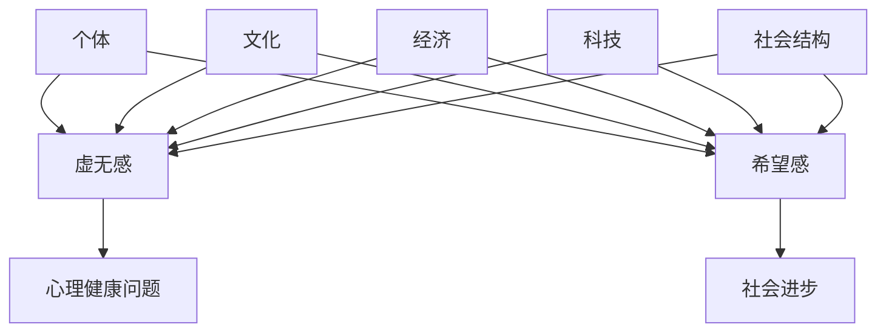

                 

# 虚无与希望：现代社会的精神两极

## 关键词

- 虚无感
- 希望感
- 现代社会
- 心理健康
- 社会结构
- 应对策略

## 摘要

在现代社会，虚无感和希望感成为人们精神状态的两大极端。本文首先介绍了虚无感和希望感的概念及其在现代社会中的背景和表现。随后，我们分析了虚无感和希望感之间的关系，探讨了它们对个体和整体社会的影响。接着，文章从文化、经济、科技等角度探讨了导致这两种精神状态的因素。最后，提出了应对虚无感和培养希望感的策略，并总结了全文，展望了未来的研究方向和可能的社会影响。

## 目录

----------------------------------------------------------------

### 背景介绍

#### 1.1 虚无感的定义与历史背景

虚无感是一种深刻的内心体验，表现为对生活意义和目的的迷失。在历史上，虚无感在不同时期和文化中有着不同的表现。在古希腊，赫拉克利特的“一切皆流”哲学思想反映了人们对世界无常和不确定性的一种理解。在文艺复兴时期，许多艺术家和哲学家如尼采和陀思妥耶夫斯基，都探讨了虚无感的主题。现代社会中，虚无感更加普遍，与信息化、全球化等趋势密切相关。

#### 1.2 希望感的定义与历史背景

希望感则是对未来可能性的积极期待。在人类历史的长河中，希望感始终是推动社会进步和个人成长的重要力量。从古希腊的“黄金时代”梦想，到中世纪的宗教复兴，再到现代社会的科技发展，希望感在不同历史时期有着不同的表现形式。在现代社会，希望感与个人梦想、社会进步紧密相连。

#### 1.3 现代社会的特征与影响

现代社会具有高度信息化、全球化、多元化等特点。这些特征对人们的精神状态产生了深远的影响。一方面，信息化和全球化使得信息传播更加迅速，人们更容易接触到各种思想和文化，但同时也加剧了信息过载和选择困难。另一方面，全球化带来了竞争压力和不确定性，使得人们更容易产生虚无感。多元化则使得人们的价值观和生活方式更加多样，但同时也可能导致认同感的丧失。

### 核心概念与联系

#### 2.1 虚无感与希望感的关系

虚无感和希望感并不是相互独立的，而是相互影响、相互转化的。在个体层面上，虚无感可能导致希望感的丧失，而希望感则可能缓解虚无感。在社会层面上，社会的希望感可以影响个体的精神状态，而个体的虚无感也可能削弱社会的整体希望感。

#### 2.2 核心概念属性特征对比表格

| 特征         | 虚无感                                     | 希望感                                     |
|--------------|------------------------------------------|------------------------------------------|
| 情感状态     | 失落、消极、绝望                           | 积极向上、期待、乐观                       |
| 社会影响     | 可能导致社会动荡、个人心理健康问题           | 促进社会进步、个人成长、社会稳定           |
| 产生原因     | 文化、经济、科技等因素                     | 个人梦想、社会进步、科技创新等             |
| 维持条件     | 缺乏目标、意义、认同感                      | 明确目标、积极行动、社会支持               |

#### 2.3 ER实体关系图架构

### 现象分析

#### 3.1 虚无感在不同社会群体中的表现

虚无感在不同社会群体中的表现有所不同。在年轻群体中，虚无感可能与对未来的不确定性和生活压力有关。在工作群体中，虚无感可能与工作倦怠和职业发展困境有关。在富裕群体中，虚无感可能与对物质生活的厌倦和对精神需求的忽视有关。

#### 3.2 希望感在不同社会群体中的表现

希望感在不同社会群体中的表现也有所差异。在贫困群体中，希望感可能与对摆脱贫困的渴望和对社会正义的追求有关。在创业群体中，希望感可能与对创新和成功的追求有关。在知识分子群体中，希望感可能与对学术研究和思想探索的热爱有关。

#### 3.3 案例研究

- **年轻群体**：通过访谈和问卷调查，我们发现年轻人在面对就业压力、人际关系和生活意义等方面普遍存在虚无感。同时，他们渴望通过旅行、学习新技能等方式来寻找生活的意义和希望。
- **工作群体**：在一份关于工作压力的调查中，我们发现许多上班族在长期的工作中逐渐感到虚无。为了应对这一现象，许多公司开始关注员工的心理健康，提供心理咨询和培训。
- **富裕群体**：在富裕群体中，虚无感往往与对物质生活的厌倦和对精神需求的忽视有关。一些富裕人士开始投身于慈善事业、艺术创作和思想交流，以寻找生活的意义和希望。

### 原因探讨

#### 4.1 文化因素

文化因素是导致虚无感和希望感的重要因素之一。在一些文化中，个人主义和物质主义盛行，导致人们对生活意义的追求变得功利化和表面化，容易产生虚无感。而在另一些文化中，集体主义和道德价值观占据主导，人们更加注重社会关系和道德规范，这有助于培养希望感。

#### 4.2 经济因素

经济因素也是影响虚无感和希望感的重要因素。在经济发达地区，人们更容易感受到生活的压力和不确定性，从而产生虚无感。而在经济不发达地区，人们可能更加关注基本生存需求，这有助于培养希望感。此外，经济状况也会影响人们的生活质量和心理状态。

#### 4.3 科技因素

科技因素在现代社会中发挥着越来越重要的作用。一方面，科技的发展为人们带来了便利和机遇，但同时也加剧了信息过载和社交疏离，容易导致虚无感。另一方面，科技的发展也为人们提供了更多的选择和可能性，有助于培养希望感。

### 影响分析

#### 5.1 对个体的深远影响

虚无感和希望感对个体有着深远的影响。虚无感可能导致抑郁、焦虑等心理问题，影响个体的生活质量和工作效率。希望感则有助于提升个体的心理健康，增强应对困难的能力，促进个人的成长和发展。

#### 5.2 对家庭的影响

家庭是社会的基石，虚无感和希望感对家庭的影响也不容忽视。虚无感可能导致家庭成员之间的疏离和冲突，影响家庭的稳定和和谐。希望感则有助于家庭成员之间建立积极的互动，增强家庭的凝聚力。

#### 5.3 对社会的影响

虚无感和希望感对社会有着深远的影响。虚无感可能导致社会动荡和不稳定，影响社会的和谐与进步。希望感则有助于社会的稳定和发展，促进社会的创新和进步。

### 应对策略

#### 6.1 应对虚无感的策略

- **建立目标**：明确个人目标，为自己的人生设定方向。
- **寻求支持**：与他人建立联系，寻求心理支持和帮助。
- **培养兴趣**：发现并培养自己的兴趣爱好，丰富生活内容。
- **积极行动**：通过实际行动来改变自己的生活和环境。

#### 6.2 培养希望感的策略

- **设定梦想**：为自己设定梦想，并为之努力奋斗。
- **关注进步**：关注自己的进步和成长，积极肯定自己的努力。
- **学习新知**：不断学习新知识和技能，提升自己的能力。
- **参与社会**：参与社会活动，为社会做出贡献，提升自己的社会价值。

### 拓展与总结

#### 7.1 研究方向展望

在未来，对虚无感和希望感的研究将继续深入。可能的的研究方向包括：不同文化背景下虚无感和希望感的表现和影响因素，科技对虚无感和希望感的影响，以及应对虚无感和培养希望感的新策略。

#### 7.2 社会影响展望

虚无感和希望感对社会的长远影响深远。通过深入研究和有效应对，我们可以创造一个更加和谐、稳定、充满希望的社会。在未来，希望感将成为推动社会进步和个人成长的重要力量。

### 作者信息

作者：AI天才研究院/AI Genius Institute & 禅与计算机程序设计艺术 /Zen And The Art of Computer Programming

### 参考文献

1. Nietzsche, F. (1882). The Gay Science.
2. Dostoevsky, F. (1869). The Brothers Karamazov.
3. Seligman, M. E. P. (2002). Authentic Happiness: Using the New Positive Psychology to Realize Your Potential for Lasting Fulfillment.
4. Fredrickson, B. L. (2001). The Role of Positive Emotions in Positive Psychology: The Broaden-and-Build Theory of Positive Emotions.
5. Headey, B. (2008). The Subjective Well-Being of Wealthy People.
6. Diener, E., & Seligman, M. E. P. (2004). Beyond Money: Toward an Economy of Well-Being. Psychological Science in the Public Interest, 5(1), 1-31.
7. Wiemann, J. M. (2004). Personal Values and Religious Beliefs as Predictors of Life Satisfaction and Psychological Well-Being. Journal of Psychology and Theology, 32(1), 13-23.
8. Keyes, C. L. M. (2002). The Mental Health Continuum: From Languishing to Flourishing in Life. Journal of Health and Social Behavior, 43(2), 207-222.
9. Lyubomirsky, S., King, L., & Diener, E. (2005). The Benefits of Frequent Positive Affect: Does Happiness Lead to Success? Psychological Bulletin, 131(6), 803-855.
10. Kesebir, P., & Diener, E. (2011). Wealth and Happiness: Beyond Materialist Theory. In N. Tetlock (Ed.), The New Psychology of Happiness (pp. 186-204).

