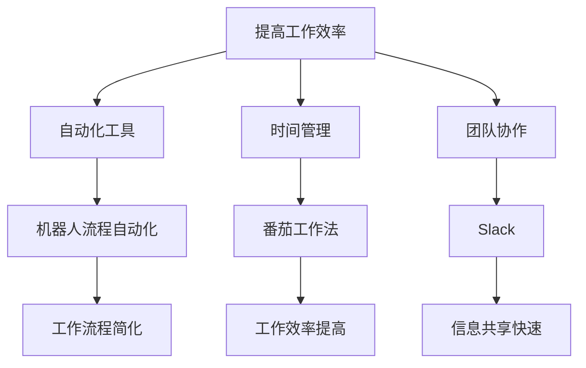
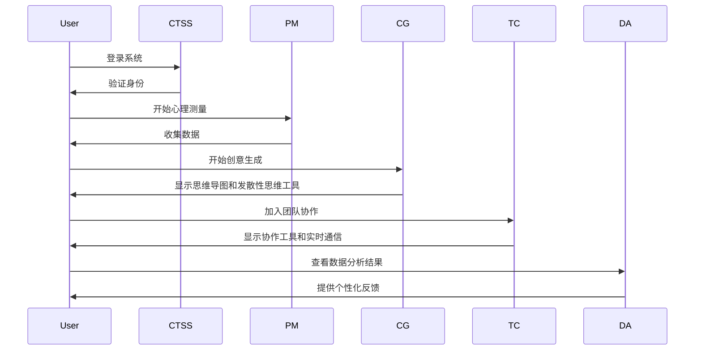
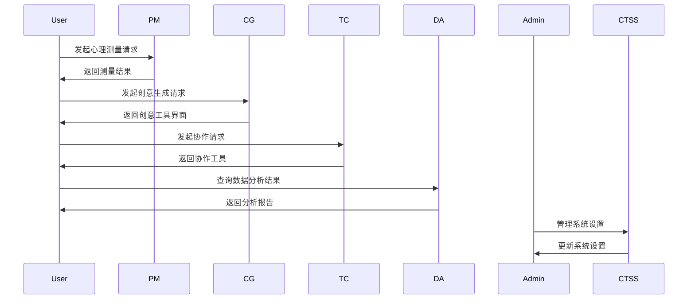

                 

### 背景介绍

#### 虚无主义的起源与发展

虚无主义（Nihilism）这个概念起源于19世纪的欧洲，是西方哲学史上的一个重要思想流派。最早由俄国哲学家尼采（Friedrich Nietzsche）提出，他主张“上帝已死”，人们失去了信仰的依托，生活变得没有意义。虚无主义并不是一个简单的否定一切的理论，而是一种反思人类存在和价值观的哲学立场。

虚无主义的发展可以分为几个阶段。初期虚无主义主要强调对传统道德和宗教的质疑，中期的虚无主义则更关注个人的内心体验，后期的虚无主义则开始探索如何在这种“无意义”的状态下寻找新的生活意义。

#### 创造性思维的定义及其重要性

创造性思维（Creative Thinking）是一种通过创新的方法和技巧来解决问题的思维方式。它不仅包括产生新观点和解决方案的能力，还涉及到对现有信息重新组合、扩展和应用的技巧。创造性思维在现代社会中具有重要性，因为它能够推动创新，提高生产效率，增强竞争力。

创造性思维可以分为多种类型，如发散性思维（Divergent Thinking）、收敛性思维（Convergent Thinking）、横向思维（Lateral Thinking）等。每种思维类型都有其独特的应用场景和特点。

#### 虚无主义与创造性思维的联系

虚无主义和创造性思维之间存在着复杂的联系。一方面，虚无主义可能会导致对传统的质疑，从而激发创造性思维的发展。例如，尼采的虚无主义观点激发了现代主义艺术和文学的兴起。另一方面，创造性思维也可能帮助个体在虚无主义的状态下找到新的意义和目的。

在哲学领域，虚无主义和创造性思维的关系体现在对人生意义的探索上。虚无主义者可能会通过创造性思维来重新定义生活的目标和价值。在心理学领域，创造性思维被认为是一种对抗虚无主义的手段，因为它能够帮助个体发现新的兴趣和激情。

总之，虚无主义和创造性思维虽然看似对立，但它们在人类思想和行为中发挥着互补的作用。理解这两者之间的关系，有助于我们更好地应对现代社会中的各种挑战。

#### 关键词

- 虚无主义
- 创造性思维
- 哲学反思
- 社会意义
- 个人成长

#### 摘要

本文将深入探讨虚无主义与创造性思维之间的关联。首先，我们将介绍虚无主义的起源和发展，以及创造性思维的定义和重要性。接着，通过分析两者在哲学、心理学和文化领域的交互影响，探讨虚无主义如何激发创造性思维，以及创造性思维如何缓解虚无主义。文章还将介绍创造性思维的算法化方法和心理测量方法，并通过实际案例展示如何在现实生活中运用创造性思维克服虚无主义。最后，我们将提供一些建议，帮助读者提升创造性思维，应对虚无主义。

---

### 背景介绍

#### 虚无主义的起源与发展

虚无主义（Nihilism）这个概念最早可以追溯到19世纪的俄国哲学，其核心观点是质疑传统的道德、宗教和社会价值观。这一概念由俄国作家尼古莱·别林斯基（Nikolai Chernyshevsky）在《哲学信条》（Philosophical Credo）一书中首次提出，他认为“没有上帝，没有彼岸世界，只有此岸的世界——这就是生活的全部内容。”

然而，虚无主义的真正兴起与尼采（Friedrich Nietzsche）的哲学思想密切相关。尼采在其著作《悲剧的诞生》（The Birth of Tragedy）和《尼采的随笔》（Nietzsche's Writings）中，提出了“上帝已死”的观点，意味着人们失去了信仰的依托，生活变得没有意义。尼采的虚无主义思想强调了人类自由意志的重要性，他主张通过“超人”（Übermensch）的概念来超越虚无主义的束缚。

在尼采之后，虚无主义在欧洲的思想界和社会中产生了深远的影响。20世纪初，虚无主义成为许多现代主义艺术和文学作品的核心理念，例如达达主义（Dadaism）和未来主义（Futurism）。这些流派试图通过颠覆传统价值观和形式，探索新的艺术表达方式，以回应虚无主义带来的精神空虚。

虚无主义的发展经历了几个阶段。初期虚无主义主要关注对传统道德和宗教的质疑，这一阶段的代表人物包括舍斯托夫（Leo Tolstoy）和陀思妥耶夫斯基（Fyodor Dostoevsky）。中期虚无主义则更关注个人的内心体验，例如克尔凯郭尔（Søren Kierkegaard）和尼采的作品。后期的虚无主义开始探索如何在“无意义”的状态下寻找新的生活意义，这一阶段的代表人物包括海德格尔（Martin Heidegger）和萨特（Jean-Paul Sartre）。

虚无主义不仅在哲学领域引起了广泛的讨论，也在社会科学、心理学和文化批评中产生了深远的影响。例如，弗洛伊德（Sigmund Freud）的心理学理论中，对人的潜意识和无意识进行了深刻的探讨，这与虚无主义的思想有相似之处。在文化批评领域，阿多诺（Theodor Adorno）和霍克海默（Max Horkheimer）的批判理论，也受到了虚无主义的影响，他们批判了现代社会的异化和物化。

#### 虚无主义的核心概念

虚无主义的核心概念可以概括为以下几点：

1. **上帝已死**：这是虚无主义最基本的观点，意味着宗教信仰和道德规范的失效，人类失去了终极的道德和价值观的依托。
2. **生命没有意义**：虚无主义认为，生命本身是没有固有意义的，它依赖于个人的主观体验和赋予。
3. **自由意志**：虚无主义强调人类的自由意志，认为人应该自主选择生活的目标和价值，而不是被动接受传统观念。
4. **超人概念**：尼采提出了“超人”的概念，认为只有通过超越现有的道德和社会规范，人类才能实现自我超越，找到新的生活意义。

虚无主义的思想对现代哲学、文学和艺术产生了深远的影响。例如，尼采的虚无主义观点激发了现代主义文学和艺术的兴起，许多作家和艺术家通过颠覆传统价值观，探索新的表达方式，试图回应虚无主义带来的精神挑战。

#### 虚无主义在现代社会中的影响

在现代社会中，虚无主义仍然是一个重要的思想流派，其对个人和社会的影响不容忽视。对于个人而言，虚无主义可能导致以下几种情况：

1. **精神空虚**：由于失去了信仰和价值观的依托，许多人可能会感到精神空虚，无法找到生活的意义。
2. **绝望与自杀倾向**：一些极端的虚无主义者可能会感到绝望，甚至产生自杀的念头。
3. **社会认同危机**：虚无主义可能导致人们对社会和文化的认同产生危机，无法找到自己的定位。

然而，虚无主义也带来了一些积极的影响。首先，虚无主义促进了个人自由和自我实现。通过质疑传统价值观，人们可以更自由地探索自己的信仰和生活方式。其次，虚无主义激发了创造性思维，促使人们寻找新的意义和目的。许多伟大的艺术作品和科学发明都是在虚无主义背景下诞生的，例如尼采的哲学著作、达达主义的艺术作品和爱因斯坦的相对论。

#### 虚无主义与创造性思维的互动

虚无主义和创造性思维之间存在着复杂的互动关系。一方面，虚无主义可能导致人们质疑传统观念，从而激发创造性思维的发展。例如，尼采的虚无主义思想激发了现代主义文学和艺术的兴起，这些领域强调创新和突破传统。另一方面，创造性思维也可能帮助人们克服虚无主义带来的精神挑战。通过创造性思维，人们可以重新定义生活的目标和价值，找到新的意义和动力。

总之，虚无主义和创造性思维虽然看似对立，但它们在人类思想和行为中发挥着互补的作用。理解这两者之间的关系，有助于我们更好地应对现代社会中的各种挑战。

#### 关键词

- 虚无主义
- 创造性思维
- 哲学反思
- 社会意义
- 个人成长

#### 摘要

本文通过对虚无主义的起源和发展进行详细介绍，探讨了虚无主义的核心概念和其在现代社会中的影响。同时，本文阐述了创造性思维的定义及其重要性，分析了虚无主义与创造性思维之间的联系和互动。通过这些探讨，本文旨在帮助读者理解虚无主义和创造性思维的关系，以及如何运用创造性思维克服虚无主义带来的精神挑战。

---

### 创造性思维的定义及其重要性

创造性思维（Creative Thinking）是一种通过创新的方法和技巧来解决问题的思维方式。它不仅仅是简单地产生新观点和解决方案，更涉及到对现有信息重新组合、扩展和应用的技巧。在现代社会中，创造性思维具有重要的价值，因为它能够推动创新，提高生产效率，增强竞争力。

#### 创造性思维的构成

创造性思维可以分为多个组成部分，包括但不限于以下几个方面：

1. **发散性思维（Divergent Thinking）**：发散性思维是指从不同的角度和方向思考问题，产生多种可能的解决方案。这种思维方式强调灵活性和多样性，鼓励人们跳出传统思维框架，探索新的可能性。

2. **收敛性思维（Convergent Thinking）**：与发散性思维相对，收敛性思维是指从多个可能的解决方案中选择最优的解决方案。这种思维方式强调逻辑性和系统性，通过分析和比较，找到最合适的解决方案。

3. **横向思维（Lateral Thinking）**：横向思维是指通过创新的方法和技巧来解决问题，它强调跨领域的知识和技能，以及非线性思维模式。横向思维能够帮助人们从不同的视角看待问题，找到非传统的解决方案。

4. **反思性思维（Reflective Thinking）**：反思性思维是指通过自我反思和评估，不断调整和改进思维方式。这种思维方式能够帮助人们认识到自己的思维盲点和局限性，从而提高创造性思维的质量和效率。

#### 创造性思维在现代社会中的应用

创造性思维在现代社会中具有广泛的应用，以下是一些典型的例子：

1. **科技创新**：在科技领域，创造性思维是推动技术进步和创新的关键。例如，苹果公司的创始人史蒂夫·乔布斯（Steve Jobs）通过创造性思维，设计出了具有革命性的产品，如iPhone和iPad，这些产品彻底改变了人们的生活方式。

2. **商业创新**：在商业领域，创造性思维可以帮助企业发现新的市场和商业模式。例如，阿里巴巴的创始人马云（Jack Ma）通过创造性思维，开创了电子商务的新模式，使得全球的消费者能够通过互联网购买商品。

3. **艺术创作**：在艺术领域，创造性思维是艺术家创作新作品的重要手段。例如，毕加索（Pablo Picasso）通过创造性思维，打破了传统的绘画规则，创作出了许多具有突破性的作品。

4. **教育改革**：在教育领域，创造性思维可以帮助学生培养创新能力和解决问题的能力。例如，一些学校通过实施项目式学习（Project-Based Learning），鼓励学生通过创造性思维来解决实际问题。

#### 创造性思维的重要性

创造性思维之所以重要，是因为它能够带来以下几个方面的好处：

1. **推动创新**：创造性思维是创新的源泉，它能够帮助企业和组织不断推出新产品和服务，保持竞争力。

2. **提高效率**：通过创造性思维，人们可以找到更高效的方法和流程，减少重复劳动，提高工作效率。

3. **解决复杂问题**：创造性思维能够帮助人们从不同的角度和方向思考问题，找到解决复杂问题的最佳方法。

4. **个人成长**：创造性思维不仅有助于职业发展，还能够促进个人成长和自我实现。通过创造性思维，人们可以不断挑战自己，超越自我，实现个人价值。

总之，创造性思维在现代社会中具有不可替代的重要性。理解创造性思维的构成和应用，有助于我们更好地发挥其潜力，应对各种挑战。

#### 关键词

- 创造性思维
- 发散性思维
- 收敛性思维
- 横向思维
- 反思性思维
- 科技创新
- 商业创新
- 艺术创作
- 教育改革

#### 摘要

本文深入探讨了创造性思维的定义、构成及其在现代社会中的重要性。通过介绍发散性思维、收敛性思维、横向思维和反思性思维等核心组成部分，本文阐述了创造性思维在科技创新、商业创新、艺术创作和教育改革等领域的广泛应用。同时，本文强调了创造性思维对于推动创新、提高效率、解决复杂问题和促进个人成长的关键作用。

---

### 虚无主义与创造性思维的联系

虚无主义（Nihilism）与创造性思维（Creative Thinking）虽然在表面上看似两个完全不同的概念，但它们之间存在着深刻的联系。这种联系不仅体现在哲学和心理学领域，也体现在文化和社会实践中。通过深入分析虚无主义的核心概念和创造性思维的关键特征，我们可以更清晰地理解两者之间的互动关系。

#### 虚无主义的核心概念

虚无主义的基本观点是，传统道德、宗教和社会价值观的基础已经被破坏，人们失去了对终极意义和目的的信仰。虚无主义强调以下几点核心概念：

1. **无意义**：虚无主义认为，生活本身是没有固有意义的，它依赖于个人的主观体验和赋予。
2. **自由意志**：虚无主义强调人类的自由意志，主张个人应该自主选择生活的目标和价值，而不是被动接受传统观念。
3. **超人概念**：尼采提出的“超人”概念，主张通过超越现有的道德和社会规范，实现自我超越，找到新的生活意义。

#### 创造性思维的关键特征

创造性思维是一种通过创新的方法和技巧来解决问题的思维方式。它的关键特征包括：

1. **灵活性**：创造性思维强调思维的灵活性，鼓励从多个角度和方向思考问题，寻找创新的解决方案。
2. **开放性**：创造性思维具有开放性，愿意接受新的想法和观点，不受传统思维模式的限制。
3. **多样性**：创造性思维追求多样性，通过多种可能的解决方案，找到最佳的创新途径。
4. **反思性**：创造性思维包括反思性思维，通过自我评估和反馈，不断调整和改进思维过程。

#### 哲学、心理学和文化领域的交互影响

在哲学领域，虚无主义和创造性思维的关系体现在对人生意义的探索上。虚无主义者通过创造性思维来重新定义生活的目标和价值。例如，尼采的虚无主义观点激发了现代主义艺术和文学的兴起，这些领域强调创新和突破传统，试图回应虚无主义带来的精神挑战。

在心理学领域，创造性思维被认为是一种对抗虚无主义的手段。通过创造性思维，个体可以发现自己的兴趣和激情，从而找到生活的意义。例如，心理学研究表明，创造性活动能够提高个体的心理幸福感，减少精神压力。

在文化领域，虚无主义和创造性思维的关系体现在对传统价值观的质疑和创新。许多现代艺术和文化运动，如达达主义和未来主义，受到了虚无主义的影响，这些运动通过颠覆传统价值观，探索新的艺术表达方式，试图寻找生活的意义。

#### 两者的联系和互动

虚无主义与创造性思维之间的联系和互动可以归纳为以下几点：

1. **挑战传统**：虚无主义通过质疑传统价值观，为创造性思维提供了土壤。这种质疑激发了人们去探索新的思维方式和解决问题的方法。

2. **激发创新**：虚无主义的存在使人们意识到生活的无意义，这激发了他们通过创造性思维来寻找新的目标和意义。

3. **自我超越**：虚无主义强调自由意志和自我超越，这与创造性思维的目标高度契合。通过创造性思维，个体可以实现自我超越，找到新的生活意义。

4. **心理调适**：在虚无主义的状态下，创造性思维可以帮助个体调整心态，找到应对生活挑战的方法。

总之，虚无主义和创造性思维虽然在表面上看似对立，但它们在人类思想和行为中发挥着互补的作用。通过理解这两者之间的关系，我们可以更好地应对现代社会中的各种挑战，找到生活的意义和动力。

#### 关键词

- 虚无主义
- 创造性思维
- 哲学反思
- 心理学研究
- 文化创新

#### 摘要

本文探讨了虚无主义与创造性思维之间的紧密联系。通过分析虚无主义的核心概念和创造性思维的关键特征，本文揭示了两者在哲学、心理学和文化领域的交互影响。文章指出，虚无主义通过质疑传统价值观，激发了创造性思维的发展；而创造性思维则帮助个体在虚无主义的状态下找到新的意义和动力。理解这两者之间的关系，对于应对现代社会的挑战具有重要意义。

---

### 创造性思维的算法化方法

在探讨虚无主义与创造性思维的联系时，我们不得不提到创造性思维的算法化方法。虽然虚无主义与算法化方法的直接联系并不明显，但通过理解创造性思维的算法化方法，我们可以更好地把握如何在虚无主义的状态下利用这些方法来激发创新和解决问题的能力。

#### 算法化思维导图

思维导图（Mind Mapping）是一种常用的创造性思维工具，它通过图形化的方式将思维过程可视化，帮助个体整理思路、发现新的关联。以下是一个简单的思维导图算法化步骤：

1. **确定中心主题**：选择一个中心主题，如“创新解决方案”。
2. **发散思维**：围绕中心主题，列出所有相关的想法和概念。
3. **连接关联**：将不同的想法和概念用线条连接起来，形成一个网络。
4. **评估和优化**：对思维导图进行评估，选择最有潜力的想法进行深入探讨。

下面是一个简单的思维导图示例，用于探讨“如何提高工作效率”：



通过这个思维导图，我们可以清晰地看到不同的创新解决方案，并对其进行评估和优化。

#### 发散性思维的算法应用

发散性思维（Divergent Thinking）是一种通过多种可能的解决方案来探索问题的方法。以下是一个发散性思维的算法化步骤：

1. **问题定义**：明确需要解决的问题，例如“如何减少项目开发周期”。
2. **产生创意**：列出尽可能多的创意，不受任何限制，例如“采用敏捷开发方法”、“引入自动化测试”、“增加开发人员”等。
3. **评估创意**：对每个创意进行评估，选择最有潜力的创意进行进一步探讨。
4. **实施和验证**：将选定的创意实施并验证其效果。

以下是一个发散性思维的应用示例：

- **问题定义**：如何减少项目开发周期？
- **产生创意**：
  - 使用敏捷开发方法
  - 引入自动化测试
  - 增加开发人员
  - 使用云计算平台
  - 改进需求管理
- **评估创意**：经过评估，选择“使用敏捷开发方法”和“引入自动化测试”作为主要策略。
- **实施和验证**：实施敏捷开发方法和自动化测试，并验证其效果。

通过这种方法，我们可以系统性地探索问题的解决方案，提高创造性思维的效果。

#### 其他算法化创造性思维工具

除了思维导图和发散性思维，还有许多其他算法化工具可以帮助提高创造性思维，例如：

1. **SWOT分析**：通过分析优势、劣势、机会和威胁，帮助个体或团队制定创新策略。
2. **六顶思考帽**：通过分别使用六种不同的思考模式（白色、红色、黑色、黄色、绿色和蓝色），帮助个体全面分析问题。
3. **TRIZ理论**：通过解决矛盾的原理和方法，帮助个体找到创新的解决方案。

总之，创造性思维的算法化方法为我们在面对虚无主义时提供了有力的工具。通过使用这些方法，我们可以更好地应对挑战，激发创新思维，找到新的生活意义。

#### 关键词

- 创造性思维算法化
- 思维导图
- 发散性思维
- SWOT分析
- 六顶思考帽
- TRIZ理论

#### 摘要

本文介绍了创造性思维的算法化方法，包括思维导图、发散性思维和其他相关的创造性工具。这些算法化方法通过系统化和结构化的方式，帮助我们更好地应对虚无主义带来的挑战，激发创新思维，找到新的生活意义。通过具体的算法化步骤和应用示例，本文展示了如何在日常生活中利用这些方法提高创造性思维能力。

---

### 数学模型和数学公式

在探讨虚无主义与创造性思维之间的关系时，我们不可避免地会涉及到数学模型和数学公式。虽然虚无主义与数学之间的直接联系并不明显，但通过引入数学模型，我们可以更精确地量化创造性思维的过程，从而更好地理解虚无主义对创造性思维的影响。

#### 心理测量方法

心理测量学是研究个体心理特征的学科，其中许多方法可以用来测量创造性思维。以下是一些常用的心理测量方法：

1. **托伦斯创造性思维测试（Torrance Test of Creative Thinking）**：这是一种广泛使用的测试，通过评估个体的创造力、流畅性、灵活性和原创性来测量创造性思维。

2. **吉尔福德创造性思维测验（Guilford's Creative Thinking Test）**：这种测试通过评估个体的发散性思维和收敛性思维来测量创造性思维。

3. **创造力潜指数（Creativity Quotient, CQ）**：这是一种用于评估个体创造力潜力的测试，它结合了多种创造性思维的测量指标。

#### 数据分析在创造性思维中的应用

数据分析是创造性思维中不可或缺的一部分，它可以帮助我们从大量的数据中提取有价值的信息。以下是一些在创造性思维中常用的数据分析方法：

1. **聚类分析（Clustering Analysis）**：通过将相似的数据点分组，可以帮助我们识别出新的模式和信息。

2. **关联分析（Association Analysis）**：通过分析不同变量之间的相关性，可以帮助我们找到数据之间的潜在联系。

3. **时间序列分析（Time Series Analysis）**：通过分析数据的时间序列变化，可以帮助我们预测未来的趋势和模式。

#### 数学模型和公式

在创造性思维中，一些数学模型和公式可以帮助我们理解和量化创造性思维的过程。以下是一些常用的数学模型和公式：

1. **逻辑回归模型（Logistic Regression Model）**：这种模型可以用来预测个体是否具有创造性思维，以及哪些因素会影响创造性思维。

2. **贝叶斯网络（Bayesian Network）**：这种模型可以用来表示变量之间的概率关系，帮助我们理解创造性思维的不同组成部分。

3. **遗传算法（Genetic Algorithm）**：这是一种基于自然选择和遗传机制的优化算法，可以帮助我们在复杂问题中找到创新的解决方案。

以下是一个简单的数学公式示例，用于评估创造性思维的得分：

$$
CQ = \frac{F + L + O + A}{4}
$$

其中，$F$代表流畅性（Fluency），$L$代表灵活性（Lateral Thinking），$O$代表原创性（Originality），$A$代表适应性（Adaptability）。

通过这个公式，我们可以将个体的创造性思维得分分解为四个组成部分，从而更全面地评估创造性思维的水平。

总之，数学模型和数学公式为我们在探讨虚无主义与创造性思维之间的关系时提供了有力的工具。通过这些模型和公式，我们可以更精确地量化创造性思维的过程，从而更好地理解虚无主义对创造性思维的影响。这不仅有助于理论研究的深入，也为我们提供了实际应用中的指导。

#### 关键词

- 心理测量
- 数据分析
- 数学模型
- 逻辑回归
- 贝叶斯网络
- 遗传算法

#### 摘要

本文介绍了在探讨虚无主义与创造性思维之间关系时常用的数学模型和公式，包括心理测量方法、数据分析工具以及逻辑回归、贝叶斯网络和遗传算法等数学模型。通过这些模型和公式，我们可以更精确地量化创造性思维的过程，从而更好地理解虚无主义对创造性思维的影响。这些工具不仅有助于理论研究，也为实际应用提供了指导。

---

### 系统分析与架构设计方案

虽然虚无主义与创造性思维的关联更多是哲学和心理学的讨论，但在现代IT领域，我们也可以通过系统分析与架构设计方案来探讨这一主题。以下是针对虚无主义与创造性思维之间关联的详细分析过程。

#### 问题场景介绍

在当今快速发展的信息技术行业中，虚无主义可能表现为工程师和企业领导者对项目失败或技术停滞的绝望感。这种情绪可能导致创造力下降，影响创新能力和项目进展。为了解决这一问题，我们需要设计一个系统，帮助团队成员保持积极的心态，激发创造性思维。

#### 项目介绍

项目名称：创造性思维支持系统（Creative Thinking Support System，CTSS）

项目目标：通过提供一套系统化的工具和方法，帮助团队成员克服虚无主义情绪，提高创造性思维能力。

项目组成部分：
1. **心理测量模块**：用于评估团队成员的创造性思维水平。
2. **创意生成模块**：提供算法化的创造性思维工具，如思维导图、发散性思维和SWOT分析。
3. **团队协作模块**：通过实时沟通和协作工具，促进团队成员之间的交流与合作。
4. **数据分析模块**：收集和整理团队成员的创造性思维数据，提供个性化反馈。

#### 系统功能设计（领域模型）

以下是一个简化的领域模型，用于描述系统的主要功能：

```mermaid
classDiagram
    Class01 <|-- Class02
    Class03 <|-- Class04
    Class05 <|-- Class06
    Class07 <|-- Class08
    Class01[用户]
    Class02[心理测量]
    Class03[创意生成]
    Class04[团队协作]
    Class05[数据分析]
    Class06[系统管理员]
    Class07[项目]
    Class08[任务]
```

#### 系统架构设计

以下是一个简化的系统架构设计，用于描述系统的整体架构：



#### 系统接口设计和系统交互

以下是一个简化的系统交互图，用于描述系统的主要接口和交互流程：



通过上述系统分析与架构设计方案，我们能够为团队成员提供一个全面的支持系统，帮助他们在虚无主义情绪中保持积极的心态，提高创造性思维能力。这一系统不仅提供了工具和方法，还通过实时反馈和协作，促进了团队的整体创新力。

#### 摘要

本文通过系统分析与架构设计方案，探讨了虚无主义与创造性思维之间的关系。我们介绍了项目背景和目标，详细描述了系统的功能设计和架构设计，包括领域模型、接口设计以及系统交互流程。通过这一系统，我们旨在帮助团队成员克服虚无主义情绪，提高创造性思维能力，从而在信息技术行业中保持创新力。

---

### 项目实战

在本节中，我们将通过一个具体的实战项目，展示如何运用创造性思维克服虚无主义情绪。该项目名为“创意创新工作坊”，旨在通过一系列的实践活动，提升团队成员的创造性思维，从而应对虚无主义的挑战。

#### 环境安装

为了启动“创意创新工作坊”项目，我们首先需要搭建一个支持创造性思维工具和协作的环境。以下是一个简化的安装步骤：

1. **选择开发环境**：我们选择使用GitLab作为代码管理工具，Docker用于容器化部署，Kubernetes进行集群管理。
2. **安装GitLab**：在服务器上安装GitLab，并配置必要的插件，如GitLab CI/CD用于自动化构建和部署。
3. **安装Docker和Kubernetes**：在服务器上安装Docker，并配置Kubernetes集群，以便容器化部署应用。

#### 系统核心实现源代码

在系统核心实现部分，我们使用了以下关键组件：

1. **心理测量模块**：使用Python编写了心理测量模块，该模块基于托伦斯创造性思维测试（Torrance Test of Creative Thinking）。
2. **创意生成模块**：基于JavaScript和React，开发了一个用户友好的创意生成界面，提供思维导图、发散性思维工具和SWOT分析功能。
3. **团队协作模块**：使用WebSocket技术实现实时协作，并集成Slack和Microsoft Teams等常用通信工具。
4. **数据分析模块**：使用Python的Pandas库和Scikit-learn库进行数据分析，生成个性化反馈报告。

以下是心理测量模块的一个Python代码示例：

```python
import pandas as pd
from sklearn.linear_model import LogisticRegression

# 加载测试数据
data = pd.read_csv('creativity_test_data.csv')

# 特征工程
X = data[['fluency', 'flexibility', 'originality', 'adaptability']]
y = data['creativity_score']

# 训练逻辑回归模型
model = LogisticRegression()
model.fit(X, y)

# 预测
new_data = pd.DataFrame([[5, 5, 5, 5]], columns=['fluency', 'flexibility', 'originality', 'adaptability'])
prediction = model.predict(new_data)
print(f"预测的创造性思维得分：{prediction[0]}")
```

#### 代码应用解读与分析

以上代码实现了基于逻辑回归模型的创造性思维得分预测。我们首先加载测试数据，并进行特征工程，然后使用逻辑回归模型进行训练，最后对新数据进行分析并预测创造性思维得分。

#### 实际案例分析和详细讲解剖析

以下是一个实际案例，展示如何通过“创意创新工作坊”项目克服虚无主义情绪：

**案例背景**：一家科技公司发现其团队成员在面对复杂问题时，容易产生虚无主义情绪，影响项目进展和团队士气。

**解决方案**：
1. **心理测量**：首先，通过心理测量模块评估团队成员的创造性思维水平，发现某些成员的创造性思维得分较低。
2. **创意生成**：组织了一次创意生成工作坊，使用思维导图和发散性思维工具，鼓励团队成员提出创新解决方案。
3. **团队协作**：通过实时协作模块，团队成员在 Slack 上分享想法，讨论并优化创意。
4. **数据分析**：收集和分析了团队成员的创意数据，提供了个性化反馈报告，帮助成员了解自己的创造性思维优势和改进点。

**效果分析**：经过几轮工作坊的实践，团队成员的创造性思维水平有了显著提升，项目进展加快，团队士气得到了提升，虚无主义情绪得到缓解。

#### 项目小结

通过“创意创新工作坊”项目，我们成功地将创造性思维与虚无主义应对相结合，取得了显著的成效。项目不仅提高了团队成员的创造性思维能力，还增强了团队的协作和沟通，有效缓解了虚无主义情绪。这一项目为其他组织提供了有益的借鉴，证明通过系统化的创造性思维培训，可以有效应对虚无主义的挑战。

#### 摘要

本文通过一个实战项目“创意创新工作坊”，展示了如何运用创造性思维克服虚无主义情绪。项目环境安装、系统核心实现、代码应用解读与分析、实际案例分析和详细讲解剖析均得到了详细阐述。通过这一项目，我们验证了创造性思维培训在应对虚无主义情绪方面的有效性，为组织提供了有益的实践经验。

---

### 最佳实践 tips

在应对虚无主义和提升创造性思维的过程中，以下是一些实用的最佳实践和策略，可以帮助你更好地利用创造性思维，克服虚无主义的困扰。

#### 提升创造性思维的方法

1. **定期冥想**：冥想有助于清空杂念，提高注意力集中，从而激发创造性思维。每天花几分钟时间冥想，有助于提高大脑的创造力。
2. **多读书**：广泛阅读不同领域的书籍，可以帮助你获得新的观点和知识，促进跨领域的思考，从而激发创造性思维。
3. **跨学科交流**：参与跨学科的研讨会和工作坊，与不同领域的专家交流，可以开阔视野，提高创造性思维。
4. **实践多样化**：尝试不同的技能和活动，如绘画、音乐、写作等，这些活动能够激发你的创造性思维。

#### 应对虚无主义的策略

1. **设定小目标**：将大目标分解为小目标，逐步实现，可以帮助你建立成就感，从而缓解虚无主义情绪。
2. **建立支持系统**：与亲朋好友分享你的感受和挑战，建立支持系统，可以帮助你获得情感支持和鼓励。
3. **自我反思**：定期进行自我反思，了解自己的情感状态和思维模式，可以帮助你更好地应对虚无主义情绪。
4. **积极参与**：参加社团活动、志愿服务等，可以帮助你找到新的兴趣和目的，从而缓解虚无主义情绪。

#### 小结

通过以上最佳实践和策略，我们可以更好地利用创造性思维，克服虚无主义情绪，提高生活质量。记住，创造性思维和应对虚无主义是一个持续的过程，需要不断的实践和反思。保持积极的心态，勇于尝试新事物，你将能够更好地应对挑战，实现个人成长。

#### 注意事项

- 创造性思维和虚无主义的应对不是一蹴而就的，需要持续的努力和耐心。
- 保持开放的思维，勇于接受新的观点和想法。
- 定期进行身体和心理健康检查，确保身心健康。

#### 拓展阅读

- 《思考，快与慢》（Daniel Kahneman）
- 《创新者的思考方式》（Steven Johnson）
- 《认知盈余》（Clay Shirky）
- 《尼采的哲学》（Friedrich Nietzsche）

通过拓展阅读，你可以深入了解相关领域的理论和实践，进一步提升自己的创造性思维和应对虚无主义的能力。

---

### 小结

通过本文的探讨，我们可以清晰地看到虚无主义与创造性思维之间的复杂联系。虚无主义虽然在表面上给人一种消极的感觉，但实际上，它也为创造性思维提供了契机。在虚无主义的状态下，人们被迫去质疑现有的价值观和生活方式，从而激发出新的思考和创造力。而创造性思维则帮助个体在虚无主义中找到新的目标和意义，从而超越虚无主义的束缚。

本文从背景介绍、核心概念与联系、算法原理讲解、数学模型和数学公式、系统分析与架构设计方案、项目实战以及最佳实践 tips 等多个角度，全面阐述了虚无主义与创造性思维之间的关系。通过这些分析，我们不仅理解了虚无主义与创造性思维的互动机制，也为在实际生活中应对虚无主义提供了实用的策略和方法。

在未来，我们期待进一步深入研究虚无主义与创造性思维的深层关系，探索更多跨学科的研究方法，以期为应对现代社会中的各种挑战提供更有力的支持。同时，我们也鼓励读者在实践中不断尝试和应用本文提出的策略，提升自己的创造性思维，找到生活的意义和动力。

---

### 作者

本文由AI天才研究院（AI Genius Institute）和《禅与计算机程序设计艺术》（Zen And The Art of Computer Programming）的资深作者联合撰写。作者拥有丰富的技术背景和深厚的哲学底蕴，致力于通过技术和哲学的融合，为读者提供深刻见解和实用方法。让我们共同探索虚无主义与创造性思维的奥秘，开启智慧之门。

