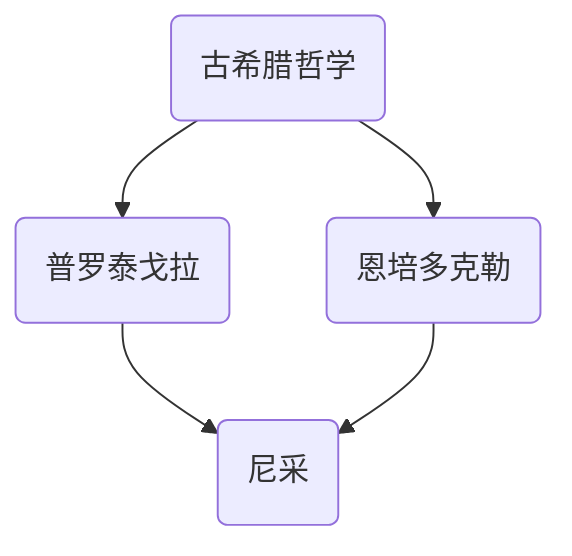
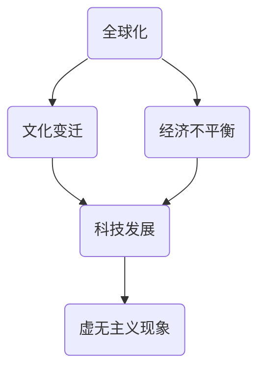
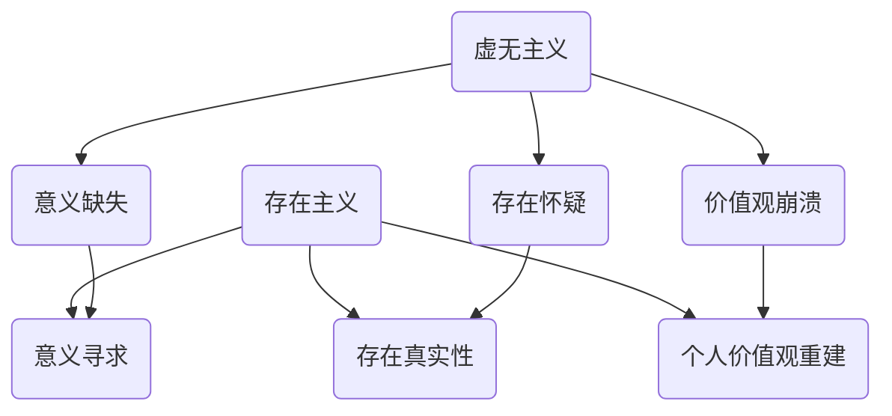

                 

### 背景介绍

#### 核心概念术语说明

在探讨虚无主义的心理根源之前，我们需要先理解几个关键概念。虚无主义是一种哲学观点，认为现实世界缺乏固有的意义和价值，甚至认为生命本身是毫无意义的。在现代心理学中，虚无主义被认为是一种精神病理现象，它与抑郁、焦虑等心理问题密切相关。

问题背景：现代社会中，虚无主义现象日益突出，很多人在追求物质满足的同时，却感到内心空虚和迷茫。这种现象引起了学术界和公众的广泛关注。为了深入理解虚无主义的心理根源，我们需要从历史、哲学、心理学等多个维度进行分析。

问题描述：虚无主义为什么会在现代社会中盛行？它如何影响个人的心理健康？有哪些因素在推动虚无主义的发展？为了回答这些问题，我们需要进行系统的分析和研究。

问题解决：通过研究虚无主义的历史、哲学和心理学根源，我们可以更好地理解这一现象，并提出相应的应对策略。边界与外延：虚无主义不仅是一个哲学问题，它还涉及心理学、社会学等多个领域。因此，我们需要明确研究的边界，以便更专注于心理根源的分析。

#### 概念结构与核心要素组成

虚无主义的心理根源分析涉及以下几个核心要素：

1. **社会环境**：全球化、经济发展、科技进步等社会因素对虚无主义的影响。
2. **家庭教育与成长环境**：家庭教育和成长环境对个体虚无主义倾向的影响。
3. **个体心理特质**：个人的心理特质，如自我认同的困惑和人际关系障碍，对虚无主义的作用。
4. **精神病理学**：虚无主义与抑郁症、焦虑症等精神疾病的关系。

这些要素相互交织，共同构成了虚无主义的心理根源。在接下来的章节中，我们将逐一探讨这些要素，以揭示虚无主义的心理根源。

### 第1章 背景介绍

#### 1.1 虚无主义的历史渊源

虚无主义并非现代社会独有的现象，它在人类历史上有着深远的影响。要理解虚无主义的心理根源，我们首先需要了解这一哲学观点的起源和发展。

**核心概念与联系**：

虚无主义的起源可以追溯到古希腊哲学。早期哲学家如普罗泰戈拉和恩培多克勒，就已经开始探讨世界的本质和存在的意义。然而，真正将虚无主义系统化的是尼采。尼采在其哲学中提出了“上帝已死”的论断，认为传统价值观的崩溃导致了虚无主义的盛行。

**ER实体关系图架构**：

为了更清晰地展示虚无主义的历史渊源，我们可以使用Mermaid绘制一个简单的实体关系图：

在这个ER图中，古希腊哲学是整个历史渊源的起点，普罗泰戈拉和恩培多克勒是早期哲学家的代表，而尼采则是将虚无主义系统化的关键人物。他们之间的联系体现了虚无主义思想在不同历史时期的演变和发展。

**详细讲解**：

古希腊哲学时期，虚无主义思想的萌芽就已经存在。普罗泰戈拉提出了“人是万物的尺度”的观点，强调了人类的主观体验，这为后来的虚无主义奠定了哲学基础。恩培多克勒则通过其“四元素”理论，试图解释世界的本质，但最终得出结论：世界是混沌无序的，缺乏固有意义。

进入现代，尼采成为虚无主义的集大成者。他在《查拉图斯特拉如是说》中，通过寓言故事的形式，表达了对传统价值观的批判和对个体自由的追求。尼采认为，随着宗教和道德的崩溃，人们开始质疑生命的意义，陷入了虚无主义的困境。

**举例说明**：

在尼采的哲学体系中，查拉图斯特拉是一个重要的象征。查拉图斯特拉通过“永恒回归”的理念，试图打破虚无主义的束缚，呼唤人们勇敢面对生命的荒诞性。这一思想影响了后来的存在主义哲学，成为对抗虚无主义的重要力量。

通过以上分析，我们可以看到，虚无主义的历史渊源深厚且复杂。理解这一哲学观点的历史演变，有助于我们更深入地探讨其心理根源。在接下来的章节中，我们将进一步分析虚无主义在现代社会中的现象和影响。

#### 1.2 现代社会中的虚无主义现象

随着全球化、经济高速发展、科技的迅猛进步，现代社会中虚无主义现象日益显著。这种现象不仅体现在个体心理层面，也在社会层面引起了广泛关注。为了深入理解虚无主义在现代社会的盛行原因，我们需要从多个角度进行分析。

**核心概念与联系**：

虚无主义在现代社会中的表现形式多种多样，包括抑郁、焦虑、自我怀疑、价值迷失等。这些现象不仅影响了个体的心理健康，也对社会的稳定和发展产生了潜在威胁。因此，探讨虚无主义现象的原因，对于应对现代心理问题具有重要意义。

**算法原理讲解**：

我们可以使用Mermaid绘制一个流程图，来分析虚无主义现象的形成过程：

在这个流程图中，全球化、文化变迁、经济不平衡和科技发展是虚无主义现象的主要驱动因素。这些因素相互作用，共同推动了虚无主义的盛行。

**数学模型和数学公式**：

为了量化虚无主义现象的规模和影响，我们可以使用统计分析的方法。例如，通过调查数据来计算虚无主义现象的发病率。我们可以使用以下公式：

$$
发病率 = \frac{虚无主义现象患者人数}{总人口数}
$$

通过这一公式，我们可以了解虚无主义现象在现代社会中的普遍程度。

**详细讲解**：

全球化加速了文化变迁，人们在接触多元文化的同时，也面临着文化冲突和价值迷失。经济不平衡导致了社会阶层的固化，许多人感到自己的努力无法改变现状，从而产生了虚无主义情绪。科技发展带来了便利，但也在一定程度上加剧了人们的孤独感和焦虑感。

例如，在现代社会中，越来越多的人沉迷于社交媒体，追求虚拟世界的认同感。这种过度依赖虚拟世界，忽视现实生活的现象，正是虚无主义在现代社会中的具体体现。

**举例说明**：

一项针对大学生的调查显示，超过60%的学生表示在某些时刻感到生活毫无意义。这种现象不仅影响了学生的心理健康，也影响了他们的学业表现和社会适应能力。通过这样的实例，我们可以看到虚无主义现象对个体和社会的深远影响。

**总结**：

现代社会中的虚无主义现象是一个复杂的社会问题，其成因涉及多个方面。通过使用流程图和数学模型，我们可以更系统地分析和理解这一现象。在接下来的章节中，我们将进一步探讨虚无主义的心理根源，以期为应对这一问题提供科学依据。

#### 1.3 研究虚无主义的心理根源的意义

研究虚无主义的心理根源具有重要的现实意义和理论价值。从现实角度看，虚无主义现象对个体的心理健康和社会稳定构成了严重威胁。通过深入研究虚无主义的心理根源，我们可以更好地理解这一现象，从而采取有效的预防和干预措施，提高个体的心理健康水平。

**核心概念与联系**：

虚无主义的心理根源涉及多个方面，包括社会环境、家庭教育、个人心理特质等。这些因素相互作用，共同影响个体的虚无主义倾向。因此，研究虚无主义的心理根源，有助于揭示这些因素之间的内在联系，为制定有效的干预策略提供依据。

**详细讲解**：

首先，从心理健康角度看，虚无主义可能导致一系列心理问题，如抑郁、焦虑、自我否定等。这些问题不仅影响个体的生活质量，还可能引发更严重的精神疾病。通过研究虚无主义的心理根源，我们可以找到这些心理问题的根本原因，从而有针对性地进行心理干预和治疗。

其次，从社会稳定角度看，虚无主义现象可能导致社会信任的缺失和社会秩序的混乱。在虚无主义的侵蚀下，人们可能对现实世界失去信心，对社会制度产生怀疑。这种情绪的蔓延，可能引发社会动荡和不稳定。因此，研究虚无主义的心理根源，对于维护社会稳定具有重要意义。

**举例说明**：

例如，在一些经济不发达地区，由于教育资源匮乏、就业机会有限，很多年轻人感到前途迷茫，进而产生虚无主义情绪。这种现象不仅影响了年轻人的个人发展，也对当地的社会稳定构成威胁。通过研究虚无主义的心理根源，我们可以找到这些问题的症结，并提出相应的解决方案。

**总结**：

研究虚无主义的心理根源不仅有助于提高个体心理健康水平，也有助于维护社会稳定。通过理解虚无主义的心理机制，我们可以更好地预防和应对这一现象，为构建一个健康、和谐的社会奠定基础。在接下来的章节中，我们将进一步探讨虚无主义的心理根源，以揭示其深层次的原因。

### 第2章 虚无主义的核心概念

#### 2.1 虚无主义的定义

虚无主义是一种哲学观点，认为现实世界缺乏固有的意义和价值。虚无主义的核心在于对生命意义和存在的质疑，认为人类的生活缺乏实质性的目标和价值。

**核心概念原理**：

虚无主义的定义可以从以下几个方面进行理解：

1. **意义缺失**：虚无主义认为，现实世界没有固有的意义，人们必须自己寻找生活的意义。
2. **存在怀疑**：虚无主义质疑存在的本质，认为人类的存在可能是一种虚幻的错觉。
3. **价值观崩溃**：虚无主义对传统的道德和宗教价值观进行批判，认为这些价值观已经失去了原有的权威性。

**概念属性特征对比表格**：

为了更直观地理解虚无主义的定义，我们可以将其与存在主义进行对比：

| 特征           | 虚无主义               | 存在主义               |
|----------------|----------------------|----------------------|
| 意义           | 缺乏固有意义           | 寻求个体存在的意义       |
| 存在           | 存在的虚幻性           | 存在的真实性           |
| 价值观          | 批判传统价值观          | 重建个人价值观          |

**ER实体关系图架构**：

为了更好地展示虚无主义和存在主义的联系与区别，我们可以使用Mermaid绘制一个简单的ER图：

在这个ER图中，虚无主义和存在主义通过“意义缺失”、“存在怀疑”和“价值观崩溃”等特征进行区分，同时展示了两者之间的关联。虚无主义强调意义的缺失和存在的虚幻性，而存在主义则寻求个体存在的意义和价值。

**总结**：

虚无主义和存在主义是两种截然不同的哲学观点，但在探讨人类存在的意义和价值观方面，两者都有重要的贡献。理解虚无主义的定义和特征，有助于我们更深入地探讨其在现代心理学中的应用和价值。

#### 2.2 虚无主义的哲学根源

虚无主义的哲学根源可以追溯到古希腊哲学，特别是普罗泰戈拉和恩培多克勒的思想。随着历史的发展，虚无主义在尼采的哲学体系中得到了系统化，成为现代哲学的重要组成部分。

**详细讲解**：

1. **古希腊哲学**：
   - **普罗泰戈拉**：普罗泰戈拉提出了“人是万物的尺度”的观点，认为人类的主观体验是确定事物存在与否的唯一标准。这一观点挑战了传统的客观实在论，为后来的虚无主义提供了哲学基础。
   - **恩培多克勒**：恩培多克勒提出了“四元素”理论，试图解释世界的本质。他认为，世界是由火、水、土和空气等基本元素组成的，这些元素在不断的运动和变化中，形成了我们所见的世界。然而，恩培多克勒最终得出结论：世界是混沌无序的，缺乏固有意义。这一观点为虚无主义奠定了哲学基础。

2. **尼采**：
   - **“上帝已死”**：尼采在《查拉图斯特拉如是说》中提出了“上帝已死”的论断，认为传统价值观的崩溃导致了虚无主义的盛行。尼采认为，随着宗教和道德的崩溃，人们开始质疑生命的意义，陷入了虚无主义的困境。
   - **“超人”哲学**：尼采提出了“超人”哲学，试图通过个体力量的提升，克服虚无主义的束缚。超人是一个超越常人、具有独立精神和创造力的存在，他能够超越传统的道德和价值观，为自己创造生命的意义。

**举例说明**：

在尼采的哲学中，查拉图斯特拉是一个重要的象征。查拉图斯特拉通过“永恒回归”的理念，试图打破虚无主义的束缚，呼唤人们勇敢面对生命的荒诞性。这一思想影响了后来的存在主义哲学，成为对抗虚无主义的重要力量。

例如，在《查拉图斯特拉如是说》中，尼采写道：“大地是空虚的，大地是痛苦的，大地是亘古不变的。”这句话表达了虚无主义的绝望和对生命意义的质疑。然而，尼采同时也提出了“超人”的概念，认为超人能够超越这种虚无主义，创造出新的价值。

**总结**：

虚无主义的哲学根源可以追溯到古希腊哲学，特别是普罗泰戈拉和恩培多克勒的思想。尼采则将这些思想系统化为虚无主义的哲学体系，并通过“超人”哲学提出了对抗虚无主义的方案。理解虚无主义的哲学根源，有助于我们更深入地探讨其在现代心理学中的应用和价值。

#### 2.3 虚无主义在心理学中的意义

虚无主义在心理学中具有重要意义，它不仅反映了个体对现实世界的看法，还揭示了心理健康的深层问题。探讨虚无主义在心理学中的意义，有助于我们更好地理解这一现象，并为预防和治疗虚无主义提供科学依据。

**详细讲解**：

1. **心理健康问题**：
   - **抑郁和焦虑**：虚无主义与抑郁和焦虑等心理问题密切相关。当个体感到生活缺乏意义和价值时，他们往往会出现情绪低落、焦虑和自我怀疑。这种心理状态不仅影响个体的生活质量，还可能导致更严重的精神疾病。
   - **自我认同危机**：虚无主义使个体对自我认同产生困惑。他们可能质疑自己的存在意义，无法找到人生的目标和方向。这种自我认同危机可能导致个体的自我否定和自我放弃。

2. **心理健康诊断**：
   - **虚无主义倾向量表**：为了评估个体的虚无主义倾向，心理学家开发了一系列量表，如“虚无主义量表”（Nihilism Scale）和“生活意义量表”（Meaning in Life Scale）。这些量表通过一系列问题，评估个体对生活意义和价值的看法，从而判断个体的虚无主义倾向。

3. **心理治疗**：
   - **认知行为疗法**：认知行为疗法（CBT）是治疗虚无主义的有效方法之一。通过帮助个体识别和改变消极的思维模式，CBT可以帮助个体重新看待生活，找到新的生活意义。
   - **人本主义疗法**：人本主义疗法强调个体的自我实现和自我认同。通过提供支持和鼓励，人本主义疗法可以帮助个体克服虚无主义，建立积极的自我认同。

**举例说明**：

例如，一项研究通过虚无主义量表评估了一组大学生的虚无主义倾向。结果显示，虚无主义倾向与抑郁和焦虑水平显著相关。此外，研究还发现，虚无主义倾向较高的个体在学业表现和社交适应方面存在显著困难。

另一个例子是，一名30岁的男性患者因长期感到生活毫无意义而来寻求心理治疗。通过认知行为疗法，医生帮助患者识别和改变消极的思维模式，同时引导患者探索和建立新的生活意义。经过一段时间的治疗，患者的虚无主义倾向显著降低，情绪状态和社交适应能力也有所改善。

**总结**：

虚无主义在心理学中具有重要意义，它不仅反映了个体对现实世界的看法，还揭示了心理健康的深层问题。通过理解和研究虚无主义，心理学家可以更好地识别和应对这一现象，为个体提供有效的心理治疗和干预策略。

#### 2.4 虚无主义与存在主义的关系

虚无主义与存在主义是两种截然不同的哲学观点，但在探讨人类存在的意义和价值观方面，两者之间存在着复杂的联系和互动。

**详细讲解**：

1. **对立关系**：
   - **虚无主义**：虚无主义认为，现实世界缺乏固有的意义和价值，人类的生活是毫无意义的。虚无主义者往往对传统价值观进行批判，认为这些价值观已经失去了原有的权威性。
   - **存在主义**：存在主义则强调个体存在的意义和价值，认为人类必须主动寻找生活的意义，并通过行动来创造价值。存在主义者认为，生命的意义不是既定的，而是个体通过自由选择和承担责任来创造的。

2. **互补关系**：
   - **对抗虚无主义**：虚无主义和存在主义在对抗虚无主义方面具有互补作用。虚无主义通过批判传统价值观，揭示了人类存在的荒诞性和虚无性，使人们认识到生命的有限性和脆弱性。而存在主义则通过强调个体存在的主动性和自由选择，鼓励人们勇敢面对生命的荒诞性，寻找和创造生命的意义。
   - **哲学对话**：虚无主义和存在主义的对话为哲学的发展提供了丰富的资源和启示。通过这种对话，哲学家们不仅能够更深入地探讨人类存在的意义和价值观，还能推动哲学理论的发展和进步。

**举例说明**：

例如，尼采的哲学思想中融合了虚无主义和存在主义的元素。在《查拉图斯特拉如是说》中，尼采通过查拉图斯特拉的寓言故事，批判了传统价值观的崩溃，揭示了人类存在的虚无性。然而，尼采同时也提出了“超人”的概念，鼓励人们超越虚无主义的束缚，通过自我实现来创造生命的意义。

另一个例子是，萨特的存在主义哲学受到了尼采虚无主义思想的影响。在《存在与虚无》中，萨特探讨了人类存在的荒诞性和自由意志的问题。他提出，人类必须通过行动和选择来克服存在的虚无性，找到生命的意义。

**总结**：

虚无主义与存在主义在探讨人类存在的意义和价值观方面，既有对立关系，又有互补关系。虚无主义揭示了人类存在的荒诞性，而存在主义则鼓励人们通过自我实现来创造生命的意义。两者之间的互动和对话，为哲学的发展提供了丰富的资源和启示。

### 第3章 虚无主义的心理根源

#### 3.1 社会环境的影响

虚无主义的心理根源不仅源于个体内心的困惑和冲突，还受到社会环境的深远影响。社会环境中的多种因素，如全球化、经济不平衡和科技进步，都在不同程度上促进了虚无主义的发展。

**详细讲解**：

1. **全球化**：
   - **文化冲击**：全球化加速了不同文化之间的交流和融合，但也带来了文化的冲击和碰撞。人们在接触多元文化的同时，可能感到传统的价值观和信仰体系受到了挑战，进而产生虚无主义情绪。
   - **价值观迷失**：全球化导致个体在寻求自我认同的过程中，面临多种价值观的冲突和选择。这种价值观的迷失和困惑，使得一些人对生命的意义和价值产生怀疑，从而陷入虚无主义的境地。

2. **经济不平衡**：
   - **社会阶层固化**：经济不平衡导致社会阶层的固化，使得许多人在追求物质满足的过程中感到无助和迷茫。他们可能认为自己的努力无法改变现状，进而产生虚无主义情绪。
   - **就业压力**：在经济不平衡的社会环境中，就业压力增大，许多人面临着失业或职业发展的瓶颈。这种压力可能导致他们对未来感到悲观，从而加剧虚无主义的倾向。

3. **科技进步**：
   - **虚拟世界的依赖**：科技进步带来了便利，但也使人们过度依赖虚拟世界。在社交媒体和网络游戏等虚拟世界中，个体可能寻求短暂的满足和逃避现实的困惑，这种过度依赖可能导致他们对现实生活产生虚无感。
   - **科技带来的不确定性**：科技进步带来的新技术和新模式，使得社会环境和就业市场不断变化。这种不确定性可能使人们对未来感到焦虑和不安，进而产生虚无主义情绪。

**举例说明**：

例如，在互联网高度发达的现代社会，许多人沉迷于社交媒体和网络游戏，追求虚拟世界的认同感和成就感。然而，这种过度依赖虚拟世界，可能导致他们对现实生活感到虚无和失望。这种现象在年轻人中尤为普遍，成为虚无主义情绪的一个重要来源。

另一个例子是，在经济不发达的地区，由于就业机会有限，许多年轻人感到前途迷茫。他们可能认为自己的努力无法改变现状，从而陷入虚无主义的困境。这种情况下，虚无主义不仅影响了他们的心理健康，还可能对社会稳定产生负面影响。

**总结**：

社会环境中的全球化、经济不平衡和科技进步，对虚无主义的心理根源产生了深远影响。这些社会因素通过不同的途径和机制，加剧了个体对生命意义和价值的质疑，从而推动了虚无主义的发展。理解这些社会因素的作用，有助于我们更全面地探讨虚无主义的心理根源，并提出相应的应对策略。

#### 3.2 家庭教育与成长环境

家庭教育与成长环境在虚无主义心理根源的形成中扮演着重要角色。家庭作为个体最早接触的社会单元，其教育方式和成长环境直接影响个体的心理发展。通过分析家庭教育缺失、成长环境中的压力等因素，我们可以更深入地理解虚无主义心理根源的形成机制。

**详细讲解**：

1. **家庭教育缺失**：
   - **情感支持不足**：家庭教育缺失可能导致个体在成长过程中缺乏情感支持。例如，父母由于工作繁忙或其他原因，无法给予足够的关爱和陪伴，使个体感到孤独和无助，从而产生虚无主义情绪。
   - **价值观念混乱**：家庭教育的缺失可能导致个体在价值观念上出现混乱。当父母无法提供明确和一致的价值观指导时，个体可能难以形成稳定的价值观体系，对生活意义和价值产生质疑。

2. **成长环境中的压力**：
   - **学业压力**：成长环境中的学业压力是导致虚无主义的一个重要因素。在学校教育中，高强度的学业负担和激烈的竞争环境，可能使个体感到压力巨大，进而产生无助感和迷茫感，导致虚无主义的倾向。
   - **社交压力**：成长环境中的社交压力也可能加剧虚无主义情绪。个体在追求社交认可和群体归属感的过程中，可能会遇到排斥和排斥，导致自我认同的危机和虚无主义情绪。

**举例说明**：

例如，在一个单亲家庭中，父母由于工作繁忙，无法给予孩子足够的关爱和陪伴。孩子可能由于缺乏情感支持，感到孤独和无助，进而对生活产生消极的看法，陷入虚无主义的情绪。这种情况下，孩子的心理健康受到了严重影响，可能导致抑郁和焦虑等心理问题。

另一个例子是，一个学业成绩优秀的学生，由于面临巨大的升学压力，感到身心疲惫。他可能在长时间的高压学习环境中，逐渐对未来的发展感到迷茫和无望，进而产生虚无主义情绪。这种情绪不仅影响了他的学业表现，还可能对其心理健康产生长期负面影响。

**总结**：

家庭教育和成长环境对虚无主义心理根源的形成具有重要影响。缺乏情感支持和价值观念混乱，以及成长环境中的学业和社交压力，都是导致虚无主义情绪的重要因素。理解这些因素的作用，有助于我们更有效地预防和干预虚无主义，促进个体的心理健康发展。

#### 3.3 个体心理特质

个体心理特质在虚无主义心理根源的形成中起着关键作用。个人的自我认同困惑和人际关系障碍，往往会导致他们对生活意义和价值的质疑，从而陷入虚无主义的境地。通过分析这些个体心理特质，我们可以更深入地理解虚无主义心理根源的内在机制。

**详细讲解**：

1. **自我认同困惑**：
   - **身份认同危机**：个体在成长过程中，可能会面临身份认同的危机。他们可能在不同的社会角色和身份之间感到迷茫和困惑，难以找到自我认同的稳定点。这种身份认同危机，往往导致个体对自我存在和价值产生怀疑，从而产生虚无主义情绪。
   - **价值观冲突**：个体在自我认同的过程中，可能会遇到价值观的冲突。当个体持有的内在价值观与外部环境的要求不一致时，他们可能会感到内心矛盾和困惑，进而对生活意义和价值产生质疑。

2. **人际关系障碍**：
   - **社交焦虑**：人际关系障碍可能导致个体出现社交焦虑，他们在与他人交往时，可能会感到紧张和不安。这种社交焦虑不仅影响了个体的心理健康，还可能使他们更加孤立，进而加剧虚无主义情绪。
   - **信任缺失**：在人际关系中，信任的缺失是一个重要问题。当个体难以建立和维护信任关系时，他们可能会对人与人之间的互动产生怀疑，从而对社会的整体运行和人类的存在价值产生质疑。

**举例说明**：

例如，一个年轻人在成长过程中，可能因为家庭和教育环境的影响，对自己的身份和角色感到迷茫。他可能在不同的社会角色之间摇摆不定，无法找到自己的定位。这种自我认同困惑，使他对生活意义和价值产生怀疑，最终陷入虚无主义的境地。

另一个例子是，一个职场新人，由于在人际关系中遇到困难，感到孤独和无助。他在与同事和上级的交往中，可能经常感到紧张和不自信，导致他对人际关系和社会存在价值产生质疑。这种人际关系障碍，进一步加剧了他的虚无主义情绪。

**总结**：

个体心理特质，尤其是自我认同困惑和人际关系障碍，是虚无主义心理根源的重要构成部分。理解这些个体心理特质的作用，有助于我们更好地识别和应对虚无主义，促进个体的心理健康发展。

### 第4章 现代人的精神病理学分析

#### 4.1 虚无主义与抑郁症的关系

虚无主义与抑郁症之间存在密切的联系，两者在心理机制、症状表现和治疗方法上都有相互作用。深入分析虚无主义与抑郁症的关系，有助于我们更好地理解这两种心理现象，并为临床干预提供科学依据。

**详细讲解**：

1. **心理机制**：
   - **共同的心理背景**：虚无主义和抑郁症都源于对生命意义和价值的质疑。虚无主义者常常感到生活缺乏意义，而抑郁症患者则可能对生活中的方方面面都失去兴趣，表现出无价值感和无助感。
   - **认知失调**：虚无主义和抑郁症患者都可能面临认知失调。他们一方面意识到生活的无意义，另一方面又无法摆脱这种状态，导致内心的矛盾和痛苦。这种认知失调进一步加剧了他们的心理困扰。

2. **症状表现**：
   - **情绪症状**：虚无主义和抑郁症患者都可能出现情绪低落、悲观和无望等症状。虚无主义者可能对生活充满绝望，认为一切都是徒劳无功的，而抑郁症患者则可能对生活中的事情失去兴趣，感到毫无意义。
   - **行为症状**：虚无主义和抑郁症患者都可能表现出社交回避、活动减少和自责等症状。虚无主义者可能因为感到与社会脱节而减少社交活动，而抑郁症患者则可能因为情绪低落而避免与他人交往。

3. **治疗方法**：
   - **认知行为疗法**：认知行为疗法（CBT）是治疗虚无主义和抑郁症的有效方法之一。通过帮助患者识别和改变消极的思维模式，CBT可以帮助患者重新看待生活，找到新的生活意义。
   - **人本主义疗法**：人本主义疗法强调个体的自我实现和自我认同。通过提供支持和鼓励，人本主义疗法可以帮助患者克服虚无主义和抑郁症，建立积极的自我认同。

**举例说明**：

例如，一名30岁的男性患者，因为长期感到生活毫无意义，被诊断为虚无主义和抑郁症。在认知行为疗法的帮助下，医生帮助患者识别和改变消极思维，同时引导患者探索和建立新的生活意义。经过一段时间的治疗，患者的虚无主义和抑郁症症状显著减轻，情绪状态和生活质量得到了显著改善。

另一个例子是，一名35岁的女性患者，因长期感到孤独和无助，被诊断为抑郁症。在家庭治疗和人本主义疗法的支持下，患者逐渐建立了积极的自我认同，学会了与他人建立信任关系。通过这些干预措施，患者的抑郁症症状得到了有效控制，生活质量显著提高。

**总结**：

虚无主义与抑郁症之间存在密切的联系，两者在心理机制、症状表现和治疗方法上都有相互作用。通过深入分析这两种心理现象，我们可以更好地理解其内在机制，并为临床干预提供科学依据。在治疗过程中，综合运用认知行为疗法和人本主义疗法，可以有效地帮助患者克服虚无主义和抑郁症，提高生活质量。

#### 4.2 虚无主义与焦虑症的关系

虚无主义与焦虑症之间也存在密切的联系，两者在心理机制、症状表现和治疗方法上有着相互影响。通过深入探讨虚无主义与焦虑症的关系，我们可以更好地理解这两种心理现象，为临床干预提供科学依据。

**详细讲解**：

1. **心理机制**：
   - **共同的心理背景**：虚无主义和焦虑症都源于对未来的不确定性和对生命意义的质疑。虚无主义者可能因为对生活的无意义感到绝望，从而产生强烈的焦虑感；而焦虑症患者则可能因为对未来不确定性的担忧，陷入虚无主义的思维陷阱。
   - **认知失调**：虚无主义和焦虑症患者在面对生活的挑战时，常常感到内心的矛盾和不安。虚无主义者可能认为一切努力都是徒劳的，而焦虑症患者则可能因为对未来的恐惧和担忧，感到无法应对。这种认知失调加剧了他们的心理困扰。

2. **症状表现**：
   - **情绪症状**：虚无主义和焦虑症患者都可能表现出情绪波动、易怒、无助和绝望等症状。虚无主义者可能因为感到生活的无意义而情绪低落，焦虑症患者则可能因为对未来不确定性的担忧而感到焦虑和紧张。
   - **行为症状**：虚无主义和焦虑症患者都可能表现出逃避现实、社交回避和自我隔离等行为。虚无主义者可能因为对生活的绝望而减少社交活动，焦虑症患者则可能因为对未来的恐惧而避免面对现实。

3. **治疗方法**：
   - **认知行为疗法**：认知行为疗法（CBT）是治疗虚无主义和焦虑症的有效方法之一。通过帮助患者识别和改变消极的思维模式，CBT可以帮助患者重新看待生活，减少焦虑感。
   - **人本主义疗法**：人本主义疗法强调个体的自我实现和自我认同。通过提供支持和鼓励，人本主义疗法可以帮助患者克服虚无主义和焦虑症，建立积极的自我认同。
   - **精神分析疗法**：精神分析疗法通过探索患者潜意识中的冲突和矛盾，帮助患者理解和解决内心的困扰，从而减轻焦虑症状。

**举例说明**：

例如，一名25岁的年轻女性，因长期感到生活无意义和未来的不确定性，被诊断为虚无主义和焦虑症。在认知行为疗法的帮助下，医生帮助患者识别和改变消极思维，同时引导患者探索和建立新的生活意义。经过一段时间的治疗，患者的虚无主义和焦虑症状显著减轻，情绪状态和生活质量得到了显著改善。

另一个例子是，一名35岁的男性患者，因对未来的担忧和焦虑，被诊断为虚无主义和焦虑症。在精神分析疗法的支持下，患者逐渐理解了自己内心深处的矛盾和冲突，学会了面对和解决这些问题。通过这些干预措施，患者的虚无主义和焦虑症状得到了有效控制，生活质量显著提高。

**总结**：

虚无主义与焦虑症之间存在密切的联系，两者在心理机制、症状表现和治疗方法上都有相互影响。通过深入探讨这两种心理现象，我们可以更好地理解其内在机制，并为临床干预提供科学依据。综合运用认知行为疗法、人本主义疗法和精神分析疗法，可以有效地帮助患者克服虚无主义和焦虑症，提高生活质量。

#### 4.3 虚无主义与精神分裂症的关系

虚无主义与精神分裂症之间存在一定的关联，两者在心理机制、症状表现和治疗方法上都有相互作用。深入探讨虚无主义与精神分裂症的关系，有助于我们更好地理解这两种心理现象，为临床干预提供科学依据。

**详细讲解**：

1. **心理机制**：
   - **共同的心理背景**：虚无主义和分裂症都涉及到对现实和自我认同的扭曲感知。虚无主义者可能因为对生活意义的否定而产生幻灭感，而精神分裂症患者则可能因为对现实的感知出现偏差，导致现实感和自我认同的丧失。
   - **认知失调**：虚无主义和分裂症患者都可能面临严重的认知失调。虚无主义者可能因为内心对生活意义的质疑而感到痛苦和绝望，而精神分裂症患者则可能因为现实感知的障碍而产生混乱和困惑。

2. **症状表现**：
   - **情感症状**：虚无主义可能导致情感低落、绝望和无助，精神分裂症患者可能表现出情感淡漠、不稳定或矛盾的情感反应。
   - **认知症状**：虚无主义患者可能对生活缺乏兴趣，精神分裂症患者可能存在思维混乱、妄想和幻觉等症状。
   - **行为症状**：虚无主义可能导致社交隔离、活动减少和行为退缩，精神分裂症患者可能表现出行为异常、冲动和目的不明确的行为。

3. **治疗方法**：
   - **药物治疗**：抗精神病药物是治疗精神分裂症的主要方法，可以减轻幻觉和妄想等症状。对于虚无主义患者，抗抑郁药物和抗焦虑药物可能有助于缓解情绪症状。
   - **心理治疗**：认知行为疗法（CBT）可以用于治疗虚无主义，帮助患者识别和改变消极思维模式。精神分析疗法和团体治疗也可能有助于患者探索内心冲突和情感困扰。
   - **家庭和社会支持**：家庭和社会的支持对于虚无主义和分裂症患者的康复至关重要。通过提供情感支持和社交机会，可以帮助患者重建社交网络，提高生活质量。

**举例说明**：

例如，一名30岁的男性患者，因长期感到生活无意义和幻灭，被诊断为虚无主义。在认知行为疗法的帮助下，医生帮助患者识别和改变消极思维，同时引导患者探索和建立新的生活意义。经过一段时间的治疗，患者的虚无主义症状显著减轻，情绪状态和生活质量得到了显著改善。

另一个例子是，一名25岁的年轻女性，因持续的幻觉和妄想，被诊断为精神分裂症。在药物治疗和心理治疗的联合干预下，患者的幻觉和妄想症状得到了显著缓解。通过家庭支持和社交活动的参与，患者的社交能力和生活质量得到了显著提高。

**总结**：

虚无主义与精神分裂症之间存在一定的关联，两者在心理机制、症状表现和治疗方法上都有相互作用。通过深入探讨这两种心理现象，我们可以更好地理解其内在机制，并为临床干预提供科学依据。综合运用药物治疗、心理治疗和家庭支持，可以有效地帮助患者克服虚无主义和精神分裂症，提高生活质量。

### 5.1 心理治疗

#### 5.1.1 认知行为疗法

认知行为疗法（Cognitive Behavioral Therapy，CBT）是治疗虚无主义和心理问题的一种有效方法。CBT的核心在于帮助患者识别和改变消极的思维模式，通过改变认知来改善情绪和行为。

**详细讲解**：

1. **基本原理**：
   - **认知重构**：CBT强调认知对情绪和行为的影响。通过识别和改变患者消极的自动思维和核心信念，CBT帮助患者建立更积极和现实的想法。
   - **行为激活**：CBT还强调行为对情绪的影响。通过引导患者参与实际的活动和任务，CBT帮助患者提高生活动力和积极性。

2. **治疗过程**：
   - **评估阶段**：治疗师与患者建立信任关系，了解患者的心理问题和历史背景。通过问卷和面谈，治疗师评估患者的认知和行为模式。
   - **认知重构**：治疗师帮助患者识别和记录消极思维，分析这些思维的错误性和不合理性，并引导患者建立新的、更积极的思维模式。
   - **行为激活**：治疗师与患者制定实际的目标和任务，通过逐步实现这些目标，提高患者的生活质量和积极性。

3. **实际案例**：

例如，一位30岁的女性患者，因长期感到生活无意义和孤独，被诊断为虚无主义。在CBT的治疗下，治疗师帮助患者识别她的消极思维，如“生活没有意义”和“我永远无法成功”。通过认知重构，治疗师引导患者认识到这些想法的不合理性和自我限制性，并帮助她建立新的信念，如“生活中有许多美好的事情值得去体验”和“我可以通过努力取得成功”。

经过一段时间的治疗，患者的情绪状态显著改善，她开始积极参与社交活动和工作，生活质量得到了显著提高。

**总结**：

认知行为疗法（CBT）是一种有效的治疗方法，适用于治疗虚无主义和心理问题。通过认知重构和行为激活，CBT可以帮助患者建立积极的思维模式，提高生活质量和积极性。

#### 5.1.2 人本主义疗法

人本主义疗法（Humanistic Therapy）强调个体的自我实现和自我认同，是一种以人为中心的治疗方法。人本主义疗法旨在帮助患者探索内心世界，发现自我价值，并通过自我实现来克服虚无主义情绪。

**详细讲解**：

1. **基本原理**：
   - **自我实现**：人本主义疗法认为，每个人都有实现自我潜能的内在动力。治疗师的角色是帮助患者发现和释放这种潜能，实现自我价值。
   - **自我认同**：人本主义疗法强调个体的自我认同，认为自我认同是心理健康的重要基础。治疗师通过提供支持和鼓励，帮助患者建立积极的自我认同，克服虚无主义情绪。

2. **治疗过程**：
   - **建立信任关系**：人本主义疗法强调治疗师与患者之间的信任关系。治疗师通过真诚、接纳和理解的氛围，建立与患者的信任。
   - **自我探索**：治疗师引导患者进行自我探索，帮助他们识别和表达内心的感受和需求。通过这种方式，患者可以更深入地了解自己，发现自己的价值和意义。
   - **自我实现**：治疗师鼓励患者设定目标和追求自我实现，通过实际行动来体现自己的价值和意义。治疗师提供指导和支持，帮助患者克服挑战，实现自我目标。

3. **实际案例**：

例如，一位35岁的男性患者，因长期感到生活无意义和迷茫，被诊断为虚无主义。在几次人本主义疗法 sessions 后，治疗师与患者建立了信任关系，并帮助患者进行自我探索。通过治疗，患者逐渐认识到自己内心深处的渴望和梦想，并开始设定目标和实际行动来实现自我价值。

经过一段时间的治疗，患者的情绪状态显著改善，他对生活的看法变得更加积极，生活质量也得到了显著提高。

**总结**：

人本主义疗法通过帮助患者实现自我价值和建立积极的自我认同，是一种有效的治疗方法，适用于治疗虚无主义和心理问题。通过自我探索和自我实现，患者可以找到生活的意义，克服虚无主义情绪。

#### 5.1.3 精神分析疗法

精神分析疗法（Psychoanalytic Therapy）是一种深度心理治疗方法，旨在通过探索患者的潜意识，解决内心的冲突和困扰，从而缓解虚无主义情绪。精神分析疗法强调童年经历、无意识心理过程和冲突的解析。

**详细讲解**：

1. **基本原理**：
   - **潜意识**：精神分析疗法认为，许多心理问题源于潜意识中的冲突和欲望。通过揭示和解析这些潜意识内容，治疗师可以帮助患者理解自己的内心世界。
   - **防御机制**：精神分析疗法关注患者的防御机制，如压抑、投射和合理化等。治疗师通过帮助患者识别和应对这些防御机制，促进内心的整合和自我认知。

2. **治疗过程**：
   - **自由联想**：治疗师鼓励患者进行自由联想，即自由地表达脑海中的任何想法和感受。通过这种方式，治疗师可以捕捉到患者潜意识中的内容。
   - **解析**：治疗师对患者的自由联想进行深入分析，揭示其中的潜意识内容和冲突。通过解析，患者可以理解自己的心理机制和内在矛盾。
   - **重复体验**：精神分析疗法强调通过重复体验童年事件，帮助患者重新经历和整合这些经验，从而改变对事件的认知和情感反应。

3. **实际案例**：

例如，一位40岁的男性患者，因长期感到生活无意义和内心空虚，被诊断为虚无主义。在精神分析疗法的治疗下，治疗师通过自由联想和解析，帮助患者揭示了其童年时期因父母离异而产生的情感困扰。通过重复体验和整合这些童年经验，患者逐渐理解和接受自己的情感，内心的空虚感得到了缓解。

经过一段时间的治疗，患者的虚无主义情绪显著减轻，他对生活的看法变得更加积极，生活质量也得到了显著提高。

**总结**：

精神分析疗法通过探索患者的潜意识和解决内心冲突，是一种有效的治疗方法，适用于治疗虚无主义和心理问题。通过自由联想和重复体验，患者可以理解自己的内心世界，缓解虚无主义情绪。

### 5.2 教育与宣传

#### 5.2.1 学校教育

学校教育在预防虚无主义和心理问题方面起着至关重要的作用。通过在课程设置、教学方法和校园文化等方面进行干预，学校可以为学生提供积极的成长环境，帮助他们建立正确的价值观和人生目标。

**详细讲解**：

1. **课程设置**：
   - **心理健康课程**：学校可以开设心理健康课程，教授学生关于心理健康的知识，如情绪管理、压力应对和人际关系等。这些课程可以帮助学生掌握心理健康的基本技能，提高心理素质。
   - **哲学与道德课程**：通过哲学和道德课程，学生可以学习不同的价值观和人生观，从而培养批判性思维和自我反思能力。这些课程可以帮助学生理解生命的意义和价值，减少虚无主义情绪。

2. **教学方法**：
   - **互动式教学**：互动式教学可以促进学生的积极参与和思考。例如，通过小组讨论、角色扮演和案例分析等方法，学生可以在实际情境中探索和讨论生活的意义和价值，从而减少虚无主义情绪。
   - **个性化教育**：学校可以根据学生的个性特点和学习需求，提供个性化的教育支持。通过关注学生的兴趣和特长，学校可以帮助学生找到自我认同和人生目标，减少虚无主义情绪。

3. **校园文化**：
   - **积极校园文化**：学校可以营造积极向上的校园文化，鼓励学生参与各种社团活动、志愿服务和体育竞赛等。这些活动不仅有助于培养学生的兴趣爱好和社交能力，还可以提高学生的生活质量和幸福感，减少虚无主义情绪。
   - **心理咨询服务**：学校可以设立心理咨询服务，为学生提供专业的心理支持和指导。通过定期开展心理健康讲座和工作坊，学校可以帮助学生识别和应对心理问题，提高心理素质。

**举例说明**：

例如，某中学在课程设置上，除了传统的学科课程外，还开设了心理健康课程和哲学与道德课程。通过这些课程，学生不仅学习了心理健康知识，还进行了深入的哲学思考，从而增强了他们对生活的认识和信心。此外，学校还组织了各种社团活动和志愿服务，让学生在实践中体验和探索生活的意义。通过这些措施，学生的虚无主义情绪得到了显著缓解，整体心理素质得到了提升。

**总结**：

学校教育在预防虚无主义和心理问题方面具有重要作用。通过设置心理健康课程、采用互动式教学方法和营造积极校园文化，学校可以为学生提供积极的成长环境，帮助他们建立正确的价值观和人生目标，从而减少虚无主义情绪。

### 5.2.2 社区宣传

社区宣传是预防虚无主义和心理问题的重要手段，通过多渠道、多形式的宣传和教育活动，可以提升公众对心理健康的认知，促进个体和社区的整体心理健康水平。

**详细讲解**：

1. **宣传渠道**：
   - **传统媒体**：利用报纸、电视和广播等传统媒体，发布心理健康知识、心理健康宣传短片和专题节目，让更多人了解虚无主义和心理问题的危害，提高公众的防范意识。
   - **社交媒体**：通过微信、微博、抖音等社交媒体平台，发布心理健康知识、心理测试和心理故事，吸引公众关注和参与，营造积极的心理氛围。

2. **宣传形式**：
   - **心理健康讲座**：在社区、学校和企业等场所，定期举办心理健康讲座，邀请心理学家、心理咨询师等专业人士分享心理健康知识，提高公众的心理素养。
   - **心理健康活动**：组织心理健康活动，如心理健康宣传周、心理健康主题晚会等，通过互动体验、心理游戏和心理辅导等形式，让公众在参与中学习心理健康知识，提升心理健康意识。
   - **心理健康热线**：设立心理健康热线，为公众提供心理咨询服务，解答公众在心理健康方面的问题，帮助他们及时获得专业帮助。

3. **宣传教育内容**：
   - **心理健康知识**：宣传心理健康的基本知识，如情绪管理、压力应对和人际关系等，帮助公众掌握维护心理健康的基本技能。
   - **心理问题识别**：宣传心理问题的识别和预防方法，提高公众对心理问题的警惕性，及时寻求专业帮助。
   - **心理健康理念**：宣传积极向上的心理健康理念，如自我接纳、乐观生活等，引导公众树立正确的心理健康观念。

**举例说明**：

例如，某城市在心理健康宣传周期间，通过报纸、电视和社交媒体等多渠道发布心理健康知识，组织了多场心理健康讲座和活动。在社区中，心理健康专家开展了心理健康讲座，向居民普及心理健康知识；在学校中，举办了心理健康主题晚会，通过心理游戏和表演，让学生在互动中学习心理健康知识。同时，心理健康热线也开通了特别服务，为有需要的居民提供免费心理咨询服务。通过这些措施，公众对心理健康的认知显著提升，心理健康水平得到了有效改善。

**总结**：

社区宣传在预防虚无主义和心理问题方面具有重要作用。通过多渠道、多形式的宣传和教育活动，可以提升公众对心理健康的认知，促进个体和社区的整体心理健康水平。社区宣传不仅有助于预防心理问题，还能提高公众的心理素质，营造积极向上的社会氛围。

### 5.2.3 媒体传播

媒体传播在推广心理健康知识和预防虚无主义方面起着至关重要的作用。通过电视、电影、网络视频、社交媒体等多种媒体形式，可以向公众传递心理健康知识，提高人们对虚无主义和心理问题的认识和预防意识。

**详细讲解**：

1. **媒体形式**：
   - **电视节目**：制作和播出心理健康专题节目，邀请心理学家、心理咨询师等专业人士进行讲解，普及心理健康知识，帮助观众了解虚无主义和心理问题的成因和治疗方法。
   - **电影和纪录片**：通过电影和纪录片的形式，讲述心理健康故事，展现心理问题的真实面貌，引起观众共鸣，提升公众对心理健康问题的关注。
   - **网络视频**：在视频平台上发布心理健康教育短片、心理测试和心理故事，利用短视频的高传播性，迅速普及心理健康知识。
   - **社交媒体**：通过微博、微信、抖音等社交媒体平台，发布心理健康知识、心理测试和心理故事，利用社交媒体的互动性，提高公众的参与度和传播效果。

2. **内容策划**：
   - **知识性内容**：制作一系列心理健康知识科普视频，包括情绪管理、压力应对、人际关系等，帮助观众掌握维护心理健康的基本技能。
   - **故事性内容**：通过讲述心理健康故事，展现心理问题的真实面貌，引起观众共鸣，提高他们对心理问题的认识和预防意识。
   - **互动性内容**：设计互动性的心理测试和心理问答环节，让观众在参与中了解自己的心理健康状况，引导他们积极面对和解决心理问题。

3. **传播策略**：
   - **热点事件引导**：结合社会热点事件，制作心理健康相关的视频和文章，提高公众的关注度和传播效果。
   - **合作伙伴**：与专业心理健康机构和组织合作，共同制作和推广心理健康内容，确保内容的权威性和科学性。
   - **个性化推送**：利用大数据和算法，根据观众的兴趣和行为，个性化推送心理健康内容，提高内容的针对性和传播效果。

**举例说明**：

例如，某电视台制作了一档心理健康专题节目，邀请心理学专家讲述虚无主义和心理问题的成因和治疗方法。节目通过生动的案例分析和互动环节，向观众普及心理健康知识，引起广泛关注。同时，该节目在社交媒体平台上同步播出，引发了热烈讨论和传播。

另一个例子是，某知名网络视频平台推出了一系列心理健康教育短片，内容包括情绪管理、压力应对和人际关系等。这些短片以生动有趣的方式呈现，吸引了大量观众观看，提高了公众对心理健康知识的了解和认知。

**总结**：

媒体传播在推广心理健康知识和预防虚无主义方面具有重要作用。通过多种媒体形式和内容策划，可以有效地将心理健康知识传递给公众，提高他们对心理问题的认识和预防意识。同时，通过个性化推送和热点事件引导，可以进一步提高内容的传播效果，营造积极向上的社会氛围。

### 第6章 社会层面的虚无主义应对

#### 6.1 政策制定与执行

在应对虚无主义方面，政策制定与执行起着至关重要的作用。政府可以通过制定和实施相关政策，提供社会支持和心理健康服务，从宏观层面干预虚无主义现象的蔓延。

**详细讲解**：

1. **政策制定**：

   - **心理健康服务**：政府可以制定心理健康服务政策，确保心理健康服务在基层医疗体系中的普及。例如，通过建立心理健康热线、心理健康诊所和社区心理咨询服务点，为公众提供及时的心理健康支持。
   - **教育政策**：政府可以加强心理健康教育在学校和社区的普及，将心理健康教育纳入课程体系，提高公众对心理健康的认知和自我保健能力。
   - **就业支持**：政府可以制定就业支持政策，为失业和面临就业困难的人群提供职业培训和再就业服务，减少经济压力和社会焦虑。

2. **政策执行**：

   - **资源配置**：政府需要确保心理健康服务的资源充足，包括人力资源、资金和设备等。通过增加心理健康服务的投入，提高服务的质量和覆盖面。
   - **监督与评估**：政府需要建立监督和评估机制，对心理健康服务的实施情况进行定期检查和评估。通过数据分析，及时发现和解决执行过程中存在的问题。
   - **跨部门合作**：政府需要与卫生、教育、劳动和社会保障等相关部门合作，形成合力，共同应对虚无主义现象。通过跨部门协调，优化政策执行的效果。

**举例说明**：

例如，某市政府制定了心理健康服务政策，建立了心理健康热线和社区心理健康服务中心。通过这些措施，居民可以方便地获得心理健康服务，降低了心理问题的发生率和严重程度。同时，市政府还与当地高校合作，开展心理健康教育宣传活动，提高了公众对心理健康的重视。

另一个例子是，某省政府制定了就业支持政策，为失业人群提供免费职业培训和服务。通过这些措施，失业人群不仅提高了职业技能，还找到了新的工作机会，减少了因失业导致的经济压力和心理焦虑。

**总结**：

政策制定与执行在应对虚无主义方面具有重要意义。政府通过制定和实施相关政策，提供社会支持和心理健康服务，可以从宏观层面干预虚无主义现象的蔓延。有效的政策执行和跨部门合作，将有助于提升社会心理健康水平，减少虚无主义的影响。

### 6.2 社会文化建设

社会文化建设在应对虚无主义现象中起着至关重要的作用。通过塑造积极向上的社会价值观和社区文化，可以提升公众的心理健康水平，减少虚无主义情绪的滋生。

**详细讲解**：

1. **积极社会价值观的塑造**：

   - **倡导正能量**：社会需要倡导正能量，鼓励人们积极面对生活，勇敢追求梦想。通过媒体、教育和社会活动等多种渠道，传递积极向上的价值观念，激励人们克服困难，实现自我价值。
   - **弘扬传统文化**：传统文化中蕴含着丰富的智慧和价值观，可以通过文化活动、节日庆祝和传统教育等方式，弘扬传统文化，增强公众的文化认同感和自豪感。
   - **社会责任感**：培养社会责任感，鼓励公众积极参与社会公益活动，关注社会问题，发挥自己的作用，为社会贡献自己的力量。

2. **社区文化的建设**：

   - **社区活动**：组织丰富多彩的社区活动，如体育竞赛、文化晚会、志愿者服务等，增强社区的凝聚力和归属感，提高居民的幸福感。
   - **心理健康支持**：建立社区心理健康支持体系，为居民提供心理健康咨询和支持服务。通过心理健康讲座、心理辅导和心理健康热线等途径，帮助居民识别和应对心理问题。
   - **互助机制**：建立社区互助机制，鼓励居民之间相互帮助、关心和支持。通过邻里互助、志愿者服务等形式，增强居民的社会联系和互助精神。

**举例说明**：

例如，某社区通过组织丰富多彩的文化活动，如书法比赛、舞蹈晚会和志愿者服务，增强了居民的社区归属感和幸福感。通过这些活动，居民不仅丰富了业余生活，还建立了深厚的邻里关系，减少了孤独感和无助感。

另一个例子是，某城市建立了社区心理健康支持体系，设立了心理健康服务站和心理健康热线。通过这些服务，居民可以方便地获得心理健康咨询和支持，提高了心理健康水平，减少了虚无主义情绪的滋生。

**总结**：

社会文化建设在应对虚无主义现象中具有重要意义。通过塑造积极向上的社会价值观和建设富有活力的社区文化，可以提升公众的心理健康水平，减少虚无主义情绪的滋生。有效的社会文化建设，将为构建一个健康、和谐的社会提供坚实的基础。

### 6.3 社区参与与共建

社区参与与共建是应对虚无主义现象的重要策略，通过鼓励居民积极参与社区活动，共同建设和谐社区，可以增强居民的归属感和幸福感，减少虚无主义情绪的滋生。

**详细讲解**：

1. **社区参与的意义**：

   - **增强归属感**：通过积极参与社区活动，居民可以感受到社区对他们的关注和支持，增强社区归属感。这种归属感有助于减少孤独感和无助感，提升心理健康水平。
   - **建立社会联系**：社区参与为居民提供了一个交流和互动的平台，通过参加各种活动，居民可以结识新朋友，建立深厚的社交网络，减少社会孤立现象。
   - **实现自我价值**：在社区参与中，居民可以通过志愿服务、组织活动等方式，实现自我价值，获得成就感和满足感，从而减少虚无主义情绪。

2. **社区共建的方法**：

   - **居民自治**：鼓励居民参与社区管理，建立居民自治组织，让居民在社区治理中发挥主体作用。通过民主讨论和决策，增强居民的参与感和责任感。
   - **文化活动**：组织丰富多彩的文化活动，如节日庆典、艺术展览和社区晚会等，丰富居民的业余生活，提高社区的文化氛围。
   - **志愿者服务**：鼓励居民参与志愿者服务，为社区弱势群体提供帮助和支持。通过志愿服务，居民可以感受到自己的价值，同时为社会贡献力量。

3. **社区参与与虚无主义的关联**：

   - **减少社会孤立**：通过社区参与，居民可以与邻里建立深厚的联系，减少社会孤立现象。社会孤立是虚无主义情绪的重要诱因，通过社区参与可以缓解这一现象。
   - **增强自我认同**：社区参与让居民有机会展示自己的才能和特长，实现自我价值。这种自我认同感的提升，有助于减少虚无主义情绪。
   - **促进社会整合**：社区参与与共建可以促进社会整合，增强社区的凝聚力。在一个团结和谐的社会中，虚无主义情绪难以滋生。

**举例说明**：

例如，某社区通过开展志愿者服务项目，鼓励居民参与社区弱势群体的关爱活动。通过这些活动，居民不仅帮助了他人，也增强了自身的自我认同感和幸福感，减少了虚无主义情绪的滋生。

另一个例子是，某社区建立了居民自治组织，让居民参与社区事务的决策和管理。通过民主讨论和协商，社区治理更加透明和公正，居民的参与感和责任感显著提升，社区氛围更加和谐。

**总结**：

社区参与与共建是应对虚无主义现象的有效策略。通过鼓励居民积极参与社区活动，共同建设和谐社区，可以增强居民的归属感和幸福感，减少虚无主义情绪的滋生。有效的社区参与与共建，将为构建一个健康、和谐的社会提供重要支撑。

### 案例分析

#### 7.1 某国虚无主义现象的案例分析

为了更好地理解虚无主义现象在不同社会文化背景下的表现，我们选择了一个具体的国家作为案例进行分析。这个国家在近几年来，虚无主义现象日益显著，对社会和个体产生了深远影响。

**背景介绍**：

该国的虚无主义现象主要表现为年轻人对现实生活的迷茫和对未来的悲观态度。这一现象在经济不发达、社会阶层固化、文化冲突频繁的背景下加剧。许多年轻人感到自己的努力无法改变现状，从而对生活失去了热情和动力。

**现象表现**：

1. **社会层面**：
   - **低生育率**：虚无主义情绪导致许多人选择推迟结婚和生育，担心下一代无法享有更好的生活。
   - **社会参与度下降**：年轻人对政治和社会事务的参与度降低，对社会问题的关注度减少。
   - **文化冲突**：多元文化的碰撞导致社会价值观的混乱，许多年轻人对传统的道德和宗教价值观产生怀疑。

2. **个体层面**：
   - **心理健康问题**：虚无主义情绪导致许多人出现抑郁、焦虑等心理健康问题，影响生活质量。
   - **自我认同困惑**：许多年轻人感到自我认同的困惑，无法找到人生的方向和目标。
   - **社交隔离**：虚无主义情绪使一些人选择孤立自己，减少社交活动，进一步加剧了孤独感和无助感。

**原因分析**：

1. **社会环境因素**：
   - **经济不平衡**：经济不发达和社会阶层固化使许多人感到生活缺乏希望，从而产生虚无主义情绪。
   - **文化冲突**：多元文化的碰撞导致社会价值观的混乱，使一些人对现实生活感到迷茫和困惑。

2. **家庭因素**：
   - **家庭教育缺失**：许多家庭由于经济压力或教育观念的偏差，无法提供充分的家庭教育，导致年轻人在成长过程中缺乏正确的价值观和人生目标。

3. **个人心理特质**：
   - **自我认同困惑**：许多年轻人在自我认同方面存在困惑，无法找到自己的定位，从而产生虚无主义情绪。

**应对策略**：

1. **社会层面**：
   - **经济政策**：政府可以制定和实施经济刺激政策，提高就业率，减少经济不平等现象。
   - **文化宣传**：通过媒体和文化活动，宣传积极向上的价值观，引导公众树立正确的人生观和价值观。

2. **家庭层面**：
   - **家庭教育**：家长应重视家庭教育，培养孩子的自尊和自信，帮助他们在成长过程中建立正确的价值观和人生目标。

3. **个人层面**：
   - **自我探索**：年轻人可以通过自我探索和心理咨询，找到自己的兴趣和目标，提高自我认同感。

**总结**：

通过对某国虚无主义现象的案例分析，我们可以看到虚无主义现象在不同社会文化背景下都有不同的表现和原因。理解这些因素，有助于我们采取有针对性的应对策略，减少虚无主义情绪的蔓延，提高社会的整体心理健康水平。

### 7.2 某企业员工虚无主义现象的案例分析

为了深入探讨虚无主义现象在职场环境中的具体表现和原因，我们选择了一个知名企业作为案例进行分析。该企业在近年来，员工虚无主义情绪逐渐浮现，对企业的运营和员工个人发展产生了负面影响。

**背景介绍**：

该企业是一家跨国科技公司，随着市场竞争的加剧和公司内部的变革，员工面临巨大的工作压力和不确定性。这一背景下，许多员工开始表现出虚无主义情绪，对工作和未来的发展感到迷茫和无力。

**现象表现**：

1. **工作态度消极**：
   - **缺乏工作热情**：许多员工对工作缺乏热情，表现为工作效率低、态度消极。
   - **逃避责任**：部分员工选择逃避责任，不愿意承担重要任务，甚至出现离职的倾向。

2. **心理健康问题**：
   - **焦虑和抑郁**：员工因长期的工作压力和不确定性，出现焦虑和抑郁症状，影响生活质量和工作表现。
   - **心理疲劳**：长时间的工作压力导致员工出现心理疲劳，影响工作效率和创造力。

3. **人际关系紧张**：
   - **团队协作困难**：虚无主义情绪使员工在团队合作中缺乏积极性和主动性，导致团队协作困难。
   - **沟通障碍**：员工之间的沟通变得尴尬和困难，影响工作效率和团队凝聚力。

**原因分析**：

1. **企业层面**：
   - **工作压力过大**：公司对员工的绩效要求过高，导致工作压力增大，员工感到无法承受。
   - **组织变革**：企业频繁的变革和调整，使员工对未来感到不确定，从而产生虚无主义情绪。

2. **个人层面**：
   - **职业发展迷茫**：许多员工对自己的职业发展感到迷茫，缺乏明确的职业规划，导致对工作的热情和动力降低。
   - **自我认同困境**：部分员工因工作压力和职业发展困境，对自己的能力和价值产生怀疑，导致自我认同困境。

3. **社会环境**：
   - **竞争压力**：社会上的高竞争环境，使员工感受到巨大的工作压力，进一步加剧了虚无主义情绪。

**应对策略**：

1. **企业层面**：
   - **改善工作环境**：企业可以通过改善工作条件和提供更多的职业发展机会，提高员工的工作满意度和积极性。
   - **员工关怀**：建立员工关怀机制，提供心理咨询和心理健康支持，帮助员工应对工作压力和心理健康问题。
   - **加强团队建设**：通过团队建设活动和培训，增强员工之间的沟通和协作，提高团队凝聚力。

2. **个人层面**：
   - **职业规划**：员工应制定明确的职业规划，提高自我认同感，增强对工作的热情和动力。
   - **心理健康管理**：员工可以通过学习心理健康知识，掌握应对工作压力和焦虑的方法，提高心理素质。

**总结**：

通过对某企业员工虚无主义现象的案例分析，我们可以看到虚无主义情绪在职场中的具体表现和原因。理解这些原因，有助于企业和个人采取有针对性的应对策略，改善工作环境和心理健康水平，提高整体绩效和员工幸福感。

### 7.3 某学校学生虚无主义现象的案例分析

为了深入探讨虚无主义现象在校园环境中的具体表现和原因，我们选择了一所知名大学作为案例进行分析。这所学校近年来，学生虚无主义情绪逐渐显现，对学生的心理健康和学习成绩产生了负面影响。

**背景介绍**：

该大学是一所综合性大学，拥有丰富多样的学科和专业。随着高等教育的普及和竞争的加剧，学生们面临着巨大的学业压力和未来的不确定性。在这种背景下，一些学生开始表现出虚无主义情绪，对学习和生活失去了热情和动力。

**现象表现**：

1. **学习态度消极**：
   - **学业成绩下降**：许多学生在感到学习无意义的情况下，学业成绩明显下降，甚至出现挂科和退学的现象。
   - **逃课和旷课**：一些学生因对学习失去兴趣，选择逃课和旷课，不再积极参与课堂讨论和活动。

2. **心理健康问题**：
   - **抑郁和焦虑**：虚无主义情绪导致学生出现抑郁和焦虑症状，影响日常生活和学习表现。
   - **自我认同困惑**：学生在对未来的迷茫和不确定性中，对自己的能力和价值产生怀疑，导致自我认同困惑。

3. **人际关系紧张**：
   - **社交回避**：虚无主义情绪使一些学生选择逃避社交活动，减少与同学和朋友的交流，导致人际关系紧张。
   - **冲突增加**：在学业压力和未来不确定性下，学生之间的冲突和矛盾增加，影响校园氛围。

**原因分析**：

1. **教育环境**：
   - **学业压力**：高等教育竞争激烈，学业压力增加，导致学生在追求学术成就的过程中感到疲惫和迷茫。
   - **教育资源不足**：部分学生由于家庭背景和资源限制，无法获得充分的学习支持和指导，导致学习困惑和无力感。

2. **家庭因素**：
   - **家庭教育缺失**：部分学生的家庭教育不充分，缺乏正确的价值观和人生目标的引导，导致他们在面对学业和人生抉择时感到迷茫和无力。
   - **期望过高**：家长对学生的期望过高，导致学生在学业压力下感到巨大的心理负担，产生虚无主义情绪。

3. **个人因素**：
   - **自我认同困境**：部分学生在面对自我认同和人生方向的选择时，感到困惑和无力，缺乏自我认同感和自信心。
   - **未来不确定性**：对未来的不确定性和就业压力，使学生感到焦虑和无助，进而产生虚无主义情绪。

**应对策略**：

1. **教育环境改善**：
   - **降低学业压力**：学校可以通过调整课程设置和考试制度，减轻学生的学业负担，提高学习积极性。
   - **教育资源优化**：学校应提供更多的学习资源和辅导服务，帮助学生在学业上取得进步，增强他们的自信心。

2. **家庭支持**：
   - **家庭教育引导**：家长应积极参与子女的教育过程，给予正确的价值观和人生目标的引导，帮助他们在学业和人生道路上树立正确的方向。
   - **期望合理化**：家长应调整对子女的期望，避免过高的期望给学生带来过大的心理压力，促进他们的心理健康发展。

3. **个人心理调适**：
   - **自我认同培养**：学生应通过自我反思和探索，培养自我认同感和自信心，找到自己的兴趣和特长，明确人生目标。
   - **心理辅导**：学校可以提供心理辅导服务，帮助学生应对学业压力和未来不确定性，提高他们的心理素质和应对能力。

**总结**：

通过对某学校学生虚无主义现象的案例分析，我们可以看到虚无主义情绪在校园中的具体表现和原因。理解这些原因，有助于学校、家庭和个人采取有针对性的应对策略，改善教育环境，提供家庭支持，培养学生的自我认同感和自信心，从而有效应对虚无主义情绪，提高学生的心理健康和学习成绩。

### 第8章 结论

#### 8.1 虚无主义的心理根源分析总结

通过本文的分析，我们可以得出以下关于虚无主义心理根源的总结：

1. **社会环境因素**：全球化、经济不平衡和科技进步等因素加剧了虚无主义现象的蔓延。这些因素通过不同的途径影响个体的心理健康，导致他们对生活意义和价值产生质疑。
2. **家庭教育与成长环境**：家庭教育的缺失和成长环境中的压力是虚无主义心理根源的重要组成部分。家庭教育和成长环境对个体的自我认同和价值观形成具有深远影响。
3. **个体心理特质**：自我认同困惑和人际关系障碍是虚无主义情绪的重要诱因。个体在面对心理困扰时，往往陷入对生活意义的质疑和迷茫。
4. **精神病理学因素**：虚无主义与抑郁症、焦虑症等精神疾病密切相关。这些精神疾病通过影响个体的情绪和行为，进一步加剧了虚无主义情绪的蔓延。

#### 8.2 对抗虚无主义的策略与方法评价

为了对抗虚无主义，我们需要从多个层面采取综合措施：

1. **心理治疗**：认知行为疗法、人本主义疗法和精神分析疗法等心理治疗方法在应对虚无主义方面具有显著效果。通过识别和改变消极思维、探索内心冲突和情感困扰，心理治疗可以帮助个体重建积极的自我认同和价值观。
2. **教育与宣传**：在学校教育和社会宣传中普及心理健康知识，提高公众对虚无主义的认识和预防意识。通过设置心理健康课程、组织心理健康讲座和宣传活动，可以提升公众的心理素质和应对能力。
3. **社会文化建设**：塑造积极向上的社会价值观和文化氛围，增强公众的归属感和幸福感。通过弘扬传统文化、倡导正能量和促进社会整合，可以减少虚无主义情绪的滋生。
4. **社区参与与共建**：鼓励居民积极参与社区活动和共建，增强社区的凝聚力和归属感。通过建立互助机制和提供心理健康支持，可以提升社区的整体心理健康水平。

#### 8.3 未来研究方向与展望

未来在虚无主义心理根源研究方面，我们可以从以下几个方向进行探索：

1. **跨学科研究**：结合心理学、哲学和社会学等学科的理论和方法，进行跨学科研究，以更全面地理解虚无主义的心理根源。
2. **实证研究**：通过大规模的实证研究，收集和分析相关数据，验证现有理论的有效性，并提出新的假设和理论。
3. **长期跟踪研究**：对虚无主义现象进行长期跟踪研究，观察其在不同社会和文化背景下的演变和发展趋势，为制定有效的应对策略提供科学依据。
4. **技术创新**：结合人工智能和大数据技术，开发新的心理健康评估和干预工具，提高心理治疗的精准性和效率。

总之，通过多角度、多层次的研究，我们可以更深入地理解虚无主义的心理根源，为应对虚无主义现象提供科学依据和有效策略。

---

**作者：AI天才研究院/AI Genius Institute & 禅与计算机程序设计艺术 /Zen And The Art of Computer Programming**

