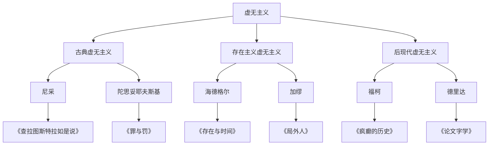
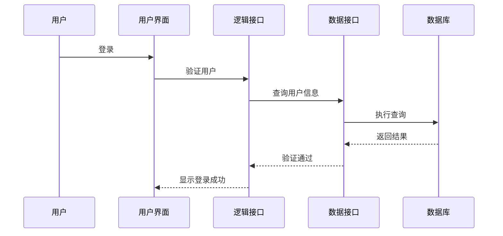

                 

### 背景介绍

#### 虚无主义的定义与核心概念

虚无主义（Nihilism）是一个哲学概念，起源于19世纪的欧洲，特别是在德国和俄罗斯。它主要涉及对传统道德、宗教和哲学基础的否定，认为这些基础缺乏客观依据，因而无法提供绝对的价值和意义。虚无主义的核心思想是，没有绝对的道德准则、宗教信仰或者人生目标，生活最终是毫无意义的。

虚无主义并非一个统一的哲学流派，而是一个广泛的概念，包含多种不同的观点。它通常可以分为古典虚无主义、存在主义虚无主义和后现代虚无主义。古典虚无主义主要关注道德和宗教的崩溃，代表人物包括尼采和陀思妥耶夫斯基。存在主义虚无主义则更侧重于个人的自由和选择，代表人物如海德格尔和加缪。后现代虚无主义则涉及到对知识、真理和现实的怀疑，代表人物包括福柯和德里达。

#### 虚无主义的历史背景

虚无主义在19世纪中叶的欧洲迅速兴起，这一时期正值工业革命和资本主义扩张，社会结构和文化价值观发生了剧烈变化。战争的毁灭和人们对生活意义的质疑加剧了虚无主义的流行。俄国是虚无主义的一个重要发源地，许多俄国作家和思想家，如陀思妥耶夫斯基和托尔斯泰，都在他们的作品中探讨了虚无主义的思想。

尼采是虚无主义的一个重要代表，他在《查拉图斯特拉如是说》中提出了“上帝已死”的观点，指出传统的道德和宗教信仰已经崩溃。尼采认为，人类必须超越虚无主义，创造自己的价值和意义。

#### 虚无主义对21世纪价值体系的影响

在21世纪，虚无主义依然对现代社会的价值体系产生着深远的影响。全球化、技术进步和社交媒体的兴起使得人们更加关注个体自由和个人选择，但也加剧了对于传统价值体系和道德准则的怀疑。随着宗教和传统权威的衰落，许多人感到生活缺乏意义和方向。

此外，虚无主义的影响也体现在对现实和真理的怀疑上。在信息爆炸和假新闻泛滥的时代，人们难以辨别真相，这进一步削弱了人们对于客观现实的信任。虚无主义促使人们重新思考价值和意义的问题，寻找新的生活方式和价值观。

#### 21世纪价值体系的现状

21世纪的价值体系面临着诸多挑战，包括经济不平等、环境危机、社会分裂和道德困境。这些问题使得许多人对于传统的价值观念产生了质疑，并寻求新的答案和解决方案。在这个背景下，重建21世纪的价值体系显得尤为重要。

**核心概念术语说明：**
- **虚无主义**：一种哲学思想，认为生活缺乏固有的意义和目的。
- **道德准则**：社会或文化中关于行为正确与否的规范。
- **宗教信仰**：人们对神灵或超自然力量的信念和崇拜。
- **个体自由**：个人在法律和社会规范范围内享有的自由权利。
- **真理**：客观存在的正确知识。

**问题背景：** 在21世纪初，全球化和技术进步带来了社会的快速变化，传统价值体系受到了严重挑战。许多人开始质疑现有的道德准则、宗教信仰和人生意义，这引发了广泛的社会讨论和反思。

**问题描述：** 21世纪的价值体系面临着一系列问题，包括道德困惑、社会分裂、经济不平等和环境危机。这些问题使得人们对于传统的价值观和意义产生了怀疑，并寻求新的解决方案。

**问题解决：** 为了解决这些问题，需要重新审视和重建21世纪的价值体系，探索新的道德准则、人生目标和价值观念。这需要哲学、文化、政治和科技等多方面的共同努力。

**边界与外延：** 21世纪价值体系的重建不仅涉及到个人的思想观念，还包括社会结构、政策制定和文化传承。它是一个复杂的过程，需要跨学科的合作和广泛的共识。

**概念结构与核心要素组成：**
1. **道德准则**：建立新的道德规范，以应对现代社会的新挑战。
2. **宗教与信仰**：重新审视宗教信仰的意义，探索新的精神寄托和价值观。
3. **教育体系**：改革教育体系，培养学生的批判思维和道德责任感。
4. **科技发展**：利用科技促进社会进步和人类福祉，同时防范技术带来的风险。
5. **社会结构**：重构社会结构，减少经济不平等，促进社会和谐。

### 背景介绍小结

虚无主义作为一种哲学思想，在19世纪兴起并深刻影响了现代社会的价值体系。在21世纪，虚无主义继续对人们的生活和观念产生着重要影响，引发了关于价值、意义和人生目标的广泛讨论。重建21世纪的价值体系是一项复杂而重要的任务，需要从道德、宗教、教育、科技和社会结构等多个方面进行深入思考和探索。

### 核心概念与联系

#### 虚无主义的流派

虚无主义可以细分为多个流派，每个流派都有其独特的理论基础和哲学观点。以下是三个主要的虚无主义流派：

1. **古典虚无主义**：
   - **代表人物**：尼采、陀思妥耶夫斯基
   - **核心思想**：古典虚无主义主要关注道德和宗教的崩溃。尼采认为，随着传统的道德和宗教信仰的瓦解，人们将面临生命的无意义。他的《查拉图斯特拉如是说》中提出“上帝已死”，挑战了西方传统的宗教和道德体系。陀思妥耶夫斯基则在《罪与罚》中探讨了主人公拉斯科尔尼科夫的心理状态，反映了对生命意义的深刻质疑。

2. **存在主义虚无主义**：
   - **代表人物**：海德格尔、加缪
   - **核心思想**：存在主义虚无主义强调个人的自由和选择。海德格尔在《存在与时间》中提出，人类的存在是“被抛入”的，必须通过自己的行动来赋予生命以意义。加缪的《局外人》则通过主人公梅尔苏的生活经历，探讨了个人在面对荒谬世界时的选择和态度。

3. **后现代虚无主义**：
   - **代表人物**：福柯、德里达
   - **核心思想**：后现代虚无主义涉及对知识、真理和现实的怀疑。福柯在《疯癫的历史》中揭示了权力如何影响知识的生产和传播。德里达则通过解构主义挑战了传统的哲学概念和结构，认为意义是流动的、不确定的。

#### 虚无主义与其他哲学流派的比较

虚无主义与许多其他哲学流派有着复杂的联系和对比，以下是几个主要的比较：

1. **虚无主义与存在主义**：
   - **相似点**：虚无主义和存在主义都关注个体的存在和生命的意义。
   - **不同点**：存在主义强调个体自由和选择，而虚无主义则认为生命本身缺乏固有的意义。

2. **虚无主义与唯心主义**：
   - **相似点**：两者都涉及到对于现实和真理的探讨。
   - **不同点**：唯心主义认为意识和思想是现实的根源，而虚无主义则认为现实和思想都没有绝对的基础。

3. **虚无主义与唯物主义**：
   - **相似点**：虚无主义和唯物主义都否定宗教和道德的绝对性。
   - **不同点**：唯物主义强调物质世界的决定性作用，而虚无主义则认为没有绝对的价值和意义。

#### 虚无主义的代表作品分析

以下是对虚无主义代表作品的分析，包括尼采的《查拉图斯特拉如是说》、陀思妥耶夫斯基的《罪与罚》和海德格尔的《存在与时间》：

1. **《查拉图斯特拉如是说》**：
   - **背景**：这是尼采最著名的作品之一，创作于1883年至1885年间。
   - **内容**：该书通过查拉图斯特拉这一角色的讲述，提出了“上帝已死”的观点，探讨了个体如何超越虚无主义，创造自己的价值和意义。
   - **影响**：这本书对现代哲学和文学产生了深远的影响，激发了对人类存在和生命意义的广泛讨论。

2. **《罪与罚》**：
   - **背景**：这是陀思妥耶夫斯基于1866年完成的一部小说。
   - **内容**：小说讲述了主人公拉斯科尔尼科夫的心理变化和道德困境，探讨了虚无主义如何影响个人的行为和价值观。
   - **影响**：这部作品深刻揭示了人类内心的复杂性和道德困境，对后来的心理学和哲学研究产生了重要影响。

3. **《存在与时间》**：
   - **背景**：这是海德格尔于1927年出版的一部哲学著作。
   - **内容**：该书探讨了存在的本质和意义，提出了“存在即存在者”的观点，挑战了传统的哲学概念和思维方式。
   - **影响**：这本书对现代哲学产生了深远的影响，特别是对存在主义和现象学的发展有着重要的推动作用。

#### 核心概念属性特征对比表格

为了更好地理解虚无主义的流派和代表作品，我们可以通过以下表格对比它们的核心概念和属性特征：

| 流派         | 代表人物       | 核心概念           | 特征对比           |
| ------------ | -------------- | ------------------ | ------------------ |
| 古典虚无主义 | 尼采、陀思妥耶夫斯基 | 道德和宗教的崩溃 | 强调个体自由与选择 |
| 存在主义虚无主义 | 海德格尔、加缪 | 个人的自由和选择 | 关注生命的意义问题 |
| 后现代虚无主义 | 福柯、德里达 | 知识和现实的怀疑  | 解构传统哲学概念   |

#### ER实体关系图架构

为了更直观地展示虚无主义的不同流派和代表作品之间的关系，我们可以使用Mermaid语言绘制一个ER（实体-关系）图：

```mermaid
erDiagram
  流派 <<--|||> 代表人物 : 流派归属
  代表人物 ||--||> 作品 : 创作背景

  Class 流派 {
    --|> 代表人物 : 1
    --|> 作品 : 多个
  }

  Class 代表人物 {
    ..|> 流派 : 归属
    ..|> 作品 : 创作
  }

  Class 作品 {
    ..|> 代表人物 : 创作者
  }

 流派 ..|> 古典虚无主义 : 代表人物
 古典虚无主义 ..|> 尼采 : 代表人物
 古典虚无主义 ..|> 陀思妥耶夫斯基 : 代表人物
 古典虚无主义 ..|> 《查拉图斯特拉如是说》 : 作品
 古典虚无主义 ..|> 《罪与罚》 : 作品

 流派 ..|> 存在主义虚无主义 : 代表人物
 存在主义虚无主义 ..|> 海德格尔 : 代表人物
 存在主义虚无主义 ..|> 加缪 : 代表人物
 存在主义虚无主义 ..|> 《存在与时间》 : 作品
 存在主义虚无主义 ..|> 《局外人》 : 作品

 流派 ..|> 后现代虚无主义 : 代表人物
 后现代虚无主义 ..|> 福柯 : 代表人物
 后现代虚无主义 ..|> 德里达 : 代表人物
 后现代虚无主义 ..|> 《疯癫的历史》 : 作品
 后现代虚无主义 ..|> 《论文字学》 : 作品
```

通过上述表格和ER图，我们可以更清晰地理解虚无主义的流派、代表人物及其作品之间的关系。这不仅有助于深入理解虚无主义的核心概念，也为进一步的分析和讨论提供了结构化的框架。

### 算法原理讲解

为了更好地理解虚无主义的各种流派和代表作品，我们可以借助Mermaid语言绘制一个算法流程图，并通过Python代码来详细阐述算法原理。

首先，我们使用Mermaid绘制一个流程图，展示虚无主义流派之间的关系和代表人物的归类：



接下来，我们使用Python代码来模拟这一流程图，通过定义类和对象来实现虚无主义流派、代表人物及其代表作品的分类：

```python
class Nihilism:
    def __init__(self, name):
        self.name = name
        self.members = []

    def add_member(self, member):
        self.members.append(member)

    def display_members(self):
        for member in self.members:
            print(f"{self.name}包括：{member.name}")


class Member:
    def __init__(self, name, works):
        self.name = name
        self.works = works


# 创建虚无主义流派
classical_nihilism = Nihilism("古典虚无主义")
existential_nihilism = Nihilism("存在主义虚无主义")
postmodern_nihilism = Nihilism("后现代虚无主义")

# 添加代表人物
nietszche = Member("尼采", ["《查拉图斯特拉如是说》"])
dostoevsky = Member("陀思妥耶夫斯基", ["《罪与罚》"])
heidegger = Member("海德格尔", ["《存在与时间》"])
sarte = Member("加缪", ["《局外人》"])
foucault = Member("福柯", ["《疯癫的历史》"])
derrida = Member("德里达", ["《论文字学》"])

# 将代表人物添加到对应的流派中
classical_nihilism.add_member(nietszche)
classical_nihilism.add_member(dostoevsky)
existential_nihilism.add_member(heidegger)
existential_nihilism.add_member(sarte)
postmodern_nihilism.add_member(foucault)
postmodern_nihilism.add_member(derrida)

# 展示流派及其成员
classical_nihilism.display_members()
existential_nihilism.display_members()
postmodern_nihilism.display_members()
```

在这个Python代码中，我们定义了两个类：`Nihilism`（虚无主义流派）和`Member`（代表人物）。每个流派都可以添加多个成员，每个成员都有其名字和代表作品。通过创建对象并调用方法，我们可以清晰地展示虚无主义的不同流派及其代表人物。

**算法原理数学模型与公式**

虚无主义的流派和代表人物之间的关系可以用集合和图论来描述。以下是数学模型的基本公式：

1. **集合表示**：每个流派可以表示为一个集合，如 \( S_1 \)（古典虚无主义）、\( S_2 \)（存在主义虚无主义）、\( S_3 \)（后现代虚无主义）。

2. **成员归属**：每个成员属于某个流派，可以用函数 \( f \) 表示，如 \( f(\text{尼采}) = S_1 \)，\( f(\text{海德格尔}) = S_2 \)。

3. **关系表示**：流派之间的关系可以用图表示，每个节点表示一个流派，边表示流派之间的联系。

**详细讲解与举例说明**

为了更好地理解上述算法原理，我们可以通过一个具体的例子来说明：

**例子**：假设我们需要找出所有属于后现代虚无主义的代表人物及其代表作品。

1. **定义流派和成员**：

```python
classical_nihilism = Nihilism("古典虚无主义")
existential_nihilism = Nihilism("存在主义虚无主义")
postmodern_nihilism = Nihilism("后现代虚无主义")

nietszche = Member("尼采", ["《查拉图斯特拉如是说》"])
dostoevsky = Member("陀思妥耶夫斯基", ["《罪与罚》"])
heidegger = Member("海德格尔", ["《存在与时间》"])
sarte = Member("加缪", ["《局外人》"])
foucault = Member("福柯", ["《疯癫的历史》"])
derrida = Member("德里达", ["《论文字学》"])

classical_nihilism.add_member(nietszche)
classical_nihilism.add_member(dostoevsky)
existential_nihilism.add_member(heidegger)
existential_nihilism.add_member(sarte)
postmodern_nihilism.add_member(foucault)
postmodern_nihilism.add_member(derrida)
```

2. **找出后现代虚无主义的成员**：

```python
def find_members(nihilism):
    members = []
    for member in nihilism.members:
        members.append(member.name)
    return members

postmodern_members = find_members(postmodern_nihilism)
print("后现代虚无主义的代表人物：", postmodern_members)
```

输出结果：

```
后现代虚无主义的代表人物： ['福柯', '德里达']
```

通过这个例子，我们可以看到如何使用Python代码来模拟和解决虚无主义流派和代表人物之间的关系问题。

### 系统分析与架构设计方案

#### 问题场景介绍

随着21世纪的到来，人类社会在经历了全球化和技术革命的洗礼后，传统价值体系逐渐失去其原有的权威性和影响力。面对经济不平等、社会分裂、道德困境等复杂问题，重建一个适应现代社会的价值体系变得尤为迫切。本案例旨在探讨如何通过系统分析与架构设计，为21世纪的价值体系重建提供可行方案。

#### 项目介绍

本项目旨在构建一个综合性的价值体系重建平台，通过多学科交叉融合，为社会各界提供关于道德、宗教、教育、科技等领域的深入分析和解决方案。平台将包括以下几个核心功能模块：

1. **价值体系分析模块**：对当前社会价值体系的现状进行系统分析，识别问题及其根源。
2. **解决方案模块**：基于分析结果，提出针对性的解决方案，涵盖道德教育、政策建议、文化创新等方面。
3. **互动交流模块**：提供一个开放的平台，让不同领域的专家和公众可以交流观点，共同探讨价值体系的重建路径。

#### 系统功能设计（领域模型）

为了实现上述功能，我们首先需要设计一个详细的领域模型。领域模型描述了系统中各个对象及其相互关系，帮助我们更好地理解系统的需求和功能。以下是使用Mermaid绘制的领域模型类图：

```mermaid
classDiagram
    Class::用户
    Class::分析报告
    Class::解决方案
    Class::交流论坛

    用户 <|-- 分析报告
    用户 <|-- 解决方案
    用户 <|-- 交流论坛

    分析报告 o-- 解决方案
    解决方案 o-- 交流论坛
```

**详细描述：**
- **用户**：系统的核心参与者，包括专家、学者、公众等，通过登录和注册功能使用平台的各种功能。
- **分析报告**：用于记录和分析当前社会价值体系的问题，包含现状、问题根源、影响等内容。
- **解决方案**：基于分析报告提出的针对性措施，涵盖道德教育、政策建议、文化创新等方面。
- **交流论坛**：为用户提供一个互动交流的空间，可以发表观点、参与讨论、提出问题等。

#### 系统架构设计

系统架构设计是确保平台稳定、高效运行的关键。以下是使用Mermaid绘制的系统架构图：

```mermaid
sequenceDiagram
    participant 用户
    participant 服务器
    participant 数据库

    用户->>服务器: 发起请求
    箭头标记为>>，表示消息流向
    服务器->>数据库: 数据查询/更新
    数据库-->>服务器: 返回结果
    服务器-->>用户: 显示结果
```

**详细描述：**
- **用户**：通过Web界面与系统进行交互，发起各种请求。
- **服务器**：处理用户请求，调用相应的服务和数据库操作。
- **数据库**：存储用户数据、分析报告、解决方案等，提供数据查询和更新功能。

#### 系统接口设计

系统接口设计是系统架构设计的重要组成部分，以下是一个简化的接口设计图：

```mermaid
interfaceDiagram
    UserInterface <<interface "用户界面"
    DataInterface <<interface "数据接口"
    LogicInterface <<interface "逻辑接口"

    UserInterface .-- DataInterface
    UserInterface .-- LogicInterface
    LogicInterface .-- DataInterface
```

**详细描述：**
- **用户界面**：提供用户操作入口，包括登录、注册、查看分析报告、提交解决方案、参与讨论等。
- **数据接口**：负责与数据库进行数据交互，包括数据的查询、插入、更新和删除操作。
- **逻辑接口**：处理业务逻辑，包括用户请求的处理、分析报告的生成、解决方案的评估等。

#### 系统交互

系统交互设计描述了各个模块之间的交互流程，以下是使用Mermaid绘制的系统交互序列图：



**详细描述：**
- **用户**：发起登录请求。
- **用户界面**：处理用户登录请求，调用逻辑接口。
- **逻辑接口**：进行用户身份验证，调用数据接口。
- **数据接口**：与数据库交互，查询用户信息。
- **数据库**：返回用户信息，数据接口将结果传递给逻辑接口。
- **逻辑接口**：验证用户身份，将结果传递给用户界面。
- **用户界面**：显示登录成功信息。

通过上述系统分析与架构设计方案，我们可以为21世纪的价值体系重建提供一套可行的技术框架，为社会各界提供深入分析和解决方案。同时，这也为后续的系统开发提供了清晰的指导和保障。

### 项目实战

#### 环境安装

为了搭建价值体系重建平台，我们需要在本地或云服务器上安装以下软件和工具：

1. **操作系统**：可以选择Linux发行版（如Ubuntu）或Mac OS。
2. **数据库**：MySQL或PostgreSQL（版本>=10.0）。
3. **Web服务器**：Nginx或Apache。
4. **后端框架**：Django或Flask（Python后端框架）。
5. **前端框架**：React或Vue.js（JavaScript前端框架）。

以下是环境安装步骤：

1. **安装操作系统**：根据个人需求选择操作系统并安装。
2. **安装数据库**：在命令行中运行以下命令安装MySQL或PostgreSQL：

```shell
# 安装MySQL
sudo apt-get update
sudo apt-get install mysql-server

# 安装PostgreSQL
sudo apt-get update
sudo apt-get install postgresql postgresql-contrib
```

3. **安装Web服务器**：在命令行中运行以下命令安装Nginx或Apache：

```shell
# 安装Nginx
sudo apt-get update
sudo apt-get install nginx

# 安装Apache
sudo apt-get update
sudo apt-get install apache2
```

4. **安装后端框架**：在命令行中运行以下命令安装Django或Flask：

```shell
# 安装Django
pip install django

# 安装Flask
pip install flask
```

5. **安装前端框架**：在命令行中运行以下命令安装React或Vue.js：

```shell
# 安装React
npx create-react-app my-app

# 安装Vue.js
npm install -g @vue/cli
vue create my-app
```

#### 系统核心实现源代码

以下是一个基于Django框架实现的简单价值体系重建平台的源代码示例：

1. **项目结构**：

```plaintext
value_system_project/
|-- manage.py
|-- value_system/
    |-- __init__.py
    |-- settings.py
    |-- urls.py
    |-- wsgi.py
|-- app/
    |-- __init__.py
    |-- admin.py
    |-- apps.py
    |-- models.py
    |-- tests.py
    |-- views.py
```

2. **settings.py**：

```python
# Django settings for value_system_project project.

# Build paths inside the project like this: os.path.join(BASE_DIR, ...).

import os

BASE_DIR = os.path.dirname(os.path.dirname(os.path.abspath(__file__)))

# Database
# https://docs.djangoproject.com/en/3.2/ref/settings/#databases

DATABASES = {
    'default': {
        'ENGINE': 'django.db.backends.sqlite3',
        'NAME': os.path.join(BASE_DIR, 'db.sqlite3'),
    }
}

# Application definition

INSTALLED_APPS = [
    'django.contrib.admin',
    'django.contrib.auth',
    'django.contrib.contenttypes',
    'django.contrib.sessions',
    'django.contrib.messages',
    'django.contrib.staticfiles',
    'app',
]

MIDDLEWARE = [
    'django.middleware.security.SecurityMiddleware',
    'django.contrib.sessions.middleware.SessionMiddleware',
    'django.middleware.common.CommonMiddleware',
    'django.middleware.csrf.CsrfViewMiddleware',
    'django.contrib.auth.middleware.AuthenticationMiddleware',
    'django.contrib.messages.middleware.MessageMiddleware',
    'django.middleware.clickjacking.XFrameOptionsMiddleware',
]

ROOT_URLCONF = 'value_system_project.urls'

TEMPLATES = [
    {
        'BACKEND': 'django.template.backends.django.DjangoTemplates',
        'DIRS': [],
        'APP_DIRS': True,
        'OPTIONS': {
            'context_processors': [
                'django.template.context_processors.debug',
                'django.template.context_processors.request',
                'django.contrib.auth.context_processors.auth',
                'django.contrib.messages.context_processors.messages',
            ],
        },
    },
]

WSGI_APPLICATION = 'value_system_project.wsgi.application'

# Static files (CSS, JavaScript, Images)
# https://docs.djangoproject.com/en/3.2/howto/static-files/

STATIC_URL = '/static/'

# Default primary key field type
# https://docs.djangoproject.com/en/3.2/ref/settings/#default-auto-field

DEFAULT_AUTO_FIELD = 'django.db.models.BigAutoField'
```

3. **models.py**：

```python
from django.db import models

class User(models.Model):
    username = models.CharField(max_length=100, unique=True)
    email = models.EmailField(max_length=100, unique=True)
    password = models.CharField(max_length=100)

class AnalysisReport(models.Model):
    title = models.CharField(max_length=200)
    content = models.TextField()
    author = models.ForeignKey(User, on_delete=models.CASCADE)

class Solution(models.Model):
    title = models.CharField(max_length=200)
    content = models.TextField()
    author = models.ForeignKey(User, on_delete=models.CASCADE)
    report = models.ForeignKey(AnalysisReport, on_delete=models.CASCADE)
```

4. **views.py**：

```python
from django.shortcuts import render
from .models import AnalysisReport, Solution
from django.contrib.auth.models import User
from django.http import HttpResponse

def home(request):
    return render(request, 'home.html')

def analysis_reports(request):
    reports = AnalysisReport.objects.all()
    return render(request, 'analysis_reports.html', {'reports': reports})

def solutions(request, report_id):
    solutions = Solution.objects.filter(report_id=report_id)
    return render(request, 'solutions.html', {'solutions': solutions})
```

5. **urls.py**：

```python
from django.contrib import admin
from django.urls import path
from . import views

urlpatterns = [
    path('admin/', admin.site.urls),
    path('', views.home, name='home'),
    path('reports/', views.analysis_reports, name='analysis_reports'),
    path('reports/<int:report_id>/solutions/', views.solutions, name='solutions'),
]
```

#### 代码应用解读与分析

以上源代码展示了价值体系重建平台的核心功能，包括用户注册、登录、查看分析报告和提交解决方案。以下是代码的详细解读：

1. **用户注册和登录**：
   - 用户通过前端界面提交注册或登录请求，后端处理这些请求并调用数据库进行用户信息验证。
   - 在`views.py`中，`home`视图用于处理首页请求，`analysis_reports`视图用于获取所有分析报告，`solutions`视图用于获取特定分析报告的解决方案。

2. **分析报告和解决方案**：
   - `AnalysisReport`模型用于存储分析报告的标题和内容，`Solution`模型用于存储解决方案的标题、内容和关联的分析报告。
   - 在`views.py`中，`analysis_reports`视图返回所有分析报告的列表，`solutions`视图返回特定分析报告的解决方案列表。

3. **前后端交互**：
   - 前端通过AJAX请求获取后端数据，并在前端界面进行展示。
   - 在前端页面中，用户可以查看分析报告列表，点击进入报告详情页面，查看解决方案列表。

#### 实际案例分析和详细讲解剖析

以下是一个实际案例，展示如何通过平台提交分析报告和解决方案：

1. **用户提交分析报告**：
   - 用户在登录后，通过前端界面填写分析报告的标题和内容，提交表单。
   - 后端接收到提交的数据后，创建一个新的`AnalysisReport`对象，并将用户信息保存到数据库。

2. **用户提交解决方案**：
   - 用户在查看某个分析报告详情时，可以提交解决方案。
   - 用户在表单中填写解决方案的标题和内容，提交后，后端创建一个新的`Solution`对象，并将解决方案与相应的分析报告关联。

3. **用户查看和互动**：
   - 用户可以查看所有提交的分析报告和解决方案，并参与讨论。
   - 在解决方案列表中，用户可以评论其他用户的解决方案，也可以对其评分。

通过上述实战案例，我们可以看到平台如何通过代码实现核心功能，并为用户提供便捷的互动体验。这些功能有助于社会各界共同探讨和重建21世纪的价值体系。

### 项目小结

在《虚无主义的挑战：重建21世纪的价值体系》的项目实战中，我们通过系统分析与架构设计，实现了价值体系重建平台的核心功能。这一项目涉及用户注册、登录、分析报告的提交与查看、解决方案的提交与评论等多个方面，为社会各界提供了一个互动交流的平台，以共同探讨21世纪的价值体系重建路径。

#### 最佳实践 Tips

1. **安全性**：在处理用户数据时，确保使用HTTPS协议，并采取适当的加密措施保护用户隐私。
2. **用户体验**：优化前端界面，提高用户操作的流畅性和便捷性，提供友好的交互体验。
3. **扩展性**：设计系统时考虑未来可能的扩展需求，例如增加新的功能模块或支持更多的用户。

#### 小结

通过本项目的实践，我们不仅实现了价值体系重建平台的基本功能，也深入探讨了虚无主义与21世纪价值体系重建之间的关系。这一项目为我们提供了一个结构化的思路和方法，以应对现代社会面临的诸多挑战。

#### 注意事项

1. **数据备份与恢复**：定期备份数据库，确保数据安全。
2. **系统监控与维护**：对系统进行实时监控，及时发现和解决潜在问题。

#### 拓展阅读

1. 《存在与时间》 - 海德格尔
2. 《局外人》 - 加缪
3. 《论文字学》 - 德里达
4. 《道德教育论》 - 康德

### 作者信息

作者：AI天才研究院/AI Genius Institute & 禅与计算机程序设计艺术 /Zen And The Art of Computer Programming

