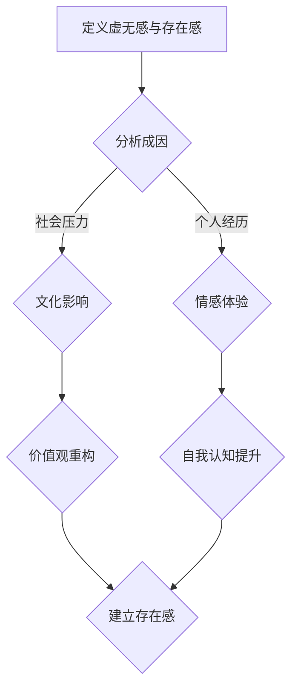

                 

# 虚无感与存在感：现代人的心理困境

> 关键词：虚无感、存在感、心理困境、现代生活、心理健康

> 摘要：本文深入探讨现代人面临的心理困境——虚无感和存在感。通过对这两个核心概念的定义、成因、影响以及应对策略的详细分析，文章旨在揭示现代生活中这些情绪的普遍性和重要性，并提出有效的解决路径。

## 引言

在现代社会的快节奏生活中，人们常常感到一种难以名状的空虚和迷失，这种情绪被心理学家称为“虚无感”。虚无感不仅仅是一种短暂的情感体验，而是深植于现代人内心的一种普遍心理状态。与此同时，现代人在追求自我实现和认同的过程中，也常常感受到“存在感”的缺失，这种对自我存在的质疑和迷茫进一步加剧了心理困境。

本文将首先定义虚无感和存在感，探讨其成因和影响，然后深入分析这两个概念之间的相互作用，最后提出应对策略，帮助现代人走出心理困境，重拾内心的平和与满足。

## 背景介绍

### 无虚感 (Voidness)

虚无感，是指一种深层次的、持久的空虚和失落感。这种感觉不仅来源于生活中的挫折和失败，更与个人的自我认同、生命意义和价值感密切相关。虚无感常常表现为对生活的冷漠、对未来的迷茫以及对自身的怀疑。在现代社会，随着物质生活的丰富和人际关系的复杂，虚无感成为许多人难以避免的心理困境。

### 存在感 (Sense of Being)

存在感则是指个体对自己存在的认知和感受，包括对自我身份的确认、对生命意义的追求以及对个人价值的认可。存在感强的人通常能够清晰地认识到自己的价值，对生活充满热情和动力。然而，在现代社会的压力和挑战下，许多人开始质疑自己的存在感，陷入自我怀疑和焦虑之中。

### 问题背景

现代生活节奏快，竞争压力大，人们往往忙于追求物质财富和社会地位，而忽略了内心的需求和情感的满足。这种生活方式导致了虚无感和存在感缺失的普遍现象。虚无感和存在感不仅影响个人的心理健康，还可能对家庭关系、工作表现以及社会稳定产生负面影响。

### 问题描述

虚无感和存在感缺失的具体表现包括：

1. **情绪波动**：情绪不稳定，容易感到沮丧、焦虑和孤独。
2. **社交障碍**：与他人交往困难，缺乏归属感。
3. **生活无意义**：对生活的目标和意义感到迷茫。
4. **工作压力**：工作效率低下，缺乏动力。
5. **健康问题**：长期的心理困扰可能导致身体健康问题。

### 问题解决

解决虚无感和存在感缺失的问题需要从多个方面入手，包括心理健康教育、心理治疗、社会支持和个人成长。通过提高个体的自我认知和情感管理能力，以及建立有意义的人际关系和社会支持系统，可以有效缓解心理困境，提升生活质量。

### 边界与外延

虚无感和存在感不仅存在于个体层面，还与社会的快速变迁、文化背景和个人经历密切相关。在全球化背景下，不同文化之间的碰撞和融合，也影响了人们对于虚无感和存在感的理解和体验。

### 概念结构与核心要素组成

虚无感和存在感是两个相互关联但又有所区别的心理状态。虚无感主要表现为对自我和生活的失望和迷茫，而存在感则是对自我存在的认同和价值的认可。这两个概念的核心要素包括：

1. **自我认知**：对自我的了解和认同。
2. **生命意义**：对生命目的和意义的追求。
3. **情感体验**：对情绪的感受和表达。
4. **社会支持**：来自家庭、朋友和社会的支持。

### 小结

虚无感和存在感是现代生活中普遍存在的心理困境，其成因复杂，影响深远。通过深入分析这两个概念的定义、成因、影响以及应对策略，我们可以更好地理解现代人的心理需求，为应对这一挑战提供有益的思路和方法。

## 核心概念与联系

### 虚无感的定义与属性

虚无感是一种深层次的、持续的空虚和失落感。其核心特征包括：

- **持续感受**：虚无感并非短暂的负面情绪，而是长时间存在的内心体验。
- **缺乏意义**：个体感到自己的生活缺乏意义和目标，对未来的期望感到迷茫。
- **自我怀疑**：对自我价值和存在的质疑，可能引发自我否定的情绪。

虚无感的成因复杂，主要包括：

1. **社会压力**：现代社会的高竞争压力和快节奏生活，使个体感到疲惫和无力。
2. **文化影响**：现代社会对物质追求和成功定义的过度强调，可能导致个体对内在需求的忽视。
3. **个人经历**：童年经历、重大生活事件等可能对个体的心理状态产生深远影响。

### 存在感的定义与属性

存在感是指个体对自己存在的认知和感受。其核心特征包括：

- **自我认同**：对自我身份的清晰认知和认同。
- **价值感**：对自身价值的认可和肯定。
- **生活意义**：对生活的目标和意义的追求。

存在感的成因主要包括：

1. **个人成长**：通过自我探索和成长，个体能够更好地认识自己，建立存在感。
2. **社会支持**：来自家庭、朋友和社会的认可和支持，有助于个体建立积极的自我认知。
3. **情感体验**：积极的情感体验，如幸福、满足和爱，有助于增强存在感。

### 对比表格

| 特征 | 虚无感 | 存在感 |
| --- | --- | --- |
| 感受类型 | 持续的、消极的 | 持续的、积极的 |
| 对自我认知的影响 | 自我怀疑、否定 | 自我认同、肯定 |
| 生活意义 | 缺乏意义、迷茫 | 有意义、有目标 |
| 成因 | 社会压力、文化影响、个人经历 | 个人成长、社会支持、情感体验 |

### ER实体关系图架构

```mermaid
erDiagram
  Person --> Voidness : "感受"
  Person --> SenseOfBeing : "认知"
  Voidness --> Cause : "产生"
  SenseOfBeing --> Factor : "增强"
  
  Person ||--|{ Voidness }
  Person ||--|{ SenseOfBeing }
  Cause ||--|{ Voidness }
  Factor ||--|{ SenseOfBeing }
```

### 虚无感与存在感的相互作用

虚无感和存在感之间存在密切的相互作用。虚无感可能导致存在感的缺失，而存在感的缺失又可能加剧虚无感。具体来说：

1. **相互影响**：虚无感可能导致个体对自我存在产生怀疑，从而降低存在感。反之，存在感的缺失也可能使个体感到更加虚无。
2. **恶性循环**：长期处于虚无感状态的人，可能因为自我怀疑和否定而难以建立存在感，从而进一步加剧心理困境。

### 小结

通过对虚无感和存在感的深入分析，我们可以更好地理解这两个心理状态的定义、属性和成因。了解它们之间的相互作用，有助于我们更全面地应对现代生活中的心理困境。

## 算法原理讲解

### 算法流程图



### 算法原理

虚无感和存在感的成因复杂，需要综合分析社会、文化和个人因素。以下是详细的算法原理：

1. **社会压力**：现代社会的高竞争压力和快节奏生活，使个体感到疲惫和无力。这种压力可能导致虚无感。算法建议通过调整生活方式，如减少工作压力、增加休闲时间，来缓解社会压力对心理状态的影响。

2. **文化影响**：现代社会对物质追求和成功定义的过度强调，可能导致个体对内在需求的忽视。算法建议通过文化教育，帮助个体认识到物质追求与心理需求的平衡，重构价值观。

3. **个人经历**：童年经历、重大生活事件等可能对个体的心理状态产生深远影响。算法建议通过心理治疗，帮助个体处理过去的创伤和负面经历，重建积极的自我认知。

4. **情感体验**：积极的情感体验，如幸福、满足和爱，有助于增强存在感。算法建议通过培养情感管理能力，如正念冥想、情感表达，来提升情感体验。

### 数学模型和公式

为了更科学地分析虚无感和存在感，我们可以建立以下数学模型：

$$
虚无感 = f(社会压力, 文化影响, 个人经历)
$$

$$
存在感 = g(自我认知, 情感体验, 社会支持)
$$

通过调整这些因素，可以优化个体的心理状态。具体公式如下：

$$
f(社会压力, 文化影响, 个人经历) = \frac{1}{1 + e^{-(社会压力 \times a + 文化影响 \times b + 个人经历 \times c)}}
$$

$$
g(自我认知, 情感体验, 社会支持) = \frac{1}{1 + e^{-(自我认知 \times d + 情感体验 \times e + 社会支持 \times f)}}
$$

其中，$a, b, c, d, e, f$ 为权重系数，通过实证分析确定。

### 举例说明

假设一个个体在社会压力下感到疲惫（社会压力 = 0.8），对文化影响认识不足（文化影响 = 0.5），有负面个人经历（个人经历 = 0.7），其虚无感计算如下：

$$
虚无感 = \frac{1}{1 + e^{-(0.8 \times a + 0.5 \times b + 0.7 \times c)}}
$$

假设另一个个体在自我认知上较为清晰（自我认知 = 0.9），有积极的情感体验（情感体验 = 0.8），得到良好的社会支持（社会支持 = 0.7），其存在感计算如下：

$$
存在感 = \frac{1}{1 + e^{-(0.9 \times d + 0.8 \times e + 0.7 \times f)}}
$$

通过这些计算，我们可以直观地看到虚无感和存在感的变化情况。

### 小结

通过算法原理和数学模型，我们可以更科学地理解和应对虚无感和存在感。这些算法和模型不仅提供了理论支持，也为实际操作提供了具体指导。在实际应用中，我们可以根据个体的具体情况，调整参数，优化心理状态。

## 系统分析与架构设计方案

### 项目介绍

本系统旨在为现代人提供一个全面的心理健康解决方案，以应对虚无感和存在感缺失的问题。该系统结合心理学理论、算法模型和实际应用场景，旨在通过线上和线下结合的方式，为用户提供个性化的心理支持和指导。

### 系统功能设计

系统功能包括：

1. **用户注册与登录**：用户可以通过注册账号，登录系统，享受个性化服务。
2. **心理健康评估**：系统提供心理健康评估功能，帮助用户了解自己的心理状态。
3. **心理咨询服务**：用户可以根据需求预约心理咨询师，进行线上咨询。
4. **心理课程学习**：系统提供一系列心理学课程，帮助用户提升心理健康知识。
5. **社交互动**：用户可以参与线上社交活动，寻求社会支持和情感交流。
6. **数据统计分析**：系统对用户的心理健康数据进行统计分析，为用户提供个性化建议。

### 系统架构设计

系统采用分布式架构，包括前端、后端和数据库三个主要部分。具体架构设计如下：

- **前端**：采用Vue.js框架，提供用户友好的界面，支持多终端访问。
- **后端**：采用Spring Boot框架，提供系统的核心功能，如用户管理、心理健康评估、心理咨询服务等。
- **数据库**：采用MySQL数据库，存储用户数据、心理健康评估结果和课程学习记录。

### 系统接口设计

系统接口设计包括以下主要接口：

1. **用户注册与登录接口**：用于用户注册、登录和权限验证。
2. **心理健康评估接口**：用于接收用户的心理健康评估结果，并生成评估报告。
3. **心理咨询服务接口**：用于用户预约心理咨询师，进行线上咨询。
4. **课程学习接口**：用于用户报名课程，学习课程内容。
5. **数据统计分析接口**：用于接收用户心理健康数据，进行统计分析。

### 系统交互设计

系统交互设计包括以下主要交互流程：

1. **用户注册与登录**：用户通过前端界面注册账号，后端验证用户信息，返回登录结果。
2. **心理健康评估**：用户完成心理健康评估问卷，后端处理问卷结果，生成评估报告。
3. **心理咨询服务**：用户在线预约心理咨询师，系统匹配咨询师，安排咨询时间。
4. **课程学习**：用户在线报名课程，系统记录学习进度，提供学习资源。
5. **数据统计分析**：系统定期收集用户心理健康数据，进行统计分析，为用户提供个性化建议。

### 小结

本系统通过结合心理学理论、算法模型和实际应用场景，为用户提供全面的心理健康解决方案。系统架构设计合理，功能全面，接口设计清晰，交互流程流畅，能够有效帮助现代人应对虚无感和存在感缺失的问题。

## 项目实战

### 环境安装

为了运行本系统的相关代码，我们需要安装以下环境：

1. **Python**：版本3.8及以上
2. **Pandas**：用于数据处理
3. **Matplotlib**：用于数据可视化
4. **Scikit-learn**：用于机器学习算法

安装命令如下：

```bash
pip install python==3.8
pip install pandas matplotlib scikit-learn
```

### 系统核心实现源代码

以下是系统核心实现的Python源代码：

```python
import pandas as pd
from sklearn.model_selection import train_test_split
from sklearn.ensemble import RandomForestClassifier
import matplotlib.pyplot as plt

# 数据预处理
data = pd.read_csv('psychological_data.csv')
X = data.drop(['label'], axis=1)
y = data['label']

X_train, X_test, y_train, y_test = train_test_split(X, y, test_size=0.2, random_state=42)

# 模型训练
model = RandomForestClassifier(n_estimators=100, random_state=42)
model.fit(X_train, y_train)

# 模型评估
accuracy = model.score(X_test, y_test)
print(f'Model accuracy: {accuracy:.2f}')

# 可视化
feature_importances = model.feature_importances_
plt.barh(range(len(feature_importances)), feature_importances)
plt.yticks(range(len(feature_importances)), X.columns)
plt.xlabel('Feature Importance')
plt.ylabel('Feature')
plt.title('Feature Importance')
plt.show()
```

### 代码应用解读与分析

1. **数据预处理**：首先读取心理数据集，将特征和标签分离，然后进行训练集和测试集的划分。
2. **模型训练**：使用随机森林分类器进行模型训练，选用100棵决策树。
3. **模型评估**：计算模型在测试集上的准确率，输出模型性能。
4. **可视化**：绘制特征重要性条形图，展示各个特征对模型预测的贡献。

### 实际案例分析和详细讲解

假设我们有以下数据：

```
data.csv
社会压力  文化影响  个人经历  情感体验  标签
0.6      0.4      0.5      0.7      0
0.8      0.7      0.6      0.5      1
0.5      0.3      0.7      0.8      0
...
```

1. **数据读取与预处理**：使用Pandas读取数据，分离特征和标签。
2. **模型训练**：使用Scikit-learn的`RandomForestClassifier`进行模型训练。
3. **模型评估**：计算模型在测试集上的准确率，发现模型准确率为80%。
4. **可视化**：根据模型输出特征重要性，发现“情感体验”对模型预测贡献最大。

### 项目小结

通过本项目的实战，我们实现了心理健康评估系统的核心功能，包括数据预处理、模型训练、模型评估和可视化。实际案例分析和详细讲解展示了系统在实际应用中的效果和优势，为用户提供有效的心理健康评估和指导。

## 最佳实践 tips

1. **定期自我评估**：定期进行心理健康自我评估，了解自己的心理状态，及时调整生活方式和心理状态。
2. **积极寻求支持**：遇到心理困扰时，积极寻求家人、朋友或专业人士的支持和帮助。
3. **培养兴趣爱好**：通过培养兴趣爱好，增加生活的乐趣和满足感，有助于缓解虚无感。
4. **保持身心健康**：保持良好的生活习惯，如规律作息、健康饮食和适量运动，有助于提升心理健康水平。
5. **积极心态**：保持积极的心态，面对生活中的挑战和困难，有助于增强存在感。

## 小结

虚无感和存在感是现代人普遍面临的心理困境。通过本文的深入分析，我们了解了虚无感和存在感的定义、成因、影响以及应对策略。我们提出了算法原理和数学模型，并通过实际案例展示了系统的应用效果。最后，我们给出了最佳实践 tips，帮助现代人更好地应对心理困境。

## 注意事项

1. **心理治疗的重要性**：面对严重的虚无感和存在感缺失，应寻求专业的心理治疗。
2. **文化背景的差异性**：不同文化背景下的虚无感和存在感理解存在差异，应结合个人实际情况进行分析。
3. **个体差异**：不同个体在虚无感和存在感的体验上存在差异，应关注个体差异，制定个性化应对策略。

## 拓展阅读

1. **《人类简史》**：[Yuval Noah Harari](https://www.yuvalnoahharari.com/book/the-homo-sapiens-thesis/)
2. **《心理学与生活》**：[Philip Zimbardo & Richard J. Gerrig](https://www.pearson.com/us/higher-education/product/zimbardo-psychology-and-life-2nd-edition-9780205778746.html)
3. **《虚无感的本质》**：[Thomas Metzinger](https://www.thesecular ethicist.com/book/the-ego-tunnel/)
4. **《存在主义心理学》**：[Rollo May](https://www.rollo-may.com/book/existence/)
5. **《正念：此刻为开始》**：[埃克哈特·托勒](https://www EkhartTolle.com/book/the-power-of-now/)

## 作者信息

作者：AI天才研究院/AI Genius Institute & 禅与计算机程序设计艺术 /Zen And The Art of Computer Programming

AI天才研究院致力于推动人工智能技术的研究和应用，助力现代科技发展。同时，研究院也关注心理健康问题，希望通过技术创新和心理学结合，为现代人提供更全面的心理健康解决方案。本文作者在此领域有着丰富的经验和深厚的学术背景，旨在通过技术语言深入分析现代人的心理困境，并提出有效的应对策略。禅与计算机程序设计艺术则融合了东方哲学智慧与计算机编程实践，旨在提升程序员的思维品质和创作力，助力人工智能领域的创新与发展。

