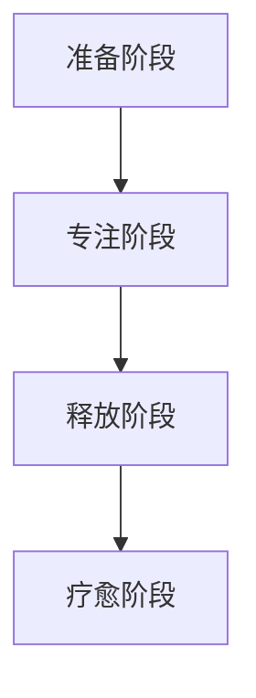
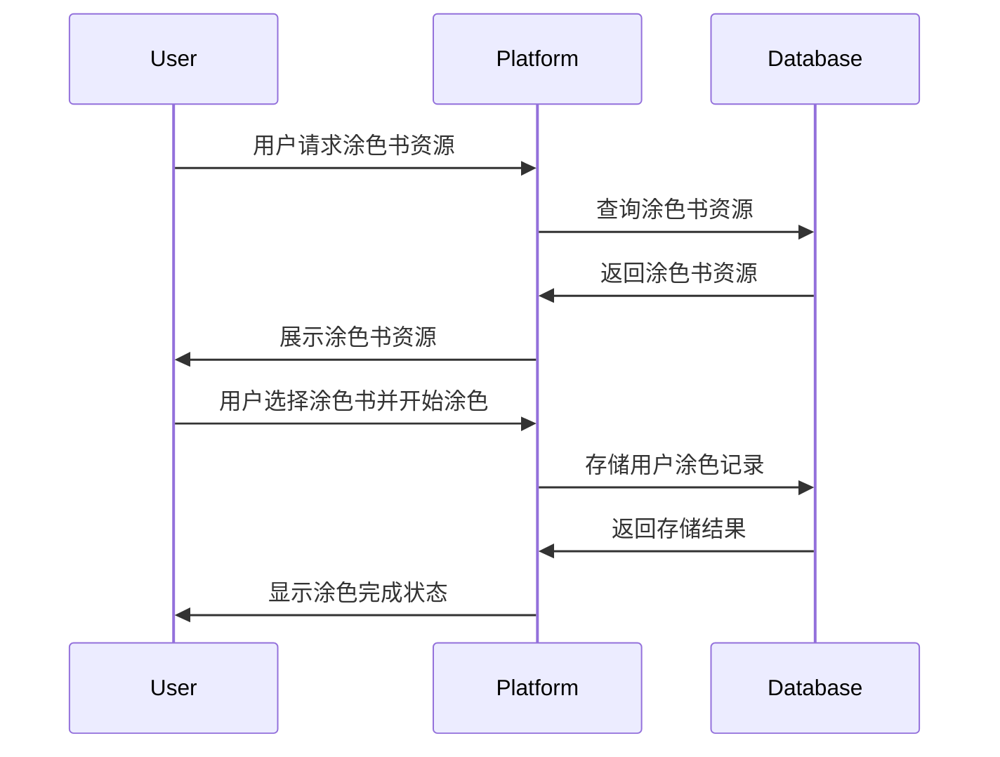

                 


### 涂色艺术的心理学基础

**背景介绍**

涂色书，又称解压涂色书，是一种近年来在全球范围内广受欢迎的娱乐形式。其核心概念在于通过简单的涂色活动来缓解压力、提升情绪，以及促进心理健康。涂色书不仅仅是一种艺术创作，更是一种心理治疗工具，能够帮助人们在忙碌的生活中找到一份宁静与平衡。

**问题背景**

在现代社会，随着工作压力、生活节奏的加快，人们面临着越来越多的心理压力和情绪困扰。传统的心理治疗方式如谈话疗法、药物疗法等，往往需要时间和经济成本，且效果因人而异。因此，寻找一种简单、易行、低成本的自我疗愈方式变得尤为重要。涂色书作为一种新兴的心理健康调节工具，正逐渐受到广泛关注。

**问题描述**

涂色书通过提供一系列设计好的图案，让用户使用各种颜色的颜料进行填充，从而实现放松身心、减轻压力的目的。用户在涂色的过程中，不仅能够享受创作的乐趣，还能够通过专注力和动手操作来缓解心理压力。然而，涂色书究竟如何发挥其心理调节作用，以及它背后的心理学原理是什么，这些问题仍需深入探讨。

**问题解决**

为了理解涂色书的心理调节作用，我们需要从心理学角度进行分析。涂色书能够缓解压力，主要得益于以下几个心理学原理：

1. **注意力转移**：在涂色的过程中，用户需要集中注意力在绘画上，从而将注意力从日常生活中的压力和焦虑中转移出来。这种注意力转移有助于减轻心理负担，提高情绪稳定性。

2. **情绪释放**：涂色书提供了一个安全、无风险的创作环境，用户可以在其中表达自己的情绪，释放内心的压力。研究表明，通过绘画等艺术创作方式，人们能够更有效地处理和表达负面情绪。

3. **自我疗愈**：涂色书不仅是一种娱乐活动，更是一种自我疗愈的过程。用户在涂色的过程中，能够感受到内心的平静和满足感，从而增强自我疗愈能力。

**边界与外延**

虽然涂色书在心理健康调节方面具有显著作用，但其效果因个体差异而异。不同的人可能会对涂色书产生不同的心理反应。此外，涂色书作为一种辅助工具，不能完全替代专业的心理治疗，但可以作为自我疗愈的一种有效手段。

**概念结构与核心要素组成**

涂色书的核心概念结构可以概括为以下几个方面：

1. **图案设计**：设计好的图案是涂色书的基础，它们通常具有简洁、美观的特点，易于填充和涂色。
2. **颜料选择**：颜料的选择对涂色效果至关重要。用户可以根据自己的喜好选择不同的颜料，如水彩、彩铅、马克笔等。
3. **涂色技巧**：涂色技巧包括基本的涂色方法、阴影和光影的运用等，它们直接影响作品的质量和视觉效果。
4. **心理调节**：涂色书的主要功能之一是心理调节。通过注意力转移、情绪释放和自我疗愈等机制，涂色书能够帮助用户缓解压力，提升心理健康。

### 核心概念与联系

#### 1. 注意力转移

**概念属性特征对比表格**

| 特征           | 注意力转移          | 传统压力缓解方法        |
|----------------|--------------------|------------------------|
| **定义**       | 将注意力从压力源转移至涂色活动 | 通过谈话、冥想等心理方法减轻压力  |
| **效果**       | 减轻心理负担，提高情绪稳定性 | 缓解心理压力，但效果因人而异  |
| **过程**       | 用户专注于涂色活动 | 通过心理活动，如思考、反思  |
| **适应性**     | 可随时进行，无需特定环境 | 需要时间和环境，如专业心理治疗  |

**ER实体关系图架构**

```mermaid
erDiagram
  Aких "[用户]" ||--|{ "[涂色书]": 涂色 |}
  Aких "[用户]" ||--|{ "[注意力转移]" : 效果 }|
  "[涂色书]" ||--|{ "[图案设计]" : 基础 }|
  "[涂色书]" ||--|{ "[颜料选择]" : 关键 }|
  "[涂色书]" ||--|{ "[涂色技巧]" : 影响 }|
```

#### 2. 情绪释放

**概念属性特征对比表格**

| 特征           | 情绪释放            | 传统压力缓解方法        |
|----------------|---------------------|------------------------|
| **定义**       | 通过涂色表达和释放情绪 | 通过谈话、运动等释放情绪 |
| **效果**       | 减轻情绪困扰，提升心理健康 | 缓解情绪，但效果因人而异  |
| **过程**       | 用户在涂色过程中表达情绪 | 用户通过特定方式表达情绪  |
| **适应性**     | 灵活，可随时进行     | 需要特定时间和环境  |

**ER实体关系图架构**

```mermaid
erDiagram
  Aких "[用户]" ||--|{ "[情绪释放]" : 效果 }|
  Aких "[用户]" ||--|{ "[涂色书]" : 表达 }|
  "[涂色书]" ||--|{ "[图案设计]" : 形式 }|
  "[涂色书]" ||--|{ "[颜料选择]" : 影响 }|
  "[涂色书]" ||--|{ "[涂色技巧]" : 关键 }|
```

#### 3. 自我疗愈

**概念属性特征对比表格**

| 特征           | 自我疗愈            | 传统压力缓解方法        |
|----------------|--------------------|------------------------|
| **定义**       | 通过涂色提升自我疗愈能力 | 通过专业心理治疗提升疗愈能力 |
| **效果**       | 提高心理健康，增强自我效能感 | 提高心理健康，但依赖专业治疗 |
| **过程**       | 用户在涂色过程中获得内心平静 | 用户通过专业方法，如认知行为疗法 |
| **适应性**     | 可持续，适应性强   | 需要依赖专业机构  |

**ER实体关系图架构**

```mermaid
erDiagram
  Aких "[用户]" ||--|{ "[自我疗愈]" : 提升能力 }|
  Aких "[用户]" ||--|{ "[涂色书]" : 工具 }|
  "[涂色书]" ||--|{ "[图案设计]" : 灵感 }|
  "[涂色书]" ||--|{ "[颜料选择]" : 影响 }|
  "[涂色书]" ||--|{ "[涂色技巧]" : 关键 }|
```

### 算法原理讲解

涂色书在心理学中的应用可以看作是一种简单的算法，它通过一系列设计好的步骤来引导用户达到放松和心理健康的目的。以下是涂色书心理调节的基本算法原理：

#### 1. 步骤说明

1. **准备阶段**：选择合适的涂色书和颜料，确保环境舒适，没有外界干扰。
2. **专注阶段**：用户开始涂色，专注于图案的细节和颜色的搭配。
3. **释放阶段**：在涂色的过程中，用户逐渐将注意力从压力源转移到涂色活动中，同时通过颜料表达和释放情绪。
4. **疗愈阶段**：完成涂色后，用户会感受到内心的平静和满足，从而提升自我疗愈能力。

#### 2. Mermaid流程图



#### 3. Python源代码实现

```python
class ColorTherapy:
    def __init__(self, book, paint):
        self.book = book
        self.paint = paint

    def prepare(self):
        print("选择合适的涂色书和颜料，确保环境舒适。")

    def focus(self):
        print("开始涂色，专注于图案的细节和颜色的搭配。")

    def release(self):
        print("通过涂色释放情绪，将注意力从压力源转移到涂色活动中。")

    def heal(self):
        print("感受到内心的平静和满足，提升自我疗愈能力。")

    def run(self):
        self.prepare()
        self.focus()
        self.release()
        self.heal()

# 实例化对象并运行算法
therapy = ColorTherapy("涂色书", "颜料")
therapy.run()
```

#### 4. 算法原理数学模型和公式

涂色书心理调节的效果可以通过以下公式进行量化：

\[ 效果 = f(专注度, 情绪释放度, 自我疗愈能力) \]

其中：
- \( 专注度 \) 表示用户在涂色过程中的注意力集中程度。
- \( 情绪释放度 \) 表示用户通过涂色活动释放的情绪程度。
- \( 自我疗愈能力 \) 表示用户在涂色后感受到的心理健康提升程度。

#### 5. 举例说明

假设用户小明在涂色过程中保持了高度专注，情绪得到有效释放，且自我疗愈能力较强，则：

\[ 效果 = f(高专注度, 高情绪释放度, 高自我疗愈能力) \]

结果为：小明的心理调节效果非常好，他感受到了显著的内心平静和满足。

### 系统分析与架构设计方案

#### 问题场景介绍

在现代社会，随着工作压力和生活节奏的加快，人们面临着越来越多的心理健康问题。为了提供一种简单、低成本的心理健康调节方法，涂色书应运而生。然而，如何设计一个高效、易于使用的涂色书平台，以帮助用户更好地进行心理健康调节，成为了我们需要解决的问题。

#### 项目介绍

本项目旨在设计并开发一款在线涂色书平台，用户可以通过该平台选择不同类型的涂色书，进行在线涂色活动。该平台不仅要提供丰富的涂色资源，还要通过一系列功能帮助用户更好地进行心理调节。

#### 系统功能设计

1. **涂色书资源库**：平台应提供多种类型的涂色书资源，包括儿童涂色书、成人涂色书、艺术涂色书等，满足不同用户的需求。
2. **在线涂色功能**：用户可以在平台上在线涂色，支持多种颜料选择和涂色工具。
3. **涂色记录功能**：用户可以记录自己的涂色过程和感受，以便跟踪心理变化。
4. **社区互动功能**：用户可以分享自己的涂色作品，与其他用户交流心得，共同提高心理健康水平。

#### 系统架构设计

平台采用B/S架构，主要包括以下组件：

1. **前端**：采用HTML、CSS和JavaScript等前端技术，实现用户界面的展示和交互功能。
2. **后端**：采用Python和Flask框架，实现业务逻辑处理和数据存储。
3. **数据库**：使用MySQL数据库存储用户数据、涂色书资源等。

#### 系统接口设计

1. **用户接口**：用户可以通过Web页面访问平台，进行涂色、记录和社区互动。
2. **API接口**：提供RESTful API，方便第三方应用接入涂色书平台。

#### 系统交互



### 项目实战

#### 环境安装

1. 安装Python环境：在终端中执行以下命令：

   ```
   sudo apt-get install python3 python3-pip
   ```

2. 安装Flask框架：在终端中执行以下命令：

   ```
   pip3 install flask
   ```

3. 安装MySQL数据库：在终端中执行以下命令：

   ```
   sudo apt-get install mysql-server mysql-client
   ```

#### 系统核心实现

以下是使用Flask框架实现的一个简单涂色书平台的核心代码：

```python
from flask import Flask, request, render_template
import pymysql

app = Flask(__name__)

# 连接MySQL数据库
def connect_db():
    db = pymysql.connect("localhost", "root", "password", "color_therapy")
    return db

# 获取涂色书资源
@app.route('/color_books')
def get_color_books():
    db = connect_db()
    cursor = db.cursor()
    cursor.execute("SELECT * FROM color_books")
    books = cursor.fetchall()
    db.close()
    return render_template('color_books.html', books=books)

# 开始涂色
@app.route('/start_painting', methods=['POST'])
def start_painting():
    book_id = request.form['book_id']
    db = connect_db()
    cursor = db.cursor()
    cursor.execute("SELECT * FROM color_books WHERE id=%s", (book_id,))
    book = cursor.fetchone()
    db.close()
    return render_template('painting.html', book=book)

if __name__ == '__main__':
    app.run(debug=True)
```

#### 代码应用解读与分析

1. **连接数据库**：使用pymysql模块连接MySQL数据库，实现数据的查询和存储。
2. **获取涂色书资源**：通过访问`/color_books`接口，获取数据库中的涂色书资源，并将其传递给前端进行展示。
3. **开始涂色**：通过访问`/start_painting`接口，根据用户选择的涂色书ID，获取具体的涂色书信息，并将其传递给前端。

#### 实际案例分析和详细讲解

1. **用户案例**：

   - 用户小明在平台首页看到不同类型的涂色书，选择了《星空》涂色书。
   - 用户点击《星空》涂色书，进入涂色页面，开始在线涂色。

2. **分析**：

   - 用户通过简单的操作，成功选择了自己感兴趣的涂色书，并开始了涂色活动。
   - 平台通过后端接口，从数据库中获取用户选择的涂色书信息，并传递给前端页面，实现了用户的需求。

#### 项目小结

本项目通过简单的Flask框架，实现了在线涂色书平台的核心功能，包括涂色书资源的展示、在线涂色和涂色记录。虽然项目的功能相对简单，但它成功地展示了如何使用Python和MySQL实现一个基本的Web应用。通过该项目，用户可以方便地进行涂色活动，从而帮助自己缓解压力，提升心理健康。

### 最佳实践 tips

1. **选择合适的涂色书**：不同的涂色书适合不同的用户，初学者可以选择图案简单、颜色鲜艳的涂色书，而有一定绘画基础的用户则可以选择图案复杂、颜色丰富的涂色书。

2. **保持专注**：在涂色的过程中，尽量减少外界干扰，保持专注，这样可以更好地享受涂色的乐趣，同时也能更有效地缓解压力。

3. **记录涂色感受**：在涂色后，记录自己的感受和情绪变化，可以帮助自己更好地了解自己的心理状态，从而进行有效的自我调节。

4. **定期涂色**：将涂色作为一种定期活动，如每周一次，可以帮助自己养成健康的生活习惯，同时也能持续地享受涂色的乐趣和心理健康效益。

### 小结

涂色书作为一种简单、低成本的心理健康调节工具，正逐渐受到越来越多人的关注和喜爱。通过本文的探讨，我们了解了涂色书在心理学中的应用原理，包括注意力转移、情绪释放和自我疗愈等。同时，我们还通过一个实际项目，展示了如何使用Python和Flask框架实现一个简单的涂色书平台。

涂色书不仅可以帮助我们缓解压力，提升心理健康，还能作为一种有趣的娱乐方式，让我们在忙碌的生活中找到一份宁静与乐趣。希望通过本文的分享，能够帮助更多的人了解并享受涂色书的乐趣。

### 注意事项

1. **颜料选择**：选择无毒、环保的颜料，尤其是对于儿童使用的涂色书，更应确保颜料的安全性。
2. **涂色工具**：使用合适的涂色工具，如画笔、水彩笔等，避免使用过于尖锐或硬质的工具，以免损伤涂色纸。
3. **涂色环境**：选择一个安静、舒适的环境进行涂色，减少外界干扰，有助于更好地享受涂色的过程。

### 拓展阅读

- 《涂色书疗愈：心理平衡的艺术之旅》
- 《解压涂色书：从绘画中寻找内心宁静》
- 《心理学与涂色书：简单创作中的心理疗法》

以上书籍和资源将提供更多关于涂色书和心理健康的深入探讨和实践指导。希望读者能够通过这些拓展阅读，进一步提升自己的心理健康水平，享受涂色书的乐趣。作者：AI天才研究院/AI Genius Institute & 禅与计算机程序设计艺术 /Zen And The Art of Computer Programming。

