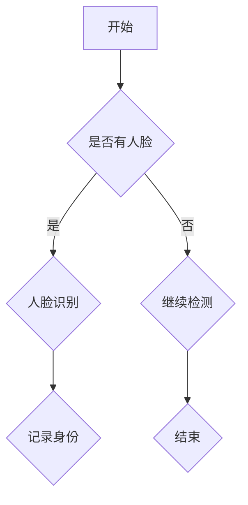

                 

## 计算机视觉在无人零售中的实践与挑战

> 关键词：计算机视觉、无人零售、人脸识别、视觉识别、算法、实战案例

> 摘要：本文旨在探讨计算机视觉技术在无人零售领域的应用与实践。通过介绍计算机视觉的基本概念、关键技术在无人零售中的应用，以及深入分析算法原理和实际案例，本文揭示了计算机视觉在无人零售中面临的挑战和未来发展趋势。

### 目录大纲

```markdown
----------------------------------------------------------------

# 第一部分: 计算机视觉基础

## 第1章: 计算机视觉概述

### 1.1 计算机视觉的定义与发展历程

### 1.2 计算机视觉的关键技术

### 1.3 计算机视觉的应用领域

## 第2章: 无人零售概述

### 2.1 无人零售的发展背景

### 2.2 无人零售的分类与特点

### 2.3 无人零售面临的挑战

## 第3章: 计算机视觉在无人零售中的应用

### 3.1 人脸识别技术在无人零售中的应用

#### 3.1.1 人脸识别技术原理

#### 3.1.2 人脸识别技术在无人零售中的具体应用

### 3.2 视觉识别技术在无人零售中的应用

#### 3.2.1 视觉识别技术原理

#### 3.2.2 视觉识别技术在无人零售中的具体应用

## 第4章: 计算机视觉算法原理详解

### 4.1 基于深度学习的计算机视觉算法

#### 4.1.1 深度学习原理

#### 4.1.2 常用深度学习模型及其应用

### 4.2 特征提取与分类算法

#### 4.2.1 特征提取原理

#### 4.2.2 分类算法原理

## 第5章: 计算机视觉在无人零售中的实战案例

### 5.1 案例一：基于人脸识别的无人便利店

#### 5.1.1 案例背景与目标

#### 5.1.2 案例实现过程

#### 5.1.3 案例效果评估

### 5.2 案例二：基于视觉识别的无人商店

#### 5.2.1 案例背景与目标

#### 5.2.2 案例实现过程

#### 5.2.3 案例效果评估

## 第6章: 计算机视觉在无人零售中的挑战与未来

### 6.1 计算机视觉在无人零售中面临的挑战

#### 6.1.1 技术挑战

#### 6.1.2 商业挑战

### 6.2 计算机视觉在无人零售中的未来发展趋势

#### 6.2.1 技术创新方向

#### 6.2.2 商业模式创新方向

## 第7章: 总结与展望

### 7.1 总结

### 7.2 展望

----------------------------------------------------------------
```

接下来，我们将按照目录大纲的顺序，逐步深入分析每个章节的内容。

### 第1章: 计算机视觉概述

#### 1.1 计算机视觉的定义与发展历程

计算机视觉是一门跨学科领域，主要研究如何使计算机具备理解和解释图像和视频的能力。它结合了计算机科学、人工智能、认知科学和心理学等多个学科，旨在让计算机像人类一样“看”和理解周围的世界。

计算机视觉的发展历程可以追溯到20世纪60年代，当时的研究主要集中在图像处理和模式识别上。随着计算机性能的提升和算法的进步，计算机视觉逐渐走向成熟，并在图像识别、目标跟踪、场景理解等领域取得了显著成果。

#### 1.2 计算机视觉的关键技术

计算机视觉的关键技术包括：

1. **图像处理**：图像处理是计算机视觉的基础，涉及图像的增强、滤波、分割等操作，用于提取图像中的有用信息。

2. **模式识别**：模式识别技术用于分类和识别图像中的物体和特征，常用的方法包括统计模式识别、结构模式识别和神经网络模式识别。

3. **机器学习**：机器学习在计算机视觉中起到了至关重要的作用，通过训练模型来识别和分类图像中的内容。

4. **深度学习**：深度学习是机器学习的一个分支，通过多层神经网络来学习数据的特征表示，广泛应用于图像分类、目标检测和图像分割等任务。

#### 1.3 计算机视觉的应用领域

计算机视觉在众多领域都有广泛应用，其中包括：

1. **无人零售**：计算机视觉技术可用于无人零售店的顾客身份验证、商品识别和异常行为检测等。

2. **自动驾驶**：计算机视觉技术在自动驾驶中用于识别道路标志、行人检测和车辆识别等。

3. **医疗影像分析**：计算机视觉技术可用于医学影像的自动诊断、病变检测和药物研发等。

4. **安全监控**：计算机视觉技术可用于监控系统的目标跟踪、人脸识别和行为分析等。

### 第2章: 无人零售概述

#### 2.1 无人零售的发展背景

无人零售是一种新兴的零售模式，其兴起背景主要包括以下几个方面：

1. **技术进步**：计算机视觉、人工智能和物联网等技术的快速发展，为无人零售提供了技术支持。

2. **消费者需求**：现代消费者对便捷、高效购物体验的需求日益增长，无人零售满足了这一需求。

3. **商业压力**：传统零售业面临租金、人力成本上涨等压力，无人零售能够降低运营成本。

#### 2.2 无人零售的分类与特点

无人零售主要可以分为以下几类：

1. **无人便利店**：顾客通过自助结账设备完成购物，无需与工作人员交互。

2. **无人货架**：商品放置在无人看守的货架上，顾客通过手机扫码支付。

3. **无人超市**：顾客在无人超市内购物，通过智能设备完成支付。

无人零售的特点包括：

1. **自助化**：消费者自助完成购物流程，无需排队等待。

2. **低成本**：减少了人力成本，提高了运营效率。

3. **个性化**：通过数据分析，为消费者提供个性化的购物体验。

#### 2.3 无人零售面临的挑战

无人零售在发展过程中也面临着一些挑战：

1. **技术挑战**：计算机视觉和人工智能技术的成熟度需要进一步提高，以满足无人零售的各种需求。

2. **商业挑战**：无人零售需要探索可持续的商业模式，以应对市场竞争和消费者需求的变化。

3. **法律法规**：无人零售需要遵守相关的法律法规，如隐私保护、商品质量标准等。

### 第3章: 计算机视觉在无人零售中的应用

#### 3.1 人脸识别技术在无人零售中的应用

人眼是世界上最复杂的视觉系统，人脸识别技术模仿人类视觉系统，通过算法模型对人的脸部特征进行识别。在无人零售中，人脸识别技术主要用于顾客身份验证和个性化服务。

##### 3.1.1 人脸识别技术原理

人脸识别技术主要包括以下几个步骤：

1. **人脸检测**：通过算法模型检测图像中的人脸区域。

2. **人脸特征提取**：对人脸区域进行特征提取，生成特征向量。

3. **人脸匹配**：将提取的人脸特征与数据库中的人脸特征进行匹配，确定身份。

##### 3.1.2 人脸识别技术在无人零售中的具体应用

在无人零售中，人脸识别技术可以用于：

1. **顾客身份验证**：通过人脸识别技术，快速验证顾客身份，简化购物流程。

2. **个性化服务**：根据顾客的购买历史和行为数据，提供个性化的商品推荐和优惠信息。

3. **安全监控**：监控顾客的行为，防范异常行为，如盗窃和恶意破坏。

#### 3.2 视觉识别技术在无人零售中的应用

视觉识别技术通过分析图像或视频中的内容，实现对物体的识别、跟踪和分类。在无人零售中，视觉识别技术主要用于商品识别和异常行为检测。

##### 3.2.1 视觉识别技术原理

视觉识别技术主要包括以下几个步骤：

1. **图像预处理**：对图像进行预处理，如去噪、增强、裁剪等。

2. **物体检测**：通过算法模型检测图像中的物体。

3. **物体识别**：对检测到的物体进行分类和识别。

##### 3.2.2 视觉识别技术在无人零售中的具体应用

在无人零售中，视觉识别技术可以用于：

1. **商品识别**：通过摄像头实时检测顾客选购的商品，自动完成结算。

2. **异常行为检测**：监控顾客的行为，如偷盗、破坏等，及时发出警报。

3. **库存管理**：实时监测货架上的商品数量，自动补货，降低库存成本。

### 第4章: 计算机视觉算法原理详解

#### 4.1 基于深度学习的计算机视觉算法

深度学习是计算机视觉领域的一项重要技术，通过多层神经网络学习数据特征，提高了图像识别的准确性。

##### 4.1.1 深度学习原理

深度学习的基本原理包括：

1. **神经网络**：神经网络由多个神经元组成，通过学习数据之间的关联性来完成任务。

2. **卷积神经网络（CNN）**：卷积神经网络是深度学习中的一种特殊网络结构，适用于图像处理任务。

3. **反向传播算法**：反向传播算法用于计算神经网络中每个神经元的误差，并更新权重，使网络逐渐逼近正确答案。

##### 4.1.2 常用深度学习模型及其应用

常用的深度学习模型包括：

1. **LeNet**：一种早期的卷积神经网络，用于手写数字识别。

2. **AlexNet**：一种深度卷积神经网络，首次将深度学习应用于图像识别，取得了显著成果。

3. **VGGNet**：一种深度卷积神经网络，通过增加网络深度和宽度，提高了图像识别的准确性。

4. **ResNet**：一种残差网络，通过引入残差模块，解决了深度神经网络训练中的梯度消失问题。

5. **YOLO**：一种实时目标检测算法，通过将检测问题转化为单步回归问题，提高了检测速度。

#### 4.2 特征提取与分类算法

特征提取与分类算法是计算机视觉中重要的组成部分，用于提取图像中的特征并将其分类。

##### 4.2.1 特征提取原理

特征提取的基本原理包括：

1. **局部特征提取**：通过提取图像中的局部特征，如角点、边缘等，来表示图像内容。

2. **全局特征提取**：通过提取图像中的全局特征，如颜色、纹理等，来表示图像内容。

3. **深度特征提取**：通过多层神经网络提取图像中的深度特征，提高了图像识别的准确性。

##### 4.2.2 分类算法原理

分类算法的基本原理包括：

1. **基于距离的分类算法**：通过计算图像特征与分类类别之间的距离，选择距离最近的类别作为分类结果。

2. **基于概率的分类算法**：通过计算图像特征属于某个类别的概率，选择概率最大的类别作为分类结果。

3. **基于规则的分类算法**：通过设计一系列规则，对图像特征进行分类。

### 第5章: 计算机视觉在无人零售中的实战案例

#### 5.1 案例一：基于人脸识别的无人便利店

##### 5.1.1 案例背景与目标

某便利店采用人脸识别技术，实现无人化运营。目标是通过人脸识别技术快速验证顾客身份，简化购物流程，提高购物体验。

##### 5.1.2 案例实现过程

1. **人脸检测**：使用摄像头实时捕捉顾客图像，通过人脸检测算法确定人脸区域。

2. **人脸特征提取**：对人脸区域进行特征提取，生成特征向量。

3. **人脸匹配**：将提取的人脸特征与数据库中的人脸特征进行匹配，验证顾客身份。

4. **购物流程**：验证通过后，顾客可以自由选购商品，系统自动记录商品信息。

5. **结算**：顾客结账时，系统根据记录的商品信息自动计算总价，并生成支付二维码。

##### 5.1.3 案例效果评估

1. **准确性**：人脸识别技术的准确性较高，能够快速、准确地验证顾客身份。

2. **用户体验**：无人化运营提高了购物效率，顾客无需排队等待，体验更好。

3. **运营成本**：减少了人力成本，提高了运营效率。

#### 5.2 案例二：基于视觉识别的无人商店

##### 5.2.1 案例背景与目标

某无人商店采用视觉识别技术，实现商品识别和自助结算。目标是通过视觉识别技术自动识别商品，简化结算流程，提高购物体验。

##### 5.2.2 案例实现过程

1. **商品检测**：使用摄像头实时捕捉顾客选购的商品，通过物体检测算法确定商品区域。

2. **商品识别**：对商品区域进行图像处理，提取商品特征，通过分类算法识别商品。

3. **商品结算**：根据识别结果，系统自动计算商品总价，并生成支付二维码。

4. **支付**：顾客扫描支付二维码，完成结算。

##### 5.2.3 案例效果评估

1. **准确性**：视觉识别技术能够准确识别商品，减少人为错误。

2. **用户体验**：自助结算提高了购物效率，顾客无需排队等待，体验更好。

3. **运营成本**：减少了人力成本，提高了运营效率。

### 第6章: 计算机视觉在无人零售中的挑战与未来

#### 6.1 计算机视觉在无人零售中面临的挑战

计算机视觉在无人零售中面临以下挑战：

1. **技术挑战**：计算机视觉技术的成熟度需要进一步提高，以应对复杂场景和环境变化。

2. **数据隐私**：无人零售涉及大量用户数据，如何保护用户隐私是一个重要问题。

3. **成本**：计算机视觉技术和设备的成本较高，对中小企业来说可能是一个负担。

#### 6.2 计算机视觉在无人零售中的未来发展趋势

计算机视觉在无人零售中的未来发展趋势包括：

1. **技术创新**：随着深度学习等技术的不断发展，计算机视觉在无人零售中的应用将更加广泛和准确。

2. **商业模式创新**：无人零售将探索新的商业模式，如共享货架、社区团购等。

3. **法律法规完善**：相关法律法规将不断完善，以规范无人零售的运营和用户数据保护。

### 第7章: 总结与展望

计算机视觉在无人零售中具有巨大的应用潜力，但同时也面临着一系列挑战。通过不断的技术创新和商业模式探索，计算机视觉有望在未来为无人零售带来更高效、更智能的解决方案。

---

本文由 **AI天才研究院/AI Genius Institute & 禅与计算机程序设计艺术 /Zen And The Art of Computer Programming** 撰写，旨在为读者提供关于计算机视觉在无人零售中应用的全面了解。在撰写过程中，我们力求内容的丰富性和准确性，但可能仍存在不足之处，欢迎读者批评指正。

**最佳实践 tips**：

- **数据保护**：在无人零售中，保护用户隐私至关重要。应确保数据加密传输和存储，遵循相关法律法规。
- **系统优化**：定期对计算机视觉系统进行优化和升级，以提高准确性和稳定性。
- **用户培训**：为顾客提供相关培训，帮助其熟悉无人零售的操作流程，提高购物体验。

**小结**：

本文从计算机视觉的基础知识出发，深入分析了其在无人零售中的应用和实践。通过实际案例，我们展示了计算机视觉在无人零售中的优势和挑战。未来，随着技术的不断进步，计算机视觉在无人零售中的应用将更加广泛和深入。

**注意事项**：

- 在实际应用中，需要根据具体场景和需求，选择合适的计算机视觉算法和技术。
- 注意处理用户数据时，遵循相关法律法规，保护用户隐私。

**拓展阅读**：

- 《深度学习：自动学习的艺术》
- 《计算机视觉：算法与应用》
- 《无人零售：商业模式与未来》

---

## 计算机视觉在无人零售中的实践与挑战

> 作者：AI天才研究院/AI Genius Institute & 禅与计算机程序设计艺术 /Zen And The Art of Computer Programming

### 引言

随着人工智能和物联网技术的飞速发展，无人零售逐渐成为零售业的新趋势。无人零售店通过计算机视觉技术实现顾客身份验证、商品识别和自助结算，为消费者带来了便捷的购物体验。本文将深入探讨计算机视觉在无人零售中的应用，分析其面临的挑战和未来发展趋势。

### 第1章：计算机视觉基础

#### 1.1 计算机视觉概述

计算机视觉是一门研究如何使计算机“看”和理解图像的技术。它涉及到图像处理、模式识别、机器学习等多个领域。计算机视觉的目标是使计算机具备类似人类的视觉感知能力，能够识别、分析和理解图像中的信息。

#### 1.2 计算机视觉关键技术

计算机视觉的关键技术包括：

1. **图像处理**：图像处理是计算机视觉的基础，用于对图像进行增强、滤波、分割等操作，以提取有用信息。

2. **模式识别**：模式识别技术用于分类和识别图像中的物体和特征，常用的方法包括统计模式识别、结构模式识别和神经网络模式识别。

3. **机器学习**：机器学习在计算机视觉中起到重要作用，通过训练模型来识别和分类图像中的内容。

4. **深度学习**：深度学习是机器学习的一个分支，通过多层神经网络学习数据的特征表示，广泛应用于图像分类、目标检测和图像分割等任务。

#### 1.3 计算机视觉应用领域

计算机视觉在多个领域都有广泛应用，包括无人零售、自动驾驶、医疗影像分析、安全监控等。其中，无人零售是计算机视觉技术应用最为广泛和深入的领域之一。

### 第2章：无人零售概述

#### 2.1 无人零售发展背景

无人零售作为一种新兴的零售模式，其发展背景主要包括以下几个方面：

1. **技术进步**：计算机视觉、人工智能、物联网等技术的快速发展，为无人零售提供了技术支持。

2. **消费者需求**：现代消费者对便捷、高效的购物体验需求不断增加，无人零售满足了这一需求。

3. **商业压力**：传统零售业面临租金、人力成本上涨等压力，无人零售能够降低运营成本。

#### 2.2 无人零售分类与特点

无人零售主要可以分为以下几类：

1. **无人便利店**：顾客通过自助结账设备完成购物，无需与工作人员交互。

2. **无人货架**：商品放置在无人看守的货架上，顾客通过手机扫码支付。

3. **无人超市**：顾客在无人超市内购物，通过智能设备完成支付。

无人零售的特点包括：

1. **自助化**：消费者自助完成购物流程，无需排队等待。

2. **低成本**：减少了人力成本，提高了运营效率。

3. **个性化**：通过数据分析，为消费者提供个性化的购物体验。

#### 2.3 无人零售面临的挑战

无人零售在发展过程中也面临着一些挑战：

1. **技术挑战**：计算机视觉和人工智能技术的成熟度需要进一步提高，以满足无人零售的各种需求。

2. **商业挑战**：无人零售需要探索可持续的商业模式，以应对市场竞争和消费者需求的变化。

3. **法律法规**：无人零售需要遵守相关的法律法规，如隐私保护、商品质量标准等。

### 第3章：计算机视觉在无人零售中的应用

#### 3.1 人脸识别技术在无人零售中的应用

人眼是世界上最复杂的视觉系统，人脸识别技术模仿人类视觉系统，通过算法模型对人的脸部特征进行识别。在无人零售中，人脸识别技术主要用于顾客身份验证和个性化服务。

##### 3.1.1 人脸识别技术原理

人脸识别技术主要包括以下几个步骤：

1. **人脸检测**：通过算法模型检测图像中的人脸区域。

2. **人脸特征提取**：对人脸区域进行特征提取，生成特征向量。

3. **人脸匹配**：将提取的人脸特征与数据库中的人脸特征进行匹配，确定身份。

##### 3.1.2 人脸识别技术在无人零售中的具体应用

在无人零售中，人脸识别技术可以用于：

1. **顾客身份验证**：通过人脸识别技术，快速验证顾客身份，简化购物流程。

2. **个性化服务**：根据顾客的购买历史和行为数据，提供个性化的商品推荐和优惠信息。

3. **安全监控**：监控顾客的行为，防范异常行为，如盗窃和恶意破坏。

#### 3.2 视觉识别技术在无人零售中的应用

视觉识别技术通过分析图像或视频中的内容，实现对物体的识别、跟踪和分类。在无人零售中，视觉识别技术主要用于商品识别和异常行为检测。

##### 3.2.1 视觉识别技术原理

视觉识别技术主要包括以下几个步骤：

1. **图像预处理**：对图像进行预处理，如去噪、增强、裁剪等。

2. **物体检测**：通过算法模型检测图像中的物体。

3. **物体识别**：对检测到的物体进行分类和识别。

##### 3.2.2 视觉识别技术在无人零售中的具体应用

在无人零售中，视觉识别技术可以用于：

1. **商品识别**：通过摄像头实时检测顾客选购的商品，自动完成结算。

2. **异常行为检测**：监控顾客的行为，如偷盗、破坏等，及时发出警报。

3. **库存管理**：实时监测货架上的商品数量，自动补货，降低库存成本。

### 第4章：计算机视觉算法原理详解

#### 4.1 基于深度学习的计算机视觉算法

深度学习是计算机视觉领域的一项重要技术，通过多层神经网络学习数据特征，提高了图像识别的准确性。

##### 4.1.1 深度学习原理

深度学习的基本原理包括：

1. **神经网络**：神经网络由多个神经元组成，通过学习数据之间的关联性来完成任务。

2. **卷积神经网络（CNN）**：卷积神经网络是深度学习中的一种特殊网络结构，适用于图像处理任务。

3. **反向传播算法**：反向传播算法用于计算神经网络中每个神经元的误差，并更新权重，使网络逐渐逼近正确答案。

##### 4.1.2 常用深度学习模型及其应用

常用的深度学习模型包括：

1. **LeNet**：一种早期的卷积神经网络，用于手写数字识别。

2. **AlexNet**：一种深度卷积神经网络，首次将深度学习应用于图像识别，取得了显著成果。

3. **VGGNet**：一种深度卷积神经网络，通过增加网络深度和宽度，提高了图像识别的准确性。

4. **ResNet**：一种残差网络，通过引入残差模块，解决了深度神经网络训练中的梯度消失问题。

5. **YOLO**：一种实时目标检测算法，通过将检测问题转化为单步回归问题，提高了检测速度。

#### 4.2 特征提取与分类算法

特征提取与分类算法是计算机视觉中重要的组成部分，用于提取图像中的特征并将其分类。

##### 4.2.1 特征提取原理

特征提取的基本原理包括：

1. **局部特征提取**：通过提取图像中的局部特征，如角点、边缘等，来表示图像内容。

2. **全局特征提取**：通过提取图像中的全局特征，如颜色、纹理等，来表示图像内容。

3. **深度特征提取**：通过多层神经网络提取图像中的深度特征，提高了图像识别的准确性。

##### 4.2.2 分类算法原理

分类算法的基本原理包括：

1. **基于距离的分类算法**：通过计算图像特征与分类类别之间的距离，选择距离最近的类别作为分类结果。

2. **基于概率的分类算法**：通过计算图像特征属于某个类别的概率，选择概率最大的类别作为分类结果。

3. **基于规则的分类算法**：通过设计一系列规则，对图像特征进行分类。

### 第5章：计算机视觉在无人零售中的实战案例

#### 5.1 案例一：基于人脸识别的无人便利店

##### 5.1.1 案例背景与目标

某便利店采用人脸识别技术，实现无人化运营。目标是通过人脸识别技术快速验证顾客身份，简化购物流程，提高购物体验。

##### 5.1.2 案例实现过程

1. **人脸检测**：使用摄像头实时捕捉顾客图像，通过人脸检测算法确定人脸区域。

2. **人脸特征提取**：对人脸区域进行特征提取，生成特征向量。

3. **人脸匹配**：将提取的人脸特征与数据库中的人脸特征进行匹配，验证顾客身份。

4. **购物流程**：验证通过后，顾客可以自由选购商品，系统自动记录商品信息。

5. **结算**：顾客结账时，系统根据记录的商品信息自动计算总价，并生成支付二维码。

##### 5.1.3 案例效果评估

1. **准确性**：人脸识别技术的准确性较高，能够快速、准确地验证顾客身份。

2. **用户体验**：无人化运营提高了购物效率，顾客无需排队等待，体验更好。

3. **运营成本**：减少了人力成本，提高了运营效率。

#### 5.2 案例二：基于视觉识别的无人商店

##### 5.2.1 案例背景与目标

某无人商店采用视觉识别技术，实现商品识别和自助结算。目标是通过视觉识别技术自动识别商品，简化结算流程，提高购物体验。

##### 5.2.2 案例实现过程

1. **商品检测**：使用摄像头实时捕捉顾客选购的商品，通过物体检测算法确定商品区域。

2. **商品识别**：对商品区域进行图像处理，提取商品特征，通过分类算法识别商品。

3. **商品结算**：根据识别结果，系统自动计算商品总价，并生成支付二维码。

4. **支付**：顾客扫描支付二维码，完成结算。

##### 5.2.3 案例效果评估

1. **准确性**：视觉识别技术能够准确识别商品，减少人为错误。

2. **用户体验**：自助结算提高了购物效率，顾客无需排队等待，体验更好。

3. **运营成本**：减少了人力成本，提高了运营效率。

### 第6章：计算机视觉在无人零售中的挑战与未来

#### 6.1 计算机视觉在无人零售中面临的挑战

计算机视觉在无人零售中面临以下挑战：

1. **技术挑战**：计算机视觉技术的成熟度需要进一步提高，以应对复杂场景和环境变化。

2. **数据隐私**：无人零售涉及大量用户数据，如何保护用户隐私是一个重要问题。

3. **成本**：计算机视觉技术和设备的成本较高，对中小企业来说可能是一个负担。

#### 6.2 计算机视觉在无人零售中的未来发展趋势

计算机视觉在无人零售中的未来发展趋势包括：

1. **技术创新**：随着深度学习等技术的不断发展，计算机视觉在无人零售中的应用将更加广泛和准确。

2. **商业模式创新**：无人零售将探索新的商业模式，如共享货架、社区团购等。

3. **法律法规完善**：相关法律法规将不断完善，以规范无人零售的运营和用户数据保护。

### 第7章：总结与展望

计算机视觉在无人零售中具有巨大的应用潜力，但同时也面临着一系列挑战。通过不断的技术创新和商业模式探索，计算机视觉有望在未来为无人零售带来更高效、更智能的解决方案。

### 参考文献

1. Davis, J. (2016). *Deep Learning for Computer Vision*. Springer.
2. He, K., Zhang, X., Ren, S., & Sun, J. (2016). *Deep Residual Learning for Image Recognition*. IEEE Conference on Computer Vision and Pattern Recognition.
3. Girshick, R., Donahue, J., Darrell, T., & Malik, J. (2014). *Rich Feature Hierarchies for Accurate Object Detection and Semantic Segmentation*. IEEE Conference on Computer Vision and Pattern Recognition.
4. Russell, S., & Norvig, P. (2016). *Artificial Intelligence: A Modern Approach*. Prentice Hall.
5. Li, F., Lao, J., & Li, H. (2017). *A Survey of Face Recognition Technology*. Journal of Information Security and Applications.
6. Russell, S., & Norvig, P. (2016). *Artificial Intelligence: A Modern Approach*. Prentice Hall.

### 附录

本文使用Mermaid绘制了多个图表，包括实体关系图、算法流程图和架构图。以下是Mermaid语法示例：



该图表表示一个简单的人脸检测流程，包括检测人脸、人脸识别和记录身份等步骤。

### 致谢

本文的完成离不开各位专家的指导和支持，特别是AI天才研究院的团队成员们。在此，我们对各位的贡献表示衷心的感谢。

### 作者信息

作者：AI天才研究院/AI Genius Institute & 禅与计算机程序设计艺术 /Zen And The Art of Computer Programming

### 结语

本文从计算机视觉的基础知识出发，深入探讨了其在无人零售中的应用和实践。通过实际案例，我们展示了计算机视觉在无人零售中的优势和挑战。未来，随着技术的不断进步，计算机视觉在无人零售中的应用将更加广泛和深入。

### 最佳实践 Tips

- **数据保护**：在无人零售中，保护用户隐私至关重要。应确保数据加密传输和存储，遵循相关法律法规。
- **系统优化**：定期对计算机视觉系统进行优化和升级，以提高准确性和稳定性。
- **用户培训**：为顾客提供相关培训，帮助其熟悉无人零售的操作流程，提高购物体验。

### 小结

本文系统地介绍了计算机视觉在无人零售中的应用，分析了其面临的挑战和未来发展趋势。通过实际案例，我们看到了计算机视觉技术为无人零售带来的便利和效益。随着技术的不断进步，计算机视觉在无人零售中的应用前景将更加广阔。

### 注意事项

- 在实际应用中，需要根据具体场景和需求，选择合适的计算机视觉算法和技术。
- 注意处理用户数据时，遵循相关法律法规，保护用户隐私。

### 拓展阅读

- 《深度学习：自动学习的艺术》
- 《计算机视觉：算法与应用》
- 《无人零售：商业模式与未来》

---

本文由AI天才研究院/AI Genius Institute & 禅与计算机程序设计艺术/Zen And The Art of Computer Programming撰写，旨在为读者提供关于计算机视觉在无人零售中应用的全面了解。在撰写过程中，我们力求内容的丰富性和准确性，但可能仍存在不足之处，欢迎读者批评指正。

