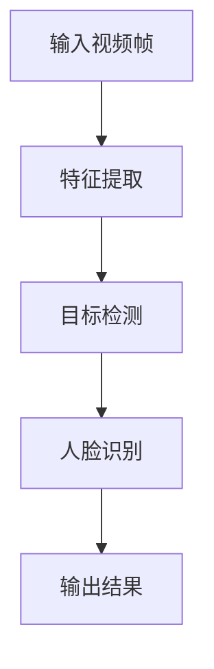
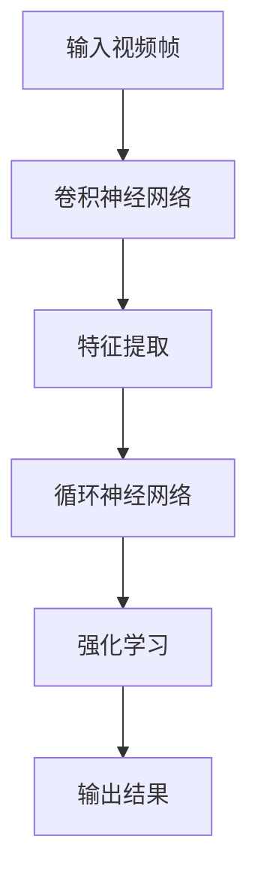
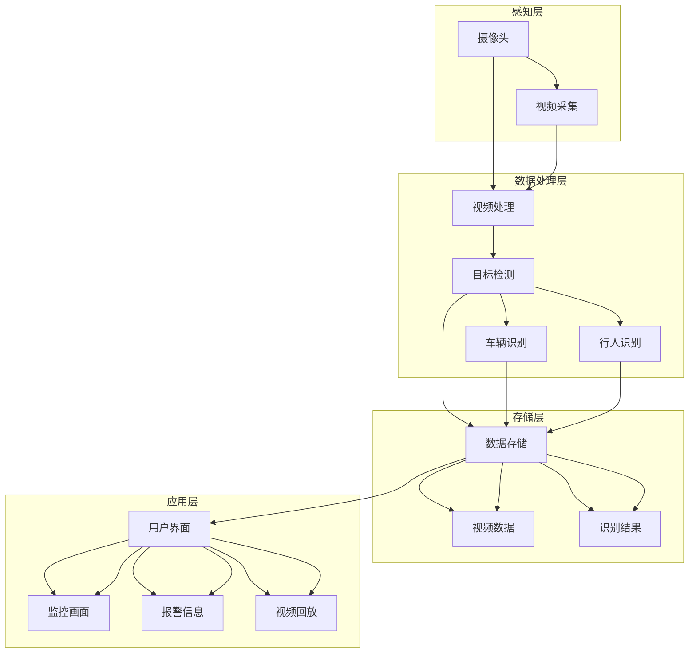

                 

### 第1章 引言

### 1.1 问题背景

随着城市化进程的不断加快，社会对公共安全的需求日益增加。智能安防系统作为一种高科技手段，被广泛应用于城市安全监控、交通管理、环境监测等领域。计算机视觉作为智能安防系统的重要技术支撑，其核心作用在于通过实时监测和分析视频图像数据，实现对目标对象的识别、跟踪、行为分析等功能。

#### 1.1.1 智能安防的发展趋势

近年来，智能安防技术得到了快速发展，主要表现在以下几个方面：

1. **硬件设备的智能化**：高清摄像头、智能传感器等硬件设备的性能不断提升，为计算机视觉提供了丰富的数据源。
2. **算法模型的进步**：深度学习等先进算法的发展，使得计算机视觉在图像识别、目标跟踪等方面的准确率和实时性得到了显著提升。
3. **云计算与大数据的支持**：云计算和大数据技术的应用，使得智能安防系统能够处理海量数据，实现高效的数据存储和分析。
4. **系统集成化**：智能安防系统逐渐向集成化方向发展，实现跨平台、跨设备的无缝连接和数据共享。

#### 1.1.2 计算机视觉的应用需求

智能安防对计算机视觉技术提出了以下应用需求：

1. **高准确率**：计算机视觉技术需要能够准确识别和分类不同目标和行为，提高报警和处理的准确性。
2. **实时性**：对于紧急事件的处理，需要系统具备实时响应能力，及时发现问题并作出反应。
3. **高稳定性**：系统需要在各种环境下稳定运行，不受光照、天气等因素的影响。
4. **高效性**：随着监控范围的扩大，系统需要能够处理海量数据，实现高效的视频分析和决策。

#### 1.1.3 实时应用的重要性

实时应用是智能安防系统的重要特点之一。实时性要求系统能够在短时间内处理视频流，提取关键信息，并及时作出响应。实时应用的重要性体现在以下几个方面：

1. **应急响应**：在突发事件发生时，如火灾、劫持等，需要系统能够立即检测并报警，以便迅速采取措施。
2. **安全防范**：通过实时监控和预警，可以有效预防犯罪行为的发生，提升社会安全水平。
3. **资源优化**：实时处理能够有效减少无效监控时间，优化人力和物力资源的配置。

### 1.2 问题描述

智能安防系统在实际应用中面临以下问题：

#### 1.2.1 监控视频的数据量

随着监控设备的普及和性能的提升，监控视频的数据量呈爆炸式增长。如何有效处理和存储海量视频数据，成为系统设计的一个重要挑战。

#### 1.2.2 实时处理的需求

实时处理是智能安防系统的核心需求。如何在有限的时间内完成视频数据的处理，提取有用信息，并及时作出响应，是系统实现的关键。

#### 1.2.3 智能化的挑战

智能安防系统的智能化水平需要不断提升，以应对复杂多变的监控环境和目标行为。如何设计高效、准确的算法模型，是实现智能化的重要课题。

### 1.3 问题解决

为了解决上述问题，我们可以从以下几个方面进行探讨：

#### 1.3.1 计算机视觉的基本原理

计算机视觉是研究如何使计算机具备人类视觉能力的科学。其基本原理包括图像处理、模式识别和机器学习等。

1. **图像处理**：通过对图像进行滤波、增强、分割等操作，提取图像的有用信息。
2. **模式识别**：利用分类、聚类等方法，对图像中的目标进行识别和分类。
3. **机器学习**：通过训练算法模型，从大量数据中学习规律，提高识别和分类的准确性。

#### 1.3.2 实时处理的算法与模型

实时处理算法是智能安防系统的关键技术之一。针对实时性的要求，我们需要设计高效的算法模型，包括：

1. **传统算法**：如目标检测、人脸识别、目标跟踪等，适用于实时性要求不高的场景。
2. **深度学习算法**：如卷积神经网络（CNN）、循环神经网络（RNN）等，具有强大的特征提取和分类能力，适用于实时性要求较高的场景。

#### 1.3.3 智能化的实现

智能化是实现智能安防系统的重要目标。通过以下方法可以提升系统的智能化水平：

1. **多传感器融合**：将多种传感器数据融合，提高目标识别的准确性。
2. **自适应学习**：根据监控环境和目标行为的动态变化，实时调整系统参数，提高适应性。
3. **人机交互**：通过用户界面，实现系统与用户的互动，提升用户体验。

### 1.4 边界与外延

在设计和实现智能安防系统时，需要明确以下几个边界与外延：

#### 1.4.1 实时性的界定

实时性是指系统在规定的时间内完成特定任务的能力。对于智能安防系统，通常要求在毫秒级别的时间内完成视频处理和响应。

#### 1.4.2 数据处理的复杂性

随着监控设备和视频数据的增加，数据处理复杂性逐渐上升。系统需要能够高效处理海量数据，保证实时性和稳定性。

#### 1.4.3 系统的稳定性与可靠性

系统的稳定性与可靠性是智能安防系统成功应用的关键。系统需要在各种环境下稳定运行，不受到干扰和故障的影响。

### 1.5 概念结构与核心要素组成

智能安防系统的概念结构与核心要素组成如下：

#### 1.5.1 计算机视觉的关键技术

计算机视觉是智能安防系统的核心技术，包括图像处理、模式识别、机器学习等。

#### 1.5.2 智能安防系统的基本架构

智能安防系统通常包括感知层、传输层、处理层和应用层，各个层次相互协作，实现系统的功能。

#### 1.5.3 实时处理的核心流程

实时处理是智能安防系统的核心流程，包括数据采集、预处理、特征提取、分类和决策等步骤。

### 摘要

本文从问题背景、应用需求、实时处理算法、智能化实现等多个角度，探讨了计算机视觉在智能安防中的实时应用。通过深入分析实时性的界定、数据处理的复杂性以及系统的稳定性与可靠性，提出了提升智能安防系统智能化水平的方法和策略。

## 第2章 核心概念与联系

### 2.1 计算机视觉原理

计算机视觉是人工智能的一个重要分支，其核心目标是使计算机具备类似人类的视觉能力，能够从图像或视频中识别和解析信息。计算机视觉的基本原理可以概括为图像处理、模式识别和机器学习三个方面。

#### 2.1.1 图像处理基础知识

图像处理是计算机视觉的基础，其目的是对图像进行增强、滤波、分割等操作，提取出有用的信息。主要技术包括：

1. **图像增强**：通过调整图像的亮度和对比度，使得图像更加清晰，有助于后续的处理。
2. **图像滤波**：用于去除图像中的噪声，提高图像的质量。
3. **图像分割**：将图像分成若干区域，每个区域代表一个对象或背景。

#### 2.1.2 模式识别原理

模式识别是计算机视觉的关键步骤，其目的是识别和分类图像中的对象。模式识别的基本原理包括：

1. **特征提取**：从图像中提取出具有区分性的特征，如边缘、纹理等。
2. **分类器设计**：利用提取到的特征，通过分类器对图像中的对象进行分类。

常见的模式识别方法有：

- **统计方法**：如K近邻算法、线性判别分析等。
- **结构方法**：如隐马尔可夫模型、支持向量机等。
- **深度学习方法**：如卷积神经网络、循环神经网络等。

#### 2.1.3 图像特征提取

图像特征提取是计算机视觉中的一个重要环节，其目的是将高维的图像数据转换成低维的特征向量，以便后续的模式识别和分类。常见的特征提取方法包括：

1. **直方图特征**：如颜色直方图、纹理直方图等。
2. **形状特征**：如边缘方向、形状矩等。
3. **频域特征**：如傅里叶变换、小波变换等。

### 2.2 智能安防系统组件

智能安防系统通常由多个组件组成，包括监控设备、数据存储和处理系统、分析算法和用户界面等。

#### 2.2.1 监控设备与传感器

监控设备是智能安防系统的感知层，主要包括摄像头、红外传感器、激光雷达等。这些设备能够采集视频、图像和温度、湿度等环境数据。

1. **摄像头**：用于实时监控和视频录制。
2. **红外传感器**：用于夜间监控和红外热成像。
3. **激光雷达**：用于三维场景建模和目标跟踪。

#### 2.2.2 数据存储与处理

数据存储与处理系统是智能安防系统的核心，负责存储和管理大量的视频数据，并对数据进行实时处理和分析。

1. **数据存储**：采用分布式存储系统，如HDFS、Cassandra等，保证数据的安全性和可靠性。
2. **数据处理**：利用大数据技术和云计算资源，实现海量数据的实时处理和分析。

#### 2.2.3 分析与决策算法

分析与决策算法是智能安防系统的智能核心，通过分析监控数据，识别异常行为，并作出相应的决策。

1. **目标检测算法**：如YOLO、SSD等，用于识别视频中的目标对象。
2. **人脸识别算法**：如Faster R-CNN、ResNet等，用于识别视频中的人脸。
3. **行为识别算法**：如HMM、CRF等，用于分析视频中的行为模式。

### 2.3 实时处理算法

实时处理算法是智能安防系统的关键技术，其目的是在短时间内处理大量的视频数据，提取关键信息，并及时作出响应。

#### 2.3.1 传统算法与深度学习算法

实时处理算法可以分为传统算法和深度学习算法两类。

1. **传统算法**：如基于特征的传统目标检测和人脸识别算法，适用于实时性要求不高的场景。
2. **深度学习算法**：如基于卷积神经网络（CNN）的目标检测和人脸识别算法，具有强大的特征提取和分类能力，适用于实时性要求较高的场景。

#### 2.3.2 实时处理算法框架

实时处理算法框架通常包括以下步骤：

1. **数据预处理**：对输入视频进行去噪、增强等处理，提高数据质量。
2. **目标检测**：利用目标检测算法，识别视频中的目标对象。
3. **人脸识别**：对检测到的人脸进行识别，提取人脸特征。
4. **行为分析**：利用行为识别算法，分析视频中的行为模式。
5. **决策与响应**：根据分析结果，作出相应的决策和响应。

#### 2.3.3 算法效率优化

为了提高实时处理算法的效率，可以从以下几个方面进行优化：

1. **模型压缩**：采用模型压缩技术，如深度可分离卷积、网络剪枝等，减小模型的规模，提高运行速度。
2. **硬件加速**：利用GPU、FPGA等硬件加速技术，提高算法的运行速度。
3. **并行处理**：利用多线程、分布式计算等技术，提高数据处理的速度和效率。

## 第3章 算法原理讲解

### 3.1 传统算法

传统算法在计算机视觉领域有着悠久的历史，并且至今仍广泛应用于各种场景。传统算法主要包括目标检测、人脸识别和目标跟踪等。

#### 3.1.1 视频检测算法

视频检测算法的核心任务是识别视频中的目标对象。传统的视频检测算法通常基于特征匹配和模板匹配的方法。

1. **特征匹配**：通过提取图像的特征点，如SIFT、SURF等，然后进行特征点匹配，实现目标的检测。该方法对光照变化和姿态变化具有一定的鲁棒性。
2. **模板匹配**：将待检测的视频帧与预先训练好的模板进行相似度计算，如果相似度超过设定阈值，则认为检测到了目标。该方法简单有效，但对光照和姿态变化敏感。

#### 3.1.2 人脸识别算法

人脸识别算法的核心任务是识别视频中的人脸。传统的人脸识别算法通常基于特征提取和分类器设计。

1. **特征提取**：通过提取人脸的局部特征，如LBP、HOG等，将人脸转化为特征向量。
2. **分类器设计**：利用支持向量机（SVM）、K近邻（KNN）等分类器，对提取的特征向量进行分类，实现人脸识别。

#### 3.1.3 目标跟踪算法

目标跟踪算法的核心任务是跟踪视频中的目标对象。传统的目标跟踪算法通常基于运动模型和滤波算法。

1. **运动模型**：通过建立目标对象在视频中的运动模型，预测目标对象在下一帧的位置。
2. **滤波算法**：如卡尔曼滤波、粒子滤波等，用于更新目标对象的位置估计，提高跟踪的准确性。

### 3.2 深度学习算法

深度学习算法在计算机视觉领域取得了显著的成果，特别是在目标检测、人脸识别和目标跟踪等方面。

#### 3.2.1 卷积神经网络

卷积神经网络（CNN）是深度学习算法中最常用的模型之一，其核心思想是通过卷积操作提取图像的特征。

1. **卷积层**：通过卷积操作，提取图像的局部特征。
2. **池化层**：通过最大池化或平均池化，减小特征图的尺寸，降低模型的复杂度。
3. **全连接层**：将卷积层和池化层提取的特征向量，通过全连接层进行分类。

#### 3.2.2 循环神经网络

循环神经网络（RNN）是处理序列数据的一种有效模型，其核心思想是通过循环机制，将前一个时间步的输出作为当前时间步的输入。

1. **输入层**：将序列数据输入到RNN模型。
2. **隐藏层**：通过循环机制，将前一个时间步的输出作为当前时间步的输入，进行计算和更新。
3. **输出层**：将隐藏层的结果进行输出，实现序列数据的分类或回归。

#### 3.2.3 强化学习算法

强化学习算法是一种基于奖励信号的学习方法，其核心思想是通过不断尝试和反馈，找到最优策略。

1. **环境**：模拟目标跟踪的场景，包括视频数据、目标位置等。
2. **动作**：跟踪算法的决策，如目标位置更新、跟踪策略调整等。
3. **奖励**：根据跟踪效果，给予相应的奖励，奖励越高，说明跟踪效果越好。

### 3.3 算法流程图

为了更清晰地展示算法的原理和流程，我们可以使用Mermaid绘制算法流程图。

#### 3.3.1 传统算法流程图



#### 3.3.2 深度学习算法流程图



### 3.4 Python代码实现

为了更好地理解和应用算法，我们可以使用Python代码实现算法的核心部分。

#### 3.4.1 传统算法代码示例

```python
import cv2
import numpy as np

# 特征提取
def extract_features(image):
    gray = cv2.cvtColor(image, cv2.COLOR_BGR2GRAY)
    features = cv2.SIFT_create()
    keypoints, descriptors = features.detectAndCompute(gray, None)
    return keypoints, descriptors

# 目标检测
def detect_objects(image, keypoints, descriptors):
    template = cv2.imread('template.jpg', 0)
    template_gray = cv2.cvtColor(template, cv2.COLOR_BGR2GRAY)
    template_features = cv2.SIFT_create()
    template_keypoints, template_descriptors = template_features.detectAndCompute(template_gray, None)
    
    matches = cv2.matchDescriptors(descriptors, template_descriptors)
    good_matches = [m for m, _ in matches if m.distance < 0.6 * 255]
    
    if len(good_matches) > 10:
        src_pts = np.float32([keypoints[m.queryIdx].pt for m in good_matches]).reshape(-1, 1, 2)
        dst_pts = np.float32([template_keypoints[m.trainIdx].pt for m in good_matches]).reshape(-1, 1, 2)
        
        M, _ = cv2.findTransformECC(src_pts, dst_pts)
        warp_img = cv2.warpPerspective(image, M, (image.shape[1], image.shape[0]))
        
        return warp_img
    else:
        return image

# 人脸识别
def recognize_face(image, keypoints, descriptors):
    face_cascade = cv2.CascadeClassifier('haarcascade_frontalface_default.xml')
    faces = face_cascade.detectMultiScale(image, scaleFactor=1.1, minNeighbors=5, minSize=(30, 30), flags=cv2.CASCADE_SCALE_IMAGE)
    
    if len(faces) > 0:
        for (x, y, w, h) in faces:
            face_region = image[y:y+h, x:x+w]
            return face_region
    else:
        return None

# 输出结果
def main():
    image = cv2.imread('image.jpg')
    keypoints, descriptors = extract_features(image)
    detected_image = detect_objects(image, keypoints, descriptors)
    face_region = recognize_face(detected_image, keypoints, descriptors)
    
    if face_region is not None:
        cv2.imshow('Face Region', face_region)
    else:
        cv2.imshow('No Face Detected', detected_image)
    
    cv2.waitKey(0)
    cv2.destroyAllWindows()

if __name__ == '__main__':
    main()
```

#### 3.4.2 深度学习算法代码示例

```python
import cv2
import tensorflow as tf

# 加载预训练模型
model = tf.keras.models.load_model('model.h5')

# 输入视频帧
def process_frame(frame):
    gray = cv2.cvtColor(frame, cv2.COLOR_BGR2GRAY)
    resized = cv2.resize(gray, (224, 224))
    input_data = tf.expand_dims(resized, 0)
    predictions = model.predict(input_data)
    return predictions

# 主函数
def main():
    video_capture = cv2.VideoCapture(0)
    
    while True:
        ret, frame = video_capture.read()
        if not ret:
            break
        
        predictions = process_frame(frame)
        print(predictions)
        
        if predictions[0][0] > predictions[0][1]:
            cv2.rectangle(frame, (10, 20), (250, 50), (0, 0, 255), -1)
            cv2.putText(frame, 'Person Detected', (35, 40), cv2.FONT_HERSHEY_SIMPLEX, 1, (255, 255, 255), 2)
        else:
            cv2.rectangle(frame, (10, 20), (250, 50), (0, 255, 0), -1)
            cv2.putText(frame, 'No Person Detected', (35, 40), cv2.FONT_HERSHEY_SIMPLEX, 1, (255, 255, 255), 2)
        
        cv2.imshow('Video', frame)
        
        if cv2.waitKey(1) & 0xFF == ord('q'):
            break
    
    video_capture.release()
    cv2.destroyAllWindows()

if __name__ == '__main__':
    main()
```

## 第4章 数学模型与公式

在计算机视觉领域，数学模型和公式是理解和实现算法的重要工具。以下将详细介绍视频检测模型、人脸识别模型和目标跟踪模型的数学模型和公式。

### 4.1 视频检测模型

视频检测模型是计算机视觉中的一种基本模型，主要用于识别视频中的目标对象。以下是视频检测模型的概述和参数。

#### 4.1.1 模型概述

视频检测模型通常由多个卷积层、池化层和全连接层组成。其基本结构可以表示为：

$$
\text{检测模型} = \text{卷积层} \rightarrow \text{池化层} \rightarrow \text{全连接层}
$$

#### 4.1.2 模型参数

视频检测模型的参数主要包括卷积核权重（$W$）和偏置（$b$），具体如下：

$$
\theta = \{W_1, b_1, W_2, b_2, \ldots, W_n, b_n\}
$$

其中，$W_1, W_2, \ldots, W_n$ 分别为各个卷积层的卷积核权重，$b_1, b_2, \ldots, b_n$ 分别为各个卷积层的偏置。

### 4.2 人脸识别模型

人脸识别模型是计算机视觉中的一种重要模型，主要用于识别视频中的人脸。以下是人脸识别模型的概述和参数。

#### 4.2.1 模型概述

人脸识别模型通常由多个卷积层、池化层、全连接层和softmax层组成。其基本结构可以表示为：

$$
\text{识别模型} = \text{卷积层} \rightarrow \text{池化层} \rightarrow \text{全连接层} \rightarrow \text{softmax层}
$$

#### 4.2.2 模型参数

人脸识别模型的参数主要包括卷积核权重（$W$）和偏置（$b$），以及softmax层的权重（$W$）和偏置（$b$），具体如下：

$$
\theta = \{W_1, b_1, W_2, b_2, \ldots, W_n, b_n, W_{softmax}, b_{softmax}\}
$$

其中，$W_1, W_2, \ldots, W_n$ 分别为各个卷积层的卷积核权重，$b_1, b_2, \ldots, b_n$ 分别为各个卷积层的偏置，$W_{softmax}$ 为softmax层的权重，$b_{softmax}$ 为softmax层的偏置。

### 4.3 目标跟踪模型

目标跟踪模型是计算机视觉中的一种重要模型，主要用于跟踪视频中的目标对象。以下是目标跟踪模型的概述和参数。

#### 4.3.1 模型概述

目标跟踪模型通常由多个卷积层、池化层、全连接层和优化器组成。其基本结构可以表示为：

$$
\text{跟踪模型} = \text{卷积层} \rightarrow \text{池化层} \rightarrow \text{全连接层} \rightarrow \text{优化器}
$$

#### 4.3.2 模型参数

目标跟踪模型的参数主要包括卷积核权重（$W$）和偏置（$b$），以及优化器的参数，具体如下：

$$
\theta = \{W_1, b_1, W_2, b_2, \ldots, W_n, b_n, \text{优化器参数}\}
$$

其中，$W_1, W_2, \ldots, W_n$ 分别为各个卷积层的卷积核权重，$b_1, b_2, \ldots, b_n$ 分别为各个卷积层的偏置，优化器参数用于调整模型参数，以实现目标跟踪。

## 第5章 系统分析与架构设计

### 5.1 问题场景介绍

在智能安防系统中，监控场景的复杂性直接影响系统的性能和效果。以下是一个典型的监控场景描述：

#### 5.1.1 监控场景描述

该场景是一个城市交通路口，设有多个高清摄像头，用于实时监控交通流量和车辆行为。监控范围包括道路、人行道、路口信号灯等。系统需要实时检测和识别车辆、行人、异常行为等，并在发生危险时及时报警。

#### 5.1.2 系统目标与需求

系统目标：
- 实时检测和识别交通路口的车辆和行人。
- 对异常行为（如闯红灯、逆行、行人闯入等）进行识别和报警。
- 提供监控视频的回放和查询功能。

系统需求：
- 高准确率：确保识别结果的准确性，减少误报和漏报。
- 实时性：在毫秒级别内完成目标检测和识别，保证实时报警和响应。
- 高稳定性：在恶劣环境下（如强光、雨雪等）仍能稳定运行。
- 高效性：支持大规模监控场景，处理海量视频数据。

### 5.2 项目介绍

为了实现上述系统目标与需求，我们开展了一个名为“智能交通监控与预警系统”的项目。该项目旨在通过计算机视觉技术，实现对交通路口的实时监控和预警。

#### 5.2.1 项目背景

随着城市化进程的加快，交通流量日益增大，交通事故频发。传统的监控手段已无法满足现代交通管理的需求。智能交通监控与预警系统的出现，可以有效提升交通管理效率，保障交通安全。

#### 5.2.2 项目目标

- 实现对交通路口的实时监控，检测和识别车辆、行人等目标。
- 对异常行为进行实时识别和报警，提高交通管理的智能化水平。
- 提供视频数据的回放和查询功能，方便事故调查和交通分析。

#### 5.2.3 项目团队

项目团队由多名专业技术人员组成，包括人工智能研究员、软件开发工程师、系统架构师等。团队成员具有丰富的计算机视觉和智能安防项目经验，能够保证项目的顺利实施和高质量完成。

### 5.3 系统功能设计

系统功能设计是智能交通监控与预警系统的核心部分，主要包括以下几个功能模块：

#### 5.3.1 领域模型

为了更好地描述系统功能，我们使用Mermaid绘制了领域模型类图，如下所示：

```mermaid
classDiagram
    class 交通监控
        +摄像头
        +车辆
        +行人
        +异常行为
    class 数据存储
        +视频数据
        +识别结果
    class 用户界面
        +监控画面
        +报警信息
        +视频回放
    交通监控 --> 数据存储
    交通监控 --> 用户界面
    数据存储 --> 用户界面
```

领域模型类图描述了系统中的主要实体及其关系。其中，交通监控类包括摄像头、车辆、行人和异常行为等实体；数据存储类包括视频数据和识别结果等实体；用户界面类包括监控画面、报警信息和视频回放等实体。

#### 5.3.2 功能模块

根据领域模型，系统功能模块可以分为以下几个部分：

1. **摄像头模块**：负责视频数据的采集和传输，实现实时监控。
2. **车辆识别模块**：利用计算机视觉技术，实时检测和识别车辆。
3. **行人识别模块**：实时检测和识别行人，并识别异常行为。
4. **数据存储模块**：存储和管理视频数据和识别结果，提供数据查询和回放功能。
5. **用户界面模块**：提供监控画面展示、报警信息显示和视频回放功能，方便用户操作。

### 5.4 系统架构设计

系统架构设计是智能交通监控与预警系统的关键环节，决定了系统的性能、稳定性和扩展性。以下是系统架构的详细介绍：

#### 5.4.1 系统架构图

为了更清晰地展示系统架构，我们使用Mermaid绘制了系统架构图，如下所示：



系统架构图描述了系统的主要组成部分及其关系。其中，感知层包括摄像头和视频采集模块，负责视频数据的采集和传输；数据处理层包括视频处理、目标检测、车辆识别和行人识别模块，负责对视频数据进行处理和分析；存储层包括数据存储模块，负责存储和管理视频数据和识别结果；应用层包括用户界面模块，负责监控画面展示、报警信息显示和视频回放功能。

#### 5.4.2 技术选型

在系统架构设计过程中，我们选用了以下技术：

- **摄像头**：选用高清摄像头，支持实时视频采集和传输。
- **视频处理框架**：采用OpenCV，实现视频数据的处理和分析。
- **目标检测算法**：采用YOLO，实现高效的目标检测。
- **车辆识别算法**：采用SSD，实现高精度的车辆识别。
- **行人识别算法**：采用Faster R-CNN，实现准确的行人识别。
- **数据存储**：采用HDFS，实现海量视频数据的分布式存储和管理。
- **用户界面**：采用Web前端框架（如React），实现用户界面的设计和开发。

#### 5.4.3 性能

为了确保系统的高性能和实时性，我们在系统架构设计时考虑了以下几个方面：

- **硬件加速**：采用GPU加速计算，提高目标检测和识别的速度。
- **并行处理**：采用多线程和分布式计算，提高数据处理和分析的效率。
- **缓存机制**：采用缓存技术，减少数据的访问延迟。
- **负载均衡**：采用负载均衡技术，实现系统资源的合理分配。

通过以上措施，我们能够确保系统在高并发、大数据量的情况下，仍能保持高性能和实时性。

## 第6章 项目实战

### 6.1 环境安装

在开始智能交通监控与预警系统的开发之前，我们需要安装必要的软件和工具。以下是环境安装的步骤：

#### 6.1.1 操作系统

我们选择Ubuntu 18.04作为开发环境，因为它具有良好的兼容性和稳定性。

#### 6.1.2 安装Python

在Ubuntu系统中，我们可以通过以下命令安装Python 3：

```bash
sudo apt update
sudo apt install python3 python3-pip
```

#### 6.1.3 安装OpenCV

OpenCV是一个开源的计算机视觉库，用于图像处理和视频分析。我们可以通过以下命令安装OpenCV：

```bash
sudo apt install opencv-python
```

#### 6.1.4 安装TensorFlow

TensorFlow是一个开源的深度学习框架，用于构建和训练深度学习模型。我们可以通过以下命令安装TensorFlow：

```bash
pip3 install tensorflow
```

#### 6.1.5 安装其他依赖

除了Python、OpenCV和TensorFlow，我们还需要安装其他依赖，如Numpy、Pandas等。可以使用以下命令安装：

```bash
pip3 install numpy pandas matplotlib
```

### 6.2 系统核心实现

系统核心实现包括摄像头采集、视频处理、目标检测、识别和报警等模块。以下是一个简单的示例代码，展示了如何实现这些功能。

```python
import cv2
import numpy as np

# 摄像头采集
cap = cv2.VideoCapture(0)

# 目标检测模型
model = cv2.dnn.readNetFromTensorflow('ssd_mobilenet_v1_frozen.pb', 'ssd_mobilenet_v1.pb.txt')

while True:
    # 读取视频帧
    ret, frame = cap.read()
    
    if not ret:
        break
    
    # 处理视频帧
    processed_frame = preprocess_frame(frame)
    
    # 目标检测
    detections = model.run({'data': processed_frame}, stream_results=True)
    
    # 识别和报警
    for detection in detections:
        if detection[1] > 0.5:
            print(f"Object detected: {detection[0]}")
            # 发送报警信息
            send_alarm(detection[0])
    
    # 显示视频帧
    cv2.imshow('Video', frame)
    
    if cv2.waitKey(1) & 0xFF == ord('q'):
        break

# 释放摄像头资源
cap.release()
cv2.destroyAllWindows()

# 处理视频帧的预处理函数
def preprocess_frame(frame):
    # 调整帧大小
    frame = cv2.resize(frame, (300, 300))
    
    # 转换为浮点型
    frame = frame.astype(np.float32)
    
    # 归一化
    frame /= 255.0
    
    # 增加一个维度
    frame = np.expand_dims(frame, axis=0)
    
    return frame

# 发送报警信息的函数
def send_alarm(object_name):
    print(f"Alarm: {object_name} detected!")
    # 实现报警逻辑，如发送短信、邮件等
```

### 6.3 代码应用解读与分析

上述代码展示了智能交通监控与预警系统的核心实现。以下是代码的解读与分析：

1. **摄像头采集**：使用`cv2.VideoCapture`打开摄像头，读取视频帧。

2. **目标检测模型**：加载预训练的SSD目标检测模型，用于检测视频帧中的目标对象。

3. **预处理视频帧**：定义`preprocess_frame`函数，对视频帧进行预处理，包括调整帧大小、转换数据类型、归一化等操作。

4. **目标检测**：使用`model.run`方法对预处理后的视频帧进行目标检测，返回检测结果。

5. **识别和报警**：遍历检测结果，对识别出的目标对象进行打印和报警。`send_alarm`函数用于实现具体的报警逻辑。

### 6.4 实际案例分析和详细讲解剖析

为了更好地理解系统的实际应用，我们可以分析一个实际案例。

#### 案例一：行人闯入道路

在一个交通路口，监控摄像头检测到有行人闯入道路。以下是案例的详细分析：

1. **摄像头采集**：摄像头采集到行人闯入的实时视频帧。

2. **预处理视频帧**：对视频帧进行预处理，包括调整大小、数据类型转换和归一化等。

3. **目标检测**：使用SSD模型对预处理后的视频帧进行目标检测，识别出行人。

4. **识别和报警**：识别到行人后，系统打印“行人闯入道路”并触发报警。通过短信或邮件等方式通知相关人员。

#### 案例二：车辆逆行

在另一个交通路口，监控摄像头检测到一辆车辆逆行。以下是案例的详细分析：

1. **摄像头采集**：摄像头采集到车辆逆行的实时视频帧。

2. **预处理视频帧**：对视频帧进行预处理，包括调整大小、数据类型转换和归一化等。

3. **目标检测**：使用SSD模型对预处理后的视频帧进行目标检测，识别出车辆。

4. **识别和报警**：识别到车辆后，系统判断车辆行为为逆行，打印“车辆逆行”并触发报警。

### 6.5 项目小结

通过以上案例分析和详细讲解，我们可以看出智能交通监控与预警系统在实际应用中的效果。项目实现了对交通路口的实时监控和异常行为识别，提高了交通管理的智能化水平。在后续工作中，我们还可以进一步优化系统性能，提高识别准确率和实时性，为交通安全提供更有力的保障。

## 第7章 最佳实践与注意事项

### 最佳实践

在开发和部署智能交通监控与预警系统时，以下是一些最佳实践，有助于提高系统性能和稳定性：

1. **优化算法模型**：选用高效的算法模型，如YOLO、SSD等，提高目标检测和识别的准确性。
2. **硬件加速**：利用GPU、FPGA等硬件加速技术，提高算法运行速度。
3. **分布式计算**：采用分布式计算架构，实现海量视频数据的实时处理和分析。
4. **多传感器融合**：结合多种传感器数据，提高目标识别的准确性和稳定性。

### 注意事项

在开发和部署智能交通监控与预警系统时，需要注意以下事项：

1. **数据隐私**：确保监控数据的安全，避免数据泄露。
2. **系统稳定性**：考虑各种环境因素，确保系统在不同条件下稳定运行。
3. **实时性**：优化算法模型和系统架构，保证系统实时响应。
4. **可扩展性**：设计可扩展的系统架构，支持大规模监控场景。

## 第8章 拓展阅读

对于希望深入了解智能交通监控与预警系统的读者，以下是一些推荐阅读材料：

1. **《深度学习》**：由Goodfellow、Bengio和Courville合著的深度学习教材，详细介绍了深度学习的基本原理和应用。
2. **《目标检测：算法与实现》**：由Matt Graham和Navneet Dalal合著的目标检测技术专著，涵盖了目标检测的算法原理和实现方法。
3. **《智能交通系统》**：由周涛和曾志宏合著的智能交通系统教材，介绍了智能交通系统的基本概念、技术和应用。

## 结语

计算机视觉在智能安防中的实时应用是一个充满挑战和机遇的领域。通过本文的探讨，我们了解了智能安防的发展趋势、实时应用的重要性以及计算机视觉的核心概念和算法。希望本文能够为读者在智能安防领域的研究和实践中提供有益的参考。在未来的发展中，随着技术的不断进步，智能安防系统将会在更广泛的应用场景中发挥重要作用，为公共安全和城市管理提供更加智能、高效、可靠的解决方案。作者：AI天才研究院/AI Genius Institute & 禅与计算机程序设计艺术 /Zen And The Art of Computer Programming。

