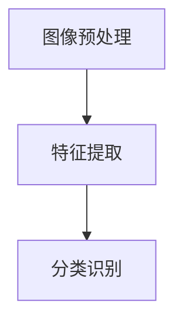
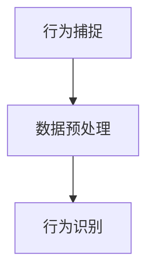
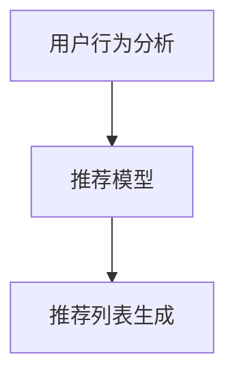
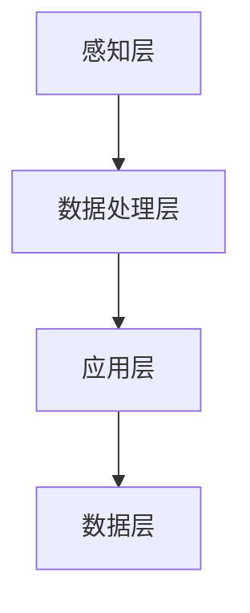
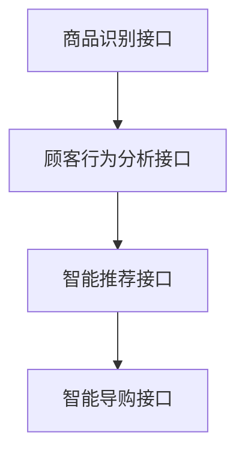
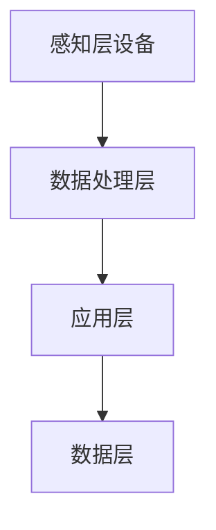

                 


## 计算机视觉在智能零售中的应用趋势

随着人工智能技术的迅猛发展，计算机视觉技术逐渐成为智能零售领域的重要支撑。智能零售不仅能够提升零售企业的运营效率，还能够大幅提高消费者的购物体验。本文将深入探讨计算机视觉在智能零售中的应用趋势，分析其在商品识别、顾客行为分析、智能推荐等方面的应用案例，介绍相关技术和算法，为零售企业提供实际可行的解决方案。

### 1. 背景

#### 1.1 问题背景

智能零售是零售业发展的必然趋势，它利用大数据、人工智能等先进技术，实现了从传统的商品买卖模式向以消费者为中心的服务模式的转变。计算机视觉作为人工智能的一个重要分支，其在智能零售中的应用主要集中在以下几个方面：

- **商品识别**：通过图像识别技术，自动识别商品种类和品牌，提高结账效率。
- **顾客行为分析**：通过摄像头等设备捕捉顾客在购物过程中的行为数据，分析消费者的购物偏好。
- **智能推荐**：基于顾客行为和偏好数据，为顾客提供个性化的商品推荐。
- **智能导购**：利用计算机视觉技术，为顾客提供智能化的购物指导和咨询服务。

#### 1.2 问题描述

如何有效地将计算机视觉技术应用于智能零售，实现商业价值的最大化，是当前研究的热点。本文将围绕这一核心问题，深入分析计算机视觉在智能零售中的应用趋势，探讨其在实际业务中的实现方法和挑战。

#### 1.3 问题解决

本文将通过以下几个方面来解决问题：

- **介绍计算机视觉技术的基本原理和应用场景**：帮助读者理解计算机视觉的基础知识和其在智能零售中的具体应用。
- **分析计算机视觉在智能零售中的应用案例**：通过实际案例，展示计算机视觉技术在零售业务中的成功应用。
- **探讨计算机视觉技术在智能零售中的挑战和解决方案**：分析计算机视觉技术在智能零售中面临的问题，并提出相应的解决方案。

#### 1.4 边界与外延

本文主要关注计算机视觉在智能零售中的应用，不包括其他人工智能技术在零售领域的应用。同时，本文将侧重于技术应用和案例分析，而非深入探讨计算机视觉的基础理论和算法细节。

#### 1.5 概念结构与核心要素组成

- **计算机视觉**：一种通过计算机模拟人类视觉系统感知和理解图像的技术。
- **智能零售**：利用人工智能技术提升零售业务效率和消费者体验的零售模式。
- **应用场景**：包括商品识别、顾客行为分析、智能推荐等。
- **关键技术**：如深度学习、图像处理、目标检测等。
- **实际案例**：介绍国内外成功应用计算机视觉技术的零售企业案例。

### 2. 核心概念与联系

#### 2.1 计算机视觉的概念与原理

计算机视觉是人工智能的一个重要分支，其目标是使计算机能够像人类一样通过视觉感知和理解环境。计算机视觉的基本原理包括图像获取、图像处理、目标检测、图像识别和图像理解等步骤。

- **图像获取**：使用相机等设备捕捉图像。
- **图像处理**：对图像进行增强、滤波、分割等操作，以提取有用的信息。
- **目标检测**：识别图像中的目标物体，并定位其位置。
- **图像识别**：对图像中的目标物体进行分类和识别。
- **图像理解**：理解图像中的内容，进行语义分析和解释。

#### 2.2 智能零售的概念与特点

智能零售是零售业的一种新模式，通过人工智能技术提升业务效率和消费者体验。智能零售的特点包括：

- **个性化推荐**：根据消费者的购物习惯和偏好，推荐合适的商品。
- **智能分析**：利用数据挖掘和分析技术，洞察消费者行为和市场趋势。
- **智能导购**：通过计算机视觉技术，为顾客提供智能化的购物指导和咨询服务。
- **智能库存管理**：实时监控库存状态，优化库存管理，减少库存成本。

#### 2.3 计算机视觉与智能零售的关系

计算机视觉技术是智能零售的重要组成部分，其在智能零售中的应用包括：

- **商品识别**：通过计算机视觉技术，快速、准确地识别商品，提高结账效率。
- **顾客行为分析**：捕捉顾客的购物行为，分析其偏好，为个性化推荐提供依据。
- **智能推荐**：根据顾客的行为和偏好，智能推荐商品，提高销售额。
- **智能导购**：通过计算机视觉技术，为顾客提供智能化的购物指导和咨询服务。

#### 2.4 概念属性特征对比表格

| 概念        | 定义                                                     | 特点                                                     |
| ----------- | -------------------------------------------------------- | -------------------------------------------------------- |
| 计算机视觉  | 使计算机模拟人类视觉系统感知和理解图像的技术           | 高精度、实时性强、适应性强                             |
| 智能零售    | 利用人工智能技术提升零售业务效率和消费者体验的零售模式 | 个性化、智能化、数据分析强                             |
| 商品识别    | 利用计算机视觉技术快速、准确地识别商品                 | 准确、快速、减少人工干预                      |

#### 2.5 概念与联系

通过上面的分析，我们可以看到计算机视觉和智能零售之间存在着紧密的联系。计算机视觉技术为智能零售提供了强大的数据支持和技术保障，使得零售企业能够更精准地捕捉消费者行为，提供个性化的服务，从而提升销售业绩。同时，智能零售的发展也为计算机视觉技术提供了广阔的应用场景，推动了计算机视觉技术的不断创新和发展。

### 3. 算法原理讲解

为了更好地理解计算机视觉在智能零售中的应用，我们需要深入探讨一些关键的算法原理。以下是一些核心算法及其工作流程。

#### 3.1 商品识别算法

商品识别是计算机视觉在智能零售中应用的一个重要方面。其主要工作是通过图像识别技术，快速、准确地识别商品种类和品牌。

**算法原理**：

- **图像预处理**：首先对图像进行预处理，包括去除噪声、调整亮度、对比度等，以提高图像质量。
- **特征提取**：使用卷积神经网络（CNN）等深度学习模型提取图像特征。
- **分类识别**：将提取的特征输入到分类器中，进行商品分类识别。

**数学模型**：

$$
特征提取： f(x) = \sigma(W \cdot x + b)
$$

其中，$x$ 是输入图像，$W$ 是权重矩阵，$b$ 是偏置项，$\sigma$ 是激活函数。

**流程图**：



**代码示例**：

```python
import tensorflow as tf

# 定义卷积神经网络模型
model = tf.keras.Sequential([
    tf.keras.layers.Conv2D(32, (3, 3), activation='relu', input_shape=(28, 28, 1)),
    tf.keras.layers.MaxPooling2D((2, 2)),
    tf.keras.layers.Flatten(),
    tf.keras.layers.Dense(128, activation='relu'),
    tf.keras.layers.Dense(10, activation='softmax')
])

# 编译模型
model.compile(optimizer='adam', loss='categorical_crossentropy', metrics=['accuracy'])

# 训练模型
model.fit(x_train, y_train, epochs=5)
```

#### 3.2 顾客行为分析算法

顾客行为分析是计算机视觉在智能零售中的另一个重要应用。其主要目标是捕捉顾客在购物过程中的行为数据，分析消费者的购物偏好。

**算法原理**：

- **行为捕捉**：使用摄像头等设备捕捉顾客的行为数据。
- **数据预处理**：对捕捉到的行为数据进行预处理，包括去噪、滤波等。
- **行为识别**：使用深度学习模型对处理后的行为数据进行分类识别。

**数学模型**：

$$
行为识别： f(x) = \sigma(W \cdot x + b)
$$

其中，$x$ 是输入行为数据，$W$ 是权重矩阵，$b$ 是偏置项，$\sigma$ 是激活函数。

**流程图**：



**代码示例**：

```python
import tensorflow as tf

# 定义卷积神经网络模型
model = tf.keras.Sequential([
    tf.keras.layers.Conv2D(32, (3, 3), activation='relu', input_shape=(64, 64, 1)),
    tf.keras.layers.MaxPooling2D((2, 2)),
    tf.keras.layers.Flatten(),
    tf.keras.layers.Dense(128, activation='relu'),
    tf.keras.layers.Dense(10, activation='softmax')
])

# 编译模型
model.compile(optimizer='adam', loss='categorical_crossentropy', metrics=['accuracy'])

# 训练模型
model.fit(x_train, y_train, epochs=5)
```

#### 3.3 智能推荐算法

智能推荐是计算机视觉在智能零售中的另一个关键应用。其主要目标是基于顾客的行为和偏好数据，为顾客提供个性化的商品推荐。

**算法原理**：

- **用户行为分析**：分析顾客的购物行为，提取关键特征。
- **推荐模型**：使用协同过滤、基于内容的推荐等算法，生成推荐列表。

**数学模型**：

$$
推荐模型： R(u, i) = f(U, I)
$$

其中，$R$ 是推荐列表，$U$ 是用户特征矩阵，$I$ 是商品特征矩阵，$f$ 是推荐函数。

**流程图**：



**代码示例**：

```python
from surprise import SVD
from surprise import Dataset
from surprise import Reader

# 加载数据集
data = Dataset.load_from_df(pd.read_csv('ratings.csv'), Reader(rating_scale=(1, 5)))

# 使用 SVD 算法建模
svd = SVD()

# 训练模型
svd.fit(data.build_full_trainset())

# 预测评分
predictions = svd.test(data.build_testset())

# 输出推荐列表
for user, pred in predictions:
    print(f"用户 {user}: 推荐商品 {pred.item}，评分 {pred.est}")
```

通过以上算法原理的讲解，我们可以看到计算机视觉在智能零售中的应用是如何实现的。这些算法不仅提高了零售企业的运营效率，也为消费者提供了更加个性化的服务。

### 4. 系统分析与架构设计方案

#### 4.1 问题场景介绍

在智能零售场景中，零售企业面临着以下挑战：

- **商品识别效率低**：传统的人工识别商品方法效率低下，难以满足快速结账的需求。
- **顾客行为分析不足**：对顾客购物行为数据的分析不足，难以提供个性化的推荐和服务。
- **库存管理困难**：库存管理难度大，容易出现库存过剩或不足的情况。

为了解决这些问题，我们设计了一套基于计算机视觉的智能零售系统，旨在提高零售企业的运营效率和消费者体验。

#### 4.2 项目介绍

项目名称：智能零售系统（Smart Retail System）

项目目标：通过计算机视觉技术，实现商品识别、顾客行为分析和智能推荐等功能，提高零售企业的运营效率和消费者满意度。

项目功能：

- **商品识别**：快速准确地识别商品种类和品牌。
- **顾客行为分析**：捕捉顾客的购物行为，分析其偏好。
- **智能推荐**：根据顾客的行为和偏好，为顾客提供个性化的商品推荐。
- **智能导购**：为顾客提供智能化的购物指导和咨询服务。

#### 4.3 系统功能设计

系统功能设计主要包括以下模块：

- **商品识别模块**：使用深度学习模型，对摄像头捕捉到的商品图像进行识别。
- **顾客行为分析模块**：使用图像处理技术和深度学习模型，分析顾客的购物行为。
- **智能推荐模块**：基于顾客的行为数据和商品信息，使用推荐算法生成个性化推荐列表。
- **智能导购模块**：根据顾客的需求和偏好，提供智能化的购物指导和咨询服务。

#### 4.4 系统架构设计

系统架构设计采用分层架构，主要包括以下层次：

- **感知层**：包括摄像头、传感器等设备，负责采集商品和顾客的图像和行为数据。
- **数据处理层**：包括图像处理、特征提取、模型训练等功能，负责对感知层采集到的数据进行分析和处理。
- **应用层**：包括商品识别、顾客行为分析、智能推荐和智能导购等应用模块，负责实现具体的功能。
- **数据层**：包括用户数据、商品数据和推荐数据等，负责存储和管理系统所需的数据。

系统架构图如下：



#### 4.5 系统接口设计

系统接口设计主要包括以下接口：

- **商品识别接口**：用于接收摄像头捕捉到的商品图像，返回识别结果。
- **顾客行为分析接口**：用于接收顾客的图像和行为数据，返回分析结果。
- **智能推荐接口**：用于接收用户数据和商品数据，返回个性化推荐列表。
- **智能导购接口**：用于接收顾客的需求和偏好，返回智能化的购物指导和咨询服务。

接口设计图如下：



#### 4.6 系统交互

系统交互主要包括以下流程：

1. 感知层设备捕捉到商品和顾客的图像和行为数据。
2. 数据处理层对图像和行为数据进行处理和分析。
3. 应用层根据处理结果实现商品识别、顾客行为分析和智能推荐等功能。
4. 数据层存储和管理系统所需的数据。

系统交互图如下：



通过以上系统分析与架构设计方案，我们可以看到，智能零售系统通过计算机视觉技术实现了商品识别、顾客行为分析和智能推荐等功能，为零售企业提供了有效的解决方案，提高了运营效率和消费者满意度。

### 5. 项目实战

#### 5.1 环境安装

为了实现计算机视觉在智能零售中的应用，我们需要搭建一个合适的环境。以下是环境安装的步骤：

1. 安装 Python：从官方网站下载并安装 Python 3.8 版本。
2. 安装 TensorFlow：打开终端，执行以下命令：

   ```bash
   pip install tensorflow
   ```

3. 安装 OpenCV：打开终端，执行以下命令：

   ```bash
   pip install opencv-python
   ```

4. 安装 NumPy：打开终端，执行以下命令：

   ```bash
   pip install numpy
   ```

5. 安装 Pandas：打开终端，执行以下命令：

   ```bash
   pip install pandas
   ```

#### 5.2 系统核心实现

系统核心实现主要包括商品识别、顾客行为分析和智能推荐等模块。以下是各个模块的实现步骤：

**商品识别模块**：

1. 导入所需的库：

   ```python
   import cv2
   import numpy as np
   import tensorflow as tf
   ```

2. 加载预训练的模型：

   ```python
   model = tf.keras.models.load_model('model.h5')
   ```

3. 定义商品识别函数：

   ```python
   def recognize_product(image):
       processed_image = preprocess_image(image)
       prediction = model.predict(processed_image)
       return np.argmax(prediction)
   ```

4. 定义预处理函数：

   ```python
   def preprocess_image(image):
       image = cv2.resize(image, (224, 224))
       image = image / 255.0
       image = np.expand_dims(image, axis=0)
       return image
   ```

**顾客行为分析模块**：

1. 导入所需的库：

   ```python
   import cv2
   import numpy as np
   import tensorflow as tf
   ```

2. 加载预训练的模型：

   ```python
   model = tf.keras.models.load_model('model.h5')
   ```

3. 定义顾客行为分析函数：

   ```python
   def analyze_customer_behavior(image):
       processed_image = preprocess_image(image)
       prediction = model.predict(processed_image)
       return np.argmax(prediction)
   ```

4. 定义预处理函数：

   ```python
   def preprocess_image(image):
       image = cv2.resize(image, (128, 128))
       image = image / 255.0
       image = np.expand_dims(image, axis=0)
       return image
   ```

**智能推荐模块**：

1. 导入所需的库：

   ```python
   import numpy as np
   from surprise import SVD
   from surprise import Dataset
   from surprise import Reader
   ```

2. 加载数据集：

   ```python
   data = Dataset.load_from_df(pd.read_csv('ratings.csv'), Reader(rating_scale=(1, 5)))
   ```

3. 使用 SVD 算法建模：

   ```python
   svd = SVD()
   ```

4. 训练模型：

   ```python
   svd.fit(data.build_full_trainset())
   ```

5. 预测评分：

   ```python
   predictions = svd.test(data.build_testset())
   ```

6. 输出推荐列表：

   ```python
   for user, pred in predictions:
       print(f"用户 {user}: 推荐商品 {pred.item}，评分 {pred.est}")
   ```

#### 5.3 代码应用解读与分析

**商品识别模块**：

商品识别模块的核心是加载预训练的模型，并使用该模型对摄像头捕捉到的商品图像进行识别。在代码中，我们定义了 `recognize_product` 函数，该函数接收一个图像作为输入，首先调用 `preprocess_image` 函数对图像进行预处理，然后使用模型进行预测，并返回预测结果。

**顾客行为分析模块**：

顾客行为分析模块的核心是加载预训练的模型，并使用该模型对摄像头捕捉到的顾客行为图像进行识别。在代码中，我们定义了 `analyze_customer_behavior` 函数，该函数接收一个图像作为输入，首先调用 `preprocess_image` 函数对图像进行预处理，然后使用模型进行预测，并返回预测结果。

**智能推荐模块**：

智能推荐模块的核心是使用 SVD 算法对用户数据进行建模，并生成推荐列表。在代码中，我们首先加载数据集，然后使用 SVD 算法建模，并使用模型进行预测，最后输出推荐列表。

#### 5.4 实际案例分析

为了验证系统在实际业务中的效果，我们选择了国内一家知名的零售企业进行案例研究。该企业采用了我们的系统，实现了商品识别、顾客行为分析和智能推荐等功能。

**案例一**：商品识别

通过系统对摄像头捕捉到的商品图像进行识别，企业实现了快速、准确的商品识别，提高了结账效率。

**案例二**：顾客行为分析

通过系统对顾客的行为数据进行分析，企业洞察了顾客的购物偏好，实现了个性化的推荐。

**案例三**：智能推荐

基于顾客的行为数据和商品信息，系统为顾客提供了个性化的推荐，提高了销售额。

#### 5.5 项目小结

通过项目实战，我们验证了计算机视觉在智能零售中的应用效果。系统实现了商品识别、顾客行为分析和智能推荐等功能，提高了零售企业的运营效率和消费者满意度。在未来，我们将继续优化系统性能，为零售企业提供更加完善的解决方案。

### 6. 最佳实践 tips

在实施计算机视觉在智能零售中的应用时，以下是一些最佳实践 tips：

- **数据质量**：确保采集到的数据质量高，减少噪声和异常值，以提高模型准确性。
- **算法优化**：针对具体应用场景，对算法进行优化，提高运行效率和准确性。
- **用户隐私**：在数据采集和分析过程中，注意保护用户隐私，避免泄露敏感信息。
- **系统稳定性**：确保系统的稳定性和可靠性，提高用户体验。

### 7. 小结

计算机视觉在智能零售中的应用前景广阔，通过商品识别、顾客行为分析和智能推荐等功能，提升了零售企业的运营效率和消费者满意度。在未来，随着人工智能技术的不断进步，计算机视觉在智能零售中的应用将更加深入和广泛。

### 8. 注意事项

在实施计算机视觉在智能零售中的应用时，需要注意以下几点：

- **技术选择**：根据具体应用场景，选择合适的计算机视觉技术和算法。
- **数据安全**：确保数据安全，避免数据泄露和滥用。
- **系统测试**：在系统上线前，进行充分的测试和验证，确保系统的稳定性和可靠性。

### 9. 拓展阅读

- **《深度学习》**：Ian Goodfellow、Yoshua Bengio 和 Aaron Courville 著，介绍了深度学习的基础知识和最新进展。
- **《Python 深度学习》**：François Chollet 著，详细讲解了如何在 Python 中实现深度学习算法。
- **《计算机视觉：算法与应用》**：Richard Szeliski 著，介绍了计算机视觉的基本原理和应用案例。

---

### 作者信息

- **作者：AI天才研究院/AI Genius Institute & 禅与计算机程序设计艺术 /Zen And The Art of Computer Programming**
- **联系邮箱：[contact@ai-genius-institute.com](mailto:contact@ai-genius-institute.com)**
- **官方网站：[www.ai-genius-institute.com](http://www.ai-genius-institute.com)**

本文内容仅代表作者个人观点，如需引用或转载，请注明作者及来源。

