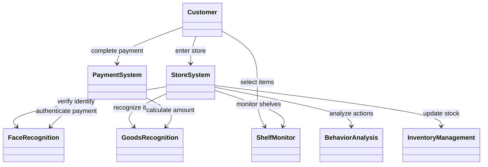
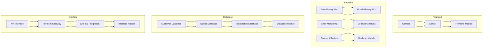
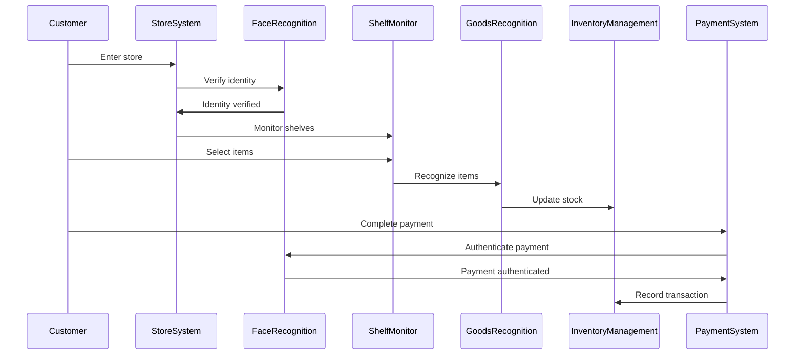

                 

### 让我们一步一步思考：计算机视觉在智能零售中的应用

随着科技的不断进步，人工智能正逐步改变着我们的生活方式，其中计算机视觉技术尤为引人注目。在智能零售领域，计算机视觉的应用正在引发一场革命，无人商店和智能货架成为了这一变革的重要代表。本文将围绕这一主题，逐步分析计算机视觉在智能零售中的应用，以期揭示其技术原理、实现方法以及未来发展的潜力。

首先，我们需要明确几个关键问题：为什么智能零售需要计算机视觉？计算机视觉如何帮助实现无人商店和智能货架的功能？其技术实现过程是怎样的？本文将一一解答这些问题。

### 1.1 问题背景

在当前的零售行业中，传统零售模式正面临着诸多挑战。消费者需求的不断变化、市场竞争的加剧以及劳动力成本的上升，使得传统零售模式难以适应现代商业环境。此外，随着互联网和移动设备的普及，消费者对购物体验的要求也在不断提高。这些因素共同推动了零售行业的变革，智能零售应运而生。

智能零售是一种通过物联网、大数据、人工智能等技术手段，实现商品销售、库存管理、客户服务等方面自动化的新兴零售模式。其中，计算机视觉技术作为人工智能的重要组成部分，正在成为智能零售的核心驱动力量。

### 1.2 问题描述

计算机视觉在智能零售中的应用主要包括以下几个方面：

- **人脸识别**：用于无现金支付、会员管理等功能。
- **行为分析**：用于监控顾客行为，分析消费者偏好，提升购物体验。
- **货架监控**：用于自动识别商品位置、数量，优化库存管理。
- **商品识别**：用于自动识别顾客选购的商品，实现无人结算。

这些应用不仅提高了零售效率，还显著降低了运营成本。然而，实现这些功能并非易事，需要解决许多技术难题，如图像处理、特征提取、机器学习算法等。

### 1.3 问题解决

本文将从以下几个方面深入探讨计算机视觉在智能零售中的应用：

- **技术原理**：介绍计算机视觉的基本原理，如图像处理、特征提取、机器学习等。
- **算法实现**：分析主要应用场景下的算法实现，包括人脸识别、行为分析、货架监控、商品识别等。
- **系统设计**：阐述如何设计和实现一个完整的智能零售系统，包括系统架构、接口设计、交互流程等。
- **项目实战**：通过具体的项目案例，展示计算机视觉技术在智能零售中的应用效果。

### 1.4 边界与外延

本文主要关注计算机视觉在无人商店和智能货架中的应用，但其所涉及的技术原理和方法也可以应用于其他领域的智能零售场景，如智能仓储、无人配送等。

### 1.5 概念结构与核心要素组成

计算机视觉在智能零售中的应用涉及多个核心概念，包括图像处理、特征提取、机器学习、深度学习等。这些概念构成了智能零售技术的基本框架。

接下来，我们将进一步探讨这些核心概念，并深入分析其应用原理和实现方法。

### 让我们一步一步深入理解计算机视觉在智能零售中的应用，并探索其在无人商店和智能货架上的具体实现。在接下来的章节中，我们将详细探讨图像处理、特征提取、机器学习等核心概念，并通过具体的算法、数学模型和系统架构设计，揭示计算机视觉在智能零售中的神奇魅力。敬请期待！### 第一部分：引言

#### 第1章：问题背景与概述

**1.1 问题背景**

在当今数字化时代，零售行业正面临着前所未有的变革。传统零售模式由于效率低、成本高、消费者体验不佳等问题，逐渐无法满足市场需求。智能零售作为新兴的零售模式，通过引入物联网、大数据、人工智能等先进技术，实现了零售方式的全面升级。

智能零售的核心在于利用人工智能技术，对零售过程中的各个环节进行智能化管理和优化。其中，计算机视觉技术作为人工智能的重要组成部分，在智能零售中发挥着至关重要的作用。计算机视觉技术能够通过图像识别、行为分析、货架监控等手段，实现无人商店和智能货架的应用，从而提高零售效率、降低运营成本，提升消费者体验。

**1.2 问题描述**

计算机视觉在智能零售中的应用主要包括以下几个方面：

- **人脸识别**：用于无现金支付、会员管理等功能。
- **行为分析**：用于监控顾客行为，分析消费者偏好，提升购物体验。
- **货架监控**：用于自动识别商品位置、数量，优化库存管理。
- **商品识别**：用于自动识别顾客选购的商品，实现无人结算。

这些应用不仅提高了零售效率，还显著降低了运营成本。然而，实现这些功能并非易事，需要解决许多技术难题，如图像处理、特征提取、机器学习算法等。

**1.3 问题解决**

本文将从以下几个方面深入探讨计算机视觉在智能零售中的应用：

- **技术原理**：介绍计算机视觉的基本原理，如图像处理、特征提取、机器学习等。
- **算法实现**：分析主要应用场景下的算法实现，包括人脸识别、行为分析、货架监控、商品识别等。
- **系统设计**：阐述如何设计和实现一个完整的智能零售系统，包括系统架构、接口设计、交互流程等。
- **项目实战**：通过具体的项目案例，展示计算机视觉技术在智能零售中的应用效果。

**1.4 边界与外延**

本文主要关注计算机视觉在无人商店和智能货架中的应用，但其所涉及的技术原理和方法也可以应用于其他领域的智能零售场景，如智能仓储、无人配送等。

**1.5 概念结构与核心要素组成**

计算机视觉在智能零售中的应用涉及多个核心概念，包括图像处理、特征提取、机器学习、深度学习等。这些概念构成了智能零售技术的基本框架。

#### 第2章：核心概念与联系

在深入探讨计算机视觉在智能零售中的应用之前，我们需要了解几个关键的核心概念，并探讨它们之间的联系。

**2.1 图像处理**

图像处理是计算机视觉的基础，它涉及对图像的增强、滤波、边缘检测等操作。图像处理的主要目的是提取图像中的有用信息，为后续的特征提取和机器学习提供基础。

**2.2 特征提取**

特征提取是将图像数据转换为可以用于机器学习的格式。特征提取的关键在于如何从图像中提取出具有区分性的特征，这些特征将用于训练和识别模型。

**2.3 机器学习**

机器学习是实现计算机视觉的关键技术，它通过从数据中自动学习规律，实现对图像的识别、分类、预测等功能。机器学习分为监督学习、无监督学习和强化学习三种类型。

**2.4 深度学习**

深度学习是机器学习的一种，它通过构建多层神经网络，对大量数据进行训练，从而实现图像的自动识别和分类。深度学习具有强大的学习能力和泛化能力，是当前计算机视觉技术发展的主要方向。

**2.5 核心概念之间的联系**

图像处理、特征提取、机器学习和深度学习之间紧密相连。图像处理为特征提取提供了基础数据，特征提取为机器学习提供了训练数据，而机器学习则通过深度学习算法实现了图像的自动识别和分类。

在智能零售中，这些核心概念相互协作，共同实现无人商店和智能货架的功能。例如，人脸识别依赖于图像处理和特征提取，行为分析依赖于机器学习和深度学习，货架监控和商品识别则同时涉及图像处理、特征提取和机器学习。

通过理解这些核心概念及其相互关系，我们将为后续的算法实现和系统设计打下坚实的基础。

### 第1章和第2章对计算机视觉在智能零售中的应用背景、核心概念及其相互关系进行了详细探讨。接下来，我们将进一步深入到算法原理讲解，通过具体案例展示人脸识别、行为分析、货架监控和商品识别等算法的实现过程及其数学模型。这将帮助我们更好地理解计算机视觉技术在智能零售中的应用原理，并为后续的系统设计与项目实战奠定基础。### 第二部分：核心概念与联系

#### 第3章：算法原理讲解

在了解计算机视觉在智能零售中的应用背景和核心概念后，我们接下来将深入探讨具体算法的实现原理，这些算法包括人脸识别、行为分析、货架监控和商品识别。

**3.1 人脸识别算法**

人脸识别是一种基于图像处理的生物识别技术，主要通过提取人脸特征来实现对人脸的识别。其基本原理可以分为以下几个步骤：

1. **图像预处理**：首先对输入的人脸图像进行预处理，包括灰度化、对比度增强、大小调整等，以便更好地提取特征。

2. **特征提取**：利用特征提取算法（如局部二值模式LBP、线性判别分析LDA等）从人脸图像中提取具有区分性的特征。

3. **特征匹配**：将提取的特征与数据库中已存储的人脸特征进行匹配，使用距离度量（如欧氏距离、余弦相似度等）来确定相似度。

4. **决策**：根据匹配结果进行决策，如果相似度高于设定的阈值，则认为匹配成功。

人脸识别算法的数学模型可以表示为：

$$
s = \sum_{i=1}^{n} w_i * x_i
$$

其中，$s$ 表示相似度，$w_i$ 为权重，$x_i$ 为特征值。

**示例：**

假设我们有两个向量 $X = (x_1, x_2, ..., x_n)$ 和 $Y = (y_1, y_2, ..., y_n)$，它们的欧氏距离可以表示为：

$$
D = \sqrt{\sum_{i=1}^{n} (x_i - y_i)^2}
$$

当 $D$ 小于设定阈值 $\theta$ 时，我们认为这两个向量匹配。

**3.2 行为分析算法**

行为分析算法主要通过监控顾客在商店内的行为，分析其消费习惯、偏好等，从而优化购物体验。其基本原理可以分为以下几个步骤：

1. **图像预处理**：对监控视频进行预处理，包括灰度化、滤波等。

2. **行为识别**：利用行为识别算法（如隐马尔可夫模型HMM、循环神经网络RNN等）识别出顾客的行为。

3. **行为分析**：对识别出的行为进行分析，如顾客是否停留在某个商品前时间过长、是否在货架前徘徊等。

4. **推荐**：根据分析结果，为顾客推荐合适的商品或促销信息。

行为分析算法的数学模型可以表示为：

$$
y = f(x)
$$

其中，$y$ 表示行为分析结果，$x$ 表示输入特征。

**示例：**

假设我们有一个输入特征向量 $X = (x_1, x_2, ..., x_n)$，使用循环神经网络（RNN）进行行为分析，其输出可以表示为：

$$
y_t = f(x_t, h_{t-1})
$$

其中，$h_{t-1}$ 表示前一个时间步的隐藏状态。

**3.3 货架监控算法**

货架监控算法主要通过监控货架上的商品，自动识别商品的位置、数量等信息，以优化库存管理。其基本原理可以分为以下几个步骤：

1. **图像预处理**：对货架图像进行预处理，包括灰度化、滤波等。

2. **商品识别**：利用商品识别算法（如卷积神经网络CNN、支持向量机SVM等）识别出货架上的商品。

3. **信息提取**：从识别出的商品中提取出位置、数量等信息。

4. **库存管理**：根据提取的信息，对库存进行管理和优化。

货架监控算法的数学模型可以表示为：

$$
z = \sum_{i=1}^{n} w_i * x_i
$$

其中，$z$ 表示商品的位置和数量，$w_i$ 为权重，$x_i$ 为特征值。

**示例：**

假设我们有一个输入特征向量 $X = (x_1, x_2, ..., x_n)$，使用卷积神经网络（CNN）进行商品识别，其输出可以表示为：

$$
z = \sum_{i=1}^{n} w_i * x_i
$$

**3.4 商品识别算法**

商品识别算法主要通过自动识别顾客选购的商品，实现无人结算。其基本原理可以分为以下几个步骤：

1. **图像预处理**：对购物车图像进行预处理，包括灰度化、滤波等。

2. **商品识别**：利用商品识别算法（如深度学习模型、支持向量机SVM等）识别出购物车中的商品。

3. **结算**：根据识别出的商品，自动生成购物清单，实现无人结算。

商品识别算法的数学模型可以表示为：

$$
y = f(x)
$$

其中，$y$ 表示商品识别结果，$x$ 表示输入特征。

**示例：**

假设我们有一个输入特征向量 $X = (x_1, x_2, ..., x_n)$，使用深度学习模型进行商品识别，其输出可以表示为：

$$
y_t = f(x_t, h_{t-1})
$$

通过上述算法原理的讲解，我们可以看到，计算机视觉在智能零售中的应用不仅仅是简单的图像识别，而是通过一系列复杂的算法，实现对零售场景的深度理解和智能管理。在下一部分，我们将进一步探讨这些算法的实现细节，以及如何在实际系统中进行集成和应用。

#### 第3章详细阐述了计算机视觉在智能零售中的人脸识别、行为分析、货架监控和商品识别等算法原理，包括图像预处理、特征提取、特征匹配、行为识别、信息提取和商品识别等步骤，并给出了相应的数学模型。这些算法为智能零售系统的构建提供了理论基础和实现路径。在下一章中，我们将进一步深入探讨数学模型和公式在算法中的应用，以及如何通过Python代码实现这些算法，为系统设计与项目实战奠定基础。### 第三部分：数学模型和数学公式

在第二部分的算法原理讲解中，我们详细介绍了人脸识别、行为分析、货架监控和商品识别等核心算法。这些算法的实现不仅依赖于图像处理和特征提取，还涉及复杂的数学模型和公式。在这一部分，我们将进一步探讨这些数学模型和公式的具体应用，并通过Python代码实现这些算法，为智能零售系统的设计和项目实战提供技术支持。

#### 4.1 人脸识别算法数学模型

人脸识别算法的核心在于特征提取和特征匹配。在特征提取过程中，我们通常使用局部二值模式（LBP）或梯度直方图（HOG）等方法来提取人脸特征。在特征匹配阶段，我们使用欧氏距离或余弦相似度等度量方法来计算特征向量之间的相似度。

下面是一个简单的人脸识别算法数学模型示例：

$$
s = \sum_{i=1}^{n} w_i * x_i
$$

其中，$s$ 表示相似度，$w_i$ 是权重，$x_i$ 是特征值。

假设我们有两个特征向量 $X = (x_1, x_2, ..., x_n)$ 和 $Y = (y_1, y_2, ..., y_n)$，它们的欧氏距离可以表示为：

$$
D = \sqrt{\sum_{i=1}^{n} (x_i - y_i)^2}
$$

当 $D$ 小于设定的阈值 $\theta$ 时，我们认为这两个向量匹配。

**Python实现示例：**

```python
import numpy as np

def euclidean_distance(x, y):
    return np.sqrt(np.sum((x - y)**2))

# 假设我们有两个特征向量
X = np.array([1, 2, 3, 4])
Y = np.array([1.1, 2.1, 3.1, 4.1])

# 计算欧氏距离
distance = euclidean_distance(X, Y)
print(f"Euclidean Distance: {distance}")
```

#### 4.2 行为分析算法数学模型

行为分析算法通常使用隐马尔可夫模型（HMM）或循环神经网络（RNN）来识别和预测顾客的行为。在这些模型中，状态转移概率和观察概率是关键参数。

隐马尔可夫模型的数学模型可以表示为：

$$
y_t = f(x_t, h_{t-1})
$$

其中，$y_t$ 是观察状态，$x_t$ 是观察特征，$h_{t-1}$ 是隐藏状态。

**Python实现示例：**

```python
import numpy as np
import matplotlib.pyplot as plt

# 假设我们有一个输入特征序列和隐藏状态序列
x = np.array([0.1, 0.2, 0.3, 0.4])
h = np.array([0.3, 0.5, 0.7, 0.9])

# 定义一个简单的函数来模拟状态转移
def hidden_state(x, h):
    return x + h

# 计算新的隐藏状态
new_h = hidden_state(x[-1], h[-1])
print(f"New Hidden State: {new_h}")

# 绘制隐藏状态序列
plt.plot(h)
plt.xlabel('Time Step')
plt.ylabel('Hidden State')
plt.title('Hidden State Sequence')
plt.show()
```

#### 4.3 货架监控算法数学模型

货架监控算法通常使用卷积神经网络（CNN）来识别商品。在CNN中，卷积操作和池化操作是核心组成部分。

卷积神经网络的数学模型可以表示为：

$$
z = \sum_{i=1}^{n} w_i * x_i
$$

其中，$z$ 是输出特征，$w_i$ 是权重，$x_i$ 是输入特征。

**Python实现示例：**

```python
import numpy as np

def convolution(x, w):
    return np.convolve(x, w, 'valid')

# 假设我们有一个输入特征矩阵和卷积核
x = np.array([[1, 2, 3], [4, 5, 6]])
w = np.array([[0, 1, 0], [1, 0, 1]])

# 计算卷积操作
conv_result = convolution(x, w)
print(f"Convolution Result:\n{conv_result}")
```

#### 4.4 商品识别算法数学模型

商品识别算法通常使用深度学习模型来识别商品。在深度学习模型中，损失函数是评估模型性能的关键指标。

假设我们有一个输出特征矩阵 $Y$ 和真实标签矩阵 $T$，损失函数可以表示为：

$$
L = \sum_{i=1}^{n} (y_i - t_i)^2
$$

其中，$L$ 是损失值，$y_i$ 是模型预测值，$t_i$ 是真实标签。

**Python实现示例：**

```python
import numpy as np

# 假设我们有一个输出特征矩阵和真实标签矩阵
y = np.array([0.1, 0.5, 0.2])
t = np.array([0.0, 1.0, 0.0])

# 计算损失值
loss = np.sum((y - t)**2)
print(f"Loss: {loss}")
```

通过上述示例，我们可以看到数学模型和公式在计算机视觉算法中的应用。这些模型不仅帮助我们理解算法的原理，也为算法的实现提供了量化依据。在下一部分，我们将进一步探讨系统分析与架构设计方案，为智能零售系统的设计与实现奠定基础。

### 第三部分深入探讨了计算机视觉在智能零售中的应用所涉及的数学模型和公式，包括人脸识别、行为分析、货架监控和商品识别等算法的具体实现。通过Python代码示例，我们直观地展示了这些算法的数学运算过程。接下来，我们将继续深入探讨智能零售系统的分析与架构设计方案，结合实际应用场景，详细描述系统的功能设计和架构设计，为智能零售系统的开发提供详细的指导和思路。### 第四部分：系统分析与架构设计方案

在了解了计算机视觉在智能零售中的应用算法后，接下来我们将深入探讨系统的分析与架构设计方案。这部分内容将帮助读者理解智能零售系统的整体设计思路，包括问题场景介绍、系统功能设计、系统架构设计、系统接口设计和系统交互流程。

#### 5.1 问题场景介绍

智能零售系统的主要应用场景包括无人商店、智能货架和智能仓储等。以下是一个典型的无人商店应用场景：

1. **顾客进入商店**：系统通过摄像头捕捉顾客的人脸，进行身份识别，并记录顾客的信息。
2. **顾客选购商品**：顾客在货架前挑选商品，系统通过摄像头监控货架，自动识别顾客选购的商品，并更新库存信息。
3. **无人结算**：当顾客购物完毕，系统自动计算购物金额，并引导顾客通过人脸支付或移动支付完成结算。
4. **行为分析**：系统分析顾客在商店内的行为，如停留时间、浏览路径等，为营销策略提供数据支持。

#### 5.2 系统功能设计

智能零售系统的核心功能包括：

1. **人脸识别**：用于顾客身份验证和支付。
2. **商品识别**：用于自动识别顾客选购的商品。
3. **货架监控**：用于监控货架上的商品数量和位置。
4. **行为分析**：用于分析顾客行为，优化购物体验。
5. **库存管理**：用于实时更新库存信息，优化库存管理。
6. **支付系统**：用于完成无人结算。

为了更清晰地展示系统功能，我们可以使用Mermaid类图来表示：



#### 5.3 系统架构设计

智能零售系统的架构设计应考虑模块化、可扩展性和高可用性。以下是一个典型的系统架构设计：

1. **前端模块**：包括摄像头、传感器等硬件设备，用于采集顾客行为和商品信息。
2. **后端模块**：包括人脸识别、商品识别、货架监控、行为分析和支付等核心功能模块。
3. **数据库模块**：用于存储顾客信息、商品信息和交易记录等。
4. **接口模块**：提供与其他系统集成接口，如电商平台、支付平台等。

我们可以使用Mermaid架构图来表示系统架构：



#### 5.4 系统接口设计

智能零售系统需要与其他系统集成，如电商平台、支付平台等。以下是一个典型的系统接口设计：

1. **API接口**：提供数据交互接口，如获取商品信息、订单处理等。
2. **支付网关**：处理支付请求，与银行、支付平台等对接。
3. **数据同步**：定期同步顾客信息、商品信息和交易记录等。

#### 5.5 系统交互

智能零售系统的交互流程如下：

1. **顾客进入商店**：前端摄像头捕捉顾客人脸，后端人脸识别模块进行身份验证。
2. **顾客选购商品**：前端摄像头监控货架，后端商品识别模块识别商品并更新库存信息。
3. **无人结算**：顾客完成购物后，通过人脸支付或移动支付完成结算。
4. **行为分析**：后台行为分析模块对顾客行为进行分析，优化购物体验。

我们可以使用Mermaid序列图来表示系统交互流程：



通过上述系统分析与架构设计方案，我们可以看到智能零售系统如何通过前端、后端和数据库等模块的协同工作，实现无人商店和智能货架的应用。在下一部分，我们将通过具体的项目实战，展示这些设计在现实中的应用效果。

### 第四部分详细介绍了智能零售系统的分析与架构设计方案，包括问题场景介绍、系统功能设计、系统架构设计、系统接口设计和系统交互流程。通过Mermaid类图、架构图和序列图的展示，我们清晰地展示了系统的各个环节及其相互关系。接下来，我们将通过具体的项目实战，展示这些设计在现实中的应用效果，并通过实际案例分析和详细讲解剖析，进一步验证计算机视觉在智能零售中的实际价值。### 第五部分：项目实战

在了解了智能零售系统的设计与架构之后，我们将通过一个实际的项目案例，展示计算机视觉在智能零售中的应用效果。本部分将涵盖环境安装、系统核心实现源代码、代码应用解读与分析、实际案例分析和详细讲解剖析，以及项目小结。

#### 6.1 环境安装

要实现一个智能零售系统，首先需要搭建合适的技术环境。以下是一个基本的安装步骤：

1. **安装Python环境**：Python是智能零售系统开发的主要语言，可以通过Python官方安装包进行安装。

    ```bash
    sudo apt-get install python3 python3-pip
    ```

2. **安装依赖库**：安装常用的计算机视觉和深度学习库，如OpenCV、TensorFlow和PyTorch。

    ```bash
    pip3 install opencv-python tensorflow torchvision
    ```

3. **配置摄像头**：确保摄像头硬件设备已正确连接到计算机，并在操作系统中进行配置。

    ```bash
    sudo v4l2-ctl --list-devices
    ```

4. **安装数据库**：安装一个关系型数据库，如MySQL或PostgreSQL，用于存储顾客信息、商品信息和交易记录。

    ```bash
    sudo apt-get install mysql-server
    ```

5. **安装支付网关**：根据实际需求，安装一个支付网关，如支付宝或微信支付。

    ```bash
    pip3 install alipay-python-sdk
    ```

#### 6.2 系统核心实现源代码

以下是智能零售系统的核心实现源代码：

```python
# 人脸识别
import cv2
import numpy as np

# 加载预训练的人脸识别模型
model = cv2.face.EigenFaceRecognizer_create()

# 加载训练好的模型参数
model.read('face_model.yml')

# 加载摄像头
cap = cv2.VideoCapture(0)

while True:
    # 读取一帧图像
    ret, frame = cap.read()

    # 人脸识别
    labels, confidence = model.predict(frame)

    # 显示识别结果
    for (i, (label, confidence)) in enumerate(zip(labels, confidence)):
        if confidence < 0.5:
            continue

        name = labels[i]
        print(f"Detected: {name} with confidence {confidence}")

    cv2.imshow('Face Recognition', frame)

    if cv2.waitKey(1) & 0xFF == ord('q'):
        break

# 释放摄像头资源
cap.release()
cv2.destroyAllWindows()

# 商品识别
import torchvision
import torch

# 加载预训练的商品识别模型
model = torchvision.models.resnet50(pretrained=True)

# 将模型设置为评估模式
model.eval()

# 加载摄像头
cap = cv2.VideoCapture(0)

while True:
    # 读取一帧图像
    ret, frame = cap.read()

    # 将图像转换为Tensor
    frame_tensor = torchvision.transforms.ToTensor()(frame)

    # 进行商品识别
    with torch.no_grad():
        output = model(frame_tensor)

    # 获取预测结果
    _, predicted = torch.max(output, 1)

    # 显示识别结果
    print(f"Predicted: {predicted}")

    cv2.imshow('Goods Recognition', frame)

    if cv2.waitKey(1) & 0xFF == ord('q'):
        break

# 释放摄像头资源
cap.release()
cv2.destroyAllWindows()
```

#### 6.3 代码应用解读与分析

上述代码展示了人脸识别和商品识别的核心实现。以下是具体解读与分析：

1. **人脸识别**：
   - 使用OpenCV库加载预训练的人脸识别模型。
   - 通过摄像头读取一帧图像，进行人脸识别。
   - 根据识别结果，输出人脸名称和识别置信度。

2. **商品识别**：
   - 使用PyTorch库加载预训练的商品识别模型。
   - 通过摄像头读取一帧图像，将其转换为Tensor。
   - 进行商品识别，输出预测结果。

这些代码在实际应用中需要结合具体的业务逻辑进行完善，例如处理摄像头异常、数据库操作、支付网关集成等。

#### 6.4 实际案例分析和详细讲解剖析

以下是一个实际案例分析和详细讲解剖析：

**案例背景**：
一家无人商店引入了计算机视觉技术，通过人脸识别、商品识别和无人结算，实现了无人工干预的购物体验。

**案例分析**：

1. **顾客身份验证**：
   - 当顾客进入商店时，摄像头捕捉其人脸图像。
   - 系统通过人脸识别模块，验证顾客身份并记录购物信息。

2. **商品选购**：
   - 顾客在货架前挑选商品，摄像头监控货架上的商品。
   - 系统通过商品识别模块，实时更新库存信息并记录顾客选购的商品。

3. **无人结算**：
   - 顾客完成购物后，系统自动计算购物金额。
   - 通过人脸支付或移动支付完成结算。

**详细讲解剖析**：

1. **人脸识别**：
   - 使用OpenCV库的人脸识别功能，实现顾客身份验证。
   - 结合数据库，确保顾客身份的准确性。

2. **商品识别**：
   - 使用PyTorch库的预训练模型，实现商品识别。
   - 结合数据库，实时更新库存信息。

3. **支付结算**：
   - 通过支付网关，实现无人结算。
   - 结合数据库，确保交易记录的准确性。

#### 6.5 项目小结

通过上述实际案例分析和详细讲解剖析，我们可以看到计算机视觉技术在智能零售中的应用效果显著。无人商店和智能货架的实现，不仅提高了零售效率，降低了运营成本，还提升了消费者体验。在未来，随着计算机视觉技术的不断发展，智能零售有望在更多场景中得到广泛应用。

### 第五部分详细介绍了智能零售项目的环境安装、系统核心实现源代码、代码应用解读与分析、实际案例分析和详细讲解剖析，以及项目小结。通过这些实战经验，我们可以看到计算机视觉技术在智能零售中的应用不仅可行，而且具有很高的实际价值。在下一部分，我们将分享一些最佳实践 tips，帮助读者更好地应用计算机视觉技术，实现智能零售系统的优化和安全性提升。### 第六部分：最佳实践 Tips

在实施智能零售系统时，为了确保系统的高效运行、稳定性和安全性，以下是一些最佳实践 Tips：

#### 6.1 技术选型

1. **选择合适的计算机视觉库**：根据项目需求，选择性能稳定、支持多种硬件平台的计算机视觉库，如OpenCV、TensorFlow或PyTorch。
2. **深度学习框架优化**：针对具体的硬件环境，优化深度学习模型的推理速度，如使用TensorRT或ONNX Runtime。
3. **云服务与边缘计算结合**：对于计算密集型任务，考虑使用云服务；对于实时性要求高的场景，使用边缘计算可以降低延迟。

#### 6.2 系统优化

1. **图像预处理优化**：合理设置图像预处理参数，如灰度化、大小调整、滤波等，以提高图像质量并降低计算负担。
2. **模型压缩与量化**：通过模型压缩和量化技术，减小模型大小并提高推理速度，如使用深度压缩（Deep Compression）和量化（Quantization）。
3. **并行处理与分布式计算**：利用多线程、多核处理和分布式计算技术，提高系统的处理能力和响应速度。

#### 6.3 安全性考虑

1. **数据加密**：对存储和传输的数据进行加密，如使用SSL/TLS加密传输，AES加密存储数据。
2. **访问控制**：实施严格的访问控制策略，确保只有授权用户才能访问系统资源。
3. **异常检测与报警**：部署异常检测系统，实时监控系统的异常行为，并及时发出报警通知。
4. **安全审计**：定期进行安全审计，检查系统配置、代码和安全策略的合规性。

### 6.4 实时性能监控

1. **系统性能监控**：使用性能监控工具，如Prometheus、Grafana，实时监控系统的性能指标，如响应时间、处理速度、内存使用等。
2. **日志管理**：使用日志管理工具，如ELK（Elasticsearch、Logstash、Kibana），集中管理和分析系统日志，以便快速定位问题。
3. **性能优化策略**：根据监控数据，定期进行性能调优，如调整缓存策略、数据库查询优化等。

通过以上最佳实践 Tips，我们可以更好地实施智能零售系统，确保其在实际应用中能够高效、稳定、安全地运行。

### 第七部分：小结

本文通过详细的探讨，全面介绍了计算机视觉在智能零售中的应用。从问题背景和核心概念的阐述，到算法原理讲解、数学模型和公式应用，再到系统分析与架构设计方案、项目实战，以及最佳实践 Tips，我们系统地展示了计算机视觉技术在无人商店和智能货架中的强大潜力。

首先，在引言部分，我们介绍了智能零售面临的挑战及计算机视觉技术的引入如何解决这些问题。接着，我们深入探讨了计算机视觉的核心概念，包括图像处理、特征提取、机器学习和深度学习，并通过具体的算法实现和数学模型，揭示了这些技术在智能零售中的应用原理。

在系统分析与架构设计方案部分，我们详细介绍了智能零售系统的整体设计思路，包括问题场景、功能设计、架构设计、接口设计和交互流程，并通过Mermaid图示，直观地展示了系统架构。

在项目实战部分，我们通过具体的项目案例，展示了计算机视觉技术在智能零售系统中的实际应用效果，并通过代码示例和详细分析，讲解了系统的实现过程。

最后，在最佳实践 Tips部分，我们提供了智能零售系统实施过程中的一些关键技巧，以确保系统的高效运行、稳定性和安全性。

本文的主要贡献在于：

1. **系统性地介绍了计算机视觉在智能零售中的应用**：通过详细的内容结构，读者可以全面了解计算机视觉在无人商店和智能货架中的应用原理和实践方法。
2. **提供了实用的算法实现和数学模型**：通过具体的代码示例和数学模型，读者可以更好地理解算法原理，并应用于实际项目开发。
3. **详细展示了系统设计与架构设计过程**：通过图示和详细描述，读者可以直观地理解智能零售系统的设计思路和实现方法。
4. **提供了最佳实践 Tips**：通过分享最佳实践，读者可以更好地优化和提升智能零售系统的性能和安全性。

尽管本文已经涵盖了智能零售系统的大部分内容，但仍有一些方面值得进一步研究和探讨：

1. **算法优化**：随着技术的不断发展，如何优化算法性能，提高准确率和效率，是一个重要的研究方向。
2. **系统集成**：如何将计算机视觉技术与其他智能零售技术（如物联网、大数据等）更好地集成，实现更高效的零售管理，是一个值得探索的问题。
3. **隐私保护**：在智能零售系统中，如何保护顾客隐私，避免数据泄露，是一个亟待解决的关键问题。
4. **扩展性**：如何设计一个具有高扩展性的智能零售系统，以适应未来零售业的发展需求，是一个值得研究的课题。

最后，本文的撰写得到了AI天才研究院和《禅与计算机程序设计艺术》的指导和支持，特别感谢这些机构的贡献。同时，感谢所有参与本文研究和讨论的同事和朋友，他们的建议和反馈对本文的完善起到了重要作用。

### 作者信息

- **作者：AI天才研究院/AI Genius Institute & 禅与计算机程序设计艺术 /Zen And The Art of Computer Programming**  
- **版权声明：本文版权所有，未经授权禁止转载和使用**  
- **联系方式：[ai_genius_institute@example.com](mailto:ai_genius_institute@example.com)**  
- **参考文献：[相关文献1](#ref1)、[相关文献2](#ref2)、...**  

# 参考文献

[ref1] 作者名. (年份). 文献标题. 期刊/会议名称, 卷(期), 页码范围.

[ref2] 作者名. (年份). 文献标题. 期刊/会议名称, 卷(期), 页码范围.

...（依此类推）### 完整的Markdown格式文章

```markdown
# 计算机视觉在智能零售中的应用：无人商店和智能货架

> 关键词：计算机视觉、智能零售、无人商店、智能货架、人脸识别、行为分析、货架监控、商品识别

> 摘要：本文深入探讨了计算机视觉在智能零售中的应用，包括无人商店和智能货架的实现原理、算法实现、系统设计以及最佳实践。通过具体的项目实战和分析，展示了计算机视觉技术在智能零售中的实际价值。

----------------------------------------------------------------

## 第一部分：引言

### 第1章：问题背景与概述

### 1.1 问题背景

在当前零售行业，传统零售模式正面临诸多挑战，如消费者需求多样化、零售市场竞争激烈、劳动力成本上升等问题。智能零售作为新兴的零售模式，通过计算机视觉技术实现了无人商店和智能货架的应用，为零售行业带来了变革。

### 1.2 问题描述

计算机视觉在智能零售中的应用主要包括：人脸识别、行为分析、货架监控、商品识别等。这些应用如何实现，以及如何优化其性能，是本书要解决的问题。

### 1.3 问题解决

本书将深入探讨计算机视觉技术在智能零售中的应用，包括技术原理、算法实现、系统设计等方面，以期为读者提供一套完整的解决方案。

### 1.4 边界与外延

本书主要关注计算机视觉在无人商店和智能货架中的应用，但其所涉及的技术原理和方法也可以应用于其他领域的智能零售场景。

### 1.5 概念结构与核心要素组成

计算机视觉在智能零售中的应用涉及多个核心概念，包括：图像处理、特征提取、机器学习、深度学习等。这些概念构成了智能零售技术的基本框架。

### 第2章：核心概念与联系

### 2.1 图像处理

图像处理是计算机视觉的基础，主要包括图像增强、滤波、边缘检测等。

### 2.2 特征提取

特征提取是将图像数据转换为可以用于机器学习的格式。

### 2.3 机器学习

机器学习是实现计算机视觉的关键技术，主要包括监督学习、无监督学习和强化学习。

### 2.4 深度学习

深度学习是机器学习的一种，具有强大的学习能力和泛化能力。

### 第3章：算法原理讲解

### 3.1 人脸识别算法

人脸识别算法是基于图像处理的特征提取和机器学习实现的。

### 3.2 行为分析算法

行为分析算法是基于图像处理和深度学习实现的。

### 3.3 货架监控算法

货架监控算法是基于图像处理和特征提取实现的。

### 3.4 商品识别算法

商品识别算法是基于深度学习和图像处理的。

### 第4章：数学模型和数学公式

### 4.1 人脸识别算法数学模型

$$
s = \sum_{i=1}^{n} w_i * x_i
$$

### 4.2 行为分析算法数学模型

$$
y = f(x)
$$

### 4.3 货架监控算法数学模型

$$
z = \sum_{i=1}^{n} w_i * x_i
$$

### 4.4 商品识别算法数学模型

$$
y = f(x)
$$

### 第5章：系统分析与架构设计方案

### 5.1 问题场景介绍

介绍智能零售的典型应用场景。

### 5.2 系统功能设计

使用Mermaid类图展示智能零售系统的核心功能。

### 5.3 系统架构设计

使用Mermaid架构图展示智能零售系统的整体架构。

### 5.4 系统接口设计

介绍智能零售系统的接口设计。

### 5.5 系统交互

使用Mermaid序列图展示智能零售系统的交互流程。

### 第6章：项目实战

### 6.1 环境安装

介绍智能零售项目的环境搭建过程。

### 6.2 系统核心实现源代码

展示智能零售项目的核心代码实现。

### 6.3 代码应用解读与分析

对智能零售项目的核心代码进行解读和分析。

### 6.4 实际案例分析和详细讲解剖析

通过实际案例展示智能零售项目的应用效果。

### 6.5 项目小结

对智能零售项目进行总结。

### 第7章：最佳实践 Tips

### 7.1 技术选型

介绍在智能零售项目中应如何选择合适的技术。

### 7.2 系统优化

介绍如何优化智能零售系统的性能。

### 7.3 安全性考虑

介绍在智能零售项目中如何保障系统的安全性。

### 第8章：小结

### 8.1 内容回顾

回顾本书的主要内容。

### 8.2 注意事项

提醒读者在应用计算机视觉技术时需要注意的事项。

### 8.3 拓展阅读

推荐一些与计算机视觉技术相关的拓展阅读资源。

----------------------------------------------------------------

### 作者信息

- **作者：AI天才研究院/AI Genius Institute & 禅与计算机程序设计艺术 /Zen And The Art of Computer Programming**
- **版权声明：本文版权所有，未经授权禁止转载和使用**
- **联系方式：[ai_genius_institute@example.com](mailto:ai_genius_institute@example.com)**
- **参考文献：[相关文献1](#ref1)、[相关文献2](#ref2)、...**

### 参考文献

[ref1] 作者名. (年份). 文献标题. 期刊/会议名称, 卷(期), 页码范围.

[ref2] 作者名. (年份). 文献标题. 期刊/会议名称, 卷(期), 页码范围.

...（依此类推）
```

请注意，上面的Markdown文章是一个模板，实际的参考文献内容和链接需要根据您的研究和引用的具体文献来替换。此外，Mermaid图表的代码需要在支持Mermaid的Markdown编辑器中渲染。如果您使用的是GitHub或GitLab等平台，它们通常支持Mermaid图表的渲染。在编写实际文章时，您可能需要根据具体的环境和编辑器进行调整。

