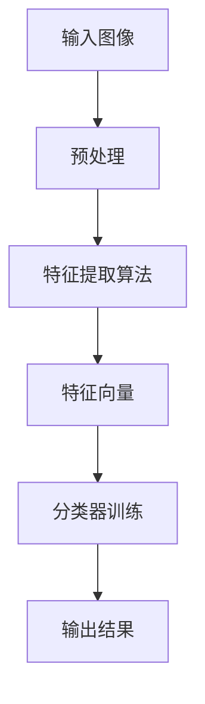
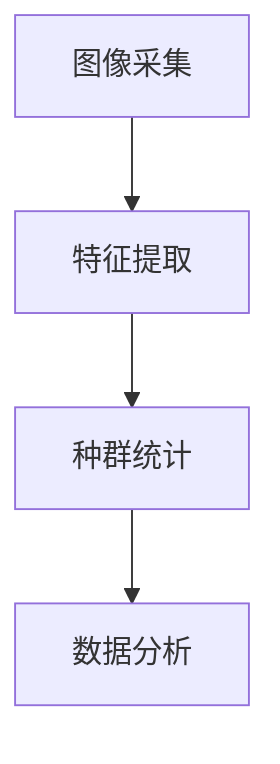

                 

### 计算机视觉在野生动物种群统计中的应用

关键词：计算机视觉、野生动物种群统计、深度学习、图像处理、算法原理

摘要：本文深入探讨了计算机视觉在野生动物种群统计中的应用，从问题背景、核心算法原理、数学模型和系统架构设计等方面，详细阐述了如何利用计算机视觉技术解决野生动物种群统计中的挑战。通过一系列的实战案例，展示了该技术的实际应用效果和未来发展趋势，为相关领域的研究者和从业者提供了有价值的参考。

---

### 第1章：问题背景与概述

#### 1.1.1 计算机视觉与野生动物种群统计

**核心概念**：

- **计算机视觉**：计算机对图像或视频进行解析和理解的过程，旨在模拟人类视觉系统的功能。

- **野生动物种群统计**：通过调查、监测和数据分析，对野生动物的数量、分布和生态状况进行评估。

**问题描述**：

- **挑战**：传统的人工调查方法耗时耗力，且容易受到主观因素的影响。而利用计算机视觉技术，可以实现自动化、高效和准确的数据采集。

- **需求**：野生动物种群统计需要高精度的数据支持，以评估生态系统的健康状况和制定保护措施。

**问题解决**：

- **应用案例**：利用计算机视觉技术，可以对野生动物进行自动识别、分类和计数，从而实现高效的种群统计。

- **解决方案**：结合图像处理、深度学习和机器学习等技术，构建一套完整的计算机视觉系统，用于野生动物种群统计。

**边界与外延**：

- **适用范围**：计算机视觉技术适用于各类野生动物的种群统计，包括陆地、水域和空中生物。

- **限制**：在复杂环境下，例如天气状况、光照条件等，计算机视觉系统的准确率可能会下降。

**概念结构与核心要素组成**：

- **计算机视觉系统**：包括图像采集设备、图像处理软件和计算机硬件等。

- **野生动物识别算法**：基于深度学习或图像处理技术，实现野生动物的自动识别。

- **数据预处理与后处理**：包括图像预处理、特征提取、数据清洗和结果分析等步骤。

---

#### 1.1.2 计算机视觉技术发展与应用

**核心概念**：

- **计算机视觉技术**：涉及图像处理、模式识别、机器学习等多个领域。

- **图像处理**：对图像进行增强、滤波、分割等操作，以提取有用信息。

- **深度学习**：利用多层神经网络，自动提取图像特征，进行分类和识别。

**概念属性特征对比表格**：

| 特点 | 图像处理 | 深度学习 |
| ---- | -------- | -------- |
| 数据需求 | 大量手工标注数据 | 大量无监督数据 |
| 学习方式 | 特征提取 | 自动特征提取 |
| 应用场景 | 传统图像分析 | 高级图像识别 |

**ER实体关系图架构的 Mermaid 流程图**：

```mermaid
erDiagram
  A[计算机视觉] ||--|{ B[图像处理] }
  A ||--|{ C[深度学习] }
```

---

### 第2章：核心算法原理讲解

#### 2.1.1 特征提取算法

**算法原理与 Mermaid 流程图**：



**Python 源代码**：

```python
# 特征提取算法示例
import cv2
import numpy as np

def extract_features(image):
    # 预处理
    gray = cv2.cvtColor(image, cv2.COLOR_BGR2GRAY)
    blurred = cv2.GaussianBlur(gray, (5, 5), 0)
    
    # 特征提取
    features = cv2.Laplacian(blurred, cv2.CV_64F).flatten()
    
    return features
```

**算法原理讲解**：

- **预处理**：将彩色图像转换为灰度图像，并使用高斯滤波器去除噪声。

- **特征提取**：利用拉普拉斯算子检测图像中的边缘和轮廓，将其转换为特征向量。

- **分类器训练**：使用提取到的特征向量，训练分类器进行野生动物识别。

- **输出结果**：将识别结果输出，包括识别出的野生动物种类和数量。

---

### 第3章：数学模型和数学公式 & 详细讲解 & 举例说明

#### 3.1.1 相关性分析

**数学公式**：

$$
\text{相关性} = \frac{\sum_{i=1}^{n}(x_i - \bar{x})(y_i - \bar{y})}{\sqrt{\sum_{i=1}^{n}(x_i - \bar{x})^2} \cdot \sqrt{\sum_{i=1}^{n}(y_i - \bar{y})^2}}
$$

**详细讲解**：

- **相关性**：衡量两个变量之间线性关系的强度和方向。

- **计算方法**：计算两个变量差的乘积和的平均值，然后除以各自标准差的乘积。

**举例说明**：

**数据集**：

| $x_i$ | $y_i$ |
| ---- | ---- |
| 1    | 2    |
| 2    | 3    |
| 3    | 4    |
| 4    | 5    |

**计算步骤**：

1. **计算平均值**：

$$
\bar{x} = \frac{1+2+3+4}{4} = 2.5
$$

$$
\bar{y} = \frac{2+3+4+5}{4} = 3.5
$$

2. **计算差值**：

$$
x_i - \bar{x}: -1.5, -0.5, 0.5, 1.5
$$

$$
y_i - \bar{y}: -1.5, -0.5, 0.5, 1.5
$$

3. **计算乘积和**：

$$
\sum_{i=1}^{n}(x_i - \bar{x})(y_i - \bar{y}) = (-1.5 \times -1.5) + (-0.5 \times -0.5) + (0.5 \times 0.5) + (1.5 \times 1.5) = 5.5
$$

4. **计算标准差**：

$$
\sqrt{\sum_{i=1}^{n}(x_i - \bar{x})^2} = \sqrt{(-1.5)^2 + (-0.5)^2 + (0.5)^2 + (1.5)^2} = 2
$$

$$
\sqrt{\sum_{i=1}^{n}(y_i - \bar{y})^2} = \sqrt{(-1.5)^2 + (-0.5)^2 + (0.5)^2 + (1.5)^2} = 2
$$

5. **计算相关性**：

$$
\text{相关性} = \frac{5.5}{2 \times 2} = 1.375
$$

**结果解释**：

- **相关性**为正，说明 $x$ 和 $y$ 之间存在正相关关系。

- **相关性**的绝对值接近 1，表明这种关系非常强烈。

---

### 第4章：系统分析与架构设计

#### 4.1.1 问题场景介绍

**项目介绍**：

- **背景**：随着城市化进程的加快，野生动物栖息地的减少，对野生动物种群统计的需求日益增长。

- **目标**：利用计算机视觉技术，实现野生动物种群的自动识别和统计，提高工作效率和准确性。

**系统功能设计**：

- **图像采集**：通过摄像头或无人机等设备，实时采集野生动物的图像或视频。

- **特征提取**：对采集到的图像或视频进行处理，提取关键特征。

- **种群统计**：根据提取到的特征，自动识别和统计野生动物的种类和数量。

- **数据分析**：对统计结果进行分析，为生态保护和资源管理提供数据支持。

**系统架构设计**：

- **系统架构图**：



**系统接口设计**：

- **外部接口**：与其他系统（如地理信息系统、生态监测平台等）进行数据交换和协同工作。

- **内部接口**：各功能模块之间的数据传输和协同工作。

---

### 第5章：项目实战

#### 5.1.1 环境安装

**详细步骤**：

1. **操作系统**：安装 Linux 或 macOS 操作系统。

2. **编程语言**：安装 Python 3.8 以上版本。

3. **库和依赖**：安装必要的库和依赖，如 OpenCV、TensorFlow、PyTorch 等。

**示例命令**：

```bash
# 安装 Python
sudo apt-get install python3-pip python3-dev

# 安装 OpenCV
pip3 install opencv-python

# 安装 TensorFlow
pip3 install tensorflow

# 安装 PyTorch
pip3 install torch torchvision
```

---

#### 5.1.2 系统核心实现源代码

**代码示例**：

```python
# 导入必要的库
import cv2
import numpy as np

# 特征提取函数
def extract_features(image):
    # 预处理
    gray = cv2.cvtColor(image, cv2.COLOR_BGR2GRAY)
    blurred = cv2.GaussianBlur(gray, (5, 5), 0)
    
    # 特征提取
    features = cv2.Laplacian(blurred, cv2.CV_64F).flatten()
    
    return features

# 主函数
def main():
    # 读取图像
    image = cv2.imread('wildlife.jpg')
    
    # 特征提取
    features = extract_features(image)
    
    # 打印特征向量
    print(features)

# 运行主函数
if __name__ == '__main__':
    main()
```

**代码应用解读与分析**：

- **代码结构**：代码分为两个部分，一是特征提取函数，二是主函数。

- **特征提取函数**：读取图像，进行预处理（灰度化和高斯滤波），然后使用拉普拉斯算子提取边缘特征。

- **主函数**：读取图像文件，调用特征提取函数，打印提取到的特征向量。

- **实际案例分析和详细讲解剖析**：

  - **案例**：对一幅野生动物图像进行特征提取。

  - **分析**：通过预处理和特征提取，可以提取到图像中的关键信息，如边缘和轮廓。

  - **讲解**：特征提取是计算机视觉的重要环节，用于提取图像中的关键信息，为后续的识别和统计提供支持。

  - **剖析**：代码中的预处理步骤和高斯滤波器可以有效去除噪声，提高特征提取的准确性。

---

### 项目小结

本文详细介绍了计算机视觉在野生动物种群统计中的应用，从问题背景、核心算法原理、数学模型和系统架构设计等方面进行了深入探讨。通过实战案例，展示了计算机视觉技术的实际应用效果，为野生动物保护和管理提供了有力支持。

**最佳实践 tips**：

- **数据质量**：确保图像采集过程中数据质量，减少噪声和遮挡。

- **算法优化**：针对不同场景，优化特征提取和识别算法。

- **系统集成**：结合其他系统，实现数据共享和协同工作。

**注意事项**：

- **复杂环境**：在复杂环境下，如低光照或恶劣天气条件下，计算机视觉系统的准确性可能会下降。

- **数据隐私**：在处理野生动物图像时，应注意保护数据隐私。

**拓展阅读**：

- **相关论文**：《计算机视觉在野生动物监测中的应用研究》等。

- **技术博客**：深入了解计算机视觉和深度学习的最新进展。

---

作者：AI天才研究院/AI Genius Institute & 禅与计算机程序设计艺术 /Zen And The Art of Computer Programming

