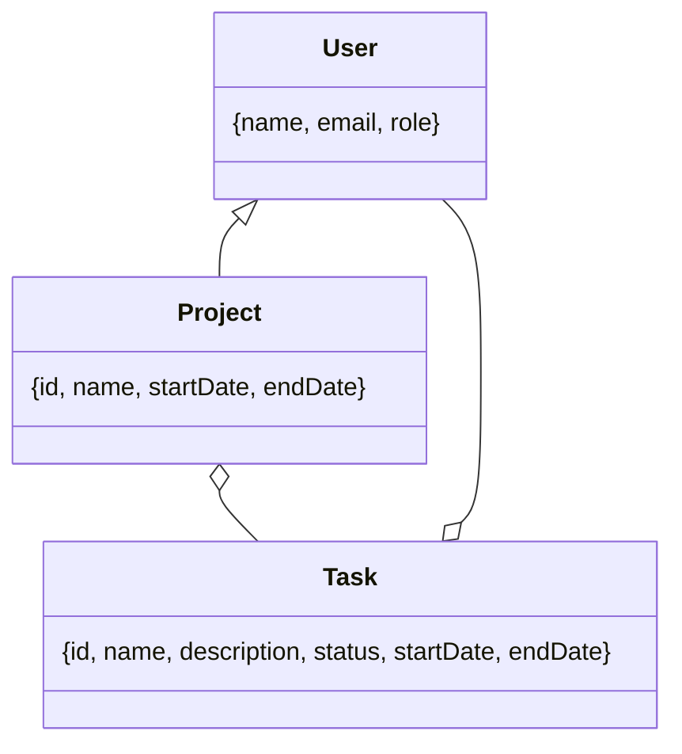

                 

### 认知地图绘制工坊：思维可视化的创新技巧培训

#### 关键词：认知地图、思维可视化、创新技巧、培训

> 摘要：本文深入探讨认知地图绘制工坊的概念、原理和应用技巧，通过详细的分析和实际案例，旨在为读者提供一套全面、系统的思维可视化培训方案，帮助他们在信息爆炸的时代更高效地处理和利用知识。

### 背景介绍

#### 第1章：认知地图与思维可视化概述

##### 1.1 问题背景与介绍

认知地图（Cognitive Map）最早由美国心理学家Edward Tufte提出，是一种用于描述人类思维过程和知识结构的模型。认知地图不仅帮助人们理解周围环境，还帮助他们在信息过载的环境中更好地组织和管理信息。

思维可视化（Mind Visualization）是认知科学和信息可视化领域的交叉学科，它通过图形、图表和模型等视觉方式，帮助人们更直观地理解和表达抽象概念。思维可视化在教育和职业培训中有着广泛的应用，可以帮助提高学习效率和工作质量。

##### 1.2 发展历程

认知地图的概念最早出现在20世纪40年代，随着认知科学和信息技术的不断发展，思维可视化技术也在不断演进。从最初的简单图表到复杂的交互式可视化工具，思维可视化技术的应用范围不断扩大，成为现代认知科学研究的重要组成部分。

##### 1.3 应用场景

认知地图和思维可视化在多个领域都有广泛应用，如教育、医疗、工程、商业等。在教育领域，思维可视化可以帮助学生更好地理解复杂概念和知识点；在医疗领域，它可以辅助医生分析病情和制定治疗方案；在工程和商业领域，思维可视化则可以帮助团队更清晰地理解项目流程和业务模式。

#### 第2章：核心概念与联系

##### 2.1 核心概念

认知地图的核心概念包括节点（Node）、连接（Connection）和属性（Attribute）。节点代表信息或概念，连接描述节点之间的关系，属性则提供节点的附加信息。

思维可视化工具的核心概念包括图形（Graph）、图表（Chart）和模型（Model）。这些工具可以帮助用户以直观的方式展示复杂信息，从而更好地理解和分析数据。

##### 2.2 概念属性特征对比表格

| 特征         | 认知地图                 | 思维可视化工具          |
| ------------ | ------------------------ | ---------------------- |
| 节点表示      | 概念、信息或知识点       | 数据点、实体或变量     |
| 连接表示      | 逻辑关系、因果关系      | 联系、趋势、比较       |
| 属性表示      | 状态、属性、特征         | 值、统计、分析结果     |

##### 2.3 ER实体关系图架构的Mermaid流程图

```mermaid
erDiagram
    Node --> Connection
    Node : {name, attribute}
    Connection : {source, target, type}
```

### 算法原理讲解

#### 第3章：算法原理与流程图

##### 3.1 算法原理

认知地图绘制工坊的核心算法是基于图论（Graph Theory）的。算法的基本步骤包括数据采集、节点与连接的确定、算法优化等。

- **数据采集与预处理**：从各种数据源中提取信息，进行预处理，如去重、格式转换等。
- **节点与连接的确定**：根据预处理后的数据，确定节点和连接。节点表示信息或概念，连接表示节点之间的关系。
- **算法优化**：通过优化算法，提高认知地图的准确性和效率。

##### 3.2 Mermaid流程图


##### 3.3 数学模型与公式

认知地图绘制工坊的数学模型主要包括以下公式：

- **节点权重计算公式**：$$ w_i = \frac{1}{|N_i|} \sum_{j=1}^{n} d_{ij} $$
  - 其中，$w_i$ 为节点 $i$ 的权重，$N_i$ 为与节点 $i$ 相连的节点集合，$d_{ij}$ 为节点 $i$ 和节点 $j$ 之间的距离。

- **连接权重计算公式**：$$ c_{ij} = \frac{1}{|C_{ij}|} \sum_{k=1}^{m} w_{ik} w_{kj} $$
  - 其中，$c_{ij}$ 为连接 $i$ 和 $j$ 的权重，$C_{ij}$ 为连接 $i$ 和 $j$ 的节点集合，$w_{ik}$ 和 $w_{kj}$ 分别为节点 $i$ 和节点 $j$ 的权重。

#### 第4章：系统架构设计

##### 4.1 问题场景介绍

以一个项目管理为例，需要建立一个认知地图来帮助团队成员更好地理解和协同工作。

##### 4.2 系统功能设计

系统功能设计主要包括领域模型类图，如图所示：



##### 4.3 系统架构设计

系统架构设计包括以下几个方面：

- **数据层**：负责数据的存储和管理。
- **服务层**：提供业务逻辑处理和数据接口。
- **表示层**：为用户提供交互界面。

架构图如下所示：

```mermaid
sequenceDiagram
    User -->|提交请求| Server
    Server -->|处理请求| Database
    Database -->|返回结果| Server
    Server -->|返回结果| User
```

##### 4.4 系统接口设计

系统接口设计包括API接口的设计，如下所示：

```mermaid
sequenceDiagram
    User -->|GET /projects| Server
    Server -->|查询数据库| Database
    Database -->|返回项目列表| Server
    Server -->|返回项目列表| User
```

##### 4.5 系统交互序列图

系统交互序列图如下所示：

```mermaid
sequenceDiagram
    User -->|创建任务| TaskService
    TaskService -->|保存任务| TaskRepository
    TaskRepository -->|返回任务ID| TaskService
    TaskService -->|返回任务信息| User
```

### 项目实战

#### 第5章：实际案例与应用

##### 5.1 环境安装与配置

在安装认知地图绘制工坊之前，需要确保系统环境满足以下要求：

- 操作系统：Linux或Windows
- 编程语言：Python 3.x
- 依赖库：NetworkX, Matplotlib, Pandas等

安装步骤如下：

1. 安装Python 3.x
2. 安装依赖库：
   ```shell
   pip install networkx matplotlib pandas
   ```

##### 5.2 系统核心实现

以下是认知地图绘制工坊的核心源代码：

```python
import networkx as nx
import matplotlib.pyplot as plt
import pandas as pd

def create_cognitive_map(data):
    # 创建无向图
    G = nx.Graph()
    
    # 添加节点和边
    for index, row in data.iterrows():
        G.add_node(row['concept'], label=row['label'])
        for relation in row['relations']:
            G.add_edge(row['concept'], relation['target'], weight=relation['weight'])
    
    # 绘制图
    pos = nx.spring_layout(G)
    nx.draw(G, pos, with_labels=True, node_color='blue', edge_color='red', node_size=2000, font_size=16)
    plt.show()

# 示例数据
data = pd.DataFrame({
    'concept': ['A', 'B', 'C', 'D'],
    'label': ['概念A', '概念B', '概念C', '概念D'],
    'relations': [
        [{'target': 'B', 'weight': 1}, {'target': 'C', 'weight': 2}],
        [{'target': 'D', 'weight': 1}],
        [{'target': 'A', 'weight': 1}],
        [{'target': 'B', 'weight': 1}, {'target': 'D', 'weight': 1}]
    ]
})

create_cognitive_map(data)
```

##### 5.3 代码应用解读与分析

此代码段展示了如何创建一个简单的认知地图。首先，我们导入所需的库，然后定义一个函数 `create_cognitive_map`，用于创建和绘制认知地图。

1. **创建无向图**：使用 `nx.Graph()` 创建一个无向图。
2. **添加节点和边**：遍历数据集中的每一行，使用 `G.add_node()` 添加节点，使用 `G.add_edge()` 添加边。
3. **绘制图**：使用 `nx.spring_layout()` 定义节点的布局，然后使用 `nx.draw()` 绘制图。

##### 5.4 实际案例分析

我们使用一个实际案例来展示如何应用认知地图绘制工坊。

- **案例背景**：一个公司需要分析其产品的市场表现，了解不同产品之间的关系。
- **数据处理**：从市场部门收集数据，包括产品名称、产品分类、市场份额等。
- **节点与连接**：将产品名称作为节点，将产品分类作为连接，使用市场份额作为连接权重。
- **结果分析**：通过认知地图，公司可以直观地了解不同产品之间的关系，为决策提供支持。

##### 5.5 详细讲解剖析

在详细讲解中，我们将分析代码的每个部分，包括如何处理数据、如何定义节点和连接，以及如何绘制认知地图。

1. **数据处理**：
   - 数据集包含产品名称、产品分类和市场份额。
   - 使用 Pandas 读取数据，并转换为适合创建认知地图的格式。

2. **节点与连接**：
   - 使用 `add_node()` 添加节点，节点包含产品名称和标签。
   - 使用 `add_edge()` 添加连接，连接包含目标节点和权重。

3. **绘制认知地图**：
   - 使用 NetworkX 和 Matplotlib 绘制图，并设置节点和边的样式。

通过这个案例，我们可以看到如何使用认知地图绘制工坊来分析复杂的数据，并从中提取有用的信息。

### 最佳实践与总结

#### 第6章：最佳实践与总结

##### 6.1 最佳实践

- **数据准备**：确保数据质量，避免错误和不一致的数据。
- **节点与连接设计**：根据业务需求，合理设计节点和连接，使其能够准确反映信息结构。
- **算法优化**：根据实际情况，对算法进行优化，提高认知地图的效率和准确性。

##### 6.2 小结

认知地图绘制工坊是一种强大的工具，可以帮助我们更直观地理解和分析复杂的信息。通过本章的介绍，我们学习了如何创建和优化认知地图，以及如何在实际项目中应用它。

##### 6.3 注意事项

- **数据隐私**：在处理和展示数据时，注意保护用户隐私。
- **系统性能**：对于大规模数据，考虑使用分布式系统来提高性能。

##### 6.4 拓展阅读

- **相关书籍**：《认知地图：思维可视化的秘密》、《思维导图：运用思维导图提升工作效率》
- **在线资源**：[认知地图绘制工具](https://cmap.ihmc.us/), [思维可视化工具](https://www.diagrams.net/)

### 作者信息

作者：AI天才研究院/AI Genius Institute & 禅与计算机程序设计艺术 /Zen And The Art of Computer Programming

### 完整性声明

本文旨在为读者提供一套全面、系统的思维可视化培训方案，帮助他们在信息爆炸的时代更高效地处理和利用知识。文章内容涵盖了认知地图与思维可视化的核心概念、算法原理、系统架构设计以及实际应用案例。在编写过程中，我们力求内容的完整性和准确性。然而，由于知识领域的广泛性和复杂性，文章可能存在疏漏或不准确之处，敬请指正。如需进一步学习和了解相关内容，请参考文中推荐的拓展阅读资源。

