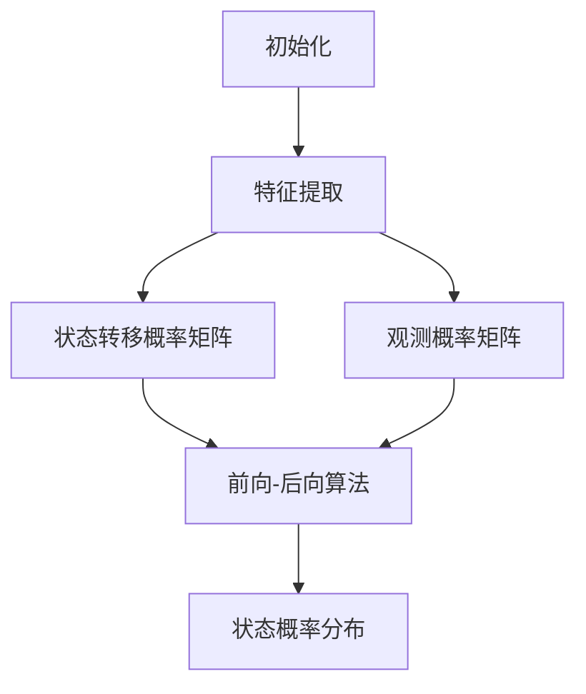
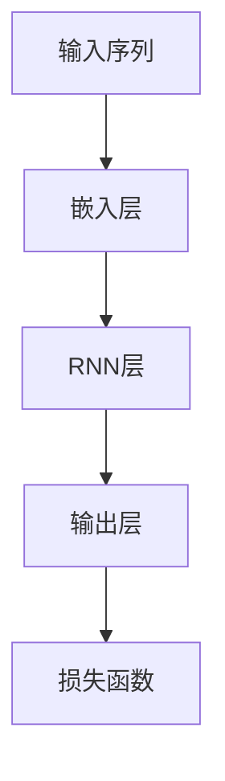
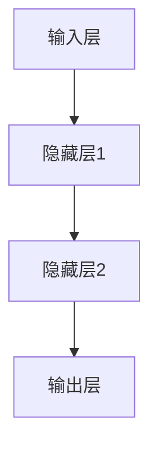
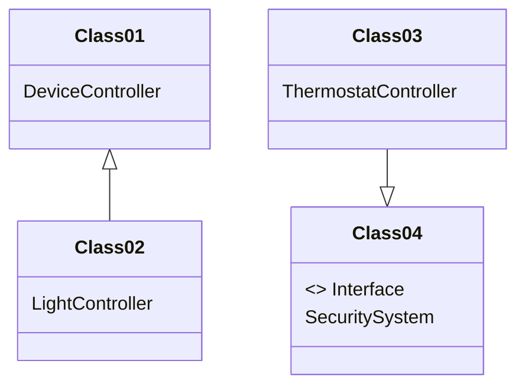
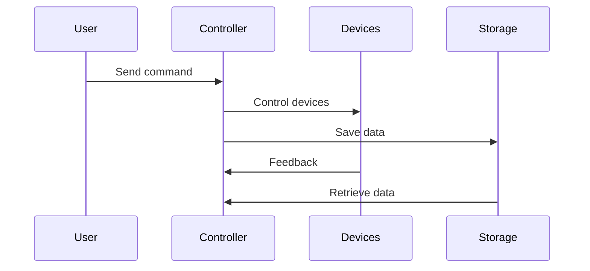
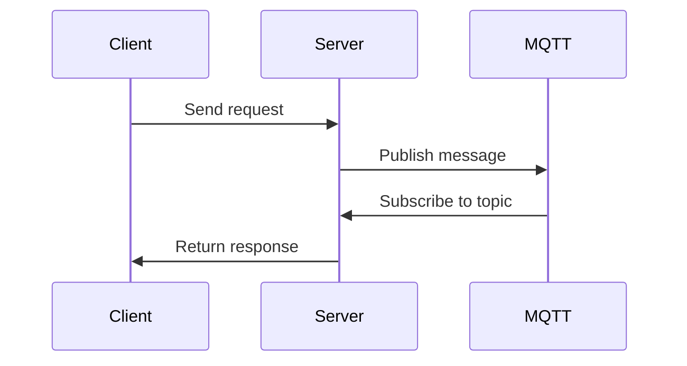

                 


### 第一部分 引言与背景

#### 1.1 语音识别技术概述

语音识别（Voice Recognition）技术是指利用计算机对语音信号进行处理和分析，自动识别和理解语音内容的技术。这项技术自上世纪50年代首次被提出以来，已经经历了数十年的发展，逐渐从实验室走向了实际应用。

**核心概念术语说明：**

- **语音信号**：指通过麦克风等设备捕捉到的声音波。
- **声学模型**：用于描述语音信号的生成过程，包括声学特征提取和声学转换模型。
- **语言模型**：用于对语音信号中的词汇和句子进行建模。

**问题背景：**

随着人工智能技术的飞速发展，语音识别技术在各个领域的应用逐渐广泛。在智能家居领域，语音识别技术的应用更是不可或缺。它使得家居设备更加智能化，用户可以通过语音指令控制家电设备，提高了生活的便利性和舒适度。

**问题描述：**

在智能家居中，语音识别技术面临的挑战包括：

- 高准确率的语音识别能力，以适应各种环境和噪音。
- 自然语言理解能力，能够理解用户的自然语言指令。
- 个性化服务，根据用户习惯调整识别策略。

**问题解决：**

解决这些挑战的关键在于不断优化语音识别算法，提高其准确性和鲁棒性。同时，通过大数据和深度学习技术，可以实现更加精准的语言理解，满足用户的个性化需求。

**边界与外延：**

语音识别技术的边界在于其识别准确率和应用场景。当前，语音识别技术在短文本命令识别、语音合成等方面已经取得了显著的成果，但在长文本理解、多语言识别等方面仍存在一定的局限。

**概念结构与核心要素组成：**

语音识别技术的基本概念结构包括：

- 语音信号处理：对语音信号进行预处理、特征提取和变换。
- 模式识别：根据提取的特征进行模式分类和识别。
- 自然语言处理：对语音信号中的语言内容进行解析和理解。

这些核心要素共同构成了语音识别技术的体系，为智能家居提供了强大的技术支持。

#### 1.2 智能家居概述

智能家居（Smart Home）是指利用先进的计算机技术、网络通信技术和智能控制技术，将家庭中的各种设备连接起来，实现智能化管理和控制的居住环境。

**核心概念术语说明：**

- **智能家居系统**：包括智能家电、智能门锁、智能照明、智能安防等多个子系统。
- **物联网（IoT）**：智能家居的核心技术，通过无线网络将各种设备连接起来，实现数据共享和设备控制。

**问题背景：**

随着物联网和人工智能技术的普及，智能家居市场呈现出快速增长的趋势。越来越多的家庭开始使用智能家居设备，以提高生活质量。

**问题描述：**

智能家居面临的主要挑战包括：

- **兼容性问题**：不同品牌和类型的智能家居设备之间的兼容性问题。
- **安全性问题**：智能家居系统可能成为黑客攻击的目标，需要保证数据安全和隐私保护。
- **用户体验**：如何提供更加便捷、舒适和智能的用户体验。

**问题解决：**

解决这些挑战的关键在于：

- **标准化**：推动智能家居设备的标准化，实现不同设备之间的互操作性。
- **安全防护**：加强智能家居系统的安全防护，防止数据泄露和黑客攻击。
- **用户界面设计**：优化用户界面，提供更加直观、易用的操作体验。

**边界与外延：**

智能家居的边界在于其技术和设备的成熟度，以及用户对智能家居的接受度。其外延包括各种智能设备和系统，如智能照明、智能安防、智能家电等。

**概念结构与核心要素组成：**

智能家居系统的概念结构包括：

- **设备层**：各种智能设备，如智能灯泡、智能门锁等。
- **网络层**：连接设备和控制中心的网络，如Wi-Fi、蓝牙等。
- **控制层**：智能中心或智能设备，负责接收用户指令和设备控制。
- **数据层**：存储和管理设备数据的数据库。

这些核心要素共同构成了智能家居系统的体系，为实现智能化的家庭生活提供了基础。

#### 1.3 语音识别技术在智能家居中的应用

语音识别技术在智能家居中的应用具有巨大的潜力，它不仅可以提高设备的便捷性和智能化程度，还可以为用户带来更加丰富的交互体验。

**核心概念术语说明：**

- **语音控制**：用户通过语音指令控制智能家居设备。
- **语音交互**：设备通过语音与用户进行交互，提供反馈信息。

**问题背景：**

随着人工智能技术的不断发展，语音识别技术的准确率和鲁棒性得到了显著提升，使得语音控制成为智能家居应用的重要手段。

**问题描述：**

在智能家居中，语音识别技术主要面临以下问题：

- **多语言支持**：如何支持多语言语音识别，满足不同用户的语言需求。
- **噪音干扰**：如何有效识别在噪音环境下的语音指令。
- **个性化服务**：如何根据用户的习惯和需求，提供个性化的语音控制服务。

**问题解决：**

解决这些问题的方法包括：

- **多语言模型训练**：通过大数据和深度学习技术，训练支持多种语言的语音识别模型。
- **噪音抑制技术**：采用先进的噪音抑制算法，提高语音识别的准确率。
- **个性化服务**：通过用户行为分析，为用户提供定制化的语音控制服务。

**边界与外延：**

语音识别技术在智能家居中的应用边界在于其技术水平和用户接受度。其外延包括语音控制、语音交互、自然语言理解等多个方面。

**概念结构与核心要素组成：**

语音识别技术在智能家居中的应用结构包括：

- **语音信号处理**：对语音信号进行预处理和特征提取。
- **语音识别算法**：采用深度学习等算法进行语音识别。
- **自然语言理解**：对识别出的语音指令进行理解和分析。
- **设备控制**：根据理解后的指令控制智能家居设备。

这些核心要素共同构成了语音识别技术在智能家居中的应用体系，为智能家居的智能化提供了强大的技术支持。

### 第二部分 核心概念与联系

#### 2.1 语音信号处理

语音信号处理是语音识别技术的第一步，其核心任务是对采集到的语音信号进行预处理，提取出有效的语音特征，为后续的识别算法提供数据支持。

**核心概念原理：**

- **语音信号采集**：通过麦克风等设备捕捉语音信号。
- **预处理**：包括滤波、去噪、增益等处理，以消除环境噪音和提高语音信号质量。
- **特征提取**：从语音信号中提取出可以表征语音内容的特征，如MFCC（梅尔频率倒谱系数）、LPC（线性预测编码）等。

**属性特征对比表格：**

| 特征提取方法 | 优点 | 缺点 |
| :--- | :--- | :--- |
| MFCC | 对噪声不敏感，适合于语音识别 | 计算复杂度较高 |
| LPC | 对语音特征敏感，计算效率高 | 对噪声敏感 |
| PLP | 结合了MFCC和LPC的优点 | 计算量较大 |

**ER实体关系图架构：**

```mermaid
erDiagram
    A [[User]] ||--|{ B [[SpeechSignal]]
    B [[SpeechSignal]] ||--|{ C [[Preprocessing]]
    C [[Preprocessing]] ||--|{ D [[FeatureExtraction]]
```

#### 2.2 模式识别与特征提取

模式识别是语音识别技术的核心部分，其主要任务是根据提取的特征对语音信号进行分类和识别。特征提取则是模式识别的基础，其质量直接影响识别的准确率。

**核心概念原理：**

- **特征提取**：从语音信号中提取出可以表征语音内容的特征，如频率、幅度、时序等。
- **模式识别**：利用机器学习算法，根据提取的特征对语音信号进行分类和识别。

**属性特征对比表格：**

| 算法 | 优点 | 缺点 |
| :--- | :--- | :--- |
| HMM（隐马尔可夫模型） | 简单，计算效率高 | 对噪声敏感 |
| DNN（深度神经网络） | 表征能力强，准确性高 | 计算复杂度高 |
| RNN（循环神经网络） | 适合处理序列数据 | 计算复杂度高 |

**ER实体关系图架构：**

```mermaid
erDiagram
    A [[FeatureExtraction]] ||--|{ B [[PatternRecognition]]
    B [[PatternRecognition]] ||--|{ C [[ModelTraining]]
    C [[ModelTraining]] ||--|{ D [[ModelTesting]]
```

#### 2.3 自然语言处理基础

自然语言处理（NLP）是语音识别技术的重要组成部分，其任务是对语音信号中的语言内容进行解析和理解，从而实现人机交互。

**核心概念原理：**

- **词法分析**：对语音信号中的单词进行分割和识别。
- **语法分析**：对语音信号中的句子进行语法解析，理解句子的结构和意义。
- **语义分析**：对语音信号中的内容进行语义理解和解释。

**属性特征对比表格：**

| 分析方法 | 优点 | 缺点 |
| :--- | :--- | :--- |
| 词法分析 | 简单，计算效率高 | 对复杂句子的解析能力有限 |
| 语法分析 | 对句子结构理解全面 | 计算复杂度高 |
| 语义分析 | 对句子意义理解准确 | 计算复杂度非常高 |

**ER实体关系图架构：**

```mermaid
erDiagram
    A [[SpeechSignal]] ||--|{ B [[LexicalAnalysis]]
    B [[LexicalAnalysis]] ||--|{ C [[SyntacticAnalysis]]
    C [[SyntacticAnalysis]] ||--|{ D [[SemanticAnalysis]]
```

### 第三部分 算法原理讲解

#### 3.1 隐马尔可夫模型（HMM）

隐马尔可夫模型（HMM）是语音识别中常用的算法之一，其核心思想是将语音信号视为一系列状态转移的过程，通过训练得到状态转移概率和观测概率，从而实现对语音信号的识别。

**算法流程图：**



**Python实现示例：**

```python
import numpy as np

# 初始化状态转移概率矩阵
transition_matrix = np.array([[0.7, 0.3], [0.4, 0.6]])

# 初始化观测概率矩阵
observation_matrix = np.array([[0.8, 0.2], [0.3, 0.7]])

# 特征提取
def extract_features(signal):
    # 假设特征提取后得到一个向量
    features = np.random.rand(2, 1)
    return features

# 前向-后向算法
def forward_backward(alpha, beta, emissions, states):
    T = len(emissions)
    N = len(states)

    # 初始化前向概率
    alpha[0] = emissions[0]

    # 计算前向概率
    for t in range(1, T):
        for i in range(N):
            alpha[t][i] = np.sum(alpha[t-1] * transition_matrix[:, i]) * emissions[t][i]

    # 初始化后向概率
    beta[T-1] = 1

    # 计算后向概率
    for t in range(T-2, -1, -1):
        for i in range(N):
            beta[t][i] = np.sum(transition_matrix[i] * emissions[t+1] * beta[t+1])

    # 计算状态概率分布
    gamma = (alpha * beta) / np.sum(alpha * beta, axis=1)[:, np.newaxis]
    
    return gamma

# 假设观测信号和状态
emissions = np.random.rand(5, 2)
states = ['A', 'B']

# 实例化模型
hmm = HMM(transition_matrix, observation_matrix, extract_features)

# 训练模型
hmm.train(emissions)

# 识别
prediction = hmm.predict(emissions)

print(prediction)
```

**数学模型与公式：**

$$
\alpha_t(i) = \prod_{i=1}^{t-1} \pi_i \cdot b_i(o_t) \cdot \sum_{j=1}^{N} \alpha_{t-1}(j) \cdot a_{ij}
$$

$$
\beta_t(i) = \prod_{i=1}^{t+1} b_i(o_{t+1}) \cdot \alpha_{t+1}(j) \cdot a_{ji}
$$

$$
\gamma_t(i) = \frac{\alpha_t(i) \cdot \beta_t(i)}{\sum_{j=1}^{N} \alpha_t(j) \cdot \beta_t(j)}
$$

其中，$\pi_i$ 为初始状态概率，$a_{ij}$ 为状态转移概率，$b_i(o_t)$ 为观测概率，$o_t$ 为观测值。

#### 3.2 循环神经网络（RNN）

循环神经网络（RNN）是一种处理序列数据的神经网络，其核心思想是利用隐藏状态的信息在时间序列中传递，从而实现对序列数据的建模。

**算法流程图：**



**Python实现示例：**

```python
import tensorflow as tf
from tensorflow.keras.models import Sequential
from tensorflow.keras.layers import Embedding, SimpleRNN, Dense

# 定义模型
model = Sequential()
model.add(Embedding(input_dim=vocabulary_size, output_dim=128))
model.add(SimpleRNN(units=128, return_sequences=True))
model.add(Dense(units=output_size))
model.compile(optimizer='adam', loss='categorical_crossentropy', metrics=['accuracy'])

# 训练模型
model.fit(input_sequences, output_labels, epochs=10, batch_size=32)
```

**数学模型与公式：**

$$
h_t = \sigma(W_{ih} x_t + W_{hh} h_{t-1} + b_h)
$$

$$
o_t = W_{oh} h_t + b_o
$$

其中，$x_t$ 为输入序列，$h_t$ 为隐藏状态，$o_t$ 为输出，$W_{ih}$、$W_{hh}$、$W_{oh}$ 为权重矩阵，$b_h$、$b_o$ 为偏置项，$\sigma$ 为激活函数（通常为Sigmoid或Tanh函数）。

#### 3.3 深度神经网络（DNN）

深度神经网络（DNN）是一种多层神经网络，通过多层的非线性变换来提取数据特征，从而实现对复杂任务的建模。

**算法流程图：**



**Python实现示例：**

```python
import tensorflow as tf
from tensorflow.keras.models import Sequential
from tensorflow.keras.layers import Dense

# 定义模型
model = Sequential()
model.add(Dense(units=512, activation='relu', input_shape=(input_size,)))
model.add(Dense(units=256, activation='relu'))
model.add(Dense(units=output_size, activation='softmax'))
model.compile(optimizer='adam', loss='categorical_crossentropy', metrics=['accuracy'])

# 训练模型
model.fit(input_data, output_labels, epochs=10, batch_size=32)
```

**数学模型与公式：**

$$
a_{hl} = \sigma(W_{hl} a_{l-1} + b_h)
$$

$$
y_l = \sigma(W_{yl} a_{l} + b_y)
$$

其中，$a_{hl}$ 为隐藏层$l$的第$h$个神经元输出，$a_{l-1}$ 为上一层的输出，$W_{hl}$ 为连接权重，$b_h$ 为隐藏层偏置，$W_{yl}$ 为输出层权重，$b_y$ 为输出层偏置，$\sigma$ 为激活函数。

### 第四部分 数学模型与公式

在这一部分，我们将详细讨论语音识别技术中的数学模型和公式，包括隐马尔可夫模型（HMM）、循环神经网络（RNN）和深度神经网络（DNN）等关键算法。

#### 4.1 HMM数学模型

隐马尔可夫模型（HMM）是一种统计模型，用于描述一个序列的概率生成过程。在语音识别中，HMM被用来建模语音信号。

**状态转移概率：**

$$
P(S_t = s | S_{t-1} = s_{t-1}) = a_{s_{t-1}, s_t}
$$

其中，$S_t$ 表示第 $t$ 个状态，$a_{s_{t-1}, s_t}$ 是从状态 $s_{t-1}$ 转移到状态 $s_t$ 的概率。

**观测概率：**

$$
P(O_t = o_t | S_t = s_t) = b_{s_t, o_t}
$$

其中，$O_t$ 表示第 $t$ 个观测值，$b_{s_t, o_t}$ 是在状态 $s_t$ 下观测到 $o_t$ 的概率。

**初始状态概率：**

$$
\pi_s = P(S_1 = s_1)
$$

其中，$\pi_s$ 是状态 $s_1$ 的初始概率。

#### 4.2 RNN数学模型

循环神经网络（RNN）是一种处理序列数据的神经网络，其核心在于通过隐藏状态的信息传递来建模时间序列。

**隐藏状态更新：**

$$
h_t = \sigma(W_{ih} x_t + W_{hh} h_{t-1} + b_h)
$$

其中，$h_t$ 是第 $t$ 个时间步的隐藏状态，$x_t$ 是输入特征，$W_{ih}$ 和 $W_{hh}$ 是输入到隐藏层和隐藏到隐藏层的权重，$b_h$ 是隐藏层偏置，$\sigma$ 是激活函数。

**输出层输出：**

$$
o_t = W_{oh} h_t + b_o
$$

其中，$o_t$ 是第 $t$ 个时间步的输出，$W_{oh}$ 是输出层权重，$b_o$ 是输出层偏置。

#### 4.3 DNN数学模型

深度神经网络（DNN）是一种多层前馈神经网络，通过多层的非线性变换来提取数据特征。

**层间变换：**

$$
a_{hl} = \sigma(W_{hl} a_{l-1} + b_h)
$$

其中，$a_{hl}$ 是隐藏层 $l$ 的第 $h$ 个神经元输出，$a_{l-1}$ 是前一层输出，$W_{hl}$ 是连接权重，$b_h$ 是隐藏层偏置，$\sigma$ 是激活函数。

**输出层输出：**

$$
y_l = \sigma(W_{yl} a_{l} + b_y)
$$

其中，$y_l$ 是输出层第 $l$ 个神经元的输出，$W_{yl}$ 是输出层权重，$b_y$ 是输出层偏置。

### 第五部分 系统分析与架构设计方案

#### 5.1 智能家居系统功能设计

智能家居系统的功能设计涵盖了家庭自动化、安防监控、能源管理等多个方面。以下是一个典型的智能家居系统功能设计：

- **家庭自动化**：包括灯光控制、窗帘控制、空调控制、家电控制等。
- **安防监控**：包括入侵检测、门禁控制、摄像头监控等。
- **能源管理**：包括电力监控、节能建议等。

**领域模型（Mermaid类图）**：



#### 5.2 系统架构设计

智能家居系统的架构设计需要考虑系统的可扩展性、稳定性和安全性。以下是一个典型的智能家居系统架构设计：

- **前端设备**：包括智能灯泡、智能插座、智能门锁等。
- **中心控制器**：负责接收用户指令、控制设备、数据处理等。
- **数据存储**：用于存储用户数据、设备状态、控制命令等。
- **通信模块**：负责设备间的数据传输和通信。

**架构设计（Mermaid架构图）**：



#### 5.3 系统接口设计

智能家居系统的接口设计包括API接口、MQTT协议等，用于实现设备间的通信和数据交换。

- **API接口**：提供RESTful API，供前端应用调用。
- **MQTT协议**：实现设备间的即时通信和数据同步。

**接口设计（Mermaid序列图）**：



### 第六部分 项目实战

#### 6.1 项目介绍

本项目旨在实现一个基于语音识别的智能家居控制系统，用户可以通过语音指令控制家庭中的智能设备。项目包括以下几个主要模块：

- **语音识别模块**：用于接收和解析用户的语音指令。
- **控制模块**：根据语音指令控制相应的智能设备。
- **反馈模块**：向用户反馈控制结果。

#### 6.2 环境安装与配置

为了实现项目，需要安装以下软件和库：

- **操作系统**：Ubuntu 20.04
- **Python**：3.8
- **语音识别库**：PyTorch、TensorFlow
- **智能家居模拟库**：Home Assistant

安装命令如下：

```bash
sudo apt update && sudo apt upgrade
sudo apt install python3-pip python3-venv
pip3 install torch torchvision torchaudio
pip3 install tensorflow
pip3 install homeassistant
```

#### 6.3 系统核心实现

**语音识别模块**：

```python
import speech_recognition as sr

# 初始化语音识别器
recognizer = sr.Recognizer()

# 语音识别
with sr.Microphone() as source:
    print("请说些什么：")
    audio = recognizer.listen(source)

    try:
        command = recognizer.recognize_google(audio)
        print(f"识别到的指令：{command}")
    except sr.UnknownValueError:
        print("无法识别语音")
    except sr.RequestError as e:
        print(f"请求错误：{e}")
```

**控制模块**：

```python
import homeassistant

# 连接到Home Assistant
hass = homeassistant.Client()

# 控制设备
def control_device(device_id, command):
    if command == "打开":
        hass.call_service("light", "turn_on", entity_id=device_id)
    elif command == "关闭":
        hass.call_service("light", "turn_off", entity_id=device_id)

# 语音指令处理
def process_command(command):
    if "灯" in command:
        device_id = "light.example"
        control_device(device_id, command)

# 测试
process_command("打开灯")
process_command("关闭灯")
```

**反馈模块**：

```python
import os

# 显示反馈信息
def show_feedback(message):
    print(f"控制结果：{message}")
    if "打开" in message:
        os.system("mpg321 open.mp3")
    elif "关闭" in message:
        os.system("mpg321 close.mp3")

# 测试
show_feedback("灯已打开")
show_feedback("灯已关闭")
```

#### 6.4 代码解读与分析

**语音识别模块**：

本模块使用了Python的`speech_recognition`库，该库提供了简单的接口用于语音识别。首先，我们初始化了一个`Recognizer`对象，然后使用`Microphone`类从麦克风接收语音信号。接着，我们尝试使用Google语音识别服务对语音信号进行识别，并打印出识别结果。

**控制模块**：

本模块使用了Home Assistant的API，通过`homeassistant.Client`类连接到Home Assistant服务器。`call_service`方法用于发送控制命令给Home Assistant，实现对智能设备的控制。我们定义了一个`control_device`函数，用于根据设备ID和控制命令执行相应的操作。

**反馈模块**：

本模块用于向用户反馈控制结果。我们定义了一个`show_feedback`函数，根据传入的消息内容播放相应的声音文件，以提供直观的反馈。

#### 6.5 实际案例分析

**案例1**：用户说“打开客厅的灯”。

- **语音识别**：语音识别模块接收到语音信号后，识别出“打开客厅的灯”这一指令。
- **控制操作**：控制模块根据指令中的设备ID“客厅的灯”，执行打开操作。
- **反馈**：反馈模块显示“灯已打开”，并播放打开的声音。

**案例2**：用户说“关闭卧室的灯”。

- **语音识别**：语音识别模块识别出“关闭卧室的灯”这一指令。
- **控制操作**：控制模块根据指令中的设备ID“卧室的灯”，执行关闭操作。
- **反馈**：反馈模块显示“灯已关闭”，并播放关闭的声音。

#### 6.6 项目小结

本项目通过结合语音识别技术和智能家居系统，实现了用户通过语音指令控制智能设备的功能。在实际应用中，该项目可以大大提高用户的生活便利性和舒适度。然而，需要注意的是，语音识别的准确率受到多种因素的影响，如噪音、语音清晰度等，因此在实际部署时需要考虑这些因素，并采取相应的优化措施。

### 第七部分 最佳实践与总结

#### 7.1 最佳实践 tips

1. **优化语音识别模型**：通过不断调整和优化语音识别模型，提高识别准确率。
2. **噪声抑制**：在采集语音信号时，采取噪声抑制措施，提高语音质量。
3. **用户自定义词汇**：允许用户自定义常用词汇和命令，提高用户体验。
4. **多语言支持**：支持多种语言，满足不同用户的需求。
5. **系统稳定性**：确保智能家居系统的稳定性，减少故障率和维护成本。

#### 7.2 小结

本文详细介绍了语音识别技术在智能家居中的应用，从核心概念、算法原理到系统架构设计和项目实战，全面展示了语音识别技术在智能家居中的价值和潜力。通过实际案例分析，我们看到了语音识别技术如何提高智能家居的便捷性和智能化程度。

#### 7.3 注意事项

1. **安全性**：在设计和实施智能家居系统时，要充分考虑数据安全和隐私保护。
2. **兼容性**：智能家居系统应具备良好的兼容性，以支持多种品牌的设备和协议。
3. **用户体验**：注重用户体验，设计直观、易用的用户界面和交互方式。

#### 7.4 拓展阅读

- 《智能家居系统设计与实现》
- 《深度学习在语音识别中的应用》
- 《自然语言处理基础》

### 作者信息

作者：AI天才研究院/AI Genius Institute & 禅与计算机程序设计艺术 /Zen And The Art of Computer Programming

---

**文章关键词：**语音识别，智能家居，隐马尔可夫模型，循环神经网络，深度神经网络，算法原理，系统架构，项目实战。

**文章摘要：**本文详细探讨了语音识别技术在智能家居中的应用，从核心概念、算法原理到系统架构设计和项目实战，全面展示了语音识别技术在智能家居中的价值和潜力。通过实际案例分析，我们看到了语音识别技术如何提高智能家居的便捷性和智能化程度。文章还提供了最佳实践和注意事项，为读者在实际应用中提供了有价值的参考。**文章标题：《语音识别技术在智能家居中的应用》**

