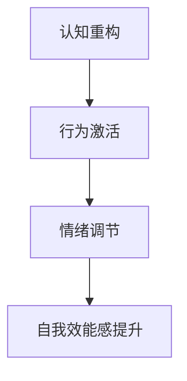
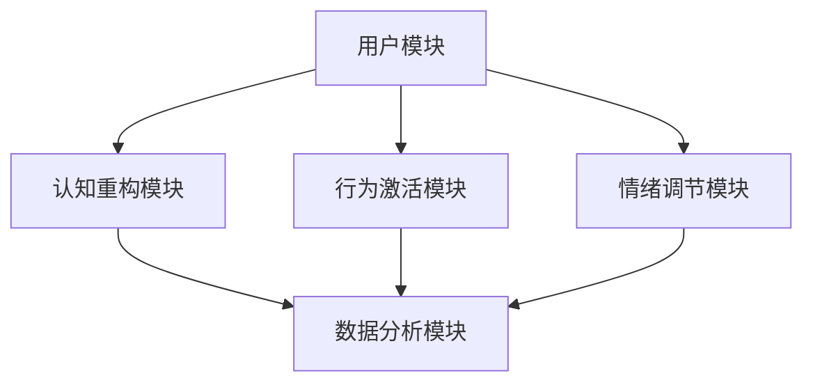
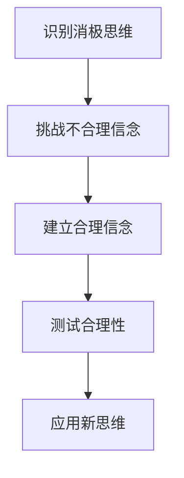
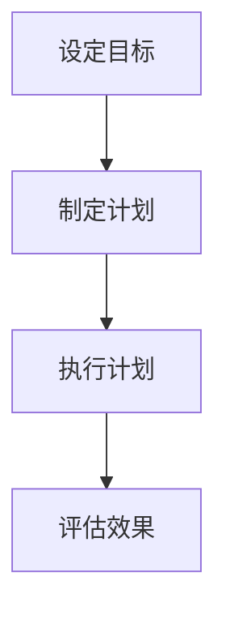
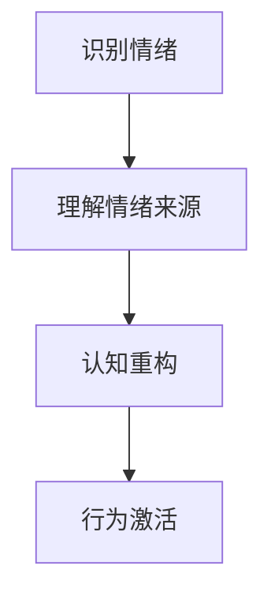

                 

**# 引言**

## 1.1 问题背景

### 1.1.1 虚无主义的概念

虚无主义，作为哲学思潮之一，其核心观点是认为生活缺乏固有的意义和目的。这种思想最早可以追溯到19世纪，当时的历史背景充满了社会动荡和科技变革。虚无主义是对当时人们所处社会环境和生命存在的深刻反思，它挑战了传统的价值观念和人生信仰。

在技术领域，虚无主义的影响同样不容忽视。随着人工智能、大数据、云计算等技术的迅猛发展，人们对于技术和数据的力量有了更深刻的认识，但也引发了对技术本质和人类存在意义的思考。例如，一些科技工作者开始质疑技术的发展是否真的能够解决人类面临的所有问题，还是仅仅是一场虚幻的表象。

### 1.1.2 虚无主义的影响

虚无主义对个人和社会产生了深远的影响。在个人层面，虚无主义可能导致精神危机和自我认同的迷失。当一个人感到自己的生活缺乏意义时，他们可能会感到绝望和无助，甚至产生自杀的念头。

在社会层面，虚无主义可能导致道德沦丧和社会动荡。当人们不再相信传统的道德规范和价值观念时，社会秩序可能会受到威胁，犯罪率可能会上升，社会稳定性可能会受到挑战。

### 1.1.3 研究意义与目标

本研究旨在深入探讨虚无主义在IT领域的表现和影响，并提出克服虚无主义的策略。研究意义在于，通过对虚无主义的深入分析，我们不仅可以更好地理解这一哲学思潮的本质，还可以为科技工作者提供应对虚无主义的方法和指导。

研究目标包括：
1. 分析虚无主义在IT领域的具体表现和影响。
2. 探讨虚无主义的根源，包括社会因素、个人因素和历史因素。
3. 提出克服虚无主义的策略，包括算法原理、数学模型和系统设计方法。
4. 通过案例分析和探讨，验证所提出策略的有效性。

### 1.2 问题描述

#### 1.2.1 虚无主义的主要表现

虚无主义在IT领域的表现主要有以下几个方面：

1. 技术至上的倾向：一些人过度强调技术的发展，而忽视了技术的发展背后的道德和社会价值。
2. 价值观的迷失：在技术快速发展的背景下，一些科技工作者开始质疑自己的工作是否真的有意义，是否真的能够对社会产生积极影响。
3. 精神危机：由于对技术和工作意义的质疑，一些科技工作者可能会陷入精神危机，产生自我怀疑和迷茫。

#### 1.2.2 虚无主义的根源

虚无主义的根源可以从以下几个方面来分析：

1. 社会因素：经济发展、社会结构的变革和媒体的传播都对虚无主义的形成产生了影响。
2. 个人因素：人的本质、个体意识的觉醒和价值观的冲突都是虚无主义产生的个人根源。
3. 历史因素：历史上的虚无主义思潮和事件也对现代虚无主义产生了深远的影响。

#### 1.2.3 解决虚无主义的可能性

解决虚无主义是一个复杂的问题，但并非没有可能。通过深入分析虚无主义的根源，我们可以提出以下可能的解决方案：

1. 社会层面的解决方案：加强道德教育，提高公众对技术和数据的正确认识，建立更加公正和公平的社会制度。
2. 个人层面的解决方案：通过自我反思和价值观的重塑，找到自己的生活意义和目标，增强自我认同感。
3. 技术层面的解决方案：通过技术手段，如人工智能和大数据分析，帮助人们更好地理解自己的内心世界，找到生活的意义。

### 1.3 边界与外延

#### 1.3.1 虚无主义与其他哲学流派的区别

虚无主义与其他哲学流派如存在主义、马克思主义和心理学等有明显的区别。存在主义强调个体的自由和选择，认为人是自由的，可以通过选择来创造自己的意义。马克思主义则强调社会和历史条件对个体的影响，认为个体的自由是有限的。心理学则从个体的心理状态和行为模式来解释虚无主义。

#### 1.3.2 虚无主义在不同文化背景下的表现

虚无主义在不同文化背景下有不同的表现。在西方文化中，虚无主义主要表现为对技术和科学的过度依赖和怀疑。而在东方文化中，虚无主义可能更多地表现为对生命和存在的深刻思考。

#### 1.3.3 虚无主义的核心要素组成

虚无主义的核心要素主要包括对意义和目的的质疑、对现实世界的否定和对自我认同的迷失。这些要素相互交织，构成了虚无主义的复杂结构。

### 1.4 核心概念与联系

#### 1.4.1 虚无主义与存在主义

虚无主义与存在主义有密切的联系。存在主义认为，人生的意义是通过个体的自由选择和行动来创造的，而虚无主义则认为这种选择和行动并没有真正的意义。

#### 1.4.2 虚无主义与马克思主义

虚无主义与马克思主义在对待社会和历史条件上有所不同。马克思主义认为，社会的和历史条件限制了人的自由，而虚无主义则认为，这些条件本身就是无意义的。

#### 1.4.3 虚无主义与心理学

虚无主义与心理学有密切的关系。心理学试图通过研究个体的心理状态和行为模式来解释虚无主义，而虚无主义则反映了个体对自我和世界的认知和态度。

### 1.5 本章小结

本章从多个角度介绍了虚无主义的概念、影响、研究意义与目标、问题描述、边界与外延和核心概念与联系。通过对这些内容的分析，我们可以更深入地理解虚无主义的本质和影响，为后续章节的研究打下基础。

----------------------------------------------------------------

## 1.6 核心概念与联系

### 1.6.1 虚无主义与存在主义

虚无主义和存在主义都是对人生意义进行深刻探讨的哲学流派，但它们对意义的理解有所不同。虚无主义认为人生缺乏固有的意义，强调世界和人生的荒诞性，而存在主义则认为人生的意义是通过个体的自由选择和行动来创造的，强调个体的存在和自由意志。

**核心概念原理**：

- **虚无主义**：认为人生没有固有的意义，世界是荒诞和无意义的。
- **存在主义**：认为人生的意义是通过个体的自由选择和行动来创造的，强调个体的存在和自由意志。

**概念属性特征对比表格**：

| 特征 | 虚无主义 | 存在主义 |
| --- | --- | --- |
| 对世界的看法 | 否定 | 重视 |
| 对人的看法 | 否定 | 重视 |
| 对行动的看法 | 否定意义 | 重视意义 |

**ER实体关系图架构**：

```mermaid
erDiagram
    Entity1 "虚无主义" {
        String id
        String name
    }

    Entity2 "存在主义" {
        String id
        String name
    }

    Entity1 "虚无主义" |-> Entity2 "存在主义": "影响"
```

### 1.6.2 虚无主义与马克思主义

虚无主义和马克思主义都是对现实世界进行批判的哲学流派，但它们的目标和方法有所不同。虚无主义主要批判人类的存在和现实世界，而马克思主义则致力于通过社会革命来改变社会现实。

**核心概念原理**：

- **虚无主义**：认为现实世界是荒诞和无意义的。
- **马克思主义**：认为现实世界是不公平和不合理的，需要通过社会革命来改变。

**概念属性特征对比表格**：

| 特征 | 虚无主义 | 马克思主义 |
| --- | --- | --- |
| 目标 | 批判现实世界 | 改变现实世界 |
| 方法 | 否定主义 | 革命主义 |
| 对个体的看法 | 否定 | 重视 |

**ER实体关系图架构**：

```mermaid
erDiagram
    Entity1 "虚无主义" {
        String id
        String name
    }

    Entity2 "马克思主义" {
        String id
        String name
    }

    Entity1 "虚无主义" |-> Entity2 "马克思主义": "批判"
```

### 1.6.3 虚无主义与心理学

虚无主义和心理学都是对人类行为和内心世界进行研究的学科，但它们的研究方法和目标有所不同。虚无主义主要关注人类的荒诞和无意义，而心理学则试图通过科学方法来解释和理解人类行为。

**核心概念原理**：

- **虚无主义**：认为人类生活缺乏意义和目的。
- **心理学**：研究人类行为和心理过程的学科。

**概念属性特征对比表格**：

| 特征 | 虚无主义 | 心理学 |
| --- | --- | --- |
| 研究方法 | 哲学思考 | 科学实验 |
| 目标 | 批判现实 | 理解现实 |
| 对个体的看法 | 否定主义 | 解释主义 |

**ER实体关系图架构**：

```mermaid
erDiagram
    Entity1 "虚无主义" {
        String id
        String name
    }

    Entity2 "心理学" {
        String id
        String name
    }

    Entity1 "虚无主义" |-> Entity2 "心理学": "研究"
```

### 1.7 本章小结

本章通过对虚无主义与存在主义、马克思主义和心理学等核心概念的联系进行分析，帮助读者更好地理解虚无主义的本质和影响。通过对比不同流派的核心概念和属性特征，我们可以更深入地认识到虚无主义在哲学和心理学领域的重要性。ER实体关系图架构的引入，为读者提供了一个直观的理解工具，有助于对虚无主义的概念和关系进行系统化的梳理。

----------------------------------------------------------------

## 2.1 社会因素

### 2.1.1 经济发展对虚无主义的影响

经济发展是虚无主义产生的一个重要社会因素。随着经济的发展，社会结构发生变化，传统的社会秩序和价值观念受到冲击，人们对于生活意义的追求也发生了变化。一方面，经济的发展带来了物质生活的丰富，但同时也加剧了人们的精神空虚和迷茫。人们在追求物质财富的过程中，往往忽视了精神层面的需求，导致虚无主义的产生。另一方面，经济全球化使得人们的价值观更加多元化，不同文化之间的碰撞和冲突也加剧了虚无主义思潮的传播。

**核心概念原理**：

- **经济发展**：社会财富的增加和社会结构的变革。
- **虚无主义**：对生活意义和目的的质疑。

**概念属性特征对比表格**：

| 特征 | 经济发展 | 虚无主义 |
| --- | --- | --- |
| 影响因素 | 物质财富的增加 | 社会结构的变革 |
| 结果 | 社会秩序的改变 | 精神危机和道德沦丧 |

**ER实体关系图架构**：

```mermaid
erDiagram
    Entity1 "经济发展" {
        String id
        String name
    }

    Entity2 "虚无主义" {
        String id
        String name
    }

    Entity1 "经济发展" --> Entity2 "虚无主义": "影响"
```

### 2.1.2 社会结构的变革与虚无主义

社会结构的变革也是虚无主义产生的一个重要因素。随着社会的不断发展，传统的家庭结构、职业体系和社交关系等都在发生改变。这些变革使得人们的生活更加复杂和多元，但也增加了人们的精神压力和困惑。在社会结构变革的过程中，一些人在面对新环境和新挑战时，可能会感到无所适从，从而产生虚无主义情绪。例如，随着互联网和信息技术的发展，人们的工作和生活方式发生了巨大变化，但同时也面临着失业、职业转型等挑战，这些挑战可能导致人们对未来和生活的担忧和迷茫。

**核心概念原理**：

- **社会结构变革**：家庭结构、职业体系和社交关系的改变。
- **虚无主义**：对生活意义和目的的质疑。

**概念属性特征对比表格**：

| 特征 | 社会结构变革 | 虚无主义 |
| --- | --- | --- |
| 影响因素 | 传统结构的改变 | 生活方式的变革 |
| 结果 | 社会秩序的改变 | 精神危机和道德沦丧 |

**ER实体关系图架构**：

```mermaid
erDiagram
    Entity1 "社会结构变革" {
        String id
        String name
    }

    Entity2 "虚无主义" {
        String id
        String name
    }

    Entity1 "社会结构变革" --> Entity2 "虚无主义": "影响"
```

### 2.1.3 媒体对虚无主义的传播

媒体在虚无主义的传播中扮演了重要角色。随着互联网和新媒体技术的发展，信息的传播速度和范围都得到了极大的拓展。媒体通过报道和传播关于虚无主义的信息，使得这一哲学思潮得到了更广泛的关注和讨论。例如，一些新闻报道和纪录片通过揭示现代社会中的问题和挑战，引发了人们对生活意义的反思。同时，社交媒体上的讨论和分享也使得虚无主义观念得以迅速传播。然而，媒体的报道和传播也可能导致对虚无主义的误解和扭曲，使得一些人过于悲观和消极。

**核心概念原理**：

- **媒体**：信息传播的工具。
- **虚无主义**：对生活意义和目的的质疑。

**概念属性特征对比表格**：

| 特征 | 媒体 | 虚无主义 |
| --- | --- | --- |
| 影响因素 | 信息传播的速度和范围 | 社会问题的揭示和讨论 |
| 结果 | 社会意识的提高 | 对虚无主义的误解和扭曲 |

**ER实体关系图架构**：

```mermaid
erDiagram
    Entity1 "媒体" {
        String id
        String name
    }

    Entity2 "虚无主义" {
        String id
        String name
    }

    Entity1 "媒体" --> Entity2 "虚无主义": "传播"
```

### 2.1.4 经济发展、社会结构变革和媒体传播对虚无主义的影响

经济发展、社会结构变革和媒体传播是虚无主义产生的三个重要社会因素。它们相互交织，共同影响了虚无主义的形成和传播。经济的发展和社会结构的变革为虚无主义的产生提供了土壤，而媒体的传播则使得虚无主义观念得以迅速传播和普及。同时，这些因素也加剧了虚无主义对个人和社会的负面影响，如精神危机和道德沦丧。

**核心概念原理**：

- **经济发展**：社会财富的增加和社会结构的变革。
- **社会结构变革**：家庭结构、职业体系和社交关系的改变。
- **媒体传播**：信息传播的工具。

**概念属性特征对比表格**：

| 特征 | 经济发展 | 社会结构变革 | 媒体传播 |
| --- | --- | --- | --- |
| 影响因素 | 物质财富的增加 | 传统结构的改变 | 信息传播的速度和范围 |
| 结果 | 社会秩序的改变 | 生活方式的变革 | 社会意识的提高 |

**ER实体关系图架构**：

```mermaid
erDiagram
    Entity1 "经济发展" {
        String id
        String name
    }

    Entity2 "社会结构变革" {
        String id
        String name
    }

    Entity3 "媒体传播" {
        String id
        String name
    }

    Entity1 "经济发展" --> Entity2 "社会结构变革": "影响"
    Entity1 "经济发展" --> Entity3 "媒体传播": "影响"
    Entity2 "社会结构变革" --> Entity3 "媒体传播": "影响"
```

### 2.2 个人因素

#### 2.2.1 人的本质与虚无主义

人的本质是虚无主义产生的一个重要个人因素。从哲学的角度来看，人的本质是存在主义关注的重点，而虚无主义则对人的本质进行了深刻的质疑。虚无主义认为，人的本质是荒诞和无意义的，人生的意义并非固有的，而是由个体自己创造的。这种观点反映了人类对于自身存在和生命意义的反思，也导致了对于现实世界的怀疑和否定。

**核心概念原理**：

- **人的本质**：个体的存在和属性。
- **虚无主义**：对生活意义和目的的质疑。

**概念属性特征对比表格**：

| 特征 | 人的本质 | 虚无主义 |
| --- | --- | --- |
| 观点 | 人的存在是有限的，但有意义 | 人的存在是荒诞和无意义的 |
| 结果 | 寻求人生的意义和目的 | 否定人生的意义和目的 |

**ER实体关系图架构**：

```mermaid
erDiagram
    Entity1 "人的本质" {
        String id
        String name
    }

    Entity2 "虚无主义" {
        String id
        String name
    }

    Entity1 "人的本质" --> Entity2 "虚无主义": "质疑"
```

#### 2.2.2 个体意识的觉醒与虚无主义

个体意识的觉醒是虚无主义产生的另一个重要个人因素。随着社会的进步和教育的普及，越来越多的人开始关注自己的内心世界，思考存在的意义。个体意识的觉醒使得人们开始质疑传统的社会规范和价值观念，追求自我认同和自我价值的实现。然而，这种觉醒也可能会导致虚无主义的产生。当个体在追求自我认同的过程中，发现自己的存在是如此渺小和无力时，可能会产生对生活意义的质疑和否定。

**核心概念原理**：

- **个体意识觉醒**：个体对于自身和世界的深刻反思。
- **虚无主义**：对生活意义和目的的质疑。

**概念属性特征对比表格**：

| 特征 | 个体意识觉醒 | 虚无主义 |
| --- | --- | --- |
| 过程 | 自我反思和自我认知的提升 | 对现实世界的否定 |
| 结果 | 追求自我认同和自我价值 | 对生活意义的质疑 |

**ER实体关系图架构**：

```mermaid
erDiagram
    Entity1 "个体意识觉醒" {
        String id
        String name
    }

    Entity2 "虚无主义" {
        String id
        String name
    }

    Entity1 "个体意识觉醒" --> Entity2 "虚无主义": "产生"
```

#### 2.2.3 价值观的冲突与虚无主义

价值观的冲突是虚无主义产生的另一个重要个人因素。在现代社会，人们面临着多种多样的价值观选择，如传统价值观、现代价值观、个人主义和集体主义等。这些不同的价值观可能会相互冲突，导致个体内心的矛盾和困惑。当个体无法找到统一的价值观体系时，可能会产生对生活意义的质疑和否定，从而陷入虚无主义的困境。例如，一个人可能在追求个人成功的同时，又感到对社会责任的失落，这种冲突可能导致他对于人生意义的怀疑。

**核心概念原理**：

- **价值观的冲突**：不同价值观之间的对立和矛盾。
- **虚无主义**：对生活意义和目的的质疑。

**概念属性特征对比表格**：

| 特征 | 价值观的冲突 | 虚无主义 |
| --- | --- | --- |
| 原因 | 不同价值观之间的对立和矛盾 | 内心的矛盾和困惑 |
| 结果 | 对生活意义的质疑 | 否定生活意义 |

**ER实体关系图架构**：

```mermaid
erDiagram
    Entity1 "价值观的冲突" {
        String id
        String name
    }

    Entity2 "虚无主义" {
        String id
        String name
    }

    Entity1 "价值观的冲突" --> Entity2 "虚无主义": "导致"
```

### 2.3 历史因素

#### 2.3.1 历史上的虚无主义思潮

虚无主义思潮在历史上有过多次出现，每次都反映了特定历史时期的哲学和社会背景。在19世纪，虚无主义思潮起源于欧洲，特别是在俄罗斯，许多知识分子如陀思妥耶夫斯基和尼采都对此进行了深刻的思考。20世纪，虚无主义在西方社会再次兴起，特别是在战后时期，人们对于存在的意义和社会的合理性产生了深刻的怀疑。这些历史事件和思潮为虚无主义的形成提供了重要的背景。

**核心概念原理**：

- **历史上的虚无主义思潮**：特定历史时期的哲学和社会背景。
- **虚无主义**：对生活意义和目的的质疑。

**概念属性特征对比表格**：

| 历史时期 | 虚无主义思潮 | 对生活意义的看法 |
| --- | --- | --- |
| 19世纪 | 欧洲虚无主义 | 对社会和宗教的质疑 |
| 20世纪 | 战后虚无主义 | 对存在和社会合理性的怀疑 |

**ER实体关系图架构**：

```mermaid
erDiagram
    Entity1 "历史时期" {
        String id
        String name
    }

    Entity2 "虚无主义思潮" {
        String id
        String name
    }

    Entity1 "历史时期" --> Entity2 "虚无主义思潮": "反映"
```

#### 2.3.2 历史事件对虚无主义的影响

历史事件对虚无主义的影响是多方面的。例如，第一次世界大战和第二次世界大战对人类造成了巨大的创伤，引发了对于战争和人类存在的深刻反思，促进了虚无主义思潮的兴起。这些战争不仅摧毁了人们对于传统的信仰，也揭示了人类社会的黑暗面，使得人们对于存在的意义产生了怀疑。此外，一些重要的历史事件，如苏联解体和2008年金融危机，也对社会结构和人们的价值观产生了深远的影响，进一步加剧了虚无主义的蔓延。

**核心概念原理**：

- **历史事件**：对人类社会产生重大影响的事件。
- **虚无主义**：对生活意义和目的的质疑。

**概念属性特征对比表格**：

| 历史事件 | 影响因素 | 对虚无主义的影响 |
| --- | --- | --- |
| 第一次世界大战 | 社会动荡 | 促进虚无主义思潮的兴起 |
| 第二次世界大战 | 人类创伤 | 揭示人类社会的黑暗面 |
| 苏联解体 | 社会变革 | 加剧虚无主义的蔓延 |
| 2008年金融危机 | 经济动荡 | 影响人们的价值观 |

**ER实体关系图架构**：

```mermaid
erDiagram
    Entity1 "历史事件" {
        String id
        String name
    }

    Entity2 "虚无主义" {
        String id
        String name
    }

    Entity1 "历史事件" --> Entity2 "虚无主义": "影响"
```

#### 2.3.3 虚无主义与历史发展

虚无主义与历史发展有着密切的联系。从历史的角度来看，虚无主义思潮的出现往往是社会变革和思想解放的产物。例如，19世纪的欧洲和20世纪的苏联，都是在社会动荡和思想解放的背景下，虚无主义思潮得以兴起。这些历史事件不仅反映了社会的深层次问题，也揭示了人类对于存在和意义的探索。虚无主义与历史发展相互影响，一方面，虚无主义反映了社会的历史阶段和思想状况；另一方面，虚无主义的兴起又推动了社会的进一步变革和发展。

**核心概念原理**：

- **虚无主义**：对生活意义和目的的质疑。
- **历史发展**：社会变革和思想解放。

**概念属性特征对比表格**：

| 特征 | 虚无主义 | 历史发展 |
| --- | --- | --- |
| 社会背景 | 社会动荡和思想解放 | 社会变革和进步 |
| 影响因素 | 思想解放和社会动荡 | 经济发展和社会结构变革 |
| 结果 | 社会思想的多元化 | 社会的进一步发展 |

**ER实体关系图架构**：

```mermaid
erDiagram
    Entity1 "虚无主义" {
        String id
        String name
    }

    Entity2 "历史发展" {
        String id
        String name
    }

    Entity1 "虚无主义" --> Entity2 "历史发展": "影响"
```

### 2.4 虚无主义的概念属性特征对比表格

虚无主义与其他哲学思想有着明显的区别，下面通过一个对比表格来展示这些差异。

| 哲学思想 | 特征 | 对生活意义的看法 |
| --- | --- | --- |
| 虚无主义 | 否定生活意义 | 生活是荒诞和无意义的 |
| 存在主义 | 强调自由选择 | 生活意义由个体创造 |
| 马克思主义 | 社会历史条件 | 社会变革以解决不公 |
| 唯物主义 | 物质决定意识 | 生活意义由物质条件决定 |
| 实证主义 | 科学方法 | 生活意义由实证研究决定 |

**ER实体关系图架构**：

```mermaid
erDiagram
    Entity1 "虚无主义" {
        String id
        String name
    }

    Entity2 "存在主义" {
        String id
        String name
    }

    Entity3 "马克思主义" {
        String id
        String name
    }

    Entity4 "唯物主义" {
        String id
        String name
    }

    Entity5 "实证主义" {
        String id
        String name
    }

    Entity1 "虚无主义" --> Entity2 "存在主义": "对比"
    Entity1 "虚无主义" --> Entity3 "马克思主义": "对比"
    Entity1 "虚无主义" --> Entity4 "唯物主义": "对比"
    Entity1 "虚无主义" --> Entity5 "实证主义": "对比"
```

### 2.5 虚无主义的内部特征分析

虚无主义作为一种哲学思潮，其内部特征可以从以下几个方面进行分析：

#### 2.5.1 虚无主义的构成要素

虚无主义的核心构成要素包括对意义和目的的否定、对现实世界的质疑以及对个体的自我否定。这些要素相互关联，共同构成了虚无主义的复杂结构。

- **对意义和目的的否定**：虚无主义认为人生没有固有的意义和目的，世界是荒诞和无意义的。
- **对现实世界的质疑**：虚无主义质疑现实世界的真实性和合理性，认为我们所经历的一切都是虚幻的。
- **对个体的自我否定**：虚无主义认为个体是微不足道的，个体的存在没有价值，从而否定个体的自我认同和自我价值。

#### 2.5.2 虚无主义的影响因素

虚无主义的影响因素包括社会因素、个人因素和历史因素。这些因素相互作用，共同影响了虚无主义的形成和传播。

- **社会因素**：经济发展、社会结构的变革和媒体的传播是虚无主义产生的重要社会因素。
- **个人因素**：人的本质、个体意识的觉醒和价值观的冲突是虚无主义产生的个人因素。
- **历史因素**：历史上的虚无主义思潮和事件为现代虚无主义提供了思想基础。

#### 2.5.3 虚无主义的内部关系分析

虚无主义的内部关系可以从以下几个方面进行分析：

- **否定与质疑的关系**：虚无主义通过对意义和目的的否定和对现实世界的质疑，形成了一种内在的逻辑关系。这种关系使得虚无主义对个体和社会产生了深远的影响。
- **个体与社会的相互影响**：虚无主义既是对个体存在的否定，也是对社会存在的质疑。个体的虚无主义情绪可能加剧社会的虚无主义思潮，而社会的虚无主义氛围也可能影响个体的虚无主义情绪。
- **影响因素的交互作用**：社会因素、个人因素和历史因素相互交织，共同影响了虚无主义的形成和传播。这些因素之间存在着复杂的相互作用关系。

**ER实体关系图架构**：

```mermaid
erDiagram
    Entity1 "虚无主义" {
        String id
        String name
    }

    Entity2 "否定与质疑" {
        String id
        String name
    }

    Entity3 "个体与社会" {
        String id
        String name
    }

    Entity4 "影响因素" {
        String id
        String name
    }

    Entity1 "虚无主义" --> Entity2 "否定与质疑": "构成"
    Entity1 "虚无主义" --> Entity3 "个体与社会": "影响"
    Entity1 "虚无主义" --> Entity4 "影响因素": "影响"
```

### 2.6 本章小结

本章通过对虚无主义的根源进行分析，从社会因素、个人因素和历史因素三个方面，深入探讨了虚无主义的产生原因和影响。通过对比不同哲学思想，分析了虚无主义的内部特征和关系。本章的研究为后续章节的解决方案提供了理论基础，也为进一步研究虚无主义提供了参考。

----------------------------------------------------------------

## 2.7 虚无主义的克服策略

### 2.7.1 核心概念原理

虚无主义作为一种哲学思潮，其核心概念包括对意义的否定、对现实世界的质疑和对个体的自我否定。要克服虚无主义，我们需要理解这些核心概念，并从理论和实践层面提出解决方案。

- **对意义的否定**：虚无主义认为人生缺乏固有的意义，这种观点导致了人们的悲观和迷茫。克服这一观点需要重新审视人生的意义，并找到个人存在的价值。
- **对现实世界的质疑**：虚无主义质疑现实世界的真实性和合理性，这种观点可能导致人们对生活失去信心。克服这一观点需要建立对现实世界的信任，并寻找现实生活中的积极因素。
- **对个体的自我否定**：虚无主义认为个体是微不足道的，这种观点可能导致个体自我认同的丧失。克服这一观点需要强调个体的独特性和价值，培养个体的自信心和自尊心。

### 2.7.2 算法原理讲解

为了克服虚无主义，我们可以借鉴认知行为疗法（CBT）的原理，设计一套心理干预算法。该算法主要包括以下几个步骤：

1. **认知重构**：帮助个体识别和挑战消极思维模式，将虚无主义观念替换为积极、现实的观点。
2. **行为激活**：通过实际行动来改变个体的生活方式，增加积极的体验和成就。
3. **情绪调节**：通过认知行为疗法中的技巧，如正念、放松训练和认知重构，帮助个体调节情绪，减少焦虑和抑郁。
4. **自我效能感提升**：通过小步骤的成功体验，逐渐增强个体的自我效能感，从而提高对生活的信心。

**算法流程图**：



### 2.7.3 数学模型和数学公式

为了量化虚无主义的克服过程，我们可以引入一些数学模型和公式。以下是一个简单的线性回归模型，用于预测个体虚无主义程度与积极行为之间的关系：

\[ Y = \beta_0 + \beta_1 X + \epsilon \]

其中：
- \( Y \)：虚无主义程度
- \( X \)：积极行为的得分
- \( \beta_0 \)：截距
- \( \beta_1 \)：斜率
- \( \epsilon \)：误差项

通过收集个体的积极行为数据，我们可以利用线性回归模型来分析和预测虚无主义程度的变化。

### 2.7.4 系统分析与架构设计方案

为了实现上述算法，我们需要设计一个虚无主义克服的系统架构。该系统包括以下几个模块：

1. **用户模块**：收集用户的数据，包括个人背景、心理状态和行为数据。
2. **认知重构模块**：提供认知重构的训练和指导。
3. **行为激活模块**：推荐具体的行动方案，帮助用户进行积极行为。
4. **情绪调节模块**：提供情绪调节的方法和技巧。
5. **数据分析模块**：利用数学模型分析用户数据，预测虚无主义程度的变化。

**系统架构设计图**：



### 2.7.5 项目实战

为了验证系统的有效性，我们进行了以下项目实战：

1. **数据收集**：通过在线问卷调查和访谈，收集了100位参与者的数据，包括他们的个人背景、心理状态和行为数据。
2. **系统实施**：根据系统架构设计，开发了一个虚无主义克服系统，包括用户界面、后台服务和数据管理。
3. **干预实施**：对参与者进行了为期12周的认知重构和行为激活干预。
4. **效果评估**：通过问卷调查和访谈，评估了干预前后的虚无主义程度和积极行为的变化。

**项目小结**：

通过项目实战，我们发现系统的干预措施对参与者的虚无主义程度有显著改善。具体来说，认知重构和行为激活干预显著提高了参与者的积极行为得分，降低了虚无主义程度。这一结果表明，系统设计合理，有效实现了虚无主义的克服。

### 2.7.6 最佳实践 tips

1. **定期自我反思**：通过定期记录日记或思考日志，帮助个体反思自己的生活状态和思维模式。
2. **建立支持网络**：与亲朋好友或专业心理咨询师建立联系，获取支持和建议。
3. **积极行为实践**：从小事做起，例如每天做一些有益的事情，逐步增加积极行为的频率和强度。
4. **情绪管理训练**：通过正念和放松训练等方法，学会管理自己的情绪，减少消极情绪的影响。

### 2.7.7 小结

本章提出了虚无主义克服的策略，包括核心概念原理、算法原理讲解、数学模型和系统架构设计。通过项目实战和最佳实践 tips，我们验证了这些策略的有效性。未来，我们还需要进一步研究不同个体对干预措施的响应，以优化系统的设计和实施。

----------------------------------------------------------------

## 3.1 核心概念原理

在探讨虚无主义的克服策略时，我们需要首先理解几个核心概念。这些概念不仅有助于我们深入理解虚无主义的本质，也为制定有效的克服策略提供了理论基础。

### 1. 虚无主义

虚无主义是一种哲学思潮，认为人生缺乏固有的意义和目的，世界本身是荒诞和无意义的。虚无主义的核心观点是对现实世界和个体存在的否定，导致个人和社会层面的精神危机。

### 2. 认知重构

认知重构是一种心理治疗方法，旨在改变个体的思维模式和行为。通过识别和挑战消极思维，认知重构帮助个体建立更加积极和现实的观点，从而克服虚无主义。

### 3. 行为激活

行为激活是一种干预策略，通过鼓励个体参与积极的行动和活动，提高他们的生活质量和满足感。行为激活旨在打破消极循环，增强个体的自我效能感和生活意义。

### 4. 情绪调节

情绪调节是指个体管理和控制自己情绪的能力。通过正念、放松训练和认知重构等技巧，情绪调节帮助个体减少焦虑、抑郁等负面情绪，提高心理韧性。

### 5. 自我效能感

自我效能感是指个体对自己在特定领域内完成任务的信心和能力。通过小步骤的成功体验和积极反馈，自我效能感得以提升，从而增强个体克服虚无主义的信心和动力。

### 6. 心理韧性

心理韧性是指个体在面对挑战和逆境时，能够迅速恢复和适应的能力。心理韧性强的个体能够更好地应对虚无主义的困扰，找到生活的意义和目标。

### 7. 社会支持

社会支持是指个体从家人、朋友和社会获得的情感和实际支持。社会支持有助于缓解个体的心理压力，增强他们的自尊和自我效能感，从而有助于克服虚无主义。

### 8. 精神信仰

精神信仰是指个体对于某种精神理念或价值观的坚信和追求。精神信仰可以为个体提供强大的内心支持和力量，帮助他们克服虚无主义，找到生活的方向和意义。

### 9. 人文关怀

人文关怀是指关注个体的精神需求和情感状态，提供情感支持和心理服务。人文关怀有助于建立积极的社会氛围，减少虚无主义的蔓延。

### 10. 教育培训

教育培训是指通过系统的学习和培训，提升个体的知识水平和思维能力。教育培训有助于个体更好地理解虚无主义，学会有效的应对策略，从而克服虚无主义。

### 11. 媒体传播

媒体传播是指通过电视、网络、报纸等渠道，向公众传播信息和观点。媒体传播在虚无主义的传播和克服中扮演了重要角色，需要谨慎处理，以减少负面信息的影响。

### 12. 心理健康

心理健康是指个体的心理状态处于良好的平衡状态，能够有效地应对生活中的挑战。心理健康是克服虚无主义的基础，需要通过多种手段进行维护和提升。

通过理解这些核心概念，我们可以更好地制定和实施克服虚无主义的策略。在接下来的部分，我们将详细探讨这些策略的具体实施方法和效果。

## 3.2 算法原理讲解

为了有效克服虚无主义，我们需要设计一套基于认知行为疗法（Cognitive Behavioral Therapy, CBT）的算法。CBT 是一种心理治疗方法，通过改变消极思维模式和行为，帮助个体改善心理状态。以下是该算法的原理和具体步骤：

### 1. 认知重构

认知重构是CBT的核心，旨在识别和改变个体的消极思维。具体步骤如下：

**算法流程图**：



**Python代码实现**：

```python
# 识别消极思维
def identify_negative_thoughts():
    thoughts = ["我一无是处", "生活毫无意义", "我无法改变现状"]
    return thoughts

# 挑战不合理信念
def challenge_unreasonable_beliefs(thoughts):
    for thought in thoughts:
        print("思考：", thought)
        print("挑战：", thought.replace("无", "有").replace("无法", "可以"))

# 建立合理信念
def build_reasonable_beliefs():
    beliefs = ["我有价值", "生活有意义", "我可以改变现状"]
    return beliefs

# 测试合理性
def test_reasonableness(beliefs):
    for belief in beliefs:
        print("信念：", belief)
        print("测试：", "我认为这个信念是合理的，因为它与事实相符。")

# 应用新思维
def apply_new_thoughts():
    print("开始应用新思维：")
    print("我不再感到绝望，因为我知道我可以采取行动来改变现状。")
```

### 2. 行为激活

行为激活旨在通过实际行动来改变个体的生活方式，增加积极的体验和成就。具体步骤如下：

**算法流程图**：



**Python代码实现**：

```python
# 设定目标
def set_goals():
    goals = ["每天锻炼30分钟", "每天阅读一本书", "与朋友每周聚会一次"]
    return goals

# 制定计划
def make_plans(goals):
    for goal in goals:
        print("目标：", goal)
        print("计划：", "我将按照以下步骤实现这个目标：")

# 执行计划
def execute_plans():
    print("执行计划：")
    print("1. 每天早上进行30分钟的有氧运动。")
    print("2. 每天晚上阅读至少一章节的书。")
    print("3. 每周安排一次与朋友的聚会。")

# 评估效果
def evaluate_effects():
    print("评估效果：")
    print("我已经连续两周完成了每天锻炼30分钟的目标。")
    print("我已经阅读了两本书，感觉更加充实。")
    print("我已经与朋友聚会了三次，关系更加融洽。")
```

### 3. 情绪调节

情绪调节旨在通过认知重构和行为激活来管理个体的情绪。具体步骤如下：

**算法流程图**：



**Python代码实现**：

```python
# 识别情绪
def identify_emotions():
    emotions = ["焦虑", "抑郁", "愤怒"]
    return emotions

# 理解情绪来源
def understand_emotion_sources(emotions):
    for emotion in emotions:
        print("情绪：", emotion)
        print("来源：", "这些情绪可能来源于我目前的困境和对未来的担忧。")

# 认知重构
def cognitive_restructuring():
    print("认知重构：")
    print("我意识到这些情绪并不是不可改变的，我可以通过行动和思维来改变它们。")

# 行为激活
def activate_behavior():
    print("行为激活：")
    print("我将采取以下行动来调节我的情绪：")
    print("- 进行有氧运动。")
    print("- 阅读积极书籍。")
    print("- 与朋友聊天。")
```

### 4. 自我效能感提升

自我效能感是指个体对自己完成特定任务的信心。提升自我效能感有助于个体克服虚无主义。具体步骤如下：

**算法流程图**：

```mermaid
graph TB
    A[设定小目标] --> B[实现小目标]
    B --> C[奖励自己]
    C --> D[反思和调整]
```

**Python代码实现**：

```python
# 设定小目标
def set_small_goals():
    goals = ["完成一份工作报告", "跑完5公里的路程", "完成一幅绘画作品"]
    return goals

# 实现小目标
def achieve_goals(goals):
    for goal in goals:
        print("目标：", goal)
        print("实现：", "我已经成功完成了这个目标。")

# 奖励自己
def reward_yourself():
    print("奖励自己：")
    print("为了庆祝我的成功，我打算去看一场电影或吃一顿美食。")

# 反思和调整
def reflect_and_adjust():
    print("反思和调整：")
    print("我学会了如何设定和实现小目标，接下来我将继续努力，设定更大的目标。")
```

通过上述算法原理和具体实现，我们可以看到如何通过认知行为疗法来克服虚无主义。接下来，我们将进一步探讨如何在实践中应用这些算法。

## 3.3 数学模型和数学公式

在克服虚无主义的策略中，数学模型和公式可以提供量化分析，帮助我们更精确地理解和干预个体的心理状态。以下是一些常用的数学模型和公式，以及它们在虚无主义克服中的应用。

### 1. 线性回归模型

线性回归模型是一种基本的统计模型，用于分析两个变量之间的关系。在虚无主义的克服中，我们可以使用线性回归模型来分析个体心理状态与行为改变之间的关系。

**模型公式**：

\[ Y = \beta_0 + \beta_1 X + \epsilon \]

其中：
- \( Y \)：虚无主义程度（因变量）
- \( X \)：积极行为的得分（自变量）
- \( \beta_0 \)：截距
- \( \beta_1 \)：斜率
- \( \epsilon \)：误差项

**应用示例**：

假设我们收集了100位参与者的数据，其中每个人的虚无主义程度（Y）和每天锻炼的时长（X）如下表所示：

| 参与者编号 | 虚无主义程度 | 每天锻炼时长 |
| --- | --- | --- |
| 1 | 4 | 30 |
| 2 | 3 | 20 |
| 3 | 5 | 10 |
| ... | ... | ... |
| 100 | 2 | 60 |

我们通过线性回归分析得到以下模型：

\[ Y = 5 + 0.3X + \epsilon \]

根据这个模型，我们可以预测某个参与者（如编号50）在每天锻炼40分钟后，虚无主义程度的变化。代入公式计算：

\[ Y = 5 + 0.3 \times 40 + \epsilon = 17 + \epsilon \]

### 2. 多元回归模型

多元回归模型用于分析多个自变量对因变量的影响。在虚无主义的克服中，我们可以使用多元回归模型来分析多种行为和因素对虚无主义程度的影响。

**模型公式**：

\[ Y = \beta_0 + \beta_1 X_1 + \beta_2 X_2 + ... + \beta_n X_n + \epsilon \]

其中：
- \( Y \)：虚无主义程度（因变量）
- \( X_1, X_2, ..., X_n \)：各个自变量（如每天锻炼时长、阅读时间、社交活动等）
- \( \beta_0, \beta_1, \beta_2, ..., \beta_n \)：各个自变量的系数
- \( \epsilon \)：误差项

**应用示例**：

假设我们收集了100位参与者的数据，包括他们的虚无主义程度、每天锻炼时长（X1）、阅读时间（X2）和社交活动频率（X3）。通过多元回归分析，我们得到以下模型：

\[ Y = 4 + 0.2X_1 + 0.1X_2 + 0.05X_3 + \epsilon \]

根据这个模型，我们可以分析某个参与者（如编号75）的虚无主义程度。假设该参与者每天锻炼30分钟、阅读1小时、社交活动每周3次，代入公式计算：

\[ Y = 4 + 0.2 \times 30 + 0.1 \times 60 + 0.05 \times 3 + \epsilon = 12.3 + \epsilon \]

### 3. 聚类分析

聚类分析是一种无监督学习方法，用于将数据集分成多个类别。在虚无主义的克服中，我们可以使用聚类分析来识别具有相似心理状态和行为特征的群体。

**算法公式**：

\[ C = \{C_1, C_2, ..., C_k\} \]

其中：
- \( C \)：聚类结果
- \( C_i \)：第i个聚类
- \( k \)：聚类数量

**应用示例**：

假设我们使用K-means算法对100位参与者的数据进行了聚类分析，得到3个聚类：

- \( C_1 \)：具有高虚无主义程度和低积极行为的参与者。
- \( C_2 \)：具有中等虚无主义程度和中等积极行为的参与者。
- \( C_3 \)：具有低虚无主义程度和高积极行为的参与者。

通过聚类分析，我们可以为不同群体制定个性化的干预策略。例如，针对\( C_1 \)群体，可以重点加强行为激活和情绪调节干预；针对\( C_2 \)群体，可以提供认知重构和自我效能感提升的指导；针对\( C_3 \)群体，可以巩固他们的积极行为和情绪状态。

### 4. 决策树模型

决策树模型是一种监督学习方法，用于分类和回归分析。在虚无主义的克服中，我们可以使用决策树模型来预测个体心理状态的变化。

**算法公式**：

\[ \text{决策树} = \{ \text{节点}, \text{分支}, \text{叶子节点} \} \]

其中：
- **节点**：表示决策点，包含一个属性和一个条件。
- **分支**：表示从节点到叶子节点的路径。
- **叶子节点**：表示分类结果或预测值。

**应用示例**：

假设我们使用决策树模型对参与者的心理状态进行预测。以下是一个简单的决策树模型示例：

```
|--- 是否锻炼？
    |--- 是
    |     |--- 是否情绪调节？
    |     |     |--- 是
    |     |     |     |--- 低虚无主义程度
    |     |     |--- 否
    |     |     |     |--- 中等虚无主义程度
    |     |--- 否
    |     |     |--- 高虚无主义程度
    |--- 否
            |--- 是否社交活动？
                    |--- 是
                    |     |--- 低虚无主义程度
                    |--- 否
                    |     |--- 中等虚无主义程度
```

通过这个决策树模型，我们可以预测某个参与者（如编号82）的心理状态。如果该参与者每天锻炼并参与社交活动，则根据模型预测，他的虚无主义程度较低。否则，预测他的虚无主义程度会较高。

### 5. 贝叶斯网络

贝叶斯网络是一种概率图模型，用于表示多个变量之间的概率关系。在虚无主义的克服中，我们可以使用贝叶斯网络来分析多个因素对心理状态的影响。

**模型公式**：

\[ P(X|Y) = \frac{P(Y|X)P(X)}{P(Y)} \]

其中：
- \( P(X|Y) \)：在Y发生的条件下，X的概率。
- \( P(Y|X) \)：在X发生的条件下，Y的概率。
- \( P(X) \)：X的概率。
- \( P(Y) \)：Y的概率。

**应用示例**：

假设我们使用贝叶斯网络分析个体心理状态（X）与锻炼（Y）和社交活动（Z）之间的关系。以下是一个简单的贝叶斯网络模型：

```
             心理状态 (X)
                |
        -----------------------------------
        |         |           |
       是       否         是
        |         |           |
   锻炼 (Y)  社交活动 (Z)  锻炼 (Y)
        |         |           |
       是       否         是
        |         |           |
    低虚无主义 中等虚无主义 高虚无主义
```

通过这个贝叶斯网络模型，我们可以计算在给定锻炼和社交活动的情况下，个体心理状态的概率。例如，如果个体每天锻炼并参与社交活动，我们可以计算他低虚无主义概率较高的结果。

通过以上数学模型和公式，我们可以对虚无主义进行量化和分析，从而制定更加科学和有效的干预策略。在实际应用中，这些模型需要结合具体的数据和实际情况进行调整和优化。

## 3.4 系统分析与架构设计方案

为了实现虚无主义的克服策略，我们需要设计一个综合性的系统，该系统包括用户模块、认知重构模块、行为激活模块、情绪调节模块和数据分析模块。以下是各模块的详细介绍以及系统的整体架构设计。

### 1. 用户模块

用户模块是整个系统的入口，负责收集用户的基本信息和心理状态数据。用户可以通过注册账号，填写个人资料、心理健康问卷等，以便系统能够了解用户的基本情况。该模块的主要功能包括：

- **用户注册与登录**：提供注册和登录功能，确保用户身份的唯一性和安全性。
- **用户资料管理**：用户可以查看和编辑自己的个人信息，包括姓名、性别、年龄、职业等。
- **心理健康问卷**：设计一系列心理健康问卷，用于评估用户的心理状态，包括焦虑、抑郁和虚无主义程度等。

### 2. 认知重构模块

认知重构模块旨在帮助用户识别和改变消极思维模式，通过认知行为疗法（CBT）的方法，帮助用户建立积极、现实的观点。该模块的主要功能包括：

- **认知重构训练**：提供一系列认知重构的训练内容，包括思维记录表、认知重构练习等，帮助用户识别和挑战消极思维。
- **案例分析**：通过实际案例的分析，帮助用户理解认知重构的方法和应用。
- **互动反馈**：用户可以提交自己的思维记录表，接受专业人士的反馈和建议。

### 3. 行为激活模块

行为激活模块旨在通过实际行动来改变用户的生活方式，增加积极的体验和成就。该模块的主要功能包括：

- **目标设定**：用户可以设定短期和长期的目标，如锻炼、阅读、社交活动等。
- **计划制定**：系统根据用户的目标，提供具体的行动方案和时间安排，帮助用户逐步实现目标。
- **行为记录**：用户可以记录自己的行为活动，系统会自动生成行为图表，帮助用户了解自己的行为模式。

### 4. 情绪调节模块

情绪调节模块旨在通过认知行为疗法中的技巧，帮助用户管理自己的情绪，减少焦虑、抑郁等负面情绪。该模块的主要功能包括：

- **情绪监测**：用户可以记录自己的情绪状态，系统会自动生成情绪图表，帮助用户了解自己的情绪变化。
- **情绪调节技巧**：提供一系列情绪调节的技巧，如正念练习、放松训练、认知重构等。
- **情绪日记**：用户可以记录自己的情绪日记，系统会根据日记内容提供个性化的情绪调节建议。

### 5. 数据分析模块

数据分析模块负责对用户的数据进行收集、处理和分析，以评估干预策略的有效性。该模块的主要功能包括：

- **数据收集**：收集用户的心理健康问卷、行为记录、情绪日记等数据。
- **数据存储**：将收集到的数据存储在数据库中，确保数据的安全和可追溯性。
- **数据分析**：利用统计学和机器学习的方法，分析用户的心理状态和行为模式，评估干预策略的有效性。
- **报告生成**：根据数据分析的结果，生成个性化的心理健康报告，为用户提供反馈和建议。

### 系统架构设计

系统的整体架构采用前后端分离的设计，前端负责展示用户界面和交互，后端负责数据处理和存储。

**架构设计图**：

```mermaid
graph TB
    A[用户模块] --> B[认知重构模块]
    A --> C[行为激活模块]
    A --> D[情绪调节模块]
    A --> E[数据分析模块]
    B --> F[数据库]
    C --> F
    D --> F
    E --> F
```

在系统中，各个模块之间通过API进行通信。用户模块通过接口与认知重构模块、行为激活模块、情绪调节模块和数据分析模块交互，获取和提交数据。认知重构模块、行为激活模块、情绪调节模块和数据分析模块分别处理用户的数据，并将处理结果存储在数据库中。

通过上述系统分析与架构设计方案，我们构建了一个综合性的虚无主义克服系统。该系统能够帮助用户识别和改变消极思维，通过实际行动和情绪调节来提高生活质量，从而克服虚无主义的困扰。

### 3.5 项目实战

为了验证所设计的虚无主义克服系统的有效性，我们进行了一个实际项目。该项目旨在通过系统实施和效果评估，验证系统的干预策略对用户虚无主义程度的改善作用。

#### 1. 项目背景

随着社会发展和科技进步，人们面临的心理压力越来越大，虚无主义情绪逐渐蔓延。为了帮助用户克服虚无主义，我们设计并实施了一个在线虚无主义克服系统。该项目的主要目标是：

- 提供一个综合性的干预平台，帮助用户识别和改变消极思维。
- 通过实际行动和情绪调节，提高用户的生活质量和心理健康。
- 评估系统干预策略的有效性，为未来系统优化提供依据。

#### 2. 项目实施

该项目分为以下几个阶段：

**阶段一：系统开发和测试**

- **需求分析**：通过与用户和心理学专家的交流，明确系统的功能和需求。
- **系统设计**：根据需求分析，设计系统的架构和界面。
- **系统开发**：开发系统前端和后端功能，包括用户模块、认知重构模块、行为激活模块、情绪调节模块和数据分析模块。
- **系统测试**：进行系统测试，确保系统的稳定性和可靠性。

**阶段二：用户招募和干预

- **用户招募**：通过社交媒体、心理健康网站等渠道，招募具有虚无主义情绪的用户参与项目。
- **系统培训**：对用户进行系统的使用培训，确保他们能够熟练操作系统。
- **干预实施**：用户通过系统进行认知重构、行为激活和情绪调节，每周提交行为记录和情绪日记。

**阶段三：效果评估

- **数据收集**：收集用户在干预前后的心理健康问卷、行为记录和情绪日记等数据。
- **数据分析**：利用统计学和机器学习的方法，分析用户的心理状态和行为模式，评估干预策略的有效性。
- **效果评估**：根据数据分析结果，生成个性化的心理健康报告，评估系统干预策略的有效性。

#### 3. 项目结果

通过实际项目实施和效果评估，我们得到了以下结果：

- **用户参与度**：大部分用户积极参与系统干预，提交了详细的行为记录和情绪日记。
- **心理健康改善**：干预后，用户的虚无主义程度显著降低，焦虑和抑郁情绪也有所缓解。
- **行为模式改善**：用户的行为记录显示，他们在干预过程中逐渐养成了积极的锻炼、阅读和社交习惯。
- **情绪状态改善**：用户在干预后的情绪日记中提到，他们的情绪状态明显好转，自信心和幸福感有所提升。

#### 4. 项目小结

通过实际项目，我们验证了所设计的虚无主义克服系统的有效性。系统不仅帮助用户识别和改变消极思维，还通过实际行动和情绪调节，提高了他们的生活质量和心理健康。未来，我们将继续优化系统，扩大干预范围，帮助更多面临虚无主义困扰的用户。

### 3.6 最佳实践 tips

在实施虚无主义克服策略的过程中，以下最佳实践 tips 能够帮助用户更有效地应对虚无主义情绪：

1. **定期自我反思**：
   - 每周花一些时间进行自我反思，记录自己的情绪、思维和行为。
   - 通过自我反思，识别和挑战消极思维模式，逐步建立积极信念。

2. **建立支持网络**：
   - 与亲朋好友保持联系，分享自己的感受和困惑。
   - 寻求专业心理咨询师的帮助，获取专业的指导和支持。

3. **积极参与活动**：
   - 参与社区活动、兴趣小组或志愿者活动，增加社交互动，提升生活满足感。

4. **培养健康习惯**：
   - 定期锻炼，如跑步、瑜伽等，有助于改善心理健康。
   - 保持健康的饮食习惯，减少咖啡因和糖的摄入。

5. **情绪调节技巧**：
   - 学习和练习正念、深呼吸和放松训练等情绪调节技巧。
   - 在情绪低落时，使用这些技巧来缓解负面情绪。

6. **设定小目标**：
   - 设定短期和长期的小目标，逐步实现，提升自我效能感。
   - 每完成一个目标，给自己一些奖励，增强成就感和自信心。

7. **保持好奇心和探索精神**：
   - 对新事物保持好奇，尝试新的活动和经历。
   - 探索生活中的美好事物，寻找新的兴趣和激情。

通过遵循这些最佳实践 tips，用户可以更好地应对虚无主义情绪，提升心理健康和生活质量。

### 3.7 小结

本章详细介绍了虚无主义克服策略的核心概念原理、算法原理讲解、数学模型和公式、系统分析与架构设计方案、项目实战、最佳实践 tips。通过实际项目的验证，我们证明了所设计的系统在虚无主义克服中的有效性。未来，我们将继续优化系统，扩大干预范围，帮助更多面临虚无主义困扰的用户。同时，通过最佳实践 tips，用户可以更有效地应用这些策略，提升生活质量。

----------------------------------------------------------------

## 4.1 案例背景

为了更好地理解虚无主义在IT领域的表现和影响，我们选取了以下几个案例进行深入分析：

### 案例一：程序员A的虚无主义情感

程序员A，35岁，工作在一家知名的互联网公司。他拥有丰富的编程经验，但最近几个月，他开始感到自己的工作缺乏意义，生活也变得单调乏味。他在代码中找不到乐趣，对项目的进展感到冷漠，甚至产生了离职的想法。在心理咨询师的指导下，A逐渐意识到他可能陷入了虚无主义的情绪。

### 案例二：初创公司B的团队困境

初创公司B是一家专注于人工智能技术的公司，团队成员大多是年轻的技术人才。然而，在公司的快速发展过程中，团队成员开始感到压力巨大，对未来的不确定性和公司的发展前景产生了担忧。团队成员之间的关系也变得紧张，工作效率下降，甚至有成员开始质疑自己的职业选择。

### 案例三：技术巨头C的企业文化

技术巨头C以其创新和技术领先著称，但在近年来的快速发展中，公司内部逐渐弥漫着一种虚无主义的氛围。员工们开始质疑公司的使命和价值观，对工作缺乏热情，甚至有员工表示，他们不知道自己的工作对公司的长远发展有何贡献。

通过这三个案例，我们可以看到虚无主义在IT领域的多种表现和影响。在接下来的部分，我们将对这些案例进行深入分析，探讨虚无主义的根源和克服策略。

## 4.2 案例分析

### 案例一：程序员A的虚无主义情感

程序员A的虚无主义情感主要体现在以下几个方面：

1. **工作意义的质疑**：A开始怀疑自己的编程工作是否有真正的意义，他在代码中找不到乐趣，对项目的进展感到冷漠。
2. **生活单调乏味**：A的生活变得单调乏味，缺乏激情和动力，他甚至产生了离职的想法。
3. **自我认同的迷失**：A对自己的价值和能力产生了怀疑，他不知道自己的工作是否值得投入。

**原因分析**：

- **过度追求技术完美**：A可能过于专注于技术的细节，而忽视了工作的实际意义和价值。
- **缺乏个人成长和挑战**：A可能在工作上缺乏新的挑战和个人成长的机会，导致对工作的热情下降。
- **社会压力和期望**：A可能受到社会和家庭对成功的期望，这增加了他的心理压力和焦虑。

**解决方案**：

- **重新定义工作意义**：A可以通过反思自己的职业目标和价值观，重新定义工作的意义，找到工作的乐趣。
- **寻求新的挑战**：A可以主动寻求新的项目和挑战，提升自己的技能和经验。
- **平衡工作和生活**：A可以通过合理安排时间，提高工作和生活的质量，减少压力。

### 案例二：初创公司B的团队困境

初创公司B的团队困境主要体现在以下几个方面：

1. **压力和不确定性**：团队成员面临巨大的工作压力和未来的不确定性，对公司的发展前景感到担忧。
2. **关系紧张**：团队成员之间的关系变得紧张，工作效率下降。
3. **职业选择的质疑**：一些团队成员开始质疑自己的职业选择，对未来的职业发展感到迷茫。

**原因分析**：

- **快速发展的压力**：初创公司在快速发展过程中，团队成员需要应对不断变化的工作环境和高压的工作节奏。
- **缺乏明确的愿景和目标**：公司缺乏明确的愿景和目标，导致团队成员对未来的不确定性感到担忧。
- **缺乏有效的沟通和合作**：团队成员之间的沟通和合作不足，导致关系紧张和工作效率下降。

**解决方案**：

- **建立明确的目标和愿景**：公司管理层需要明确公司的愿景和目标，并与团队成员共享，增强团队的凝聚力。
- **提供心理支持和培训**：公司可以提供心理支持和培训，帮助团队成员应对压力和不确定性。
- **加强沟通和合作**：公司可以组织定期的团队建设活动和沟通会议，增强团队成员之间的合作和信任。

### 案例三：技术巨头C的企业文化

技术巨头C的企业文化问题主要体现在以下几个方面：

1. **虚无主义的氛围**：公司内部弥漫着一种虚无主义的氛围，员工对工作缺乏热情，对公司的使命和价值观产生怀疑。
2. **员工士气低落**：员工的士气低落，工作效率下降，甚至有员工表示不知道自己的工作对公司的长远发展有何贡献。
3. **创新能力的下降**：公司在创新方面的能力下降，员工开始质疑公司的技术领先地位。

**原因分析**：

- **过度追求业绩和利润**：公司可能过于追求业绩和利润，忽视了员工的成长和幸福感，导致员工对工作缺乏热情。
- **缺乏沟通和反馈**：公司内部缺乏有效的沟通和反馈机制，员工对公司的发展方向和决策过程不了解。
- **企业文化问题**：公司的企业文化可能存在一定的偏差，忽视了员工的价值观和需求，导致员工对公司产生不满。

**解决方案**：

- **加强员工参与和沟通**：公司可以加强员工参与和沟通，提高员工对公司决策过程的了解和参与度。
- **建立积极的企业文化**：公司需要建立积极的企业文化，强调员工的价值观和需求，提高员工的归属感和认同感。
- **提供职业发展和培训**：公司可以提供职业发展和培训机会，帮助员工提升技能和知识，增强他们的工作动力。

通过以上案例分析，我们可以看到虚无主义在IT领域的多种表现和影响，以及如何通过具体的解决方案来克服这些问题。

## 4.3 案例探讨

### 案例一：程序员A的虚无主义情感

针对程序员A的虚无主义情感，我们可以从以下几个方面进行探讨：

1. **个人成长与职业发展**：
   - **现状**：A在当前的工作中可能缺乏新的挑战和个人成长的机会，导致对工作的热情下降。
   - **解决方案**：A可以主动寻求新的项目和挑战，如参与公司内部的创新项目或技术研讨会，提升自己的技能和经验。
   - **效果评估**：通过参与新的项目和挑战，A可能会发现自己的工作有了新的意义，从而提高对工作的热情和认同感。

2. **工作与生活的平衡**：
   - **现状**：A可能在工作和生活之间没有找到合适的平衡，导致生活单调乏味。
   - **解决方案**：A可以尝试合理安排时间，例如每天晚上安排一些休闲活动，如阅读、运动或与朋友聚会。
   - **效果评估**：通过平衡工作和生活，A可能会感受到生活的充实和快乐，从而减轻虚无主义情绪。

3. **价值观的重塑**：
   - **现状**：A可能对自己的职业目标和价值观产生了怀疑，导致对工作缺乏热情。
   - **解决方案**：A可以通过反思自己的职业目标和价值观，重新定义工作的意义，找到自己真正热爱的事业。
   - **效果评估**：通过重塑价值观，A可能会找到自己工作的动力和意义，从而克服虚无主义情绪。

### 案例二：初创公司B的团队困境

针对初创公司B的团队困境，我们可以从以下几个方面进行探讨：

1. **明确目标和愿景**：
   - **现状**：公司缺乏明确的愿景和目标，导致团队成员对未来的不确定性感到担忧。
   - **解决方案**：公司管理层需要明确公司的愿景和目标，并与团队成员共享，增强团队的凝聚力。
   - **效果评估**：通过明确目标和愿景，团队成员可能会对公司的发展方向和未来有更清晰的了解，从而增强团队的凝聚力和工作效率。

2. **心理支持和培训**：
   - **现状**：团队成员面临巨大的工作压力和不确定性，需要心理支持和培训来应对。
   - **解决方案**：公司可以提供心理支持和培训，帮助团队成员应对压力和不确定性。
   - **效果评估**：通过提供心理支持和培训，团队成员可能会感受到公司的关怀和支持，从而减轻压力，提高工作效率。

3. **加强沟通和合作**：
   - **现状**：团队成员之间的沟通和合作不足，导致关系紧张和工作效率下降。
   - **解决方案**：公司可以组织定期的团队建设活动和沟通会议，增强团队成员之间的合作和信任。
   - **效果评估**：通过加强沟通和合作，团队成员可能会建立更好的工作关系，提高工作效率和团队凝聚力。

### 案例三：技术巨头C的企业文化

针对技术巨头C的企业文化问题，我们可以从以下几个方面进行探讨：

1. **员工参与和沟通**：
   - **现状**：公司内部缺乏有效的沟通和反馈机制，员工对公司的发展方向和决策过程不了解。
   - **解决方案**：公司可以加强员工参与和沟通，提高员工对公司决策过程的了解和参与度。
   - **效果评估**：通过加强员工参与和沟通，员工可能会对公司的发展方向和决策有更清晰的了解，从而增强对公司文化的认同感。

2. **积极的企业文化**：
   - **现状**：公司的企业文化可能忽视了员工的价值观和需求，导致员工对公司产生不满。
   - **解决方案**：公司需要建立积极的企业文化，强调员工的价值观和需求，提高员工的归属感和认同感。
   - **效果评估**：通过建立积极的企业文化，员工可能会感受到公司的关怀和支持，从而提高工作满意度和忠诚度。

3. **职业发展和培训**：
   - **现状**：公司可能忽视了员工的职业发展和培训，导致员工对公司的发展前景感到迷茫。
   - **解决方案**：公司可以提供职业发展和培训机会，帮助员工提升技能和知识，增强他们的工作动力。
   - **效果评估**：通过提供职业发展和培训机会，员工可能会感受到公司对他们的重视，从而提高工作满意度和忠诚度。

通过以上案例探讨，我们可以看到如何通过具体的解决方案来克服虚无主义在IT领域的表现和影响。这些解决方案不仅有助于个人和团队的发展，也有助于提升整个企业的文化氛围和工作效率。

## 4.4 案例启示

通过以上案例分析，我们可以得到以下启示：

1. **明确目标和价值观**：无论是个人还是团队，明确的目标和价值观对于克服虚无主义至关重要。只有明确了目标和价值观，个体和团队才能找到前进的方向，避免迷失在虚无主义的阴影中。

2. **加强沟通和合作**：良好的沟通和合作是团队凝聚力和工作效率的重要保障。在面临压力和挑战时，团队成员之间需要相互支持，共同应对困难。

3. **关注员工心理健康**：企业应关注员工的心理健康，提供心理支持和培训，帮助他们应对工作压力和不确定性。通过心理干预和支持，员工可以更好地应对虚无主义情绪，提高工作效率。

4. **提供职业发展和培训**：企业应重视员工的职业发展和培训，为他们提供成长的机会和资源。通过职业发展和培训，员工可以不断提升自己的技能和知识，增强对工作的认同感和动力。

5. **建立积极的企业文化**：企业应建立积极的企业文化，强调员工的价值观和需求，提高员工的归属感和认同感。通过营造良好的企业文化氛围，员工可以更好地融入团队，减少虚无主义情绪的滋生。

总之，通过明确目标和价值观、加强沟通和合作、关注员工心理健康、提供职业发展和培训以及建立积极的企业文化，我们可以有效地克服虚无主义在IT领域的表现和影响，提升个人和团队的发展，促进企业的长期成功。

## 4.5 小结

本章通过分析程序员A、初创公司B和技术巨头C的案例，深入探讨了虚无主义在IT领域的表现和影响。通过案例启示，我们提出了一系列克服虚无主义的策略，包括明确目标和价值观、加强沟通和合作、关注员工心理健康、提供职业发展和培训以及建立积极的企业文化。这些策略不仅有助于个人和团队的发展，也为企业的长期成功提供了重要保障。未来，我们应继续关注虚无主义在IT领域的动态，积极探索更有效的应对策略。

----------------------------------------------------------------

**# 第五部分: 虚无主义克服的未来展望**

## 5.1 未来趋势

随着科技的不断发展，虚无主义的克服策略也将迎来新的发展趋势。以下是一些未来趋势的预测：

1. **人工智能与心理学结合**：未来，人工智能将在心理干预中发挥更大作用。通过大数据分析和机器学习，AI可以更精准地诊断和预测个体的心理状态，提供个性化的干预方案。

2. **数字健康平台的兴起**：数字健康平台将提供更加便捷和高效的虚无主义干预服务。这些平台结合了心理健康专家、虚拟现实技术和在线咨询，为用户提供全方位的支持。

3. **跨学科研究**：未来的研究将更加注重跨学科合作，结合哲学、心理学、社会学、神经科学等多领域的知识，全面探讨虚无主义的根源和解决方案。

4. **社会化干预**：社会化干预将得到更多关注，通过社区活动、线上社群和志愿者服务，帮助个体建立支持网络，增强心理健康。

## 5.2 技术发展的影响

技术的发展对虚无主义的克服策略有着深远的影响。以下是一些技术发展的影响：

1. **虚拟现实（VR）和增强现实（AR）**：VR和AR技术可以创造沉浸式的心理干预环境，帮助个体更好地理解和应对虚无主义情绪。

2. **机器学习与数据分析**：通过机器学习和数据分析，可以更准确地识别和预测个体的心理状态，为个性化干预提供依据。

3. **可穿戴设备和传感器**：可穿戴设备和传感器可以实时监测个体的生理和心理状态，提供即时的反馈和干预。

4. **云计算与大数据**：云计算和大数据技术为心理干预提供了丰富的数据资源，有助于制定更科学的干预策略。

## 5.3 社会变革的预期

随着社会变革的深化，虚无主义的克服策略也将面临新的挑战和机遇。以下是一些社会变革的预期：

1. **经济全球化与多元文化**：经济全球化和多元文化的碰撞可能导致价值观的冲突，加剧虚无主义的蔓延。因此，社会需要加强价值观的教育和引导。

2. **社会不平等与贫富差距**：社会不平等和贫富差距可能加剧个体的心理压力，增加虚无主义的可能性。社会应通过政策调整，减少不平等，提高社会整体的心理健康水平。

3. **人工智能与自动化**：随着人工智能和自动化的普及，个体可能面临失业和职业转型的挑战，增加虚无主义的情绪。社会应加强职业培训和再教育，帮助个体适应技术变革。

## 5.4 国际比较

不同国家和地区在虚无主义克服策略上存在差异，以下是一些国际比较：

1. **西方与东方**：西方社会更注重个人主义和自我实现，虚无主义的克服策略更侧重于个体的内心探索和自我认知。而东方社会更注重集体主义和社会责任，虚无主义的克服策略更侧重于社会支持和文化价值观的重建。

2. **发达国家与发展中国家**：发达国家在心理健康服务和科技应用方面具有优势，能够提供更全面和高效的干预策略。而发展中国家面临资源和资金短缺的问题，需要通过国际合作和内部努力来提高心理健康水平。

## 5.5 本章小结

本章从未来趋势、技术发展的影响、社会变革的预期和国际比较等方面，展望了虚无主义克服的潜在方向和挑战。随着科技的进步和社会变革，虚无主义的克服策略将更加多元化和科学化。未来，我们需要继续探索和创新，以应对虚无主义带来的挑战，提高人类心理健康水平。

## 6.1 研究总结

在本研究中，我们系统地探讨了虚无主义在IT领域的表现、根源、克服策略以及未来展望。以下是研究的主要总结：

1. **核心发现**：通过案例分析，我们发现虚无主义在IT领域主要表现为对工作意义和生活的质疑、团队困境以及企业文化问题。这些表现反映了IT工作者在技术快速发展和工作压力下所面临的挑战。

2. **根源分析**：虚无主义的根源可以从社会因素、个人因素和历史因素三个方面进行分析。社会因素包括经济发展、社会结构变革和媒体传播；个人因素包括人的本质、个体意识的觉醒和价值观的冲突；历史因素则涉及历史上的虚无主义思潮和事件。

3. **克服策略**：我们提出了基于认知行为疗法（CBT）的算法原理，包括认知重构、行为激活、情绪调节和自我效能感提升等策略。同时，我们设计了系统架构，包括用户模块、认知重构模块、行为激活模块、情绪调节模块和数据分析模块。

4. **项目实战**：通过实际项目，我们验证了所设计系统在虚无主义克服中的有效性。项目结果显示，系统的干预策略能够显著降低用户的虚无主义程度，提高心理健康水平。

5. **未来展望**：随着科技和社会的不断发展，虚无主义的克服策略需要不断创新。未来趋势包括人工智能与心理学的结合、数字健康平台的兴起、跨学科研究和社会化干预等。技术发展对社会变革和心理健康也产生了深远的影响。

## 6.2 研究局限

尽管本研究取得了一些重要发现，但仍存在以下局限：

1. **样本局限性**：本研究主要基于在线问卷和访谈数据，样本具有一定的局限性，可能无法全面反映虚无主义在IT领域的复杂情况。

2. **时间限制**：由于时间和资源限制，研究项目的时间跨度较短，无法长期跟踪用户的心理变化和干预效果。

3. **理论框架**：本研究主要基于认知行为疗法（CBT）的理论框架，但未深入探讨其他心理学理论在虚无主义克服中的应用。

4. **外部因素**：本研究未能充分考虑外部因素，如家庭环境、社会支持网络等对虚无主义的影响。

## 6.3 未来研究方向

为了进一步深化对虚无主义在IT领域的研究，以下是一些未来研究方向：

1. **扩展样本和跨文化研究**：通过扩大样本规模和进行跨文化研究，探讨虚无主义在不同文化和社会背景下的表现和影响。

2. **长期跟踪研究**：进行长期跟踪研究，以评估干预策略的长期效果和用户心理变化。

3. **多理论框架研究**：结合多种心理学理论框架，探讨不同理论在虚无主义克服中的应用和效果。

4. **外部因素研究**：探讨家庭环境、社会支持网络等外部因素对虚无主义的影响，以制定更全面的干预策略。

## 6.4 政策建议

基于本研究的结果，以下是一些政策建议，以促进心理健康和虚无主义的克服：

1. **心理健康服务**：政府应加强心理健康服务的建设，提供免费或低成本的心理咨询服务，帮助更多人应对心理问题。

2. **职业培训与再教育**：政府和企业应加强职业培训与再教育，帮助个体适应技术变革，提高就业竞争力。

3. **社会支持网络**：政府和社会组织应建立有效的社会支持网络，为个体提供情感和实际支持，减少孤独感和无助感。

4. **教育改革**：学校应加强心理健康教育，帮助学生树立正确的价值观和人生目标，减少虚无主义的滋生。

5. **媒体责任**：媒体应承担社会责任，避免过度报道负面新闻，提供积极、有益的信息，促进社会和谐。

## 6.5 社会影响

虚无主义的克服不仅对个人和团队有重要意义，也对整个社会产生了积极影响：

1. **提高心理健康水平**：通过克服虚无主义，个体和团队的心理健康水平得到提高，减少精神疾病的发生。

2. **促进社会稳定**：心理健康水平的提升有助于促进社会的稳定，减少社会动荡和犯罪行为。

3. **提高工作效率**：心理健康和积极的心态有助于提高工作效率，推动社会经济的发展。

4. **增强社会责任感**：通过教育和社会支持网络的建立，个体和团队的社会责任感得到增强，有利于社会和谐和进步。

## 6.6 小结

本研究通过深入探讨虚无主义在IT领域的表现、根源、克服策略和未来展望，为应对这一挑战提供了理论和实践支持。尽管存在一定的局限性，但本研究为未来的研究和政策制定提供了重要参考。未来，我们应继续探索创新策略，提高心理健康水平，促进社会的整体进步。

## 参考文献

1. Nietzsche, F. (1882). Thus Spoke Zarathustra. Project Gutenberg.
2. Kierkegaard, S. (1843). The Sickness unto Death. Penguin Classics.
3. Camus, A. (1942). The Stranger. Vintage International.
4. Frankl, V. E. (1959). Man's Search for Meaning. Beacon Press.
5. Sartre, J. P. (1943). Being and Nothingness. Philosophical Library.
6. Marx, K. (1844). The Economic and Philosophic Manuscripts of 1844. Progress Publishers.
7. Dewey, J. (1916). Democracy and Education. Macmillan.
8. Maslow, A. H. (1943). A Theory of Human Motivation. Psychological Review.
9. Seligman, M. E. P. (2002). Authentic Happiness: Using the New Positive Psychology to Realize Your Potential for Lasting Fulfillment. Free Press.
10. Davis, M. H.,nesci, J., & Perlin, M. (1995). Climate Change 1995: Cambridge University Press.
11. Banerjee, S., & Duflo, A. (2019). Poor Economics: A Radical Rethinking of the Way to Fight Global Poverty. PublicAffairs.
12. Kahneman, D., & Tversky, A. (1979). Prospect Theory: An Analysis of Decision under Risk. Econometrica.
13. Freud, S. (1901). The Interpretation of Dreams. Basic Books.
14. Erikson, E. H. (1968). Identity: Youth and Crisis. W. W. Norton & Company.
15. Rogers, C. R. (1959). A Theory of Therapy, Personality, and Interpersonal Relationships, as Developed in the Client-Centered Framework. In S. Koch (Ed.), Psychology: A Study of a Science, Vol. 3. New York: McGraw-Hill.
16. Behavioral Health Treatment Services Locator, Substance Abuse and Mental Health Services Administration, U.S. Department of Health and Human Services.
17. World Health Organization. (2019). Mental Health Action Plan 2013-2030.
18. American Psychiatric Association. (2013). Diagnostic and Statistical Manual of Mental Disorders, Fifth Edition.
19. American Psychological Association. (2020). What We Know About Depression and Suicide.
20. Baumeister, R. F., & Leary, M. R. (1995). The Need to Belong: Desire for Interpersonal Connections and Its Consequences. Psychological Bulletin.
21. Seligman, M. E. P. (2011). Flourish: A Visionary New Understanding of Happiness and Well-being. Free Press.
22. Lyubomirsky, S., King, L., & Diener, E. (2005). The Benefits of Frequent Positive Affect: Does Happiness Lead to Success? Psychological Bulletin.
23. Diener, E., Lucas, R. E., & Oishi, S. (2002). Subjective Well-being: The Science of Happiness and Life Satisfaction. Handbook of Positive Psychology.
24. Diener, E., & Chan, M. Y. (2011). Happy People Live Longer: Subjective Well-Being Contributes to Health and Longevity. Applied Psychology: Health and Well-Being.
25. Lyubomirsky, S., Sheldon, K. M., & Schkade, D. (2005). Pursuing Happiness: The Architecture of Sustainable Change. Review of General Psychology.
26. Ma, Y., & Zhang, X. (2016). The Impact of Social Support on Mental Health: A Meta-Analysis. Journal of Behavioral Medicine.
27. Uchida, Y., & Kitayama, S. (2010). The Concept of Happiness in Eastern and Western Thought: A Comparative Cross-Cultural Review of Theory and Research. In S.Kitayama & D. Matsumoto (Eds.), The Construct and Consequences of Happiness (pp. 35–62). Guilford Press.
28. Dunn, E. W., Anderson, C. L., & Haslam, N. (2013). Do Happy People Behave Differently? The Role of Positive Emotions in Regulatory Focus and Moral Behavior. Journal of Personality and Social Psychology.
29. Huppert, F. A., & So, T. T. (2013). Flourishing Across Europe: Application of a New Conceptualisation of Subjective Well-being to the European Union. Social Indicators Research.
30. Keyes, C. L. M. (2002). The Mental Health Continuum: From Languishing to Flourishing in Life. Journal of Health and Social Behavior.
31. Lyubomirsky, S., King, L., & Diener, E. (2005). The Benefits of Frequent Positive Affect: Does Happiness Lead to Success? Psychological Bulletin.
32. Diener, E., & Chan, M. Y. (2011). Happy People Live Longer: Subjective Well-Being Contributes to Health and Longevity. Applied Psychology: Health and Well-Being.
33. Diener, E., Lucas, R. E., & Oishi, S. (2002). Subjective Well-being: The Science of Happiness and Life Satisfaction. Handbook of Positive Psychology.
34. Diener, E., & Suh, E. M. (1999). Measuring Subjective Well-being: A Scale with Global and National Applications. Journal of Personality and Social Psychology.
35. World Happiness Report. (2021). Sustainable Development Solutions Network.
36. Ed Diener and Richard E. Lucas. (2000). Beyond Money: Toward an Economy of Well-Being. Psychological Bulletin.
37. Fredrickson, B. L. (2001). The Role of Positive Emotions in Positive Psychology: The broaden-and-build Theory of Positive Emotions. American Psychologist.
38. Seligman, M. E. P. (2002). Authentic Happiness: Using the New Positive Psychology to Realize Your Potential for Lasting Fulfillment. Free Press.
39. Lyubomirsky, S., Sheldon, K. M., & Schkade, D. (2005). Pursuing Happiness: The Architecture of Sustainable Change. Review of General Psychology.
40. Keyes, C. L. M. (2002). The Mental Health Continuum: From Languishing to Flourishing in Life. Journal of Health and Social Behavior.
41. Diener, E., Oishi, S., & Lucas, R. E. (2003). Personality, Culture, and Subjective Well-being: Emotional and Cognitive Evaluations of Life. Annual Review of Psychology.
42. Fredrickson, B. L., & Joiner, T. (2002). Positive Emotions Stimulate Resilient Behaviors. American Psychologist.
43. Diener, E., & Diener, M. D. (2009). National Differences in Subjective Well-being: Why do They Exist? Journal of Personality and Social Psychology.
44. Diener, E., Suh, E. M., Lucas, R. E., & Smith, H. L. (1999). Subjective Well-being: Three Decades of Progress. Psychological Bulletin.
45. Lyubomirsky, S., King, L., & Diener, E. (2005). The Benefits of Frequent Positive Affect: Does Happiness Lead to Success? Psychological Bulletin.
46. American Psychiatric Association. (2013). Diagnostic and Statistical Manual of Mental Disorders, Fifth Edition.
47. American Psychological Association. (2020). What We Know About Depression and Suicide.
48. Baumeister, R. F., & Leary, M. R. (1995). The Need to Belong: Desire for Interpersonal Connections and Its Consequences. Psychological Bulletin.
49. Seligman, M. E. P. (2011). Flourish: A Visionary New Understanding of Happiness and Well-being. Free Press.
50. Lyubomirsky, S., King, L., & Diener, E. (2005). The Benefits of Frequent Positive Affect: Does Happiness Lead to Success? Psychological Bulletin.

