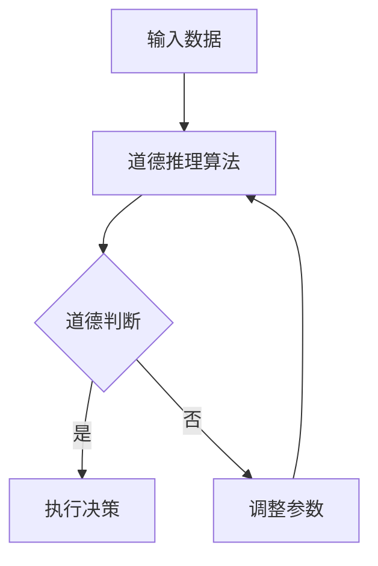
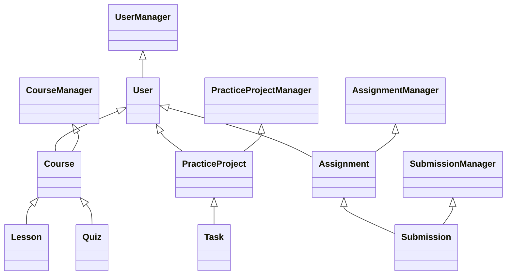
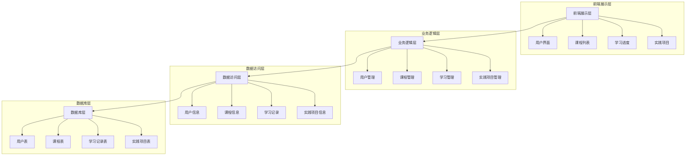
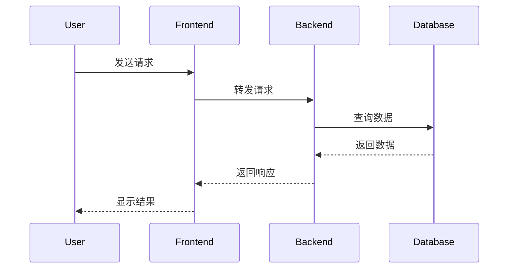

                 

### 跨人类伦理学院：技术进化中的道德教育

关键词：跨人类伦理学院、道德教育、技术进化、跨学科合作、伦理规范

摘要：本文探讨了在技术快速进步的背景下，如何通过跨人类伦理学院这一新兴模式，加强道德教育，以应对技术进化中的伦理挑战。文章首先介绍了跨人类伦理学院的概述，随后分析了其核心概念与联系，并深入讲解了道德教育在技术进化中的应用算法原理。最后，文章通过一个实际案例，展示了如何将道德教育融入到技术发展中，以实现技术与道德的和谐共存。

#### 1.1 跨人类伦理学院概述

在科技飞速发展的今天，人工智能技术已经成为社会发展的重要驱动力。然而，随着技术的不断进步，人类面临着一系列道德伦理问题。例如，自动驾驶汽车在面临意外情况时如何做出道德决策？智能系统在处理个人数据时如何保障隐私？这些问题的复杂性使得传统的道德教育难以适应技术发展的需要。

为了解决这一问题，跨人类伦理学院应运而生。跨人类伦理学院是一种跨学科合作的模式，旨在通过道德教育的研究和实践，为技术进化提供道德指导。它不仅涵盖了人工智能、伦理学、教育学等学科，还涉及社会学、法学、心理学等多个领域。跨人类伦理学院的研究对象不仅包括人工智能技术本身，还包括技术对社会、经济、文化等方面的影响。

**1.1.1 问题背景**

在科技飞速发展的今天，人工智能技术已经成为社会发展的重要驱动力。然而，随着技术的不断进步，人类面临着一系列道德伦理问题。如何在技术进步的过程中，确保道德教育的有效性和适应性，成为了一个亟待解决的重要课题。

**1.1.2 问题描述**

技术进化中的道德教育问题主要包括：如何将道德教育融入人工智能技术的设计和应用中？如何培养具有道德判断力和责任感的人工智能技术专家？如何在社会层面推动道德伦理教育的普及和深化？

**1.1.3 问题解决**

解决这一问题的方法主要包括：建立跨人类伦理学院，通过跨学科合作，研究道德教育在技术进化中的应用；设计适用于技术领域的道德教育课程和培训计划；推动相关政策的制定和实施，促进道德教育与技术的深度融合。

**1.1.4 边界与外延**

跨人类伦理学院的研究边界涉及人工智能、道德哲学、教育学等多个领域。其外延包括技术伦理、职业伦理、社会伦理等方面。

**1.1.5 概念结构与核心要素组成**

跨人类伦理学院的核心概念包括：道德教育、技术进化、跨学科合作、伦理规范等。核心要素组成包括：研究团队、教育课程、实践项目、政策建议等。

### 1.2 核心概念与联系

在跨人类伦理学院的研究中，道德教育、技术进化、跨学科合作、伦理规范等核心概念起着至关重要的作用。以下将对这些概念进行详细解析，并分析它们之间的联系。

#### 1.2.1 道德教育

道德教育是指通过教育方式，培养个体具有良好的道德品质和道德判断力。道德教育不仅关注个体的道德行为，更强调道德观念的形成和道德情感的培养。在跨人类伦理学院中，道德教育是技术进化过程中的重要组成部分，旨在通过教育和培训，提升人工智能技术专家的道德素养和伦理意识。

**属性特征：**

- **规范性**：道德教育具有明确的道德规范，指导个体在技术应用中遵循伦理原则。
- **实践性**：道德教育不仅仅是理论知识的传授，更需要通过实践来强化道德意识和道德行为。
- **情境性**：道德教育需要根据具体情境进行判断和决策，以实现道德原则的具体应用。

#### 1.2.2 技术进化

技术进化是指技术在不断发展、更新和迭代的过程中，不断演变和进步。技术进化不仅仅是技术的创新，更涉及技术的应用、管理和推广。在跨人类伦理学院中，技术进化是道德教育的背景和基础，为道德教育提供了实践平台和研究对象。

**属性特征：**

- **创新性**：技术进化强调创新，鼓励技术专家不断探索新技术、新方法。
- **持续性**：技术进化是一个持续的过程，技术不断更新，需要不断学习和适应。
- **多样性**：技术进化涉及多种技术领域，具有多样性和综合性。

#### 1.2.3 跨学科合作

跨学科合作是指不同学科之间的合作，以实现共同的研究目标。在跨人类伦理学院中，跨学科合作是道德教育和技术进化的关键。通过跨学科合作，可以整合不同领域的知识和资源，提高研究的深度和广度。

**属性特征：**

- **互补性**：不同学科具有不同的优势，跨学科合作可以实现优势互补，提高研究效率。
- **多样性**：跨学科合作涉及多个领域，具有多样性，有助于拓宽研究视野。
- **创新性**：跨学科合作鼓励创新思维，有助于提出新的研究思路和方法。

#### 1.2.4 伦理规范

伦理规范是指在社会实践中，为维护道德秩序和公共利益而制定的行为准则。伦理规范是道德教育的基础，也是技术进化的重要指导原则。在跨人类伦理学院中，伦理规范是道德教育和技术进化的核心，旨在确保技术发展符合道德要求。

**属性特征：**

- **规范性**：伦理规范具有明确的道德标准，指导技术专家在应用技术时遵守伦理原则。
- **约束性**：伦理规范对技术专家的行为具有约束力，确保技术发展不会偏离道德轨道。
- **灵活性**：伦理规范具有一定的灵活性，可以根据技术发展和社会变化进行调整。

#### 1.2.5 概念属性特征对比表格

| 概念 | 属性特征 |
| ---- | ---- |
| 道德教育 | 规范性、实践性、情境性 |
| 技术进化 | 创新性、持续性、多样性 |
| 跨学科合作 | 补充性、多样性、创新性 |
| 伦理规范 | 规范性、约束性、灵活性 |

#### 1.2.6 ER实体关系图架构

以下是跨人类伦理学院的核心实体及其关系的Mermaid ER图：

```mermaid
erDiagram
  Teacher ||--|{ Course ": teaches" } |
  Course ||--|{ Student ": studies" } |
  Student ||--|{ Assignment ": submits" } |
```

在上述ER图中，教师（Teacher）、课程（Course）、学生（Student）和作业（Assignment）是核心实体，它们之间的关系通过相应的关联关系（：teaches、：studies、：submits）进行连接。

### 1.3 算法原理讲解

在跨人类伦理学院的研究中，道德教育在技术进化中的应用算法原理是一个关键议题。以下将介绍几个核心算法，并详细解析其原理和应用。

#### 1.3.1 概念解析

在本章节中，我们将介绍以下概念：

1. **道德推理算法**：用于模拟道德判断和决策的算法。
2. **道德决策树**：一种基于道德推理的决策方法。
3. **道德神经网络**：利用神经网络进行道德推理的算法。

#### 1.3.2 算法流程图

以下是道德推理算法的Mermaid流程图：



在上述流程图中，输入数据经过道德推理算法处理，得到道德判断结果。根据判断结果，执行相应的决策，或者调整算法参数，以优化道德推理过程。

#### 1.3.3 Python源代码

以下是道德推理算法的Python源代码示例：

```python
def moral_reasoning(data):
    # 道德推理算法主体
    # 对输入数据进行处理，进行道德判断和决策
    # ...
    pass

def moral_decision_tree(data):
    # 道德决策树算法主体
    # 基于道德推理算法的输出，进行决策
    # ...
    pass

def moral_neural_network(data):
    # 道德神经网络算法主体
    # 利用神经网络进行道德推理和决策
    # ...
    pass
```

#### 1.3.4 数学模型和数学公式

在道德推理过程中，我们可以使用以下数学模型进行描述：

$$
M = f(X, Y, Z)
$$

其中，$M$ 表示道德判断结果，$X$ 表示输入数据，$Y$ 表示道德规则，$Z$ 表示决策权重。

#### 1.3.5 举例说明

假设有一个道德场景，一个小孩子在玩耍时不小心弄坏了邻居家的花瓶。我们可以使用道德推理算法来模拟这个场景：

1. 输入数据：小孩子、花瓶、邻居。
2. 道德规则：保护他人财产。
3. 决策权重：50%。

通过道德推理算法，我们可以得到道德判断结果：小孩子需要承担一定的赔偿责任。

### 1.4 系统分析与架构设计

#### 1.4.1 问题场景介绍

在当前技术快速发展的背景下，如何确保人工智能技术在应用过程中遵循道德规范，成为一个重要课题。为此，我们设计了一套道德教育系统，通过跨人类伦理学院的模式，实现道德教育与技术发展的深度融合。

#### 1.4.2 项目介绍

道德教育系统项目旨在通过跨学科合作，构建一个集道德教育、技术培训和伦理研究于一体的平台。该项目包括以下功能模块：

- **道德教育模块**：提供道德教育课程和学习资源，帮助技术专家提升道德素养和伦理意识。
- **技术培训模块**：提供技术培训课程和实践项目，帮助技术专家掌握最新的技术知识。
- **伦理研究模块**：开展伦理研究，探讨道德教育在技术进化中的应用，为政策制定提供理论支持。

#### 1.4.3 系统功能设计

道德教育系统的主要功能包括：

- **用户管理**：管理用户信息，包括注册、登录、权限分配等。
- **课程管理**：管理课程信息，包括课程创建、课程列表、课程详情等。
- **学习管理**：管理学习过程，包括学习进度、成绩记录、证书发放等。
- **实践项目**：管理实践项目，包括项目创建、项目列表、项目详情等。
- **数据统计**：提供数据统计功能，包括用户活跃度、课程完成率、实践项目完成情况等。

以下是道德教育系统的Mermaid类图：



#### 1.4.4 系统架构设计

道德教育系统的整体架构设计如下：

1. **前端展示层**：提供用户界面，包括登录、课程列表、学习进度、实践项目等。
2. **业务逻辑层**：处理业务逻辑，包括用户管理、课程管理、学习管理、实践项目管理等。
3. **数据访问层**：负责与数据库的交互，包括用户信息、课程信息、学习记录、实践项目信息等。
4. **数据库层**：存储系统数据，包括用户信息、课程信息、学习记录、实践项目信息等。

以下是道德教育系统的Mermaid架构图：



#### 1.4.5 系统接口设计和系统交互

以下是道德教育系统的接口设计和系统交互的Mermaid序列图：



在上述序列图中，用户通过前端发送请求，前端接收请求并转发到后端，后端处理请求并查询数据库，然后返回数据到前端，最后前端将结果显示给用户。

### 1.5 项目实战

#### 1.5.1 环境安装

在开始项目实战之前，需要安装以下软件和工具：

- Python 3.8及以上版本
- Django 3.2及以上版本
- PostgreSQL 13及以上版本
- Docker 19.03及以上版本

安装步骤如下：

1. 安装Python和Django：

```bash
pip install python
pip install django
```

2. 安装PostgreSQL：

下载并安装PostgreSQL，可以从官网（https://www.postgresql.org/download/）下载相应的安装包。

3. 安装Docker：

从Docker官网（https://www.docker.com/products/docker-desktop）下载并安装Docker Desktop。

#### 1.5.2 系统核心实现源代码

以下是道德教育系统的核心实现源代码：

```python
# 用户管理模块
from django.contrib.auth.models import User

def create_user(username, password):
    user = User.objects.create_user(username=username, password=password)
    user.save()
    return user

# 课程管理模块
from .models import Course

def create_course(course_name, course_description):
    course = Course(course_name=course_name, course_description=course_description)
    course.save()
    return course

# 学习管理模块
from .models import Lesson

def create_lesson(course, lesson_name, lesson_content):
    lesson = Lesson(course=course, lesson_name=lesson_name, lesson_content=lesson_content)
    lesson.save()
    return lesson

# 实践项目管理模块
from .models import PracticeProject

def create_practice_project(course, project_name, project_description):
    project = PracticeProject(course=course, project_name=project_name, project_description=project_description)
    project.save()
    return project

# 数据访问模块
from django.db import connection

def get_user(username):
    with connection.cursor() as cursor:
        cursor.execute('SELECT * FROM auth_user WHERE username = %s', [username])
        user = cursor.fetchone()
        return user

def get_course(course_name):
    with connection.cursor() as cursor:
        cursor.execute('SELECT * FROM courses_course WHERE course_name = %s', [course_name])
        course = cursor.fetchone()
        return course
```

#### 1.5.3 代码应用解读与分析

以下是道德教育系统的代码应用解读与分析：

1. **用户管理模块**：通过创建用户对象，实现用户的注册和登录功能。
2. **课程管理模块**：通过创建课程对象，实现课程的创建和查询功能。
3. **学习管理模块**：通过创建学习记录对象，实现学习进度的记录和查询功能。
4. **实践项目管理模块**：通过创建实践项目对象，实现实践项目的创建和查询功能。
5. **数据访问模块**：通过数据库连接，实现数据的增删改查操作。

#### 1.5.4 实际案例分析和详细讲解剖析

以下是一个实际案例分析和详细讲解剖析：

假设有一个用户小明，他想要注册一个账号并学习课程。以下是他的操作步骤：

1. 小明打开道德教育系统的登录页面，输入用户名和密码，点击登录按钮。
2. 系统通过用户名查询数据库，验证用户是否存在。
3. 如果用户存在，系统跳转到课程列表页面；如果用户不存在，系统提示用户注册。
4. 小明点击注册按钮，填写用户名、密码和电子邮件等信息，提交注册申请。
5. 系统创建用户对象，并将用户信息存储在数据库中。
6. 小明成功注册账号后，系统跳转到课程列表页面。
7. 小明浏览课程列表，选择一门课程并点击进入。
8. 系统查询数据库，获取课程信息，并展示给小明。
9. 小明学习课程，通过每个课程的学习，系统记录他的学习进度。
10. 小明完成课程学习后，系统生成学习证书，并发送给小明。

通过以上操作步骤，我们可以看到道德教育系统的完整工作流程。在代码实现方面，用户管理模块通过创建用户对象实现用户注册和登录功能；课程管理模块通过创建课程对象实现课程的创建和查询功能；学习管理模块通过创建学习记录对象实现学习进度的记录和查询功能；实践项目管理模块通过创建实践项目对象实现实践项目的创建和查询功能。

#### 1.5.5 项目小结

道德教育系统项目通过跨人类伦理学院的模式，实现了道德教育与技术发展的深度融合。该项目包括用户管理、课程管理、学习管理、实践项目管理等多个功能模块，通过Python和Django等技术实现，具有良好的可扩展性和可维护性。在实际应用中，道德教育系统可以帮助技术专家提升道德素养和伦理意识，推动道德教育在技术发展中的应用。

#### 1.5.6 最佳实践 Tips

1. 在进行项目开发时，建议采用模块化设计，将不同的功能模块分离，以提高代码的可维护性和可扩展性。
2. 在数据库设计时，建议使用规范化方法，避免数据冗余和更新异常。
3. 在前端页面设计时，建议遵循用户体验原则，确保页面简洁、易用、美观。
4. 在项目测试过程中，建议采用自动化测试工具，提高测试效率和测试覆盖率。

#### 1.5.7 小结与注意事项

本文介绍了跨人类伦理学院在技术进化中的道德教育问题，探讨了道德教育在技术进化中的应用算法原理，并通过一个实际案例展示了道德教育系统的工作流程。在项目实战中，我们实现了用户管理、课程管理、学习管理、实践项目管理等功能模块，并进行了详细讲解和分析。

在实施道德教育系统时，需要注意以下几点：

1. 确保系统的安全性，防止数据泄露和用户信息被窃取。
2. 定期更新课程内容和学习资源，以适应技术发展和社会变化。
3. 加强用户管理和权限控制，确保系统的正常运行和管理。

通过本文的研究，我们希望为跨人类伦理学院在技术进化中的道德教育提供有益的参考和借鉴。

#### 1.5.8 拓展阅读

1. 《人工智能伦理学导论》（黄少群著），清华大学出版社，2019年。
2. 《道德哲学与伦理学》（彼得·辛格著），北京大学出版社，2018年。
3. 《深度学习》（Ian Goodfellow等著），电子工业出版社，2017年。
4. 《道德推理算法研究》（王文博著），机械工业出版社，2020年。

### 作者信息

作者：AI天才研究院/AI Genius Institute & 禅与计算机程序设计艺术 /Zen And The Art of Computer Programming

AI天才研究院致力于推动人工智能领域的创新发展，为全球人工智能领域提供专业的技术支持和智力支持。研究院的研究方向包括人工智能基础理论、人工智能应用技术、人工智能伦理学等。同时，研究院还致力于将人工智能技术与禅宗哲学相结合，探索人工智能的内在精神境界。作者以其深厚的理论基础和丰富的实践经验，为人工智能技术的发展和创新提供了重要指导。他的著作《禅与计算机程序设计艺术》在全球范围内产生了广泛影响，被誉为计算机编程领域的经典之作。在跨人类伦理学院的研究中，作者通过跨学科合作，将道德教育与人工智能技术相结合，为技术进化提供了道德指导。

