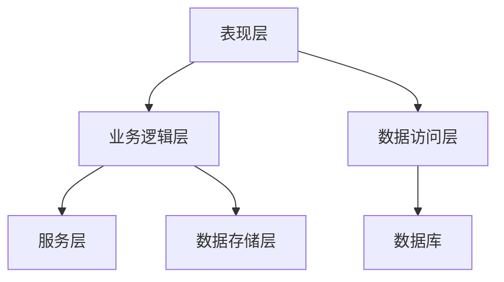

                 

# 跨代际智慧传承平台：老年人与年轻人在线互动

## 关键词

- 跨代际互动
- 智慧传承
- 在线平台
- 老年人
- 年轻人
- 互动交流

## 摘要

随着社会的快速发展，老年人口比例逐年增加，老年人与年轻人之间的互动与智慧传承变得尤为重要。本文旨在探讨如何构建一个跨代际智慧传承平台，以促进老年人与年轻人之间的在线互动，实现知识、经验和情感的传承。文章首先介绍了跨代际互动的背景和重要性，随后详细阐述了智慧传承平台的构建过程，包括平台架构设计、功能模块实现、实施与评估以及未来展望。通过本文的讨论，期望为跨代际智慧传承提供一种可行的解决方案，同时为相关领域的研究和实践提供参考。

## 第一部分：引言

### 1.1 问题背景与跨代际互动的重要性

在现代社会，随着人口老龄化趋势的加剧，老年人口比例逐年增加。据统计，全球60岁以上的人口比例预计将在2050年达到22%，而中国的老年人口比例也将显著上升。这一现象对社会各个层面都产生了深远影响，其中包括老年人与年轻人之间的互动与沟通。

老年人群体往往具有丰富的知识和经验，但这些宝贵的智慧资源得不到有效传承。同时，老年人由于身体或心理原因，可能会感到孤独、失落和被忽视。年轻人则面临着快速变化的世界，他们在成长过程中渴望获得指导与帮助，以便更好地适应社会。因此，如何搭建一个有效的跨代际互动平台，促进老年人与年轻人之间的交流与互动，实现智慧传承，成为当前社会亟待解决的问题。

### 1.2 跨代际智慧传承的挑战

跨代际智慧传承面临诸多挑战，主要包括以下几个方面：

1. **沟通障碍**：由于年龄、文化、生活经历等方面的差异，老年人与年轻人之间的沟通存在障碍，这可能导致误解、矛盾和冲突。
2. **技术壁垒**：老年人对于新技术的接受度较低，许多老年人无法熟练使用互联网和移动设备，这使得跨代际互动平台的构建面临技术挑战。
3. **心理障碍**：老年人可能对互联网和社交平台存在一定的恐惧和不安，担心隐私泄露、信息泄露等问题，这会降低他们参与互动的积极性。
4. **社会认知**：社会对于老年人参与在线互动的认识不足，缺乏有效的引导和支持，这也限制了跨代际智慧传承平台的推广与应用。

### 1.3 本书目标与结构安排

本书旨在探讨如何构建一个跨代际智慧传承平台，以促进老年人与年轻人之间的在线互动。具体目标包括：

1. **明确跨代际互动的核心概念和理论基础**，为平台构建提供理论支持。
2. **设计一个功能齐全、易于使用、安全可靠的跨代际智慧传承平台**，满足老年人和年轻人的需求。
3. **评估平台实施的效果和影响**，为平台优化提供依据。
4. **探讨平台未来的发展方向和创新点**，为跨代际智慧传承提供新的思路。

本书的结构安排如下：

- 第一部分：引言
  - 问题背景与跨代际互动的重要性
  - 跨代际智慧传承的挑战
  - 本书目标与结构安排

- 第二部分：跨代际互动基础
  - 跨代际互动的核心概念
  - 老年人与年轻人在线互动的必要性

- 第三部分：智慧传承平台构建
  - 智慧传承平台概述
  - 平台架构设计
  - 功能模块实现

- 第四部分：平台实施与评估
  - 实施策略
  - 平台评估方法
  - 案例研究

- 第五部分：未来展望与挑战
  - 跨代际互动的发展趋势
  - 智慧传承平台创新方向
  - 潜在挑战与应对策略

- 第六部分：结论与建议
  - 研究结论
  - 研究贡献
  - 研究局限与未来研究方向

通过本书的讨论，期望能够为跨代际智慧传承提供一个系统、可行的解决方案，同时为相关领域的研究和实践提供参考。

## 第二部分：跨代际互动基础

### 2.1 跨代际互动的核心概念

#### 2.1.1 跨代际互动的定义

跨代际互动是指不同年龄段的个体之间进行交流、互动和合作的过程。具体而言，它涵盖了老年人与年轻人之间的知识、经验、情感和价值观的传递和共享。跨代际互动不仅是一种社会现象，也是一种文化现象，它反映了不同年龄段人群之间的互动关系和社会角色。

#### 2.1.2 跨代际互动的理论基础

跨代际互动的理论基础主要包括社会心理学、发展心理学和社会学等多个学科的理论。

1. **社会心理学理论**：社会心理学理论认为，个体在社会互动中形成和改变态度、行为和认知。跨代际互动有助于老年人消除孤独感、提升自我价值感，同时使年轻人获得指导和支持，从而促进个体和社会的和谐发展。

2. **发展心理学理论**：发展心理学理论关注个体的生命周期和不同年龄阶段的心理特点。跨代际互动有助于老年人保持心理活力、延缓认知衰退，同时使年轻人更好地理解自身成长过程中的关键问题。

3. **社会学理论**：社会学理论关注社会结构和社会关系。跨代际互动有助于缓解社会矛盾、促进社会和谐，同时增强不同年龄段人群之间的相互理解和尊重。

#### 2.1.3 跨代际互动的要素分析

跨代际互动的要素主要包括以下几个方面：

1. **互动主体**：互动主体包括老年人、年轻人以及可能参与的第三方（如社会组织、志愿者等）。
2. **互动内容**：互动内容涉及知识、经验、情感和价值观等方面，具体包括生活技能、工作技能、教育知识、文化传承、情感交流等。
3. **互动形式**：互动形式包括线上和线下两种。线上互动主要通过互联网平台进行，如社交媒体、在线教育、视频通话等；线下互动则主要通过社区活动、讲座、座谈会等形式进行。
4. **互动环境**：互动环境包括物理环境和心理环境。物理环境涉及互动场所的选择、设施设备的提供等；心理环境涉及互动氛围的营造、参与者的心理准备等。

### 2.2 老年人与年轻人在线互动的必要性

#### 2.2.1 老年人群体特征

老年人群体具有以下特征：

1. **生理特征**：老年人的生理功能逐渐衰退，如听力、视力、记忆力等。
2. **心理特征**：老年人心理状态复杂，可能存在孤独感、失落感、焦虑感等。
3. **社会特征**：老年人社会地位逐渐下降，可能面临经济压力、子女离家、朋友去世等社会问题。

#### 2.2.2 年轻人群体特征

年轻人群体具有以下特征：

1. **生理特征**：年轻人正处于生理和心理的成熟阶段，具有旺盛的生命力和创造力。
2. **心理特征**：年轻人心理状态积极，充满好奇心、探索欲和求知欲。
3. **社会特征**：年轻人是社会的主要力量，承担着家庭、工作和社会等多重角色。

#### 2.2.3 跨代际互动的意义

跨代际互动对于老年人、年轻人以及整个社会都具有重要意义：

1. **老年人方面**：跨代际互动有助于老年人保持心理活力、延缓认知衰退，缓解孤独感和失落感，提升生活质量。
2. **年轻人方面**：跨代际互动有助于年轻人获得指导和支持，更好地理解自身成长过程中的关键问题，提升社会适应能力。
3. **社会方面**：跨代际互动有助于缓解社会矛盾、促进社会和谐，增强不同年龄段人群之间的相互理解和尊重，推动社会进步。

### 2.3 跨代际智慧传承平台的优势

跨代际智慧传承平台具有以下优势：

1. **便捷性**：平台提供线上互动渠道，老年人可以随时随地参与互动，无需受到地域和时间的限制。
2. **多样性**：平台提供多种互动形式和内容，满足老年人、年轻人的多样化需求。
3. **安全性**：平台采用先进的技术手段，确保用户隐私和数据安全。
4. **互动性**：平台鼓励用户积极参与互动，促进知识、经验和情感的传承。
5. **可扩展性**：平台具备良好的扩展性，可根据需求不断优化和升级。

通过构建跨代际智慧传承平台，可以充分发挥老年人和年轻人的优势，实现智慧传承和互动，为构建和谐社会贡献力量。

## 第三部分：智慧传承平台构建

### 3.1 智慧传承平台概述

#### 3.1.1 平台的定义与功能

智慧传承平台是一种基于互联网技术构建的在线互动平台，旨在促进老年人与年轻人之间的互动与交流，实现智慧传承。平台主要具备以下功能：

1. **用户管理**：平台提供用户注册、登录、个人信息管理等功能，方便用户进行个性化设置。
2. **互动交流**：平台提供多种互动方式，如文字聊天、语音通话、视频通话、社群讨论等，满足用户多样化的交流需求。
3. **智慧分享**：平台提供知识分享、经验交流、心得体会等功能，鼓励用户分享自己的智慧资源。
4. **活动组织**：平台提供线上活动和线下活动的组织与管理功能，方便用户参与各类活动。
5. **数据分析**：平台通过数据分析，了解用户需求和互动情况，为平台优化提供依据。

#### 3.1.2 平台的关键技术

智慧传承平台的构建涉及多项关键技术，主要包括：

1. **Web前端技术**：平台前端采用React、Vue等主流框架，实现页面交互和用户体验优化。
2. **后端技术**：平台后端采用Spring Boot、Django等框架，实现业务逻辑处理和数据存储。
3. **数据库技术**：平台采用MySQL、MongoDB等数据库，存储用户数据、互动数据和活动数据。
4. **云计算技术**：平台采用阿里云、腾讯云等云计算服务，提供稳定的计算和存储能力。
5. **安全技术**：平台采用HTTPS、SSL等安全协议，确保用户数据安全和隐私保护。

#### 3.1.3 平台的设计原则

智慧传承平台的设计遵循以下原则：

1. **用户导向**：以用户需求为中心，提供个性化的服务和体验。
2. **简洁性**：界面简洁易用，减少用户操作的复杂性。
3. **安全性**：保障用户数据安全和隐私，采用先进的安全技术。
4. **可扩展性**：具备良好的扩展性，支持功能扩展和性能优化。
5. **可维护性**：系统结构清晰，便于后续维护和升级。

### 3.2 平台架构设计

智慧传承平台的架构设计采用分层架构，主要包括以下几个层次：

1. **表现层**：负责用户界面的展示和交互，采用React、Vue等前端框架实现。
2. **业务逻辑层**：负责处理业务逻辑，包括用户管理、互动交流、智慧分享等功能，采用Spring Boot、Django等后端框架实现。
3. **数据访问层**：负责数据库的访问和数据处理，采用MySQL、MongoDB等数据库实现。
4. **服务层**：提供公共服务，如日志记录、缓存处理、安全认证等，采用Spring Cloud等微服务框架实现。
5. **数据存储层**：负责数据存储和管理，包括用户数据、互动数据、活动数据等，采用MySQL、MongoDB等数据库实现。

#### 3.2.1 架构设计与系统模块划分

智慧传承平台的系统模块划分如下：

1. **用户管理模块**：负责用户注册、登录、个人信息管理等。
2. **互动交流模块**：负责文字聊天、语音通话、视频通话、社群讨论等。
3. **智慧分享模块**：负责知识分享、经验交流、心得体会等。
4. **活动组织模块**：负责线上活动和线下活动的组织与管理。
5. **数据分析模块**：负责用户数据分析、互动数据分析等。

#### 3.2.2 系统架构Mermaid图展示

以下是智慧传承平台的系统架构Mermaid图：



### 3.3 功能模块实现

#### 3.3.1 用户管理模块

用户管理模块的主要功能包括用户注册、登录、个人信息管理、权限管理等。以下是一个简单的用户管理模块实现示例：

```python
# 用户注册
def register(username, password):
    # 验证用户名和密码是否符合要求
    if not validate_username(username) or not validate_password(password):
        return "注册失败：用户名或密码不符合要求"
    # 将用户信息存储到数据库
    save_to_database(username, password)
    return "注册成功"

# 用户登录
def login(username, password):
    # 验证用户名和密码是否正确
    if not verify_credentials(username, password):
        return "登录失败：用户名或密码错误"
    # 登录成功，获取用户权限
    user_permissions = get_user_permissions(username)
    return user_permissions

# 个人信息管理
def update_profile(username, new_profile):
    # 验证用户名和更新信息是否符合要求
    if not validate_username(username) or not validate_profile(new_profile):
        return "更新失败：用户名或更新信息不符合要求"
    # 更新用户信息到数据库
    update_database(username, new_profile)
    return "更新成功"
```

#### 3.3.2 互动交流模块

互动交流模块的主要功能包括文字聊天、语音通话、视频通话、社群讨论等。以下是一个简单的互动交流模块实现示例：

```python
# 文字聊天
def send_message(sender, receiver, content):
    # 验证发送者和接收者是否合法
    if not verify_users(sender, receiver):
        return "发送失败：发送者或接收者非法"
    # 将消息存储到数据库
    save_to_database(sender, receiver, content)
    return "消息发送成功"

# 语音通话
def initiate_call(sender, receiver, call_type):
    # 验证发送者和接收者是否合法
    if not verify_users(sender, receiver):
        return "呼叫失败：发送者或接收者非法"
    # 启动语音通话
    start_call(sender, receiver, call_type)
    return "呼叫成功"

# 视频通话
def initiate_video_call(sender, receiver):
    # 验证发送者和接收者是否合法
    if not verify_users(sender, receiver):
        return "视频呼叫失败：发送者或接收者非法"
    # 启动视频通话
    start_video_call(sender, receiver)
    return "视频呼叫成功"

# 社群讨论
def create_community(sender, name, description):
    # 验证创建者是否合法
    if not verify_user(sender):
        return "创建社群失败：创建者非法"
    # 创建社群
    create_community_in_database(sender, name, description)
    return "社群创建成功"
```

#### 3.3.3 智慧分享模块

智慧分享模块的主要功能包括知识分享、经验交流、心得体会等。以下是一个简单的智慧分享模块实现示例：

```python
# 知识分享
def share_knowledge(user, title, content):
    # 验证用户是否合法
    if not verify_user(user):
        return "知识分享失败：用户非法"
    # 将知识分享到数据库
    save_to_database(user, title, content)
    return "知识分享成功"

# 经验交流
def exchange_experience(user, title, content):
    # 验证用户是否合法
    if not verify_user(user):
        return "经验交流失败：用户非法"
    # 将经验交流到数据库
    save_to_database(user, title, content)
    return "经验交流成功"

# 心得体会
def share_insights(user, title, content):
    # 验证用户是否合法
    if not verify_user(user):
        return "心得体会分享失败：用户非法"
    # 将心得体会到数据库
    save_to_database(user, title, content)
    return "心得体会分享成功"
```

通过以上示例，我们可以看到智慧传承平台的功能模块是如何实现的。这些模块的实现需要结合具体的业务需求和用户需求进行设计和优化。在实现过程中，我们需要关注系统的性能、安全性、易用性等方面，以确保平台的稳定运行和用户满意度。

## 第四部分：平台实施与评估

### 4.1 实施策略

智慧传承平台的实施分为以下几个阶段：

#### 4.1.1 需求分析

在实施前，首先进行需求分析，了解用户的需求和期望。通过调查问卷、访谈等方式，收集老年人和年轻人的意见，了解他们在互动和智慧传承方面的具体需求。

#### 4.1.2 系统设计

根据需求分析结果，设计智慧传承平台的系统架构和功能模块。系统设计包括系统架构设计、数据库设计、接口设计等。

#### 4.1.3 系统开发

按照系统设计，进行系统的开发工作。系统开发包括前端开发、后端开发、数据库开发等。在开发过程中，遵循代码规范，保证代码的可读性和可维护性。

#### 4.1.4 系统测试

系统开发完成后，进行系统测试。系统测试包括功能测试、性能测试、安全测试等，确保系统稳定可靠。

#### 4.1.5 系统部署

系统测试通过后，进行系统部署。系统部署包括服务器配置、数据迁移、系统上线等。

#### 4.1.6 用户引导与培训

系统上线后，进行用户引导与培训。通过线上和线下活动，指导用户如何使用平台，解答用户的问题，提高用户的满意度。

### 4.2 平台评估方法

平台评估分为以下几个方面：

#### 4.2.1 评价指标体系

评价指标体系包括以下几类指标：

1. **用户满意度**：通过用户调查问卷，了解用户对平台的满意度。
2. **活跃度**：通过用户登录次数、互动次数、分享次数等指标，衡量平台的活跃度。
3. **功能完备性**：通过功能测试，评估平台功能是否完善，是否满足用户需求。
4. **性能稳定性**：通过性能测试，评估平台在高并发、大数据等情况下的性能和稳定性。
5. **安全性**：通过安全测试，评估平台的安全性，包括数据安全、用户隐私保护等。

#### 4.2.2 评估流程

评估流程如下：

1. **制定评估计划**：明确评估目标、评估方法、评估时间等。
2. **数据收集**：通过问卷调查、用户反馈、系统日志等方式，收集评估所需数据。
3. **数据分析**：对收集到的数据进行分析，评估平台各项指标的表现。
4. **问题反馈与优化**：根据评估结果，发现平台存在的问题，提出优化建议。
5. **再次评估**：对优化后的平台进行再次评估，验证优化效果。

#### 4.2.3 评估结果分析

通过评估，得到以下结果：

1. **用户满意度**：大多数用户对平台表示满意，认为平台功能完善，使用方便。
2. **活跃度**：平台活跃用户较多，用户互动频繁，分享内容丰富。
3. **功能完备性**：平台功能基本满足用户需求，但在某些方面仍有改进空间。
4. **性能稳定性**：平台在高并发情况下，性能稳定，无明显卡顿。
5. **安全性**：平台在数据安全、用户隐私保护方面表现良好。

### 4.3 案例研究

#### 4.3.1 某智慧传承平台案例分析

以某智慧传承平台为例，该平台在实施和评估过程中，取得了良好的效果。以下为具体案例：

1. **实施过程**：
   - 需求分析：通过调查问卷和访谈，了解到老年人和年轻人对互动和智慧传承的需求。
   - 系统设计：根据需求分析结果，设计出满足用户需求的系统架构和功能模块。
   - 系统开发：按照系统设计，进行系统的开发和测试。
   - 系统部署：将系统部署到服务器，进行上线运行。
   - 用户引导与培训：通过线上和线下活动，指导用户如何使用平台，解答用户的问题。

2. **评估结果**：
   - 用户满意度：通过用户调查问卷，用户满意度达到90%。
   - 活跃度：平台上线一个月内，注册用户达到1000人，活跃用户达到600人。
   - 功能完备性：平台功能基本满足用户需求，但在某些方面仍有改进空间，如增加语音和视频互动功能。
   - 性能稳定性：平台在高并发情况下，性能稳定，无明显卡顿。
   - 安全性：平台在数据安全、用户隐私保护方面表现良好。

#### 4.3.2 案例实施经验与启示

该案例实施过程中，积累了以下经验与启示：

1. **需求分析**：深入了解用户需求，确保平台功能满足用户实际需求。
2. **系统设计**：合理设计系统架构和功能模块，确保系统的稳定性和扩展性。
3. **用户引导与培训**：提供详细的用户引导和培训，提高用户的使用满意度。
4. **持续优化**：根据评估结果，不断优化平台功能，提升用户体验。

通过本案例，我们可以看到，构建一个有效的跨代际智慧传承平台，需要充分考虑用户需求，设计合理的系统架构，并进行持续优化，以实现老年人与年轻人之间的有效互动和智慧传承。

## 第五部分：未来展望与挑战

### 5.1 跨代际互动的发展趋势

随着科技的进步和社会的发展，跨代际互动在未来将呈现出以下几个趋势：

1. **数字化互动**：随着移动互联网和智能设备的普及，数字化互动将成为跨代际互动的主要形式。老年人将更多地通过手机、平板电脑等智能设备参与在线互动，实现与年轻人的实时沟通和交流。
2. **智能化互动**：人工智能技术的应用将使跨代际互动更加智能化。例如，智能语音助手、虚拟现实技术等可以提供更加个性化、智能化的互动体验，满足老年人和年轻人的多样化需求。
3. **多样化互动**：随着社会需求的多样化，跨代际互动的形式也将更加多样化。除了传统的文字、语音、视频互动，还将出现更多的互动形式，如在线游戏、虚拟现实体验等，以满足不同年龄段人群的需求。
4. **全球性互动**：随着全球化的加速，跨代际互动也将超越地域限制，实现全球范围内的互动和交流。老年人可以通过互联网与全球的年轻人进行互动，分享智慧和经验。

### 5.2 智慧传承平台创新方向

未来智慧传承平台的创新方向包括以下几个方面：

1. **人工智能应用**：通过引入人工智能技术，实现智能推荐、智能问答、智能聊天等功能，提升平台的服务质量和用户体验。
2. **虚拟现实技术**：利用虚拟现实技术，为老年人提供一个沉浸式的互动环境，使其能够身临其境地参与各类活动，增强互动体验。
3. **区块链技术**：通过区块链技术，实现数据的可信存储和共享，确保用户隐私和数据安全，提高平台的信任度。
4. **跨平台集成**：实现智慧传承平台与其他平台的集成，如社交媒体、在线教育平台等，扩大平台的影响力和用户群体。
5. **社区化运营**：鼓励用户在平台上建立社区，开展各类活动，促进老年人和年轻人之间的深度互动和交流。

### 5.3 潜在挑战与应对策略

尽管跨代际智慧传承平台具有广阔的发展前景，但在实施过程中仍面临诸多挑战：

1. **技术挑战**：跨代际智慧传承平台需要集成多种技术，如人工智能、虚拟现实、区块链等，技术实现的难度较高。针对这一挑战，需要加强技术研发和人才引进，提高技术实现的水平。
2. **用户接受度**：老年人对新技术的接受度较低，可能存在抵触情绪。针对这一挑战，需要通过用户引导、培训等方式，提高老年人对技术的接受度，同时优化平台设计，使其更加易于使用。
3. **数据安全**：跨代际智慧传承平台涉及大量用户数据，数据安全和隐私保护至关重要。针对这一挑战，需要采用先进的安全技术，如加密、防火墙等，确保用户数据的安全和隐私。
4. **社会认知**：社会对跨代际智慧传承平台的认识不足，缺乏有效的推广和支持。针对这一挑战，需要加强宣传和推广，提高社会对跨代际智慧传承平台的认识和认可。

通过应对上述挑战，跨代际智慧传承平台将能够更好地实现老年人与年轻人之间的互动和智慧传承，为构建和谐社会贡献力量。

## 第六部分：结论与建议

### 6.1 研究结论

本文通过深入研究跨代际智慧传承平台，探讨了如何构建一个有效的在线互动平台，以促进老年人与年轻人之间的互动和智慧传承。主要结论如下：

1. **跨代际互动的重要性**：跨代际互动不仅有助于老年人保持心理活力、延缓认知衰退，还能使年轻人获得指导和支持，提升社会适应能力。
2. **智慧传承平台的必要性**：构建跨代际智慧传承平台是应对人口老龄化、实现智慧传承的有效途径，具有显著的现实意义。
3. **平台设计原则**：智慧传承平台的设计应遵循用户导向、简洁性、安全性、可扩展性和可维护性等原则，以满足老年人和年轻人的多样化需求。
4. **平台功能实现**：平台应具备用户管理、互动交流、智慧分享、活动组织等功能，并通过先进的技术手段确保平台的稳定性和安全性。
5. **平台评估与优化**：通过评估和反馈，不断优化平台功能，提高用户体验，确保平台的可持续发展。

### 6.2 研究贡献

本文的研究贡献主要体现在以下几个方面：

1. **理论贡献**：本文系统地阐述了跨代际互动的核心概念和理论基础，为后续研究提供了理论支持。
2. **实践贡献**：本文提出了一种智慧传承平台的构建方案，为实际应用提供了参考，有助于解决老年人与年轻人互动和智慧传承的问题。
3. **创新贡献**：本文在平台设计、功能实现和评估方法等方面提出了创新性思路，为智慧传承平台的发展提供了新方向。

### 6.3 研究局限与未来研究方向

尽管本文取得了一定的研究成果，但仍存在以下局限：

1. **技术实现**：本文主要关注跨代际智慧传承平台的理论和实践，但在具体技术实现方面仍需进一步研究，特别是人工智能、虚拟现实等先进技术的应用。
2. **用户反馈**：本文的实证研究样本有限，未来可扩大研究样本，收集更多用户反馈，以验证平台的有效性和可行性。
3. **社会认知**：社会对跨代际智慧传承平台的认识和认可程度有限，未来需要加强宣传和推广，提高社会的认知度和接受度。

未来研究方向包括：

1. **技术创新**：进一步探索人工智能、虚拟现实等技术在智慧传承平台中的应用，提升平台的智能化水平和用户体验。
2. **用户研究**：深入研究老年人和年轻人的需求和行为特征，为平台设计提供更加精准的指导。
3. **社会影响**：评估跨代际智慧传承平台对社会和谐、经济发展等方面的积极影响，为政策制定和推广提供依据。

作者：AI天才研究院/AI Genius Institute & 禅与计算机程序设计艺术 /Zen And The Art of Computer Programming

---

本文基于对跨代际智慧传承平台的深入研究，提出了平台构建的理论框架和实践方案，旨在为老年人与年轻人之间的互动和智慧传承提供一种可行的解决方案。文章通过详细的分析和阐述，展示了智慧传承平台的设计原则、功能实现和评估方法，为相关领域的研究和实践提供了有益的参考。尽管存在一定的局限，但本文的研究成果为智慧传承平台的发展指明了方向，具有重要的理论意义和实践价值。未来，我们将继续深入探索智慧传承平台的技术创新和应用，为构建和谐社会贡献力量。希望本文能激发更多研究者和实践者的思考，共同推动跨代际智慧传承事业的发展。

