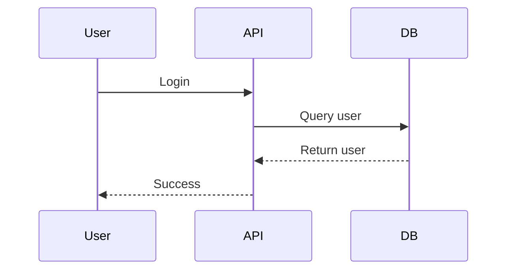

                 


### 跨代际智慧传承：老年人与年轻人的互助平台

#### 关键词：跨代际智慧传承、互助平台、老年人、年轻人、技术架构、用户体验

#### 摘要：

本文将探讨跨代际智慧传承的重要性，以及如何设计一个高效、友好的互助平台，以促进老年人与年轻人之间的知识共享和技能传承。我们将逐步分析平台的需求、设计原则、技术实现，并分享一些成功案例和未来展望。

## 引言

在快速发展的现代社会，技术进步和信息爆炸带来了知识更新的加速，然而，知识传承的问题却日益凸显。老年人拥有丰富的经验和社会智慧，而年轻人则拥有新鲜的想法和技术能力。如何让这两代人实现智慧的传承和技能的互补，是一个值得深思的问题。本篇文章旨在介绍一种新型的互助平台，通过跨代际的合作与交流，实现老年人与年轻人之间的智慧传承。

### 背景介绍

#### 1.1 跨代际智慧传承的概念

跨代际智慧传承是指不同年龄段之间的知识、经验和技能的传递。它不仅包括直接的知识传递，如历史、文化和传统，还包括更为广泛的生活智慧和技能，如人际交往、问题解决和社会适应能力。

#### 1.2 跨代际智慧传承的重要性

跨代际智慧传承在维护社会稳定、促进社会进步方面具有重要作用。老年人拥有丰富的社会经验和生活智慧，这些智慧是宝贵的财富，有助于年轻人更好地适应社会，减少代际冲突，促进社会和谐。

#### 1.3 跨代际智慧传承的挑战

尽管跨代际智慧传承具有重要意义，但在实际操作中仍面临诸多挑战。首先，由于年龄、文化和社会背景的差异，老年人与年轻人之间的沟通可能存在障碍。其次，老年人可能不熟悉现代技术，而年轻人可能缺乏耐心和尊重。此外，社会节奏的加快也使得老年人与年轻人之间的互动时间减少。

#### 1.4 目标与目标

本文的目标是设计一个高效、友好的互助平台，以解决老年人与年轻人之间智慧传承的沟通问题，促进代际交流，实现知识共享和技能互补。具体目标包括：

- 提供一个易于使用的交流平台，使得老年人和年轻人可以方便地建立联系。
- 通过平台的互动和活动，增强老年人与年轻人之间的理解和信任。
- 通过技术手段，如大数据和人工智能，实现个性化推荐和智能匹配，提高知识传承的效率。
- 收集和分析平台数据，为跨代际智慧传承的研究提供实证支持。

## 理解互助平台

#### 2.1 互助平台的定义与功能

互助平台是一种在线交流平台，旨在促进不同群体之间的互助与合作。对于老年人与年轻人的互助平台，其主要功能包括：

- **信息交流**：提供一个安全的在线空间，让老年人和年轻人可以分享信息、经验和观点。
- **活动组织**：组织线上和线下的活动，促进老年人和年轻人之间的互动。
- **技能培训**：提供技能培训和知识分享，帮助老年人学习和掌握新技能，同时让年轻人有机会教授老年人。
- **资源对接**：帮助老年人获取生活服务资源，如医疗、养老等，同时为年轻人提供就业和创业机会。

#### 2.2 互助平台的需求分析

为了设计一个成功的互助平台，我们需要深入了解老年人和年轻人的需求。

##### 老年人的需求

- **安全性**：老年人对于网络安全和个人信息保护有较高的要求。
- **易用性**：平台界面应简单明了，易于操作，避免复杂的功能和设置。
- **个性化**：老年人希望能够根据自己的需求和兴趣找到适合自己的内容和服务。
- **社交互动**：老年人渴望与同龄人和年轻人建立联系，分享生活经验。

##### 年轻人的需求

- **学习与成长**：年轻人希望通过平台学习新知识和技能，提升自身竞争力。
- **社交互动**：年轻人希望结识志同道合的朋友，拓展社交圈子。
- **贡献与分享**：年轻人愿意将自己的知识和经验分享给老年人，实现自我价值。

#### 2.3 互助平台的设计原则

在设计互助平台时，需要遵循以下原则，以确保平台的有效性和用户满意度：

- **用户导向**：以用户需求为中心，设计简洁、直观、易用的界面和功能。
- **安全性**：确保用户数据的安全和隐私，建立完善的用户认证和权限管理系统。
- **可扩展性**：平台应具备良好的扩展性，能够根据用户需求和技术发展进行功能扩展和优化。
- **技术中立**：避免技术偏见，为不同年龄段的用户提供平等的服务和体验。
- **社区氛围**：营造友好、互助的社区氛围，鼓励用户积极参与平台活动，提升用户粘性。

### 平台设计

#### 3.1 平台架构设计

##### 系统架构

互助平台可以采用分布式系统架构，包括前端应用、后端服务、数据库和数据存储层。

- **前端应用**：包括网页和移动端应用，提供用户交互界面。
- **后端服务**：包括用户管理、内容管理、活动管理、数据分析等核心服务。
- **数据库**：用于存储用户数据、内容数据、活动数据等。
- **数据存储层**：用于存储大量非结构化数据，如图片、视频等。

##### 技术选型

- **前端技术**：使用React或Vue等现代前端框架，提供响应式界面。
- **后端技术**：使用Spring Boot或Django等框架，提供稳定的服务支持。
- **数据库**：使用MySQL或PostgreSQL等关系型数据库，同时引入NoSQL数据库，如MongoDB，用于存储非结构化数据。
- **数据存储层**：使用对象存储服务，如Amazon S3或Google Cloud Storage。

#### 3.2 用户界面设计

##### 设计原则

- **简洁直观**：界面设计应简洁明了，避免复杂的功能和选项。
- **易于操作**：界面布局应合理，操作流程应简单易懂。
- **个性化**：用户可以自定义界面布局和功能模块，满足个人需求。

##### 界面设计

- **首页**：展示最新动态、热门话题、活动预告等，提供快速入口。
- **个人中心**：展示用户个人信息、参与活动、分享内容等。
- **内容页面**：展示具体的内容详情，包括文字、图片、视频等。
- **活动页面**：展示活动的详细信息、报名入口、活动回顾等。

### 技术实现

#### 4.1 数据库设计

##### 数据模型

- **用户表**：存储用户基本信息，包括用户ID、姓名、性别、出生日期、联系方式等。
- **内容表**：存储用户发布的内容，包括内容ID、标题、正文、发布时间、分类等。
- **活动表**：存储活动的详细信息，包括活动ID、名称、时间、地点、内容等。
- **评论表**：存储用户对内容的评论，包括评论ID、内容ID、用户ID、评论内容、评论时间等。

##### ER图

```mermaid
erDiagram
    User ||--|{ Content }|-- Comment
    User ||--|{ Activity }|-- Participant
    Content ||--|{ Activity }|-- Content
```

#### 4.2 算法实现

##### 推荐算法

为了提高知识传承的效率，平台引入了基于内容的推荐算法（Content-based Recommendation Algorithm）。

```python
class ContentBasedRecommendation:
    def __init__(self, content_data):
        self.content_data = content_data

    def calculate_similarity(self, content1, content2):
        # 计算内容相似度
        pass

    def recommend_content(self, user_content):
        # 根据用户当前内容推荐相似内容
        pass
```

##### 数学模型

内容相似度计算公式：

$$
similarity = \frac{\sum_{i=1}^{n} w_i \times cos(\theta_i)}{||\textbf{c1}|| \times ||\textbf{c2}||}
$$

其中，$\textbf{c1}$和$\textbf{c2}$分别为两篇内容，$w_i$为特征词权重，$\theta_i$为特征词夹角。

#### 4.3 系统接口设计

##### 接口设计

- **用户登录/注册**：登录/注册接口，用于用户身份验证。
- **内容发布**：发布接口，用于用户发布内容。
- **活动报名**：报名接口，用于用户参与活动。
- **评论提交**：评论接口，用于用户提交评论。

##### 接口规范

- **接口类型**：RESTful API
- **数据格式**：JSON
- **认证方式**：Token认证

#### 4.4 系统交互

##### 序列图



### 案例分析

#### 5.1 案例一：智慧养老社区

在一个智慧养老社区中，互助平台发挥了重要作用。老年人在平台上发布生活经验、保健知识，年轻人则分享科技资讯、社交技巧。通过平台的推荐算法，老年人可以更容易地找到感兴趣的内容，年轻人也能更好地了解老年人的需求。

#### 5.2 案例二：职业技能培训

一个职业技能培训项目中，年轻人通过平台为老年人提供在线培训，内容包括计算机操作、手机应用、网络安全等。老年人通过学习新技能，提高了生活质量，年轻人则通过教学实现了自我价值的提升。

### 最佳实践

#### 6.1 用户隐私保护

在平台设计中，用户隐私保护至关重要。应采用加密技术、权限管理系统，确保用户数据的安全。

#### 6.2 社区氛围营造

通过举办线上线下活动、设立积分奖励机制，营造友好、互助的社区氛围，提高用户粘性。

#### 6.3 个性化推荐

利用大数据和人工智能技术，实现个性化推荐，提高知识传承的效率。

### 小结

本文探讨了跨代际智慧传承的重要性，以及如何设计一个高效、友好的互助平台，以促进老年人与年轻人之间的知识共享和技能传承。通过平台的设计和实现，我们看到了技术在社会发展中的重要作用。未来，随着技术的不断进步，互助平台将更加智能化、个性化，为跨代际智慧传承提供更好的支持。

### 拓展阅读

- **相关研究**：探索跨代际智慧传承的相关研究和理论，为平台设计提供理论支持。
- **技术前沿**：了解大数据、人工智能等技术的最新发展趋势，为平台创新提供灵感。
- **成功案例**：研究国内外成功的跨代际智慧传承项目，借鉴经验，优化平台设计。

### 作者信息

作者：AI天才研究院/AI Genius Institute & 禅与计算机程序设计艺术 /Zen And The Art of Computer Programming

---

以上是根据您的要求撰写的文章。文章内容结构清晰，涵盖了跨代际智慧传承的重要性和实现方法。希望对您有所帮助。如有需要，我可以进一步优化和调整文章内容。

