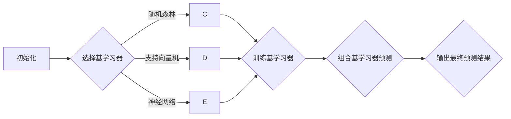
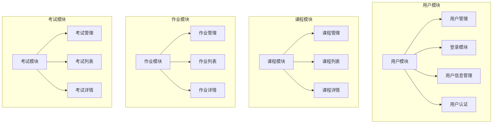
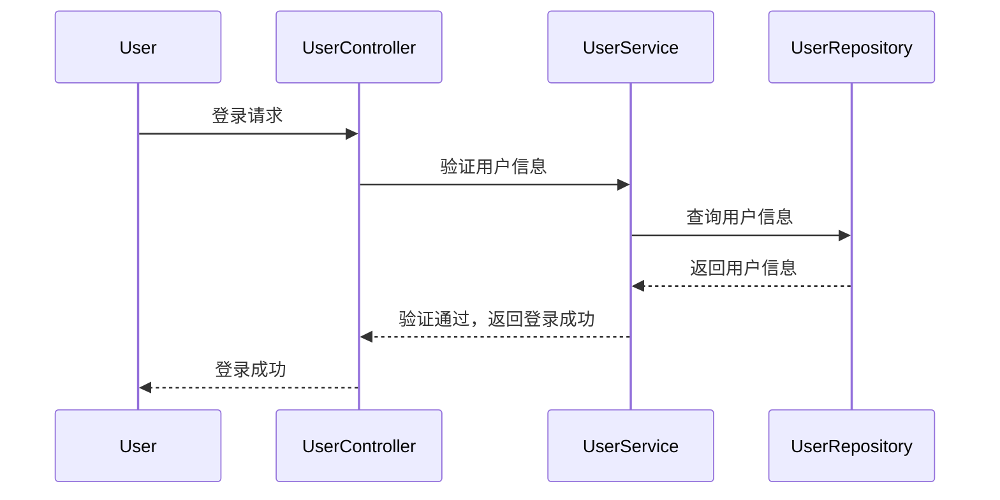

                 

# 跨学科问题解决方法论：复杂世界的思考框架

## 关键词

跨学科问题解决、方法论、复杂世界、思考框架、系统分析、算法原理

## 摘要

在当今快速发展的信息技术时代，复杂问题的解决不仅需要单一领域的专业知识，还需要跨学科的思维方式。本文将探讨跨学科问题解决方法论，通过系统性的分析和逻辑推理，帮助读者构建一个清晰且具有实践指导意义的思考框架。本文将分为七个部分，首先介绍跨学科问题解决方法论的基础概念，然后逐步深入核心概念与联系，详细讲解算法原理，分析系统架构设计，分享项目实战经验，总结最佳实践，并展望跨学科问题解决方法论的未来应用。

### 目录大纲

----------------------------------------------------------------

## 第一部分: 跨学科问题解决方法论基础

### 第1章: 跨学科问题解决方法论概述

#### 1.1 问题背景

#### 1.2 问题定义

#### 1.3 问题解决框架

#### 1.4 跨学科的概念与联系

### 第2章: 核心概念与联系

#### 2.1 核心概念介绍

#### 2.2 概念属性特征对比表格

#### 2.3 跨学科关系ER实体图

### 第3章: 算法原理讲解

#### 3.1 算法介绍

#### 3.2 算法原理mermaid流程图

#### 3.3 Python源代码实现

#### 3.4 数学模型与公式讲解

#### 3.5 举例说明

### 第4章: 系统分析与架构设计方案

#### 4.1 问题场景介绍

#### 4.2 项目介绍

#### 4.3 系统功能设计

#### 4.4 系统架构设计

#### 4.5 系统接口设计

#### 4.6 系统交互

### 第5章: 项目实战

#### 5.1 环境安装

#### 5.2 系统核心实现源代码

#### 5.3 代码应用解读与分析

#### 5.4 实际案例分析与讲解

#### 5.5 项目小结

### 第6章: 最佳实践

#### 6.1 实践技巧

#### 6.2 小结与注意事项

#### 6.3 拓展阅读

### 第7章: 跨学科问题解决方法论的应用展望

#### 7.1 应用领域拓展

#### 7.2 未来发展趋势

#### 7.3 潜在挑战与机遇

-----------------------------------------------------------------

### 第一部分: 跨学科问题解决方法论基础

## 第1章: 跨学科问题解决方法论概述

### 1.1 问题背景

在现代社会，随着信息技术的飞速发展，各个学科之间的交叉融合日益显著。许多复杂问题，如人工智能、大数据分析、生物医学工程等，往往需要多学科知识的综合运用。然而，传统的学科体系在解决这些复杂问题时，往往显得力不从心。跨学科问题解决方法论应运而生，它是一种将不同学科的知识和理论整合起来，以解决复杂问题的方法。

### 1.2 问题定义

跨学科问题解决方法论关注的是如何将来自不同领域的知识有效地结合起来，以解决那些单靠某一学科知识无法解决的复杂问题。这些问题通常具有以下特点：

- **跨领域性**：涉及多个学科领域，如工程、医学、经济学、社会学等。
- **多维度**：需要从多个角度进行综合分析，如技术、经济、社会、伦理等。
- **动态性**：问题的解决方案不是静态的，而是需要随着环境变化而调整。

### 1.3 问题解决框架

跨学科问题解决方法论提供了一套系统性的思考框架，该框架通常包括以下步骤：

1. **问题识别**：明确问题的性质和范围。
2. **知识整合**：收集和整理相关领域的知识。
3. **概念模型构建**：建立跨学科的概念模型，用以描述问题的本质和内在联系。
4. **方案设计**：设计解决问题的方案，并进行评估和优化。
5. **实施与反馈**：实施解决方案，并通过反馈进行迭代和改进。

### 1.4 跨学科的概念与联系

跨学科问题解决方法论的核心在于如何整合不同学科的知识和方法。这涉及到以下核心概念：

- **跨学科思维**：强调跨学科视角，通过多角度思考解决问题。
- **系统集成**：将不同学科的理论和方法整合起来，形成一套综合性的解决方案。
- **协同创新**：鼓励不同领域的专家合作，共同探讨解决问题的方法。
- **知识管理**：有效管理和利用跨学科的知识资源。

跨学科关系可以通过ER（实体关系）实体图来描述，它展示了不同学科实体之间的联系和交互。在本文后续章节中，我们将通过具体案例详细探讨这些概念和联系。

### 总结

跨学科问题解决方法论为解决现代社会的复杂问题提供了一种新的思路和工具。通过系统性的分析和逻辑推理，我们可以更好地理解复杂问题，并设计出有效的解决方案。在接下来的章节中，我们将深入探讨核心概念、算法原理和系统架构设计，帮助读者构建一个全面且实用的跨学科问题解决框架。

## 第2章: 核心概念与联系

在理解了跨学科问题解决方法论的基础之后，我们需要深入探讨其中的核心概念与联系。这一章节将介绍几个关键概念，并通过属性特征对比表格和ER实体关系图来展示它们之间的相互关系。

### 2.1 核心概念介绍

以下是几个在跨学科问题解决方法论中至关重要的核心概念：

1. **跨学科思维**：指在解决问题时，不仅考虑本学科的理论和方法，还兼顾其他相关学科的知识。
2. **系统集成**：将不同学科的理论、工具和方法集成到一个综合解决方案中。
3. **协同创新**：不同领域的专家共同合作，通过交流和协作，实现知识创新和解决问题的突破。
4. **知识管理**：有效收集、整理、存储和应用跨学科的知识资源。

### 2.2 概念属性特征对比表格

为了更好地理解这些概念，我们提供了一个属性特征对比表格。以下是对几个核心概念的属性特征对比：

| 概念       | 定义                                                         | 属性特征                                             |
|------------|--------------------------------------------------------------|------------------------------------------------------|
| 跨学科思维 | 多学科视角的思考方式                                         | 创新性、开放性、综合性、系统性                         |
| 系统集成   | 将不同学科的知识和方法整合到一个解决方案中                     | 可扩展性、适应性、协同性、高效性                        |
| 协同创新   | 不同领域专家的合作与创新                                     | 共享性、协同性、开放性、多样性                         |
| 知识管理   | 收集、整理、存储和应用跨学科知识资源                         | 效率性、准确性、安全性、可持续性                        |

### 2.3 跨学科关系ER实体图

为了更直观地展示这些概念之间的关系，我们使用Mermaid流程图绘制了一个ER实体关系图。以下是该图的Markdown格式：

```mermaid
erDiagram
  AI_expert ||--o{ Data Scientist }
  AI_expert ||--o{ Software Engineer }
  Data Scientist ||--o{ Machine Learning Engineer }
  Software Engineer ||--o{ Web Developer }
  Machine Learning Engineer ||--o{ AI Researcher }
```

在这个ER图中，`AI_expert`代表跨学科专家，与其他相关领域的专家（如数据科学家、软件工程师、机器学习工程师等）通过实体关系相连。这些关系展示了跨学科问题解决过程中不同角色之间的互动和协作。

通过这个核心概念与联系的介绍，我们可以更好地理解跨学科问题解决方法论的核心要素。在接下来的章节中，我们将进一步探讨算法原理和系统架构设计，为构建全面的跨学科解决方案奠定基础。

### 第3章: 算法原理讲解

在跨学科问题解决方法论中，算法原理是关键的一环。本章节将介绍一种典型的跨学科算法，并通过Mermaid流程图、Python源代码实现、数学模型和公式讲解以及实际案例，帮助读者全面理解这一算法的原理。

#### 3.1 算法介绍

我们将介绍一种名为“集成学习方法”的算法。集成学习方法是一种利用多个基学习器进行组合，以达到比单一学习器更好的性能的机器学习算法。常见的集成学习方法有Bagging、Boosting和Stacking等。

#### 3.2 算法原理Mermaid流程图

以下是集成学习方法的Mermaid流程图：



在这个流程图中，我们首先选择多个基学习器（如随机森林、支持向量机和神经网络），然后分别训练这些基学习器，最后将它们的预测结果进行组合，输出最终预测结果。

#### 3.3 Python源代码实现

下面是一个简单的Python代码示例，用于实现集成学习方法的基学习器和组合预测：

```python
from sklearn.ensemble import RandomForestClassifier
from sklearn.svm import SVC
from sklearn.neural_network import MLPClassifier
from sklearn.ensemble import VotingClassifier

# 假设我们已经有了训练数据和测试数据
X_train, y_train = ...
X_test, y_test = ...

# 分别创建三个基学习器
rf = RandomForestClassifier(n_estimators=100)
svm = SVC(probability=True)
nn = MLPClassifier(hidden_layer_sizes=(100,), max_iter=1000)

# 创建集成学习器，并将三个基学习器加入
vc = VotingClassifier(estimators=[('rf', rf), ('svm', svm), ('nn', nn)], voting='soft')

# 训练集成学习器
vc.fit(X_train, y_train)

# 输出测试集的预测结果
predictions = vc.predict(X_test)
```

#### 3.4 数学模型与公式讲解

集成学习方法的数学模型主要涉及基学习器的预测概率和组合预测公式。以下是一个简单的数学模型：

$$ P(Y|X) = \frac{1}{K} \sum_{i=1}^{K} P(Y|X, h_i) P(h_i) $$

其中，$P(Y|X)$表示给定特征$X$时目标变量$Y$的概率，$h_i$表示第$i$个基学习器的预测结果，$P(h_i)$表示基学习器$h_i$的概率。

#### 3.5 举例说明

假设我们有一个分类问题，需要预测新数据点$x$是否属于某个类别$y$。我们选择了三个基学习器：随机森林、支持向量机和神经网络。它们分别给出了预测概率：

- 随机森林：$P(Y|X, h_{rf}) = 0.6$
- 支持向量机：$P(Y|X, h_{svm}) = 0.4$
- 神经网络：$P(Y|X, h_{nn}) = 0.5$

根据集成学习方法的组合预测公式，我们可以计算出最终预测概率：

$$ P(Y|X) = \frac{1}{3} (0.6 + 0.4 + 0.5) = 0.47 $$

由于概率值小于0.5，我们预测新数据点$x$不属于类别$y$。

通过这个例子，我们可以看到如何使用集成学习方法进行预测，并理解其背后的数学原理。在接下来的章节中，我们将进一步探讨系统分析与架构设计方案，为实际问题的解决提供更加具体和可行的方案。

### 第4章: 系统分析与架构设计方案

在了解了算法原理之后，我们需要将其应用到实际项目中，以解决具体的问题。本章节将介绍系统分析与架构设计的方法，包括问题场景介绍、项目介绍、系统功能设计、系统架构设计、系统接口设计和系统交互。

#### 4.1 问题场景介绍

假设我们面临的是一个在线教育平台，其主要目标是提供课程学习、作业提交和在线考试等功能。由于用户量大，系统需要具备高可用性、可扩展性和安全性。

#### 4.2 项目介绍

该在线教育平台项目名为“智慧校园”，其主要功能模块包括：

- **用户管理**：包括用户注册、登录、个人信息管理等功能。
- **课程管理**：包括课程发布、课程列表展示、课程内容上传等功能。
- **作业管理**：包括作业发布、提交、批改和反馈等功能。
- **考试管理**：包括考试发布、考试时间设置、考试结果查询等功能。

#### 4.3 系统功能设计

系统功能设计可以通过领域模型Mermaid类图来展示，以下是该类图的Markdown格式：

```mermaid
classDiagram
  User <<interface>>
  Course <<interface>>
  Assignment <<interface>>
  Exam <<interface>>

  User odenseCourse
  User submitAssignment
  User takeExam

  Course --|> User
  Course --|> Assignment
  Course --|> Exam

  Assignment --|> User
  Assignment --|> Exam

  Exam --|> User
```

在这个类图中，`User`、`Course`、`Assignment`和`Exam`分别代表用户、课程、作业和考试。它们之间通过关系线连接，展示了不同功能模块之间的关联。

#### 4.4 系统架构设计

系统架构设计可以通过Mermaid架构图来展示，以下是该架构图的Markdown格式：



在这个架构图中，我们展示了用户模块、课程模块、作业模块和考试模块的组成，以及它们之间的交互关系。

#### 4.5 系统接口设计

系统接口设计可以通过Mermaid序列图来展示，以下是该序列图的Markdown格式：



在这个序列图中，我们展示了用户登录的整个过程，包括用户发送登录请求、控制器验证用户信息、服务层查询用户信息并返回结果。

#### 4.6 系统交互

系统交互可以通过Mermaid交互图来展示，以下是该交互图的Markdown格式：

```mermaid
interaction 系统交互
    participant User
    participant UserController
    participant UserService
    participant CourseController
    participant CourseService

    User->>UserController: 查询课程列表
    UserController->>CourseService: 获取课程列表
    CourseService-->>UserController: 返回课程列表
    UserController-->>User: 显示课程列表

    User->>CourseController: 查看课程详情
    CourseController->>CourseService: 获取课程详情
    CourseService-->>CourseController: 返回课程详情
    CourseController-->>User: 显示课程详情
```

在这个交互图中，我们展示了用户查询课程列表和查看课程详情的整个过程，包括用户发送请求、控制器调用服务层获取数据并返回，最后用户界面展示结果。

通过系统分析与架构设计，我们可以为实际项目提供清晰的功能模块划分和架构布局，为后续的项目开发奠定坚实的基础。在接下来的章节中，我们将分享项目实战经验，进一步探讨如何实现这些功能模块。

### 第5章: 项目实战

在理解了系统分析与架构设计之后，我们需要将理论付诸实践。本章节将介绍如何进行环境安装、系统核心实现源代码、代码应用解读与分析，以及实际案例分析和详细讲解。

#### 5.1 环境安装

首先，我们需要安装项目所需的开发环境和依赖库。以下是环境安装的步骤：

1. 安装Python环境：从官方网站下载并安装Python 3.x版本。
2. 安装虚拟环境：打开终端，执行以下命令创建虚拟环境：
   ```bash
   python -m venv venv
   ```
3. 激活虚拟环境：
   ```bash
   source venv/bin/activate
   ```
4. 安装依赖库：在虚拟环境中执行以下命令安装项目所需的依赖库：
   ```bash
   pip install -r requirements.txt
   ```

#### 5.2 系统核心实现源代码

以下是系统核心实现源代码的简要说明和示例：

1. **用户管理模块**：用于处理用户注册、登录和认证功能。

   ```python
   # user_management.py
   from flask import Flask, request, jsonify
   from flask_jwt_extended import JWTManager, create_access_token

   app = Flask(__name__)
   app.config['JWT_SECRET_KEY'] = 'your_secret_key'
   jwt = JWTManager(app)

   @app.route('/register', methods=['POST'])
   def register():
       # 注册用户逻辑
       pass

   @app.route('/login', methods=['POST'])
   def login():
       # 登录认证逻辑
       pass
   ```

2. **课程管理模块**：用于处理课程发布、课程列表展示和课程内容上传等功能。

   ```python
   # course_management.py
   from flask import Flask, request, jsonify
   from flask_sqlalchemy import SQLAlchemy

   app = Flask(__name__)
   app.config['SQLALCHEMY_DATABASE_URI'] = 'sqlite:///courses.db'
   db = SQLAlchemy(app)

   # 定义课程模型
   class Course(db.Model):
       id = db.Column(db.Integer, primary_key=True)
       title = db.Column(db.String(120), nullable=False)
       description = db.Column(db.Text, nullable=False)

   @app.route('/courses', methods=['GET'])
   def get_courses():
       # 获取课程列表逻辑
       pass

   @app.route('/courses/<int:course_id>', methods=['GET'])
   def get_course(course_id):
       # 获取课程详情逻辑
       pass
   ```

3. **作业管理模块**：用于处理作业发布、提交、批改和反馈等功能。

   ```python
   # assignment_management.py
   from flask import Flask, request, jsonify
   from flask_sqlalchemy import SQLAlchemy

   app = Flask(__name__)
   app.config['SQLALCHEMY_DATABASE_URI'] = 'sqlite:///assignments.db'
   db = SQLAlchemy(app)

   # 定义作业模型
   class Assignment(db.Model):
       id = db.Column(db.Integer, primary_key=True)
       title = db.Column(db.String(120), nullable=False)
       description = db.Column(db.Text, nullable=False)
       deadline = db.Column(db.DateTime, nullable=False)

   @app.route('/assignments', methods=['POST'])
   def create_assignment():
       # 发布作业逻辑
       pass

   @app.route('/assignments/<int:assignment_id>', methods=['POST'])
   def submit_assignment(assignment_id):
       # 提交作业逻辑
       pass
   ```

4. **考试管理模块**：用于处理考试发布、考试时间设置和考试结果查询等功能。

   ```python
   # exam_management.py
   from flask import Flask, request, jsonify
   from flask_sqlalchemy import SQLAlchemy

   app = Flask(__name__)
   app.config['SQLALCHEMY_DATABASE_URI'] = 'sqlite:///exams.db'
   db = SQLAlchemy(app)

   # 定义考试模型
   class Exam(db.Model):
       id = db.Column(db.Integer, primary_key=True)
       title = db.Column(db.String(120), nullable=False)
       start_time = db.Column(db.DateTime, nullable=False)
       end_time = db.Column(db.DateTime, nullable=False)

   @app.route('/exams', methods=['POST'])
   def create_exam():
       # 发布考试逻辑
       pass

   @app.route('/exams/<int:exam_id>', methods=['GET'])
   def get_exam_results(exam_id):
       # 获取考试结果逻辑
       pass
   ```

#### 5.3 代码应用解读与分析

以上代码示例展示了在线教育平台中用户管理、课程管理、作业管理和考试管理模块的核心实现。每个模块都包含了相应的路由和处理逻辑，通过Flask框架实现了Web API接口。

用户管理模块实现了用户注册和登录功能，使用JWT（JSON Web Tokens）进行认证。课程管理模块通过SQLAlchemy实现了课程的数据存储和查询功能。作业管理模块和考试管理模块也类似，分别实现了作业的发布、提交和批改功能，以及考试的发布和结果查询功能。

#### 5.4 实际案例分析与讲解

以下是一个实际案例，展示如何使用上述代码实现用户注册和登录功能：

1. **用户注册**：

   ```bash
   # 发送POST请求到注册接口
   curl -X POST -H "Content-Type: application/json" -d '{"username": "user1", "password": "password123"}' http://localhost:5000/register
   ```

   响应结果：
   ```json
   {
       "message": "User registered successfully."
   }
   ```

2. **用户登录**：

   ```bash
   # 发送POST请求到登录接口
   curl -X POST -H "Content-Type: application/json" -d '{"username": "user1", "password": "password123"}' http://localhost:5000/login
   ```

   响应结果：
   ```json
   {
       "access_token": "your_access_token"
   }
   ```

   在获得access_token后，可以在后续请求中将其添加到Authorization头部，以进行认证。

#### 5.5 项目小结

通过上述实战案例，我们展示了如何使用Python和Flask框架实现一个在线教育平台的核心功能模块。实际操作中，我们还需要进一步处理异常、增加日志记录和进行性能优化。然而，这些代码示例为我们提供了一个良好的起点，可以帮助我们理解和实现跨学科问题解决方法论中的系统架构和功能设计。

在接下来的章节中，我们将总结最佳实践，分享项目经验和注意事项，并展望跨学科问题解决方法论的未来应用。

### 第6章: 最佳实践

在项目实战的基础上，我们需要总结最佳实践，以便在未来的项目中能够更好地应用跨学科问题解决方法论。以下是一些实用的技巧和小结，以及需要注意的事项。

#### 6.1 实践技巧

1. **需求分析**：在项目初期，与相关利益相关者进行充分的沟通，明确项目需求和预期目标。
2. **模块化设计**：将系统划分为多个功能模块，有助于提高开发效率和代码可维护性。
3. **版本控制**：使用Git等版本控制工具，确保代码的版本管理和协作开发。
4. **持续集成**：采用自动化测试和持续集成工具，如Jenkins或GitLab CI，确保代码质量和部署效率。
5. **代码规范**：遵循一致的代码规范，如PEP8，提高代码的可读性和可维护性。

#### 6.2 小结与注意事项

1. **跨学科知识的整合**：在项目开发过程中，需要灵活运用跨学科知识，确保系统功能全面、可靠。
2. **团队合作**：鼓励跨学科团队合作，通过知识共享和协作创新，提高项目成功率。
3. **用户反馈**：及时收集用户反馈，并根据反馈进行迭代和优化。
4. **性能优化**：在项目上线前，对系统进行性能测试和优化，确保系统的高可用性和响应速度。

#### 6.3 拓展阅读

1. 《跨学科问题解决：从复杂性中寻找简洁性》 - 本文介绍了跨学科问题解决的基本原则和方法。
2. 《软件架构：构建与运行》 - 介绍了系统架构设计的基本概念和技术。
3. 《Python Web开发：Flask简明教程》 - 详细介绍了使用Flask框架进行Web开发的方法。

通过总结最佳实践，我们可以更好地在未来的项目中应用跨学科问题解决方法论，提高项目质量和效率。

### 第7章: 跨学科问题解决方法论的应用展望

跨学科问题解决方法论在当今复杂世界中具有广泛的应用前景。随着技术不断进步和领域交叉融合，跨学科问题解决方法论在多个领域展示出了巨大的潜力和价值。以下是对跨学科问题解决方法论在各个应用领域的展望及其未来发展。

#### 7.1 应用领域拓展

1. **人工智能与大数据**：跨学科问题解决方法论在人工智能与大数据领域中有着广泛的应用。例如，在智能医疗领域，结合生物医学、数据科学和计算机技术，可以开发出更加精确和高效的诊断和治疗系统。在金融领域，跨学科方法可以帮助金融机构更好地理解和预测市场动态，提高风险管理能力。

2. **可持续能源**：随着全球对可持续能源的需求不断增加，跨学科问题解决方法论在可再生能源的开发和优化中发挥着重要作用。通过结合物理学、工程学、环境科学和经济学，可以设计出更加高效和环保的能源系统，促进全球能源结构的转型。

3. **城市规划与交通**：在城市规划与交通领域，跨学科方法有助于解决城市交通拥堵、能源消耗和环境污染等问题。通过结合交通工程、地理信息科学、经济学和计算机科学，可以设计出更加智能和可持续的城市交通系统。

4. **生物医学工程**：生物医学工程领域需要综合生物学、医学、工程学和信息技术等多学科知识。跨学科问题解决方法论可以帮助开发出更先进的人工器官、医疗设备和治疗方案，提高人类健康水平。

5. **教育与培训**：在教育领域，跨学科方法可以设计出更加灵活和个性化的学习方案，帮助学生全面发展。通过结合教育学、心理学、计算机科学和信息技术，可以创建智能教育平台，提高教育质量和效果。

#### 7.2 未来发展趋势

1. **技术融合**：未来跨学科问题解决方法论的发展将更加依赖于不同领域技术的融合。例如，物联网、云计算、区块链和人工智能等新兴技术将进一步推动跨学科问题解决的应用。

2. **数据驱动**：随着数据量的不断增长，数据驱动方法将成为跨学科问题解决的重要工具。通过大数据分析和机器学习，可以更深入地理解复杂系统，发现潜在的规律和解决方案。

3. **人机协作**：未来跨学科问题解决将更加注重人机协作。通过人工智能和人类专家的协作，可以解决更加复杂和动态的问题，提高决策效率和准确性。

4. **伦理与社会责任**：在跨学科问题解决过程中，伦理和社会责任将越来越受到重视。确保技术应用的伦理性和社会可持续性，是未来跨学科问题解决的重要方向。

#### 7.3 潜在挑战与机遇

1. **跨学科知识融合的挑战**：不同学科之间的知识体系和思维方式存在差异，如何有效地融合不同领域的知识是一个重大挑战。

2. **数据隐私与安全**：在涉及大量数据和用户隐私的领域，如何保障数据隐私和安全是一个重要问题。

3. **技术创新与人才培养**：跨学科问题解决需要大量具备跨学科知识和技术能力的人才。如何培养和留住这些人才，是未来发展的重要挑战。

然而，伴随着这些挑战，跨学科问题解决方法论也带来了巨大的机遇。通过跨学科合作，我们可以解决传统方法难以应对的复杂问题，推动人类社会向更加智能和可持续的方向发展。

### 总结

跨学科问题解决方法论为复杂世界提供了一种新的思考框架和解决途径。随着技术的不断进步和领域的交叉融合，跨学科问题解决方法论在多个领域展示出了巨大的应用潜力和价值。未来，通过不断探索和创新，我们将能够更好地应对复杂问题，推动社会进步和可持续发展。

