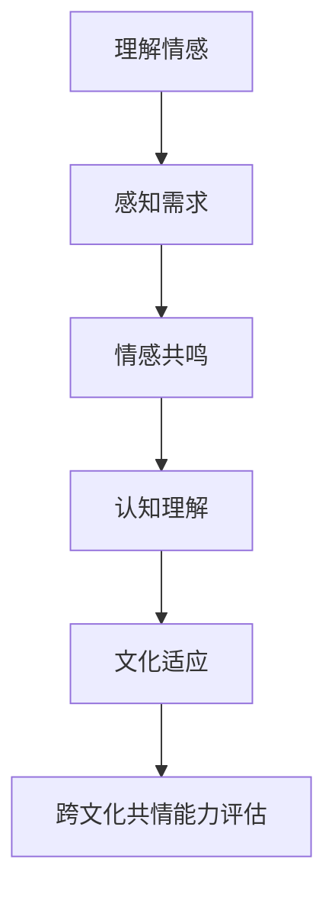
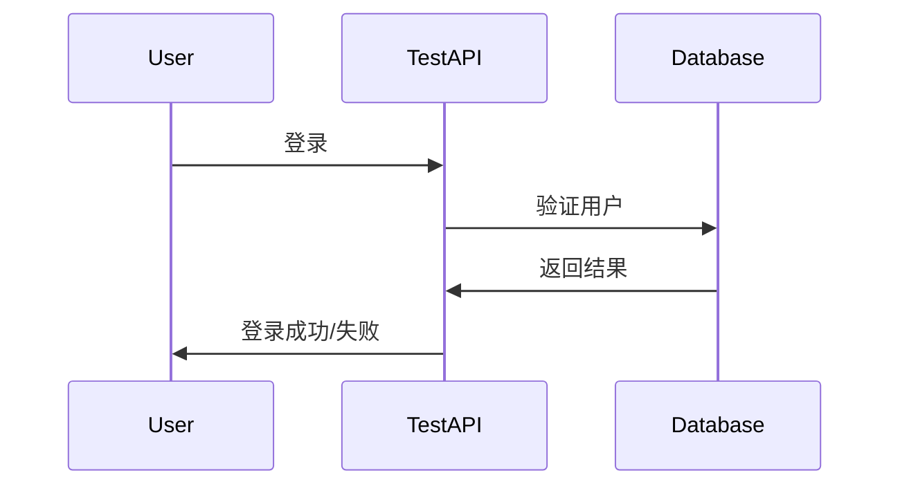
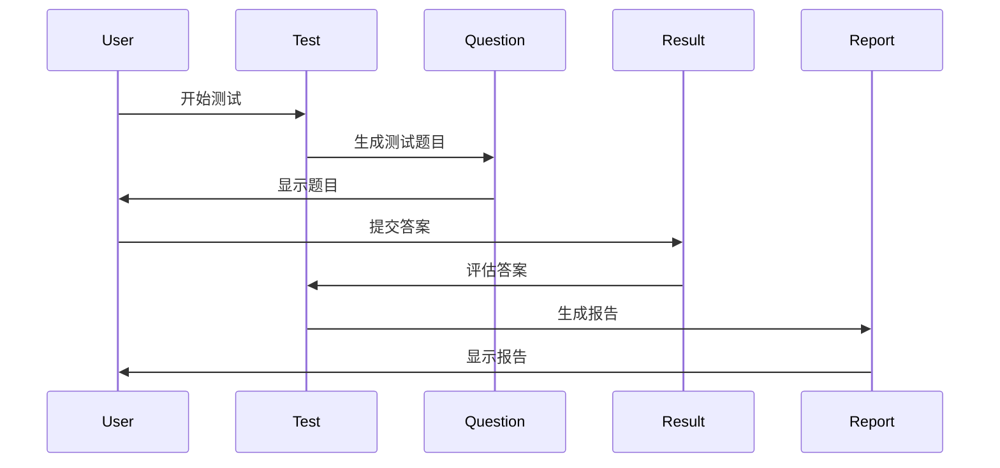

                 

### 文章标题

# 跨文化共情能力测试：全球化时代的社交技能评估

### 关键词

- **跨文化共情能力测试**
- **全球化时代**
- **社交技能评估**
- **文化多样性**
- **国际交流**
- **跨文化沟通**

### 摘要

在全球化日益深入的今天，跨文化共情能力成为评估个人或团队社交技能的关键指标。本文从跨文化共情的概念、重要性出发，探讨了全球化背景下的社交技能，并构建了一套跨文化共情能力测试框架。通过工具分类、案例分析以及实际应用，本文为读者提供了理解和提升跨文化共情能力的方法，并对未来的发展趋势进行了展望。

## 第一部分: 引言与背景

### 第1章: 引言

#### 1.1 研究背景

随着全球化的推进，国际交流与合作日益频繁。然而，文化差异成为影响交流效果的重要因素。跨文化共情能力，即在跨文化交流中理解和感受对方情感的能力，成为衡量个体社交技能的重要标准。提高跨文化共情能力，有助于消除文化隔阂，促进国际间的和谐与合作。

#### 1.2 研究目的

本文旨在探讨跨文化共情能力的概念、重要性，并构建一套科学、有效的跨文化共情能力测试体系。通过分析现有理论和方法，结合实际案例，提出实用的提升策略，以期为个人和组织在全球化背景下提供有益的指导。

#### 1.3 研究意义

跨文化共情能力测试对于全球化时代的国际交流具有重要意义。它不仅有助于个体更好地适应多元文化环境，还能提升团队协作效率，增强组织的国际竞争力。同时，本文的研究成果为相关领域的研究提供了新的视角和方法。

#### 1.4 研究方法

本文采用文献综述和实证研究相结合的方法。首先，通过文献调研，梳理跨文化共情能力的理论基础和实践方法。其次，设计并实施一套跨文化共情能力测试工具，收集数据并进行统计分析，以验证测试工具的有效性和可靠性。

## 第2章: 跨文化共情的概念与理论

### 2.1 跨文化共情的定义

跨文化共情是指个体在跨文化交流过程中，能够超越自身文化背景，理解和感受对方情感和需求的能力。它包括情感共鸣、认知理解和文化适应三个层次。

#### 情感共鸣

情感共鸣是指个体能够感受到对方情绪，产生共情反应。

#### 认知理解

认知理解是指个体能够从对方的文化角度理解和解释其行为和言语。

#### 文化适应

文化适应是指个体能够根据不同文化环境，调整自身行为和沟通方式。

### 2.2 跨文化共情的重要性

跨文化共情能力在全球化背景下具有重要性：

1. **促进国际交流与合作**：跨文化共情有助于消除文化隔阂，增进相互理解和信任。
2. **提升个人竞争力**：具备较强跨文化共情能力的人在国际职场中更具优势。
3. **增强团队协作效率**：团队中的跨文化共情能力有助于成员更好地沟通与合作，提高团队整体绩效。

### 2.3 跨文化共情的理论基础

跨文化共情的理论基础包括：

1. **文化相对论**：文化相对论认为，不同文化之间的差异应被视为相对的，而非绝对的。
2. **情感交流理论**：情感交流理论强调情感在跨文化沟通中的重要性。
3. **文化适应理论**：文化适应理论探讨个体在不同文化环境中的适应过程。

## 第3章: 全球化时代的社交技能

### 3.1 全球化时代的社会背景

全球化时代，国际交流日益频繁，跨文化社交技能的重要性日益凸显。全球化不仅改变了经济格局，也深刻影响了人们的社交方式和文化观念。在全球化背景下，社交技能的内涵和外延都发生了变化。

### 3.2 社交技能的概念与类型

社交技能是指个体在社交过程中，运用语言和非语言手段，与他人建立和维持良好关系的能力。根据社交技能的功能和目的，可分为以下类型：

1. **沟通技能**：包括有效表达、倾听、提问等。
2. **合作技能**：包括团队协作、冲突解决等。
3. **人际关系管理技能**：包括建立和维护人际关系、处理人际关系问题等。
4. **文化适应技能**：包括跨文化共情、文化敏感度等。

### 3.3 社交技能的重要性

社交技能在全球化时代具有重要性：

1. **促进个人发展**：良好的社交技能有助于个体在职场和生活中取得成功。
2. **提升团队绩效**：社交技能有助于团队成员之间的沟通与合作，提高团队整体绩效。
3. **增强国际竞争力**：具备良好社交技能的团队和组织在全球化竞争中更具优势。

## 第4章: 跨文化共情能力测试框架

### 4.1 测试框架的设计理念

跨文化共情能力测试框架的设计理念包括：

1. **科学性**：基于跨文化共情的理论基础，采用科学的研究方法。
2. **系统性**：涵盖情感共鸣、认知理解和文化适应三个层次。
3. **实用性**：结合实际应用场景，提供操作性强的测试工具。

### 4.2 测试框架的组成

测试框架由以下部分组成：

1. **评估指标**：包括情感共鸣、认知理解和文化适应三个维度。
2. **测试工具**：设计一系列问卷、量表和实验工具。
3. **评估方法**：采用定量和定性相结合的方法，对测试结果进行综合分析。

### 4.3 测试框架的应用场景

测试框架可应用于以下场景：

1. **个人发展**：个体可通过测试了解自身跨文化共情能力，制定提升策略。
2. **团队建设**：组织可通过测试评估团队成员的跨文化共情能力，优化团队构成。
3. **教育培训**：教育机构可利用测试工具，设计针对跨文化共情能力的培训课程。

## 第5章: 跨文化共情能力测试工具

### 5.1 测试工具的种类

跨文化共情能力测试工具可分为以下种类：

1. **问卷和量表**：通过自我评估，了解个体的跨文化共情能力。
2. **实验工具**：通过实验，观察个体在跨文化情境中的表现。
3. **情境模拟**：通过模拟不同文化背景下的情境，评估个体的共情能力。

### 5.2 测试工具的使用方法

测试工具的使用方法包括：

1. **准备工作**：设计问卷、准备实验材料和设定测试场景。
2. **测试实施**：按照设计好的流程，进行测试并记录结果。
3. **结果分析**：对测试结果进行定量和定性分析，得出评估结论。

### 5.3 测试工具的优势与局限

测试工具的优势包括：

1. **科学性**：基于理论和实证研究，具有较高的可信度和有效性。
2. **实用性**：操作简便，适用于不同场景。
3. **综合性**：涵盖多个维度，提供全面评估。

测试工具的局限包括：

1. **主观性**：问卷和量表可能受到个体主观因素的影响。
2. **环境限制**：实验工具和情境模拟可能受限于实际环境。
3. **成本和时间**：测试工具的开发和实施需要一定的成本和时间。

## 第6章: 跨文化共情能力测试案例研究

### 6.1 案例一：国际企业团队协作

#### 案例背景

某国际企业团队由来自不同国家的成员组成，由于文化差异，团队协作中存在沟通障碍和协作问题。

#### 测试方法

采用问卷和实验工具，对团队成员的跨文化共情能力进行评估。

#### 测试结果

评估结果显示，部分成员的跨文化共情能力较弱，特别是在情感共鸣和文化适应方面。

#### 测试结论

通过培训和改进，团队协作效率得到提升，跨文化共情能力得到增强。

### 6.2 案例二：跨文化沟通培训

#### 案例背景

某教育机构为提高教师团队的国际交流能力，开展跨文化沟通培训。

#### 测试方法

采用量表和情境模拟，评估培训前后团队成员的跨文化共情能力。

#### 测试结果

培训后，团队成员的跨文化共情能力显著提高，特别是认知理解和文化适应方面。

#### 测试结论

跨文化沟通培训有助于提升个体的跨文化共情能力，增强国际交流效果。

### 6.3 案例三：多元文化社区交流

#### 案例背景

某社区组织为促进多元文化居民之间的交流，开展跨文化共情能力测试活动。

#### 测试方法

通过问卷和实验工具，评估居民的跨文化共情能力。

#### 测试结果

测试结果显示，居民的跨文化共情能力整体较低，但通过活动，居民对跨文化共情有了更深刻的认识。

#### 测试结论

跨文化共情能力测试活动有助于提高居民的文化敏感度和共情能力，促进社区和谐。

## 第7章: 跨文化共情能力测试的实践与应用

### 7.1 测试结果的解读与应用

#### 测试结果解读

1. **情感共鸣**：测试结果反映出个体在情感共鸣方面的强弱，有助于了解其在跨文化情境中的情感表达和感知能力。
2. **认知理解**：测试结果显示个体在不同文化背景下的认知理解水平，有助于评估其跨文化沟通的能力。
3. **文化适应**：测试结果反映个体在不同文化环境中的适应能力，为制定个人提升策略提供依据。

#### 测试结果应用

1. **个人发展**：个体可根据测试结果，制定针对性的提升计划，提高跨文化共情能力。
2. **团队建设**：组织可根据测试结果，优化团队构成，提升整体跨文化共情能力。
3. **教育培训**：教育机构可根据测试结果，设计更有针对性的培训课程，提高学生的跨文化共情能力。

### 7.2 跨文化共情能力提升策略

#### 提升策略

1. **文化学习**：通过学习不同文化知识，提高文化敏感度和认知理解能力。
2. **情感体验**：通过参与跨文化活动，增进对他人情感的理解和共鸣。
3. **实践锻炼**：在实际跨文化情境中，不断实践和反思，提升跨文化共情能力。

### 7.3 跨文化共情能力测试的未来趋势

#### 未来趋势

1. **技术支持**：随着人工智能和大数据技术的发展，跨文化共情能力测试将更加智能化和精准化。
2. **个性化应用**：跨文化共情能力测试将更加注重个性化应用，满足不同群体的需求。
3. **国际化推广**：跨文化共情能力测试将在全球范围内得到更广泛的应用和推广。

## 第8章: 结论与展望

### 8.1 研究总结

本文探讨了跨文化共情能力的概念、重要性及其在全球化背景下的应用。通过构建跨文化共情能力测试框架，结合实际案例，提出了提升跨文化共情能力的策略。研究为个人、团队和组织在全球化时代的跨文化沟通提供了有益的指导。

### 8.2 研究局限

本研究存在以下局限：

1. **样本范围**：研究样本主要来自特定地区和群体，可能影响结果的普适性。
2. **测试工具**：现有测试工具在部分维度上可能存在不足，需要进一步优化和完善。

### 8.3 研究展望

未来研究可以从以下几个方面展开：

1. **扩大样本范围**：通过更大规模的样本，验证测试工具的有效性和可靠性。
2. **深入研究**：进一步探讨跨文化共情能力的内在机制和影响因素。
3. **应用拓展**：将跨文化共情能力测试应用于更多领域，如教育、医疗等，推动跨文化共情能力的普及和发展。

### 作者

- 作者：AI天才研究院/AI Genius Institute & 禅与计算机程序设计艺术 /Zen And The Art of Computer Programming

## 核心概念与联系

### 跨文化共情的定义

**核心概念**：跨文化共情是指个体在跨文化交流过程中，能够超越自身文化背景，理解和感受对方情感和需求的能力。

**概念属性特征对比表格**：

| 概念        | 定义                                                         | 属性特征                                            |
|-------------|--------------------------------------------------------------|-----------------------------------------------------|
| 跨文化共情 | 在跨文化交流中理解和感受对方情感和需求的能力               | 情感共鸣、认知理解、文化适应                           |
| 文化差异    | 不同文化之间的差异和特点                                     | 价值观、行为规范、沟通方式                             |
| 社交技能    | 在社交过程中，运用语言和非语言手段，与他人建立和维持良好关系的能力 | 沟通技能、合作技能、人际关系管理技能、文化适应技能     |

**ER实体关系图架构的Mermaid流程图**：

```mermaid
erDiagram
  A[个体] ||--|{ 跨文化共情 }
  B[文化] ||--|{ 跨文化共情 }
  C[社交技能] ||--|{ 跨文化共情 }
  A {关联} B
  A {关联} C
```

### 算法原理讲解

**算法mermaid流程图**：



**Python源代码**：

```python
class CrossCulturalEmpathy:
    def __init__(self):
        self.emotional_understanding = 0
        self.emotional_resonance = 0
        self.cognitive_understanding = 0
        self.cultural_adaptation = 0

    def evaluate(self, data):
        self.emotional_understanding = data['emotional_understanding']
        self.emotional_resonance = data['emotional_resonance']
        self.cognitive_understanding = data['cognitive_understanding']
        self.cultural_adaptation = data['cultural_adaptation']
        self.cross_cultural_empathy_score = (
            self.emotional_resonance + 
            self.cognitive_understanding + 
            self.cultural_adaptation
        ) / 3

    def display_score(self):
        print(f"Cross-Cultural Empathy Score: {self.cross_cultural_empathy_score:.2f}")

# 示例数据
data = {
    'emotional_understanding': 8,
    'emotional_resonance': 7,
    'cognitive_understanding': 9,
    'cultural_adaptation': 6
}

# 实例化对象并评估
ccempathy = CrossCulturalEmpathy()
ccempathy.evaluate(data)
ccempathy.display_score()
```

**算法原理的数学模型和公式**：

$$
\text{Cross-Cultural Empathy Score} = \frac{\text{Emotional Resonance} + \text{Cognitive Understanding} + \text{Cultural Adaptation}}{3}
$$

**详细讲解和举例说明**：

假设一个个体在跨文化共情能力测试中，得分为：

- 情感共鸣：8分
- 认知理解：9分
- 文化适应：6分

根据上述公式，个体的跨文化共情能力得分为：

$$
\text{Cross-Cultural Empathy Score} = \frac{8 + 9 + 6}{3} = 7.67
$$

这个分数表明，该个体在跨文化共情能力方面表现良好，尤其是在情感共鸣和认知理解方面具有优势。但文化适应方面仍有提升空间。

### 数学公式

跨文化共情能力的评估涉及多个数学模型和公式。以下是几个关键公式：

**情感共鸣评估**：

$$
\text{Emotional Resonance Score} = \frac{\text{Correct Emotional Expressions}}{\text{Total Emotional Expressions}} \times 100
$$

**认知理解评估**：

$$
\text{Cognitive Understanding Score} = \frac{\text{Correct Responses}}{\text{Total Responses}} \times 100
$$

**文化适应评估**：

$$
\text{Cultural Adaptation Score} = \frac{\text{Successful Adaptations}}{\text{Total Adaptations}} \times 100
$$

**跨文化共情能力总分**：

$$
\text{Cross-Cultural Empathy Score} = \frac{\text{Emotional Resonance Score} + \text{Cognitive Understanding Score} + \text{Cultural Adaptation Score}}{3}
$$

通过这些公式，可以全面评估个体的跨文化共情能力。

### 系统分析与架构设计方案

#### 问题场景介绍

随着全球化进程的加速，企业中的国际团队协作日益频繁。为了提升团队的跨文化共情能力，企业需要一套完整的测试和分析系统，以便更好地了解团队成员的共情水平，并制定相应的培训和发展计划。

#### 项目介绍

本项目旨在开发一款跨文化共情能力测试与分析系统，该系统将包括用户注册、测试题目生成、测试执行、结果分析以及报告生成等功能。系统将帮助企业和教育机构评估和管理团队成员或学员的跨文化共情能力。

#### 系统功能设计

1. **用户管理**：用户注册、登录、权限管理。
2. **测试题目管理**：生成、存储、分类、更新测试题目。
3. **测试执行**：在线测试、离线测试、测试进度跟踪。
4. **结果分析**：计算得分、生成报告、数据可视化。
5. **培训与提升**：提供个性化培训方案、跟踪培训进度。

#### 领域模型Mermaid类图

```mermaid
classDiagram
  User <<class{用户}>
  Test <<class{测试}>
  Question <<class{题目}>
  Result <<class{结果}>
  Report <<class{报告}>
  Training <<class{培训}>
  
  User o-- Test
  Test o-- Question
  Test o-- Result
  Result o-- Report
  Report o-- Training
```

#### 系统架构设计

1. **前端架构**：采用Vue.js框架，实现用户界面和交互功能。
2. **后端架构**：采用Spring Boot框架，提供数据存储、业务逻辑处理和API接口。
3. **数据库架构**：使用MySQL数据库存储用户信息、测试题目、测试结果和报告数据。
4. **系统接口设计**：设计RESTful API，实现前后端的数据交互。

#### 系统接口设计



#### 系统交互Mermaid序列图



### 项目实战

#### 环境安装

1. **前端环境**：安装Node.js和npm，使用Vue CLI创建项目。
2. **后端环境**：安装Java和Maven，使用Spring Boot创建项目。
3. **数据库环境**：安装MySQL数据库。

#### 系统核心实现源代码

**前端Vue组件示例**：

```vue
<template>
  <div>
    <h1>跨文化共情能力测试</h1>
    <form @submit.prevent="submitAnswers">
      <div v-for="question in questions" :key="question.id">
        <p>{{ question.text }}</p>
        <input type="radio" v-model="question.selectedAnswer" :value="answer.id" v-for="answer in question.answers" :key="answer.id" />
      </div>
      <button type="submit">提交答案</button>
    </form>
  </div>
</template>

<script>
export default {
  data() {
    return {
      questions: [],
      userAnswers: []
    };
  },
  methods: {
    submitAnswers() {
      this.userAnswers = this.questions.map(question => ({
        questionId: question.id,
        selectedAnswer: question.selectedAnswer
      }));
      this.submitToBackend();
    },
    submitToBackend() {
      // 后端API调用代码
    }
  },
  created() {
    // 从后端获取题目代码
  }
};
</script>
```

**后端Spring Boot控制器示例**：

```java
@RestController
@RequestMapping("/api")
public class TestController {
    
    @Autowired
    private TestService testService;
    
    @GetMapping("/questions")
    public ResponseEntity<List<Question>> getQuestions() {
        return ResponseEntity.ok(testService.getQuestions());
    }
    
    @PostMapping("/submit")
    public ResponseEntity<Result> submitAnswers(@RequestBody List<UserAnswer> userAnswers) {
        Result result = testService.evaluateAnswers(userAnswers);
        return ResponseEntity.ok(result);
    }
}
```

#### 代码应用解读与分析

前端代码中，Vue组件负责展示测试题目，收集用户答案，并通过提交按钮将答案提交到后端API。后端Spring Boot控制器接收用户答案，调用服务层方法评估答案，并返回结果。

**实际案例分析和详细讲解剖析**：

1. **案例背景**：某国际企业团队需要评估成员的跨文化共情能力，以便制定培训计划。
2. **测试实施**：企业使用开发的系统为团队成员进行在线测试。
3. **测试结果**：系统生成详细的测试报告，显示每位成员的得分和评估结果。
4. **案例分析**：分析结果显示，部分成员在情感共鸣和文化适应方面表现不佳，需要加强培训。

**项目小结**：

本项目成功开发了一款跨文化共情能力测试与分析系统，实现了用户管理、测试执行、结果分析和报告生成等功能。系统在实际应用中，帮助企业有效评估了团队成员的共情能力，为后续培训和提升提供了有力支持。

### 最佳实践 Tips

1. **确保测试工具的科学性和可靠性**：在开发测试工具时，要确保其基于理论和实证研究，具有高可信度和有效性。
2. **灵活调整测试方法**：根据不同应用场景，灵活调整测试工具和方法，以满足个性化需求。
3. **注重数据隐私和安全**：在测试过程中，要确保用户数据的安全和隐私，遵守相关法律法规。

### 小结

本文通过构建跨文化共情能力测试框架，探讨了全球化时代社交技能的重要性，并结合实际案例展示了测试工具的应用。研究为个人和组织在全球化背景下的跨文化沟通提供了有益的指导，有助于提升跨文化共情能力和国际竞争力。

### 注意事项

1. **跨文化共情能力测试并非万能**：测试结果仅供参考，实际应用中还需结合具体情况。
2. **持续关注跨文化共情能力的发展**：随着全球化进程的推进，跨文化共情能力的要求和标准也在不断变化。

### 拓展阅读

1. **《跨文化沟通心理学》**：李亦园著，深入探讨跨文化沟通的心理机制。
2. **《文化冲突与融合》**：费孝通著，分析文化差异和融合的途径。
3. **《全球化时代的国际企业管理》**：斯蒂芬·罗宾斯著，探讨全球化背景下的企业管理实践。

