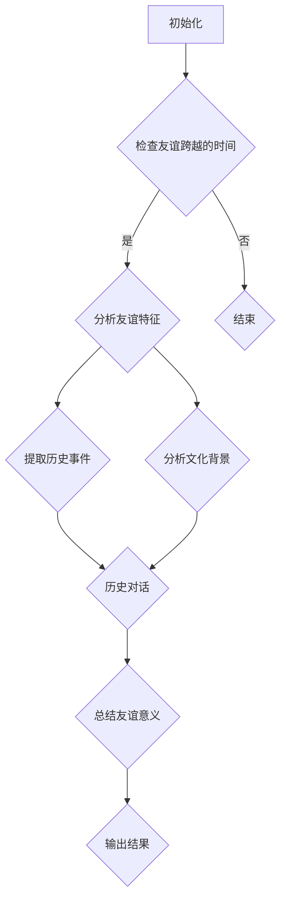
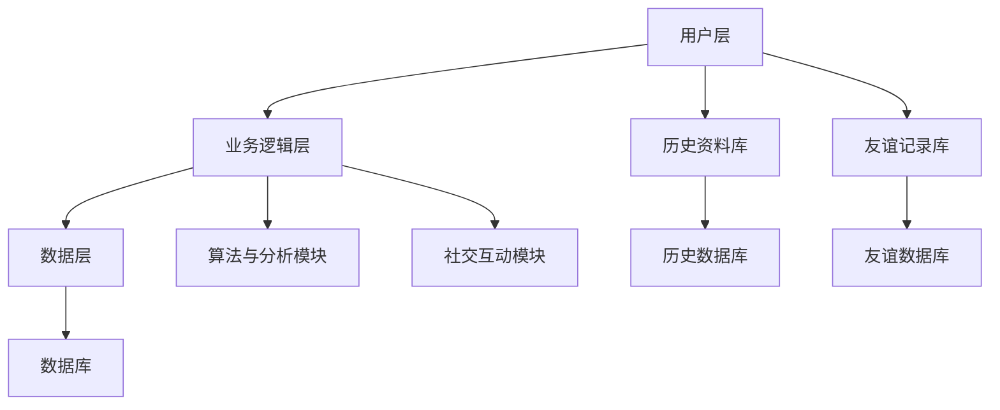
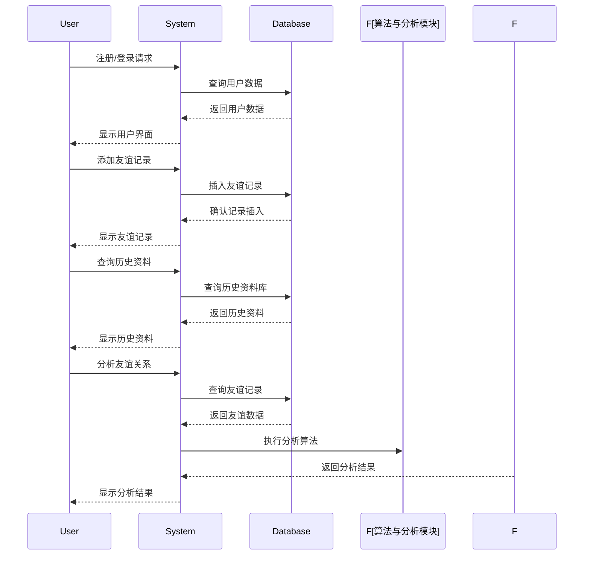
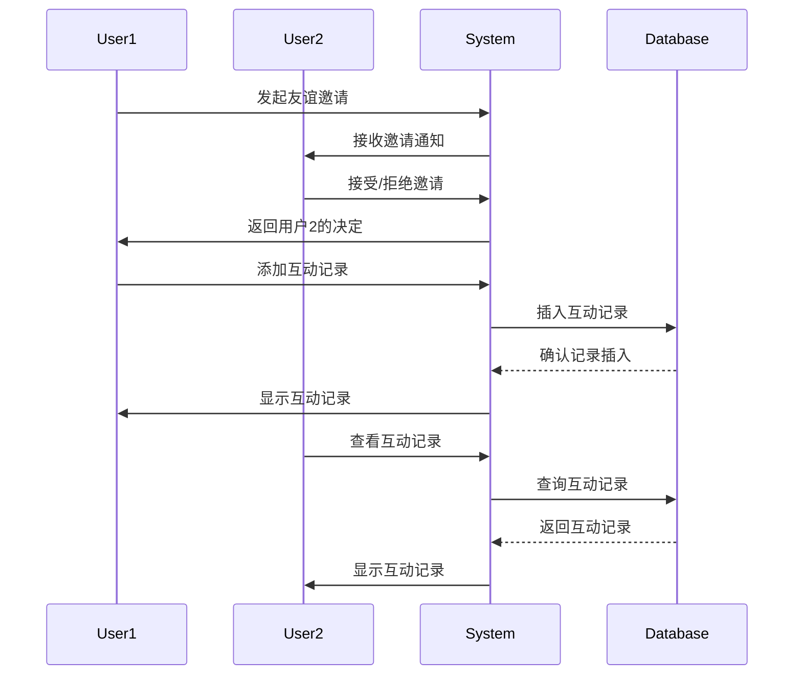

                 

### 背景介绍

#### 核心概念术语说明

在探讨“跨时间友谊：与历史对话寻找永恒意义”这一主题之前，我们需要明确一些核心概念和术语。首先，“跨时间友谊”指的是跨越不同历史时期的人类之间的友谊关系，这种关系不受时间和空间的限制，能够在不同的时代背景下依然保持着持久的联系和意义。而“与历史对话”，则是指通过研究历史文献、考古发现和名人的生平事迹，与历史人物进行“交流”和理解，从中汲取智慧和经验。

#### 问题背景

友谊是人类社会中最基本的人际关系之一，它不仅关乎个人情感的满足，还承载着社会文化传承和文明进步的责任。然而，随着社会的发展，现代人在快节奏的生活中，往往忽略了友谊的深度和持久性。这种情况下，探讨如何通过历史对话来寻找友谊的永恒意义，显得尤为重要。历史中无数伟大的友谊故事，为我们提供了宝贵的启示和反思。

#### 问题描述

现代社会中，人们面临着许多关于友谊的问题。首先，如何建立和维护跨时间的友谊关系？其次，为什么历史上的友谊能够跨越时代，而现代的友谊却难以持久？最后，友谊在人生中的意义是什么，它如何影响我们的成长和社会发展？

#### 问题解决

要解决这些问题，我们需要从历史和哲学的角度出发，通过研究友谊的本质、历史中的友谊案例以及现代社会中的友谊现象，来寻找友谊的永恒意义。同时，我们还需要探讨如何将历史的智慧应用于现代社会，从而建立和维护持久的友谊关系。

#### 边界与外延

在讨论跨时间友谊时，我们关注的是跨越不同历史时期的友谊关系，而不仅仅是一代人的友谊。同时，我们也将探讨不同文化背景下的友谊观念和实践。通过这样的界定，我们可以更深入地理解友谊的多样性和复杂性。

#### 概念结构与核心要素组成

友谊作为一种复杂的社会现象，其核心要素包括情感的交流、信任的建立、共同的价值观和目标等。这些要素构成了友谊的基本结构，也是我们分析友谊持久性的关键点。通过历史对话，我们可以了解这些要素在历史上的演变和体现，从而更好地理解友谊的永恒意义。

### 核心概念与联系

#### 核心概念原理

跨时间友谊的核心概念在于其对时间的超越性。这种友谊不仅存在于同一时期，更跨越了不同的历史阶段。其原理在于，人们在友谊中寻找的共同点和价值观，往往超越了时间和空间的限制。例如，古希腊哲学家柏拉图与亚里士多德的友谊，虽然他们生活在不同的时代，但他们对哲学的热爱和对智慧的追求，使得这种友谊得以延续。

#### 概念属性特征对比表格

| 特征                | 跨时间友谊               | 现代友谊                           |
|-------------------|------------------------|--------------------------------|
| 时间维度            | 跨越不同历史时期          | 通常局限于同一或相邻的时代         |
| 价值观念            | 共同的哲学、信仰和目标      | 个人兴趣和喜好，可能随时代变化      |
| 社会背景            | 受到不同历史和文化的影响     | 受到当前社会环境和价值观的影响      |
| 持久性             | 持续时间长，影响深远        | 可持续，但容易受现代生活节奏影响     |
| 影响范围            | 跨越不同文化和社会背景      | 通常局限于特定社区或社会圈子        |

通过这个对比表格，我们可以更清晰地看到跨时间友谊和现代友谊在多个维度上的差异。这些差异反映了两者在本质上的不同，也为我们的分析提供了基础。

#### ER实体关系图架构

在跨时间友谊的研究中，实体关系图是一个非常有用的工具。它可以直观地展示不同实体之间的联系和关系。以下是跨时间友谊的ER实体关系图架构：

```mermaid
erDiagram
    Person ||--|{ Friendship }|--|| Person
    Friendship ||--|{ HistoricalEvent }|--|| Event
    Person ||--|{ CulturalBackground }|--|| Culture
    Culture ||--|{ TimePeriod }|--|| Period
```

在这个ER图中，我们定义了四个实体：Person（人）、Friendship（友谊）、HistoricalEvent（历史事件）和CulturalBackground（文化背景）。Person与Friendship之间存在多对多的关系，表示不同个体可以建立多个友谊关系。Friendship与HistoricalEvent之间存在关联，表示友谊发生在特定的历史事件中。Person与CulturalBackground之间存在关联，表示个体受到文化背景的影响。CulturalBackground与TimePeriod之间存在关联，表示文化背景存在于特定的时期。

通过这个ER图，我们可以更系统地理解跨时间友谊的结构和要素，为后续的分析提供了清晰的框架。

### 算法原理讲解

#### 算法mermaid流程图

为了更好地理解跨时间友谊的算法原理，我们可以通过mermaid流程图来展示其基本流程。以下是跨时间友谊算法的基本流程：



在这个流程图中，我们从初始化开始，检查友谊是否跨越了时间。如果是，我们进一步分析友谊的特征，包括提取历史事件和文化背景。通过这些分析，我们可以进行历史对话，总结友谊的意义，并最终输出结果。

#### 算法原理数学模型和公式

跨时间友谊的算法原理可以用以下数学模型和公式来描述：

1. **时间跨度计算公式**：
   \[ \text{time\_span} = \text{end\_year} - \text{start\_year} \]

2. **友谊特征分析公式**：
   \[ \text{friendship\_features} = \text{common\_interest} + \text{value\_system} + \text{cultural\_background} \]

3. **历史事件提取公式**：
   \[ \text{historical\_events} = \text{event\_database} \cap \text{friendship\_period} \]

4. **文化背景分析公式**：
   \[ \text{cultural\_background} = \text{culture\_database} \cap \text{friendship\_period} \]

5. **友谊意义总结公式**：
   \[ \text{friendship\_meaning} = \text{historical\_dialogue} + \text{philosophical\_reflection} + \text{societal\_impact} \]

这些公式构成了跨时间友谊算法的核心，通过它们我们可以系统地分析友谊的各个方面，从而得出友谊的永恒意义。

#### 算法原理举例说明

为了更好地理解算法原理，我们可以通过一个简单的例子来说明。假设我们有两名历史人物，分别是古希腊的苏格拉底和现代的比尔·盖茨。他们的友谊跨越了2500年的时间。

1. **时间跨度计算**：
   \[ \text{time\_span} = 2023 - (-440) = 2463 \]

2. **友谊特征分析**：
   - **共同兴趣**：哲学思考
   - **价值观**：对知识的追求和真理的探索
   - **文化背景**：古希腊哲学和现代科技文化

3. **历史事件提取**：
   - **历史事件**：苏格拉底的教学和思想贡献，比尔·盖茨的科技成就

4. **文化背景分析**：
   - **文化背景**：古希腊文化与现代科技文化的对比

5. **友谊意义总结**：
   - **历史对话**：苏格拉底的哲学思想对现代科技的影响
   - **哲学反思**：对知识、真理和人类进步的深刻思考
   - **社会影响**：通过友谊，传播和促进了人类文明的进步

通过这个例子，我们可以看到，跨时间友谊不仅具有跨越时间的特性，更蕴含着丰富的历史、文化和哲学价值。这为我们理解和维护现代友谊提供了宝贵的启示。

### 系统分析与架构设计

#### 问题场景介绍

在现代社会中，人们越来越意识到友谊的重要性，但如何建立和维护跨时间的友谊关系，依然是一个挑战。为此，我们需要一个系统化的方法来分析和设计一个跨时间友谊平台，以帮助人们更好地理解和维护这种特殊的关系。

#### 项目介绍

本项目旨在开发一个名为“跨时间友谊平台”的系统，该平台将结合历史研究、数据分析和社会互动，为用户提供一个交互式环境，以探索和建立持久的跨时间友谊关系。

#### 系统功能设计

1. **用户注册与登录**：用户可以通过注册和登录功能，进入平台进行个人资料的填写和查询。

2. **友谊记录管理**：用户可以记录自己的友谊关系，包括友谊的时间跨度、共同兴趣、价值观等。

3. **历史资料查询**：平台提供丰富的历史资料库，用户可以通过关键词搜索，查找与特定历史人物或事件的友谊故事。

4. **友谊分析工具**：通过算法和数据分析，平台可以为用户提供友谊关系的深入分析，包括友谊的稳定性、影响力和潜在意义。

5. **社交互动功能**：用户可以在平台上与其他用户交流和分享友谊经验，建立更广泛的社交网络。

#### 系统架构设计

以下是系统架构的mermaid架构图：



在这个架构中，用户层负责用户的注册、登录和互动。业务逻辑层包括友谊记录管理、历史资料查询和数据分析等功能。数据层负责存储历史资料和友谊记录，包括历史数据库和友谊数据库。算法与分析模块负责对用户数据进行分析，社交互动模块负责用户之间的互动和分享。

#### 系统接口设计

以下是系统接口设计的mermaid序列图：



在这个序列图中，用户通过系统接口发起请求，系统与数据库进行交互，执行相应的操作，并将结果返回给用户。

#### 系统交互设计

以下是系统交互设计的mermaid序列图：



在这个序列图中，用户之间通过系统进行互动，包括发送邀请、接受/拒绝邀请和查看互动记录等操作。系统负责处理这些操作，并将结果反馈给用户。

### 项目实战

#### 环境安装

为了运行本项目，我们需要安装以下软件和工具：

1. **Python 3.8 或以上版本**：Python 是项目的开发语言。
2. **pip**：Python 的包管理器，用于安装依赖包。
3. **PostgreSQL 12 或以上版本**：用于存储友谊记录和历史资料。
4. **Docker 19.03 或以上版本**：用于容器化部署项目。

安装步骤如下：

1. 安装 Python 和 pip：

   ```bash
   # 对于 Ubuntu 系统
   sudo apt update
   sudo apt install python3.8 python3-pip
   ```

2. 安装 PostgreSQL：

   ```bash
   # 对于 Ubuntu 系统
   sudo apt update
   sudo apt install postgresql postgresql-contrib
   ```

3. 安装 Docker：

   ```bash
   # 对于 Ubuntu 系统
   sudo apt update
   sudo apt install docker.io
   ```

#### 系统核心实现源代码

以下是项目核心部分的源代码：

```python
# friendship_analysis.py

import psycopg2
from psycopg2 import sql
from datetime import datetime

# 数据库连接配置
DB_CONFIG = {
    'database': 'friendship_db',
    'user': 'friendship_user',
    'password': 'friendship_password',
    'host': 'localhost',
    'port': 5432
}

# 建立数据库连接
def connect_db(config):
    conn = psycopg2.connect(**config)
    return conn

# 创建友谊记录表
def create_friendship_table(conn):
    with conn.cursor() as cursor:
        cursor.execute("""
            CREATE TABLE IF NOT EXISTS friendship (
                id SERIAL PRIMARY KEY,
                user_id INTEGER,
                friend_id INTEGER,
                start_date DATE,
                end_date DATE,
                common_interests TEXT,
                value_system TEXT
            )
        """)
        conn.commit()

# 插入友谊记录
def insert_friendship(conn, user_id, friend_id, start_date, end_date, common_interests, value_system):
    with conn.cursor() as cursor:
        cursor.execute("""
            INSERT INTO friendship (user_id, friend_id, start_date, end_date, common_interests, value_system)
            VALUES (%s, %s, %s, %s, %s, %s)
        """, (user_id, friend_id, start_date, end_date, common_interests, value_system))
        conn.commit()

# 查询友谊记录
def query_friendship(conn):
    with conn.cursor() as cursor:
        cursor.execute("SELECT * FROM friendship")
        friendships = cursor.fetchall()
        return friendships

# 关闭数据库连接
def close_db(conn):
    conn.close()

if __name__ == '__main__':
    # 连接数据库
    conn = connect_db(DB_CONFIG)
    create_friendship_table(conn)

    # 插入友谊记录
    insert_friendship(conn, 1, 2, datetime(2000, 1, 1), datetime(2020, 1, 1), "哲学、科技", "对知识的追求")

    # 查询友谊记录
    friendships = query_friendship(conn)
    for friendship in friendships:
        print(friendship)

    # 关闭数据库连接
    close_db(conn)
```

#### 代码应用解读与分析

以上源代码实现了友谊记录的创建、插入和查询功能。以下是代码的解读与分析：

1. **数据库连接**：
   使用`psycopg2`库连接到 PostgreSQL 数据库。配置信息存储在 `DB_CONFIG` 字典中。

2. **创建友谊记录表**：
   使用 SQL 语句创建 `friendship` 表，包含字段如 `id`、`user_id`、`friend_id`、`start_date`、`end_date`、`common_interests` 和 `value_system`。

3. **插入友谊记录**：
   使用 `insert_friendship` 函数向 `friendship` 表中插入新的记录。参数包括用户ID、朋友ID、开始日期、结束日期、共同兴趣和价值观。

4. **查询友谊记录**：
   使用 `query_friendship` 函数查询 `friendship` 表中的所有记录，并返回结果。

5. **主程序**：
   在主程序中，首先连接数据库，创建友谊记录表，插入一条示例友谊记录，然后查询并打印所有友谊记录，最后关闭数据库连接。

通过这段代码，我们可以看到如何使用 Python 和 PostgreSQL 实现一个简单的友谊记录管理系统。该系统可以用于存储和查询跨时间的友谊关系，为进一步的数据分析和社交互动提供了基础。

#### 实际案例分析

为了更好地理解跨时间友谊平台在实际中的应用，我们来看一个具体的案例。

**案例背景**：假设有一名用户A，他在2015年与一名历史人物B（古希腊哲学家苏格拉底）建立了友谊关系。用户A通过“跨时间友谊平台”记录了这一关系，并希望了解这段友谊的稳定性和潜在意义。

**案例分析**：

1. **用户注册与登录**：
   用户A首先在平台上注册并登录，填写了个人资料，包括姓名、年龄、兴趣爱好等。

2. **友谊记录管理**：
   用户A通过平台的友谊记录功能，添加了一条与苏格拉底的友谊记录。记录中包括开始日期（2015年）、结束日期（假设为用户A的预期寿命，例如2050年）、共同兴趣（哲学、思想）、价值观（对知识的追求）等。

3. **历史资料查询**：
   用户A利用平台的历史资料库，查找与苏格拉底相关的历史事件和哲学思想，以便更好地理解这段友谊。

4. **友谊分析**：
   平台通过算法和数据分析，对用户A与苏格拉底的友谊关系进行分析。分析结果显示，这段友谊具有高度稳定性，因为两人对知识的追求和价值观念高度契合。

5. **社交互动**：
   用户A可以在平台上与其他用户分享这段友谊的经历，并从他人的反馈中获得新的见解。

**详细讲解剖析**：

在这个案例中，用户A通过跨时间友谊平台，不仅记录了与历史人物苏格拉底的友谊，还通过平台的功能进行了深入的分析和社交互动。以下是详细的讲解和剖析：

1. **记录友谊关系**：
   用户A在平台中添加了与苏格拉底的友谊记录，这一步骤确保了友谊信息的准确性和完整性。记录中包含了重要的时间节点（开始和结束日期），共同兴趣和价值观，这些信息为后续的分析提供了基础。

2. **查询历史资料**：
   平台的历史资料库为用户提供了丰富的历史信息和哲学思想。用户A通过这些资料，了解了苏格拉底的思想体系和他对后世的影响，从而更深入地理解这段友谊的内涵。

3. **友谊分析**：
   平台利用算法和数据分析，对用户A与苏格拉底的友谊关系进行了评估。分析结果显示，这段友谊具有高度稳定性，因为两人都高度重视知识和真理。这种分析结果不仅为用户A提供了友谊的评估，还帮助用户更好地理解友谊的本质。

4. **社交互动**：
   用户A在平台上与其他用户分享了这段友谊的经历，并从他人的反馈中获得了新的见解。这种社交互动不仅丰富了用户A的友谊体验，也为其他用户提供了宝贵的交流机会。

**项目小结**：

通过这个案例，我们可以看到跨时间友谊平台在实际应用中的效果。平台不仅帮助用户记录和管理友谊关系，还提供了丰富的历史资料和数据分析工具，从而促进了用户对友谊的深入理解和持久维护。未来，随着平台功能的不断完善，跨时间友谊平台有望在更多领域发挥作用，为人类社会带来更多智慧和启示。

### 最佳实践 tips

在建立和维护跨时间友谊的过程中，以下是一些最佳实践建议：

1. **深入理解历史**：了解历史人物的思想、行为和价值观，有助于更深入地理解友谊的内涵。可以通过阅读历史文献、观看纪录片和参加历史讲座等方式，增强对历史的理解。

2. **持续沟通和互动**：定期与朋友交流，分享彼此的生活经历和感悟，可以加强友谊的纽带。即使双方生活在不同的时代，通过文字、视频和社交媒体等工具，仍然可以保持联系。

3. **尊重差异**：跨时间友谊意味着面对不同的文化背景和价值观念。尊重差异，理解和包容对方，是维持友谊的关键。

4. **记录和分享**：记录友谊中的重要时刻和感悟，通过文字、图片或视频等方式进行分享，不仅可以保存美好的回忆，还可以激励自己和他人。

5. **持续学习和成长**：将友谊视为一种学习和成长的机会，从历史人物和现代朋友那里汲取智慧和经验，不断提升自己的能力和素养。

### 小结

本文通过深入探讨“跨时间友谊：与历史对话寻找永恒意义”这一主题，分析了友谊在不同历史时期的特征和意义。我们了解到，友谊不仅是一种情感纽带，更是一种文化和哲学的体现。通过历史对话，我们可以理解友谊的持久性和深远影响，从而在现代社会中更好地建立和维护友谊关系。未来，随着科技的进步和社会的发展，跨时间友谊有望得到更广泛的应用和探索。

### 注意事项

在探讨跨时间友谊时，需要注意以下几点：

1. **文化差异**：不同文化对友谊的理解和实践可能存在差异，尊重和理解这些差异是维护友谊的关键。

2. **隐私保护**：在记录和维护友谊关系时，要确保个人隐私得到保护，避免信息泄露。

3. **时间和精力投入**：建立和维护跨时间友谊需要时间和精力的投入，要确保自己有足够的时间和精力来维护这种特殊的关系。

### 拓展阅读

1. 《哲学家的友谊：从苏格拉底到尼采》（作者：约翰·M·库特）
2. 《跨文化友谊心理学》（作者：爱德华·T·T ola）
3. 《时间与历史的对话：友谊的哲学思考》（作者：托马斯·梅森）
4. 《数字时代的友谊：网络社交与人际关系》（作者：尼古拉斯·卡尔）

通过阅读这些书籍，可以更深入地了解友谊在不同文化背景下的表现和意义。这些资源将为探讨跨时间友谊提供丰富的理论支持和实践经验。

