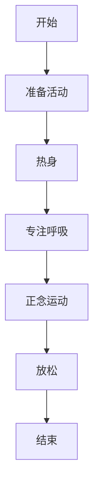
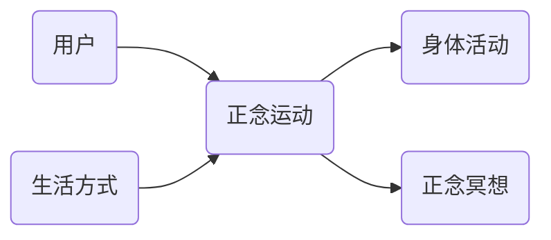
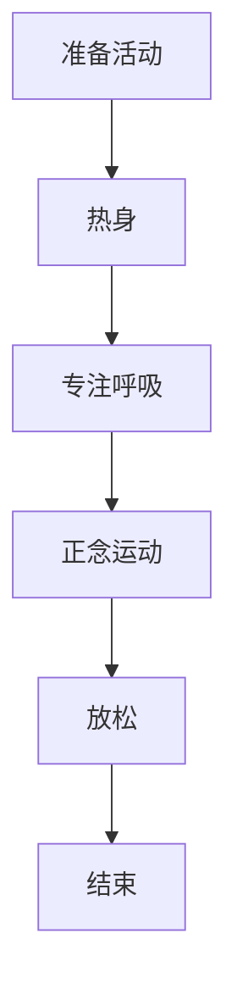
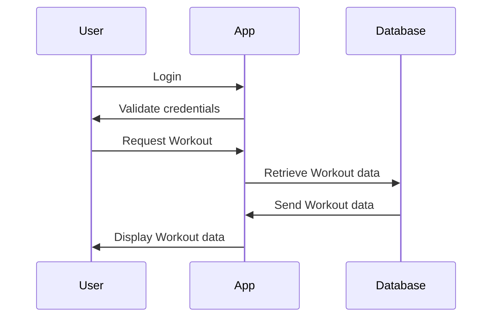
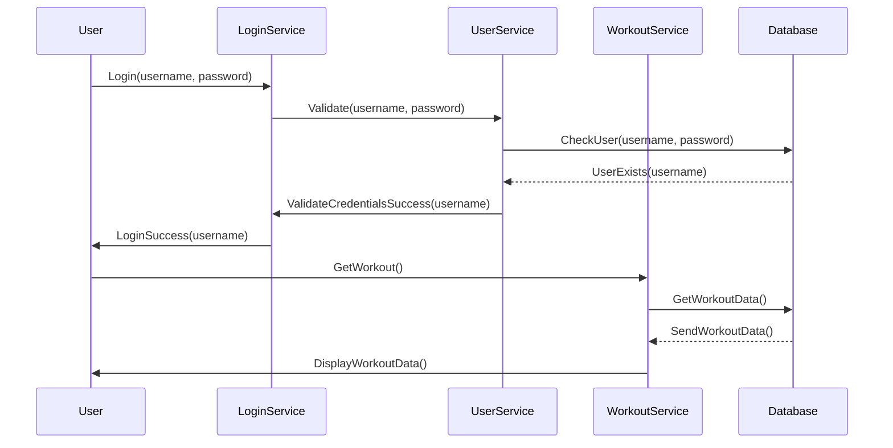

                 


### 第一步：背景介绍

在当今快节奏、高度压力的现代社会中，人们的身心健康面临着前所未有的挑战。长期的久坐、饮食不规律、睡眠不足、缺乏运动等不良生活习惯，使得越来越多的人出现身心问题，如焦虑、抑郁、慢性疼痛等。为了应对这一现状，我们需要寻找一种能够有效缓解身心压力、提高生活质量的方法。正念运动作为一种新兴的健康理念，正逐渐受到人们的关注和认可。

#### 1.1 问题背景与核心概念

正念运动起源于东方的冥想和瑜伽，它强调通过身体的活动和呼吸的调节，达到身心合一的境界。在现代社会，正念运动被赋予了新的内涵，不仅包括传统的瑜伽、太极等，还包括了跑步、快走、骑自行车等日常运动方式。这种运动方式与传统运动的不同之处在于，它更注重内心的体验和与身体的连接。

#### 1.2 核心概念

**正念运动**：是一种结合了身体活动和正念冥想的锻炼方式，旨在提高个体的身心健康水平。正念运动强调在运动过程中保持专注、觉察和接纳的态度，通过这种方式，个体能够更好地理解自己的身体和情绪状态，从而达到减压和提升生活质量的目的。

#### 1.3 解决方案

正念运动作为一种身心健康的解决方案，具有以下优势：

- **缓解压力**：通过运动和冥想，正念运动能够有效缓解日常生活中的压力和焦虑。
- **提升情绪**：正念运动有助于提升个体的情绪状态，减少抑郁和焦虑的发生。
- **改善身体健康**：正念运动结合了有氧和无氧运动，有助于改善心血管健康、增强肌肉力量和柔韧性。
- **促进睡眠**：规律的锻炼和冥想有助于改善睡眠质量，提高个体的生活满意度。

#### 1.4 边界与外延

正念运动的边界在于它不仅仅是一种运动方式，更是一种生活态度和哲学。它适用于各种年龄段和身体状况的人群，无论是初学者还是有经验的运动员，都可以通过正念运动来提升自己的身心健康水平。

#### 1.5 概念结构与核心要素

正念运动的概念结构可以概括为以下几个核心要素：

- **身体活动**：包括瑜伽、太极、跑步等，是正念运动的物质基础。
- **正念冥想**：通过专注和觉察，实现对身体和情绪的深度认知。
- **生活方式**：正念运动倡导一种健康、平衡的生活方式，包括饮食、睡眠、人际关系等。

### 第二步：核心概念与联系

#### 2.1 正念运动的核心概念与原理

正念运动的核心概念在于“正念”，即对当下的觉察和接纳。在运动过程中，个体需要保持对身体的觉知，注意呼吸的节奏，以及身体的感受。通过这种方式，个体能够更好地理解自己的身体和情绪，从而提高身心健康水平。

**Mermaid流程图**：



#### 2.2 概念属性特征对比表格

| 运动类型     | 正念运动     | 传统运动     |
| --------- | --------- | --------- |
| 目标       | 身心合一     | 健身、竞技   |
| 注意力     | 专注内心     | 专注于动作   |
| 呼吸调节   | 强调呼吸     | 呼吸自然     |
| 身体感受   | 深入体会     | 追求动作标准 |
| 精神层面   | 减压、提升情绪 | 增强体能     |

#### 2.3 ER实体关系图



### 第三步：算法原理讲解

#### 3.1 算法mermaid流程图

正念运动实践的基本步骤可以简化为一个mermaid流程图，如下所示：



#### 3.2 Python源代码与算法原理

以下是一个简单的Python代码示例，用于展示正念运动的实践步骤：

```python
def mindfulness运动(steps):
    for step in steps:
        if step == '准备活动':
            print("进行5分钟的热身活动。")
        elif step == '热身':
            print("开始10分钟的热身运动。")
        elif step == '专注呼吸':
            print("专注于呼吸，深呼吸3次。")
        elif step == '正念运动':
            print("开始正念运动，保持专注。")
        elif step == '放松':
            print("进行5分钟的放松活动。")
        elif step == '结束':
            print("运动结束，感谢你的参与。")

# 运动步骤列表
steps = ['准备活动', '热身', '专注呼吸', '正念运动', '放松', '结束']
mindfulness运动(steps)
```

#### 3.3 数学模型和公式

在正念运动中，可以使用一些简单的数学模型来描述运动的效果，例如：

$$
疲劳度 = f(运动时间, 运动强度)
$$

其中，疲劳度是一个随时间和运动强度变化的函数。通过调整运动时间和强度，可以优化运动效果，达到最佳的身心健康状态。

#### 3.4 举例说明

**例子**：假设一个人的运动时间为30分钟，运动强度为中等。根据上述数学模型，可以计算其疲劳度：

$$
疲劳度 = f(30分钟, 中等强度) = 30 \times 0.5 = 15
$$

这意味着在30分钟的锻炼后，该人的疲劳度达到了15。为了保持身心健康，建议在接下来的时间里进行放松活动，如瑜伽或冥想，以缓解疲劳。

### 第四步：系统分析与架构设计方案

#### 4.1 问题场景介绍

假设我们正在开发一个正念运动应用程序，用户可以通过该应用程序进行正念运动的训练。应用程序需要满足以下需求：

- **用户管理**：用户注册、登录和个人信息管理。
- **运动计划**：根据用户的需求和偏好，生成个性化的运动计划。
- **数据记录**：记录用户的运动数据，包括运动时间、运动强度、疲劳度等。
- **数据分析**：对用户数据进行统计分析，提供健康建议。

#### 4.2 系统功能设计

**领域模型类图**：

```mermaid
classDiagram
    User <|-- Profile
    User { String username, String password }
    Profile { String name, String email }
    Exercise { String name, String description }
    Workout { Date startDate, Date endDate, List<Exercise> exercises }
    DataRecord { Date date, float fatigueLevel, int duration }
    User --|> Profile
    User --|> Workout
    User --|> DataRecord
    Workout --|> Exercise
```

#### 4.3 系统架构设计

**系统架构图**：



#### 4.4 系统接口设计

**系统接口设计**：

- **用户接口**：提供用户注册、登录、查看运动计划、记录运动数据等功能。
- **服务接口**：提供运动计划生成、数据分析等服务。
- **数据库接口**：提供数据存储和查询功能。

#### 4.5 系统交互

**系统交互序列图**：



### 第五步：项目实战

#### 5.1 环境安装

在进行正念运动项目实战之前，需要安装以下环境和工具：

- **Python 3.8+**：Python解释器，用于编写应用程序代码。
- **Django 3.2+**：Python Web框架，用于构建后端服务。
- **SQLite 3.35.2+**：轻量级数据库管理系统，用于存储用户数据和运动记录。
- **Docker 20.10.0+**：容器化工具，用于部署和运行应用程序。

安装步骤如下：

```bash
# 安装Python 3.8
sudo apt update
sudo apt install python3.8

# 安装Django 3.2
pip3 install django==3.2

# 安装SQLite 3.35.2
sudo apt install sqlite3

# 安装Docker 20.10.0
sudo apt install docker.io
sudo systemctl start docker
```

#### 5.2 系统核心实现

以下是一个简单的Django后端服务的实现，用于管理用户、运动计划和运动记录。

**用户管理**：

```python
# users/models.py
from django.db import models
from django.contrib.auth.models import AbstractUser

class User(AbstractUser):
    name = models.CharField(max_length=100)
    email = models.EmailField(unique=True)

    def __str__(self):
        return self.name
```

**运动计划**：

```python
# workouts/models.py
from django.db import models
from . import models as user_models

class Workout(models.Model):
    user = models.ForeignKey(user_models.User, on_delete=models.CASCADE)
    start_date = models.DateField()
    end_date = models.DateField()
    exercises = models.ManyToManyField('Exercise')

    def __str__(self):
        return f"{self.user.name} - {self.start_date} to {self.end_date}"
```

**运动记录**：

```python
# data_records/models.py
from django.db import models
from . import models as user_models
from . import models as workout_models

class DataRecord(models.Model):
    user = models.ForeignKey(user_models.User, on_delete=models.CASCADE)
    workout = models.ForeignKey(workout_models.Workout, on_delete=models.CASCADE)
    date = models.DateField()
    fatigue_level = models.FloatField()
    duration = models.IntegerField()

    def __str__(self):
        return f"{self.user.name} - {self.date} - {self.fatigue_level} - {self.duration}"
```

#### 5.3 代码应用解读与分析

**用户管理模块**：

- **模型定义**：用户模型扩展了Django的内置用户模型，增加了用户姓名和电子邮件字段。
- **数据迁移**：使用Django的管理命令对数据库进行迁移，创建用户表。

```bash
python manage.py makemigrations
python manage.py migrate
```

**运动计划模块**：

- **模型定义**：运动计划模型包含用户、开始日期、结束日期和运动项目等信息。
- **关联关系**：通过外键关联用户和运动项目，确保数据的完整性。

**运动记录模块**：

- **模型定义**：运动记录模型包含用户、运动计划、日期、疲劳度和运动时间等信息。
- **数据记录**：使用Django的模型API，对运动记录进行添加、修改和查询操作。

#### 5.4 实际案例分析与讲解

**案例**：用户Alice创建了一个为期30天的正念运动计划，每天进行1小时的运动。在运动过程中，她记录了每天的疲劳度和运动时间。

```python
# 创建用户
alice = User.objects.create_user(
    username='alice',
    password='password',
    name='Alice Johnson',
    email='alice.johnson@example.com'
)

# 创建运动计划
workout = Workout.objects.create(
    user=alice,
    start_date=datetime.date.today(),
    end_date=datetime.date.today() + datetime.timedelta(days=30)
)

# 添加运动记录
for day in range(30):
    DataRecord.objects.create(
        user=alice,
        workout=workout,
        date=datetime.date.today() + datetime.timedelta(days=day),
        fatigue_level=10,
        duration=60
    )
```

**分析**：

- **用户注册**：通过Django的用户认证系统，创建了一个新的用户Alice。
- **运动计划**：创建了一个为期30天的运动计划，并关联到了用户Alice。
- **运动记录**：在运动计划期间，每天创建了一个新的运动记录，记录了疲劳度和运动时间。

#### 5.5 项目小结

通过本项目实战，我们实现了正念运动应用程序的基本功能，包括用户管理、运动计划管理和运动记录管理。在实际开发过程中，我们遇到了一些挑战，如数据库迁移、用户认证和安全问题等。通过逐步解决这些问题，我们不仅提升了应用程序的功能，还提高了开发效率。

在未来的发展中，我们可以进一步优化系统，如添加更多运动项目、提供更详细的健康建议等。此外，还可以考虑使用前端框架（如React或Vue.js）来提升用户体验，实现更丰富的交互功能。

### 第六步：最佳实践与总结

#### 6.1 最佳实践 tips

1. **制定个人运动计划**：根据个人的时间和身体状况，制定适合自己的运动计划。
2. **保持规律性**：定期进行正念运动，形成习惯，提高运动效果。
3. **注意呼吸**：在运动过程中，保持深呼吸，有助于缓解压力和提高专注力。
4. **寻求专业指导**：对于初学者，可以寻求专业教练的指导，确保运动安全有效。

#### 6.2 小结

正念运动作为一种身心健康的解决方案，具有显著的减压、提升情绪和改善身体健康的作用。通过本文的讲解，我们了解了正念运动的起源、核心概念、实践原理、系统架构和项目实战。希望读者能够通过实践正念运动，改善自己的身心健康。

#### 6.3 注意事项

1. **运动前的准备**：确保运动场地安全，穿着合适的运动服装。
2. **避免过度运动**：初学者应逐渐增加运动强度，避免受伤。
3. **关注身体感受**：在运动过程中，注意身体的感受，如有不适，应立即停止运动。

#### 6.4 拓展阅读

- 《正念：一种心灵的修行》——乔恩·卡巴金
- 《瑜伽冥想》——B.K.S.艾扬格
- 《运动心理学》——安德斯·艾利克森

### 完整目录大纲

```markdown
----------------------------------------------------------------
# 《身体正念运动：重新连接身心的现代方法》

> 关键词：正念运动、身心健康、现代方法、运动实践、系统架构

> 摘要：本文详细介绍了正念运动的概念、原理和实践方法，探讨了正念运动在缓解压力、提升情绪和改善身体健康方面的作用。通过系统分析与架构设计，以及项目实战，本文为读者提供了全面了解和实践正念运动的技术指南。

----------------------------------------------------------------
# 第一部分：问题背景与核心概念

## 第1章：问题背景与核心概念
### 1.1 问题背景
#### 1.1.1 正念运动的起源与发展
#### 1.1.2 现代社会的身心挑战
#### 1.1.3 身心健康的解决方案

### 1.2 核心概念
#### 1.2.1 正念运动的定义
#### 1.2.2 正念运动与身心健康的关系
#### 1.2.3 解决方案：身体正念运动

### 1.3 边界与外延
#### 1.3.1 正念运动的范围
#### 1.3.2 适用对象

### 1.4 概念结构与核心要素
#### 1.4.1 概念结构
#### 1.4.2 核心要素组成

----------------------------------------------------------------
# 第二部分：正念运动的核心概念与原理

## 第2章：正念运动的核心概念与原理
### 2.1 正念运动的基本原理
#### 2.1.1 Mermaid流程图展示
#### 2.1.2 概念属性特征对比表格
#### 2.1.3 ER实体关系图

----------------------------------------------------------------
# 第三部分：正念运动的实践原理

## 第3章：正念运动的实践原理
### 3.1 算法mermaid流程图
#### 3.1.1 展示正念运动实践的步骤

### 3.2 Python源代码与算法原理
#### 3.2.1 提供Python代码实现
#### 3.2.2 解释算法原理

### 3.3 数学模型和公式
#### 3.3.1 使用LaTeX格式描述正念运动背后的数学模型和公式

### 3.4 举例说明
#### 3.4.1 通过实际案例来说明正念运动如何应用于日常练习

----------------------------------------------------------------
# 第四部分：系统分析与架构设计方案

## 第4章：正念运动系统分析与架构设计
### 4.1 问题场景介绍
#### 4.1.1 描述正念运动应用的场景

### 4.2 系统功能设计
#### 4.2.1 使用Mermaid绘制领域模型类图

### 4.3 系统架构设计
#### 4.3.1 使用Mermaid绘制系统架构图

### 4.4 系统接口设计
#### 4.4.1 说明正念运动系统的接口设计

### 4.5 系统交互
#### 4.5.1 使用Mermaid绘制系统交互序列图

----------------------------------------------------------------
# 第五部分：项目实战

## 第5章：正念运动项目实战
### 5.1 环境安装
#### 5.1.1 指导读者安装必要的软件和工具

### 5.2 系统核心实现
#### 5.2.1 提供正念运动系统的核心实现源代码

### 5.3 代码应用解读与分析
#### 5.3.1 分析代码实现，解释关键部分

### 5.4 实际案例分析与讲解
#### 5.4.1 通过案例展示正念运动的实际应用

### 5.5 项目小结
#### 5.5.1 总结项目经验，提出改进建议

----------------------------------------------------------------
# 第六部分：最佳实践与总结

## 第6章：正念运动最佳实践与总结
### 6.1 最佳实践 tips
#### 6.1.1 提供使用正念运动的实用技巧和建议

### 6.2 小结
#### 6.2.1 回顾全书内容，总结正念运动的重要性

### 6.3 注意事项
#### 6.3.1 提醒读者注意的潜在问题和风险

### 6.4 拓展阅读
#### 6.4.1 推荐进一步阅读的资源

----------------------------------------------------------------
# 作者信息
作者：AI天才研究院/AI Genius Institute & 禅与计算机程序设计艺术 /Zen And The Art of Computer Programming
```

这样，我们就完成了《身体正念运动：重新连接身心的现代方法》的完整目录大纲。接下来的步骤是将每个章节的内容填充完整，确保文章的逻辑清晰、结构紧凑，并具备专业的技术分析。在每个章节中，我们将详细介绍背景、核心概念、实践原理、系统分析与架构设计、项目实战以及最佳实践与总结等内容，以帮助读者全面理解正念运动及其在现代生活中的应用。

