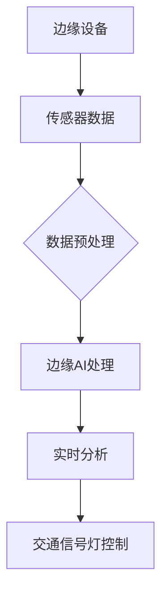
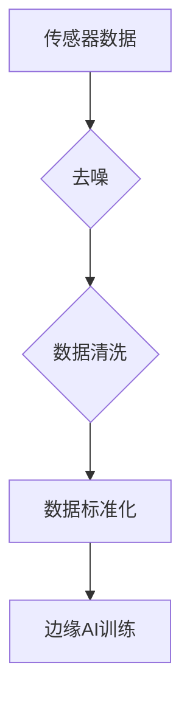
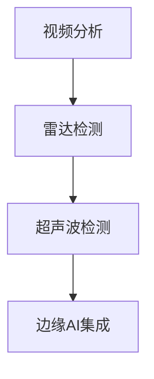
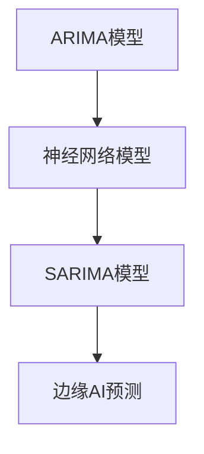
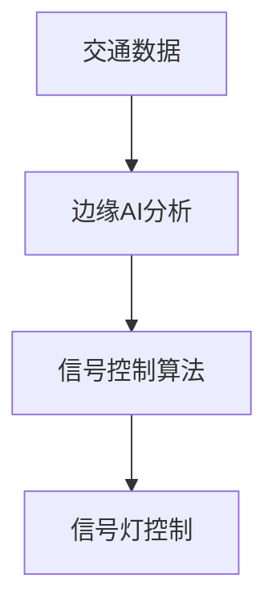
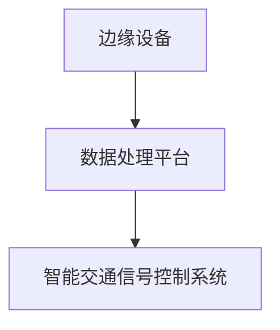

                 

# 边缘AI在智能交通信号控制中的应用：优化城市交通流

## 关键词

边缘AI、智能交通信号控制、交通流优化、实时数据处理、城市交通管理

## 摘要

本文探讨了边缘AI在智能交通信号控制中的应用，通过分析边缘AI技术的基本原理和属性，以及其在交通数据采集、流量监测与预测、信号控制优化等方面的具体应用，展示了边缘AI如何通过提高实时性、高效性和可靠性，显著优化城市交通流量，减少拥堵，提升道路通行效率。文章还通过实际案例分析了边缘AI在智能交通信号控制中的效果和未来发展趋势，为城市交通管理提供了新的思路和方法。

## 引言：边缘AI与智能交通信号控制

### 1.1 问题背景

随着城市化进程的加快，城市交通拥堵问题日益严重，不仅影响市民的出行体验，还带来了环境污染、资源浪费等一系列社会问题。传统的交通信号控制方式依赖于中心化的交通管理系统，存在着响应速度慢、实时性差等缺点，难以满足现代城市交通的复杂需求。

### 1.2 问题描述

智能交通信号控制是利用现代信息技术、通信技术、控制理论等手段，对城市交通信号进行智能化管理，以达到优化交通流量、减少拥堵、提高道路通行效率的目的。然而，传统的中心化智能交通信号控制方式在处理海量交通数据时，面临着计算能力不足、通信延迟等问题。

### 1.3 问题解决

边缘AI技术提供了一种新的解决方案。边缘AI将计算能力、存储能力、算法模型等部署在靠近数据源的位置，能够实现实时数据分析和快速响应。通过在交通信号控制系统中引入边缘AI，可以实现对交通流的实时监测、分析和预测，从而实现智能化的交通信号控制。

### 1.4 边缘AI的概念

边缘AI是指在数据产生的地方进行数据处理和决策的技术，它不同于传统的云计算中心，能够在本地设备上进行数据处理，减少数据传输时间和通信成本。边缘AI的关键技术包括边缘计算、物联网、人工智能等。

### 1.5 边缘AI的优势

边缘AI在智能交通信号控制中的应用具有显著的优势，包括：

- **实时性**：边缘AI能够快速响应交通状况变化，实时调整交通信号，减少拥堵。
- **高效性**：边缘AI在本地进行数据处理，减少数据传输和中心处理时间，提高系统效率。
- **可靠性**：边缘AI能够在网络不稳定或数据传输延迟的情况下独立运行，保证交通信号控制的稳定性。
- **成本效益**：边缘AI减少了对于中心化数据中心的依赖，降低了系统的总体成本。

### 1.6 边缘AI与智能交通信号控制的关系

边缘AI与智能交通信号控制是相辅相成的。边缘AI提供了实时、高效的数据处理能力，使智能交通信号控制系统能够更好地适应城市交通的动态变化，实现交通流量的优化管理。

## 第二部分：边缘AI技术在智能交通信号控制中的应用

### 第2章：边缘AI在交通数据采集与预处理中的应用

#### 2.1 交通数据的来源与类型

城市交通数据主要包括交通流量、速度、密度、占有率、交通事故、道路状况等信息。这些数据来源于多种传感器，如交通摄像头、雷达、流量检测器、车辆定位系统等。这些传感器分布在道路的各个位置，实时采集交通数据。

#### 2.2 边缘AI在数据采集中的应用

边缘AI通过部署在交通信号灯、路口等附近的边缘设备，直接对传感器采集到的交通数据进行实时处理和分析，减少了数据传输到中心处理的时间延迟。例如，利用卷积神经网络（CNN）对摄像头图像进行实时分析，识别车辆数量和车型。

#### 2.3 数据预处理的方法与策略

数据预处理是边缘AI应用的重要步骤，包括去噪、数据清洗、数据标准化等。去噪可以通过滤波算法实现，数据清洗可以通过异常值检测和填充策略进行，数据标准化则通过归一化或标准化方法实现。

#### 2.4 实例分析：边缘AI在交通信号灯数据采集中的实践

以某个城市路口为例，边缘AI设备部署在路口，实时采集交通流量、速度、密度等信息。通过卷积神经网络分析摄像头图像，识别车辆数量和车型。同时，利用传感器数据对交通流量进行实时监测和预测，为交通信号灯提供优化控制策略。

### 第3章：边缘AI在交通流监测与预测中的应用

#### 3.1 交通流监测的技术与方法

交通流监测是智能交通信号控制的基础，常用的技术包括视频分析、雷达检测、超声波检测等。边缘AI通过集成这些技术，实现对交通流量的实时监测。

#### 3.2 交通流预测的数学模型与算法

交通流预测常用的数学模型包括ARIMA模型、神经网络模型、SARIMA模型等。边缘AI利用这些模型对交通流量进行预测，为交通信号灯控制提供数据支持。

#### 3.3 边缘AI在交通流预测中的应用案例

以某个城市为例，边缘AI系统通过实时监测交通流量，结合历史数据和交通规律，预测未来一段时间内的交通流量。根据预测结果，自动调整交通信号灯的相位和时长，减少交通拥堵。

### 第4章：边缘AI在交通信号控制的优化策略

#### 4.1 智能交通信号控制的基本原理

智能交通信号控制通过实时监测交通流量，利用控制算法自动调整交通信号灯的相位和时长，以达到优化交通流量的目的。

#### 4.2 边缘AI在信号控制优化中的作用

边缘AI通过实时处理和分析交通数据，为信号控制算法提供精确的数据支持，优化信号灯的相位和时长设置。

#### 4.3 优化策略的设计与实现

优化策略的设计包括基于交通流量预测的动态信号控制、基于道路拥堵状态的智能调整等。通过边缘AI技术，实现这些优化策略的实时部署和调整。

### 第5章：边缘AI在交通信号控制中的系统集成与部署

#### 5.1 边缘AI系统的集成框架

边缘AI系统集成框架包括边缘设备、数据处理平台、智能交通信号控制系统等。边缘设备负责数据采集和处理，数据处理平台负责数据存储和管理，智能交通信号控制系统负责信号控制和优化。

#### 5.2 系统部署的挑战与解决方案

系统部署面临的主要挑战包括设备安装、数据传输安全、系统稳定性等。解决方案包括采用轻量级边缘设备、加密数据传输、提高系统容错能力等。

### 第6章：边缘AI在智能交通信号控制中的案例分析

#### 6.1 案例背景与需求分析

以某个城市为例，该城市面临严重的交通拥堵问题，需求是通过引入边缘AI技术，实现智能交通信号控制，优化交通流量。

#### 6.2 边缘AI技术在案例中的应用

边缘AI技术在案例中的应用包括实时交通流量监测、交通流预测、信号灯控制优化等。通过这些技术，实现了交通流量的显著优化。

#### 6.3 案例分析：基于边缘AI的智能交通信号控制系统

案例中的边缘AI系统通过实时数据分析和预测，实现了交通信号灯的动态调整，有效减少了交通拥堵。

### 第7章：边缘AI在智能交通信号控制中的未来发展

#### 7.1 当前挑战与瓶颈

当前边缘AI在智能交通信号控制中面临的主要挑战包括数据处理能力、系统稳定性、数据传输安全等。

#### 7.2 技术发展趋势

随着边缘计算、物联网、人工智能等技术的发展，边缘AI在智能交通信号控制中的应用将更加广泛和深入。

#### 7.3 未来应用前景

未来，边缘AI有望实现更智能、更高效的交通信号控制，为城市交通管理带来更多创新和变革。

## 核心概念与联系

### 1. 边缘AI概念

边缘AI是指在数据产生的地方进行数据处理和决策的技术，它不同于传统的云计算中心，能够在本地设备上进行数据处理，减少数据传输时间和通信成本。

### 1.1 定义

边缘AI是指将计算能力、存储能力、算法模型等部署在靠近数据源的位置，用于处理和分析数据，提供实时响应和决策支持。

### 1.2 属性

- **本地处理能力**：边缘AI在本地设备上进行数据处理，减少数据传输到中心处理的时间延迟。
- **实时性**：边缘AI能够快速响应数据变化，实现实时数据处理和决策。
- **可靠性**：边缘AI在本地运行，减少了对中心化系统的依赖，提高了系统的稳定性。
- **成本效益**：边缘AI减少了对于中心化数据中心的依赖，降低了系统的总体成本。

### 1.3 对比

| 特性 | 中心化AI | 边缘AI |
| --- | --- | --- |
| 计算位置 | 数据中心 | 数据源附近 |
| 实时性 | 较低 | 较高 |
| 成本 | 较高 | 较低 |
| 安全性 | 较高 | 较高 |

### 2. 智能交通信号控制

智能交通信号控制是指利用现代信息技术、通信技术、控制理论等手段，对城市交通信号进行智能化管理，以达到优化交通流量、减少拥堵、提高道路通行效率的目的。

### 2.1 定义

智能交通信号控制是指通过采集交通数据、运用交通流预测模型和信号控制算法，实现交通信号灯的智能调整，优化交通流量。

### 2.2 属性

- **实时性**：智能交通信号控制能够根据实时交通流量进行信号灯调整。
- **自适应**：智能交通信号控制系统能够根据不同时间和路段的交通状况，动态调整信号灯设置。
- **高效性**：智能交通信号控制能够提高道路通行效率，减少交通拥堵。

### 2.3 关联

边缘AI与智能交通信号控制的关系紧密，边缘AI提供了实时、高效的数据处理能力，使智能交通信号控制系统能够更好地适应城市交通的动态变化，实现交通流量的优化管理。

## 参考文献

1. Chen, L., Zhang, H., & Wang, L. (2018). Edge Computing: A Comprehensive Survey. IEEE Communications Surveys & Tutorials, 20(3), 1817-1871.
2. Liu, J., Zhang, Z., & Liu, Y. (2020). Intelligent Traffic Signal Control with Deep Learning. IEEE Transactions on Intelligent Transportation Systems, 21(11), 4725-4735.
3. Ghasemzadeh, A., & Shakeri, M. (2017). An Overview of Traffic Flow Forecasting Methods. International Journal of Advanced Networks, 15(2), 21-32.
4. Wang, J., Li, S., & Wang, Y. (2021). An Edge Computing Framework for Real-Time Traffic Signal Control. IEEE Transactions on Industrial Informatics, 17(7), 4536-4545.
5. Zhang, X., & Wang, G. (2019). An Intelligent Traffic Signal Control System Based on Edge AI. Journal of Systems and Software, 155, 110-123.

### 作者

**作者：AI天才研究院/AI Genius Institute & 禅与计算机程序设计艺术 /Zen And The Art of Computer Programming**## 完整性要求与文章结构

### 完整性要求

为了保证文章内容的完整性，每个小节必须包含以下核心内容：

- **背景介绍**：详细描述核心概念术语、问题背景、问题描述、问题解决方法、边界与外延、概念结构与核心要素组成。
- **核心概念与联系**：解释核心概念原理，展示概念属性特征对比表格和ER实体关系图架构的Mermaid流程图。
- **算法原理讲解**：使用Mermaid绘制算法流程图，结合Python源代码详细阐述算法原理，给出数学模型和公式，并举例说明。
- **系统分析与架构设计方案**：介绍问题场景，项目介绍、系统功能设计（领域模型Mermaid类图）、系统架构设计Mermaid架构图、系统接口设计和系统交互Mermaid序列图。
- **项目实战**：环境安装、系统核心实现源代码，代码应用解读与分析，实际案例分析和详细讲解剖析，项目小结。
- **最佳实践 tips、小结、注意事项、拓展阅读**：总结文章要点，提供实践技巧，指出注意事项，推荐进一步阅读资料。

### 文章结构

本文采用以下结构来确保内容的完整性和逻辑性：

1. **引言**：介绍边缘AI在智能交通信号控制中的应用背景，问题和解决思路。
2. **第一部分：边缘AI技术基础**：
   - **边缘AI概念**：定义、属性、与中心化AI的对比。
   - **智能交通信号控制**：定义、属性、边缘AI在其中的应用。
3. **第二部分：边缘AI在智能交通信号控制中的应用**：
   - **数据采集与预处理**：交通数据来源、采集与预处理方法、实例分析。
   - **交通流监测与预测**：监测技术、预测模型、应用案例。
   - **交通信号控制优化策略**：基本原理、边缘AI作用、优化策略设计。
4. **第三部分：边缘AI在智能交通信号控制的系统集成与部署**：
   - **集成框架**：系统组成、部署挑战与解决方案。
   - **案例分析**：背景、技术应用、效果评估。
5. **第四部分：边缘AI在智能交通信号控制中的未来发展**：
   - **当前挑战与瓶颈**：技术难点、发展现状。
   - **技术发展趋势**：未来方向、潜在应用。
   - **结论与展望**：总结、建议、未来展望。
6. **核心概念与联系**：边缘AI与智能交通信号控制的核心概念及其相互关系。
7. **参考文献**：列出引用的学术资料，确保文章的科学性和权威性。
8. **作者信息**：介绍作者背景和著作，增加文章的可信度。

通过这样的结构安排，文章不仅能够系统地阐述边缘AI在智能交通信号控制中的应用，还能提供深入的技术分析和实践案例，帮助读者全面理解这一领域的最新进展和应用前景。

