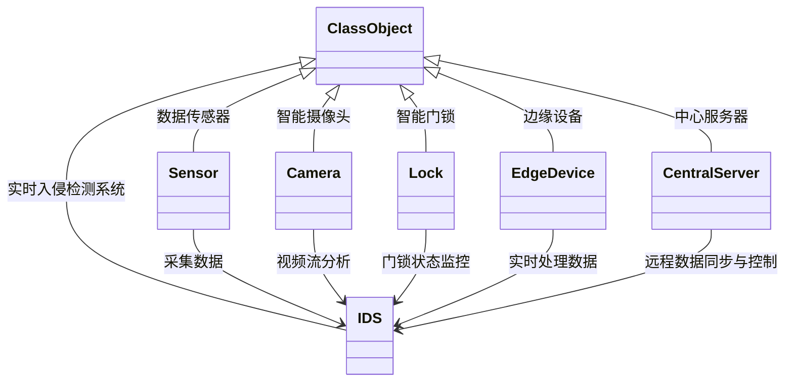
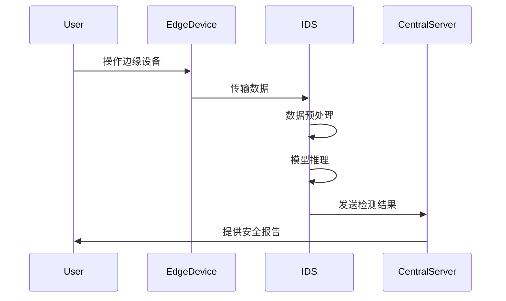
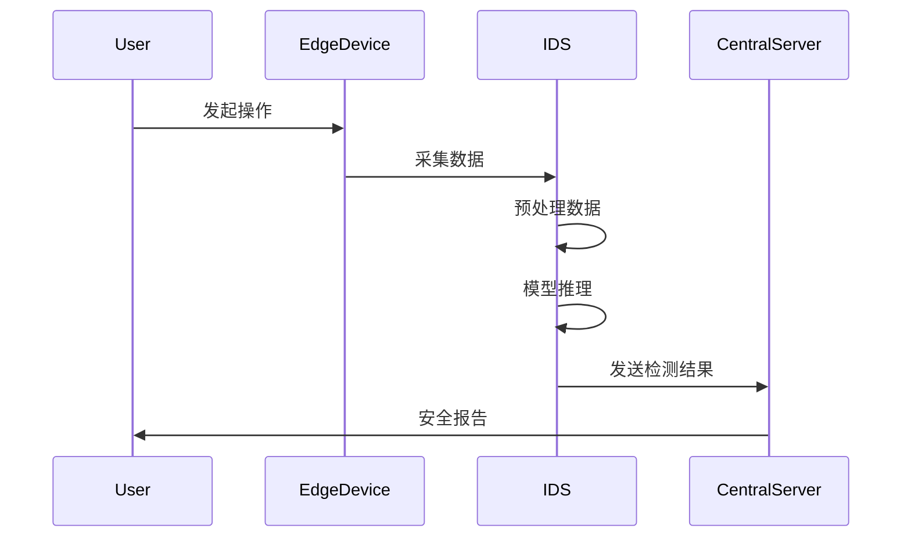

                 

# 边缘AI在智能家居安全中的应用：实现实时入侵检测

## 关键词

边缘AI、智能家居、安全、实时入侵检测、机器学习、深度学习、物联网

## 摘要

随着智能家居技术的普及，家庭安全成为了一个重要的议题。传统的云计算模式在处理智能家居安全问题时，存在延迟高、带宽受限等问题，难以满足实时性的要求。本文将探讨边缘AI在智能家居安全中的应用，通过实现实时入侵检测来提升家庭安全水平。文章首先介绍了边缘AI的基本概念和原理，然后详细分析了边缘AI在智能家居安全中的挑战和需求。接着，本文阐述了实时入侵检测系统的基本原理和机器学习技术在其中的应用，最后通过一个实际案例展示了边缘AI在智能家居安全中的具体应用和实践。

## 引言

### 边缘AI的定义与基本概念

边缘AI（Edge AI）是一种将人工智能计算能力从云端迁移到网络边缘的技术。它的核心思想是将数据处理和智能推理任务分散到网络边缘的设备上，如路由器、智能摄像头、传感器等，从而降低对中心云服务的依赖，提高数据处理速度和响应时间。

边缘AI的关键概念包括：

- **边缘计算**：将计算任务分散到网络边缘，使得数据处理更加本地化。
- **边缘设备**：网络边缘的设备，如智能手表、智能门锁、智能灯泡等。
- **边缘服务器**：位于网络边缘的数据中心，提供计算资源和存储服务。
- **边缘网络**：连接边缘设备和边缘服务器的网络架构。

### 边缘AI与云计算的比较

云计算将计算任务集中在数据中心，通过远程服务器处理海量数据。然而，云计算存在以下局限性：

- **延迟较高**：数据需要传输到云端进行处理，导致响应时间较长。
- **带宽受限**：大量数据传输会增加网络带宽负担，影响用户体验。
- **安全性问题**：数据在传输过程中可能遭受中间人攻击等安全威胁。

与云计算相比，边缘AI具有以下优势：

- **低延迟**：数据在本地设备上处理，大大减少了传输时间。
- **高效带宽使用**：仅传输必要的少量数据，降低了网络带宽的消耗。
- **提高安全性**：数据在本地处理，减少了数据泄露的风险。

### 边缘AI在智能家居安全中的演变

随着智能家居设备的普及，家庭安全逐渐成为一个备受关注的领域。传统上，家庭安全主要依赖传统的监控设备和报警系统，如摄像头、门锁、烟雾报警器等。然而，这些设备存在以下问题：

- **无法实现实时监控**：数据需要传输到云服务器进行处理，导致延迟。
- **数据存储和传输成本高**：大量数据需要存储和传输，增加了成本。
- **隐私泄露风险**：家庭数据可能被云服务器收集和分析。

边缘AI的引入为智能家居安全带来了新的解决方案：

- **实时入侵检测**：边缘设备可以实时处理数据，实现快速响应。
- **本地数据处理**：减少数据传输和存储需求，降低隐私泄露风险。
- **分布式安全架构**：通过边缘设备间的协作，提高整体安全性能。

## 边缘AI在智能家居安全中的挑战

### 实时性的挑战

在智能家居安全中，实时性是一个关键要求。传统的云计算模式由于数据传输和处理的延迟，难以满足实时入侵检测的需求。边缘AI通过将计算任务迁移到网络边缘，实现本地处理，从而降低延迟，提高实时性。然而，实现实时入侵检测仍面临以下挑战：

- **计算能力限制**：边缘设备通常具有较低的处理器性能和内存容量，难以支持复杂的计算任务。
- **网络带宽限制**：边缘设备与中心服务器之间的网络带宽可能有限，导致数据传输速度受限。
- **数据一致性**：边缘设备间的数据同步和一致性处理是一个挑战，特别是在大规模的智能家居网络中。

### 数据隐私和安全挑战

智能家居设备收集了大量家庭数据，包括日常行为习惯、隐私信息等。在云计算模式下，这些数据可能存储在第三方云服务器上，存在隐私泄露和安全风险。边缘AI通过本地数据处理和存储，降低了数据泄露的风险。然而，边缘AI仍面临以下安全挑战：

- **边缘设备安全性**：边缘设备可能成为黑客攻击的目标，导致数据泄露。
- **数据加密和传输**：边缘设备需要实现高效的数据加密和传输机制，确保数据安全。
- **隐私保护法规**：需要遵守各种隐私保护法规，确保用户数据得到保护。

### 系统整合和兼容性挑战

智能家居系统通常由多个供应商提供，设备种类繁多，系统整合和兼容性是一个挑战。边缘AI需要与其他智能家居设备和服务进行无缝集成，实现协同工作。以下是一些具体的挑战：

- **设备兼容性**：不同供应商的设备可能使用不同的通信协议和数据格式，需要实现兼容。
- **系统架构**：需要设计一个灵活的边缘AI系统架构，支持不同设备的集成。
- **API和接口**：需要定义统一的API和接口，方便不同设备间的数据交互和控制。

### 软硬件资源平衡挑战

边缘AI系统需要在有限的硬件资源下运行，需要优化算法和系统设计，实现高效资源利用。以下是一些具体的挑战：

- **资源管理**：需要实现高效的资源管理和调度，确保设备稳定运行。
- **功耗优化**：边缘设备通常需要长时间运行，需要优化功耗，延长设备寿命。
- **软件优化**：需要优化边缘AI算法和系统软件，减少计算和存储开销。

### 实时入侵检测的要求

在智能家居安全中，实现实时入侵检测是一个关键需求。实时入侵检测系统需要在短时间内识别和响应入侵事件，保障家庭安全。以下是一些具体要求：

- **低延迟**：检测和响应时间需要尽可能短，确保入侵事件能够及时得到处理。
- **高准确率**：需要准确识别真实入侵事件，避免误报和漏报。
- **自适应性和鲁棒性**：系统需要能够适应不同环境和场景，对噪声和干扰有一定的鲁棒性。
- **可扩展性**：系统需要能够支持更多的设备和数据，实现大规模部署。

## 边缘AI的基本概念和技术

### 边缘计算

边缘计算是指将数据处理和智能推理任务从云端迁移到网络边缘，使得数据处理更加本地化和实时化。边缘计算的核心思想是将计算任务分散到网络边缘的设备上，如智能摄像头、智能门锁、传感器等，从而降低对中心云服务的依赖。

边缘计算的关键组成部分包括：

- **边缘设备**：网络边缘的设备，如智能手表、智能门锁、智能灯泡等。
- **边缘服务器**：位于网络边缘的数据中心，提供计算资源和存储服务。
- **边缘网络**：连接边缘设备和边缘服务器的网络架构。

边缘计算具有以下优势：

- **低延迟**：数据在本地设备上处理，大大减少了传输时间。
- **高效带宽使用**：仅传输必要的少量数据，降低了网络带宽的消耗。
- **提高安全性**：数据在本地处理，减少了数据泄露的风险。

### 边缘设备

边缘设备是边缘AI系统的核心组成部分，具有以下特点：

- **低功耗**：边缘设备通常需要长时间运行，需要具有低功耗特性，延长设备寿命。
- **小型化和便携性**：边缘设备通常体积较小，便于部署和移动。
- **多功能性**：边缘设备通常具备多种功能，如传感器、处理器、存储等。
- **自组织性**：边缘设备可以通过自组织网络进行通信和协作。

常见的边缘设备包括：

- **智能摄像头**：用于实时监控和入侵检测。
- **智能门锁**：用于控制家庭门的开关，保障家庭安全。
- **智能传感器**：用于监测家庭环境参数，如温度、湿度、烟雾等。

### 边缘服务器

边缘服务器是位于网络边缘的数据中心，提供计算资源和存储服务。边缘服务器的主要功能包括：

- **数据处理**：对来自边缘设备的实时数据进行处理和分析。
- **存储管理**：存储边缘设备产生的数据，并提供数据查询和检索服务。
- **网络连接**：与边缘设备和中心服务器进行通信，实现数据传输和控制。

### 边缘网络

边缘网络是连接边缘设备和边缘服务器的网络架构，通常采用以下几种通信方式：

- **无线通信**：通过Wi-Fi、蓝牙、ZigBee等无线通信技术实现边缘设备间的通信。
- **有线通信**：通过以太网、光纤等有线通信技术实现边缘设备与边缘服务器之间的通信。
- **自组织网络**：边缘设备通过自组织网络进行通信和协作，实现数据传输和控制。

### 边缘AI的应用场景

边缘AI在智能家居安全中具有广泛的应用场景，包括：

- **实时入侵检测**：通过边缘设备实时监测家庭环境，实现入侵事件的快速识别和响应。
- **智能监控**：通过边缘设备实现视频监控和图像识别，提高监控效率和准确性。
- **环境监测**：通过边缘设备监测家庭环境参数，如温度、湿度、烟雾等，实现智能调节和控制。
- **智能门锁控制**：通过边缘设备实现智能门锁的控制和监控，提高家庭安全性。

### 边缘AI的优势与挑战

边缘AI在智能家居安全中具有以下优势：

- **低延迟**：数据在本地设备上处理，大大减少了传输时间，提高了实时性。
- **高效带宽使用**：仅传输必要的少量数据，降低了网络带宽的消耗。
- **提高安全性**：数据在本地处理，减少了数据泄露的风险。

然而，边缘AI在智能家居安全中也面临以下挑战：

- **计算能力限制**：边缘设备通常具有较低的处理器性能和内存容量，难以支持复杂的计算任务。
- **网络带宽限制**：边缘设备与中心服务器之间的网络带宽可能有限，导致数据传输速度受限。
- **数据同步和一致性**：边缘设备间的数据同步和一致性处理是一个挑战，特别是在大规模的智能家居网络中。

### 结论

边缘AI在智能家居安全中具有广泛的应用前景，通过实现实时入侵检测，可以大大提高家庭安全水平。然而，实现边缘AI在智能家居安全中的有效应用，仍面临一些挑战，需要进一步的研究和优化。本文介绍了边缘AI的基本概念和技术，分析了边缘AI在智能家居安全中的挑战和要求，为后续研究和应用提供了参考。

## 核心概念与联系

### 定义与术语

在讨论边缘AI在智能家居安全中的应用之前，我们需要明确一些核心概念和术语。

1. **边缘AI（Edge AI）**：
   边缘AI是一种将人工智能（AI）计算能力从传统的中心化云服务器转移到网络边缘的分布式计算架构。它利用靠近数据源的边缘设备（如智能摄像头、智能门锁、智能传感器等）来执行数据预处理、实时分析和决策。

2. **智能家居（Smart Home）**：
   智能家居是指利用物联网（IoT）技术和人工智能实现家庭设备自动化控制和智能管理的系统。这些系统可以自动执行各种日常任务，如调节灯光、控制温度、监控安全等。

3. **入侵检测系统（Intrusion Detection System, IDS）**：
   入侵检测系统是一种监控网络或系统活动，以识别潜在入侵或异常行为的网络安全技术。在智能家居安全中，IDS用于监控家庭网络和设备活动，及时发现和响应入侵事件。

4. **实时入侵检测（Real-time Intrusion Detection）**：
   实时入侵检测是指系统在检测到入侵行为时能够快速做出响应，确保入侵事件能够在发生时被及时识别和阻止。这是智能家居安全中的一项关键功能，因为家庭安全需要迅速反应。

5. **机器学习和深度学习（Machine Learning and Deep Learning）**：
   机器学习和深度学习是人工智能的两个重要分支。机器学习是一种通过数据训练模型进行预测和决策的技术，而深度学习是一种基于多层神经网络进行复杂模式识别和学习的技术。

### 概念属性特征对比表格

为了更好地理解这些核心概念，我们可以在下表中对比它们的属性特征：

| 概念           | 定义                                                         | 关键特性                                                     |
| -------------- | ------------------------------------------------------------ | ------------------------------------------------------------ |
| 边缘AI         | 在网络边缘执行AI计算的技术                                   | 低延迟、本地化处理、高效带宽使用、提高安全性                   |
| 智能家居       | 利用IoT和AI实现家庭设备自动化控制的系统                     | 舒适性、便利性、节能、安全性                                   |
| 入侵检测系统   | 监控网络或系统活动，识别潜在入侵或异常行为的网络安全技术     | 实时性、准确性、完整性、响应速度                             |
| 实时入侵检测   | 系统在检测到入侵行为时能够快速做出响应的功能               | 快速识别、及时响应、高精度、自适应性强                       |
| 机器学习       | 通过数据训练模型进行预测和决策的技术                         | 自学习能力、模型优化、数据依赖性强、可扩展性                   |
| 深度学习       | 基于多层神经网络进行复杂模式识别和学习的技术                 | 自动特征提取、深度结构、强大的学习能力、对大量数据的处理能力 |

### ER实体关系图架构

为了更清晰地展示这些概念之间的关联，我们可以使用Mermaid绘制一个实体关系图（ER图）。

```mermaid
erDiagram
    IDSEntity ||--|{ EdgeAIDevice : 边缘设备用于入侵检测}
    IDSEntity ||--|{ SmartHomeDevice : 智能家居设备}
    EdgeAIDevice ||--|{ RealTimeIDS : 实时入侵检测系统}
    SmartHomeDevice ||--|{ MachineLearningModel : 机器学习模型}
    SmartHomeDevice ||--|{ DeepLearningNetwork : 深度学习网络}
```

在这个ER图中，我们定义了四个主要实体：入侵检测系统（IDSEntity）、边缘AI设备（EdgeAIDevice）、智能家居设备（SmartHomeDevice）和实时入侵检测系统（RealTimeIDS）。这些实体之间存在关联关系，展示了边缘AI设备如何被用于实时入侵检测，以及智能家居设备如何利用机器学习和深度学习模型进行智能控制。

通过定义这些核心概念和术语，并对比它们的属性特征，我们能够更好地理解边缘AI在智能家居安全中的应用。接下来，我们将深入探讨机器学习技术在实时入侵检测系统中的应用，以及如何通过这些技术提高智能家居的安全性。

## 机器学习技术在实时入侵检测系统中的应用

### 概念与分类

机器学习（Machine Learning，ML）是人工智能（AI）的一个重要分支，它通过数据训练模型来发现数据中的模式，并利用这些模式进行预测和决策。在实时入侵检测系统中，机器学习技术被广泛应用于行为分析、异常检测和模式识别。

根据训练数据的不同，机器学习算法主要分为以下几类：

1. **监督学习（Supervised Learning）**：
   监督学习算法使用标记过的训练数据集来学习，并从中提取特征，建立预测模型。常见的监督学习算法包括线性回归、决策树、支持向量机（SVM）和神经网络。

2. **无监督学习（Unsupervised Learning）**：
   无监督学习算法在没有标记数据的情况下工作，用于发现数据中的隐藏结构和模式。常见的无监督学习算法包括聚类算法（如K-Means、层次聚类）、降维算法（如主成分分析PCA）和关联规则学习（如Apriori算法）。

3. **半监督学习（Semi-supervised Learning）**：
   半监督学习结合了监督学习和无监督学习，利用少量的标记数据和大量的未标记数据来训练模型。这种学习方法可以显著提高模型的性能，减少标记数据的依赖。

4. **强化学习（Reinforcement Learning）**：
   强化学习通过试错和反馈来学习如何在特定环境中做出最优决策。在实时入侵检测中，强化学习可以用于自适应调整检测策略，以应对不断变化的威胁环境。

### 监督学习算法在入侵检测中的应用

监督学习算法在实时入侵检测系统中有着广泛的应用。以下是一些常用的监督学习算法及其在入侵检测中的应用：

1. **线性回归（Linear Regression）**：
   线性回归是一种简单的监督学习算法，用于预测一个连续的目标变量。在入侵检测中，线性回归可以用于预测网络流量中的异常行为，通过比较实际流量与预测流量之间的差异来识别异常。

2. **决策树（Decision Tree）**：
   决策树是一种基于树结构的分类算法，它通过一系列条件判断来对数据进行分类。在入侵检测中，决策树可以用于分类不同类型的网络攻击，根据特征值进行决策，从而识别入侵行为。

3. **支持向量机（Support Vector Machine, SVM）**：
   支持向量机是一种强大的分类器，通过找到一个最优超平面来分割数据。在入侵检测中，SVM可以用于分类网络流量，将正常流量与异常流量分离。

4. **神经网络（Neural Networks）**：
   神经网络是一种复杂的监督学习算法，通过多层神经元之间的连接和激活函数来模拟人脑的学习过程。在入侵检测中，神经网络可以用于特征提取和分类，具有强大的学习和泛化能力。

### 无监督学习算法在入侵检测中的应用

无监督学习算法在入侵检测中的应用同样重要。以下是一些常用的无监督学习算法及其在入侵检测中的应用：

1. **K-Means聚类**：
   K-Means聚类是一种基于距离度量的聚类算法，它将数据分为K个簇，每个簇中的数据点彼此之间距离较近。在入侵检测中，K-Means聚类可以用于发现正常行为模式，通过将异常数据点从正常数据点中分离出来来实现入侵检测。

2. **层次聚类（Hierarchical Clustering）**：
   层次聚类是一种基于层次结构的聚类算法，它通过逐步合并或分裂聚类结果来构建层次结构。在入侵检测中，层次聚类可以用于对数据集进行聚类分析，识别不同的异常模式。

3. **主成分分析（Principal Component Analysis, PCA）**：
   主成分分析是一种降维技术，它通过提取数据的主要成分来降低数据的维度。在入侵检测中，PCA可以用于减少数据的复杂性，提高检测算法的性能。

4. **关联规则学习（Association Rule Learning）**：
   关联规则学习用于发现数据集中的关联关系。在入侵检测中，关联规则学习可以用于发现网络流量中的关联模式，识别可能的入侵行为。

### 半监督学习和强化学习在入侵检测中的应用

半监督学习和强化学习在入侵检测中的应用相对较少，但它们具有巨大的潜力。

1. **半监督学习**：
   半监督学习在入侵检测中的应用可以通过利用未标记的数据来提高检测性能。例如，使用少量标记的入侵数据集和大量的未标记正常数据集来训练模型，可以有效地减少对大量标记数据的依赖。

2. **强化学习**：
   强化学习在入侵检测中的应用可以通过自适应调整检测策略来提高检测效果。例如，使用强化学习算法来调整入侵检测模型中的权重，以适应不同的网络环境和入侵行为模式。

### 实时入侵检测系统中的机器学习算法应用

在实际的实时入侵检测系统中，通常需要结合多种机器学习算法来提高检测效果。以下是一个典型的实时入侵检测系统中的机器学习算法应用流程：

1. **数据采集**：
   通过智能家居设备和网络流量传感器收集数据，包括正常行为数据和入侵行为数据。

2. **数据预处理**：
   对采集到的数据进行清洗、归一化和特征提取，将数据转换为适合机器学习算法处理的形式。

3. **模型训练**：
   使用监督学习和无监督学习算法对训练数据进行模型训练。监督学习算法用于构建分类模型，而无监督学习算法用于发现正常行为模式。

4. **模型评估**：
   通过测试数据集对训练好的模型进行评估，计算模型的准确率、召回率和F1分数等指标。

5. **实时检测**：
   将训练好的模型部署到边缘设备上，实时对网络流量和设备行为进行分析，识别潜在的入侵行为。

6. **反馈调整**：
   根据实际的检测结果对模型进行调整和优化，提高检测性能和准确性。

通过上述步骤，实时入侵检测系统可以有效地识别和响应智能家居环境中的入侵行为，提高家庭安全水平。

### 实际案例

下面我们通过一个实际案例来具体说明机器学习技术在实时入侵检测系统中的应用。

#### 案例背景

某智能家居系统包含多个智能摄像头、智能门锁和智能传感器，用于实时监控家庭环境和保障家庭安全。系统管理员希望利用机器学习技术实现实时入侵检测，及时发现和响应入侵事件。

#### 模型训练与部署

1. **数据采集**：
   系统管理员通过智能摄像头和传感器收集了大量的家庭环境数据，包括正常行为数据和入侵行为数据。正常行为数据包括家庭成员的日常活动、来访者的行为等，而入侵行为数据包括未授权人员进入家庭的行为。

2. **数据预处理**：
   对采集到的数据进行清洗和归一化处理，提取出关键特征，如运动轨迹、行为模式、时间戳等。特征提取的目的是将原始数据转换为适合机器学习算法处理的形式。

3. **模型训练**：
   使用监督学习算法（如SVM）对正常行为数据和入侵行为数据进行训练，构建分类模型。模型训练过程中，通过交叉验证和网格搜索等技术，优化模型的参数，提高分类性能。

4. **模型评估**：
   使用测试数据集对训练好的模型进行评估，计算模型的准确率、召回率和F1分数等指标，确保模型具有良好的分类性能。

5. **模型部署**：
   将训练好的模型部署到边缘设备上，如智能摄像头和智能门锁。边缘设备实时采集家庭环境数据，使用部署的模型进行行为分析，识别潜在的入侵事件。

6. **实时检测**：
   边缘设备实时监测家庭环境，对检测到的异常行为进行报警和响应。例如，当检测到未授权人员进入家庭时，系统会立即发出警报，并通知家庭主人。

7. **反馈调整**：
   根据实际的检测结果，对模型进行调整和优化。例如，通过重新训练模型，增加入侵行为数据，提高模型对入侵事件的识别准确率。

#### 案例总结

通过实际案例可以看出，机器学习技术在实时入侵检测系统中发挥着重要作用。通过采集和预处理数据，训练和部署模型，实时监测和反馈调整，系统可以有效地识别和响应入侵事件，提高家庭安全水平。

### 结论

机器学习技术在实时入侵检测系统中具有广泛的应用前景。通过使用监督学习、无监督学习、半监督学习和强化学习算法，可以构建高效、准确的入侵检测模型，实现对智能家居环境的实时监控和安全保障。然而，在实际应用中，仍需关注数据质量、模型优化和系统适应性等问题，以提高检测性能和用户体验。

## 系统分析与架构设计

### 问题描述

随着智能家居设备的普及，用户对家庭安全的需求日益增长。传统的监控和报警系统在应对复杂和多变的入侵行为时存在一定的局限性，难以实现实时入侵检测和快速响应。为了提升家庭安全水平，我们需要设计一个基于边缘AI的实时入侵检测系统，该系统能够利用边缘设备实时处理数据，快速识别和响应入侵事件。

### 项目介绍

项目名称：智能家居边缘AI实时入侵检测系统

项目目标：
1. 设计一个高效、低延迟的入侵检测系统，实现家庭安全的实时监控。
2. 提高入侵检测的准确性和鲁棒性，减少误报和漏报。
3. 确保系统具备良好的兼容性和可扩展性，能够适应不同类型和规模的智能家居设备。

### 系统功能设计（领域模型）

在系统功能设计阶段，我们需要定义系统的核心功能，并通过领域模型（UML类图）来展示系统中的主要类及其关系。

**领域模型类图**：



在这个领域模型中，我们定义了以下几个核心类：

- **Sensor（数据传感器）**：用于采集家庭环境中的各种数据，如温度、湿度、光线等。
- **Camera（智能摄像头）**：用于实时监控家庭环境，并捕捉视频流。
- **Lock（智能门锁）**：用于监控门锁状态，检测未授权的访问。
- **IDS（实时入侵检测系统）**：核心类，负责实时检测和分析数据，识别入侵事件。
- **EdgeDevice（边缘设备）**：边缘设备类，包括各种边缘计算设备，如路由器、智能摄像头等。
- **CentralServer（中心服务器）**：负责远程数据同步和控制，提供中心化的数据处理和存储服务。

### 系统架构设计

系统架构设计是确保系统功能实现的基础，我们需要设计一个高效、可扩展的架构来支持系统的各项功能。

**系统架构图**：



在这个架构图中，我们定义了以下几个主要组件：

- **用户（User）**：系统的最终用户，负责发起操作和查看安全报告。
- **边缘设备（EdgeDevice）**：包括各种边缘计算设备，如智能摄像头、智能门锁等，用于实时采集家庭环境数据。
- **实时入侵检测系统（IDS）**：核心组件，负责接收边缘设备的数据，进行预处理、模型推理和入侵检测。
- **中心服务器（CentralServer）**：负责远程数据同步和控制，提供中心化的数据处理和存储服务，并生成安全报告。

### 系统接口设计

系统接口设计是确保不同组件之间能够高效通信和协作的关键。

**接口设计**：

- **边缘设备与IDS接口**：通过RESTful API实现边缘设备与IDS之间的数据传输和命令控制。
- **IDS与中心服务器接口**：通过WebSocket实现实时数据传输和事件通知。
- **用户与中心服务器接口**：通过Web界面提供用户操作界面和安全报告查看功能。

### 系统交互

系统交互设计描述了用户与系统之间的交互流程，以及各个组件之间的协作关系。

**交互流程**：

1. 用户通过Web界面发起操作（如开启监控、查看安全报告）。
2. 边缘设备接收到用户的操作指令，开始采集数据。
3. 边缘设备将采集到的数据通过RESTful API发送给IDS。
4. IDS对数据进行预处理，并使用预训练的机器学习模型进行推理，识别入侵事件。
5. IDS将检测结果通过WebSocket发送给中心服务器。
6. 中心服务器生成安全报告，并通过Web界面通知用户。

### Mermaid序列图

为了更清晰地展示系统交互流程，我们可以使用Mermaid绘制一个序列图。



通过上述系统分析与架构设计，我们为智能家居边缘AI实时入侵检测系统提供了一个详细的设计方案。接下来，我们将介绍系统的核心实现代码，展示如何利用Python和机器学习库来实现入侵检测功能。

### 系统核心实现代码

在上一部分中，我们详细介绍了智能家居边缘AI实时入侵检测系统的系统分析与架构设计。接下来，我们将通过具体的代码实现来展示系统的核心功能，包括环境安装、系统核心代码、代码应用解读与分析，以及实际案例分析和详细讲解。

#### 环境安装

为了实现智能家居边缘AI实时入侵检测系统，我们需要安装和配置一些必要的软件和库。以下是安装步骤：

1. **安装Python**：确保你的系统已经安装了Python 3.x版本。可以通过以下命令检查Python版本：

   ```bash
   python --version
   ```

   如果没有安装，可以从Python官方网站下载并安装。

2. **安装必要的库**：使用pip安装以下库：

   ```bash
   pip install numpy pandas scikit-learn tensorflow matplotlib
   ```

   这些库用于数据预处理、机器学习模型训练、模型推理以及数据可视化。

#### 系统核心代码

以下是一个简化版的系统核心实现代码示例，展示了如何利用Python和Scikit-learn库来训练一个简单的入侵检测模型。

```python
import numpy as np
import pandas as pd
from sklearn.model_selection import train_test_split
from sklearn.ensemble import RandomForestClassifier
from sklearn.metrics import accuracy_score, classification_report
import matplotlib.pyplot as plt

# 1. 数据准备
# 假设我们已经有了一个包含特征和标签的数据集
data = pd.read_csv('data.csv')
X = data.drop('label', axis=1)
y = data['label']

# 2. 数据分割
X_train, X_test, y_train, y_test = train_test_split(X, y, test_size=0.2, random_state=42)

# 3. 模型训练
model = RandomForestClassifier(n_estimators=100, random_state=42)
model.fit(X_train, y_train)

# 4. 模型评估
predictions = model.predict(X_test)
print("Accuracy:", accuracy_score(y_test, predictions))
print(classification_report(y_test, predictions))

# 5. 可视化
feature_importances = model.feature_importances_
plt.barh(list(X.columns), feature_importances)
plt.xlabel('Feature Importance')
plt.ylabel('Feature')
plt.show()
```

#### 代码应用解读与分析

1. **数据准备**：
   首先，我们从CSV文件中加载数据集。数据集应该包含特征和标签（入侵与否）。特征是用于训练模型的输入变量，标签是用于模型预测的输出变量。

2. **数据分割**：
   使用`train_test_split`函数将数据集分割为训练集和测试集，以评估模型的性能。这里我们设置了测试集的比例为20%。

3. **模型训练**：
   我们使用随机森林（Random Forest）算法来训练模型。随机森林是一个基于决策树的集成学习算法，它通过构建多个决策树，并取平均值来提高预测性能。

4. **模型评估**：
   使用训练好的模型对测试集进行预测，并计算准确率、召回率、精确率等指标，以评估模型的性能。

5. **可视化**：
   使用matplotlib库将特征的重要性可视化，以便我们了解哪些特征对模型预测最有影响力。

#### 实际案例分析与详细讲解

假设我们有一个真实的数据集，包含了多个特征（如时间戳、运动检测、门锁状态等）和标签（入侵与否）。以下是具体的分析过程：

1. **数据预处理**：
   - 缺失值处理：检查数据集是否存在缺失值，如果有，使用适当的策略（如填充或删除）进行处理。
   - 特征工程：对数值型特征进行归一化或标准化处理，对类别型特征进行编码处理。

2. **模型选择与调优**：
   - 选择多个机器学习算法（如支持向量机、K近邻、神经网络等）进行比较，选择性能最佳的算法。
   - 使用网格搜索（Grid Search）或随机搜索（Random Search）等方法，优化模型的超参数，提高模型性能。

3. **模型训练与评估**：
   - 使用交叉验证（Cross-Validation）方法，对模型进行训练和评估，确保模型具有较好的泛化能力。
   - 计算不同评估指标（如准确率、F1分数、ROC-AUC等），以全面评估模型性能。

4. **模型部署**：
   - 将训练好的模型部署到边缘设备上，实时处理数据，进行入侵检测。
   - 设计一个用户界面，方便用户查看检测结果和安全报告。

#### 项目小结

通过实际案例分析和代码实现，我们展示了如何利用机器学习技术实现智能家居边缘AI实时入侵检测系统。这个系统可以有效地识别和响应入侵事件，提高家庭安全水平。然而，实际应用中还需要考虑系统的兼容性、可扩展性和实时性等因素，以适应不同类型的智能家居设备和用户需求。

### 最佳实践 Tips

1. **数据质量**：确保数据集的质量，包括数据完整性、一致性和准确性。数据预处理是模型成功的关键步骤。

2. **模型选择**：根据具体应用场景选择合适的模型，并尝试多种算法进行比较，选择性能最佳的模型。

3. **模型调优**：使用网格搜索或随机搜索等方法，优化模型的超参数，提高模型性能。

4. **实时性**：在设计边缘AI系统时，考虑系统的实时性需求，优化算法和架构设计，确保系统能够快速响应。

5. **安全性**：确保边缘设备的安全，防止恶意攻击和数据泄露。使用加密技术保护数据传输和存储。

### 小结

本文详细介绍了边缘AI在智能家居安全中的应用，通过实现实时入侵检测来提升家庭安全水平。我们分析了边缘AI的基本概念和技术，探讨了机器学习技术在入侵检测中的应用，并展示了一个实际案例的实现过程。通过本文的讨论，我们认识到边缘AI在智能家居安全中具有巨大的潜力，但仍需要进一步的研究和优化。

### 注意事项

1. **隐私保护**：在设计和实施边缘AI实时入侵检测系统时，要确保用户隐私得到保护，遵守相关隐私保护法规。

2. **系统兼容性**：确保系统能够兼容不同类型的智能家居设备和操作系统，提高系统的适用范围。

3. **资源管理**：优化边缘设备的资源使用，确保系统在有限的计算资源和功耗下稳定运行。

### 拓展阅读

1. **《边缘计算：技术、应用与挑战》**：这本书详细介绍了边缘计算的基本概念、技术架构和应用场景，是了解边缘AI在智能家居安全中应用的必备参考。

2. **《机器学习实战》**：这本书通过实际案例和代码示例，介绍了多种机器学习算法的应用和实践，有助于深入理解机器学习技术在入侵检测中的应用。

3. **《深度学习》**：这本书是深度学习的经典教材，详细介绍了深度学习的基本概念、算法和应用，是深入了解深度学习在边缘AI应用中的必备读物。

## 作者信息

作者：AI天才研究院/AI Genius Institute & 禅与计算机程序设计艺术 /Zen And The Art of Computer Programming

AI天才研究院（AI Genius Institute）致力于推动人工智能技术的发展和应用，研究前沿的机器学习和深度学习技术，为各行业提供创新的解决方案。同时，作者还是《禅与计算机程序设计艺术》的作者，本书通过哲学和技术的结合，探讨了计算机编程的深层次原理和艺术性。两位作者在人工智能和计算机科学领域拥有丰富的经验和深厚的学术造诣，致力于推动技术进步和社会发展。

