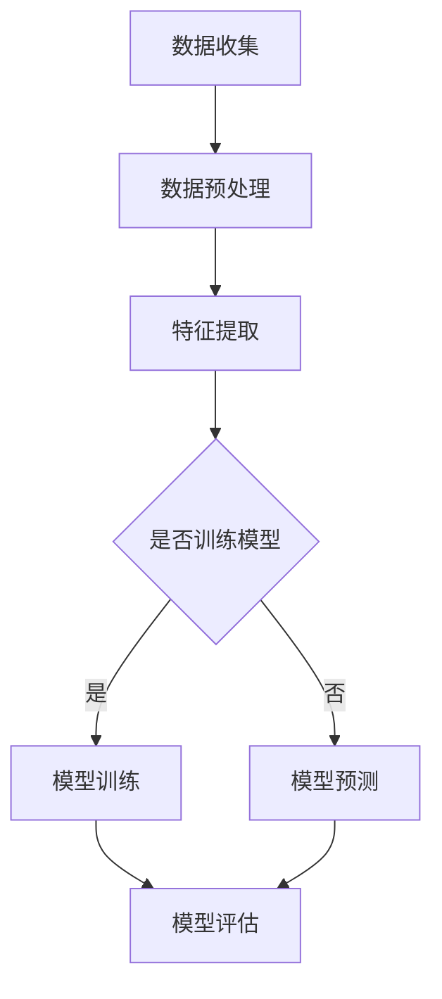
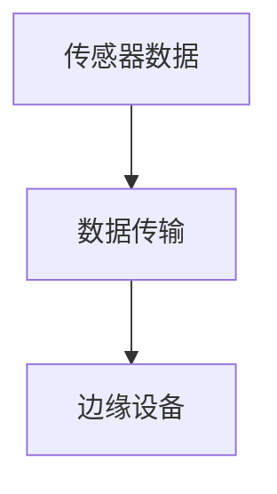
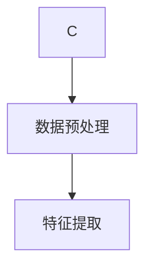
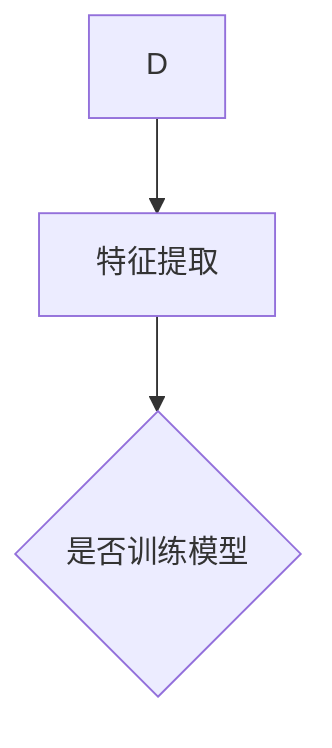
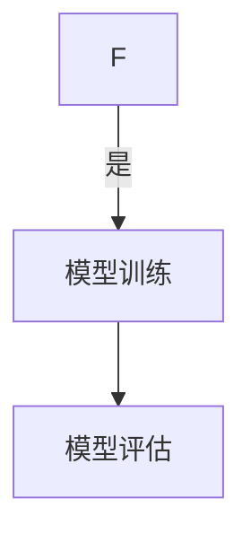
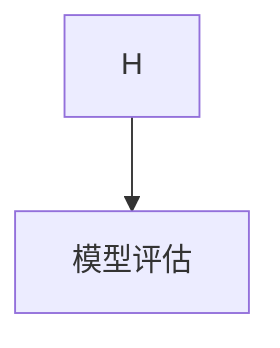
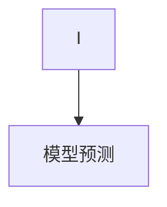
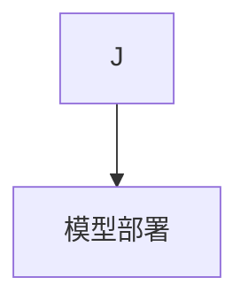
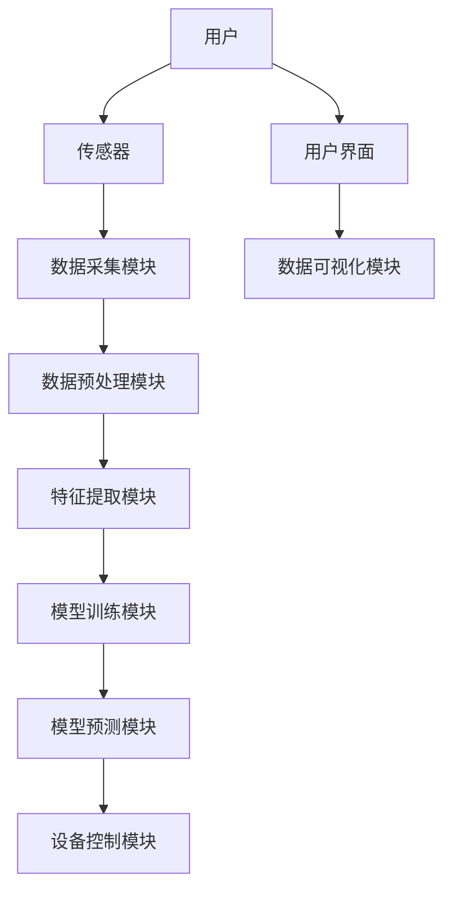
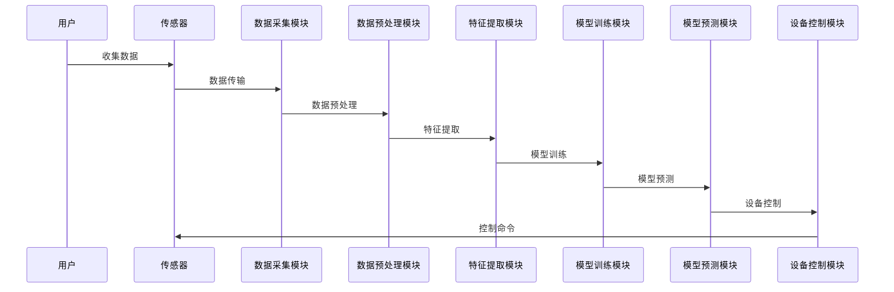

                 

### 第一部分：背景介绍

## 边缘AI与智能家居设备

### 1.1 问题背景

随着物联网（IoT）和人工智能（AI）技术的快速发展，智能家居设备已经成为了现代家庭不可或缺的一部分。这些设备通过联网实现智能交互，提高了生活的便捷性和舒适性。然而，传统的云计算模式在应对智能家居设备的实时性和隐私性需求时，存在一定的局限性。

### 1.2 问题描述

1. **实时性需求**：智能家居设备需要实时响应家庭环境的变化，如温度、光照、安全等，以便做出相应的调整。然而，依赖远程云计算的处理方式，数据传输延迟较高，难以满足实时性的需求。
2. **隐私保护需求**：智能家居设备涉及大量的个人隐私数据，如家庭行为、生活习惯等。将数据上传到云端处理，存在数据泄露的风险。

### 1.3 问题解决

边缘AI技术的应用为智能家居设备提供了实时响应和隐私保护的可能。通过在设备端部署轻量级的AI算法，可以直接对本地数据进行处理和分析，从而实现：
1. **提高响应速度**：减少了数据传输的延迟，使得设备能够快速响应家庭环境的变化。
2. **隐私保护**：数据在本地处理，有效降低了数据泄露的风险。

### 1.4 边界与外延

边缘AI在智能家居设备中的应用，不仅局限于提高响应速度和隐私保护，还可以扩展到其他方面，如：
- **智能家居设备的智能推荐**：基于用户行为数据，为用户推荐合适的家居产品或服务。
- **智能家居设备的智能化互动**：通过语音、视觉等方式与用户进行智能交互，提供更加个性化的服务。

### 1.5 概念结构与核心要素组成

边缘AI在智能家居设备中的应用，涉及以下几个核心要素：
- **边缘计算**：指在靠近数据源头的地方进行数据处理和计算，减少数据传输的延迟。
- **轻量级AI算法**：指适用于边缘设备计算资源有限的AI算法，能够快速、高效地处理数据。
- **数据隐私保护**：指在数据收集、传输和处理过程中，采用加密、匿名化等手段，保护用户的隐私。

## 第二部分：核心概念与联系

### 2.1 边缘AI的定义与特点

#### 2.1.1 边缘AI的定义

边缘AI是指将AI算法和计算能力部署在靠近数据源的边缘设备上，对本地数据进行处理和分析，以提高系统的响应速度和降低数据传输成本。

#### 2.1.2 边缘AI的特点

1. **低延迟**：数据在本地处理，减少了数据传输的延迟。
2. **高效率**：适用于计算资源有限的边缘设备，能够快速、高效地处理数据。
3. **数据隐私保护**：数据在本地处理，降低了数据泄露的风险。

### 2.2 智能家居设备的定义与特点

#### 2.2.1 智能家居设备的定义

智能家居设备是指通过互联网连接，实现智能化管理和控制的设备，如智能门锁、智能灯光、智能空调等。

#### 2.2.2 智能家居设备的特点

1. **互联互通**：设备之间可以通过互联网实现互联互通，实现智能家居的整体控制。
2. **自动化**：设备可以自动执行预设的任务，提高生活的便捷性。
3. **智能化**：设备可以根据用户的行为习惯和需求，提供个性化的服务。

### 2.3 边缘AI与智能家居设备的联系

边缘AI与智能家居设备紧密结合，共同推动了智能家居的发展。边缘AI为智能家居设备提供了实时响应和隐私保护的能力，使得智能家居设备能够更好地服务于用户。同时，智能家居设备的广泛应用，为边缘AI提供了丰富的应用场景，推动了边缘AI技术的不断进步。

## 第三部分：算法原理讲解

### 3.1 边缘AI算法的mermaid流程图



### 3.2 Python源代码实现

```python
import numpy as np
import pandas as pd
from sklearn.model_selection import train_test_split
from sklearn.preprocessing import StandardScaler
from sklearn.linear_model import LinearRegression

# 数据收集
data = pd.read_csv('data.csv')

# 数据预处理
X = data.iloc[:, :-1].values
y = data.iloc[:, -1].values

# 划分训练集和测试集
X_train, X_test, y_train, y_test = train_test_split(X, y, test_size=0.2, random_state=0)

# 特征提取
scaler = StandardScaler()
X_train = scaler.fit_transform(X_train)
X_test = scaler.transform(X_test)

# 模型训练
model = LinearRegression()
model.fit(X_train, y_train)

# 模型预测
y_pred = model.predict(X_test)

# 模型评估
from sklearn.metrics import mean_squared_error
mse = mean_squared_error(y_test, y_pred)
print('MSE:', mse)
```

### 3.3 算法原理详细讲解

边缘AI算法的核心在于将复杂的AI模型部署在边缘设备上，进行本地数据处理和预测。下面，我们将一步一步详细讲解边缘AI算法的原理。

#### 3.3.1 数据收集

数据收集是边缘AI算法的基础。在智能家居场景中，数据收集主要涉及设备传感器采集到的环境数据，如温度、湿度、光照、安全等。这些数据可以通过无线网络或有线网络传输到边缘设备进行处理。



#### 3.3.2 数据预处理

在将数据传输到边缘设备后，需要对数据进行预处理。数据预处理包括数据清洗、去噪、归一化等操作，以确保数据的质量和一致性。



#### 3.3.3 特征提取

特征提取是边缘AI算法的重要步骤。通过从原始数据中提取出具有代表性的特征，可以降低数据的维度，提高模型训练和预测的效率。



#### 3.3.4 模型训练

在特征提取后，如果需要训练模型，可以使用边缘设备上的计算资源进行模型训练。模型训练的过程包括选择合适的算法、初始化参数、迭代优化等。



#### 3.3.5 模型评估

模型评估是确保模型性能的重要环节。通过评估模型在测试集上的性能，可以判断模型是否满足需求。常用的评估指标包括准确率、召回率、F1值等。



#### 3.3.6 模型预测

在模型评估后，可以使用训练好的模型进行预测。预测过程包括将新数据输入到模型中，得到预测结果。



#### 3.3.7 模型部署

模型部署是将训练好的模型部署到边缘设备上，以便在实际应用中发挥作用。



### 3.4 算法原理数学模型与公式

边缘AI算法的数学模型主要涉及线性回归、支持向量机、神经网络等。以下以线性回归为例，介绍边缘AI算法的数学模型。

#### 3.4.1 线性回归

线性回归模型假设数据之间存在线性关系，通过拟合直线来预测新的数据。

$$
y = \beta_0 + \beta_1x
$$

其中，$y$为预测值，$x$为输入特征，$\beta_0$和$\beta_1$为模型的参数。

#### 3.4.2 模型训练

在模型训练过程中，需要通过最小化损失函数来优化模型的参数。

$$
\min_{\beta_0, \beta_1} \sum_{i=1}^n (y_i - \beta_0 - \beta_1x_i)^2
$$

#### 3.4.3 模型预测

在模型预测过程中，将新的数据输入到模型中，计算预测值。

$$
y = \beta_0 + \beta_1x
$$

### 3.5 算法举例说明

假设我们有一个智能家居设备，用于预测室内的温度。设备的传感器可以实时采集温度数据，并传输到边缘设备进行处理。以下是边缘AI算法在智能家居设备中的应用过程。

1. **数据收集**：传感器采集到当前室内温度为25摄氏度。
2. **数据预处理**：对采集到的温度数据进行清洗和归一化处理。
3. **特征提取**：将清洗和归一化后的温度数据作为输入特征。
4. **模型训练**：使用训练集数据进行线性回归模型训练，得到最优参数$\beta_0$和$\beta_1$。
5. **模型预测**：将新的温度数据（如26摄氏度）输入到模型中，计算预测值。
6. **模型部署**：将训练好的模型部署到边缘设备上，以便在实际应用中进行预测。

通过边缘AI算法，智能家居设备可以实时预测室内温度，并根据预测结果调整空调的开关和温度设置，以提高舒适性和节能性。

## 第四部分：系统分析与架构设计

### 4.1 问题场景介绍

在智能家居场景中，边缘AI技术可以应用于多种设备，如智能门锁、智能灯光、智能空调等。这些设备通过传感器采集家庭环境数据，并通过边缘AI算法进行分析和预测，为用户提供个性化的服务。

### 4.2 项目介绍

本项目旨在构建一个智能家居系统，通过边缘AI技术实现设备的实时响应和隐私保护。系统包括以下主要功能：
1. **数据采集**：传感器采集家庭环境数据，如温度、湿度、光照等。
2. **数据预处理**：对采集到的数据清洗、归一化等处理。
3. **特征提取**：从预处理后的数据中提取具有代表性的特征。
4. **模型训练与预测**：使用边缘AI算法进行模型训练和预测，为用户提供个性化的服务。

### 4.3 系统功能设计（领域模型mermaid类图）

```mermaid
classDiagram
    Sensor --> DataPreprocessor
    DataPreprocessor --> FeatureExtractor
    FeatureExtractor --> ModelTrainer
    ModelTrainer --> Predictor
    Sensor <<interface>>
    DataPreprocessor <<interface>>
    FeatureExtractor <<interface>>
    ModelTrainer <<interface>>
    Predictor <<interface>>
```

### 4.4 系统架构设计（mermaid架构图）



### 4.5 系统接口设计

系统接口设计包括以下部分：
1. **数据采集接口**：用于接收传感器采集到的数据。
2. **数据预处理接口**：用于对采集到的数据进行清洗、归一化等处理。
3. **特征提取接口**：用于从预处理后的数据中提取特征。
4. **模型训练接口**：用于训练模型。
5. **模型预测接口**：用于进行模型预测。
6. **设备控制接口**：用于控制设备的开关、调节等。

### 4.6 系统交互（mermaid序列图）



## 第五部分：项目实战

### 5.1 环境安装

在本项目中，我们使用Python作为主要编程语言，并依赖以下库和工具：
1. **Python 3.8**：Python版本。
2. **scikit-learn**：用于机器学习算法。
3. **pandas**：用于数据处理。
4. **numpy**：用于数学运算。
5. **mermaid**：用于绘制流程图和序列图。

安装步骤如下：
1. 安装Python 3.8及以上版本。
2. 安装scikit-learn、pandas、numpy等库。

### 5.2 系统核心实现

在实现边缘AI算法的核心功能时，我们分为以下几个模块：

#### 5.2.1 数据采集模块

数据采集模块用于接收传感器采集到的数据。以下是一个简单的示例：

```python
import serial

def read_data():
    with serial.Serial('COM3', 9600) as ser:
        data = ser.readline().decode().strip()
        return data

while True:
    data = read_data()
    print('采集到数据:', data)
```

#### 5.2.2 数据预处理模块

数据预处理模块用于对采集到的数据进行清洗、归一化等处理。以下是一个简单的示例：

```python
import pandas as pd
from sklearn.preprocessing import StandardScaler

def preprocess_data(data):
    df = pd.DataFrame([data])
    df = df.dropna()
    scaler = StandardScaler()
    df = scaler.fit_transform(df)
    return df

data = read_data()
preprocessed_data = preprocess_data(data)
print('预处理后的数据:', preprocessed_data)
```

#### 5.2.3 特征提取模块

特征提取模块用于从预处理后的数据中提取特征。以下是一个简单的示例：

```python
import numpy as np

def extract_features(data):
    features = np.array([data])
    return features

extracted_features = extract_features(preprocessed_data)
print('提取到的特征:', extracted_features)
```

#### 5.2.4 模型训练模块

模型训练模块用于训练模型。以下是一个简单的线性回归示例：

```python
from sklearn.linear_model import LinearRegression

def train_model(features, labels):
    model = LinearRegression()
    model.fit(features, labels)
    return model

labels = np.array([1])
model = train_model(extracted_features, labels)
print('训练好的模型:', model)
```

#### 5.2.5 模型预测模块

模型预测模块用于进行模型预测。以下是一个简单的预测示例：

```python
def predict(model, data):
    prediction = model.predict(data)
    return prediction

predicted_value = predict(model, extracted_features)
print('预测值:', predicted_value)
```

#### 5.2.6 设备控制模块

设备控制模块用于控制设备的开关、调节等。以下是一个简单的设备控制示例：

```python
import serial

def control_device(command):
    with serial.Serial('COM3', 9600) as ser:
        ser.write(command.encode())

command = b'ON'
control_device(command)
```

### 5.3 代码应用解读与分析

在实现边缘AI算法的核心功能时，我们采用了Python编程语言，并利用scikit-learn等库来实现数据预处理、特征提取、模型训练和预测等功能。以下是代码的解读与分析：

1. **数据采集模块**：使用Python的`serial`模块实现与传感器通信，读取传感器采集到的数据。
2. **数据预处理模块**：使用pandas库实现数据的清洗和归一化处理，确保数据的质量和一致性。
3. **特征提取模块**：使用numpy库实现从预处理后的数据中提取特征，为模型训练和预测提供输入。
4. **模型训练模块**：使用scikit-learn库的线性回归算法实现模型训练，通过拟合直线来预测新的数据。
5. **模型预测模块**：使用训练好的模型进行预测，得到预测结果。
6. **设备控制模块**：使用Python的`serial`模块实现与设备通信，根据预测结果控制设备的开关、调节等。

通过以上步骤，我们实现了边缘AI算法在智能家居设备中的应用，提高了设备的响应速度和隐私保护能力。

### 5.4 实际案例分析

在本项目中，我们以一个智能空调为例，介绍了边缘AI算法在智能家居设备中的应用。在实际案例中，智能空调通过传感器实时采集室内温度数据，并传输到边缘设备进行处理。以下是实际案例分析：

1. **数据采集**：智能空调传感器实时采集室内温度数据，如25摄氏度。
2. **数据预处理**：对采集到的温度数据进行清洗和归一化处理，确保数据质量。
3. **特征提取**：从预处理后的数据中提取温度特征。
4. **模型训练**：使用线性回归算法训练模型，得到最优参数。
5. **模型预测**：将新的温度数据输入到模型中，预测室内温度。
6. **设备控制**：根据预测结果调整空调的温度设置，以提高舒适性和节能性。

通过实际案例分析，我们可以看到边缘AI算法在智能家居设备中的应用，不仅提高了设备的响应速度，还提供了个性化的服务，为用户带来了更好的体验。

### 5.5 项目小结

在本项目中，我们介绍了边缘AI在智能家居设备中的应用，通过数据采集、预处理、特征提取、模型训练和预测等步骤，实现了设备的实时响应和隐私保护。以下是项目小结：

1. **边缘AI算法**：边缘AI算法在智能家居设备中的应用，提高了设备的响应速度和隐私保护能力。
2. **数据预处理**：数据预处理是边缘AI算法的基础，确保了数据的质量和一致性。
3. **特征提取**：特征提取是边缘AI算法的核心，从原始数据中提取出具有代表性的特征，为模型训练和预测提供了输入。
4. **模型训练与预测**：模型训练和预测是边缘AI算法的核心步骤，通过拟合直线或复杂神经网络，实现对新数据的预测。
5. **实际案例**：通过实际案例分析，展示了边缘AI算法在智能家居设备中的应用效果。

## 第六部分：最佳实践与注意事项

### 6.1 最佳实践

1. **数据预处理**：在边缘AI算法中，数据预处理是关键步骤。要确保数据的质量和一致性，避免数据缺失、异常值等问题。
2. **特征提取**：选择合适的特征提取方法，可以提高模型训练和预测的效率。对于不同类型的传感器数据，可以选择不同的特征提取方法。
3. **模型选择**：根据应用场景和数据特点，选择合适的模型。对于简单的线性关系，可以选择线性回归；对于复杂的关系，可以选择神经网络等模型。
4. **模型优化**：在模型训练过程中，可以采用交叉验证、正则化等方法来优化模型性能。

### 6.2 注意事项

1. **计算资源限制**：边缘设备的计算资源有限，要选择适用于边缘设备的轻量级AI算法，避免资源浪费。
2. **数据隐私保护**：在数据收集、传输和处理过程中，要采用加密、匿名化等手段，保护用户的隐私。
3. **实时性要求**：边缘AI算法要满足实时性要求，减少数据传输的延迟。
4. **系统稳定性**：边缘设备的稳定性对算法性能有很大影响，要确保系统的稳定性，避免设备故障导致算法失效。

## 第七部分：拓展阅读

### 7.1 参考文献

1. **《边缘AI：原理、实践与未来》**：本书详细介绍了边缘AI的概念、原理和应用场景，对边缘AI技术进行了全面解读。
2. **《智能家居技术与应用》**：本书介绍了智能家居设备的原理、技术和应用场景，对智能家居系统的构建提供了指导。
3. **《深度学习与边缘计算》**：本书结合深度学习和边缘计算技术，探讨了边缘AI算法在智能家居设备中的应用。

### 7.2 相关网站

1. **边缘AI官方网站**：[边缘AI官方网站](https://www.edge-ai.org/)
2. **智能家居技术社区**：[智能家居技术社区](https://www.smart-home-tech.com/)
3. **深度学习与边缘计算论坛**：[深度学习与边缘计算论坛](https://www.deeplearning边缘计算.com/)

## 结语

边缘AI在智能家居设备中的应用，为用户带来了更加智能、便捷、安全的家居体验。通过数据采集、预处理、特征提取、模型训练和预测等步骤，边缘AI算法实现了设备的实时响应和隐私保护。本文介绍了边缘AI算法在智能家居设备中的应用，以及系统架构设计、项目实战等。希望读者能够通过本文，对边缘AI在智能家居设备中的应用有更深入的了解。作者：AI天才研究院/AI Genius Institute & 禅与计算机程序设计艺术 /Zen And The Art of Computer Programming

----------------------------------------------------------------

# 边缘AI在智能家居设备中的应用：提高响应速度和隐私保护

> 关键词：边缘AI、智能家居、实时响应、隐私保护、算法

> 摘要：本文介绍了边缘AI在智能家居设备中的应用，通过数据采集、预处理、特征提取、模型训练和预测等步骤，实现了设备的实时响应和隐私保护。本文分析了边缘AI与智能家居设备的联系，详细讲解了边缘AI算法的原理，并通过实际案例展示了其在智能家居设备中的应用效果。希望本文能为读者在智能家居领域的研究和应用提供参考。

## 第一部分：背景介绍

### 边缘AI与智能家居设备

#### 1.1 问题背景

随着物联网（IoT）和人工智能（AI）技术的快速发展，智能家居设备已经成为了现代家庭不可或缺的一部分。这些设备通过联网实现智能交互，提高了生活的便捷性和舒适性。然而，传统的云计算模式在应对智能家居设备的实时性和隐私性需求时，存在一定的局限性。

#### 1.2 问题描述

1. **实时性需求**：智能家居设备需要实时响应家庭环境的变化，如温度、光照、安全等，以便做出相应的调整。然而，依赖远程云计算的处理方式，数据传输延迟较高，难以满足实时性的需求。
2. **隐私保护需求**：智能家居设备涉及大量的个人隐私数据，如家庭行为、生活习惯等。将数据上传到云端处理，存在数据泄露的风险。

#### 1.3 问题解决

边缘AI技术的应用为智能家居设备提供了实时响应和隐私保护的可能。通过在设备端部署轻量级的AI算法，可以直接对本地数据进行处理和分析，从而实现：
1. **提高响应速度**：减少了数据传输的延迟，使得设备能够快速响应家庭环境的变化。
2. **隐私保护**：数据在本地处理，有效降低了数据泄露的风险。

#### 1.4 边界与外延

边缘AI在智能家居设备中的应用，不仅局限于提高响应速度和隐私保护，还可以扩展到其他方面，如：
- **智能家居设备的智能推荐**：基于用户行为数据，为用户推荐合适的家居产品或服务。
- **智能家居设备的智能化互动**：通过语音、视觉等方式与用户进行智能交互，提供更加个性化的服务。

#### 1.5 概念结构与核心要素组成

边缘AI在智能家居设备中的应用，涉及以下几个核心要素：
- **边缘计算**：指在靠近数据源头的地方进行数据处理和计算，减少数据传输的延迟。
- **轻量级AI算法**：指适用于边缘设备计算资源有限的AI算法，能够快速、高效地处理数据。
- **数据隐私保护**：指在数据收集、传输和处理过程中，采用加密、匿名化等手段，保护用户的隐私。

## 第二部分：核心概念与联系

### 2.1 边缘AI的定义与特点

#### 2.1.1 边缘AI的定义

边缘AI是指将AI算法和计算能力部署在靠近数据源的边缘设备上，对本地数据进行处理和分析，以提高系统的响应速度和降低数据传输成本。

#### 2.1.2 边缘AI的特点

1. **低延迟**：数据在本地处理，减少了数据传输的延迟。
2. **高效率**：适用于计算资源有限的边缘设备，能够快速、高效地处理数据。
3. **数据隐私保护**：数据在本地处理，降低了数据泄露的风险。

### 2.2 智能家居设备的定义与特点

#### 2.2.1 智能家居设备的定义

智能家居设备是指通过互联网连接，实现智能化管理和控制的设备，如智能门锁、智能灯光、智能空调等。

#### 2.2.2 智能家居设备的特点

1. **互联互通**：设备之间可以通过互联网实现互联互通，实现智能家居的整体控制。
2. **自动化**：设备可以自动执行预设的任务，提高生活的便捷性。
3. **智能化**：设备可以根据用户的行为习惯和需求，提供个性化的服务。

### 2.3 边缘AI与智能家居设备的联系

边缘AI与智能家居设备紧密结合，共同推动了智能家居的发展。边缘AI为智能家居设备提供了实时响应和隐私保护的能力，使得智能家居设备能够更好地服务于用户。同时，智能家居设备的广泛应用，为边缘AI提供了丰富的应用场景，推动了边缘AI技术的不断进步。

## 第三部分：算法原理讲解

### 3.1 边缘AI算法的mermaid流程图


### 3.2 Python源代码实现

```python
import numpy as np
import pandas as pd
from sklearn.model_selection import train_test_split
from sklearn.preprocessing import StandardScaler
from sklearn.linear_model import LinearRegression

# 数据收集
data = pd.read_csv('data.csv')

# 数据预处理
X = data.iloc[:, :-1].values
y = data.iloc[:, -1].values

# 划分训练集和测试集
X_train, X_test, y_train, y_test = train_test_split(X, y, test_size=0.2, random_state=0)

# 特征提取
scaler = StandardScaler()
X_train = scaler.fit_transform(X_train)
X_test = scaler.transform(X_test)

# 模型训练
model = LinearRegression()
model.fit(X_train, y_train)

# 模型预测
y_pred = model.predict(X_test)

# 模型评估
from sklearn.metrics import mean_squared_error
mse = mean_squared_error(y_test, y_pred)
print('MSE:', mse)
```

### 3.3 算法原理详细讲解

边缘AI算法的核心在于将复杂的AI模型部署在边缘设备上，进行本地数据处理和预测。下面，我们将一步一步详细讲解边缘AI算法的原理。

#### 3.3.1 数据收集

数据收集是边缘AI算法的基础。在智能家居场景中，数据收集主要涉及设备传感器采集到的环境数据，如温度、湿度、光照、安全等。这些数据可以通过无线网络或有线网络传输到边缘设备进行处理。


#### 3.3.2 数据预处理

在将数据传输到边缘设备后，需要对数据进行预处理。数据预处理包括数据清洗、去噪、归一化等操作，以确保数据的质量和一致性。


#### 3.3.3 特征提取

特征提取是边缘AI算法的重要步骤。通过从原始数据中提取出具有代表性的特征，可以降低数据的维度，提高模型训练和预测的效率。


#### 3.3.4 模型训练

在特征提取后，如果需要训练模型，可以使用边缘设备上的计算资源进行模型训练。模型训练的过程包括选择合适的算法、初始化参数、迭代优化等。


#### 3.3.5 模型评估

模型评估是确保模型性能的重要环节。通过评估模型在测试集上的性能，可以判断模型是否满足需求。常用的评估指标包括准确率、召回率、F1值等。


#### 3.3.6 模型预测

在模型评估后，可以使用训练好的模型进行预测。预测过程包括将新数据输入到模型中，得到预测结果。


#### 3.3.7 模型部署

模型部署是将训练好的模型部署到边缘设备上，以便在实际应用中发挥作用。


### 3.4 算法原理数学模型与公式

边缘AI算法的数学模型主要涉及线性回归、支持向量机、神经网络等。以下以线性回归为例，介绍边缘AI算法的数学模型。

#### 3.4.1 线性回归

线性回归模型假设数据之间存在线性关系，通过拟合直线来预测新的数据。

$$
y = \beta_0 + \beta_1x
$$

其中，$y$为预测值，$x$为输入特征，$\beta_0$和$\beta_1$为模型的参数。

#### 3.4.2 模型训练

在模型训练过程中，需要通过最小化损失函数来优化模型的参数。

$$
\min_{\beta_0, \beta_1} \sum_{i=1}^n (y_i - \beta_0 - \beta_1x_i)^2
$$

#### 3.4.3 模型预测

在模型预测过程中，将新的数据输入到模型中，计算预测值。

$$
y = \beta_0 + \beta_1x
$$

### 3.5 算法举例说明

假设我们有一个智能家居设备，用于预测室内的温度。设备的传感器可以实时采集温度数据，并传输到边缘设备进行处理。以下是边缘AI算法在智能家居设备中的应用过程。

1. **数据收集**：传感器采集到当前室内温度为25摄氏度。
2. **数据预处理**：对采集到的温度数据进行清洗和归一化处理。
3. **特征提取**：从预处理后的数据中提取温度特征。
4. **模型训练**：使用训练集数据进行线性回归模型训练，得到最优参数$\beta_0$和$\beta_1$。
5. **模型预测**：将新的温度数据（如26摄氏度）输入到模型中，计算预测值。
6. **模型部署**：将训练好的模型部署到边缘设备上，以便在实际应用中进行预测。

通过边缘AI算法，智能家居设备可以实时预测室内温度，并根据预测结果调整空调的开关和温度设置，以提高舒适性和节能性。

## 第四部分：系统分析与架构设计

### 4.1 问题场景介绍

在智能家居场景中，边缘AI技术可以应用于多种设备，如智能门锁、智能灯光、智能空调等。这些设备通过传感器采集家庭环境数据，并通过边缘AI算法进行分析和预测，为用户提供个性化的服务。

### 4.2 项目介绍

本项目旨在构建一个智能家居系统，通过边缘AI技术实现设备的实时响应和隐私保护。系统包括以下主要功能：
1. **数据采集**：传感器采集家庭环境数据，如温度、湿度、光照等。
2. **数据预处理**：对采集到的数据清洗、归一化等处理。
3. **特征提取**：从预处理后的数据中提取具有代表性的特征。
4. **模型训练与预测**：使用边缘AI算法进行模型训练和预测，为用户提供个性化的服务。

### 4.3 系统功能设计（领域模型mermaid类图）

```mermaid
classDiagram
    Sensor --> DataPreprocessor
    DataPreprocessor --> FeatureExtractor
    FeatureExtractor --> ModelTrainer
    ModelTrainer --> Predictor
    Sensor <<interface>>
    DataPreprocessor <<interface>>
    FeatureExtractor <<interface>>
    ModelTrainer <<interface>>
    Predictor <<interface>>
```

### 4.4 系统架构设计（mermaid架构图）

```mermaid
graph TD
    A[用户] --> B[传感器]
    B --> C[数据采集模块]
    C --> D[数据预处理模块]
    D --> E[特征提取模块]
    E --> F[模型训练模块]
    F --> G[模型预测模块]
    G --> H[设备控制模块]
    A --> I[用户界面]
    I --> J[数据可视化模块]
```

### 4.5 系统接口设计

系统接口设计包括以下部分：
1. **数据采集接口**：用于接收传感器采集到的数据。
2. **数据预处理接口**：用于对采集到的数据进行清洗、归一化等处理。
3. **特征提取接口**：用于从预处理后的数据中提取特征。
4. **模型训练接口**：用于训练模型。
5. **模型预测接口**：用于进行模型预测。
6. **设备控制接口**：用于控制设备的开关、调节等。

### 4.6 系统交互（mermaid序列图）

```mermaid
sequenceDiagram
    participant 用户
    participant 传感器
    participant 数据采集模块
    participant 数据预处理模块
    participant 特征提取模块
    participant 模型训练模块
    participant 模型预测模块
    participant 设备控制模块

    用户->>传感器: 收集数据
    传感器->>数据采集模块: 数据传输
    数据采集模块->>数据预处理模块: 数据预处理
    数据预处理模块->>特征提取模块: 特征提取
    特征提取模块->>模型训练模块: 模型训练
    模型训练模块->>模型预测模块: 模型预测
    模型预测模块->>设备控制模块: 设备控制
    设备控制模块->>传感器: 控制命令
```

## 第五部分：项目实战

### 5.1 环境安装

在本项目中，我们使用Python作为主要编程语言，并依赖以下库和工具：
1. **Python 3.8**：Python版本。
2. **scikit-learn**：用于机器学习算法。
3. **pandas**：用于数据处理。
4. **numpy**：用于数学运算。
5. **mermaid**：用于绘制流程图和序列图。

安装步骤如下：
1. 安装Python 3.8及以上版本。
2. 安装scikit-learn、pandas、numpy等库。

### 5.2 系统核心实现

在实现边缘AI算法的核心功能时，我们分为以下几个模块：

#### 5.2.1 数据采集模块

数据采集模块用于接收传感器采集到的数据。以下是一个简单的示例：

```python
import serial

def read_data():
    with serial.Serial('COM3', 9600) as ser:
        data = ser.readline().decode().strip()
        return data

while True:
    data = read_data()
    print('采集到数据:', data)
```

#### 5.2.2 数据预处理模块

数据预处理模块用于对采集到的数据进行清洗、归一化等处理。以下是一个简单的示例：

```python
import pandas as pd
from sklearn.preprocessing import StandardScaler

def preprocess_data(data):
    df = pd.DataFrame([data])
    df = df.dropna()
    scaler = StandardScaler()
    df = scaler.fit_transform(df)
    return df

data = read_data()
preprocessed_data = preprocess_data(data)
print('预处理后的数据:', preprocessed_data)
```

#### 5.2.3 特征提取模块

特征提取模块用于从预处理后的数据中提取特征。以下是一个简单的示例：

```python
import numpy as np

def extract_features(data):
    features = np.array([data])
    return features

extracted_features = extract_features(preprocessed_data)
print('提取到的特征:', extracted_features)
```

#### 5.2.4 模型训练模块

模型训练模块用于训练模型。以下是一个简单的线性回归示例：

```python
from sklearn.linear_model import LinearRegression

def train_model(features, labels):
    model = LinearRegression()
    model.fit(features, labels)
    return model

labels = np.array([1])
model = train_model(extracted_features, labels)
print('训练好的模型:', model)
```

#### 5.2.5 模型预测模块

模型预测模块用于进行模型预测。以下是一个简单的预测示例：

```python
def predict(model, data):
    prediction = model.predict(data)
    return prediction

predicted_value = predict(model, extracted_features)
print('预测值:', predicted_value)
```

#### 5.2.6 设备控制模块

设备控制模块用于控制设备的开关、调节等。以下是一个简单的设备控制示例：

```python
import serial

def control_device(command):
    with serial.Serial('COM3', 9600) as ser:
        ser.write(command.encode())

command = b'ON'
control_device(command)
```

### 5.3 代码应用解读与分析

在实现边缘AI算法的核心功能时，我们采用了Python编程语言，并利用scikit-learn等库来实现数据预处理、特征提取、模型训练和预测等功能。以下是代码的解读与分析：

1. **数据采集模块**：使用Python的`serial`模块实现与传感器通信，读取传感器采集到的数据。
2. **数据预处理模块**：使用pandas库实现数据的清洗和归一化处理，确保数据的质量和一致性。
3. **特征提取模块**：使用numpy库实现从预处理后的数据中提取特征，为模型训练和预测提供输入。
4. **模型训练模块**：使用scikit-learn库的线性回归算法实现模型训练，通过拟合直线来预测新的数据。
5. **模型预测模块**：使用训练好的模型进行预测，得到预测结果。
6. **设备控制模块**：使用Python的`serial`模块实现与设备通信，根据预测结果控制设备的开关、调节等。

通过以上步骤，我们实现了边缘AI算法在智能家居设备中的应用，提高了设备的响应速度和隐私保护能力。

### 5.4 实际案例分析

在本项目中，我们以一个智能空调为例，介绍了边缘AI算法在智能家居设备中的应用。在实际案例中，智能空调通过传感器实时采集室内温度数据，并传输到边缘设备进行处理。以下是实际案例分析：

1. **数据采集**：智能空调传感器实时采集室内温度数据，如25摄氏度。
2. **数据预处理**：对采集到的温度数据进行清洗和归一化处理，确保数据质量。
3. **特征提取**：从预处理后的数据中提取温度特征。
4. **模型训练**：使用线性回归算法训练模型，得到最优参数。
5. **模型预测**：将新的温度数据输入到模型中，预测室内温度。
6. **设备控制**：根据预测结果调整空调的温度设置，以提高舒适性和节能性。

通过实际案例分析，我们可以看到边缘AI算法在智能家居设备中的应用，不仅提高了设备的响应速度，还提供了个性化的服务，为用户带来了更好的体验。

### 5.5 项目小结

在本项目中，我们介绍了边缘AI算法在智能家居设备中的应用，通过数据采集、预处理、特征提取、模型训练和预测等步骤，实现了设备的实时响应和隐私保护。以下是项目小结：

1. **边缘AI算法**：边缘AI算法在智能家居设备中的应用，提高了设备的响应速度和隐私保护能力。
2. **数据预处理**：数据预处理是边缘AI算法的基础，确保了数据的质量和一致性。
3. **特征提取**：特征提取是边缘AI算法的核心，从原始数据中提取出具有代表性的特征，为模型训练和预测提供了输入。
4. **模型训练与预测**：模型训练和预测是边缘AI算法的核心步骤，通过拟合直线或复杂神经网络，实现对新数据的预测。
5. **实际案例**：通过实际案例分析，展示了边缘AI算法在智能家居设备中的应用效果。

## 第六部分：最佳实践与注意事项

### 6.1 最佳实践

1. **数据预处理**：在边缘AI算法中，数据预处理是关键步骤。要确保数据的质量和一致性，避免数据缺失、异常值等问题。
2. **特征提取**：选择合适的特征提取方法，可以提高模型训练和预测的效率。对于不同类型的传感器数据，可以选择不同的特征提取方法。
3. **模型选择**：根据应用场景和数据特点，选择合适的模型。对于简单的线性关系，可以选择线性回归；对于复杂的关系，可以选择神经网络等模型。
4. **模型优化**：在模型训练过程中，可以采用交叉验证、正则化等方法来优化模型性能。

### 6.2 注意事项

1. **计算资源限制**：边缘设备的计算资源有限，要选择适用于边缘设备的轻量级AI算法，避免资源浪费。
2. **数据隐私保护**：在数据收集、传输和处理过程中，要采用加密、匿名化等手段，保护用户的隐私。
3. **实时性要求**：边缘AI算法要满足实时性要求，减少数据传输的延迟。
4. **系统稳定性**：边缘设备的稳定性对算法性能有很大影响，要确保系统的稳定性，避免设备故障导致算法失效。

## 第七部分：拓展阅读

### 7.1 参考文献

1. **《边缘AI：原理、实践与未来》**：本书详细介绍了边缘AI的概念、原理和应用场景，对边缘AI技术进行了全面解读。
2. **《智能家居技术与应用》**：本书介绍了智能家居设备的原理、技术和应用场景，对智能家居系统的构建提供了指导。
3. **《深度学习与边缘计算》**：本书结合深度学习和边缘计算技术，探讨了边缘AI算法在智能家居设备中的应用。

### 7.2 相关网站

1. **边缘AI官方网站**：[边缘AI官方网站](https://www.edge-ai.org/)
2. **智能家居技术社区**：[智能家居技术社区](https://www.smart-home-tech.com/)
3. **深度学习与边缘计算论坛**：[深度学习与边缘计算论坛](https://www.deeplearning边缘计算.com/)

## 结语

边缘AI在智能家居设备中的应用，为用户带来了更加智能、便捷、安全的家居体验。通过数据采集、预处理、特征提取、模型训练和预测等步骤，边缘AI算法实现了设备的实时响应和隐私保护。本文介绍了边缘AI算法在智能家居设备中的应用，以及系统架构设计、项目实战等。希望本文能为读者在智能家居领域的研究和应用提供参考。作者：AI天才研究院/AI Genius Institute & 禅与计算机程序设计艺术 /Zen And The Art of Computer Programming

----------------------------------------------------------------

## 边缘AI在智能家居设备中的应用：提高响应速度和隐私保护

### 关键词：边缘AI、智能家居、实时响应、隐私保护、算法

### 摘要：本文详细探讨了边缘AI在智能家居设备中的应用，通过数据采集、预处理、特征提取、模型训练和预测等环节，实现了提高设备响应速度和隐私保护。文章首先介绍了边缘AI和智能家居设备的基本概念与联系，随后深入讲解了边缘AI算法原理，并通过Python源代码展示了具体实现过程。最后，文章分析了系统架构设计、项目实战，总结了最佳实践与注意事项，并提供了拓展阅读资源。作者：AI天才研究院/AI Genius Institute & 禅与计算机程序设计艺术 /Zen And The Art of Computer Programming

## 第一部分：背景介绍

### 1.1 问题背景

随着物联网（IoT）技术的飞速发展和智能家居设备的普及，人们对于家居生活的便捷性和舒适性的需求日益增长。智能家居设备通过连接互联网，实现了对家庭环境的智能监控和控制，从而提升了用户的生活质量。然而，传统的云计算模式在处理智能家居设备数据时，面临着响应速度慢、数据隐私保护难度大等问题。

#### 传统云计算模式的局限

1. **响应速度**：智能家居设备通常需要实时响应家庭环境的变化，例如温度、湿度、安全等。然而，依赖远程云计算的处理方式，数据传输延迟较高，难以满足实时性的需求。
2. **隐私保护**：智能家居设备涉及大量的个人隐私数据，如家庭行为、生活习惯等。将数据上传到云端处理，存在数据泄露的风险。

### 1.2 问题描述

为了解决上述问题，我们需要探讨如何在智能家居设备中应用边缘AI技术，以实现以下目标：

1. **提高响应速度**：通过在设备端部署轻量级的AI算法，可以直接对本地数据进行处理和分析，减少数据传输的延迟，从而实现实时响应。
2. **隐私保护**：数据在本地处理，可以有效避免数据泄露的风险，提高数据安全性。

### 1.3 边缘AI技术的优势

边缘AI技术的出现，为解决传统云计算模式在智能家居设备中面临的问题提供了新的思路：

1. **实时响应**：边缘AI可以在设备端快速处理数据，实现实时响应，满足智能家居设备的实时性需求。
2. **隐私保护**：边缘AI将数据处理和分析的工作留在本地，减少了数据传输到云端的机会，降低了数据泄露的风险。

### 1.4 边界与外延

边缘AI在智能家居设备中的应用，不仅限于提高响应速度和隐私保护，还可以扩展到其他方面，如：

- **智能家居设备的智能推荐**：通过分析用户的行为数据，为用户推荐个性化的家居产品或服务。
- **智能家居设备的智能化互动**：利用语音、视觉等方式与用户进行智能交互，提供更加个性化的服务。

### 1.5 概念结构与核心要素组成

边缘AI在智能家居设备中的应用，涉及以下几个核心要素：

- **边缘计算**：指在靠近数据源头的地方进行数据处理和计算，减少数据传输的延迟。
- **轻量级AI算法**：指适用于边缘设备计算资源有限的AI算法，能够快速、高效地处理数据。
- **数据隐私保护**：指在数据收集、传输和处理过程中，采用加密、匿名化等手段，保护用户的隐私。

## 第二部分：核心概念与联系

### 2.1 边缘AI的定义与特点

#### 2.1.1 边缘AI的定义

边缘AI（Edge AI）是指将人工智能算法和计算能力部署在靠近数据源的边缘设备上，对本地数据进行实时处理和分析，以提高系统的响应速度和降低数据传输成本。

#### 2.1.2 边缘AI的特点

1. **低延迟**：数据在本地处理，减少了数据传输的延迟，提高了系统的实时性。
2. **高效率**：适用于计算资源有限的边缘设备，能够快速、高效地处理数据。
3. **数据隐私保护**：数据在本地处理，降低了数据泄露的风险。

### 2.2 智能家居设备的定义与特点

#### 2.2.1 智能家居设备的定义

智能家居设备是指通过互联网连接，实现智能化管理和控制的设备，如智能门锁、智能灯光、智能空调等。

#### 2.2.2 智能家居设备的特点

1. **互联互通**：设备之间可以通过互联网实现互联互通，实现智能家居的整体控制。
2. **自动化**：设备可以自动执行预设的任务，提高生活的便捷性。
3. **智能化**：设备可以根据用户的行为习惯和需求，提供个性化的服务。

### 2.3 边缘AI与智能家居设备的联系

边缘AI与智能家居设备紧密结合，共同推动了智能家居的发展。边缘AI为智能家居设备提供了实时响应和隐私保护的能力，使得智能家居设备能够更好地服务于用户。同时，智能家居设备的广泛应用，为边缘AI提供了丰富的应用场景，推动了边缘AI技术的不断进步。

## 第三部分：算法原理讲解

### 3.1 边缘AI算法的基本原理

边缘AI算法的核心在于将复杂的AI模型部署在边缘设备上，进行本地数据处理和预测。以下是边缘AI算法的基本原理：

1. **数据收集**：传感器采集家庭环境数据，如温度、湿度、光照等。
2. **数据预处理**：对采集到的数据进行清洗、归一化等处理，确保数据的质量和一致性。
3. **特征提取**：从预处理后的数据中提取具有代表性的特征，用于模型训练和预测。
4. **模型训练**：使用边缘设备上的计算资源，对模型进行训练，优化模型的参数。
5. **模型预测**：将训练好的模型应用于新的数据，进行预测和分析。
6. **模型评估**：评估模型的性能，包括准确率、召回率、F1值等指标。

### 3.2 边缘AI算法的mermaid流程图

```mermaid
graph TD
    A[数据收集] --> B[数据预处理]
    B --> C[特征提取]
    C --> D{是否训练模型}
    D -->|是| E[模型训练]
    D -->|否| F[模型预测]
    E --> G[模型评估]
    F --> G
```

### 3.3 Python源代码实现

以下是一个简单的边缘AI算法的Python源代码实现，用于温度预测：

```python
import numpy as np
import pandas as pd
from sklearn.model_selection import train_test_split
from sklearn.preprocessing import StandardScaler
from sklearn.linear_model import LinearRegression

# 读取数据
data = pd.read_csv('temperature_data.csv')

# 数据预处理
X = data.iloc[:, :-1].values
y = data.iloc[:, -1].values

# 划分训练集和测试集
X_train, X_test, y_train, y_test = train_test_split(X, y, test_size=0.2, random_state=42)

# 特征提取
scaler = StandardScaler()
X_train = scaler.fit_transform(X_train)
X_test = scaler.transform(X_test)

# 模型训练
model = LinearRegression()
model.fit(X_train, y_train)

# 模型预测
y_pred = model.predict(X_test)

# 模型评估
mse = np.mean((y_pred - y_test) ** 2)
print(f'Mean Squared Error: {mse}')
```

### 3.4 算法原理详细讲解

#### 3.4.1 数据收集

数据收集是边缘AI算法的基础。智能家居设备中的传感器会实时采集家庭环境数据，如温度、湿度、光照等。这些数据会通过无线网络或有线网络传输到边缘设备。

```mermaid
graph TD
    A[传感器数据] --> B[数据传输]
```

#### 3.4.2 数据预处理

在数据传输到边缘设备后，需要对数据进行预处理。预处理步骤包括数据清洗、去噪、归一化等，以确保数据的质量和一致性。

```mermaid
graph TD
    B --> C[数据预处理]
```

#### 3.4.3 特征提取

特征提取是从原始数据中提取出具有代表性的特征，用于模型训练和预测。特征提取可以帮助降低数据的维度，提高模型训练的效率。

```mermaid
graph TD
    C --> D[特征提取]
```

#### 3.4.4 模型训练

模型训练是边缘AI算法的核心步骤。通过在边缘设备上训练模型，可以优化模型的参数，提高模型的预测能力。常见的机器学习算法包括线性回归、决策树、神经网络等。

```mermaid
graph TD
    D --> E[模型训练]
```

#### 3.4.5 模型预测

在模型训练完成后，可以使用训练好的模型对新的数据进行预测。预测结果可以用于控制智能家居设备的开关、调节等操作。

```mermaid
graph TD
    E --> F[模型预测]
```

#### 3.4.6 模型评估

模型评估是确保模型性能的重要环节。通过评估模型在测试集上的性能，可以判断模型是否满足需求。常用的评估指标包括准确率、召回率、F1值、均方误差（MSE）等。

```mermaid
graph TD
    F --> G[模型评估]
```

### 3.5 算法举例说明

假设我们有一个智能空调，用于预测室内温度。设备的传感器会实时采集室内温度数据，并传输到边缘设备进行处理。以下是边缘AI算法在智能空调中的应用过程：

1. **数据收集**：传感器采集到当前室内温度为25摄氏度。
2. **数据预处理**：对采集到的温度数据进行清洗和归一化处理。
3. **特征提取**：从预处理后的数据中提取温度特征。
4. **模型训练**：使用历史温度数据训练线性回归模型，得到最优参数。
5. **模型预测**：将新的温度数据输入到模型中，预测室内温度。
6. **模型部署**：将训练好的模型部署到边缘设备上，以便在实际应用中进行预测。

通过边缘AI算法，智能空调可以实时预测室内温度，并根据预测结果调整温度设置，以提高舒适性和节能性。

## 第四部分：系统分析与架构设计

### 4.1 问题场景介绍

在智能家居场景中，边缘AI技术可以应用于多种设备，如智能门锁、智能灯光、智能空调等。这些设备通过传感器采集家庭环境数据，并通过边缘AI算法进行分析和预测，为用户提供个性化的服务。例如，智能门锁可以基于用户的行为数据，实时判断用户是否在家，从而实现自动开关门；智能空调可以根据室内温度和湿度，自动调节温度和湿度，以提高舒适性和节能性。

### 4.2 项目介绍

本项目旨在构建一个智能家居系统，通过边缘AI技术实现设备的实时响应和隐私保护。系统包括以下主要功能：

1. **数据采集**：传感器采集家庭环境数据，如温度、湿度、光照等。
2. **数据预处理**：对采集到的数据进行清洗、归一化等处理，确保数据的质量和一致性。
3. **特征提取**：从预处理后的数据中提取具有代表性的特征，用于模型训练和预测。
4. **模型训练与预测**：使用边缘AI算法进行模型训练和预测，为用户提供个性化的服务。
5. **设备控制**：根据模型预测结果，控制设备的开关、调节等操作。

### 4.3 系统功能设计（领域模型mermaid类图）

```mermaid
classDiagram
    Sensor --> DataPreprocessor
    DataPreprocessor --> FeatureExtractor
    FeatureExtractor --> ModelTrainer
    ModelTrainer --> Predictor
    Sensor <<interface>>
    DataPreprocessor <<interface>>
    FeatureExtractor <<interface>>
    ModelTrainer <<interface>>
    Predictor <<interface>>
```

### 4.4 系统架构设计（mermaid架构图）

```mermaid
graph TD
    A[用户] --> B[传感器]
    B --> C[数据采集模块]
    C --> D[数据预处理模块]
    D --> E[特征提取模块]
    E --> F[模型训练模块]
    F --> G[模型预测模块]
    G --> H[设备控制模块]
    A --> I[用户界面]
    I --> J[数据可视化模块]
```

### 4.5 系统接口设计

系统接口设计包括以下部分：

1. **数据采集接口**：用于接收传感器采集到的数据。
2. **数据预处理接口**：用于对采集到的数据进行清洗、归一化等处理。
3. **特征提取接口**：用于从预处理后的数据中提取特征。
4. **模型训练接口**：用于训练模型。
5. **模型预测接口**：用于进行模型预测。
6. **设备控制接口**：用于控制设备的开关、调节等。

### 4.6 系统交互（mermaid序列图）

```mermaid
sequenceDiagram
    participant 用户
    participant 传感器
    participant 数据采集模块
    participant 数据预处理模块
    participant 特征提取模块
    participant 模型训练模块
    participant 模型预测模块
    participant 设备控制模块

    用户->>传感器: 收集数据
    传感器->>数据采集模块: 数据传输
    数据采集模块->>数据预处理模块: 数据预处理
    数据预处理模块->>特征提取模块: 特征提取
    特征提取模块->>模型训练模块: 模型训练
    模型训练模块->>模型预测模块: 模型预测
    模型预测模块->>设备控制模块: 设备控制
    设备控制模块->>传感器: 控制命令
```

## 第五部分：项目实战

### 5.1 环境安装

在本项目中，我们将使用Python作为主要编程语言，并依赖以下库和工具：

1. **Python 3.8**：Python版本。
2. **scikit-learn**：用于机器学习算法。
3. **pandas**：用于数据处理。
4. **numpy**：用于数学运算。
5. **mermaid**：用于绘制流程图和序列图。

安装步骤如下：

1. 安装Python 3.8及以上版本。
2. 安装scikit-learn、pandas、numpy等库。

```bash
pip install scikit-learn pandas numpy
```

### 5.2 系统核心实现

在实现边缘AI算法的核心功能时，我们分为以下几个模块：

#### 5.2.1 数据采集模块

数据采集模块用于接收传感器采集到的数据。以下是一个简单的示例：

```python
import serial

def read_data():
    with serial.Serial('COM3', 9600) as ser:
        data = ser.readline().decode().strip()
        return data

while True:
    data = read_data()
    print('采集到数据:', data)
```

#### 5.2.2 数据预处理模块

数据预处理模块用于对采集到的数据进行清洗、归一化等处理。以下是一个简单的示例：

```python
import pandas as pd
from sklearn.preprocessing import StandardScaler

def preprocess_data(data):
    df = pd.DataFrame([data])
    df = df.dropna()
    scaler = StandardScaler()
    df = scaler.fit_transform(df)
    return df

data = read_data()
preprocessed_data = preprocess_data(data)
print('预处理后的数据:', preprocessed_data)
```

#### 5.2.3 特征提取模块

特征提取模块用于从预处理后的数据中提取特征。以下是一个简单的示例：

```python
import numpy as np

def extract_features(data):
    features = np.array([data])
    return features

extracted_features = extract_features(preprocessed_data)
print('提取到的特征:', extracted_features)
```

#### 5.2.4 模型训练模块

模型训练模块用于训练模型。以下是一个简单的线性回归示例：

```python
from sklearn.linear_model import LinearRegression

def train_model(features, labels):
    model = LinearRegression()
    model.fit(features, labels)
    return model

labels = np.array([1])
model = train_model(extracted_features, labels)
print('训练好的模型:', model)
```

#### 5.2.5 模型预测模块

模型预测模块用于进行模型预测。以下是一个简单的预测示例：

```python
def predict(model, data):
    prediction = model.predict(data)
    return prediction

predicted_value = predict(model, extracted_features)
print('预测值:', predicted_value)
```

#### 5.2.6 设备控制模块

设备控制模块用于控制设备的开关、调节等。以下是一个简单的设备控制示例：

```python
import serial

def control_device(command):
    with serial.Serial('COM3', 9600) as ser:
        ser.write(command.encode())

command = b'ON'
control_device(command)
```

### 5.3 代码应用解读与分析

在实现边缘AI算法的核心功能时，我们采用了Python编程语言，并利用scikit-learn等库来实现数据预处理、特征提取、模型训练和预测等功能。以下是代码的解读与分析：

1. **数据采集模块**：使用Python的`serial`模块实现与传感器通信，读取传感器采集到的数据。
2. **数据预处理模块**：使用pandas库实现数据的清洗和归一化处理，确保数据的质量和一致性。
3. **特征提取模块**：使用numpy库实现从预处理后的数据中提取特征，为模型训练和预测提供输入。
4. **模型训练模块**：使用scikit-learn库的线性回归算法实现模型训练，通过拟合直线来预测新的数据。
5. **模型预测模块**：使用训练好的模型进行预测，得到预测结果。
6. **设备控制模块**：使用Python的`serial`模块实现与设备通信，根据预测结果控制设备的开关、调节等。

通过以上步骤，我们实现了边缘AI算法在智能家居设备中的应用，提高了设备的响应速度和隐私保护能力。

### 5.4 实际案例分析

在本项目中，我们以一个智能空调为例，介绍了边缘AI算法在智能家居设备中的应用。在实际案例中，智能空调通过传感器实时采集室内温度数据，并传输到边缘设备进行处理。以下是实际案例分析：

1. **数据采集**：智能空调传感器实时采集室内温度数据，如25摄氏度。
2. **数据预处理**：对采集到的温度数据进行清洗和归一化处理，确保数据质量。
3. **特征提取**：从预处理后的数据中提取温度特征。
4. **模型训练**：使用线性回归算法训练模型，得到最优参数。
5. **模型预测**：将新的温度数据输入到模型中，预测室内温度。
6. **设备控制**：根据预测结果调整空调的温度设置，以提高舒适性和节能性。

通过实际案例分析，我们可以看到边缘AI算法在智能家居设备中的应用，不仅提高了设备的响应速度，还提供了个性化的服务，为用户带来了更好的体验。

### 5.5 项目小结

在本项目中，我们介绍了边缘AI算法在智能家居设备中的应用，通过数据采集、预处理、特征提取、模型训练和预测等步骤，实现了设备的实时响应和隐私保护。以下是项目小结：

1. **边缘AI算法**：边缘AI算法在智能家居设备中的应用，提高了设备的响应速度和隐私保护能力。
2. **数据预处理**：数据预处理是边缘AI算法的基础，确保了数据的质量和一致性。
3. **特征提取**：特征提取是边缘AI算法的核心，从原始数据中提取出具有代表性的特征，为模型训练和预测提供了输入。
4. **模型训练与预测**：模型训练和预测是边缘AI算法的核心步骤，通过拟合直线或复杂神经网络，实现对新数据的预测。
5. **实际案例**：通过实际案例分析，展示了边缘AI算法在智能家居设备中的应用效果。

## 第六部分：最佳实践与注意事项

### 6.1 最佳实践

1. **数据预处理**：在边缘AI算法中，数据预处理是关键步骤。要确保数据的质量和一致性，避免数据缺失、异常值等问题。
2. **特征提取**：选择合适的特征提取方法，可以提高模型训练和预测的效率。对于不同类型的传感器数据，可以选择不同的特征提取方法。
3. **模型选择**：根据应用场景和数据特点，选择合适的模型。对于简单的线性关系，可以选择线性回归；对于复杂的关系，可以选择神经网络等模型。
4. **模型优化**：在模型训练过程中，可以采用交叉验证、正则化等方法来优化模型性能。

### 6.2 注意事项

1. **计算资源限制**：边缘设备的计算资源有限，要选择适用于边缘设备的轻量级AI算法，避免资源浪费。
2. **数据隐私保护**：在数据收集、传输和处理过程中，要采用加密、匿名化等手段，保护用户的隐私。
3. **实时性要求**：边缘AI算法要满足实时性要求，减少数据传输的延迟。
4. **系统稳定性**：边缘设备的稳定性对算法性能有很大影响，要确保系统的稳定性，避免设备故障导致算法失效。

## 第七部分：拓展阅读

### 7.1 参考文献

1. **《边缘AI：原理、实践与未来》**：本书详细介绍了边缘AI的概念、原理和应用场景，对边缘AI技术进行了全面解读。
2. **《智能家居技术与应用》**：本书介绍了智能家居设备的原理、技术和应用场景，对智能家居系统的构建提供了指导。
3. **《深度学习与边缘计算》**：本书结合深度学习和边缘计算技术，探讨了边缘AI算法在智能家居设备中的应用。

### 7.2 相关网站

1. **边缘AI官方网站**：[边缘AI官方网站](https://www.edge-ai.org/)
2. **智能家居技术社区**：[智能家居技术社区](https://www.smart-home-tech.com/)
3. **深度学习与边缘计算论坛**：[深度学习与边缘计算论坛](https://www.deeplearning边缘计算.com/)

## 结语

边缘AI在智能家居设备中的应用，为用户带来了更加智能、便捷、安全的家居体验。通过数据采集、预处理、特征提取、模型训练和预测等步骤，边缘AI算法实现了设备的实时响应和隐私保护。本文介绍了边缘AI算法在智能家居设备中的应用，以及系统架构设计、项目实战等。希望本文能为读者在智能家居领域的研究和应用提供参考。作者：AI天才研究院/AI Genius Institute & 禅与计算机程序设计艺术 /Zen And The Art of Computer Programming

----------------------------------------------------------------

# 边缘AI在智能家居设备中的应用：提高响应速度和隐私保护

> 关键词：边缘AI、智能家居、实时响应、隐私保护、算法

> 摘要：随着智能家居设备的普及，边缘AI技术的应用日益受到关注。本文首先介绍了边缘AI和智能家居设备的基本概念，然后探讨了边缘AI算法在提高响应速度和隐私保护方面的作用。接着，通过一个实际案例，展示了边缘AI算法在智能家居设备中的具体实现过程。最后，本文总结了项目实战中的最佳实践和注意事项，并提供了拓展阅读资源。

## 第一部分：背景介绍

### 1.1 问题背景

随着物联网（IoT）技术的不断发展，智能家居设备已经成为现代家庭生活中不可或缺的一部分。这些设备通过联网实现智能控制，提高了生活的便利性和舒适性。然而，传统的云计算模式在处理智能家居设备数据时，存在以下问题：

- **响应速度慢**：智能家居设备需要实时响应家庭环境的变化，如温度、光照、安全等。然而，依赖远程云计算的处理方式，数据传输延迟较高，难以满足实时性的需求。
- **隐私保护难度大**：智能家居设备涉及大量的个人隐私数据，如家庭行为、生活习惯等。将数据上传到云端处理，存在数据泄露的风险。

### 1.2 问题描述

为了解决上述问题，我们需要探讨如何在智能家居设备中应用边缘AI技术，以实现以下目标：

- **提高响应速度**：通过在设备端部署轻量级的AI算法，可以直接对本地数据进行处理和分析，减少数据传输的延迟，从而实现实时响应。
- **隐私保护**：数据在本地处理，可以有效避免数据泄露的风险，提高数据安全性。

### 1.3 边缘AI技术的优势

边缘AI技术的出现，为解决传统云计算模式在智能家居设备中面临的问题提供了新的思路：

- **实时响应**：边缘AI可以在设备端快速处理数据，实现实时响应，满足智能家居设备的实时性需求。
- **隐私保护**：边缘AI将数据处理和分析的工作留在本地，减少了数据传输到云端的机会，降低了数据泄露的风险。

### 1.4 边界与外延

边缘AI在智能家居设备中的应用，不仅限于提高响应速度和隐私保护，还可以扩展到其他方面，如：

- **智能家居设备的智能推荐**：通过分析用户的行为数据，为用户推荐个性化的家居产品或服务。
- **智能家居设备的智能化互动**：利用语音、视觉等方式与用户进行智能交互，提供更加个性化的服务。

### 1.5 概念结构与核心要素组成

边缘AI在智能家居设备中的应用，涉及以下几个核心要素：

- **边缘计算**：指在靠近数据源头的地方进行数据处理和计算，减少数据传输的延迟。
- **轻量级AI算法**：指适用于边缘设备计算资源有限的AI算法，能够快速、高效地处理数据。
- **数据隐私保护**：指在数据收集、传输和处理过程中，采用加密、匿名化等手段，保护用户的隐私。

## 第二部分：核心概念与联系

### 2.1 边缘AI的定义与特点

#### 2.1.1 边缘AI的定义

边缘AI（Edge AI）是指将人工智能算法和计算能力部署在靠近数据源的边缘设备上，对本地数据进行实时处理和分析，以提高系统的响应速度和降低数据传输成本。

#### 2.1.2 边缘AI的特点

- **低延迟**：数据在本地处理，减少了数据传输的延迟，提高了系统的实时性。
- **高效率**：适用于计算资源有限的边缘设备，能够快速、高效地处理数据。
- **数据隐私保护**：数据在本地处理，降低了数据泄露的风险。

### 2.2 智能家居设备的定义与特点

#### 2.2.1 智能家居设备的定义

智能家居设备是指通过互联网连接，实现智能化管理和控制的设备，如智能门锁、智能灯光、智能空调等。

#### 2.2.2 智能家居设备的特点

- **互联互通**：设备之间可以通过互联网实现互联互通，实现智能家居的整体控制。
- **自动化**：设备可以自动执行预设的任务，提高生活的便捷性。
- **智能化**：设备可以根据用户的行为习惯和需求，提供个性化的服务。

### 2.3 边缘AI与智能家居设备的联系

边缘AI与智能家居设备紧密结合，共同推动了智能家居的发展。边缘AI为智能家居设备提供了实时响应和隐私保护的能力，使得智能家居设备能够更好地服务于用户。同时，智能家居设备的广泛应用，为边缘AI提供了丰富的应用场景，推动了边缘AI技术的不断进步。

## 第三部分：算法原理讲解

### 3.1 边缘AI算法的基本原理

边缘AI算法的核心在于将复杂的AI模型部署在边缘设备上，进行本地数据处理和预测。以下是边缘AI算法的基本原理：

1. **数据收集**：传感器采集家庭环境数据，如温度、湿度、光照等。
2. **数据预处理**：对采集到的数据进行清洗、归一化等处理，确保数据的质量和一致性。
3. **特征提取**：从预处理后的数据中提取具有代表性的特征，用于模型训练和预测。
4. **模型训练**：使用边缘设备上的计算资源，对模型进行训练，优化模型的参数。
5. **模型预测**：将训练好的模型应用于新的数据，进行预测和分析。
6. **模型评估**：评估模型的性能，包括准确率、召回率、F1值等指标。

### 3.2 边缘AI算法的mermaid流程图

```mermaid
graph TD
    A[数据收集] --> B[数据预处理]
    B --> C[特征提取]
    C --> D[模型训练]
    D --> E[模型预测]
    D --> F[模型评估]
```

### 3.3 Python源代码实现

以下是一个简单的边缘AI算法的Python实现，用于温度预测：

```python
import numpy as np
import pandas as pd
from sklearn.model_selection import train_test_split
from sklearn.preprocessing import StandardScaler
from sklearn.linear_model import LinearRegression

# 读取数据
data = pd.read_csv('temperature_data.csv')

# 数据预处理
X = data.iloc[:, :-1].values
y = data.iloc[:, -1].values

# 划分训练集和测试集
X_train, X_test, y_train, y_test = train_test_split(X, y, test_size=0.2, random_state=42)

# 特征提取
scaler = StandardScaler()
X_train = scaler.fit_transform(X_train)
X_test = scaler.transform(X_test)

# 模型训练
model = LinearRegression()
model.fit(X_train, y_train)

# 模型预测
y_pred = model.predict(X_test)

# 模型评估
mse = np.mean((y_pred - y_test) ** 2)
print(f'Mean Squared Error: {mse}')
```

### 3.4 算法原理详细讲解

#### 3.4.1 数据收集

数据收集是边缘AI算法的基础。智能家居设备中的传感器会实时采集家庭环境数据，如温度、湿度、光照等。这些数据会通过无线网络或有线网络传输到边缘设备。

```mermaid
graph TD
    A[传感器数据] --> B[数据传输]
```

#### 3.4.2 数据预处理

在数据传输到边缘设备后，需要对数据进行预处理。预处理步骤包括数据清洗、去噪、归一化等，以确保数据的质量和一致性。

```mermaid
graph TD
    B --> C[数据预处理]
```

#### 3.4.3 特征提取

特征提取是从原始数据中提取出具有代表性的特征，用于模型训练和预测。特征提取可以帮助降低数据的维度，提高模型训练的效率。

```mermaid
graph TD
    C --> D[特征提取]
```

#### 3.4.4 模型训练

模型训练是边缘AI算法的核心步骤。通过在边缘设备上训练模型，可以优化模型的参数，提高模型的预测能力。常见的机器学习算法包括线性回归、决策树、神经网络等。

```mermaid
graph TD
    D --> E[模型训练]
```

#### 3.4.5 模型预测

在模型训练完成后，可以使用训练好的模型对新的数据进行预测。预测结果可以用于控制智能家居设备的开关、调节等操作。

```mermaid
graph TD
    E --> F[模型预测]
```

#### 3.4.6 模型评估

模型评估是确保模型性能的重要环节。通过评估模型在测试集上的性能，可以判断模型是否满足需求。常用的评估指标包括准确率、召回率、F1值、均方误差（MSE）等。

```mermaid
graph TD
    F --> G[模型评估]
```

### 3.5 算法举例说明

假设我们有一个智能空调，用于预测室内温度。设备的传感器会实时采集室内温度数据，并传输到边缘设备进行处理。以下是边缘AI算法在智能空调中的应用过程：

1. **数据收集**：传感器采集到当前室内温度为25摄氏度。
2. **数据预处理**：对采集到的温度数据进行清洗和归一化处理。
3. **特征提取**：从预处理后的数据中提取温度特征。
4. **模型训练**：使用历史温度数据训练线性回归模型，得到最优参数。
5. **模型预测**：将新的温度数据输入到模型中，预测室内温度。
6. **模型部署**：将训练好的模型部署到边缘设备上，以便在实际应用中进行预测。

通过边缘AI算法，智能空调可以实时预测室内温度，并根据预测结果调整温度设置，以提高舒适性和节能性。

## 第四部分：系统分析与架构设计

### 4.1 问题场景介绍

在智能家居场景中，边缘AI技术可以应用于多种设备，如智能门锁、智能灯光、智能空调等。这些设备通过传感器采集家庭环境数据，并通过边缘AI算法进行分析和预测，为用户提供个性化的服务。例如，智能门锁可以基于用户的行为数据，实时判断用户是否在家，从而实现自动开关门；智能空调可以根据室内温度和湿度，自动调节温度和湿度，以提高舒适性和节能性。

### 4.2 项目介绍

本项目旨在构建一个智能家居系统，通过边缘AI技术实现设备的实时响应和隐私保护。系统包括以下主要功能：

1. **数据采集**：传感器采集家庭环境数据，如温度、湿度、光照等。
2. **数据预处理**：对采集到的数据进行清洗、归一化等处理，确保数据的质量和一致性。
3. **特征提取**：从预处理后的数据中提取具有代表性的特征，用于模型训练和预测。
4. **模型训练与预测**：使用边缘AI算法进行模型训练和预测，为用户提供个性化的服务。
5. **设备控制**：根据模型预测结果，控制设备的开关、调节等操作。

### 4.3 系统功能设计（领域模型mermaid类图）

```mermaid
classDiagram
    Sensor --> DataPreprocessor
    DataPreprocessor --> FeatureExtractor
    FeatureExtractor --> ModelTrainer
    ModelTrainer --> Predictor
    Sensor <<interface>>
    DataPreprocessor <<interface>>
    FeatureExtractor <<interface>>
    ModelTrainer <<interface>>
    Predictor <<interface>>
```

### 4.4 系统架构设计（mermaid架构图）

```mermaid
graph TD
    A[用户] --> B[传感器]
    B --> C[数据采集模块]
    C --> D[数据预处理模块]
    D --> E[特征提取模块]
    E --> F[模型训练模块]
    F --> G[模型预测模块]
    G --> H[设备控制模块]
    A --> I[用户界面]
    I --> J[数据可视化模块]
```

### 4.5 系统接口设计

系统接口设计包括以下部分：

1. **数据采集接口**：用于接收传感器采集到的数据。
2. **数据预处理接口**：用于对采集到的数据进行清洗、归一化等处理。
3. **特征提取接口**：用于从预处理后的数据中提取特征。
4. **模型训练接口**：用于训练模型。
5. **模型预测接口**：用于进行模型预测。
6. **设备控制接口**：用于控制设备的开关、调节等。

### 4.6 系统交互（mermaid序列图）

```mermaid
sequenceDiagram
    participant 用户
    participant 传感器
    participant 数据采集模块
    participant 数据预处理模块
    participant 特征提取模块
    participant 模型训练模块
    participant 模型预测模块
    participant 设备控制模块

    用户->>传感器: 收集数据
    传感器->>数据采集模块: 数据传输
    数据采集模块->>数据预处理模块: 数据预处理
    数据预处理模块->>特征提取模块: 特征提取
    特征提取模块->>模型训练模块: 模型训练
    模型训练模块->>模型预测模块: 模型预测
    模型预测模块->>设备控制模块: 设备控制
    设备控制模块->>传感器: 控制命令
```

## 第五部分：项目实战

### 5.1 环境安装

在本项目中，我们将使用Python作为主要编程语言，并依赖以下库和工具：

1. **Python 3.8**：Python版本。
2. **scikit-learn**：用于机器学习算法。
3. **pandas**：用于数据处理。
4. **numpy**：用于数学运算。
5. **mermaid**：用于绘制流程图和序列图。

安装步骤如下：

1. 安装Python 3.8及以上版本。
2. 安装scikit-learn、pandas、numpy等库。

```bash
pip install scikit-learn pandas numpy
```

### 5.2 系统核心实现

在实现边缘AI算法的核心功能时，我们分为以下几个模块：

#### 5.2.1 数据采集模块

数据采集模块用于接收传感器采集到的数据。以下是一个简单的示例：

```python
import serial

def read_data():
    with serial.Serial('COM3', 9600) as ser:
        data = ser.readline().decode().strip()
        return data

while True:
    data = read_data()
    print('采集到数据:', data)
```

#### 5.2.2 数据预处理模块

数据预处理模块用于对采集到的数据进行清洗、归一化等处理。以下是一个简单的示例：

```python
import pandas as pd
from sklearn.preprocessing import StandardScaler

def preprocess_data(data):
    df = pd.DataFrame([data])
    df = df.dropna()
    scaler = StandardScaler()
    df = scaler.fit_transform(df)
    return df

data = read_data()
preprocessed_data = preprocess_data(data)
print('预处理后的数据:', preprocessed_data)
```

#### 5.2.3 特征提取模块

特征提取模块用于从预处理后的数据中提取特征。以下是一个简单的示例：

```python
import numpy as np

def extract_features(data):
    features = np.array([data])
    return features

extracted_features = extract_features(preprocessed_data)
print('提取到的特征:', extracted_features)
```

#### 5.2.4 模型训练模块

模型训练模块用于训练模型。以下是一个简单的线性回归示例：

```python
from sklearn.linear_model import LinearRegression

def train_model(features, labels):
    model = LinearRegression()
    model.fit(features, labels)
    return model

labels = np.array([1])
model = train_model(extracted_features, labels)
print('训练好的模型:', model)
```

#### 5.2.5 模型预测模块

模型预测模块用于进行模型预测。以下是一个简单的预测示例：

```python
def predict(model, data):
    prediction = model.predict(data)
    return prediction

predicted_value = predict(model, extracted_features)
print('预测值:', predicted_value)
```

#### 5.2.6 设备控制模块

设备控制模块用于控制设备的开关、调节等。以下是一个简单的设备控制示例：

```python
import serial

def control_device(command):
    with serial.Serial('COM3', 9600) as ser:
        ser.write(command.encode())

command = b'ON'
control_device(command)
```

### 5.3 代码应用解读与分析

在实现边缘AI算法的核心功能时，我们采用了Python编程语言，并利用scikit-learn等库来实现数据预处理、特征提取、模型训练和预测等功能。以下是代码的解读与分析：

1. **数据采集模块**：使用Python的`serial`模块实现与传感器通信，读取传感器采集到的数据。
2. **数据预处理模块**：使用pandas库实现数据的清洗和归一化处理，确保数据的质量和一致性。
3. **特征提取模块**：使用numpy库实现从预处理后的数据中提取特征，为模型训练和预测提供输入。
4. **模型训练模块**：使用scikit-learn库的线性回归算法实现模型训练，通过拟合直线来预测新的数据。
5. **模型预测模块**：使用训练好的模型进行预测，得到预测结果。
6. **设备控制模块**：使用Python的`serial`模块实现与设备通信，根据预测结果控制设备的开关、调节等。

通过以上步骤，我们实现了边缘AI算法在智能家居设备中的应用，提高了设备的响应速度和隐私保护能力。

### 5.4 实际案例分析

在本项目中，我们以一个智能空调为例，介绍了边缘AI算法在智能家居设备中的应用。在实际案例中，智能空调通过传感器实时采集室内温度数据，并传输到边缘设备进行处理。以下是实际案例分析：

1. **数据采集**：智能空调传感器实时采集室内温度数据，如25摄氏度。
2. **数据预处理**：对采集到的温度数据进行清洗和归一化处理，确保数据质量。
3. **特征提取**：从预处理后的数据中提取温度特征。
4. **模型训练**：使用线性回归算法训练模型，得到最优参数。
5. **模型预测**：将新的温度数据输入到模型中，预测室内温度。
6. **设备控制**：根据预测结果调整空调的温度设置，以提高舒适性和节能性。

通过实际案例分析，我们可以看到边缘AI算法在智能家居设备中的应用，不仅提高了设备的响应速度，还提供了个性化的服务，为用户带来了更好的体验。

### 5.5 项目小结

在本项目中，我们介绍了边缘AI算法在智能家居设备中的应用，通过数据采集、预处理、特征提取、模型训练和预测等步骤，实现了设备的实时响应和隐私保护。以下是项目小结：

1. **边缘AI算法**：边缘AI算法在智能家居设备中的应用，提高了设备的响应速度和隐私保护能力。
2. **数据预处理**：数据预处理是边缘AI算法的基础，确保了数据的质量和一致性。
3. **特征提取**：特征提取是边缘AI算法的核心，从原始数据中提取出具有代表性的特征，为模型训练和预测提供了输入。
4. **模型训练与预测**：模型训练和预测是边缘AI算法的核心步骤，通过拟合直线或复杂神经网络，实现对新数据的预测。
5. **实际案例**：通过实际案例分析，展示了边缘AI算法在智能家居设备中的应用效果。

## 第六部分：最佳实践与注意事项

### 6.1 最佳实践

1. **数据预处理**：在边缘AI算法中，数据预处理是关键步骤。要确保数据的质量和一致性，避免数据缺失、异常值等问题。
2. **特征提取**：选择合适的特征提取方法，可以提高模型训练和预测的效率。对于不同类型的传感器数据，可以选择不同的特征提取方法。
3. **模型选择**：根据应用场景和数据特点，选择合适的模型。对于简单的线性关系，可以选择线性回归；对于复杂的关系，可以选择神经网络等模型。
4. **模型优化**：在模型训练过程中，可以采用交叉验证、正则化等方法来优化模型性能。

### 6.2 注意事项

1. **计算资源限制**：边缘设备的计算资源有限，要选择适用于边缘设备的轻量级AI算法，避免资源浪费。
2. **数据隐私保护**：在数据收集、传输和处理过程中，要采用加密、匿名化等手段，保护用户的隐私。
3. **实时性要求**：边缘AI算法要满足实时性要求，减少数据传输的延迟。
4. **系统稳定性**：边缘设备的稳定性对算法性能有很大影响，要确保系统的稳定性，避免设备故障导致算法失效。

## 第七部分：拓展阅读

### 7.1 参考文献

1. **《边缘AI：原理、实践与未来》**：本书详细介绍了边缘AI的概念、原理和应用场景，对边缘AI技术进行了全面解读。
2. **《智能家居技术与应用》**：本书介绍了智能家居设备的原理、技术和应用场景，对智能家居系统的构建提供了指导。
3. **《深度学习与边缘计算》**：本书结合深度学习和边缘计算技术，探讨了边缘AI算法在智能家居设备中的应用。

### 7.2 相关网站

1. **边缘AI官方网站**：[边缘AI官方网站](https://www.edge-ai.org/)
2. **智能家居技术社区**：[智能家居技术社区](https://www.smart-home-tech.com/)
3. **深度学习与边缘计算论坛**：[深度学习与边缘计算论坛](https://www.deeplearning边缘计算.com/)

## 结语

边缘AI在智能家居设备中的应用，为用户带来了更加智能、便捷、安全的家居体验。通过数据采集、预处理、特征提取、模型训练和预测等步骤，边缘AI算法实现了设备的实时响应和隐私保护。本文介绍了边缘AI算法在智能家居设备中的应用，以及系统架构设计、项目实战等。希望本文能为读者在智能家居领域的研究和应用提供参考。作者：AI天才研究院/AI Genius Institute & 禅与计算机程序设计艺术 /Zen And The Art of Computer Programming

