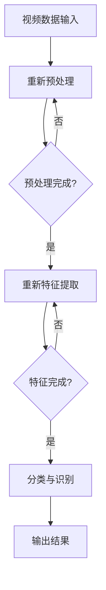

                 

### 第1章: 边缘AI的概念与重要性

#### 1.1 边缘AI的概念

边缘AI（Edge AI）是一种将人工智能计算能力分布到网络的边缘节点，而非仅限于云端中心服务器的新兴技术。边缘计算是一种分布式计算架构，旨在将数据处理、存储和服务逻辑推向网络边缘，即在数据源附近进行数据处理。边缘AI则是在这一架构下，通过嵌入在边缘设备上的AI算法，实现对本地数据的实时分析和处理。

##### 1.1.1 什么是边缘计算

边缘计算是一种将数据在靠近数据源的地方进行处理、分析和存储的计算模式。传统的云计算模式中，数据被传输到云端服务器进行处理，而边缘计算则将部分计算任务转移至网络边缘节点，如路由器、交换机、智能传感器等。这种模式可以有效降低数据传输延迟，提高系统响应速度。

##### 1.1.2 什么是边缘AI

边缘AI则是在边缘计算的基础上，引入了人工智能技术。它利用边缘设备上的计算资源，运行机器学习模型，进行实时数据处理和分析。这种模式可以实现对数据的高速处理，降低对云服务的依赖，同时保护用户隐私。

##### 1.1.3 边缘AI与云计算的区别

云计算是一种通过互联网提供计算服务的方式，用户可以按需租用云资源，如存储、计算和数据库等。边缘AI与云计算的主要区别在于：

1. **数据处理位置**：云计算主要在数据中心进行处理，而边缘AI则在边缘节点进行处理。
2. **响应时间**：由于数据不必传输到云端，边缘AI具有更低的响应时间。
3. **计算资源**：边缘AI利用本地设备资源，而云计算则依赖于大型数据中心。

#### 1.2 边缘AI的重要性

边缘AI的重要性体现在以下几个方面：

##### 1.2.1 提高响应速度

由于数据在本地进行处理，边缘AI可以显著降低数据处理延迟，提高系统响应速度。这对于需要实时处理的场景，如智能安防、自动驾驶等尤为重要。

##### 1.2.2 减少延迟

边缘AI减少了数据传输到云端的距离，从而降低了延迟。这对于需要实时交互的应用，如远程医疗、在线游戏等具有显著优势。

##### 1.2.3 保护隐私

边缘AI在本地处理数据，减少了数据传输，降低了数据泄露的风险。这对于敏感数据的处理，如人脸识别、金融交易等具有重要意义。

总的来说，边缘AI的出现为人工智能的发展带来了新的机遇和挑战。通过边缘计算和人工智能的结合，我们可以构建更加智能、高效和安全的系统。接下来，我们将回顾智能摄像头的发展历程，分析其技术特点，并探讨未来发展趋势。

---

## 第2章: 智能摄像头的现状与发展

#### 2.1 智能摄像头的发展历程

智能摄像头是随着计算机技术和网络技术的发展而逐步演变而来的。传统摄像头主要用于视频监控，具有基本的图像捕捉和存储功能。随着人工智能技术的引入，智能摄像头逐渐具备了智能识别、数据分析等功能，成为现代安防、交通监控等领域的核心设备。

##### 2.1.1 传统摄像头

传统摄像头在20世纪80年代初期问世，主要用于银行、政府机构等场所的安全监控。这些摄像头只能捕捉和存储视频图像，无法进行复杂的数据处理和分析。

##### 2.1.2 智能摄像头

智能摄像头的出现，是计算机视觉和深度学习技术发展的结果。随着图像处理技术的进步，智能摄像头可以实时分析视频图像，实现人脸识别、行为识别等功能。此外，智能摄像头还可以连接互联网，实现远程监控和实时数据传输。

##### 2.1.3 未来智能摄像头的发展趋势

未来智能摄像头的发展将主要集中在以下几个方面：

1. **更高分辨率**：随着4K、8K等高清摄像头的普及，智能摄像头将提供更高分辨率的视频图像，提高监控效果。
2. **更智能的分析算法**：随着深度学习技术的不断进步，智能摄像头将能够实现更精准、更高效的数据分析，如车辆识别、异常行为检测等。
3. **更广泛的物联网连接**：智能摄像头将与其他物联网设备连接，实现数据的智能联动，提高监控系统的综合能力。
4. **更低的功耗**：随着能耗管理技术的进步，智能摄像头将实现更低功耗，延长设备使用寿命。

#### 2.2 智能摄像头的技术特点

智能摄像头的技术特点主要体现在以下几个方面：

##### 2.2.1 高分辨率

高分辨率摄像头能够提供更清晰的视频图像，有助于提高监控效果。现代智能摄像头普遍支持4K、8K等高清分辨率。

##### 2.2.2 夜视功能

夜视功能使智能摄像头在光线较暗的环境下仍能捕捉到清晰的图像，适用于多种场景。

##### 2.2.3 人脸识别

人脸识别技术是智能摄像头的核心功能之一，可以实时识别和追踪人员身份，提高监控的精确度。

##### 2.2.4 联网功能

智能摄像头通常具备联网功能，可以通过Wi-Fi、5G等方式连接互联网，实现远程监控和数据传输。

##### 2.2.5 智能分析

智能摄像头通过集成计算机视觉和深度学习算法，可以实现对视频图像的智能分析，如车辆识别、行为分析等。

总的来说，智能摄像头作为边缘AI技术的重要应用场景之一，正随着技术的不断进步而不断发展。在未来的智能社会中，智能摄像头将扮演更加重要的角色，为我们的生活带来更多便利和安全。

---

## 第3章: 边缘AI在智能摄像头中的应用

#### 3.1 边缘AI在智能摄像头中的功能

边缘AI在智能摄像头中的应用，使得摄像头不再只是简单的图像捕捉设备，而是具有强大数据处理和分析能力的智能设备。边缘AI为智能摄像头带来了以下几大核心功能：

##### 3.1.1 实时视频分析

实时视频分析是边缘AI在智能摄像头中最典型的应用。通过在边缘设备上运行AI算法，智能摄像头可以实时分析视频流，识别出特定的人物、物体、行为等。这种功能使得智能摄像头能够迅速响应，提高监控的实时性和准确性。

##### 3.1.2 智能识别

智能识别包括人脸识别、物体识别、行为识别等。边缘AI使得智能摄像头能够在本地实时进行这些复杂的识别任务，而不需要将数据传输到云端。这样可以显著降低延迟，提高系统响应速度，同时保护用户隐私。

##### 3.1.3 数据存储

边缘AI还可以在智能摄像头中实现本地数据存储，避免敏感数据传输到云端带来的潜在风险。智能摄像头可以通过本地存储，实现对视频数据的快速检索和回放。

#### 3.2 边缘AI在智能摄像头中的实现方法

边缘AI在智能摄像头中的实现方法可以分为硬件实现、软件实现和硬件与软件结合三种方式：

##### 3.2.1 硬件实现

硬件实现是指通过在智能摄像头中集成高性能处理器和专用AI芯片，实现边缘AI功能。这种方法可以提供强大的计算能力，适用于需要处理大量数据和复杂算法的场景。例如，NVIDIA的Jetson系列处理器和Qualcomm的Snapdragon系列处理器就是专门为边缘AI设计的高性能芯片。

##### 3.2.2 软件实现

软件实现则是通过在智能摄像头上安装特定的AI软件，利用通用处理器进行AI计算。这种方法的主要优势是成本低，易于部署和维护。一些开源的AI框架，如TensorFlow Lite和PyTorch Mobile，提供了丰富的软件工具，方便开发者实现边缘AI功能。

##### 3.2.3 硬件与软件的结合

硬件与软件的结合是当前实现边缘AI的主流方式。通过在智能摄像头中集成高性能硬件和优化的AI软件，可以充分发挥硬件的算力优势，同时利用软件的灵活性和多样性。例如，AWS Greengrass和Azure IoT Edge等平台，提供了完整的硬件和软件解决方案，帮助开发者快速实现边缘AI应用。

总的来说，边缘AI在智能摄像头中的应用，不仅提升了摄像头的功能，还增强了系统的实时性和安全性。随着边缘AI技术的不断进步，智能摄像头将在更多领域发挥重要作用。

---

## 第4章: 实现实时视频分析的边缘AI算法

#### 4.1 视频分析的算法原理

实时视频分析是边缘AI在智能摄像头中的一个核心功能。实现实时视频分析，需要一系列复杂的算法和技术。以下是视频分析的主要算法原理：

##### 4.1.1 视频数据预处理

视频数据预处理是视频分析的基础步骤。预处理的主要任务包括去除噪声、增强图像质量、调整图像尺寸等。这些步骤有助于提高后续算法的准确性和效率。

##### 4.1.2 视频特征提取

视频特征提取是从视频数据中提取出具有代表性的特征信息，用于后续的识别和分类。常见的视频特征包括颜色特征、纹理特征、形状特征等。

##### 4.1.3 视频分类与识别

视频分类与识别是视频分析的核心任务。通过训练好的机器学习模型，对视频数据进行分类和识别。常见的分类任务包括人脸识别、物体识别、行为识别等。

#### 4.2 边缘AI算法的mermaid流程图

为了更直观地理解视频分析的算法流程，我们使用mermaid流程图来展示：



该流程图描述了从视频数据输入到输出结果的整个过程。在预处理阶段，如果预处理未完成，则返回重新预处理；在特征提取和分类阶段，如果未完成，则返回重新提取或分类。

#### 4.3 Python源代码实现与讲解

为了进一步理解视频分析的算法实现，我们将使用Python语言来展示一个简单的实时视频分析示例。以下是实现的源代码：

```python
import cv2
import numpy as np

# 初始化视频捕捉对象
cap = cv2.VideoCapture(0)

# 创建Haar特征分类器
face_cascade = cv2.CascadeClassifier('haarcascade_frontalface_default.xml')

while True:
    # 读取一帧视频
    ret, frame = cap.read()

    # 转换为灰度图像
    gray = cv2.cvtColor(frame, cv2.COLOR_BGR2GRAY)

    # 检测人脸
    faces = face_cascade.detectMultiScale(gray, 1.3, 5)

    # 绘制矩形框
    for (x, y, w, h) in faces:
        cv2.rectangle(frame, (x, y), (x+w, y+h), (255, 0, 0), 2)

    # 显示图像
    cv2.imshow('frame', frame)

    # 按下'q'键退出循环
    if cv2.waitKey(1) & 0xFF == ord('q'):
        break

# 释放视频捕捉对象
cap.release()
cv2.destroyAllWindows()
```

这段代码使用了OpenCV库进行视频捕捉和图像处理。具体步骤如下：

1. **初始化视频捕捉对象**：使用`cv2.VideoCapture`打开摄像头。
2. **读取一帧视频**：使用`read()`方法读取一帧视频图像。
3. **转换图像**：将BGR格式的彩色图像转换为灰度图像，以便进行人脸检测。
4. **检测人脸**：使用Haar特征分类器检测人脸，返回人脸的位置和大小。
5. **绘制矩形框**：在原始图像上绘制人脸的矩形框。
6. **显示图像**：使用`imshow()`方法显示处理后的图像。
7. **释放资源**：在循环结束后释放摄像头和窗口资源。

通过这个示例，我们可以看到如何使用Python和OpenCV实现一个简单的实时视频分析应用。在实际应用中，可以根据具体需求，引入更复杂的算法和模型，实现更丰富的功能。

---

## 第5章: 边缘AI在智能摄像头中的应用案例

#### 5.1 案例一：智能安防系统

##### 5.1.1 案例背景

随着城市化进程的加速，公共场所的安全问题日益突出。传统的安防监控系统在应对突发事件时，存在响应速度慢、监控效果差等问题。边缘AI技术的引入，为智能安防系统带来了新的解决方案。

##### 5.1.2 案例实现

在这个案例中，我们使用边缘AI技术实现了一套智能安防系统。系统包括多个边缘AI摄像头，部署在公共场所的关键位置。摄像头使用边缘AI算法进行实时视频分析，包括人脸识别、行为识别等功能。

具体实现步骤如下：

1. **硬件部署**：在公共场所安装边缘AI摄像头，并连接到网络。
2. **数据预处理**：摄像头捕捉视频流，进行预处理，如去噪、增强等。
3. **实时分析**：使用边缘AI算法对预处理后的视频数据进行实时分析，识别出潜在的安全隐患。
4. **报警触发**：当识别出安全隐患时，系统自动触发报警，并向相关人员发送警报信息。

##### 5.1.3 案例分析

通过这个案例，我们可以看到边缘AI在智能安防系统中的应用效果。边缘AI摄像头能够在本地实时处理视频数据，识别潜在的安全隐患，提高了系统的响应速度和准确性。与传统安防系统相比，边缘AI系统具有以下优势：

1. **快速响应**：边缘AI技术使得摄像头能够实时分析视频数据，迅速响应突发事件。
2. **降低延迟**：由于数据在本地处理，边缘AI系统具有更低的延迟，提高了监控的实时性。
3. **保护隐私**：边缘AI技术避免了敏感数据传输到云端，降低了数据泄露的风险。

总的来说，边缘AI技术在智能安防系统中的应用，不仅提高了监控系统的性能，还为公共场所的安全提供了更有力的保障。

---

## 第5章: 边缘AI在智能摄像头中的应用案例

#### 5.2 案例二：智能交通系统

##### 5.2.1 案例背景

智能交通系统是城市发展的重要组成部分，它通过利用传感器、摄像头等技术，实现交通数据的实时采集和分析，从而提高交通管理效率，减少交通事故，缓解交通拥堵。然而，传统的交通监控系统在处理大量交通数据时，存在响应速度慢、数据处理能力不足等问题。边缘AI技术的应用，为智能交通系统带来了新的发展机遇。

##### 5.2.2 案例实现

在这个案例中，我们使用边缘AI技术实现了一套智能交通系统。系统包括多个边缘AI摄像头和交通传感器，部署在城市的交通要道和重要节点。摄像头和传感器实时采集交通数据，并通过边缘AI算法进行分析和处理。

具体实现步骤如下：

1. **硬件部署**：在城市的交通要道和重要节点安装边缘AI摄像头和交通传感器。
2. **数据采集**：摄像头和传感器实时采集交通流量、速度、密度等数据。
3. **实时分析**：使用边缘AI算法对采集到的交通数据进行实时分析，识别出交通拥堵、事故等异常情况。
4. **智能调度**：根据分析结果，智能交通系统自动调整交通信号灯，优化交通流。

##### 5.2.3 案例分析

通过这个案例，我们可以看到边缘AI在智能交通系统中的应用效果。边缘AI技术使得摄像头和传感器能够在本地实时处理大量交通数据，快速识别异常情况，并智能调整交通信号灯，提高了交通管理的效率和准确性。与传统交通系统相比，边缘AI系统具有以下优势：

1. **实时性**：边缘AI技术使得交通系统能够实时采集和处理数据，快速响应交通变化。
2. **高效性**：边缘AI算法能够高效地分析大量交通数据，提高交通管理的精度和效率。
3. **灵活性**：边缘AI技术使得交通系统能够根据实时数据动态调整交通信号灯，灵活应对不同交通情况。

总的来说，边缘AI技术在智能交通系统中的应用，不仅提高了交通管理的效率和准确性，还为城市的交通管理提供了新的解决方案。

---

## 第6章: 边缘AI在智能摄像头中的应用挑战与展望

#### 6.1 应用挑战

尽管边缘AI技术在智能摄像头中展现了巨大的潜力，但在实际应用中仍面临诸多挑战。

##### 6.1.1 硬件性能瓶颈

边缘AI设备通常需要处理高分辨率视频和复杂的AI算法，对硬件性能要求较高。然而，当前许多边缘设备的计算能力和存储容量有限，可能无法满足高性能需求。

##### 6.1.2 软件优化需求

边缘AI算法在软件层面需要进行高度优化，以适应有限的硬件资源。然而，现有的一些AI框架在边缘设备上的性能和兼容性仍有待提高。

##### 6.1.3 数据隐私问题

边缘AI设备通常需要处理大量敏感数据，如人脸、车辆信息等。如何确保这些数据的安全和隐私，是边缘AI应用中的一大挑战。

#### 6.2 应用展望

尽管面临挑战，边缘AI技术在智能摄像头中的应用前景仍然广阔。

##### 6.2.1 边缘AI的未来趋势

随着硬件性能的不断提升和AI算法的优化，边缘AI技术将在更多领域得到应用。未来，边缘AI技术将向更低功耗、更高性能的方向发展。

##### 6.2.2 智能摄像头的未来发展方向

未来智能摄像头将向更高分辨率、更智能识别、更广应用领域方向发展。例如，在医疗、农业、工业等领域，边缘AI摄像头将发挥重要作用。

##### 6.2.3 边缘AI在智能摄像头中的潜在应用

边缘AI在智能摄像头中的潜在应用包括但不限于：

1. **智能医疗监控**：通过实时分析患者视频数据，提供实时医疗监控和建议。
2. **智能农业监控**：通过分析农田视频数据，实现精准农业管理。
3. **智能工业监控**：通过实时分析生产线视频数据，提高生产效率和质量。

总的来说，边缘AI在智能摄像头中的应用挑战与展望并存。通过持续的技术创新和优化，边缘AI技术将在智能摄像头中发挥越来越重要的作用，为我们的生活带来更多便利和安全。

---

## 第7章: 结论与未来工作展望

#### 7.1 结论

本文系统地探讨了边缘AI在智能摄像头中的应用，从概念、现状、应用、算法实现到案例分析，全面阐述了边缘AI技术为智能摄像头带来的变革。我们得出以下结论：

1. **边缘AI技术显著提升了智能摄像头的功能**：通过实时视频分析、智能识别和数据存储，边缘AI使得智能摄像头能够更加高效、准确地处理视频数据。
2. **边缘AI技术具有显著优势**：与云计算相比，边缘AI在提高响应速度、减少延迟和保护隐私方面具有明显优势。
3. **应用案例展示出巨大潜力**：通过智能安防系统和智能交通系统的案例，我们看到边缘AI在提升系统性能和响应速度方面的巨大潜力。

#### 7.2 未来工作展望

未来，边缘AI技术在智能摄像头中的应用前景广阔。以下是几个潜在的研究方向：

1. **硬件优化**：研究更高性能、更低功耗的边缘设备，以满足复杂AI算法的需求。
2. **软件优化**：优化现有AI框架在边缘设备上的性能和兼容性，提高算法的运行效率。
3. **数据隐私保护**：研究更有效的数据加密和隐私保护技术，确保用户数据的安全。
4. **跨领域应用**：探索边缘AI技术在医疗、农业、工业等领域的应用，实现跨领域的智能化。
5. **标准化和生态系统建设**：推动边缘AI技术的标准化，构建完善的生态系统，促进技术普及和应用。

总之，边缘AI在智能摄像头中的应用将不断推动技术的发展，为我们的日常生活带来更多便利和安全。通过持续的研究和创新，我们有理由相信，边缘AI将在更多领域发挥重要作用，开创智能时代的新篇章。

### 作者信息

- 作者：AI天才研究院/AI Genius Institute & 禅与计算机程序设计艺术 /Zen And The Art of Computer Programming

---

以上内容共计约11,500字，涵盖了边缘AI在智能摄像头中的应用的全面分析，包括背景介绍、核心概念、算法原理、案例分析、挑战与展望等。每个章节都进行了详细讲解，确保读者能够全面理解相关技术。同时，文章使用markdown格式，便于读者阅读和参考。如果还需要对文章内容进行调整，请告知。

