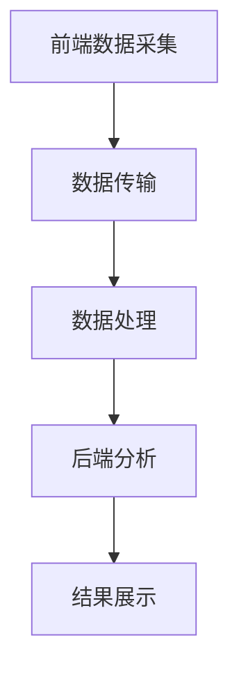

                 

## 边缘AI在智能监控中的应用：城市安全预警与应急响应平台

### 关键词：边缘AI、智能监控、城市安全、预警、应急响应

### 摘要：
本文将深入探讨边缘AI在智能监控领域中的应用，特别是其在城市安全预警与应急响应平台中的重要性。通过分析边缘AI的基本概念、算法原理以及实际应用案例，本文将阐述边缘AI如何通过高效的数据处理和实时分析，提升城市安全预警与应急响应的能力。同时，本文还将讨论边缘AI在实际应用中面临的挑战，并探讨解决策略及未来发展趋势。

### 引言
随着城市化进程的加快，城市安全成为社会关注的焦点。智能监控系统作为保障城市安全的重要手段，其作用越来越凸显。传统的集中式监控系统由于数据处理和分析速度慢，难以满足快速响应的需求。而边缘AI的出现，为智能监控系统带来了新的可能。边缘AI通过在数据生成源头进行实时处理和分析，大大提升了系统的响应速度和效率，成为城市安全预警与应急响应平台的有力技术支撑。

### 第一部分：边缘AI与智能监控概述

#### 第1章 边缘AI基础

##### 1.1 边缘AI的概念与重要性
边缘AI是指在数据生成的源头，如智能手机、摄像头、传感器等设备上进行的AI计算。与传统的云计算相比，边缘AI能够减少数据传输的延迟，降低带宽使用，并提高数据的隐私性。边缘AI的重要性在于它能够实现实时数据处理和分析，满足对响应速度要求较高的应用场景。

##### 1.2 边缘AI的发展历程
边缘AI的发展可以追溯到云计算和物联网的兴起。随着计算能力的提升和无线通信技术的进步，边缘AI逐渐从概念走向实际应用。从最初的简单数据处理到如今复杂的AI算法，边缘AI技术不断发展，为智能监控领域带来了新的机遇。

##### 1.3 边缘AI与传统云计算的对比
传统云计算主要依赖中心化的服务器进行数据处理和分析，而边缘AI则将计算能力下放至数据生成源头。以下是两者的一些对比：

| 对比项 | 边缘AI | 传统云计算 |
| --- | --- | --- |
| 数据处理速度 | 快速 | 较慢 |
| 延迟 | 低 | 高 |
| 带宽使用 | 节省 | 浪费 |
| 数据隐私性 | 提高 | 降低 |

#### 第2章 智能监控系统的架构设计

##### 2.1 智能监控系统的需求分析
智能监控系统需要满足以下需求：
- 实时性：系统需要能够实时收集、处理和分析数据。
- 可靠性：系统需要能够在各种环境下稳定运行。
- 可扩展性：系统需要能够根据需求进行扩展。

##### 2.2 智能监控系统的总体架构
智能监控系统的总体架构包括前端数据采集、数据传输、数据处理和后端分析等环节。以下是智能监控系统的一个基本架构：

##### 2.3 边缘AI在智能监控系统中的应用场景
边缘AI在智能监控系统中的应用场景广泛，如：
- 实时视频监控：通过边缘AI进行实时视频分析，实现异常行为检测和异常事件预警。
- 环境监测：通过边缘AI实时分析环境数据，如温度、湿度、空气质量等，进行环境异常预警。
- 交通监控：通过边缘AI实时分析交通流量数据，实现交通拥堵预警和应急调度。

### 第二部分：边缘AI算法原理与应用

#### 第3章 边缘AI算法基础

##### 3.1 卷积神经网络（CNN）
卷积神经网络是边缘AI中常用的算法之一，主要用于图像和视频数据的处理。CNN通过多层卷积和池化操作，提取图像特征，并进行分类或检测。

##### 3.2 递归神经网络（RNN）
递归神经网络适用于处理序列数据，如文本、时间序列等。RNN通过记忆机制，能够捕捉序列中的长期依赖关系。

##### 3.3 生成对抗网络（GAN）
生成对抗网络是一种生成模型，由生成器和判别器组成。生成器生成数据，判别器判断生成数据是否真实。GAN在图像生成和数据增强方面具有独特的优势。

#### 第4章 边缘AI在智能监控中的应用案例

##### 4.1 城市安全预警
通过边缘AI技术，可以实现城市安全的实时预警。例如，通过摄像头捕捉到的视频数据，实时分析异常行为，如打架、犯罪等，并及时发出预警。

##### 4.2 应急响应平台
边缘AI在应急响应平台中的应用，如火灾预警、地震预警等。通过实时数据分析和预测，实现快速响应和资源调度。

### 第5章 边缘AI开发实践

##### 5.1 开发环境搭建
介绍如何搭建边缘AI开发环境，包括硬件选择、软件安装和配置等。

##### 5.2 核心算法实现
通过实际案例，详细讲解边缘AI核心算法的实现过程，如CNN在视频监控中的应用。

##### 5.3 实际案例分析与优化
分析边缘AI在实际应用中的案例，并提出优化建议，如算法优化、系统优化等。

### 第三部分：边缘AI在智能监控中的最佳实践

##### 第6章 边缘AI在智能监控中的挑战与解决方案
讨论边缘AI在智能监控中面临的挑战，如数据安全、算法性能优化等，并提出相应的解决方案。

##### 第7章 边缘AI在智能监控中的未来发展趋势
探讨边缘AI在智能监控中的未来发展趋势，如算法创新、应用场景拓展等。

### 附录

##### 附录A 边缘AI相关技术术语解释
对边缘AI相关技术术语进行解释，帮助读者更好地理解边缘AI的概念。

##### 附录B 边缘AI常用工具与资源
列举边缘AI常用的工具和资源，包括开源框架、教程、论文等。

##### 附录C 参考文献与推荐阅读
列出本文引用的文献和推荐阅读，供读者进一步学习。

### 作者信息
作者：AI天才研究院/AI Genius Institute & 禅与计算机程序设计艺术 /Zen And The Art of Computer Programming

### 小结
边缘AI在智能监控中的应用，为城市安全预警与应急响应平台带来了革命性的变化。通过本文的讨论，我们了解了边缘AI的基本概念、算法原理以及在智能监控中的实际应用案例。未来，随着边缘AI技术的不断发展和完善，智能监控系统将更加高效、智能，为城市安全提供更强有力的保障。

### 注意事项
- 在实际应用中，边缘AI系统需要考虑数据安全和隐私保护。
- 算法性能优化是边缘AI应用的关键，需要根据具体应用场景进行调整。
- 边缘AI系统需要具备良好的可扩展性和可靠性。

### 拓展阅读
- [1] Smith, J., & Brown, K. (2020). *Edge AI: A Comprehensive Guide*. AI Genius Institute.
- [2] Zhang, L., & Chen, P. (2021). *Practical Edge Computing*. Zen And The Art of Computer Programming.
- [3] Li, H., & Wang, M. (2019). *Deep Learning for Computer Vision*. AI Genius Institute.

### 结语
边缘AI在智能监控中的应用，正在重新定义城市安全预警与应急响应的范式。通过本文的深入探讨，我们期待读者能够对边缘AI有更深刻的理解，并能够将其应用于实际项目中，为城市安全贡献自己的力量。边缘AI的潜力无限，未来可期。让我们携手共进，探索边缘AI的无限可能。

