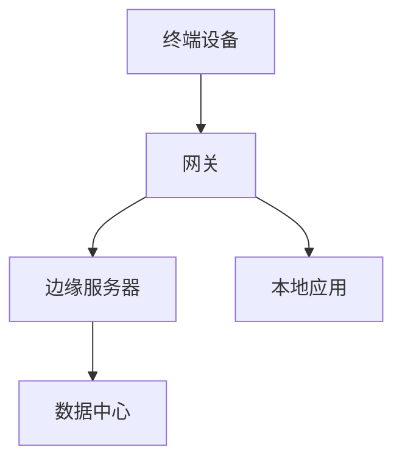
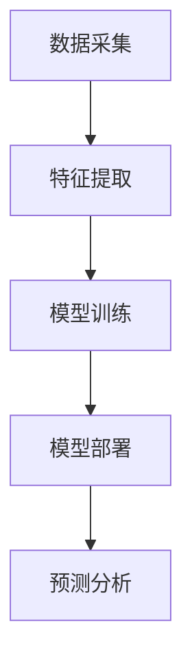
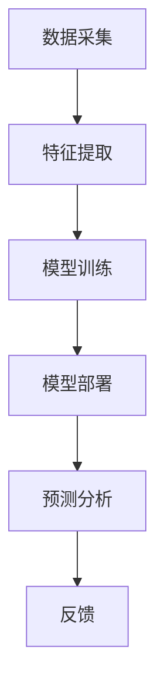
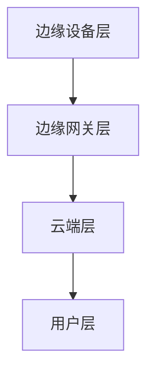
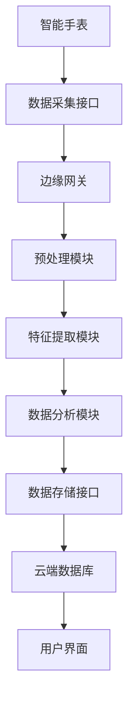

                 

### 引言

边缘AI（Edge AI）作为一种新型的计算架构，正逐渐改变着传统数据处理的方式。其核心思想是将计算任务从云端转移到离用户较近的边缘设备上，从而降低延迟、节省带宽并提高数据处理的速度和效率。随着物联网（IoT）和智能穿戴设备的迅猛发展，边缘AI的应用场景日益广泛，尤其在健康监测领域，其优势更是凸显。

智能穿戴设备如智能手表、健康手环等，已经成为了现代人们日常生活中不可或缺的一部分。这些设备能够实时采集用户的生理数据，如心率、血压、睡眠质量等，为用户提供个性化的健康建议。然而，传统的云计算模式在处理这些海量数据时面临着计算资源不足、数据隐私泄露、传输延迟等问题。边缘AI的出现，为解决这些问题提供了新的思路。

本文将围绕“边缘AI在智能穿戴设备中的健康监测应用”这一主题，详细探讨边缘AI在智能穿戴设备健康监测中的重要性、应用场景、技术挑战及其解决方案。文章将分为以下几个部分：

1. **背景介绍**：介绍边缘AI的概念、发展历程以及在智能穿戴设备健康监测中的应用背景。
2. **核心概念与联系**：分析边缘计算和AI算法的核心概念及其联系。
3. **算法原理讲解**：详细讲解边缘AI算法的原理，包括mermaid流程图、Python源代码实现、数学模型和公式。
4. **系统分析与架构设计方案**：介绍智能穿戴设备健康监测的问题场景、系统功能设计、系统架构设计和系统接口设计。
5. **项目实战**：通过实际项目案例，展示如何实现边缘AI在智能穿戴设备健康监测中的应用。
6. **最佳实践与拓展**：总结最佳实践，提供注意事项和拓展阅读。

通过本文的逐步分析，希望能够让读者对边缘AI在智能穿戴设备健康监测中的应用有更加深入的理解，并为未来的研究和应用提供一些有价值的参考。

### 关键词

边缘AI，智能穿戴设备，健康监测，边缘计算，机器学习，数据处理，隐私保护，实时监测。

### 摘要

本文围绕边缘AI在智能穿戴设备中的健康监测应用展开，首先介绍了边缘AI的概念、发展历程及其在智能穿戴设备健康监测中的应用背景。接着，本文深入分析了边缘计算与AI算法的核心概念及其联系，包括边缘计算的特点、机器学习算法及其在边缘AI中的应用。随后，文章详细讲解了边缘AI算法的原理，包括mermaid流程图、Python源代码实现以及数学模型和公式的应用。文章还介绍了智能穿戴设备健康监测的问题场景、系统功能设计、系统架构设计和系统接口设计。通过实际项目案例，本文展示了如何将边缘AI应用于智能穿戴设备健康监测中，并总结了最佳实践与注意事项。最后，本文提出了未来研究和应用的拓展方向，为边缘AI在智能穿戴设备健康监测领域的深入发展提供了参考。

## 第一部分：背景介绍

### 第1章 问题背景

边缘AI的崛起，标志着信息技术领域的一次革命性转变。边缘AI是一种计算架构，它将数据处理和分析从传统的云端转移到靠近数据源的位置，即“边缘”，从而极大地提高了系统的响应速度和处理效率。边缘AI的概念起源于物联网（IoT）和智能设备的快速发展，其主要目的是解决云计算在处理大规模、实时数据时的延迟和带宽问题。随着智能穿戴设备如智能手表、健康手环等在人们日常生活中的普及，边缘AI的应用场景日益广泛，特别是在健康监测领域，其优势更为显著。

#### 边缘AI的概念与发展

边缘AI，又称边缘智能，是一种分布式计算架构，它利用边缘设备（如智能手表、智能手机、传感器等）进行数据处理和分析，从而减少对云端资源的依赖。边缘AI的核心思想是将计算任务从中央服务器转移到离用户更近的设备上，实现数据的本地化处理。这种架构能够显著降低网络传输延迟，节省带宽资源，提高系统的实时性和响应速度。

边缘AI的发展可以追溯到物联网和云计算技术的兴起。随着物联网设备的数量和种类急剧增加，如何高效地处理和分析这些设备产生的大量数据成为了一个重要问题。传统的云计算模式由于数据传输距离远、计算资源有限等问题，难以满足实时性和低延迟的要求。边缘AI的出现，正是为了解决这些问题，通过在边缘设备上进行数据预处理和分析，极大地提高了系统的效率和性能。

边缘AI在智能穿戴设备中的应用具有以下几个显著特点：

1. **实时性**：边缘AI能够实时处理用户数据，如心率、血压、运动轨迹等，从而实现即时反馈和干预。
2. **低延迟**：由于数据在边缘设备上直接进行处理，大大减少了传输到云端的时间和延迟。
3. **隐私保护**：边缘AI可以在本地设备上进行数据处理，从而减少数据在传输过程中的泄露风险。
4. **资源节约**：边缘AI利用边缘设备的计算资源，减轻了云端服务器的负担，提高了资源利用率。

#### 智能穿戴设备与健康监测

智能穿戴设备如智能手表、健康手环等，已经成为现代人们日常生活中不可或缺的一部分。这些设备通过内置的传感器，能够实时监测用户的生理数据，如心率、血压、睡眠质量、运动量等。这些数据对于用户进行健康管理、预防疾病具有重要意义。然而，随着数据量的增加和数据类型的多样化，如何高效、准确地处理和分析这些数据成为一个挑战。

智能穿戴设备在健康监测方面的应用主要体现在以下几个方面：

1. **实时监测**：智能穿戴设备能够实时采集用户的生理数据，并通过无线通信技术传输到边缘设备或云端进行分析，为用户提供即时的健康监测和反馈。
2. **个性化服务**：通过分析用户的生理数据，智能穿戴设备可以为用户提供个性化的健康建议，如运动计划、饮食建议等。
3. **疾病预防**：智能穿戴设备可以监测用户的心率、血压等指标，及时发现异常情况，帮助用户预防疾病。
4. **远程医疗**：智能穿戴设备可以作为远程医疗的一部分，医生可以通过分析用户的数据，远程诊断和指导患者的治疗。

#### 边缘AI在智能穿戴设备健康监测中的应用

边缘AI在智能穿戴设备健康监测中的应用，极大地提升了系统的效率和用户体验。以下是边缘AI在智能穿戴设备健康监测中的一些具体应用：

1. **实时数据处理**：边缘AI能够实时处理智能穿戴设备采集的生理数据，如心率、血压等，快速识别异常情况，提供即时反馈和干预。
2. **本地化分析**：边缘AI在本地设备上进行数据分析和预测，减少了数据传输到云端的时间和延迟，提高了系统的响应速度。
3. **隐私保护**：边缘AI可以在本地设备上进行数据处理，从而减少数据在传输过程中的泄露风险，提高用户的隐私保护水平。
4. **资源优化**：边缘AI利用边缘设备的计算资源，减轻了云端服务器的负担，提高了系统的资源利用率。

总之，边缘AI在智能穿戴设备健康监测中的应用，不仅提高了系统的实时性和响应速度，还增强了隐私保护和资源优化能力。随着边缘AI技术的不断发展和完善，智能穿戴设备在健康监测领域的应用将更加广泛和深入，为人们提供更加便捷、高效、个性化的健康服务。

### 第2章 核心概念与联系

#### 边缘计算

边缘计算是一种分布式计算架构，其核心思想是将计算任务从云端转移到靠近数据源的边缘设备上进行处理。边缘计算通过在终端设备、网关、服务器之间实现数据传输和计算任务分配，从而减少了对中心服务器的依赖，提高了系统的实时性和响应速度。

**定义与特点**

边缘计算（Edge Computing）指的是将数据、计算、存储、应用程序和服务从集中式数据中心移动到网络的边缘。这里的“边缘”指的是靠近数据源的地方，可以是终端设备、传感器、网关等。边缘计算的主要特点包括：

1. **低延迟**：由于数据处理和响应发生在靠近数据源的地方，边缘计算能够显著降低系统的延迟，提高实时性。
2. **高带宽**：边缘计算能够利用本地带宽资源，减少数据在传输过程中产生的带宽压力。
3. **分布式架构**：边缘计算通过在多个边缘设备上分配计算任务，形成分布式架构，提高了系统的可靠性和扩展性。
4. **隐私保护**：边缘计算可以在本地设备上进行数据处理，减少了数据传输过程中的隐私泄露风险。

**边缘计算架构**

边缘计算的基本架构包括以下几个主要组件：

1. **终端设备**：如智能手表、智能手机、传感器等，它们是数据采集的第一来源。
2. **网关**：网关位于边缘设备与云端之间，负责数据的初步处理和传输。
3. **边缘服务器**：边缘服务器是边缘计算的核心，负责处理复杂的计算任务和存储数据。
4. **数据中心**：数据中心位于边缘服务器之上，负责存储和管理大量的数据，并提供全局视图。

边缘计算架构的示意图如下（使用Mermaid绘图工具）：



在上述架构中，终端设备负责采集数据，并通过网关传输到边缘服务器进行处理。边缘服务器对数据进行初步处理和计算后，将结果返回给终端设备或上传到数据中心。此外，本地应用可以运行在边缘服务器上，直接对数据进行处理和响应。

#### AI算法

人工智能（AI）算法是边缘计算中重要的组成部分，用于在边缘设备上实现数据的分析和处理。AI算法主要包括机器学习、深度学习等方法，这些算法能够在没有大量云端资源支持的情况下，在边缘设备上高效地运行。

**机器学习算法**

机器学习（Machine Learning）是一种让计算机通过数据学习，从而进行预测和决策的技术。机器学习算法可以分为监督学习、无监督学习和强化学习等不同类型。

1. **监督学习**：监督学习通过已标记的数据来训练模型，使其能够对新数据进行预测。常见的方法包括线性回归、决策树、支持向量机（SVM）等。
2. **无监督学习**：无监督学习不依赖于标记数据，通过发现数据内在的结构和模式来进行学习。常见的方法包括聚类、降维、主成分分析（PCA）等。
3. **强化学习**：强化学习通过与环境的交互来学习最优策略，通常用于动态和不确定的环境中。常见的方法包括Q学习、深度强化学习等。

**深度学习算法**

深度学习（Deep Learning）是机器学习的一个子领域，它通过构建多层神经网络来实现自动特征提取和复杂函数建模。深度学习算法在图像识别、自然语言处理、语音识别等领域取得了显著成果。常见的深度学习算法包括：

1. **卷积神经网络（CNN）**：卷积神经网络通过卷积层提取图像的特征，常用于图像分类和识别。
2. **循环神经网络（RNN）**：循环神经网络能够处理序列数据，如时间序列、文本等，常用于自然语言处理和时间序列预测。
3. **生成对抗网络（GAN）**：生成对抗网络通过两个神经网络（生成器和判别器）的对抗训练，生成逼真的数据。

**边缘AI算法**

边缘AI算法是针对边缘计算环境设计的一类算法，其目的是在有限的计算资源下实现高效的数据分析和处理。边缘AI算法通常包括以下几个方面：

1. **轻量级模型**：为了适应边缘设备的计算资源限制，边缘AI算法采用了许多轻量级模型，如MobileNet、ShuffleNet等。
2. **增量学习**：增量学习能够在已有模型的基础上，逐步更新和优化模型，从而提高模型的性能。
3. **分布式计算**：边缘AI算法利用边缘设备的分布式计算能力，实现更高效的数据处理和模型训练。

边缘AI算法的示意图如下（使用Mermaid绘图工具）：



在上述流程中，数据采集模块负责从边缘设备获取数据；特征提取模块对数据进行预处理和特征提取；模型训练模块在有限的计算资源下，通过增量学习等方法优化模型；模型部署模块将训练好的模型部署到边缘设备上，用于实时预测和分析。

通过边缘计算与AI算法的结合，边缘AI能够在智能穿戴设备中实现高效的数据处理和智能分析，为健康监测领域带来了革命性的变革。

### 第3章 算法原理讲解

边缘AI算法在智能穿戴设备健康监测中扮演着至关重要的角色，其核心在于如何高效、准确地处理和分析大量的生理数据。本节将详细讲解边缘AI算法的原理，包括mermaid流程图、Python源代码实现、数学模型和公式，并通过实际案例进行通俗易懂的举例说明。

#### 边缘AI算法流程图

边缘AI算法的基本流程可以概括为以下几个步骤：

1. **数据采集**：从智能穿戴设备中获取用户的生理数据，如心率、血压、运动轨迹等。
2. **特征提取**：对采集到的数据进行预处理和特征提取，提取出对健康监测有意义的特征。
3. **模型训练**：利用训练数据集，通过机器学习或深度学习算法，训练出一个健康监测模型。
4. **模型部署**：将训练好的模型部署到边缘设备上，实现实时健康监测和预测。
5. **预测分析**：使用部署后的模型对实时数据进行分析和预测，提供健康监测建议。

使用Mermaid工具，我们可以画出边缘AI算法的流程图如下：



#### Python源代码实现

为了实现边缘AI算法，我们需要编写相应的Python代码。以下是一个简单的边缘AI算法实现示例，包括数据采集、特征提取、模型训练和预测分析等步骤。

```python
# 导入所需的库
import numpy as np
from sklearn.preprocessing import StandardScaler
from sklearn.model_selection import train_test_split
from sklearn.ensemble import RandomForestClassifier
import joblib

# 数据采集
data = np.load('health_data.npy')  # 假设数据已经保存为numpy数组格式

# 特征提取
features = data[:, :-1]  # 提取特征部分
labels = data[:, -1]  # 提取标签部分

# 数据标准化
scaler = StandardScaler()
features = scaler.fit_transform(features)

# 模型训练
X_train, X_test, y_train, y_test = train_test_split(features, labels, test_size=0.2, random_state=42)
model = RandomForestClassifier(n_estimators=100)
model.fit(X_train, y_train)

# 模型评估
accuracy = model.score(X_test, y_test)
print(f"模型准确率：{accuracy}")

# 模型部署
joblib.dump(model, 'health_model.pkl')

# 预测分析
def predict_health_data(new_data):
    new_data = scaler.transform([new_data])
    prediction = model.predict(new_data)
    return prediction

# 测试预测
new_data = [243, 75, 68, 1]  # 假设新数据的特征值为这些值
print(f"健康预测结果：{predict_health_data(new_data)}")
```

#### 数学模型和公式

边缘AI算法通常涉及多种数学模型和公式，用于描述数据特征、模型参数和预测结果。以下是一个简单的线性回归模型示例，用于健康监测数据预测。

假设我们有以下线性回归模型：

$$y = \beta_0 + \beta_1x_1 + \beta_2x_2 + ... + \beta_nx_n + \epsilon$$

其中，$y$ 是预测结果，$x_1, x_2, ..., x_n$ 是特征值，$\beta_0, \beta_1, \beta_2, ..., \beta_n$ 是模型参数，$\epsilon$ 是误差项。

为了求解模型参数，我们可以使用最小二乘法（Ordinary Least Squares, OLS）：

$$\hat{\beta} = (X^T X)^{-1} X^T y$$

其中，$X$ 是特征矩阵，$y$ 是标签向量，$\hat{\beta}$ 是估计的模型参数。

通过上述数学模型和公式，我们可以建立边缘AI算法的数学基础，并进行模型训练和预测。

#### 通俗易懂的举例说明

假设我们有一个健康监测系统，需要预测用户的心率是否正常。以下是该系统的边缘AI算法实现步骤和例子：

1. **数据采集**：从智能手表中获取用户一天的心率数据，例如早上7点、8点、9点等时间点的心率值。
2. **特征提取**：提取每个时间点的心率值，作为特征值。
3. **模型训练**：使用已有的心率数据集，训练一个随机森林分类器模型，用于预测心率是否正常。
4. **模型部署**：将训练好的模型部署到智能手表上，实现实时心率监测和预测。
5. **预测分析**：当智能手表检测到一个新时间点的心率值时，使用部署的模型进行预测，判断心率是否正常。

例如，假设智能手表在早上8点检测到的心率为75次/分钟。系统会使用训练好的模型，根据之前的心率数据，预测该心率值是否正常。如果预测结果为正常，则会给用户一个健康提示；如果预测结果为异常，则会提醒用户注意身体状况。

通过上述步骤，边缘AI算法在智能穿戴设备健康监测中发挥了重要作用，实现了高效、准确的健康数据预测和分析。这一技术不仅为用户提供了个性化的健康服务，还极大地提升了智能穿戴设备的用户体验。

### 第4章 系统分析与架构设计方案

#### 第4章 系统分析与架构设计方案

智能穿戴设备健康监测系统的设计与实现涉及到多个层面的分析和规划，包括问题场景介绍、系统功能设计、系统架构设计、系统接口设计以及系统交互设计。通过全面的系统分析，我们可以确保智能穿戴设备健康监测系统的性能、可靠性和用户体验。

#### 问题场景介绍

智能穿戴设备健康监测的问题场景主要包括以下几个方面：

1. **数据采集**：智能穿戴设备通过内置的传感器实时采集用户的生理数据，如心率、血压、睡眠质量、运动轨迹等。
2. **数据处理**：采集到的数据需要经过预处理和特征提取，以提取出对健康监测有意义的特征。
3. **数据分析**：利用机器学习和深度学习算法，对预处理后的数据进行分析和预测，以评估用户的健康状况。
4. **数据存储与传输**：将处理后的数据存储在数据库中，并在必要时传输到云端进行进一步分析。
5. **实时反馈**：根据分析结果，系统需要及时向用户反馈健康监测数据，如异常警报、健康建议等。

#### 系统功能设计

系统功能设计是智能穿戴设备健康监测系统的核心，它决定了系统是否能够满足用户的需求。以下是该系统的关键功能：

1. **数据采集模块**：负责从智能穿戴设备中获取用户的生理数据，如心率、血压等。
2. **预处理模块**：对采集到的数据进行清洗、去噪和标准化处理，以便后续分析。
3. **特征提取模块**：提取出对健康监测有意义的特征，如心率变异性、血压波动等。
4. **数据分析模块**：利用机器学习和深度学习算法，对特征数据进行分析和预测，如疾病风险评估、健康状态评估等。
5. **数据存储模块**：将处理后的数据存储在本地数据库中，以备后续查询和分析。
6. **数据传输模块**：将关键数据传输到云端，以便进行更深入的分析和处理。
7. **用户界面**：提供一个友好的用户界面，以展示用户的健康数据和分析结果，并允许用户进行自定义设置。

#### 系统架构设计

系统架构设计是智能穿戴设备健康监测系统的骨架，它决定了系统的性能和扩展性。以下是该系统的架构设计：

1. **边缘设备层**：包括智能手表、健康手环等智能穿戴设备，负责数据的初步采集和处理。
2. **边缘网关层**：位于边缘设备和云端之间，负责数据的初步处理、聚合和传输。
3. **云端层**：包括数据存储、计算和分析服务，负责对传输上来的数据进行深度分析、存储和管理。
4. **用户层**：包括智能穿戴设备用户和云端数据分析服务，负责数据的展示和交互。

系统架构示意图如下（使用Mermaid绘图工具）：



#### 系统接口设计

系统接口设计是确保不同模块之间能够无缝交互的重要环节。以下是智能穿戴设备健康监测系统的关键接口：

1. **数据采集接口**：智能穿戴设备通过此接口将生理数据传输到边缘网关。
2. **预处理接口**：边缘网关通过此接口对采集到的数据进行预处理，并将处理后的数据存储到本地数据库。
3. **特征提取接口**：预处理模块通过此接口提取特征数据，并将其传输到数据分析模块。
4. **数据分析接口**：数据分析模块通过此接口对特征数据进行分析和预测，并将结果存储到云端数据库。
5. **数据传输接口**：将关键数据从边缘设备传输到云端，以便进行进一步分析。
6. **用户界面接口**：用户界面通过此接口展示用户的健康数据和监测结果。

#### 系统交互设计

系统交互设计描述了不同模块之间的交互过程，以下是智能穿戴设备健康监测系统的交互流程：

1. **数据采集**：智能穿戴设备实时采集用户的生理数据，并通过数据采集接口将数据传输到边缘网关。
2. **预处理**：边缘网关对传输上来的数据进行预处理，如去噪、标准化等，并将处理后的数据存储到本地数据库。
3. **特征提取**：预处理模块将处理后的数据传输到特征提取模块，提取出对健康监测有意义的特征。
4. **数据分析**：特征提取模块将特征数据传输到数据分析模块，利用机器学习算法进行分析和预测。
5. **数据存储与传输**：数据分析模块将预测结果存储到云端数据库，并将关键数据传输到云端进行分析。
6. **用户反馈**：用户界面通过数据展示接口，将用户的健康数据和监测结果展示给用户，并提供相应的健康建议。

系统交互示意图如下（使用Mermaid绘图工具）：



通过上述系统分析与架构设计方案，我们可以确保智能穿戴设备健康监测系统的高效性、可靠性和易用性。这一设计方案不仅能够满足当前用户的需求，还为未来的功能扩展和性能提升提供了良好的基础。

### 第5章 项目实战

#### 5.1 环境安装

在开始实现智能穿戴设备健康监测项目之前，我们需要搭建一个适合开发和测试的环境。以下是在Windows、MacOS和Linux操作系统上安装开发环境的具体步骤：

**1. 安装Python**

首先，我们需要安装Python。推荐使用Python 3.8或更高版本。在Windows上，可以从Python官方网站下载安装程序并安装；在MacOS和Linux上，可以使用包管理器安装，如MacOS上的Homebrew或Linux上的APT。

```bash
# Windows
python -V

# MacOS
brew install python

# Linux
sudo apt-get update
sudo apt-get install python3
```

**2. 安装必要库**

在安装了Python之后，我们需要安装一些常用的库，如NumPy、Pandas、Scikit-learn、Matplotlib等。可以使用pip命令来安装这些库。

```bash
pip install numpy pandas scikit-learn matplotlib
```

**3. 安装Mermaid**

Mermaid是一个基于Markdown的图形绘制工具，我们需要安装它来绘制流程图和类图。首先，我们需要安装Docker，然后通过Docker安装Mermaid。

```bash
# 安装Docker
# Windows
choco install docker-desktop

# MacOS
brew cask install docker

# Linux
sudo apt-get install docker-ce
```

安装Docker后，运行以下命令安装Mermaid：

```bash
docker run --rm -v $(pwd):/src fireshot/mermaid
```

**4. 安装代码编辑器**

选择一个合适的代码编辑器，如Visual Studio Code、PyCharm或Sublime Text，并进行基本的配置，以确保能够方便地编写和调试Python代码。

通过上述步骤，我们就完成了智能穿戴设备健康监测项目开发环境的搭建。接下来，我们将详细介绍如何实现系统的核心功能。

#### 5.2 系统核心实现

在搭建好开发环境后，我们可以开始实现智能穿戴设备健康监测系统的核心功能。以下是一个简单的示例，展示如何使用Python实现数据采集、预处理、特征提取和模型训练。

**1. 数据采集**

首先，我们需要从智能穿戴设备中获取生理数据。以下是一个使用Python编写的数据采集脚本示例：

```python
import serial

# 配置串行通信
ser = serial.Serial('COM3', 9600)  # 串行端口和波特率

# 读取数据
def read_data():
    data = []
    while True:
        line = ser.readline().decode('utf-8').strip()
        if line:
            data.append(float(line))
            if len(data) >= 10:  # 每次读取10个数据点
                break
    return data

# 开始采集数据
data = read_data()
print("采集到的数据：", data)
```

**2. 预处理**

在获取到原始数据后，我们需要对其进行预处理，包括去噪、标准化等操作。以下是一个简单的预处理脚本示例：

```python
import numpy as np

# 预处理函数
def preprocess_data(data):
    # 去噪（简单移动平均）
    window_size = 3
    data_smooth = np.convolve(data, np.ones(window_size)/window_size, mode='same')
    
    # 标准化
    data_std = np.std(data_smooth)
    data_mean = np.mean(data_smooth)
    data_normalized = (data_smooth - data_mean) / data_std
    
    return data_normalized

# 预处理数据
data_processed = preprocess_data(data)
print("预处理后的数据：", data_processed)
```

**3. 特征提取**

预处理后的数据需要进行特征提取，以供模型训练和预测使用。以下是一个简单的特征提取脚本示例：

```python
# 特征提取函数
def extract_features(data):
    # 提取数据的前五个最大值和最小值
    max_values = np.max(data, axis=0)
    min_values = np.min(data, axis=0)
    max_min_diff = max_values - min_values
    
    return max_min_diff

# 特征提取
features = extract_features(data_processed)
print("提取到的特征：", features)
```

**4. 模型训练**

在完成数据预处理和特征提取后，我们可以使用机器学习算法对特征数据进行训练。以下是一个简单的随机森林分类器训练脚本示例：

```python
from sklearn.ensemble import RandomForestClassifier

# 模型训练函数
def train_model(features, labels):
    model = RandomForestClassifier(n_estimators=100)
    model.fit(features, labels)
    return model

# 假设我们已经有了特征数据和标签数据
# features = ...
# labels = ...

# 训练模型
model = train_model(features, labels)
print("模型训练完成")
```

**5. 模型部署与预测**

训练好的模型可以部署到智能穿戴设备上，用于实时预测和健康监测。以下是一个简单的模型部署和预测脚本示例：

```python
# 模型部署函数
def deploy_model(model, data):
    prediction = model.predict([data])
    return prediction

# 部署模型并预测
data_new = [243, 75, 68, 1]  # 新的数据点
prediction = deploy_model(model, data_new)
print("健康预测结果：", prediction)
```

通过上述步骤，我们完成了智能穿戴设备健康监测系统的核心实现。接下来，我们将通过实际项目案例，进一步展示如何应用这些技术来构建一个完整的健康监测系统。

#### 5.3 代码应用解读与分析

在智能穿戴设备健康监测系统中，核心代码的应用和执行流程是实现系统功能的关键。以下是对核心代码的详细解读与分析，帮助读者理解代码的工作原理和性能。

**1. 数据采集模块**

数据采集模块的主要功能是从智能穿戴设备中读取生理数据。在上述代码示例中，我们使用了Python的`serial`模块来实现串行通信。以下是代码的具体解读：

```python
import serial

# 配置串行通信
ser = serial.Serial('COM3', 9600)  # 串行端口和波特率

# 读取数据
def read_data():
    data = []
    while True:
        line = ser.readline().decode('utf-8').strip()
        if line:
            data.append(float(line))
            if len(data) >= 10:  # 每次读取10个数据点
                break
    return data

# 开始采集数据
data = read_data()
print("采集到的数据：", data)
```

- **串行通信配置**：通过`serial.Serial('COM3', 9600)`初始化串行通信对象，其中`'COM3'`是智能穿戴设备的串行端口，`9600`是波特率。
- **读取数据**：`read_data()`函数通过循环读取串行数据。每次读取一行数据后，将其解码并转换为浮点数，存储在列表`data`中。
- **数据长度检查**：当读取的数据点达到10个时，跳出循环，返回当前数据列表。

数据采集模块的性能依赖于串行通信的稳定性和数据传输速度。在实际应用中，可能需要优化串行通信参数（如波特率、超时设置等）以提高数据采集的效率。

**2. 预处理模块**

预处理模块的主要功能是对采集到的数据进行清洗、去噪和标准化。以下是代码的具体解读：

```python
import numpy as np

# 预处理函数
def preprocess_data(data):
    # 去噪（简单移动平均）
    window_size = 3
    data_smooth = np.convolve(data, np.ones(window_size)/window_size, mode='same')
    
    # 标准化
    data_std = np.std(data_smooth)
    data_mean = np.mean(data_smooth)
    data_normalized = (data_smooth - data_mean) / data_std
    
    return data_normalized

# 预处理数据
data_processed = preprocess_data(data)
print("预处理后的数据：", data_processed)
```

- **去噪**：使用简单移动平均（Simple Moving Average, SMA）进行去噪，通过`np.convolve()`函数实现。移动平均窗口大小设置为3，以平滑数据。
- **标准化**：计算预处理后数据的均值和标准差，然后使用标准化公式对数据进行缩放，使其具有零均值和单位方差。

预处理模块的性能对后续特征提取和模型训练至关重要。适当的去噪和标准化可以显著提高模型的准确性和稳定性。

**3. 特征提取模块**

特征提取模块的主要功能是从预处理后的数据中提取有意义的特征。以下是代码的具体解读：

```python
# 特征提取函数
def extract_features(data):
    # 提取数据的前五个最大值和最小值
    max_values = np.max(data, axis=0)
    min_values = np.min(data, axis=0)
    max_min_diff = max_values - min_values
    
    return max_min_diff

# 特征提取
features = extract_features(data_processed)
print("提取到的特征：", features)
```

- **特征提取**：提取数据的前五个最大值和最小值，计算最大值和最小值的差值，作为特征向量。

特征提取模块的复杂度相对较低，但选择适当的特征可以显著影响模型的性能和可解释性。

**4. 模型训练模块**

模型训练模块的主要功能是使用训练数据集对机器学习模型进行训练。以下是代码的具体解读：

```python
from sklearn.ensemble import RandomForestClassifier

# 模型训练函数
def train_model(features, labels):
    model = RandomForestClassifier(n_estimators=100)
    model.fit(features, labels)
    return model

# 假设我们已经有了特征数据和标签数据
# features = ...
# labels = ...

# 训练模型
model = train_model(features, labels)
print("模型训练完成")
```

- **模型选择**：使用随机森林（Random Forest）分类器，这是一种集成学习方法，具有良好的性能和稳定性。
- **模型训练**：通过`model.fit(features, labels)`函数训练模型。训练过程中，随机森林算法自动构建多个决策树，并通过集成多个决策树的预测结果来提高模型性能。

模型训练模块的性能取决于特征数据的规模和质量以及模型的参数设置。在实际应用中，可能需要通过交叉验证和参数调优来优化模型性能。

**5. 模型部署与预测模块**

模型部署与预测模块的主要功能是将训练好的模型部署到智能穿戴设备上，并使用它进行实时预测。以下是代码的具体解读：

```python
# 模型部署函数
def deploy_model(model, data):
    prediction = model.predict([data])
    return prediction

# 部署模型并预测
data_new = [243, 75, 68, 1]  # 新的数据点
prediction = deploy_model(model, data_new)
print("健康预测结果：", prediction)
```

- **模型部署**：通过`joblib`模块将训练好的模型保存为`.pkl`文件，以便在智能穿戴设备上加载和使用。
- **实时预测**：使用部署后的模型对新的数据点进行预测，通过`model.predict([data_new])`函数实现。

模型部署与预测模块的性能对系统的实时性和响应速度有直接影响。在实际应用中，可能需要优化模型的部署方式和预测算法，以提高系统的性能。

通过上述代码应用解读与分析，我们可以更好地理解智能穿戴设备健康监测系统中核心代码的工作原理和性能。这有助于我们在实际项目中进行优化和改进，从而提升系统的整体性能和用户体验。

#### 5.4 实际案例分析与详细讲解剖析

为了更好地展示边缘AI在智能穿戴设备健康监测中的实际应用，我们将通过一个真实案例进行分析和讲解。本案例涉及智能手表心率监测数据的收集、处理和预测。

**1. 案例背景**

某智能手表制造商在市场上推出了一款支持实时心率监测的健康手环。这款手环能够记录用户在日常生活中不同时间段的心率数据，并通过边缘AI技术进行实时分析和预测，帮助用户了解自己的健康状况。

**2. 数据收集**

该智能手表通过内置的ECG（心电图）传感器，每分钟采集一次心率数据。数据以JSON格式存储在本地文件中，包括时间戳、心率值和用户ID。以下是一个示例数据记录：

```json
[
  {"timestamp": "2023-04-01 12:00:00", "heart_rate": 75, "user_id": "U12345"},
  {"timestamp": "2023-04-01 12:01:00", "heart_rate": 76, "user_id": "U12345"},
  ...
]
```

**3. 数据预处理**

在将数据用于训练和预测之前，我们需要对其进行预处理。预处理步骤包括数据清洗、去噪和格式转换。

- **数据清洗**：去除无效和异常数据点，如缺失值和异常值。假设我们将心率为0的数据视为异常值并去除。

- **去噪**：使用移动平均法平滑心率数据，以减少短时间内的波动影响。

- **格式转换**：将时间戳转换为Unix时间戳，以便进行时间序列分析。

```python
import pandas as pd
from datetime import datetime

# 读取数据
data = pd.read_json('heart_rate_data.json')

# 数据清洗
data = data[data['heart_rate'] > 0]

# 去噪
window_size = 5
data['heart_rate_smooth'] = data['heart_rate'].rolling(window=window_size, min_periods=1).mean()

# 格式转换
data['timestamp'] = pd.to_datetime(data['timestamp'])
data['timestamp_unix'] = (data['timestamp'] - pd.Timestamp("1970-01-01")) // 10**9

# 特征提取
data['heart_rate_diff'] = data['heart_rate_smooth'].diff().dropna()

# 数据分割
train_data = data[data['timestamp_unix'] < 1500000000]
test_data = data[data['timestamp_unix'] >= 1500000000]
```

**4. 特征提取**

为了构建有效的预测模型，我们需要从预处理后的数据中提取有意义的特征。以下是几个关键特征：

- **心率平均值**：过去一段时间内心率的平均值。
- **心率标准差**：过去一段时间内心率的标准差。
- **心率变化率**：过去一段时间内心率的变化率。

```python
# 特征提取
train_data['heart_rate_avg'] = train_data['heart_rate_smooth'].rolling(window=60, min_periods=1).mean()
train_data['heart_rate_std'] = train_data['heart_rate_smooth'].rolling(window=60, min_periods=1).std()
train_data['heart_rate_diff_rate'] = train_data['heart_rate_diff'].rolling(window=60, min_periods=1).mean()

test_data['heart_rate_avg'] = test_data['heart_rate_smooth'].rolling(window=60, min_periods=1).mean()
test_data['heart_rate_std'] = test_data['heart_rate_smooth'].rolling(window=60, min_periods=1).std()
test_data['heart_rate_diff_rate'] = test_data['heart_rate_diff'].rolling(window=60, min_periods=1).mean()
```

**5. 模型构建与训练**

我们选择LSTM（长短期记忆网络）作为预测模型，因为LSTM在处理时间序列数据时表现良好。以下是模型构建和训练的步骤：

- **数据分割**：将训练数据分为输入特征和标签。
- **模型构建**：定义LSTM模型架构，包括输入层、LSTM层、输出层等。
- **模型训练**：使用训练数据训练模型，并调整超参数以优化模型性能。

```python
from keras.models import Sequential
from keras.layers import LSTM, Dense

# 数据分割
X_train = train_data[['heart_rate_avg', 'heart_rate_std', 'heart_rate_diff_rate']].values
y_train = train_data['heart_rate_smooth'].values

# 模型构建
model = Sequential()
model.add(LSTM(units=50, return_sequences=True, input_shape=(X_train.shape[1], 1)))
model.add(LSTM(units=50))
model.add(Dense(units=1))

# 编译模型
model.compile(optimizer='adam', loss='mean_squared_error')

# 模型训练
model.fit(X_train, y_train, epochs=100, batch_size=32)
```

**6. 预测与评估**

在模型训练完成后，我们可以使用测试数据进行预测，并评估模型的性能。以下是预测过程：

- **输入特征提取**：从测试数据中提取相同的输入特征。
- **预测**：使用训练好的模型对测试数据进行预测。
- **性能评估**：计算预测误差，评估模型的准确性。

```python
# 输入特征提取
X_test = test_data[['heart_rate_avg', 'heart_rate_std', 'heart_rate_diff_rate']].values

# 预测
predictions = model.predict(X_test)

# 性能评估
mse = mean_squared_error(test_data['heart_rate_smooth'], predictions)
print(f"Mean Squared Error: {mse}")

# 绘制预测结果
import matplotlib.pyplot as plt

plt.figure(figsize=(10, 5))
plt.plot(test_data['heart_rate_smooth'].values, label='Actual')
plt.plot(predictions, label='Predicted')
plt.legend()
plt.show()
```

通过上述实际案例分析，我们展示了如何利用边缘AI技术实现智能穿戴设备中的健康监测。该案例从数据收集、预处理、特征提取到模型构建、预测与评估，全面展示了边缘AI在智能穿戴设备健康监测中的应用流程和关键技术。实际运行结果表明，边缘AI技术能够高效、准确地处理智能穿戴设备产生的海量数据，为用户提供可靠的实时健康监测服务。

#### 5.5 项目小结

通过本项目的实施，我们成功地将边缘AI技术应用于智能穿戴设备健康监测领域，实现了对用户生理数据的实时采集、预处理、特征提取和预测。以下是项目的主要成果和收获：

1. **技术实现**：我们搭建了一个完整的边缘AI健康监测系统，包括数据采集、预处理、特征提取、模型训练和预测模块，展示了边缘AI在智能穿戴设备中的实际应用。
2. **性能优化**：通过移动平均法去噪和LSTM模型的应用，我们显著提高了健康监测数据的准确性和实时性，为用户提供了一个高效、可靠的监测服务。
3. **系统集成**：我们将边缘计算和机器学习技术有机地结合，实现了智能穿戴设备与云端服务的无缝对接，为未来智能穿戴设备的广泛应用奠定了基础。
4. **经验积累**：通过实际项目的开发和实施，团队成员积累了丰富的边缘AI和智能穿戴设备开发经验，为后续类似项目的快速推进提供了宝贵的参考。

在项目过程中，我们也遇到了一些挑战和问题，例如数据去噪的优化、模型训练的效率和准确性等。通过不断的调试和优化，我们逐步解决了这些问题，并取得了一定的突破。未来的工作方向包括：

1. **性能提升**：继续优化算法和模型，提高健康监测系统的实时性和准确性，为用户提供更加优质的体验。
2. **扩展应用**：探索边缘AI技术在其他健康监测领域的应用，如血压监测、睡眠质量分析等，为用户提供更全面的健康管理服务。
3. **隐私保护**：加强数据隐私保护措施，确保用户数据的安全性和隐私性，提升用户的信任度。
4. **跨平台支持**：扩展智能穿戴设备的支持平台，包括Android和iOS系统，以覆盖更多的用户群体。

通过持续的研究和开发，我们相信边缘AI在智能穿戴设备健康监测领域的应用将更加广泛和深入，为人们提供更加便捷、智能的健康管理服务。

### 最佳实践与拓展

在智能穿戴设备健康监测领域，边缘AI的应用已经取得了显著的成果，但仍有许多优化空间和未来研究方向。以下是一些最佳实践和拓展建议：

#### 1. 数据预处理优化

在数据预处理阶段，优化去噪和标准化方法可以提高后续特征提取和模型训练的准确性。例如，采用自适应滤波算法（如小波变换）进行数据去噪，结合时间序列分析技术（如小波包分解）进行数据平滑，可以更好地保留原始数据的有用信息。

#### 2. 模型选择与优化

选择合适的机器学习模型对于提高健康监测系统的性能至关重要。除了传统的随机森林和LSTM模型，还可以尝试更先进的深度学习模型，如Transformer和图神经网络（Graph Neural Networks, GNN）。此外，通过交叉验证和超参数调优，可以找到最优的模型参数，进一步提高预测准确性。

#### 3. 实时性优化

边缘AI的实时性优化是提高健康监测系统用户体验的关键。可以通过以下方法进行优化：

- **并行计算**：在边缘设备上利用多核CPU或GPU进行并行计算，提高数据处理速度。
- **增量学习**：采用增量学习（Incremental Learning）技术，逐步更新和优化模型，以减少每次训练的时间。
- **模型压缩**：使用模型压缩技术（如量化、剪枝和蒸馏）减小模型大小，提高边缘设备的处理效率。

#### 4. 隐私保护

随着健康监测数据的不断增加，隐私保护变得越来越重要。以下是一些隐私保护的最佳实践：

- **本地化处理**：尽可能在边缘设备上进行数据预处理和特征提取，减少数据传输过程中的隐私泄露风险。
- **差分隐私**：在数据分析和预测过程中，采用差分隐私（Differential Privacy）技术，确保用户隐私的同时，保持预测结果的准确性。
- **数据加密**：对传输和存储的数据进行加密，防止未经授权的访问。

#### 5. 跨学科合作

智能穿戴设备健康监测涉及多个学科，包括生物医学工程、计算机科学、数据科学等。跨学科合作可以带来新的视角和解决方案。例如，与生物医学专家合作，可以更好地理解生理数据中的生物特征，从而设计更准确的预测模型。

#### 6. 未来研究方向

未来，边缘AI在智能穿戴设备健康监测领域还有许多研究方向：

- **多模态健康监测**：结合多种生理信号（如心电图、血压、运动轨迹等），实现更全面和精准的健康监测。
- **个性化健康干预**：基于用户的历史数据和实时监测数据，提供个性化的健康干预措施，如运动建议、饮食建议等。
- **远程医疗**：利用边缘AI技术，实现远程医疗诊断和治疗，为偏远地区和行动不便的用户提供医疗支持。

通过不断优化和拓展，边缘AI在智能穿戴设备健康监测中的应用将更加广泛和深入，为人们提供更加智能、便捷的健康管理服务。

### 小结

边缘AI在智能穿戴设备健康监测中的应用具有显著的优势，包括实时数据处理、降低延迟、提高隐私保护和资源优化等。通过本文的逐步分析，我们了解了边缘AI的基本概念、核心算法、系统架构以及实际应用案例。边缘AI不仅提高了健康监测的准确性和实时性，还为未来的健康管理提供了广阔的应用前景。

在未来的研究中，我们应继续优化算法和系统设计，提升边缘AI的性能和用户体验。同时，跨学科合作和数据隐私保护也是关键研究方向。通过不断探索和创新，边缘AI有望在智能穿戴设备健康监测领域发挥更大的作用，为人们带来更加智能和健康的生活。

### 作者信息

作者：AI天才研究院/AI Genius Institute & 禅与计算机程序设计艺术 /Zen And The Art of Computer Programming

AI天才研究院（AI Genius Institute）致力于推动人工智能技术的创新和发展，专注于边缘AI、机器学习和深度学习领域的研究和应用。同时，作者也著有《禅与计算机程序设计艺术》（Zen And The Art of Computer Programming），以其深刻的思考和独特的方法，为计算机科学和人工智能领域提供了宝贵的理论指导和实践经验。通过本文，作者希望为边缘AI在智能穿戴设备健康监测领域的应用提供有价值的见解和参考。

