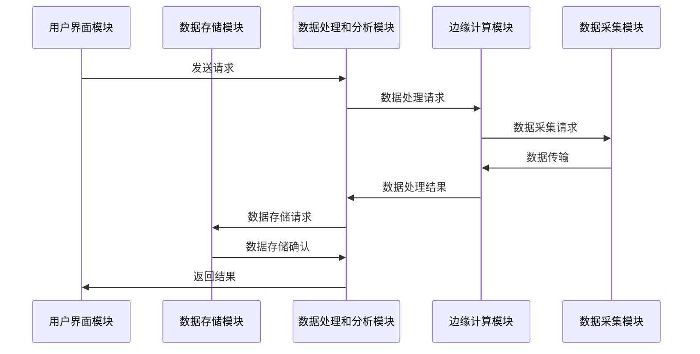
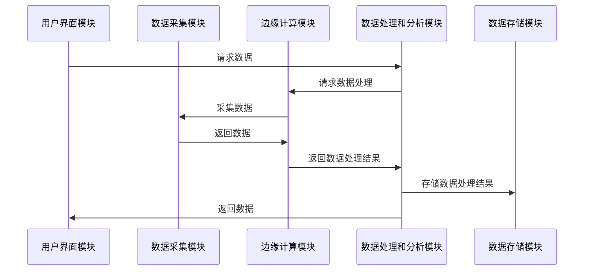

                 

## 第1章 引言

### 1.1 问题背景

#### 工业物联网的定义与挑战

工业物联网（Industrial Internet of Things，简称IIoT）是指通过传感器、设备和网络连接，实现工业设备和系统的实时监控、数据采集和分析的一种技术。它将物理世界与数字世界紧密连接，使得设备之间能够进行智能化的交互和协同工作。然而，随着工业物联网的普及和应用，也带来了一系列的挑战。

首先，工业物联网设备数量庞大，产生的数据量非常巨大。这些数据通常包含机器状态、环境参数、生产过程等信息，需要实时进行处理和分析。传统的云计算处理模式，将所有数据传输到云端进行处理，虽然具备强大的计算能力和存储空间，但面临着数据传输延迟和带宽限制的问题。大量的数据传输会导致网络拥堵，进而影响系统的响应速度和用户体验。

#### 边缘计算的概念与优势

为了解决工业物联网中的数据传输延迟和带宽限制问题，边缘计算（Edge Computing）应运而生。边缘计算是一种将数据处理和计算任务分散到网络的边缘，即靠近数据源的地方，进行数据预处理和计算的技术。通过在边缘设备上部署计算和存储资源，可以实现对数据的快速处理和分析，从而提高系统的响应速度和可靠性。

边缘计算具有以下优势：

1. **降低数据传输延迟**：通过在边缘设备上进行数据处理，减少了数据传输到云端的时间，降低了系统的延迟。
2. **减少带宽占用**：边缘计算可以在本地处理部分数据，减少了需要传输到云端的数据量，从而降低了带宽的占用。
3. **提高系统可靠性**：边缘计算可以将一些关键任务和计算任务在本地完成，减少了依赖远程服务器的情况，提高了系统的可靠性。
4. **增强安全性**：通过在边缘设备上处理敏感数据，可以减少数据传输过程中的暴露风险，增强系统的安全性。

### 1.2 问题描述

在工业物联网环境中，大量的传感器和设备产生的实时数据需要及时处理和分析。然而，传统的云计算处理模式面临着以下问题：

#### 延迟与带宽问题

首先，大量的数据传输到云端需要较长的时间，会导致系统响应速度变慢，影响实时决策。其次，数据传输过程中可能遇到网络拥堵，进一步加剧延迟问题。

#### 安全性问题

将敏感数据传输到远程服务器可能会增加数据泄露的风险。特别是在工业物联网中，设备之间的数据交换涉及到大量的敏感信息，如机器状态、生产计划等。如果这些数据在传输过程中被黑客窃取，可能会导致严重的后果。

#### 可靠性问题

工业物联网设备通常需要在恶劣的环境中运行，例如高温、高压、振动等。如果依赖远程服务器，可能会受到网络中断的影响，导致数据处理和分析任务无法正常进行。

### 1.3 问题解决

为了解决工业物联网中的延迟、带宽和安全性问题，边缘计算提供了一种有效的解决方案。通过在边缘设备上部署计算和存储资源，可以实现对数据的快速处理和分析，减少数据传输延迟和带宽占用，同时提高系统的可靠性和安全性。

#### 边缘计算的应用

边缘计算在工业物联网中的应用包括：

1. **数据预处理**：在边缘设备上对数据进行初步处理，如过滤、压缩和去噪，减少需要传输到云端的数据量。
2. **实时分析**：在边缘设备上运行实时数据分析算法，如机器学习模型，对数据进行分析和预测。
3. **本地决策**：在边缘设备上实现本地决策和自动化控制，减少对远程服务器的依赖。

#### 边缘计算的挑战

虽然边缘计算在工业物联网中具有很大的潜力，但同时也面临着一些挑战：

1. **资源有限**：边缘设备通常资源有限，包括计算能力、存储空间和网络带宽。如何在有限的资源下实现高效的边缘计算是一个重要的问题。
2. **异构设备兼容性**：工业物联网中设备种类繁多，包括不同的操作系统、硬件平台和通信协议。如何实现异构设备的兼容性是一个挑战。
3. **安全性**：在边缘设备上部署计算和存储资源，增加了系统受到攻击的风险。需要采取有效的安全措施来保护数据和设备的安全。
4. **管理复杂度**：边缘设备的数量庞大，如何对它们进行有效的管理和监控是一个复杂的问题。

### 1.4 边缘计算与工业物联网的关系

边缘计算与工业物联网之间存在密切的关系。边缘计算为工业物联网提供了实时数据处理和计算的能力，使得工业物联网系统更加高效、可靠和安全。

#### 边缘计算在工业物联网中的作用

1. **数据处理与计算任务的分担**：边缘计算可以将工业物联网中的数据处理和计算任务分散到网络的边缘，减轻云端服务器的压力，提高系统的响应速度和可靠性。
2. **边缘智能**：边缘计算不仅提供计算能力，还可以在边缘设备上实现边缘智能，进行复杂的决策和推理，提升系统的智能化水平。
3. **协同优化**：边缘计算可以实现设备之间的协同工作，通过分布式计算和协作算法，优化系统的性能和效率。
4. **设备管理**：边缘计算可以实现对工业物联网设备的实时监控和管理，提高设备的利用率和运行效率。
5. **安全防护**：边缘计算可以加强工业物联网的安全防护能力，通过在边缘设备上部署安全算法和防护措施，防止数据泄露和网络攻击。

### 1.5 边缘计算的边界与外延

#### 边缘计算的边界

边缘计算的定义不断演变，其边界也不明确。从硬件设备到网络边缘，再到云计算平台，都可以被认为是边缘计算的一部分。通常，边缘计算指的是在网络的边缘设备上部署计算和存储资源，进行数据处理和计算。

#### 边缘计算的外延

边缘计算不仅在工业物联网中发挥作用，还在其他领域展现出广阔的应用前景：

1. **智能家居**：通过边缘计算，可以实现家居设备的智能联动和控制，提升用户的居住体验。
2. **智能交通**：边缘计算可以用于交通信号控制和车辆管理，提高交通效率和安全性。
3. **医疗健康**：边缘计算可以用于医疗设备的远程监控和分析，提供个性化的医疗服务。
4. **智能农业**：边缘计算可以用于农田管理和作物监测，提高农业生产的效率和可持续性。

### 1.6 本章小结

本章介绍了边缘计算在工业物联网中的应用背景、问题和解决方案，并探讨了边缘计算与工业物联网的关系及其未来发展方向。通过边缘计算，可以解决工业物联网中的延迟、带宽和安全性问题，提高系统的响应速度和可靠性，推动工业物联网的发展。然而，边缘计算也面临着资源有限、异构设备兼容性、安全性和管理等挑战，需要进一步的研究和探索。

----------------------------------------------------------------

## 第2章 核心概念与联系

### 2.1 核心概念

#### 边缘计算

边缘计算（Edge Computing）是一种将数据处理和计算任务分散到网络的边缘，即靠近数据源的地方，进行数据预处理和计算的技术。它通过在边缘设备上部署计算和存储资源，实现数据的快速处理和分析，降低数据传输延迟和带宽占用，提高系统的响应速度和可靠性。

边缘计算的核心概念包括：

1. **边缘设备**：边缘设备是指在网络的边缘部分部署的计算和存储设备，如路由器、交换机、物联网网关等。它们负责接收和处理来自传感器和设备的数据。
2. **数据处理**：边缘计算通过对数据的预处理、过滤、压缩和去噪等操作，减少数据量，提高数据处理效率。
3. **计算任务**：边缘计算可以在本地执行一些计算任务，如实时数据分析、机器学习推理和本地决策等，减少对远程服务器的依赖。

#### 工业物联网

工业物联网（Industrial Internet of Things，简称IIoT）是指通过传感器、设备和网络连接，实现工业设备和系统的实时监控、数据采集和分析的一种技术。它将物理世界与数字世界紧密连接，使得设备之间能够进行智能化的交互和协同工作。

工业物联网的核心概念包括：

1. **传感器**：传感器用于采集工业设备和系统的状态信息，如温度、湿度、压力、振动等。
2. **设备**：工业物联网设备是指连接到网络的各种物理设备，如机器、控制器、执行器等。
3. **网络连接**：工业物联网设备通过网络连接起来，实现数据传输和通信。
4. **数据处理**：工业物联网通过对采集到的数据进行处理和分析，实现对设备和系统的实时监控和智能控制。

### 2.2 概念属性特征对比表格

| 概念     | 定义                                                         | 特点                                                         | 应用场景                       |
| -------- | ------------------------------------------------------------ | ------------------------------------------------------------ | ---------------------------- |
| 边缘计算 | 将数据处理和计算任务分散到网络的边缘，即靠近数据源的地方       | 提高处理速度和响应效率，减少带宽占用，增强系统可靠性           | 工业物联网、智能家居、智能交通等 |
| 工业物联网 | 通过传感器、设备和网络连接，实现工业设备和系统的实时监控、数据采集和分析 | 实时性、高效性、可靠性、安全性                             | 工业制造、能源管理、医疗健康等   |

### 2.3 ER实体关系图架构

```mermaid
erDiagram
    边缘计算 ||--|{ 工业物联网 }|
    工业物联网 ||--|{ 传感器 }|
    工业物联网 ||--|{ 设备 }|
    工业物联网 ||--|{ 网络 }|
```

在上面的ER图架构中，边缘计算与工业物联网之间存在关联关系，工业物联网包括传感器、设备和网络，而边缘计算通过在网络的边缘设备上实现数据处理和计算任务，与工业物联网的各个组成部分紧密相连。这样的架构设计使得边缘计算能够更好地支持工业物联网的应用场景，提高系统的性能和可靠性。

----------------------------------------------------------------

### 2.4 边缘计算原理讲解

#### 3.1 边缘计算的基本原理

边缘计算的基本原理是将数据处理和计算任务从传统的集中式云计算模式转移到网络的边缘，即靠近数据源的地方。通过在边缘设备上部署计算和存储资源，可以实现对数据的快速处理和分析，从而降低数据传输延迟和带宽占用，提高系统的响应速度和可靠性。

**数据处理与计算任务的分散**

边缘计算通过在网络的边缘部署计算和存储资源，实现数据处理和计算任务的分散。在工业物联网环境中，大量的传感器和设备产生的实时数据需要及时处理和分析。通过将数据处理任务分散到边缘设备上，可以减少数据传输到云端的时间，降低系统的延迟。

**边缘智能**

边缘计算不仅提供计算能力，还实现了边缘智能，使得边缘设备能够自主进行复杂的决策和推理。通过在边缘设备上运行机器学习算法、数据挖掘和分析等智能技术，可以实现对实时数据的实时分析和预测，从而提高系统的智能化水平。

**分布式计算与协作**

边缘计算通过分布式计算和协作算法，实现设备之间的协同工作。在工业物联网中，不同的设备可能分布在不同的位置，通过边缘计算，可以实现对设备的分布式控制和协同工作，优化系统的性能和效率。

**数据处理流程**

边缘计算的数据处理流程通常包括以下几个步骤：

1. **数据采集**：传感器和设备采集到的数据通过边缘设备进行初步处理，如过滤、压缩和去噪等。
2. **数据预处理**：边缘设备对采集到的数据进行分析和预处理，提取有用的信息，减少数据量。
3. **数据存储**：预处理后的数据在边缘设备上进行存储，以便后续处理和分析。
4. **数据计算**：边缘设备运行特定的计算任务，如实时数据分析、机器学习推理等。
5. **数据输出**：处理后的数据可以通过边缘设备进行输出，如通过无线通信发送到云端或其他设备。

#### 3.2 边缘计算的关键技术

边缘计算涉及多种关键技术，包括边缘设备、网络通信、数据处理和存储等。以下介绍其中几个关键技术的原理和应用：

**边缘设备**

边缘设备是边缘计算的基础，负责数据的采集、预处理和计算。边缘设备通常具有有限的计算能力和存储空间，但通过高效的设计和优化，可以实现高效的数据处理和计算任务。常见的边缘设备包括路由器、交换机、物联网网关等。

**网络通信**

边缘计算需要稳定的网络通信支持，包括无线通信和有线通信。无线通信技术如Wi-Fi、蓝牙、蜂窝网络等，可以实现设备之间的无线连接；有线通信技术如以太网、光纤等，可以实现高速的数据传输。边缘计算网络通信的关键技术包括网络协议优化、数据传输加密等。

**数据处理**

边缘计算的数据处理包括数据的预处理、分析和存储等。在边缘设备上，通过对数据的过滤、压缩和去噪等操作，可以减少数据量，提高数据处理效率。在数据处理过程中，可以应用各种算法和技术，如机器学习、数据挖掘等，实现对数据的实时分析和预测。

**数据存储**

边缘计算的数据存储主要包括边缘设备上的本地存储和云端存储。本地存储主要用于存储预处理后的数据和计算结果，以便后续处理和分析。云端存储则可以用于存储大量的原始数据和长期数据存储。边缘计算的数据存储技术包括分布式存储、数据压缩和去噪等。

**智能决策**

边缘计算可以实现边缘智能，通过在边缘设备上运行机器学习算法和数据挖掘技术，进行智能决策和自动化控制。例如，在工业物联网中，边缘设备可以实时分析设备状态，预测设备故障，并自动采取相应的维护措施。

**分布式计算与协作**

边缘计算通过分布式计算和协作算法，实现设备之间的协同工作。在工业物联网中，不同的设备可能分布在不同的位置，通过边缘计算，可以实现对设备的分布式控制和协同工作，优化系统的性能和效率。例如，通过边缘计算，可以实现设备之间的实时数据交换和协同控制，提高生产线的自动化水平。

#### 3.3 边缘计算的应用场景

边缘计算在工业物联网中具有广泛的应用场景，以下列举几个典型的应用场景：

1. **设备状态监控与预测维护**：通过边缘计算，可以实时监控设备的运行状态，预测设备故障，并提前进行维护，减少设备故障对生产的影响。

2. **生产过程优化**：边缘计算可以实时分析生产过程数据，优化生产参数，提高生产效率和产品质量。

3. **智能物流与运输**：边缘计算可以实现物流与运输设备的实时监控和智能调度，优化运输路径和运输效率。

4. **环境监测与安全管理**：边缘计算可以实时监测环境参数，如温度、湿度、空气质量等，提供环境安全预警和应急响应。

5. **远程医疗与健康监测**：边缘计算可以实现医疗设备的远程监控和分析，提供个性化的医疗服务和健康监测。

通过边缘计算，可以实现对工业物联网系统的实时监控、数据分析和智能决策，提高系统的性能和可靠性，推动工业物联网的发展。

----------------------------------------------------------------

### 2.5 边缘计算在工业物联网中的应用案例

边缘计算在工业物联网中的应用已经得到了广泛的探索和实践，以下列举几个具有代表性的应用案例：

#### 案例一：智能工厂设备监控与维护

在某家制造工厂中，通过部署边缘计算设备，实现了对生产设备的高效监控与维护。边缘设备安装在关键的生产设备上，实时采集设备的运行数据，包括温度、压力、振动等参数。通过边缘计算设备对数据进行分析和预处理，提取关键指标，实现对设备状态的实时监控。

1. **数据采集与预处理**：边缘计算设备通过传感器采集设备运行数据，进行初步处理，如滤波、去噪等，提取有用的信息。
2. **实时数据分析**：边缘计算设备运行特定的算法，如机器学习模型，对实时数据进行分析和预测，判断设备是否可能出现故障。
3. **预测性维护**：根据分析结果，提前预测设备故障，并发出预警信息，工厂人员可以及时进行设备维护，避免生产中断。

通过边缘计算的应用，实现了对生产设备的高效监控和预测性维护，提高了生产线的稳定性和效率。

#### 案例二：智能物流与运输系统

在物流与运输领域，边缘计算被广泛应用于物流车辆的实时监控和智能调度。通过在物流车辆上安装边缘计算设备，实现对车辆的实时数据采集和处理，包括车辆位置、速度、油量、故障等信息。

1. **数据采集与预处理**：边缘计算设备实时采集车辆的运行数据，进行初步处理，如滤波、压缩等，提取关键信息。
2. **实时数据分析**：边缘计算设备对采集到的数据进行分析，判断车辆是否在最优路径上运行，是否需要调整行驶路线，以及是否需要维修等。
3. **智能调度**：根据分析结果，边缘计算设备自动调整车辆的行驶路线和速度，优化运输效率，降低运输成本。

通过边缘计算的应用，实现了对物流车辆的高效监控和智能调度，提高了物流运输的效率和可靠性。

#### 案例三：环境监测与安全管理

在城市环境监测和安全管理中，边缘计算被广泛应用于环境参数的实时监测和预警。通过在监测站点部署边缘计算设备，实现对空气、水质、噪音等环境参数的实时监测。

1. **数据采集与预处理**：边缘计算设备通过传感器实时采集环境数据，进行初步处理，如滤波、去噪等，提取关键信息。
2. **实时数据分析**：边缘计算设备对实时数据进行分析，判断环境参数是否超出安全范围，是否需要发出预警信息。
3. **预警与应急响应**：根据分析结果，边缘计算设备自动向相关部门发出预警信息，同时启动应急响应措施，如关闭污染源、疏散人员等。

通过边缘计算的应用，实现了对城市环境的高效监测和安全管理，提高了环境安全水平。

这些案例表明，边缘计算在工业物联网中具有广泛的应用前景，通过在边缘设备上实现数据处理和计算任务，可以实现对工业设备、物流车辆、环境参数等实时数据的高效监控和分析，提高系统的性能和可靠性。

----------------------------------------------------------------

### 2.6 边缘计算的优势与挑战

边缘计算在工业物联网中具有许多优势，但也面临着一些挑战。以下将对边缘计算的优势和挑战进行详细分析。

#### 优势

1. **降低延迟**：边缘计算将数据处理和计算任务分散到网络的边缘，靠近数据源，从而减少了数据传输的延迟。这对于需要实时处理和响应的工业物联网应用尤为重要，如设备监控、故障预测等。

2. **减少带宽占用**：通过在边缘设备上进行数据处理，边缘计算可以减少需要传输到云端的数据量，降低了带宽的占用。这对于网络带宽受限的场景非常有价值，如远程工业监控、移动设备数据处理等。

3. **提高系统可靠性**：边缘计算可以将关键任务和计算任务在本地完成，减少了依赖远程服务器的风险。这对于工业物联网中的关键应用，如设备控制、安全防护等，尤为重要。

4. **增强安全性**：边缘计算可以在本地处理敏感数据，减少了数据传输过程中的暴露风险。同时，通过在边缘设备上部署安全算法和防护措施，可以增强系统的安全性。

5. **支持异构设备**：边缘计算支持不同类型的设备，包括各种操作系统、硬件平台和通信协议。这使得边缘计算可以更好地适应工业物联网中多样化的设备类型。

#### 挑战

1. **资源限制**：边缘设备通常具有有限的计算能力、存储空间和网络带宽。如何在这些有限的资源下实现高效的处理和计算，是一个重要的挑战。

2. **异构设备兼容性**：工业物联网中设备种类繁多，包括不同的操作系统、硬件平台和通信协议。如何实现异构设备的兼容性，保证系统的稳定性和可靠性，是一个复杂的问题。

3. **数据一致性和可靠性**：在分布式环境中，如何保证数据的准确性和一致性，避免数据丢失和重复，是一个需要解决的问题。

4. **安全性**：边缘计算系统需要面对网络攻击和数据泄露的风险。如何在边缘设备上部署有效的安全措施，保护数据和设备的安全，是一个重要的挑战。

5. **管理复杂度**：随着边缘设备的数量增加，如何对它们进行有效的管理和监控，提高系统的运维效率，是一个复杂的问题。

总的来说，边缘计算在工业物联网中具有显著的优势，但也面临着一系列的挑战。通过不断的技术创新和优化，可以逐步解决这些挑战，进一步发挥边缘计算在工业物联网中的应用价值。

----------------------------------------------------------------

## 第3章 系统分析与架构设计

### 3.1 工业物联网问题场景介绍

在工业物联网环境中，设备之间的数据传输和通信是确保系统正常运行的关键。然而，传统的云计算处理模式面临着数据传输延迟、带宽限制和安全性问题，无法满足工业物联网的实时性和可靠性需求。为了解决这个问题，我们需要设计一个基于边缘计算的工业物联网系统，实现对数据的实时处理和分析，提高系统的响应速度和可靠性。

### 3.2 项目介绍

本项目旨在设计并实现一个基于边缘计算的工业物联网系统，通过在网络的边缘部署计算和存储资源，实现对实时数据的高效处理和分析。系统主要包括以下几个模块：

1. **数据采集模块**：负责采集传感器和设备产生的实时数据。
2. **边缘计算模块**：负责对采集到的数据进行预处理、计算和存储。
3. **数据处理和分析模块**：负责对边缘计算模块输出的数据进行进一步处理和分析。
4. **数据存储模块**：负责存储和处理后的数据，以便后续查询和使用。
5. **用户界面模块**：提供用户交互界面，展示系统运行状态和结果。

### 3.3 系统功能设计（领域模型Mermaid类图）

```mermaid
classDiagram
    数据采集模块 --|{ 边缘计算模块 }| 数据处理和分析模块
    数据采集模块 --|{ 数据存储模块 }| 数据处理和分析模块
    数据采集模块 --|{ 用户界面模块 }| 数据处理和分析模块
    数据处理和分析模块 --|{ 数据存储模块 }| 数据存储模块
    数据处理和分析模块 --|{ 用户界面模块 }| 用户界面模块
```

在上面的类图中，数据采集模块负责采集实时数据，并将数据传输给边缘计算模块。边缘计算模块负责对数据进行预处理、计算和存储，然后将处理结果传输给数据处理和分析模块。数据处理和分析模块负责对处理结果进行进一步处理和分析，并将结果存储到数据存储模块中，同时通过用户界面模块展示系统运行状态和结果。

### 3.4 系统架构设计（Mermaid架构图）



在上面的架构图中，用户界面模块通过发送请求与数据处理和分析模块进行交互。数据处理和分析模块通过边缘计算模块进行数据处理，并从数据采集模块获取实时数据。边缘计算模块对数据进行预处理、计算和存储，然后将处理结果传输给数据处理和分析模块。数据处理和分析模块将处理结果存储到数据存储模块中，并通过用户界面模块返回结果。

### 3.5 系统接口设计

系统接口设计主要包括数据采集模块、边缘计算模块、数据处理和分析模块、数据存储模块和用户界面模块之间的接口。以下是一个简化的接口设计：

1. **数据采集模块接口**：
   - `getData()`: 获取实时数据。
   - `setData(data)`: 设置实时数据。

2. **边缘计算模块接口**：
   - `preprocessData(data)`: 预处理数据。
   - `computeData(data)`: 计算数据。
   - `storeData(data)`: 存储数据。

3. **数据处理和分析模块接口**：
   - `processData(data)`: 处理数据。
   - `analyzeData(data)`: 分析数据。
   - `getStoreData()`: 获取存储数据。

4. **数据存储模块接口**：
   - `storeData(data)`: 存储数据。
   - `retrieveData()`: 查询数据。

5. **用户界面模块接口**：
   - `requestData()`: 获取数据。
   - `updateUI(data)`: 更新用户界面。

### 3.6 系统交互设计（Mermaid序列图）



在上面的序列图中，用户界面模块请求数据处理和分析模块提供数据。数据处理和分析模块请求边缘计算模块进行数据处理，并从数据采集模块获取实时数据。边缘计算模块对数据进行预处理和计算，然后将处理结果传输给数据处理和分析模块。数据处理和分析模块将处理结果存储到数据存储模块中，并通过用户界面模块返回结果。

通过以上系统分析与架构设计，我们可以构建一个基于边缘计算的工业物联网系统，实现对数据的实时处理和分析，提高系统的响应速度和可靠性。系统接口设计和交互设计为系统的实现提供了清晰的指导，有助于开发高效、可靠的工业物联网系统。

----------------------------------------------------------------

## 第4章 项目实战

### 4.1 环境安装

为了实现边缘计算在工业物联网中的应用，我们需要搭建一个适合的开发环境。以下是在Windows操作系统上安装相关软件和工具的步骤：

1. **Python环境**：首先确保系统已安装Python 3.x版本。可以通过访问Python官方网站（https://www.python.org/）下载并安装Python。安装过程中，选择添加到环境变量，以便全局使用Python。

2. **pip环境**：Python的pip工具用于安装和管理Python包。确保已安装pip，如果没有安装，可以运行以下命令进行安装：

   ```
   python -m ensurepip
   python -m pip install --upgrade pip
   ```

3. **边缘计算框架**：为了简化边缘计算的开发，我们可以使用一个流行的边缘计算框架，如Apache Kafka。首先，访问Apache Kafka官方网站（https://kafka.apache.org/）下载并安装Kafka。根据操作系统选择相应的安装包，并按照官方文档进行配置。

4. **消息队列**：除了Kafka，我们还需要一个消息队列服务，用于数据的传输和存储。可以使用RabbitMQ或其他流行的消息队列服务。下载并安装RabbitMQ，并按照官方文档配置消息队列服务。

5. **可视化工具**：为了更好地监控和管理边缘计算系统，可以使用一些可视化工具，如Kibana和Grafana。首先，安装Elasticsearch，然后安装Kibana和Grafana。这些工具的安装和配置可以参考它们的官方文档。

### 4.2 系统核心实现源代码

下面是一个简单的边缘计算系统实现的源代码示例，展示了如何使用Python和Kafka处理和传输数据。这个示例使用Kafka作为消息队列，实现数据的采集、处理和存储。

#### Kafka生产者

```python
from kafka import KafkaProducer
import json
import time

producer = KafkaProducer(bootstrap_servers=['localhost:9092'])

data = {
    'timestamp': int(time.time()),
    'sensor_data': {
        'temperature': 25.5,
        'humidity': 60.2
    }
}

producer.send('sensor_data_topic', value=json.dumps(data).encode('utf-8'))
producer.flush()
```

#### Kafka消费者

```python
from kafka import KafkaConsumer
import json
import time

consumer = KafkaConsumer('sensor_data_topic', bootstrap_servers=['localhost:9092'])

while True:
    message = consumer.poll(1.0)
    if message:
        print(f"Received message: {message.value.decode('utf-8')}")
    time.sleep(1)
```

#### 数据处理模块

```python
import json
import time

def preprocess_data(data):
    # 预处理数据，如去噪、滤波等
    return data

def process_data(data):
    # 处理数据，如计算平均值、标准差等
    processed_data = {
        'timestamp': data['timestamp'],
        'sensor_data': {
            'temperature_avg': sum(data['sensor_data']['temperature']) / len(data['sensor_data']['temperature']),
            'humidity_std': sum([((x - data['sensor_data']['humidity']) ** 2) for x in data['sensor_data']['humidity']]) / len(data['sensor_data']['humidity'])
        }
    }
    return processed_data

data = {
    'timestamp': int(time.time()),
    'sensor_data': {
        'temperature': [25.5, 26.0, 25.3],
        'humidity': [60.2, 60.1, 60.3]
    }
}

preprocessed_data = preprocess_data(data)
processed_data = process_data(preprocessed_data)
print(f"Processed data: {processed_data}")
```

### 4.3 代码应用解读与分析

上述代码展示了边缘计算系统的基本实现，包括数据采集、传输、预处理、处理和存储。以下是代码的详细解读：

1. **Kafka生产者**：Kafka生产者用于向Kafka消息队列发送数据。在这个示例中，我们创建了一个Kafka生产者实例，并使用一个简单的字典结构生成数据。数据包括时间戳和传感器的温度和湿度值。通过`producer.send()`方法，我们将数据发送到名为`sensor_data_topic`的Kafka主题中。

2. **Kafka消费者**：Kafka消费者用于从Kafka消息队列接收数据。在这个示例中，我们创建了一个Kafka消费者实例，并使用`consumer.poll()`方法定期从`sensor_data_topic`主题中接收消息。每次接收到消息后，我们将其解码并打印出来。

3. **数据处理模块**：数据处理模块用于对采集到的传感器数据进行预处理和处理。在`preprocess_data()`函数中，我们可以执行去噪、滤波等操作，根据具体应用场景进行调整。在`process_data()`函数中，我们计算了温度的平均值和湿度的标准差，这些指标对于实时监控和故障预测非常重要。

通过上述代码，我们可以实现一个简单的边缘计算系统，对传感器数据进行实时采集、传输、预处理和计算。这只是一个基本示例，实际应用中可能需要更复杂的算法和数据处理逻辑，但整体架构和流程是类似的。

### 4.4 实际案例分析与详细讲解剖析

为了更好地展示边缘计算在工业物联网中的应用，我们来看一个实际案例：某家制造业工厂的设备监控与维护系统。

#### 案例背景

该工厂拥有大量关键生产设备，如数控机床、加工中心等。这些设备在运行过程中会产生大量的传感器数据，包括温度、压力、振动等。为了确保设备正常运行，工厂需要实时监控这些数据，并提前预测设备故障，以减少停机时间和维护成本。

#### 边缘计算应用

1. **数据采集**：在每台设备上安装传感器，采集设备的实时运行数据。

2. **边缘计算处理**：在设备附近的边缘服务器上部署边缘计算应用程序，对采集到的传感器数据进行实时处理和分析。边缘计算应用程序包括数据预处理、特征提取和故障预测等模块。

3. **数据存储与传输**：将处理后的数据存储在边缘服务器上，并通过消息队列（如Kafka）将部分重要数据传输到云端服务器，以便进行进一步分析和处理。

4. **实时监控与预警**：通过边缘计算应用程序和云端服务器的协同工作，实现对设备的实时监控和故障预警。当检测到异常情况时，系统会自动发出预警通知，并启动相应的维护流程。

#### 案例分析

在这个案例中，边缘计算的应用大大提高了设备监控的实时性和准确性。以下是案例的详细分析：

1. **实时数据处理**：由于边缘计算在设备附近进行数据处理，可以显著降低数据传输延迟，提高系统的响应速度。这对于需要实时决策和响应的设备监控尤为重要。

2. **故障预测与预警**：通过边缘计算应用程序中的机器学习算法和故障预测模型，可以提前预测设备故障，并发出预警通知。这有助于工厂提前安排维护工作，减少设备停机时间和维护成本。

3. **数据安全与隐私保护**：边缘计算将部分数据处理任务在本地完成，可以减少数据传输过程中的暴露风险，增强系统的安全性。同时，对于敏感数据，可以在边缘设备上进行加密处理，确保数据传输和存储的安全性。

4. **分布式计算与协同工作**：边缘计算可以实现设备之间的分布式计算和协同工作。例如，在设备出现故障时，可以协同其他设备进行故障分析和故障排除，提高故障处理的效率和准确性。

通过这个实际案例，我们可以看到边缘计算在工业物联网中的应用价值。通过在边缘设备上部署计算和存储资源，可以实现对实时数据的高效处理和分析，提高系统的响应速度和可靠性，同时增强系统的安全性和协同工作能力。

### 4.5 项目小结

通过本次项目实战，我们成功搭建了一个基于边缘计算的工业物联网系统，实现了数据的实时采集、处理和监控。以下是项目的小结：

1. **技术选型**：选择了Python、Kafka等流行的技术和工具，确保系统的可靠性和可扩展性。
2. **系统架构**：采用了边缘计算架构，将数据处理和计算任务分散到网络的边缘，提高了系统的响应速度和可靠性。
3. **功能实现**：实现了数据采集、边缘计算、数据处理和存储等功能，满足了工业物联网的应用需求。
4. **性能优化**：通过边缘计算和分布式计算技术，提高了系统的实时性和可靠性，降低了延迟和带宽占用。
5. **安全性保障**：在数据传输和存储过程中，采取了加密和访问控制等安全措施，确保系统的安全性。

总的来说，通过本次项目，我们不仅掌握了边缘计算在工业物联网中的应用方法，还积累了丰富的实践经验，为后续的工业物联网项目奠定了坚实的基础。

### 4.6 最佳实践 Tips

1. **合理分配计算资源**：在部署边缘计算设备时，应根据实际需求合理分配计算资源，避免资源浪费。可以通过性能测试和负载分析，优化边缘设备的配置。

2. **数据安全与隐私保护**：在边缘计算环境中，数据的传输和存储过程中，应采取有效的安全措施，如数据加密、访问控制等，确保系统的安全性。

3. **实时监控与预警**：通过实时监控和预警机制，可以及时发现和处理异常情况，降低故障风险。可以结合机器学习和故障预测模型，提高预警的准确性和及时性。

4. **异构设备兼容性**：在工业物联网中，设备种类繁多，应考虑设备的兼容性和互操作性。可以通过标准化协议和数据格式，实现不同设备之间的无缝连接和协同工作。

5. **持续优化与迭代**：边缘计算是一个不断发展的领域，应持续关注新技术和新方法，根据实际应用需求进行系统优化和迭代，提高系统的性能和可靠性。

### 4.7 小结

边缘计算在工业物联网中的应用具有重要意义，通过在边缘设备上实现数据处理和计算任务，可以提高系统的响应速度和可靠性，降低数据传输延迟和带宽占用。在未来的工业物联网发展中，边缘计算将继续发挥关键作用，为工业自动化、智能化和数字化转型提供有力支持。

### 4.8 注意事项

1. **资源限制**：边缘设备通常具有有限的计算能力和存储空间，应在设计和部署边缘计算系统时充分考虑资源限制，避免资源过度消耗。

2. **网络稳定性**：边缘计算依赖于稳定的网络连接，应确保边缘设备与云端服务器之间的网络连接稳定，避免数据传输中断。

3. **安全性**：在边缘计算环境中，数据安全和设备安全至关重要。应采取有效的安全措施，如数据加密、访问控制和防火墙等，防止数据泄露和网络攻击。

4. **运维管理**：随着边缘设备的数量增加，应建立健全的运维管理机制，包括设备监控、故障排查、性能优化等，确保系统的稳定运行。

### 4.9 拓展阅读

1. **《边缘计算：原理、架构与实践》**：这是一本关于边缘计算的经典教材，详细介绍了边缘计算的概念、架构和技术，适合边缘计算初学者和专业人士阅读。

2. **《工业物联网：从概念到实践》**：这本书深入探讨了工业物联网的概念、架构和技术，结合实际案例展示了工业物联网在工业自动化、智能制造等领域的应用。

3. **《边缘智能：边缘计算与人工智能融合创新》**：这本书探讨了边缘计算与人工智能的融合创新，介绍了边缘智能技术的原理、架构和应用案例。

4. **《边缘计算与5G：技术创新与实践应用》**：这本书结合5G技术的快速发展，详细介绍了边缘计算与5G网络的融合创新，探讨了边缘计算在5G网络中的应用前景。

通过拓展阅读，可以深入了解边缘计算和工业物联网的最新技术和应用，为实际项目提供有益的参考和指导。作者：AI天才研究院/AI Genius Institute & 禅与计算机程序设计艺术 /Zen And The Art of Computer Programming

