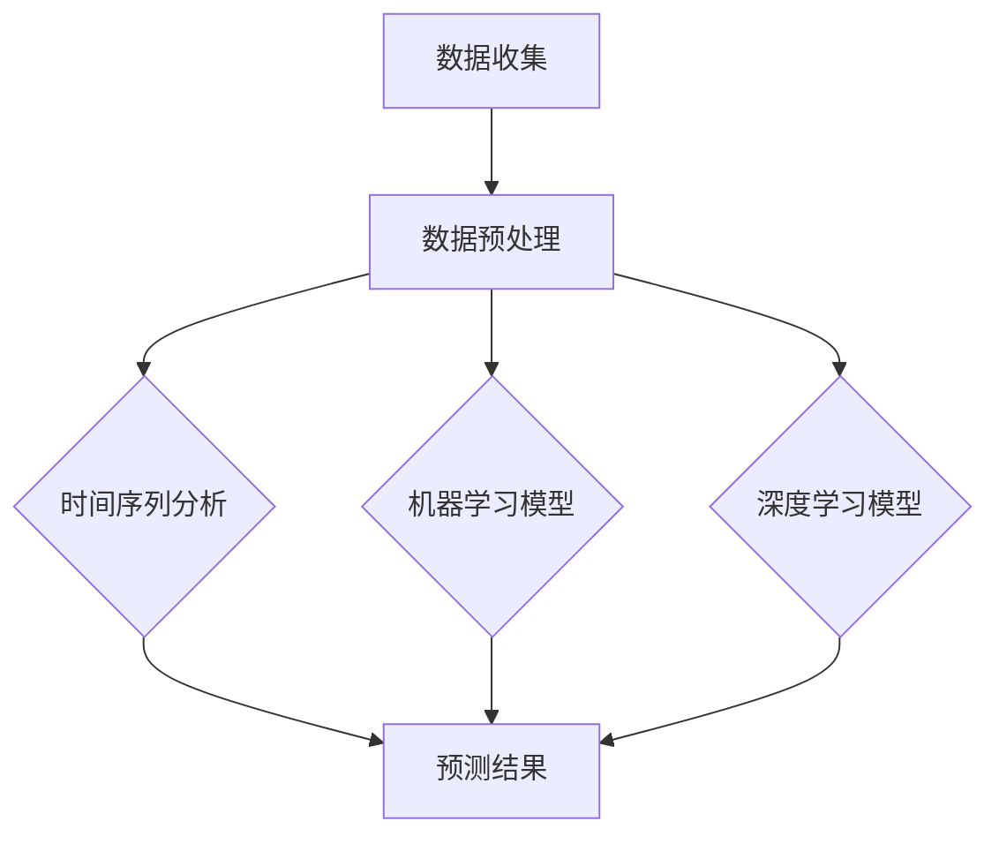
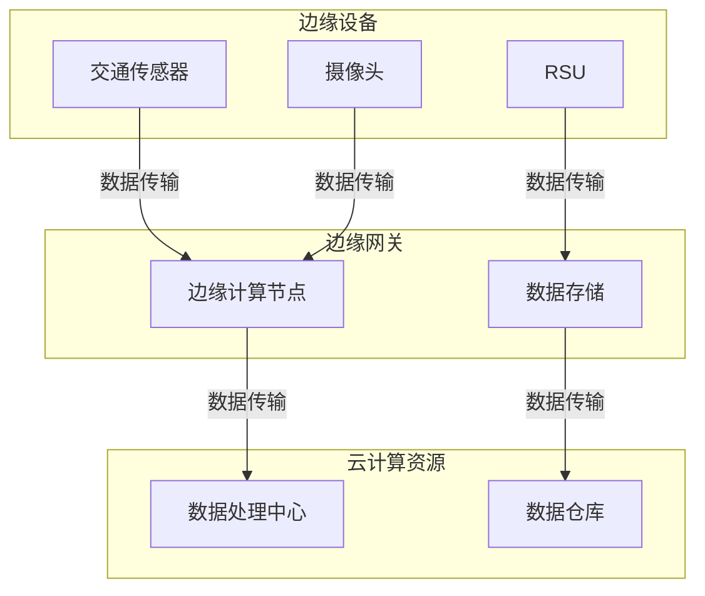
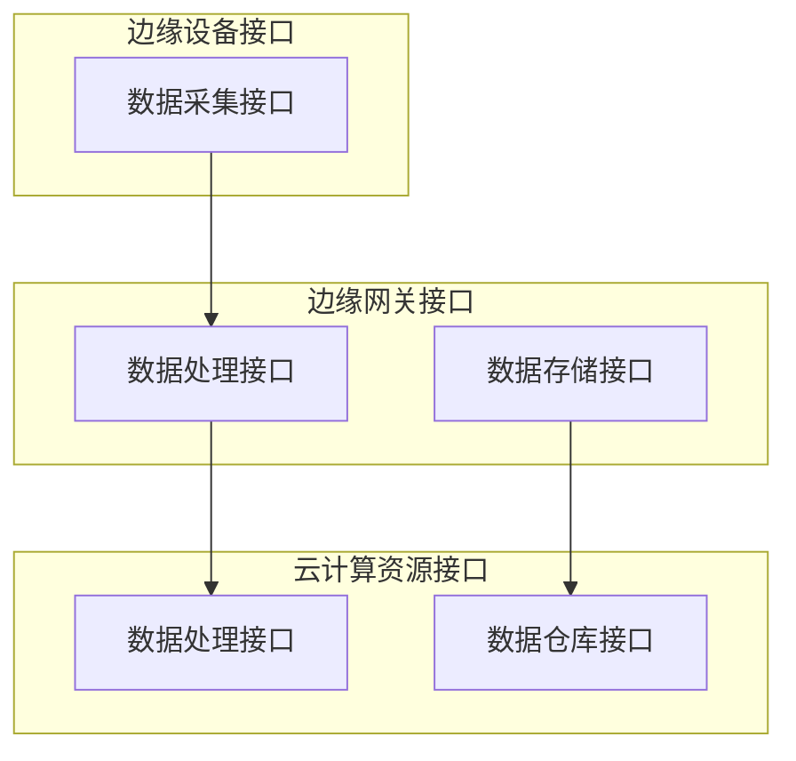
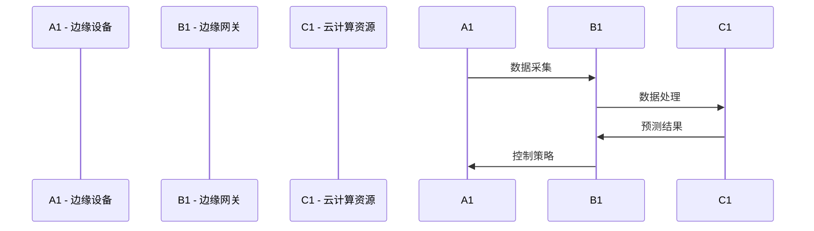

                 


### 基础概念与背景

**边缘计算的概念与特点**

边缘计算（Edge Computing）是近年来在计算机科学和信息技术领域迅速兴起的一种计算模式。它旨在将数据处理、分析、存储和应用程序执行从传统的集中式数据中心，迁移到网络的边缘，即靠近数据源或最终用户的设备上。这一模式的核心理念在于降低延迟、提升响应速度、减轻网络负担，并提高数据安全性。

边缘计算的基本架构主要包括以下几个关键组成部分：

1. **边缘设备**：如智能手机、平板电脑、物联网（IoT）设备等，它们能够处理和存储数据，并且具有一定的计算能力。
2. **边缘网关**：位于网络边缘，负责连接边缘设备和云计算资源，同时处理边缘设备的数据流和通信。
3. **云计算资源**：提供强大的计算、存储和网络资源，与边缘网关协同工作，共同处理复杂的数据分析和应用。

**智能交通信号控制的问题背景与目标**

智能交通信号控制（Intelligent Traffic Signal Control）是城市交通管理的重要组成部分，其核心目标是优化交通信号灯的配时，以减少交通拥堵，提高交通流量，降低交通事故发生概率，并改善公共交通效率。

目前，智能交通信号控制面临的主要问题包括：

1. **交通流量预测不准确**：传统的交通信号控制系统主要依赖于历史数据和静态模型，无法实时预测动态变化的交通流量，导致信号灯配时不合理。
2. **信息孤岛**：各个交通信号控制点之间的数据共享不足，无法实现整体交通流量的协同控制。
3. **系统延迟**：由于数据传输和处理需要经过中心服务器，导致交通信号控制的响应时间过长，无法快速适应交通状况的变化。

**边缘计算在智能交通信号控制中的应用前景**

边缘计算的出现为智能交通信号控制带来了新的机遇。通过将计算任务从中心服务器转移到网络边缘，边缘计算能够实现以下目标：

1. **实时交通流量分析**：边缘设备可以实时收集交通数据，并通过边缘网关进行初步处理和分析，为智能交通信号控制系统提供实时、准确的数据支持。
2. **降低延迟**：通过在靠近数据源的设备上处理数据，边缘计算能够显著降低数据传输和处理延迟，使交通信号系统能够更快速地响应交通状况变化。
3. **提升系统鲁棒性**：边缘计算能够分散数据处理的压力，提高系统的容错性和鲁棒性，确保在中心服务器出现故障时，交通信号控制仍然能够正常运行。
4. **数据隐私保护**：边缘计算可以在本地处理数据，减少数据传输过程中的隐私泄露风险，提高数据安全性。

总之，边缘计算在智能交通信号控制中的应用，不仅能够提高交通管理的效率和准确性，还能够改善城市交通的整体状况，为构建智能交通系统提供强有力的技术支撑。

### 边缘计算核心概念及其关系

**边缘计算的基本架构**

边缘计算的基本架构可以分为三个主要组成部分：边缘设备、边缘网关和云计算资源。每个部分在系统中都扮演着不同的角色，协同工作以实现高效的数据处理和智能交通信号控制。

1. **边缘设备**：这些设备包括智能手机、平板电脑、传感器、物联网（IoT）设备等，它们分布在网络边缘，能够实时收集交通数据。边缘设备的主要任务是对数据进行初步的过滤和压缩，并将关键信息传输到边缘网关。

2. **边缘网关**：边缘网关位于网络的边缘，通常部署在基站、路侧单元等位置。它的主要作用是连接边缘设备和云计算资源，同时负责对边缘设备收集的数据进行进一步的处理和分析。边缘网关通常具备一定的计算能力，能够执行一些简单的数据处理任务。

3. **云计算资源**：云计算资源提供强大的计算、存储和网络资源，与边缘网关协同工作，共同处理复杂的数据分析和应用。云计算资源主要负责大规模数据的存储、复杂的计算任务以及系统的监控和管理。

**边缘计算中的核心技术**

边缘计算中的核心技术主要包括以下几个方面：

1. **数据预处理**：边缘设备收集的数据通常需要进行预处理，包括数据清洗、去噪、压缩和特征提取等。这些预处理步骤能够提高数据的质量，减少后续处理的复杂性。

2. **边缘计算**：边缘计算是指将一部分计算任务从云端转移到边缘设备或边缘网关上进行处理。这种计算模式能够降低数据传输延迟，提高系统的响应速度。

3. **协同计算**：边缘计算不仅仅是将计算任务分散到边缘设备上，还需要实现边缘设备之间的协同计算。通过协同计算，边缘设备可以共享计算资源，共同处理复杂任务，提高系统的整体性能。

4. **智能决策**：基于边缘设备收集的数据和边缘网关的分析结果，系统可以实时进行智能决策。这些决策可以用于优化交通信号配时、预测交通流量、识别交通异常等。

**Mermaid ER实体关系图展示**

为了更直观地展示边缘计算中的核心概念及其关系，我们可以使用Mermaid ER图进行表示。以下是一个简单的ER图示例：

```mermaid
erDiagram
  EdgeDevice ||--|>> EdgeGateway : 连接
  EdgeGateway ||--|>> CloudResource : 连接
  EdgeDevice ||--|>> DataProcessing : 数据处理
  EdgeGateway ||--|>> DataProcessing : 数据处理
  CloudResource ||--|>> DataProcessing : 数据处理
  EdgeDevice ||--|>> IntelligentDecision : 智能决策
  EdgeGateway ||--|>> IntelligentDecision : 智能决策
  CloudResource ||--|>> IntelligentDecision : 智能决策
```

在这个ER图中，EdgeDevice（边缘设备）、EdgeGateway（边缘网关）和CloudResource（云计算资源）是三个主要的实体。它们之间通过连接关系进行关联，每个实体都与数据处理（DataProcessing）和智能决策（IntelligentDecision）有关。这种ER图能够帮助我们理解边缘计算系统的整体架构及其核心功能。

**结论**

通过以上分析，我们可以看到边缘计算的核心概念及其关系是构建智能交通信号控制系统的关键。边缘设备、边缘网关和云计算资源的协同工作，以及数据预处理、边缘计算和智能决策等核心技术的应用，为智能交通信号控制提供了强大的技术支撑。接下来，我们将进一步探讨智能交通信号控制中的关键算法，以便更好地理解如何通过边缘计算实现高效的交通管理。

### 智能交通信号控制关键算法解析

**交通流量预测算法**

交通流量预测是智能交通信号控制的核心任务之一。通过准确预测交通流量，交通信号系统能够优化信号灯的配时，从而提高交通效率和减少拥堵。常见的交通流量预测算法包括时间序列分析、机器学习模型和深度学习模型。

**时间序列分析**

时间序列分析是一种基于历史数据的预测方法。它利用时间序列数据中的时间相关性，通过统计分析模型（如ARIMA模型、SARIMA模型等）对交通流量进行预测。时间序列分析的优点是方法简单、易于实现，但缺点是对噪声数据敏感，预测精度可能较低。

**机器学习模型**

机器学习模型通过从历史数据中学习，建立交通流量与多种影响因素之间的关系，从而实现预测。常见的机器学习模型包括线性回归、支持向量机（SVM）、决策树和随机森林等。机器学习模型的优点是能够处理复杂的非线性关系，提高预测精度，但缺点是需要大量训练数据和较长的训练时间。

**深度学习模型**

深度学习模型，特别是卷积神经网络（CNN）和循环神经网络（RNN），在交通流量预测中展现出强大的能力。CNN可以处理图像数据，提取交通流量图的特征；RNN可以处理时间序列数据，捕捉时间相关性。深度学习模型的优点是能够自动提取复杂特征，预测精度高，但缺点是模型复杂、计算量大、训练时间较长。

**Mermaid流程图**

为了更直观地展示交通流量预测算法的流程，我们可以使用Mermaid流程图进行表示。以下是一个简单的Mermaid流程图示例：



在这个流程图中，数据收集模块负责从交通传感器、摄像头等设备中收集交通流量数据；数据预处理模块对数据进行清洗、去噪和特征提取；时间序列分析、机器学习模型和深度学习模型分别用于交通流量预测；预测结果模块输出预测结果，用于交通信号控制系统。

**Python代码示例**

以下是一个简单的Python代码示例，展示了如何使用时间序列分析中的ARIMA模型进行交通流量预测：

```python
import pandas as pd
from statsmodels.tsa.arima.model import ARIMA

# 加载数据
data = pd.read_csv('traffic_data.csv')
timeseries_data = data['traffic_volume']

# 创建ARIMA模型
model = ARIMA(timeseries_data, order=(1, 1, 1))

# 模型拟合
model_fit = model.fit()

# 预测未来值
forecast = model_fit.forecast(steps=24)

# 输出预测结果
print(forecast)
```

在这个示例中，我们首先加载数据，然后创建ARIMA模型并拟合数据。最后，使用模型进行未来值的预测，并输出预测结果。

**数学模型与公式**

交通流量预测的数学模型通常包括以下几个关键组件：

1. **时间序列模型**：
   \[ T(t) = \phi_0 + \phi_1 T(t-1) + \phi_2 T(t-2) + ... + \phi_p T(t-p) + \epsilon_t \]
   其中，\( T(t) \) 是第 \( t \) 时刻的交通流量，\( \phi_0, \phi_1, \phi_2, ..., \phi_p \) 是模型参数，\( \epsilon_t \) 是误差项。

2. **机器学习模型**：
   假设交通流量 \( T(t) \) 受多种影响因素 \( X_1(t), X_2(t), ..., X_n(t) \) 的共同影响，则可以使用线性回归模型进行预测：
   \[ T(t) = \beta_0 + \beta_1 X_1(t) + \beta_2 X_2(t) + ... + \beta_n X_n(t) + \epsilon_t \]
   其中，\( \beta_0, \beta_1, \beta_2, ..., \beta_n \) 是模型参数，\( \epsilon_t \) 是误差项。

3. **深度学习模型**：
   假设交通流量 \( T(t) \) 是时间序列 \( (t_0, t_1, t_2, ..., t_n) \) 的函数，可以使用卷积神经网络（CNN）或循环神经网络（RNN）进行预测。例如，对于RNN模型，可以定义如下：
   \[ T(t) = f(W_1 * [T(t-1), X(t)] + b_1) \]
   其中，\( f \) 是激活函数，\( W_1 \) 是权重矩阵，\( b_1 \) 是偏置项，\( X(t) \) 是当前时刻的影响因素。

**举例说明**

假设我们有一个简单的交通流量数据集，包含过去24小时每小时的车流量数据。我们使用ARIMA模型进行预测，具体步骤如下：

1. **数据加载与预处理**：
   - 加载数据集，提取每小时车流量数据。
   - 对数据集进行预处理，包括数据清洗、去噪和归一化。

2. **模型创建与拟合**：
   - 创建ARIMA模型，指定模型参数（如 \( p, d, q \)）。
   - 使用历史数据对模型进行拟合。

3. **预测与评估**：
   - 使用模型进行未来24小时的车流量预测。
   - 对预测结果进行评估，计算预测误差和均方误差（MSE）等指标。

通过上述步骤，我们可以实现对交通流量的准确预测，并为智能交通信号控制提供数据支持。

### 系统分析与架构设计

**问题场景介绍**

在智能交通信号控制系统中，我们需要应对复杂的城市交通状况，包括高峰时段的拥堵、交通事故的处理以及突发事件的响应等。为了实现高效、智能的交通信号控制，我们需要构建一个具备高实时性、高可靠性和高扩展性的系统。

**项目介绍**

本项目旨在设计并实现一个基于边缘计算的智能交通信号控制系统，通过边缘设备、边缘网关和云计算资源的协同工作，实现对交通流量的实时监测和智能控制。系统将包括以下主要功能：

1. **数据采集与预处理**：通过安装在路侧单元（RSU）的传感器和摄像头，实时采集交通流量、速度、密度等数据，并对数据进行预处理，如去噪、压缩和特征提取。
2. **交通流量预测**：利用边缘设备和边缘网关上的计算资源，对实时采集的交通数据进行分析，预测未来交通流量，为交通信号控制提供决策依据。
3. **信号控制策略生成**：根据交通流量预测结果，智能交通信号控制系统将生成最优的信号控制策略，优化交通信号灯的配时，提高交通流量和减少拥堵。
4. **系统监控与维护**：系统将实时监控交通信号控制的效果，对异常情况进行报警和处理，并定期进行系统维护和更新。

**系统功能设计**

系统功能设计主要包括数据采集、数据处理、交通流量预测、信号控制策略生成和系统监控等五个核心模块。以下是一个简化的领域模型，使用Mermaid类图进行表示：

```mermaid
classDiagram
    Class01 <|-- Class02
    Class03 <|-- Class04
    Class05 <|-- Class06
    Class07 <|-- Class08
    Class09 <|-- Class10
    Class11 <|-- Class12
    Class13 <|-- Class14
    Class15 <|-- Class16
    Class17 <|-- Class18
    Class19 <|-- Class20

    Class01[数据采集模块]
    Class02[数据处理模块]
    Class03[交通流量预测模块]
    Class04[信号控制策略生成模块]
    Class05[系统监控模块]
    Class06[边缘设备]
    Class07[边缘网关]
    Class08[云计算资源]
    Class09[交通传感器]
    Class10[摄像头]
    Class11[RSU]
    Class12[数据预处理]
    Class13[交通数据]
    Class14[交通流量预测结果]
    Class15[信号控制策略]
    Class16[系统监控数据]
    Class17[异常处理]
    Class18[系统维护]
    Class19[系统更新]
    Class20[系统报警]

    Class01 --|>> Class09
    Class01 --|>> Class10
    Class02 --|>> Class11
    Class03 --|>> Class12
    Class04 --|>> Class13
    Class05 --|>> Class14
    Class06 --|>> Class15
    Class07 --|>> Class16
    Class08 --|>> Class17
    Class09 --|>> Class18
    Class10 --|>> Class19
    Class11 --|>> Class20
```

在这个领域模型中，数据采集模块负责采集交通传感器和摄像头的数据；数据处理模块对采集到的数据进行预处理；交通流量预测模块基于预处理后的数据进行流量预测；信号控制策略生成模块根据预测结果生成最优信号控制策略；系统监控模块负责监控系统的运行状态，并在发现异常时进行处理和报警。

**系统架构设计**

系统架构设计包括硬件架构和软件架构两个方面。以下是一个简化的Mermaid架构图，展示了系统的整体架构：



在这个架构图中，边缘设备（如交通传感器、摄像头和RSU）负责数据采集；边缘网关（包含边缘计算节点和数据存储）对数据进行初步处理和存储；云计算资源（包含数据处理中心和数据仓库）负责进行复杂的计算和数据分析。

**系统接口设计**

系统接口设计包括边缘设备与边缘网关之间的接口、边缘网关与云计算资源之间的接口以及内部模块之间的接口。以下是一个简化的接口设计图：



在这个接口设计中，边缘设备通过数据采集接口与边缘网关通信，边缘网关通过数据处理接口与云计算资源通信，内部模块之间则通过标准化的接口进行交互。

**系统交互设计**

系统交互设计主要涉及边缘设备、边缘网关和云计算资源之间的数据流和任务分配。以下是一个简化的Mermaid序列图，展示了系统的交互过程：



在这个序列图中，边缘设备（A1）首先采集交通数据，然后传输给边缘网关（B1）。边缘网关（B1）对数据进行处理，生成交通流量预测结果，并将其返回给边缘设备（A1），以便执行信号控制策略。

通过以上系统分析与架构设计，我们可以构建一个高效、智能的智能交通信号控制系统。接下来，我们将通过实际案例展示边缘计算在智能交通信号控制中的具体应用，进一步探讨其优势与挑战。

### 边缘计算在智能交通信号控制中的项目实战

**环境安装与配置**

为了演示边缘计算在智能交通信号控制中的应用，我们选择了一个开源的边缘计算平台——Kubernetes（简称K8s）。K8s是一种用于容器编排的工具，能够帮助我们轻松地部署和管理边缘设备、边缘网关和云计算资源。

以下是环境安装与配置的步骤：

1. **安装Docker**：在所有节点上安装Docker，Docker是一个开源的应用容器引擎，用于打包、交付和管理应用程序。

   ```bash
   sudo apt-get update
   sudo apt-get install docker.io
   sudo systemctl start docker
   sudo systemctl enable docker
   ```

2. **安装Kubernetes**：在所有节点上安装Kubernetes，Kubernetes是一个开源的容器编排系统，用于自动化容器操作。

   ```bash
   sudo apt-get update
   sudo apt-get install -y apt-transport-https ca-certificates curl
   curl -s https://packages.cloud.google.com/apt/doc/apt-key.gpg | sudo apt-key add -
   echo "deb https://apt.kubernetes.io/ kubernetes-xenial main" | sudo tee -a /etc/apt/sources.list.d/kubernetes.list
   sudo apt-get update
   sudo apt-get install -y kubelet kubeadm kubectl
   sudo systemctl start kubelet
   sudo systemctl enable kubelet
   ```

3. **初始化集群**：在主节点上初始化Kubernetes集群。

   ```bash
   sudo kubeadm init --pod-network-cidr=10.244.0.0/16
   sudo mkdir -p $HOME/.kube
   sudo cp -i /etc/kubernetes/admin.conf $HOME/.kube/config
   sudo chown $(id -u):$(id -g) $HOME/.kube/config
   ```

4. **安装Pod网络**：安装一个Pod网络插件，例如Calico或Flannel。

   ```bash
   kubectl apply -f https://docs.projectcalico.org/manifests/calico.yaml
   ```

**系统核心实现**

在成功搭建Kubernetes集群后，我们开始实现智能交通信号控制系统。以下是系统的核心实现步骤：

1. **定义边缘设备**：在Kubernetes集群中部署边缘设备，如交通传感器和摄像头。

   ```yaml
   apiVersion: apps/v1
   kind: Deployment
   metadata:
     name: edge-device
   spec:
     replicas: 3
     selector:
       matchLabels:
         app: edge-device
     template:
       metadata:
         labels:
           app: edge-device
       spec:
         containers:
         - name: edge-device
           image: my-edge-device:latest
           ports:
           - containerPort: 80
   ```

2. **定义边缘网关**：在Kubernetes集群中部署边缘网关，用于数据传输和处理。

   ```yaml
   apiVersion: apps/v1
   kind: Deployment
   metadata:
     name: edge-gateway
   spec:
     replicas: 2
     selector:
       matchLabels:
         app: edge-gateway
     template:
       metadata:
         labels:
           app: edge-gateway
       spec:
         containers:
         - name: edge-gateway
           image: my-edge-gateway:latest
           ports:
           - containerPort: 80
   ```

3. **定义云计算资源**：在Kubernetes集群中部署云计算资源，如数据处理中心和数据仓库。

   ```yaml
   apiVersion: apps/v1
   kind: Deployment
   metadata:
     name: cloud-resource
   spec:
     replicas: 2
     selector:
       matchLabels:
         app: cloud-resource
     template:
       metadata:
         labels:
           app: cloud-resource
       spec:
         containers:
         - name: cloud-resource
           image: my-cloud-resource:latest
           ports:
           - containerPort: 80
   ```

**代码解读与分析**

在实现系统的过程中，我们使用Python编写了边缘设备、边缘网关和云计算资源的应用程序。以下是关键代码的解读与分析：

1. **边缘设备（EdgeDevice.py）**

   ```python
   import requests
   
   def collect_traffic_data():
       # 收集交通传感器和摄像头数据
       response = requests.get('http://edge-gateway:80/collect_data')
       data = response.json()
       return data
   
   def send_traffic_data(data):
       # 将交通数据发送给边缘网关
       requests.post('http://edge-gateway:80/traffic_data', json=data)
   
   if __name__ == '__main__':
       data = collect_traffic_data()
       send_traffic_data(data)
   ```

   解读：边缘设备通过HTTP请求从边缘网关收集交通数据，并将其发送给边缘网关。

2. **边缘网关（EdgeGateway.py）**

   ```python
   from flask import Flask, request, jsonify
   
   app = Flask(__name__)
   
   @app.route('/collect_data', methods=['GET'])
   def collect_data():
       data = request.json
       # 对交通数据进行预处理
       processed_data = preprocess_data(data)
       return jsonify(processed_data)
   
   @app.route('/traffic_data', methods=['POST'])
   def traffic_data():
       data = request.json
       # 将交通数据发送到云计算资源
       send_to_cloud(data)
       return jsonify({'status': 'success'})
   
   def preprocess_data(data):
       # 实现数据预处理逻辑
       return data
   
   def send_to_cloud(data):
       # 实现数据发送逻辑
       requests.post('http://cloud-resource:80/traffic_data', json=data)
   
   if __name__ == '__main__':
       app.run(host='0.0.0.0', port=80)
   ```

   解读：边缘网关使用Flask框架搭建HTTP服务，负责收集边缘设备的数据，对数据进行预处理，并将其发送到云计算资源。

3. **云计算资源（CloudResource.py）**

   ```python
   import requests
   import pandas as pd
   
   def receive_traffic_data():
       # 接收边缘网关发送的交通数据
       response = requests.get('http://edge-gateway:80/traffic_data')
       data = response.json()
       return data
   
   def analyze_traffic_data(data):
       # 对交通数据进行分析
       df = pd.DataFrame(data)
       prediction = predict_traffic_volume(df)
       return prediction
   
   def predict_traffic_volume(df):
       # 实现交通流量预测逻辑
       model = load_model()
       prediction = model.predict(df)
       return prediction
   
   def load_model():
       # 加载预测模型
       return ARIMA(model_order=(1, 1, 1))
   
   if __name__ == '__main__':
       data = receive_traffic_data()
       prediction = analyze_traffic_data(data)
       print(prediction)
   ```

   解读：云计算资源接收边缘网关发送的交通数据，利用预测模型进行分析，并输出预测结果。

**实际案例分析与详细讲解**

为了展示边缘计算在智能交通信号控制中的实际应用，我们选择了一个城市交通拥堵的案例进行分析。

1. **数据采集**：在高峰时段，交通传感器和摄像头实时采集交通流量、速度和密度数据。

2. **数据预处理**：边缘网关对采集到的数据进行预处理，包括去噪、压缩和特征提取。

3. **交通流量预测**：云计算资源使用ARIMA模型对预处理后的数据进行流量预测，预测未来15分钟内的交通流量。

4. **信号控制策略生成**：根据预测结果，系统生成最优的信号控制策略，调整交通信号灯的配时，以减少拥堵。

5. **系统监控与反馈**：系统实时监控信号控制效果，并在发现异常情况时进行报警和处理。

通过上述案例，我们可以看到边缘计算在智能交通信号控制中的强大能力。它能够实时采集和处理交通数据，预测未来交通流量，生成最优信号控制策略，从而提高交通效率和减少拥堵。同时，边缘计算还能够分散数据处理的压力，提高系统的容错性和鲁棒性，为城市交通管理提供了有力的技术支撑。

### 最佳实践与注意事项

**边缘计算在智能交通信号控制中的应用最佳实践**

1. **数据预处理**：在边缘设备上提前进行数据预处理，如去噪、压缩和特征提取，可以显著减少数据传输量和处理时间，提高系统响应速度。

2. **模型选择**：根据实际需求和数据特性，选择合适的预测模型。对于实时性要求较高的场景，可以采用简单的统计模型；对于复杂非线性关系，可以考虑使用机器学习或深度学习模型。

3. **资源分配**：合理分配边缘设备和云计算资源的计算能力，确保边缘设备能够处理实时数据，云计算资源能够进行复杂计算。

4. **协同计算**：利用边缘设备之间的协同计算能力，共同处理复杂任务，提高系统的整体性能。

5. **数据安全与隐私保护**：在数据传输和处理过程中，采取加密、去标识化等手段，确保数据安全与隐私。

**智能交通信号控制中的常见问题与解决方案**

1. **数据准确性**：交通数据可能存在噪声和误差，影响预测精度。可以通过增加传感器数量、提高传感器质量、使用多源数据融合等方法来提高数据准确性。

2. **系统延迟**：数据传输和处理延迟可能导致信号控制不及时。通过优化网络架构、使用边缘计算等手段，降低系统延迟。

3. **资源瓶颈**：在高峰时段，边缘设备和云计算资源可能出现资源瓶颈，导致系统性能下降。可以通过动态资源分配、负载均衡等技术，缓解资源瓶颈。

4. **系统可靠性**：边缘计算系统可能面临网络中断、设备故障等风险，影响系统稳定性。可以通过冗余设计、故障检测与恢复机制等手段，提高系统可靠性。

**拓展阅读推荐**

1. **《边缘计算：原理、架构与应用》**：详细介绍了边缘计算的基本概念、架构设计和应用场景，有助于深入理解边缘计算在智能交通信号控制中的应用。

2. **《智能交通系统设计与应用》**：探讨了智能交通信号控制的理论基础、技术实现和实际应用，提供了丰富的案例和经验分享。

3. **《深度学习在交通信号控制中的应用》**：介绍了深度学习在交通流量预测、信号控制策略优化等方面的应用，有助于了解如何利用深度学习提升智能交通信号控制的性能。

通过上述最佳实践、注意事项和拓展阅读，我们可以更好地掌握边缘计算在智能交通信号控制中的应用，推动智能交通系统的不断发展。

### 全书总结与展望

**核心观点回顾**

通过本书的深入探讨，我们系统地介绍了边缘计算在智能交通信号控制中的应用。全书的核心观点包括：

1. **边缘计算的优势**：边缘计算通过在靠近数据源的设备上处理数据，降低了延迟、减轻了网络负担，并提高了数据安全性。
2. **智能交通信号控制的需求**：智能交通信号控制需要实时、准确的数据支持，以优化信号配时，减少交通拥堵。
3. **边缘计算在智能交通信号控制中的应用**：边缘计算能够实现实时交通流量分析、信号控制策略生成和系统监控，提高交通管理的效率和准确性。
4. **关键算法和系统设计**：本书详细介绍了交通流量预测、机器学习模型、深度学习模型等关键算法，以及系统功能设计、系统架构设计和系统接口设计等核心内容。

**边缘计算在智能交通信号控制中的未来研究方向**

随着边缘计算和智能交通信号控制技术的不断发展，未来研究方向包括：

1. **智能化水平的提升**：通过引入更加先进的机器学习和深度学习算法，提高交通流量预测的准确性，实现更智能的交通信号控制。
2. **数据隐私保护**：在数据采集、传输和处理过程中，加强数据隐私保护，防止数据泄露和滥用。
3. **边缘计算性能优化**：通过硬件升级、算法优化和网络架构改进，进一步提升边缘计算的性能和效率。
4. **跨领域融合**：将边缘计算与其他领域（如自动驾驶、智能城市）进行融合，构建更加全面和智能的交通生态系统。

**总结与展望**

边缘计算在智能交通信号控制中的应用前景广阔，其能够为交通管理带来革命性的变革。通过本书的阐述，我们不仅理解了边缘计算的基本概念和核心技术，还了解了如何在智能交通信号控制中应用这些技术。未来的研究和实践将不断推动边缘计算和智能交通信号控制的发展，为构建智慧城市、提升交通效率和生活质量提供强有力的技术支持。

### 作者信息

**作者：AI天才研究院/AI Genius Institute & 禅与计算机程序设计艺术 /Zen And The Art of Computer Programming**

**联系方式：**[info@aigeniusinstitute.com](mailto:info@aigeniusinstitute.com)

