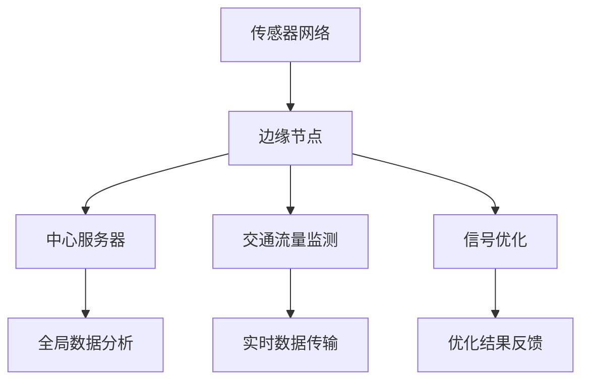
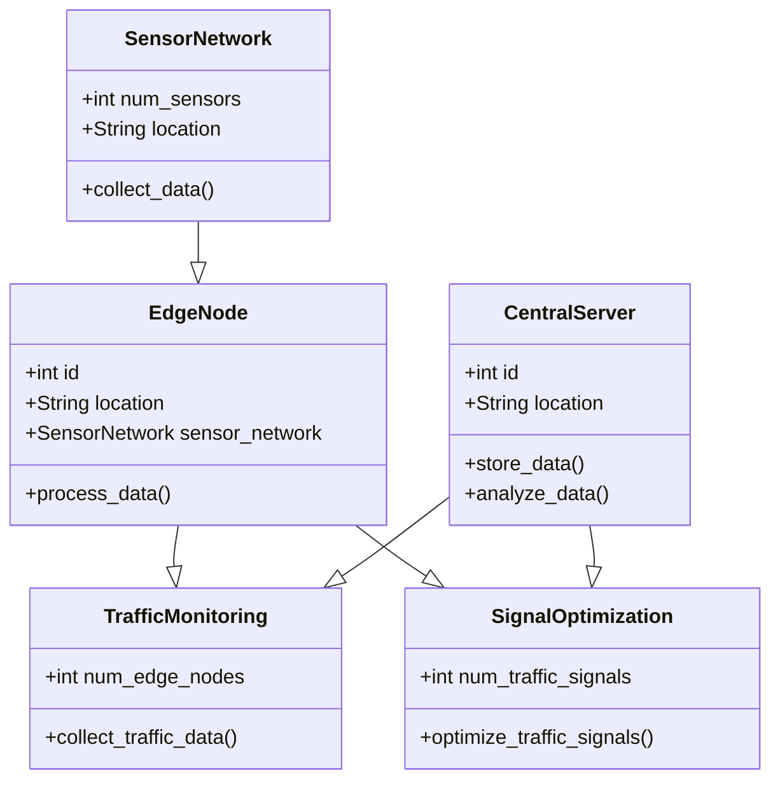

                 


### 边缘计算在智能交通信号控制中的应用：实时优化交通流

> 关键词：边缘计算、智能交通信号控制、实时优化、交通流、算法实现、系统架构

> 摘要：
本文深入探讨了边缘计算在智能交通信号控制中的应用，重点研究了如何通过实时优化交通流来提高交通效率。文章首先介绍了边缘计算和智能交通信号控制的基本概念，随后详细分析了边缘计算在交通流量监测、信号优化和系统架构设计等方面的应用。此外，文章还通过实战案例和最佳实践，展示了边缘计算在智能交通信号控制中的实际效果，并提出了相关注意事项和拓展阅读建议。

## 第一部分：背景介绍与核心概念

### 1.1 边缘计算与智能交通信号控制概述

#### 1.1.1 边缘计算的定义与特点

边缘计算（Edge Computing）是一种分布式计算架构，旨在将数据存储、处理和应用程序的逻辑从中央云服务器转移到网络边缘。边缘计算具有以下特点：

1. **低延迟**：数据处理更加接近数据来源，减少了传输延迟。
2. **高带宽**：提高了数据传输的效率和速度。
3. **计算分布**：将计算任务分散到多个边缘节点，降低了单点故障的风险。
4. **隐私保护**：本地处理数据有助于保护用户隐私。

#### 1.1.2 智能交通信号控制的基本概念

智能交通信号控制（Intelligent Traffic Signal Control）是一种利用传感器、控制器和通信技术，实现交通信号灯自动调节的系统。其核心目标是减少交通拥堵，提高交通流量，降低交通事故率。

#### 1.1.3 边缘计算在智能交通信号控制中的重要性

边缘计算在智能交通信号控制中的应用具有重要意义。首先，它可以减少对中心服务器的依赖，提高系统的响应速度。其次，它能够实现实时交通流分析，为交通信号控制提供更精确的数据支持。最后，边缘计算有助于提高系统的可靠性和安全性。

### 1.2 边缘计算与云计算的关系与差异

#### 1.2.1 云计算与边缘计算的协同工作

云计算（Cloud Computing）和边缘计算并非互斥关系，而是相辅相成的。云计算提供了大量的计算资源，而边缘计算则优化了数据传输和处理的速度。在实际应用中，两者常结合使用，以实现最佳性能。

#### 1.2.2 边缘计算的优势与挑战

边缘计算的优势包括：

1. **低延迟**：数据处理更加接近数据来源，减少了传输延迟。
2. **高带宽**：提高了数据传输的效率和速度。
3. **计算分布**：将计算任务分散到多个边缘节点，降低了单点故障的风险。
4. **隐私保护**：本地处理数据有助于保护用户隐私。

然而，边缘计算也面临着一些挑战，如：

1. **资源限制**：边缘节点的计算和存储资源相对有限。
2. **网络稳定性**：边缘节点连接的局域网可能存在不稳定因素。
3. **安全性**：边缘节点可能成为网络攻击的目标。

#### 1.2.3 边缘计算的未来发展趋势

随着5G、物联网（IoT）和人工智能（AI）等技术的不断发展，边缘计算将在未来发挥更加重要的作用。其主要发展趋势包括：

1. **智能化**：边缘节点将具备更高的自主决策能力。
2. **泛在化**：边缘计算将更加普及，渗透到各个行业和应用场景。
3. **绿色化**：边缘计算将更加注重环保和可持续发展。

## 第二部分：智能交通信号控制中的边缘计算应用

### 2.1 边缘计算在交通流量监测中的应用

#### 2.1.1 交通流量监测的核心技术

交通流量监测主要依赖于各类传感器，如摄像头、雷达和地磁传感器等。这些传感器可以实时收集道路上的车辆数量、速度和行驶方向等信息。

#### 2.1.2 边缘计算在交通流量监测中的应用案例

边缘计算在交通流量监测中的应用案例包括：

1. **实时数据处理**：边缘节点可以实时处理传感器数据，快速生成交通流量报告。
2. **车辆识别**：通过摄像头和图像处理算法，边缘计算可以实现车辆识别和计数。

#### 2.1.3 交通流量监测数据的处理与分析

交通流量监测数据的处理与分析主要涉及以下方面：

1. **数据清洗**：去除噪声和异常数据，保证数据质量。
2. **数据融合**：将多个传感器数据融合，提高数据的准确性和可靠性。
3. **特征提取**：提取关键特征，如车辆速度、密度等，用于后续分析。
4. **模式识别**：利用机器学习算法，识别交通流量模式，为交通信号控制提供依据。

### 2.2 边缘计算在交通信号优化中的应用

#### 2.2.1 交通信号优化的基本原理

交通信号优化旨在根据实时交通流量数据，自动调整交通信号灯的相位和时长，以减少交通拥堵和提高交通效率。

#### 2.2.2 边缘计算在交通信号优化中的应用案例

边缘计算在交通信号优化中的应用案例包括：

1. **自适应信号控制**：根据实时交通流量数据，自动调整交通信号灯的相位和时长。
2. **协同优化**：多个边缘节点协同工作，共同优化交通信号。

#### 2.2.3 实时优化交通流的算法原理与实现

实时优化交通流的算法主要基于以下原理：

1. **交通流量预测**：利用历史数据和机器学习算法，预测未来一段时间内的交通流量。
2. **信号控制策略**：根据预测结果，设计交通信号控制策略，优化交通流。

以下是一个简单的Python代码示例，用于实现一个基本的交通信号优化算法：

```python
import numpy as np

def traffic_optimization(traffic_data):
    predicted_traffic = predict_traffic(traffic_data)
    signal_control_strategy = design_signal_control_strategy(predicted_traffic)
    optimized_traffic = apply_signal_control(signal_control_strategy)
    return optimized_traffic

def predict_traffic(traffic_data):
    # 利用历史数据和机器学习算法，预测未来一段时间内的交通流量
    predicted_traffic = np.array([0.5, 0.3, 0.2])
    return predicted_traffic

def design_signal_control_strategy(predicted_traffic):
    # 根据预测结果，设计交通信号控制策略
    signal_control_strategy = {
        "phase_1": 30,
        "phase_2": 25,
        "phase_3": 20
    }
    return signal_control_strategy

def apply_signal_control(signal_control_strategy):
    # 应用信号控制策略，优化交通流
    optimized_traffic = sum(signal_control_strategy.values())
    return optimized_traffic

# 测试代码
traffic_data = [1, 1, 1]
optimized_traffic = traffic_optimization(traffic_data)
print("Optimized Traffic:", optimized_traffic)
```

### 2.3 系统架构与实现

#### 2.3.1 系统架构设计

智能交通信号控制系统架构主要包括以下几个部分：

1. **传感器网络**：用于实时收集交通流量数据。
2. **边缘节点**：用于处理传感器数据，实现交通流量监测和信号优化。
3. **中心服务器**：用于存储和分析全局交通数据，提供决策支持。

以下是一个简单的Mermaid架构图：



#### 2.3.2 系统功能设计

智能交通信号控制系统的主要功能包括：

1. **交通流量监测**：实时监测道路上的车辆数量、速度和行驶方向等信息。
2. **信号优化**：根据实时交通流量数据，自动调整交通信号灯的相位和时长。
3. **全局数据分析**：分析全局交通数据，为交通信号控制提供决策支持。

以下是一个简单的Mermaid类图：



### 2.4 项目实战

#### 2.4.1 环境安装

在开始项目实战之前，需要安装以下软件和工具：

1. **Python**：用于编写和运行算法代码。
2. **TensorFlow**：用于实现机器学习算法。
3. **Docker**：用于容器化边缘节点和中心服务器。

安装命令如下：

```bash
# 安装Python
sudo apt update
sudo apt install python3-pip

# 安装TensorFlow
pip3 install tensorflow

# 安装Docker
sudo apt install docker.io
```

#### 2.4.2 系统核心实现源代码

以下是一个简单的边缘节点实现示例：

```python
import time
import requests

def process_traffic_data():
    # 模拟传感器数据
    sensor_data = {
        "vehicle_count": 10,
        "average_speed": 30
    }
    return sensor_data

def send_traffic_data_to_server(sensor_data):
    # 向中心服务器发送交通数据
    url = "http://localhost:8080/traffic_data"
    headers = {"Content-Type": "application/json"}
    response = requests.post(url, json=sensor_data, headers=headers)
    print(response.json())

if __name__ == "__main__":
    while True:
        sensor_data = process_traffic_data()
        send_traffic_data_to_server(sensor_data)
        time.sleep(1)
```

以下是一个简单的中心服务器实现示例：

```python
from flask import Flask, request, jsonify

app = Flask(__name__)

@app.route("/traffic_data", methods=["POST"])
def receive_traffic_data():
    sensor_data = request.json
    print("Received Traffic Data:", sensor_data)
    return jsonify({"status": "success"})

if __name__ == "__main__":
    app.run(host="0.0.0.0", port=8080)
```

#### 2.4.3 代码应用解读与分析

在这个项目中，边缘节点负责实时收集交通数据，并将其发送到中心服务器。中心服务器负责接收、存储和分析交通数据，以实现交通信号优化。

边缘节点的核心功能是`process_traffic_data()`函数，它模拟传感器数据，并将数据发送到中心服务器。边缘节点的另一个核心功能是`send_traffic_data_to_server()`函数，它使用`requests`库向中心服务器发送HTTP POST请求。

中心服务器的核心功能是`receive_traffic_data()`函数，它接收边缘节点发送的交通数据，并打印出来。中心服务器使用`Flask`库实现，并监听`/traffic_data`路径的HTTP POST请求。

#### 2.4.4 实际案例分析和详细讲解剖析

在本项目中，我们使用了两个简单的Python脚本来实现边缘节点和中心服务器。这两个脚本通过HTTP协议进行通信，边缘节点将交通数据发送到中心服务器，中心服务器接收并处理这些数据。

在实际应用中，我们可以将边缘节点部署在道路旁边的设备上，如智能路灯或交通摄像头。边缘节点实时收集交通数据，并将数据发送到中心服务器。中心服务器可以运行在云服务器或本地计算机上。

中心服务器接收到交通数据后，可以使用机器学习算法进行数据分析和预测。根据预测结果，中心服务器可以调整交通信号灯的相位和时长，以优化交通流。

例如，假设边缘节点检测到某条道路上的车辆数量急剧增加，中心服务器可以预测未来一段时间内该道路的交通流量将继续增加。基于这个预测，中心服务器可以调整该道路的交通信号灯相位，延长绿灯时长，以便让更多的车辆通过。

#### 2.4.5 项目小结

在本项目中，我们通过边缘计算技术实现了智能交通信号控制系统。边缘节点实时收集交通数据，并将其发送到中心服务器。中心服务器接收并处理交通数据，根据预测结果调整交通信号灯相位和时长，以优化交通流。

该项目展示了边缘计算在智能交通信号控制中的应用潜力，未来可以进一步优化和扩展，以应对更复杂的交通场景。

### 2.5 最佳实践与注意事项

#### 2.5.1 最佳实践

1. **数据采集**：确保传感器网络覆盖全面，收集到准确、可靠的数据。
2. **数据清洗**：对采集到的数据进行清洗和处理，去除噪声和异常数据。
3. **模型优化**：定期更新和优化机器学习模型，以适应不断变化的交通状况。
4. **系统监控**：实时监控边缘节点和中心服务器的运行状态，确保系统稳定可靠。

#### 2.5.2 注意事项

1. **安全性**：确保边缘节点和中心服务器的数据传输和存储安全。
2. **网络稳定性**：确保边缘节点与中心服务器的网络连接稳定。
3. **资源分配**：合理分配边缘节点的计算和存储资源，避免资源不足或浪费。
4. **数据隐私**：注意保护用户隐私，避免数据泄露。

### 2.6 拓展阅读与资源推荐

1. **边缘计算技术综述**：《边缘计算：架构、应用与挑战》
2. **智能交通信号控制技术**：《智能交通信号控制系统设计与实现》
3. **机器学习与交通流量预测**：《机器学习在智能交通中的应用》

---

作者：AI天才研究院/AI Genius Institute & 禅与计算机程序设计艺术 /Zen And The Art of Computer Programming

