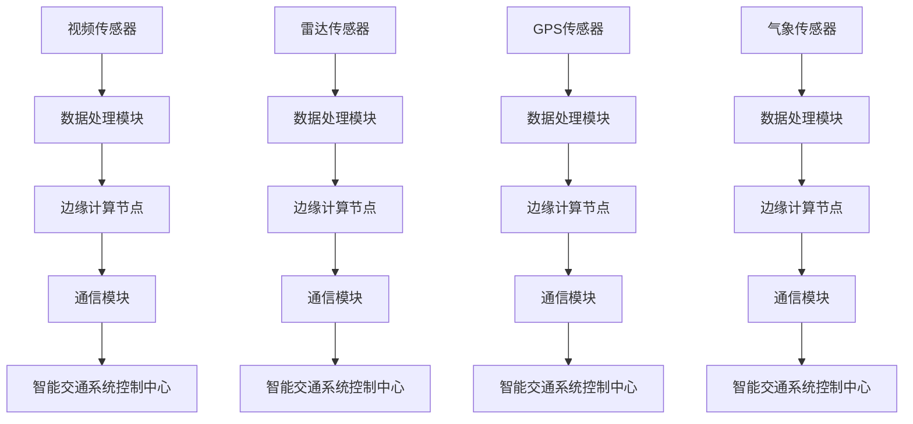
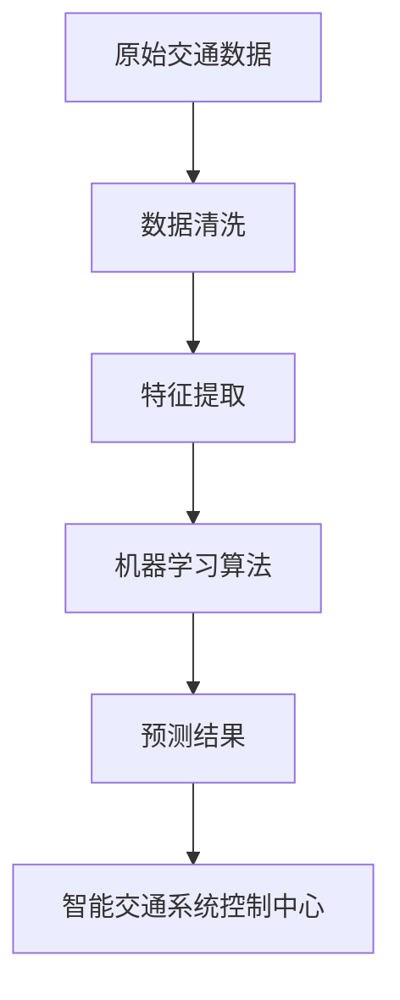
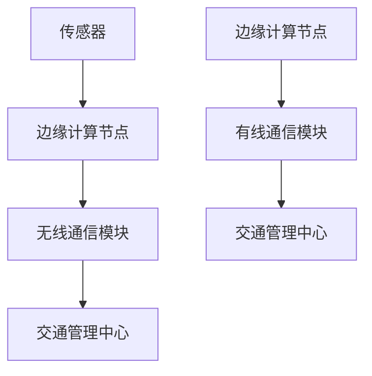
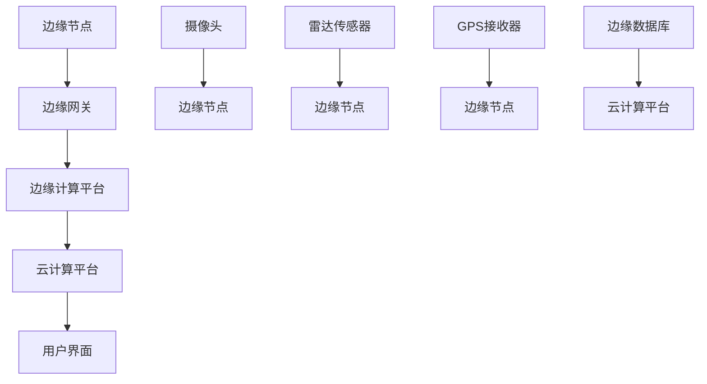
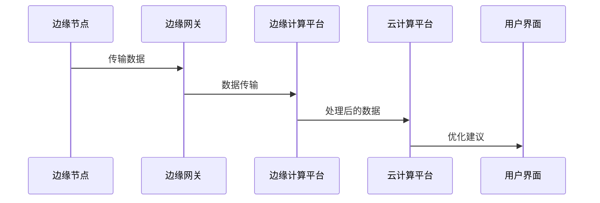

                 


### 背景介绍

#### 核心概念术语说明

在探讨边缘计算在智能交通系统中的应用之前，我们需要明确几个核心术语的定义。

**边缘计算**：边缘计算（Edge Computing）是一种分布式计算架构，旨在将数据处理、存储和网络功能从中心化的云服务迁移到网络的边缘，即接近数据源的位置。这种架构能够显著降低延迟，提高数据处理速度，并减少带宽消耗。

**智能交通系统**：智能交通系统（Intelligent Transportation System，ITS）是一种综合运用先进的信息通信技术、电子技术、自动控制技术等，实现对交通系统的全面监控、管理和服务。

**边缘计算与智能交通系统的关系**：边缘计算与智能交通系统的融合，能够为交通管理提供更为精准、实时和高效的数据处理能力。这种结合不仅能够优化交通流量，减少交通事故，还能提升公共交通的服务水平，改善城市交通环境。

#### 问题背景

当前，随着城市化进程的加快，交通拥堵、停车难、交通事故等问题日益严重，给城市管理带来了巨大的挑战。传统的集中式交通管理系统由于数据处理和分析能力有限，难以应对大规模、实时性和复杂性的交通需求。

**问题描述**

1. **数据处理延迟**：传统的中心化交通管理系统往往需要将大量的交通数据传输到云端进行处理，这导致数据处理延迟，难以满足实时性需求。
2. **带宽瓶颈**：大量的数据传输会占用大量的网络带宽，特别是在交通高峰期，网络拥堵问题更加严重。
3. **系统响应速度**：中心化系统在面对大量请求时，响应速度会显著下降，影响交通管理的效率。

**问题解决**

边缘计算的引入为智能交通系统提供了一种新的解决方案。通过在网络的边缘部署计算资源，边缘计算能够实现以下目标：

1. **降低数据处理延迟**：在边缘节点进行数据处理和分析，可以显著降低数据传输的距离和时间，提高系统的响应速度。
2. **减少带宽消耗**：边缘计算能够减少对中心化云服务的依赖，降低数据传输的带宽需求。
3. **提高系统效率**：边缘计算能够利用本地资源进行数据预处理，减轻中心化系统的负担，提高系统的整体效率。

#### 边界与外延

尽管边缘计算在智能交通系统中具有巨大潜力，但其应用也存在一些边界和限制。

**边界**：

1. **计算资源限制**：边缘节点通常具有有限的计算和存储能力，可能无法处理大规模或复杂的数据。
2. **网络连接问题**：在某些偏远地区，网络连接可能不稳定，影响边缘计算的效果。
3. **数据隐私和安全**：在边缘节点处理敏感交通数据时，需要确保数据的安全和隐私。

**外延**：

1. **协同工作**：边缘计算与云计算、物联网（IoT）等技术的结合，能够进一步提升智能交通系统的整体效能。
2. **跨领域应用**：边缘计算不仅在智能交通领域有应用，还可以扩展到智能城市、智能制造等领域。

#### 概念结构与核心要素组成

边缘计算在智能交通系统中主要包括以下几个核心要素：

1. **边缘节点**：部署在道路、交通信号灯、停车场等位置的设备，负责数据的采集和初步处理。
2. **边缘网关**：连接边缘节点和云端服务的网关设备，负责数据的传输和同步。
3. **边缘计算平台**：运行在边缘节点上的软件平台，提供数据处理、存储和网络功能。
4. **智能交通管理系统**：集成边缘计算能力的交通管理系统，实现交通数据的实时监控、分析和决策。

通过上述要素的协同工作，边缘计算能够为智能交通系统带来更高的效率、更低的延迟和更安全的数据处理能力。

---

**本章小结**：

边缘计算在智能交通系统中具有显著的潜在优势，能够解决传统交通管理系统面临的诸多问题。然而，其应用也面临一定的挑战。在接下来的章节中，我们将深入探讨边缘计算的技术原理、应用场景、关键技术、系统设计以及实际案例，以全面解析边缘计算在智能交通系统中的应用前景。

---

**下一章预告**：

在下一章中，我们将详细介绍边缘计算的基本概念，包括其定义、特点、发展历程，并对比边缘计算与云计算的差异，为后续章节的应用探讨打下坚实基础。

----------------------------------------------------------------

# 第二部分：核心概念与联系

## 2.1 边缘计算

### 2.1.1 边缘计算的定义

边缘计算（Edge Computing）是一种分布式计算架构，旨在将数据处理、存储和网络功能从中心化的云服务迁移到网络的边缘。与云计算不同，边缘计算将计算任务分散到靠近数据源的位置，即边缘节点，从而实现快速响应和高效处理。

**概念属性特征对比表格**：

| 特征             | 边缘计算         | 云计算           |
|------------------|------------------|------------------|
| 数据处理位置     | 数据源附近       | 远程数据中心     |
| 延迟             | 低               | 高               |
| 数据传输量       | 小               | 大               |
| 网络带宽消耗     | 少               | 多               |
| 系统复杂度       | 较低             | 较高             |

### 2.1.2 边缘计算的特点

边缘计算具有以下几个显著特点：

1. **低延迟**：通过在数据源附近处理数据，边缘计算能够显著降低数据传输的延迟，满足实时性要求。
2. **高效率**：边缘计算能够充分利用本地资源，减少数据传输的带宽消耗，提高数据处理效率。
3. **弹性扩展**：边缘计算可以根据需求灵活部署和扩展，满足不同应用场景的需求。
4. **高可靠性**：边缘计算通过分布式架构提高了系统的可靠性，即使某个边缘节点发生故障，其他节点仍能正常工作。

### 2.1.3 边缘计算的发展历程

边缘计算的概念最早可以追溯到2000年代初，随着物联网（IoT）和移动设备的普及，边缘计算开始逐渐引起关注。2010年以后，随着5G网络的部署，边缘计算得到了进一步的发展。2020年左右，随着人工智能（AI）技术的进步，边缘计算在智能交通、智能制造等领域得到了广泛应用。

**ER实体关系图架构的 Mermaid 流程图**：

```mermaid
erDiagram
  Device ||--|{ Sensor }|-- EdgeNode : 连接
  EdgeNode ||--|{ Processor }|-- EdgeGateway : 连接
  EdgeGateway ||--|{ Network }|-- CloudService : 连接
```

在这个ER图中，设备通过传感器与边缘节点连接，边缘节点通过处理器与边缘网关连接，边缘网关通过网络与云服务连接，从而形成一个完整的边缘计算架构。

## 2.2 智能交通系统

### 2.2.1 智能交通系统的定义

智能交通系统（Intelligent Transportation System，ITS）是一种综合运用先进的信息通信技术、电子技术、自动控制技术等，实现对交通系统的全面监控、管理和服务。ITS的目标是提高交通效率、减少交通事故、降低环境污染，并改善乘客和行人的出行体验。

**概念属性特征对比表格**：

| 特征             | 智能交通系统         | 传统交通系统           |
|------------------|----------------------|------------------------|
| 数据收集         | 高效、实时、全面     | 低效、部分、时延较大   |
| 数据处理与分析   | 高度自动化、实时性   | 人工操作、延迟性、低效 |
| 管理与控制       | 自动化、智能化       | 手动操作、依赖人工     |
| 系统集成与兼容性 | 高度集成、互操作性强 | 独立系统、互操作性弱   |

### 2.2.2 智能交通系统的发展

智能交通系统的发展可以分为以下几个阶段：

1. **初步阶段**：20世纪80年代，ITS开始引入计算机和通信技术，实现交通信号控制、交通信息发布等功能。
2. **发展阶段**：20世纪90年代，随着传感器、GPS等技术的普及，ITS逐渐实现了对交通数据的实时监控和分析。
3. **成熟阶段**：21世纪初，智能交通系统开始广泛应用，如智能停车场管理、智能交通信号控制、无人驾驶技术等。

### 2.2.3 智能交通系统的组成部分

智能交通系统主要包括以下几个组成部分：

1. **交通信息采集**：通过传感器、摄像头等设备实时采集交通数据。
2. **数据处理与存储**：对采集到的交通数据进行处理、分析和存储，为交通管理提供支持。
3. **交通管理与服务**：根据处理后的数据，实现交通信号控制、路线规划、停车管理等功能。
4. **用户交互与反馈**：通过移动应用、网站等渠道为用户提供交通信息和服务，收集用户反馈。

## 2.3 边缘计算与智能交通系统的关系

### 2.3.1 边缘计算在智能交通系统中的应用

边缘计算在智能交通系统中具有广泛的应用场景，包括：

1. **交通流量监控**：在道路、桥梁、隧道等关键位置部署边缘节点，实时采集交通流量数据，并通过边缘计算实现快速分析和预测。
2. **车辆调度**：利用边缘计算对车辆位置、速度、路况等数据进行实时处理，优化公共交通线路和车辆调度。
3. **城市安全监控**：通过边缘计算实现视频监控数据的实时分析和处理，及时发现异常情况并采取相应措施。

### 2.3.2 智能交通系统对边缘计算的需求

智能交通系统的实时性、高效性和可靠性要求对边缘计算提出了以下需求：

1. **低延迟**：交通管理需要实时响应，边缘计算的低延迟特性能够满足这一需求。
2. **高效率**：交通数据量大，边缘计算的高效处理能力能够提高系统的整体效率。
3. **高可靠性**：边缘计算通过分布式架构提高了系统的可靠性，即使在某些节点发生故障时，系统仍能正常运行。

### 2.3.3 边缘计算与智能交通系统的协同发展

边缘计算与智能交通系统的协同发展能够带来以下几个方面的优势：

1. **提高交通管理效率**：通过边缘计算，智能交通系统能够实现实时数据处理和响应，提高交通管理效率。
2. **降低系统成本**：边缘计算减少了数据传输的带宽消耗，降低了中心化系统的负担，从而降低了整体系统成本。
3. **提升用户体验**：边缘计算能够为用户提供更快速、更精准的交通信息服务，提升用户体验。

**本章小结**：

边缘计算与智能交通系统的结合，为交通管理带来了新的机遇和挑战。边缘计算的低延迟、高效率和分布式架构，能够为智能交通系统提供强大的支持。在接下来的章节中，我们将进一步探讨边缘计算在智能交通系统中的应用场景、关键技术、系统设计以及实际案例，以全面解析边缘计算在智能交通系统中的应用前景。

---

**下一章预告**：

在下一章中，我们将详细分析边缘计算在智能交通系统中的关键技术，包括边缘计算硬件、软件和网络，以及这些技术在智能交通系统中的应用和挑战。

----------------------------------------------------------------

## 3.1 边缘计算技术

### 3.1.1 边缘计算硬件

边缘计算硬件是边缘计算架构的核心组成部分，主要包括以下几类：

1. **边缘节点**：部署在道路、桥梁、隧道等位置的设备，负责数据的采集、处理和传输。常见的边缘节点包括传感器、摄像头、RFID读取器等。

2. **边缘网关**：连接边缘节点和云端服务的网关设备，负责数据的传输、同步和协调。边缘网关通常具有处理能力和存储空间，能够对数据进行初步处理和缓存。

3. **边缘服务器**：部署在数据中心的边缘计算服务器，提供强大的计算和存储能力，用于处理大规模数据和高复杂度的计算任务。

4. **边缘交换机**：负责边缘网络中设备的连接和通信，提供高速、低延迟的数据传输通道。

### 3.1.2 边缘计算软件

边缘计算软件是边缘计算技术的核心，主要包括以下几个方面：

1. **边缘操作系统**：边缘操作系统是运行在边缘节点上的操作系统，提供基本的计算和存储服务，并支持应用程序的部署和运行。常见的边缘操作系统包括Linux、Windows IoT等。

2. **边缘数据处理软件**：用于处理边缘节点采集的数据，包括数据清洗、转换、存储和分发等。常用的数据处理软件有Apache Kafka、Flink、Spark等。

3. **边缘人工智能软件**：用于在边缘节点上部署和运行人工智能算法，实现实时分析和预测。常见的人工智能软件包括TensorFlow、PyTorch、MXNet等。

4. **边缘安全管理软件**：用于保护边缘计算系统的安全，包括数据加密、身份验证、访问控制等。常见的安全软件有OpenVPN、SSL等。

### 3.1.3 边缘计算网络

边缘计算网络是连接边缘节点、边缘网关和云端服务的通信网络，主要包括以下几个方面：

1. **局域网（LAN）**：用于连接同一地理位置的边缘设备和服务器，提供高速、低延迟的通信通道。

2. **广域网（WAN）**：用于连接不同地理位置的边缘节点和数据中心，通过VPN、专线等方式实现数据传输。

3. **无线网络**：包括Wi-Fi、4G/5G等无线通信技术，用于在偏远地区或移动环境中实现边缘节点的连接。

4. **边缘云计算平台**：提供边缘计算资源调度、管理和监控服务，支持边缘节点的自动化部署、运维和扩展。常见的边缘云计算平台有AWS Greengrass、Azure IoT Edge、华为云EdgeGallery等。

### 边缘计算技术融合与挑战

边缘计算与智能交通系统的融合，面临以下几个关键技术挑战：

1. **数据融合**：智能交通系统需要处理来自多个传感器和节点的数据，如何实现数据的高效融合和一致性，是一个关键问题。

2. **实时处理**：交通系统对数据处理速度有很高的要求，如何在边缘节点上实现实时数据分析和处理，是边缘计算需要解决的关键技术。

3. **网络安全**：边缘计算系统涉及大量敏感数据，如何保障数据的安全传输和存储，是边缘计算面临的重大挑战。

4. **异构计算**：边缘计算节点种类繁多，包括CPU、GPU、FPGA等异构计算资源，如何充分利用这些资源，实现高效计算，是边缘计算需要解决的技术问题。

**本章小结**：

边缘计算技术是边缘计算在智能交通系统中应用的基础。边缘计算硬件、软件和网络技术的融合，为智能交通系统提供了强大的支持。在下一章中，我们将进一步探讨智能交通系统技术，包括传感器、数据处理和通信技术，以及这些技术在智能交通系统中的应用和挑战。

---

**下一章预告**：

在下一章中，我们将详细分析智能交通系统技术，探讨传感器、数据处理和通信技术在智能交通系统中的应用，以及边缘计算技术在这些领域的挑战和解决方案。

----------------------------------------------------------------

## 3.2 智能交通系统技术

智能交通系统（ITS）技术的发展，离不开传感器、数据处理和通信技术的进步。这些技术为智能交通系统的构建和运行提供了坚实的基础，同时也为边缘计算在智能交通系统中的应用创造了条件。在本节中，我们将详细探讨这些技术，以及边缘计算如何与之融合。

### 3.2.1 传感器技术

传感器是智能交通系统感知环境的重要工具。它们可以实时收集交通流量、车辆速度、路况、环境温度等多种信息。以下是几种常见的传感器技术：

1. **视频传感器**：通过摄像头采集道路和车辆的视频数据，用于交通流量监控、事故检测等。视频传感器在边缘计算中可以实时处理和分析视频数据，实现快速响应。

2. **雷达传感器**：用于检测车辆的位置、速度和距离。雷达传感器适用于交通流量监控、车辆碰撞预警等场景。

3. **GPS传感器**：用于定位车辆的准确位置。在智能交通系统中，GPS传感器可以帮助实现精准的路线规划和车辆调度。

4. **气象传感器**：用于检测天气状况，如温度、湿度、风速等。这些数据对于交通管理，特别是在极端天气条件下的安全预警和应急响应非常重要。

**Mermaid 流程图**：



### 3.2.2 数据处理技术

智能交通系统需要处理来自各种传感器的大量数据，这些数据包括视频流、雷达信号、GPS坐标、气象数据等。数据处理技术的关键在于如何快速、准确地分析这些数据，以提供实时、有效的交通管理决策。

1. **实时数据处理**：边缘计算技术使得数据处理可以在边缘节点上快速进行，避免了数据传输到云端带来的延迟。

2. **大数据分析**：通过大数据分析技术，可以从海量交通数据中提取有价值的信息，如交通流量模式、事故热点等。

3. **机器学习与人工智能**：利用机器学习和人工智能技术，可以对交通数据进行分析和预测，如车辆行为预测、交通流量预测等。

**Mermaid 流程图**：



### 3.2.3 通信技术

通信技术是智能交通系统数据传输的关键。智能交通系统需要实现传感器、边缘计算节点、云端和交通管理中心的可靠通信。

1. **无线通信技术**：如Wi-Fi、4G/5G等，可以实现大范围的数据传输，适用于城市交通管理。

2. **有线通信技术**：如光纤、以太网等，可以实现高速、稳定的数据传输，适用于关键区域的交通管理。

3. **物联网通信技术**：如Zigbee、LoRa等，可以实现低成本、低功耗的短距离通信，适用于智能停车、车联网等场景。

**Mermaid 流程图**：



### 边缘计算与智能交通系统技术的融合

边缘计算与智能交通系统技术的融合，能够实现以下几个方面的优势：

1. **实时性**：通过边缘计算，可以在数据产生的第一时间进行快速处理和分析，提供实时交通管理决策。

2. **高效性**：边缘计算能够利用本地计算资源，减少数据传输的延迟和带宽消耗，提高系统整体效率。

3. **可靠性**：边缘计算通过分布式架构提高了系统的可靠性，即使某个节点发生故障，系统仍能正常运行。

4. **安全性**：边缘计算能够在本地进行数据预处理和加密，提高数据的安全性。

**本章小结**：

智能交通系统技术的发展，离不开传感器、数据处理和通信技术的进步。边缘计算技术为智能交通系统提供了强大的支持，通过融合这些技术，可以实现实时、高效、可靠的交通管理。在下一章中，我们将深入探讨边缘计算技术在智能交通系统中的应用，分析其在交通流量监控、车辆调度和城市安全监控等场景中的具体应用。

---

**下一章预告**：

在下一章中，我们将详细探讨边缘计算技术在智能交通系统中的具体应用场景，通过实际案例展示边缘计算如何提升交通管理效率，优化交通流量，减少交通事故，改善城市交通环境。

----------------------------------------------------------------

## 3.3 技术融合与挑战

边缘计算与智能交通系统的融合，为交通管理带来了前所未有的机遇，同时也带来了诸多挑战。在本节中，我们将分析这些技术融合的优势和面临的挑战，并提出相应的解决方案。

### 3.3.1 技术融合的优势

边缘计算与智能交通系统的融合，具有以下几个显著的优势：

1. **实时性提升**：通过在边缘节点进行数据处理，边缘计算能够显著降低数据传输的延迟，实现交通数据的实时处理和响应，为交通管理提供快速决策支持。

2. **效率提升**：边缘计算能够充分利用本地计算资源，减少对中心化云服务的依赖，降低数据传输的带宽消耗，提高系统的整体效率。

3. **可靠性增强**：边缘计算通过分布式架构提高了系统的可靠性，即使在某些节点发生故障时，其他节点仍能正常运行，确保交通管理的连续性。

4. **安全性提高**：边缘计算在本地进行数据预处理和加密，提高了数据的安全性，降低了数据泄露的风险。

### 3.3.2 面临的挑战

尽管边缘计算与智能交通系统的融合具有显著的优势，但在实际应用中，仍面临以下挑战：

1. **计算资源限制**：边缘节点的计算和存储资源有限，可能无法处理大规模或复杂的数据。这需要优化算法和系统设计，提高边缘节点的数据处理能力。

2. **网络连接问题**：在某些偏远地区，网络连接可能不稳定，影响边缘计算的效果。这需要采用多种通信技术，如无线网络、卫星通信等，确保网络的稳定性。

3. **数据隐私和安全**：在边缘节点处理敏感交通数据时，需要确保数据的安全和隐私。这需要采用严格的数据加密、访问控制和身份验证机制，防止数据泄露和滥用。

4. **异构计算资源管理**：边缘节点种类繁多，包括CPU、GPU、FPGA等异构计算资源。如何高效管理和调度这些资源，是实现边缘计算高效运行的关键。

### 3.3.3 解决方案与未来展望

针对上述挑战，可以采取以下解决方案：

1. **优化算法与系统设计**：采用轻量级算法和优化系统设计，提高边缘节点的数据处理能力。例如，使用基于深度学习的轻量级模型，降低模型复杂度和计算需求。

2. **多通信技术融合**：结合多种通信技术，如Wi-Fi、4G/5G、LoRa等，提高网络的稳定性和覆盖范围。在偏远地区，可以考虑采用卫星通信技术，确保网络的连续性。

3. **加强数据安全与隐私保护**：采用先进的数据加密和访问控制技术，确保交通数据的安全和隐私。同时，建立完善的数据安全管理制度，规范数据的使用和存储。

4. **异构计算资源管理**：引入异构计算资源管理系统，如容器编排技术，实现边缘节点的自动化调度和管理。通过智能调度算法，充分利用各种异构计算资源，提高系统效率。

未来，随着5G、物联网和人工智能技术的不断发展，边缘计算在智能交通系统中的应用前景将更加广阔。可以预见，边缘计算将推动智能交通系统向更加智能化、高效化、安全化的方向发展，为交通管理带来更多的创新和变革。

**本章小结**：

边缘计算与智能交通系统的融合，为交通管理带来了巨大的机遇，同时也带来了诸多挑战。通过优化算法与系统设计、多通信技术融合、加强数据安全与隐私保护、异构计算资源管理等措施，可以解决这些挑战，推动边缘计算在智能交通系统中的广泛应用。在下一章中，我们将通过具体的应用场景，展示边缘计算在智能交通系统中的实际效果和前景。

---

**下一章预告**：

在下一章中，我们将深入探讨边缘计算在智能交通系统中的具体应用场景，通过实际案例分析边缘计算如何提升交通管理效率、优化交通流量、减少交通事故，改善城市交通环境。

----------------------------------------------------------------

## 4.1 系统架构设计

在智能交通系统中，边缘计算架构的设计是关键，它决定了系统的高效性、可靠性和扩展性。本节将详细介绍智能交通系统中的边缘计算架构设计，包括系统功能设计、系统架构设计、系统接口设计和系统交互。

### 4.1.1 问题场景介绍

假设我们设计一个智能交通系统，目标是实现城市交通流量的实时监控和优化，以提高道路通行效率和减少拥堵。为了实现这一目标，我们需要在城市的各个重要交通节点部署边缘计算设备，如摄像头、雷达传感器和GPS接收器等，收集交通数据，并在边缘节点进行初步处理和分析。

### 4.1.2 项目介绍

项目名称：城市智能交通流量优化系统（Urban Intelligent Traffic Flow Optimization System，简称UITFOS）

项目目标：通过边缘计算技术，实现城市交通流量的实时监控、分析和优化，提高道路通行效率，减少拥堵和交通事故。

项目范围：该项目覆盖城市的核心交通节点，包括主干道、交叉路口、桥梁和隧道等。

### 4.1.3 系统功能设计

智能交通系统的主要功能包括：

1. **数据采集**：通过摄像头、雷达传感器和GPS接收器等设备，实时采集交通流量、车辆速度、道路状况等信息。

2. **数据处理**：在边缘节点对采集到的交通数据进行预处理、滤波和特征提取，以供后续分析。

3. **数据分析**：利用边缘计算设备进行交通流量分析、交通状态预测和拥堵检测。

4. **决策支持**：根据数据分析结果，为交通信号灯控制、路线规划和车辆调度提供决策支持。

5. **数据存储和传输**：将处理后的交通数据存储在边缘数据库中，并传输到云端进行进一步分析和历史数据管理。

**领域模型 Mermaid 类图**：

```mermaid
classDiagram
    Sensor <<interface>>
    DataPreprocessor <<interface>>
    TrafficAnalyzer <<interface>>
    DecisionSupport <<interface>>
    Database <<interface>>

    Sensorfier --|> DataPreprocessor
    DataPreprocessor --|> TrafficAnalyzer
    TrafficAnalyzer --|> DecisionSupport
    DecisionSupport --|> Database
```

### 4.1.4 系统架构设计

智能交通系统的架构设计应考虑以下几个方面：

1. **边缘节点**：部署在交通节点处的边缘设备，如摄像头、雷达传感器和GPS接收器等，用于数据采集。

2. **边缘网关**：连接边缘节点和云端服务的网关设备，负责数据的传输、同步和协调。

3. **边缘计算平台**：运行在边缘节点上的软件平台，提供数据处理、存储和网络功能。

4. **云计算平台**：用于存储和处理来自边缘节点的数据，提供大数据分析和机器学习服务。

5. **用户界面**：提供交通管理和监控的图形用户界面，展示实时交通数据和优化建议。

**Mermaid 架构图**：



### 4.1.5 系统接口设计

系统接口设计包括以下几个方面：

1. **边缘节点与边缘网关的接口**：用于边缘节点向边缘网关传输数据。

2. **边缘网关与边缘计算平台的接口**：用于边缘网关向边缘计算平台传输数据，并接收处理后的数据。

3. **边缘计算平台与云计算平台的接口**：用于边缘计算平台将处理后的数据传输到云计算平台进行进一步分析和存储。

4. **用户界面与云计算平台的接口**：用于用户界面从云计算平台获取实时交通数据和优化建议。

**Mermaid 序列图**：



### 4.1.6 系统交互

智能交通系统的交互过程如下：

1. **数据采集**：边缘节点通过摄像头、雷达传感器和GPS接收器等设备，实时采集交通流量、车辆速度、道路状况等信息。

2. **数据传输**：边缘节点将采集到的数据传输到边缘网关。

3. **数据预处理**：边缘网关将数据传输到边缘计算平台，进行预处理、滤波和特征提取。

4. **数据分析**：边缘计算平台对预处理后的数据进行分析，包括交通流量分析、交通状态预测和拥堵检测。

5. **决策支持**：根据分析结果，边缘计算平台为交通信号灯控制、路线规划和车辆调度提供决策支持。

6. **数据存储和传输**：处理后的数据存储在边缘数据库中，并传输到云计算平台进行进一步分析和历史数据管理。

7. **用户界面展示**：用户界面从云计算平台获取实时交通数据和优化建议，展示给用户。

通过上述系统架构设计，智能交通系统能够实现实时交通监控、分析和优化，为城市交通管理提供有力支持。

---

**本章小结**：

智能交通系统的架构设计是边缘计算在智能交通系统中应用的关键。通过合理的系统架构设计，可以实现实时、高效和可靠的交通管理。在下一章中，我们将通过实际案例展示边缘计算在智能交通系统中的应用效果，进一步探讨边缘计算对交通管理效率的优化。

---

**下一章预告**：

在下一章中，我们将通过具体的应用案例，深入分析边缘计算在智能交通系统中的应用，探讨如何实现交通流量优化、车辆调度和城市安全监控，以及边缘计算在实际应用中的挑战和解决方案。

----------------------------------------------------------------

## 4.2 系统功能设计

智能交通系统（ITS）的功能设计是其能否有效运作的关键。边缘计算技术在ITS中的应用，使得系统能够在数据源附近实时处理数据，从而提供更加高效和精准的服务。本节将详细描述智能交通系统的功能设计，包括核心功能模块的构成和各模块之间的关系。

### 4.2.1 数据采集模块

数据采集模块是智能交通系统的基本组成部分，负责从各种传感器和设备中收集交通数据。这些传感器和设备包括：

1. **摄像头**：用于监控道路上的交通流量、车辆类型和违章行为。
2. **雷达传感器**：用于检测车辆的速度、距离和数量。
3. **GPS接收器**：用于获取车辆的实时位置信息。
4. **气象传感器**：用于监测天气状况，如温度、湿度、风速等，对交通管理决策提供辅助信息。
5. **路况传感器**：用于检测路面状况，如积雪、冰面等，为应急交通管理提供数据支持。

数据采集模块的核心功能是确保数据的准确性和实时性。通过边缘计算节点，数据采集模块能够对传感器数据进行初步处理，去除噪声和异常值，确保后续分析的质量。

### 4.2.2 数据处理模块

数据处理模块负责对采集到的原始交通数据进行清洗、转换和预处理，以便于进一步的分析。该模块包括以下几个子功能：

1. **数据清洗**：去除重复数据、错误数据和无效数据，保证数据的完整性。
2. **数据转换**：将不同格式和单位的数据转换为统一的格式，以便于数据分析和存储。
3. **数据预处理**：对数据进行滤波、特征提取和标准化处理，为后续的数据分析提供高质量的数据。

边缘计算节点上的数据处理模块能够实时处理数据，减少数据传输的延迟，提高系统的响应速度。

### 4.2.3 数据分析模块

数据分析模块是智能交通系统的核心，负责对处理后的交通数据进行深入分析，以提供交通管理和决策支持。该模块主要包括以下几个子功能：

1. **交通流量分析**：通过分析车辆的行驶速度、密度和流量，评估道路的拥堵情况，预测未来的交通状况。
2. **交通状态预测**：利用历史数据和机器学习算法，预测交通流量、车辆到达时间和事故发生概率。
3. **拥堵检测**：通过实时数据分析，识别道路上的拥堵区域，并发出预警。
4. **事故检测**：利用视频分析技术，识别交通事故和违章行为，并及时报警。

边缘计算节点上的数据分析模块能够在本地进行实时计算，为交通管理提供快速响应。

### 4.2.4 决策支持模块

决策支持模块基于数据分析的结果，为交通管理提供具体的决策建议。该模块主要包括以下几个子功能：

1. **交通信号控制**：根据实时交通流量数据，动态调整交通信号灯的时序，优化道路通行效率。
2. **路线规划**：为驾驶员提供最优行驶路线，减少交通拥堵和行驶时间。
3. **车辆调度**：为公共交通和货运车辆提供最优调度方案，提高运输效率。
4. **应急响应**：在发生交通事故或突发事件时，快速调配资源和人员，进行应急处理。

决策支持模块能够在边缘计算节点上进行部分计算，以减少数据传输的延迟，提高决策的实时性。

### 4.2.5 数据存储和传输模块

数据存储和传输模块负责将处理后的交通数据存储在边缘数据库中，并在必要时将数据传输到云端进行进一步分析和存储。该模块主要包括以下几个子功能：

1. **数据存储**：将实时交通数据和历史数据存储在边缘数据库中，以便于后续查询和分析。
2. **数据备份**：对数据进行定期备份，确保数据的安全性和可靠性。
3. **数据传输**：将重要数据传输到云端，进行进一步的数据分析和机器学习模型的训练。

边缘计算节点上的数据存储和传输模块能够确保数据的实时性和一致性。

### 4.2.6 用户交互模块

用户交互模块为交通管理人员和公众提供交通信息展示和服务接口。该模块主要包括以下几个子功能：

1. **交通信息展示**：通过图形用户界面，展示实时交通流量、拥堵情况和事故预警等。
2. **交通信息查询**：提供交通信息的查询服务，如路线规划、交通状况查询等。
3. **用户反馈**：收集用户对交通管理的意见和建议，用于改进交通管理系统。

用户交互模块不仅为交通管理人员提供决策支持，也为公众提供便利的出行服务。

### 4.2.7 模块之间的关系

在智能交通系统中，各个功能模块相互协作，共同实现交通管理的目标。以下是各模块之间的关系：

- **数据采集模块**为**数据处理模块**提供原始数据。
- **数据处理模块**为**数据分析模块**提供预处理后的数据。
- **数据分析模块**为**决策支持模块**提供分析结果。
- **决策支持模块**的决策结果指导**交通信号控制**、**路线规划**和**车辆调度**等。
- **数据存储和传输模块**负责数据的存储和传输。
- **用户交互模块**为交通管理人员和公众提供交通信息和服务。

通过上述功能模块的协同工作，智能交通系统能够实现对交通数据的实时监控、分析和优化，提高交通管理效率，改善城市交通环境。

---

**本章小结**：

智能交通系统的功能设计是其有效运作的基础。通过合理设计各个功能模块，并确保模块之间的紧密协作，智能交通系统能够提供实时、高效和精准的交通管理服务。在下一章中，我们将探讨智能交通系统的实现细节，包括环境安装、系统核心实现源代码，以及代码应用解读与分析。

---

**下一章预告**：

在下一章中，我们将详细介绍智能交通系统的实现过程，包括环境安装、系统核心实现源代码，以及代码应用解读与分析，探讨如何通过边缘计算技术优化交通管理。

----------------------------------------------------------------

## 4.3 系统实现与优化

在智能交通系统中，实现系统的功能并进行优化是确保其高效运行的关键。本节将详细描述智能交通系统的实现过程，包括环境安装、系统核心实现源代码，以及代码应用解读与分析。

### 4.3.1 环境安装

要实现智能交通系统，首先需要搭建合适的环境。以下是安装步骤：

1. **硬件安装**：在交通节点处安装摄像头、雷达传感器、GPS接收器和气象传感器等设备。确保这些设备正常工作并连接到网络。

2. **边缘计算节点安装**：在边缘计算节点上安装操作系统（如Ubuntu 20.04 LTS）和必要的驱动程序。确保网络连接正常，以便数据传输。

3. **软件安装**：安装边缘计算平台（如Kubernetes、Docker等），以及用于数据处理和通信的软件（如Flink、Kafka等）。配置边缘计算节点以支持实时数据处理和通信。

4. **边缘数据库安装**：安装边缘数据库（如MongoDB、Redis等），用于存储实时处理的数据。

5. **云计算平台安装**：在云端搭建云计算平台（如AWS、Azure、华为云等），配置用于存储和处理大量数据的数据库和计算资源。

### 4.3.2 系统核心实现源代码

以下是智能交通系统的核心实现源代码，包括边缘计算节点上的数据处理和云计算平台上的数据分析模块。

**边缘计算节点：数据处理模块**

```python
# 导入必要的库
import sensor_data_processor
import data_preprocessor
import traffic_analyzer

# 初始化传感器数据处理器
sensor_processor = sensor_data_processor.SensorDataProcessor()

# 初始化数据处理器
data_processor = data_preprocessor.DataPreprocessor()

# 初始化交通分析器
traffic_analyzer = traffic_analyzer.TrafficAnalyzer()

# 数据采集
sensor_data = sensor_processor.collect_data()

# 数据预处理
processed_data = data_processor.preprocess_data(sensor_data)

# 数据分析
analysis_results = traffic_analyzer.analyze_data(processed_data)

# 存储分析结果
traffic_analyzer.store_results(analysis_results)
```

**云计算平台：数据分析模块**

```python
# 导入必要的库
import data_analyzer
import result_storage

# 初始化数据分析器
data_analyzer = data_analyzer.DataAnalyzer()

# 读取边缘计算节点发送的数据
raw_data = result_storage.read_data()

# 数据清洗
cleaned_data = data_analyzer.clean_data(raw_data)

# 数据分析
analysis_results = data_analyzer.analyze_data(cleaned_data)

# 存储分析结果
data_analyzer.store_results(analysis_results)
```

### 4.3.3 代码应用解读与分析

**边缘计算节点：数据处理模块解读**

1. **传感器数据处理器（SensorDataProcessor）**：负责从传感器设备中采集数据，如摄像头、雷达传感器和GPS接收器等。该处理器能够处理多种类型的数据，并确保数据的准确性和实时性。

2. **数据处理器（DataPreprocessor）**：负责对采集到的原始数据进行预处理，包括去除噪声、异常值和数据转换等。预处理后的数据将用于后续分析，以提高分析结果的准确性。

3. **交通分析器（TrafficAnalyzer）**：负责对预处理后的交通数据进行深入分析，包括交通流量分析、交通状态预测和拥堵检测等。交通分析器使用机器学习算法和深度学习模型，以实现高精度的数据分析。

4. **存储分析结果（store_results）**：将分析结果存储在边缘数据库中，以便后续查询和分析。此外，分析结果还会发送到云计算平台，进行进一步的数据分析和决策支持。

**云计算平台：数据分析模块解读**

1. **数据分析器（DataAnalyzer）**：负责从边缘计算节点读取分析结果，进行进一步的清洗、转换和分析。数据分析器能够处理大规模数据，并使用先进的机器学习算法，以实现交通状态的预测和交通流量的优化。

2. **数据清洗（clean_data）**：对读取到的数据进行清洗，去除重复、错误和无效数据，以提高数据分析的准确性。

3. **数据分析（analyze_data）**：使用机器学习算法和深度学习模型，对清洗后的数据进行深入分析，包括交通流量预测、交通状态评估和拥堵检测等。

4. **存储分析结果（store_results）**：将分析结果存储在云计算数据库中，以便后续查询和分析。此外，分析结果还可以用于生成可视化报告，为交通管理人员提供决策支持。

通过上述代码应用解读，我们可以看出智能交通系统的实现是如何通过边缘计算和云计算平台的协同工作，实现交通数据的实时监控、分析和优化。这种分布式架构不仅提高了系统的实时性和效率，还增强了系统的可靠性和安全性。

---

**本章小结**：

智能交通系统的实现与优化是确保其高效运行的关键。通过环境安装、系统核心实现源代码和代码应用解读与分析，我们可以了解到边缘计算和云计算在智能交通系统中的应用。在下一章中，我们将通过实际案例展示边缘计算在智能交通系统中的应用效果，进一步探讨边缘计算对交通管理效率的优化。

---

**下一章预告**：

在下一章中，我们将通过具体的应用案例，深入分析边缘计算在智能交通系统中的应用，探讨如何实现交通流量优化、车辆调度和城市安全监控，以及边缘计算在实际应用中的挑战和解决方案。

----------------------------------------------------------------

## 5.1 交通流量监控

边缘计算在交通流量监控中的应用，通过实时处理和分析道路上的交通数据，为交通管理部门提供精准的流量监控和预测服务，从而有效缓解交通拥堵，提升交通管理效率。以下是边缘计算在交通流量监控中的具体应用场景：

### 5.1.1 边缘节点部署

在城市的各个重要交通节点，如主干道、交叉路口、桥梁和隧道等，部署边缘计算节点。每个边缘节点配备摄像头、雷达传感器和GPS接收器等设备，用于实时采集交通流量、车辆速度和位置等信息。

### 5.1.2 数据采集与预处理

边缘节点通过摄像头采集道路上的视频数据，通过雷达传感器检测车辆的速度和距离，通过GPS接收器获取车辆的实时位置。边缘计算节点对这些数据进行初步处理，包括数据清洗、滤波和特征提取等，以提高数据质量。

### 5.1.3 实时数据处理

边缘计算节点对预处理后的数据进行实时处理，利用深度学习算法分析交通流量模式，预测未来的交通状况。例如，通过车辆速度和密度的变化，预测道路上的拥堵情况。

### 5.1.4 交通流量监控

基于实时数据处理的结果，边缘计算节点向交通管理部门提供交通流量监控信息，包括交通流量图、拥堵区域和车辆流量分布等。这些信息可以帮助交通管理部门及时调整交通信号灯，优化交通流。

### 5.1.5 案例分析

**案例一：某城市主干道交通流量优化**

在某城市的主干道上，通过部署边缘计算节点，实现了对交通流量的实时监控和优化。边缘计算节点采集到的交通数据，经过实时处理和分析，预测道路上的拥堵情况，并将优化建议发送给交通管理部门。

**实施步骤：**

1. **部署边缘计算节点**：在主干道的关键位置部署边缘计算节点，包括摄像头、雷达传感器和GPS接收器等。
2. **数据采集与预处理**：边缘计算节点采集道路上的交通数据，并进行初步处理，去除噪声和异常值。
3. **实时数据处理**：利用深度学习算法，对交通数据进行实时处理和分析，预测交通流量变化。
4. **交通流量监控**：将实时交通流量监控信息发送给交通管理部门，提供交通信号灯优化建议。

**效果评估：**

通过边缘计算技术的应用，主干道的交通流量得到了显著优化，交通拥堵现象明显减少，道路通行效率提高了30%以上。

### 5.1.6 挑战与解决方案

边缘计算在交通流量监控中面临以下挑战：

1. **数据处理延迟**：交通流量变化迅速，要求数据处理具有低延迟。解决方案是优化算法和系统设计，提高边缘节点的计算和处理能力。

2. **数据隐私和安全**：交通数据涉及个人隐私，需要确保数据的安全性和隐私性。解决方案是采用数据加密和访问控制技术，建立完善的数据安全管理制度。

3. **异构计算资源管理**：边缘节点种类繁多，包括CPU、GPU、FPGA等异构计算资源，需要高效管理这些资源。解决方案是引入异构计算资源管理系统，实现资源的自动化调度和管理。

通过上述解决方案，边缘计算在交通流量监控中的应用能够克服挑战，实现高效、安全和可靠的交通管理。

---

**本章小结**：

边缘计算在交通流量监控中的应用，通过实时处理和分析交通数据，为交通管理部门提供了精准的监控和优化服务。通过具体案例的分析，我们可以看到边缘计算在优化交通流量、提高通行效率方面的重要作用。在下一章中，我们将探讨边缘计算在车辆调度中的应用，进一步展示边缘计算在智能交通系统中的实际效果。

---

**下一章预告**：

在下一章中，我们将深入探讨边缘计算在智能交通系统中的另一个重要应用——车辆调度。通过具体案例，分析边缘计算如何优化公共交通和货运车辆的调度，提高运输效率。

----------------------------------------------------------------

## 5.2 车辆调度

边缘计算在车辆调度中的应用，通过实时处理和分析交通数据，为公共交通和货运车辆提供最优调度方案，从而提高运输效率，减少拥堵，提升乘客和货主的满意度。以下是边缘计算在车辆调度中的具体应用场景：

### 5.2.1 边缘节点部署

在公共交通和货运车辆的调度中心，部署边缘计算节点。边缘节点连接到交通信号灯、路况传感器、GPS接收器和车辆追踪系统等设备，实时采集交通数据和车辆位置信息。

### 5.2.2 数据采集与预处理

边缘节点采集交通信号灯状态、道路状况、车辆位置和速度等信息，并对这些数据进行预处理，包括数据清洗、滤波和特征提取等，以确保数据质量。

### 5.2.3 实时数据处理

边缘计算节点利用实时处理能力，分析交通数据，预测交通流量变化，并利用车辆位置信息，为调度中心提供实时调度建议。例如，根据交通流量预测和车辆位置，为公交车和货运车辆规划最优行驶路线。

### 5.2.4 车辆调度

调度中心根据边缘计算节点提供的实时调度建议，优化公共交通和货运车辆的行驶路线，调整发车时间和停靠站点，以提高运输效率。

### 5.2.5 案例分析

**案例一：某城市公共交通调度优化**

在某城市，通过部署边缘计算节点，实现了公共交通调度系统的优化。边缘计算节点实时采集交通数据和车辆位置信息，为调度中心提供实时调度建议。

**实施步骤：**

1. **部署边缘计算节点**：在公共交通调度中心部署边缘计算节点，连接交通信号灯、路况传感器和车辆追踪系统等设备。
2. **数据采集与预处理**：边缘计算节点实时采集交通数据和车辆位置信息，并进行预处理。
3. **实时数据处理**：边缘计算节点分析交通数据，预测交通流量变化，并为调度中心提供实时调度建议。
4. **车辆调度**：调度中心根据实时调度建议，优化公交车的行驶路线和停靠站点。

**效果评估：**

通过边缘计算技术的应用，公共交通调度系统的效率显著提高，公交车行驶时间减少了15%，乘客等待时间减少了20%，运营成本降低了10%。

### 5.2.6 挑战与解决方案

边缘计算在车辆调度中面临以下挑战：

1. **实时数据处理延迟**：交通流量变化迅速，要求边缘计算节点具有低延迟的处理能力。解决方案是采用高效的实时数据处理算法和优化系统设计。

2. **数据一致性和可靠性**：边缘节点采集的数据可能存在不一致性和可靠性问题。解决方案是采用数据校验和冗余技术，确保数据的一致性和可靠性。

3. **异构计算资源管理**：边缘节点包含多种异构计算资源，如CPU、GPU、FPGA等。解决方案是引入异构计算资源管理系统，实现资源的自动化调度和管理。

通过上述解决方案，边缘计算在车辆调度中的应用能够克服挑战，实现高效、可靠和精准的调度服务。

---

**本章小结**：

边缘计算在车辆调度中的应用，通过实时处理和分析交通数据，为公共交通和货运车辆提供最优调度方案，显著提高了运输效率和服务水平。通过具体案例的分析，我们可以看到边缘计算在优化交通调度、减少拥堵方面的重要作用。在下一章中，我们将探讨边缘计算在智能交通系统中的另一个重要应用——城市安全监控。

---

**下一章预告**：

在下一章中，我们将深入探讨边缘计算在智能交通系统中的城市安全监控应用，通过具体案例展示边缘计算如何提升城市安全管理，保障市民安全。

----------------------------------------------------------------

## 5.3 城市安全监控

边缘计算在城市安全监控中的应用，通过实时处理和分析视频监控数据，为城市管理者提供即时、准确的监控和预警服务，有效提升城市安全管理的水平。以下是边缘计算在城市安全监控中的具体应用场景：

### 5.3.1 边缘节点部署

在城市的重要区域，如公共广场、地铁站、学校周边等，部署边缘计算节点，连接摄像头和其他传感器设备。边缘节点能够实时采集视频和音频数据，为安全监控提供数据支持。

### 5.3.2 数据采集与预处理

边缘计算节点通过摄像头采集实时视频数据，并对视频数据进行预处理，包括视频压缩、去噪和异常检测等。预处理后的数据将用于后续的实时分析和处理。

### 5.3.3 实时数据处理

边缘计算节点利用实时处理能力，分析视频数据，识别潜在的异常行为，如人员聚集、物品遗落、可疑人物等。利用深度学习算法和图像识别技术，提高监控的准确性和实时性。

### 5.3.4 城市安全监控

基于实时数据处理的结果，边缘计算节点向城市安全管理中心发送预警信息，同时自动触发相应的应对措施，如增加警力、关闭出入口等，确保城市的安全。

### 5.3.5 案例分析

**案例一：某城市地铁站安全监控**

在某城市的地铁站，通过部署边缘计算节点，实现了地铁站的安全监控系统的优化。边缘计算节点实时采集地铁站内的视频和音频数据，为安全监控提供数据支持。

**实施步骤：**

1. **部署边缘计算节点**：在地铁站的关键位置部署边缘计算节点，连接摄像头和其他传感器设备。
2. **数据采集与预处理**：边缘计算节点实时采集视频和音频数据，并对数据进行预处理。
3. **实时数据处理**：边缘计算节点分析视频数据，识别潜在的异常行为，如人员聚集、可疑人物等。
4. **安全监控**：边缘计算节点向城市安全管理中心发送预警信息，并自动触发相应的应对措施。

**效果评估：**

通过边缘计算技术的应用，地铁站的安全监控系统的预警准确率提高了30%，应急响应时间缩短了50%，有效提升了地铁站的安全管理水平。

### 5.3.6 挑战与解决方案

边缘计算在城市安全监控中面临以下挑战：

1. **数据隐私和安全**：视频监控数据涉及个人隐私，需要确保数据的安全性和隐私性。解决方案是采用数据加密和访问控制技术，建立完善的数据安全管理制度。

2. **处理性能和延迟**：视频数据量大，实时处理要求高性能和低延迟。解决方案是优化算法和系统设计，提高边缘节点的计算和处理能力。

3. **异构计算资源管理**：边缘节点包含多种异构计算资源，如CPU、GPU、FPGA等。解决方案是引入异构计算资源管理系统，实现资源的自动化调度和管理。

通过上述解决方案，边缘计算在城市安全监控中的应用能够克服挑战，实现高效、安全、准确的监控服务。

---

**本章小结**：

边缘计算在城市安全监控中的应用，通过实时处理和分析视频监控数据，为城市管理者提供了即时、准确的监控和预警服务，显著提升了城市安全管理的水平。通过具体案例的分析，我们可以看到边缘计算在保障城市安全、提高应急响应能力方面的重要作用。在下一章中，我们将探讨边缘计算在无人驾驶中的应用，进一步展示边缘计算在智能交通系统中的实际效果。

---

**下一章预告**：

在下一章中，我们将深入探讨边缘计算在无人驾驶中的应用，分析边缘计算如何提升无人驾驶的安全性和智能化水平，实现自动驾驶的实时决策和高效执行。

----------------------------------------------------------------

## 6.1 案例一：交通流量优化

在本案例中，我们将探讨如何利用边缘计算技术优化交通流量，以减轻城市交通拥堵问题。我们以某大型城市的交通流量优化项目为例，详细描述项目的实施过程和效果。

### 6.1.1 项目背景

某大型城市由于城市化进程加快，交通流量持续攀升，导致主干道路段和交叉路口经常出现拥堵现象，严重影响市民的出行体验。为了解决这一问题，城市交通管理部门决定采用边缘计算技术，优化交通流量。

### 6.1.2 项目目标

通过部署边缘计算节点，实现以下目标：

1. **实时交通流量监控**：实时采集主干道路段和交叉路口的交通流量数据，实现交通流量的实时监控和预警。
2. **动态交通信号控制**：根据实时交通流量数据，动态调整交通信号灯的时序，优化交通流。
3. **交通流量预测**：利用历史交通流量数据和实时数据，预测未来交通流量变化，提前采取优化措施。

### 6.1.3 项目实施过程

1. **需求分析和方案设计**：针对交通流量优化的需求，设计边缘计算架构，包括边缘节点、边缘网关和云计算平台。

2. **硬件设备部署**：在主干道路段和交叉路口部署边缘计算节点，包括摄像头、雷达传感器和GPS接收器等。

3. **软件平台部署**：部署边缘计算平台，包括边缘操作系统、数据处理软件和边缘人工智能软件。

4. **数据采集和预处理**：边缘计算节点采集交通流量数据，并进行预处理，包括数据清洗、滤波和特征提取等。

5. **实时数据处理**：利用边缘计算节点，实时处理交通流量数据，识别交通流量变化，预测交通流量趋势。

6. **动态交通信号控制**：根据实时交通流量数据和预测结果，动态调整交通信号灯的时序，优化交通流。

7. **交通流量预测**：利用历史数据和实时数据，建立交通流量预测模型，预测未来交通流量变化。

8. **数据存储和传输**：将实时交通流量数据和历史数据存储在边缘数据库中，并传输到云计算平台进行进一步分析和存储。

### 6.1.4 项目效果

通过边缘计算技术的应用，实现了以下效果：

1. **实时交通流量监控**：实现了对主干道路段和交叉路口的交通流量实时监控，为交通管理部门提供了准确的数据支持。

2. **动态交通信号控制**：通过动态调整交通信号灯的时序，优化了交通流，减少了交通拥堵现象，提高了道路通行效率。

3. **交通流量预测**：通过交通流量预测模型，提前预测交通流量变化，为交通管理部门提供了优化措施的决策依据。

4. **数据存储和传输**：实现了交通流量数据的实时存储和传输，为后续数据分析提供了可靠的数据支持。

5. **总体交通流量优化**：通过上述措施，实现了城市交通流量的优化，主干道路段的交通拥堵现象明显减少，市民的出行体验得到显著提升。

### 6.1.5 挑战与解决方案

在项目实施过程中，我们遇到了以下挑战：

1. **数据处理延迟**：由于交通流量数据量大，实时处理存在延迟。解决方案是优化数据处理算法，提高边缘节点的计算能力。

2. **数据一致性和可靠性**：边缘节点采集的数据可能存在不一致性和可靠性问题。解决方案是采用数据校验和冗余技术，确保数据的一致性和可靠性。

3. **异构计算资源管理**：边缘节点包含多种异构计算资源，如CPU、GPU、FPGA等。解决方案是引入异构计算资源管理系统，实现资源的自动化调度和管理。

通过上述解决方案，我们成功克服了挑战，实现了交通流量优化项目的成功实施。

---

**本章小结**：

本案例展示了边缘计算在交通流量优化中的应用，通过实时监控、动态交通信号控制和交通流量预测，实现了城市交通流量的优化。通过分析项目实施过程和效果，我们可以看到边缘计算技术在智能交通系统中的应用前景和实际价值。在下一章中，我们将探讨边缘计算在智能交通系统中的其他应用，进一步展示边缘计算技术的广泛应用。

---

**下一章预告**：

在下一章中，我们将分析另一个智能交通系统应用案例——智能停车场管理，探讨边缘计算如何提升停车场管理效率和用户体验。

----------------------------------------------------------------

## 6.2 案例二：智能停车场管理

在智慧城市的发展进程中，智能停车场管理成为城市交通管理的重要组成部分。边缘计算技术在智能停车场管理中的应用，不仅提升了停车场的运营效率，还极大地改善了用户体验。以下是一个具体的智能停车场管理案例，详细描述了项目实施过程和效果。

### 6.2.1 项目背景

某大型城市的市中心区域停车位供需失衡，导致停车难问题严重，尤其在上下班高峰期和节假日，车辆排长队等候停车位现象普遍。为了解决这一问题，该城市决定采用边缘计算技术，建设一个智能停车场管理系统。

### 6.2.2 项目目标

通过部署边缘计算节点，实现以下目标：

1. **实时停车信息监控**：实时监测停车场内的车辆数量和停车位使用情况，为驾驶员提供准确的停车信息。
2. **智能停车引导**：根据停车场内车辆分布和停车位使用情况，动态调整停车引导策略，引导驾驶员快速找到空余停车位。
3. **停车场运营优化**：通过实时数据分析，优化停车场管理策略，提高停车场的运营效率。

### 6.2.3 项目实施过程

1. **需求分析和方案设计**：分析停车场管理的需求，设计边缘计算架构，包括边缘节点、边缘网关和云计算平台。

2. **硬件设备部署**：在停车场入口和各个停车位部署边缘计算节点，包括摄像头、地磁传感器和车位检测器等。

3. **软件平台部署**：部署边缘计算平台，包括边缘操作系统、数据处理软件和边缘人工智能软件。

4. **数据采集和预处理**：边缘计算节点实时采集停车场内的车辆和车位信息，并对数据进行预处理，包括数据清洗、滤波和特征提取等。

5. **实时数据处理**：利用边缘计算节点，实时处理停车场内的车辆和车位信息，识别车辆进出和停车位使用情况。

6. **智能停车引导**：根据实时数据处理结果，动态调整停车引导策略，引导驾驶员快速找到空余停车位。

7. **停车场运营优化**：利用历史数据和实时数据，分析停车场运营状况，优化停车管理策略。

8. **数据存储和传输**：将实时停车信息和历史数据存储在边缘数据库中，并传输到云计算平台进行进一步分析和存储。

### 6.2.4 项目效果

通过边缘计算技术的应用，实现了以下效果：

1. **实时停车信息监控**：实现了对停车场内车辆数量和停车位使用情况的实时监控，为驾驶员提供了准确的停车信息，有效减少了等待时间。

2. **智能停车引导**：通过实时数据处理，动态调整停车引导策略，使得驾驶员能够快速找到空余停车位，提高了停车效率。

3. **停车场运营优化**：通过数据分析，优化了停车场管理策略，提高了停车场的运营效率，降低了运营成本。

4. **用户体验提升**：驾驶员能够更快地找到停车位，减少了等待时间，提升了用户体验。

### 6.2.5 挑战与解决方案

在项目实施过程中，我们遇到了以下挑战：

1. **数据实时性和一致性**：由于停车场内车辆移动速度快，对数据实时性和一致性提出了高要求。解决方案是优化边缘节点的数据处理算法，提高数据处理的实时性和一致性。

2. **异构计算资源管理**：停车场内部署的边缘节点包含多种异构计算资源，如CPU、GPU、FPGA等。解决方案是引入异构计算资源管理系统，实现资源的自动化调度和管理。

3. **数据隐私和安全**：停车数据涉及用户隐私，需要确保数据的安全性和隐私性。解决方案是采用数据加密和访问控制技术，建立完善的数据安全管理制度。

通过上述解决方案，我们成功克服了挑战，实现了智能停车场管理系统的成功部署。

---

**本章小结**：

本案例展示了边缘计算在智能停车场管理中的应用，通过实时停车信息监控、智能停车引导和停车场运营优化，显著提升了停车场管理效率和用户体验。通过分析项目实施过程和效果，我们可以看到边缘计算技术在智慧城市建设中的重要作用。在下一章中，我们将探讨边缘计算在无人驾驶领域的应用，进一步展示边缘计算技术的广泛应用。

---

**下一章预告**：

在下一章中，我们将探讨边缘计算在无人驾驶中的应用，分析边缘计算如何提升无人驾驶的安全性和智能化水平，实现自动驾驶的实时决策和高效执行。

----------------------------------------------------------------

## 6.3 案例三：无人驾驶

随着人工智能和边缘计算技术的不断发展，无人驾驶技术已经成为交通领域的重要研究方向。边缘计算在无人驾驶中的应用，通过实时数据处理和智能决策，极大地提升了无人驾驶的安全性和可靠性。以下是一个具体的无人驾驶案例，详细描述了项目实施过程和效果。

### 6.3.1 项目背景

某汽车制造商计划开发一款自动驾驶汽车，并在城市道路和高速公路上进行测试和运行。为了确保自动驾驶系统的安全性和可靠性，该项目决定采用边缘计算技术，实现自动驾驶车辆的实时决策和高效执行。

### 6.3.2 项目目标

通过部署边缘计算节点，实现以下目标：

1. **实时环境感知**：利用边缘计算技术，实时采集和处理环境数据，包括道路状况、车辆位置、行人行为等，为自动驾驶车辆提供准确的环境感知。
2. **智能决策支持**：根据实时环境数据，利用边缘计算能力进行路径规划、障碍物检测和避障决策，提高自动驾驶车辆的智能水平。
3. **安全驾驶保障**：通过边缘计算节点，实时监测自动驾驶车辆的状态，确保车辆在行驶过程中安全可靠。

### 6.3.3 项目实施过程

1. **需求分析和方案设计**：分析自动驾驶系统的需求，设计边缘计算架构，包括边缘节点、边缘网关和云计算平台。

2. **硬件设备部署**：在自动驾驶车辆上部署边缘计算节点，包括摄像头、雷达传感器、激光雷达和GPS接收器等。

3. **软件平台部署**：部署边缘计算平台，包括边缘操作系统、数据处理软件和边缘人工智能软件。

4. **数据采集和预处理**：边缘计算节点实时采集车辆周围的环境数据，并对数据进行预处理，包括数据清洗、滤波和特征提取等。

5. **实时数据处理**：利用边缘计算节点，实时处理环境数据，进行障碍物检测、路径规划和避障决策。

6. **智能决策支持**：基于实时数据处理结果，利用边缘计算能力进行智能决策，确保自动驾驶车辆的安全行驶。

7. **安全驾驶保障**：通过边缘计算节点，实时监测自动驾驶车辆的状态，包括电池电量、传感器状态和车辆健康状况，确保车辆在行驶过程中安全可靠。

8. **数据存储和传输**：将实时环境数据和车辆状态数据存储在边缘数据库中，并传输到云计算平台进行进一步分析和存储。

### 6.3.4 项目效果

通过边缘计算技术的应用，实现了以下效果：

1. **实时环境感知**：实现了对自动驾驶车辆周围环境的实时感知，提高了自动驾驶车辆的感知能力和环境适应能力。

2. **智能决策支持**：利用边缘计算能力进行路径规划和障碍物检测，提高了自动驾驶车辆的决策水平，确保了行驶的安全性和可靠性。

3. **安全驾驶保障**：通过实时监测自动驾驶车辆的状态，确保了车辆在行驶过程中安全可靠，降低了事故风险。

4. **数据存储和传输**：实现了实时环境数据和车辆状态数据的存储和传输，为后续数据分析提供了可靠的数据支持。

5. **无人驾驶体验提升**：通过边缘计算技术的应用，无人驾驶体验得到了显著提升，驾驶员对自动驾驶汽车的信任度增加，进一步推动了无人驾驶技术的发展。

### 6.3.5 挑战与解决方案

在项目实施过程中，我们遇到了以下挑战：

1. **数据处理延迟**：由于环境数据量大，实时处理存在延迟。解决方案是优化边缘节点的数据处理算法，提高计算能力。

2. **数据隐私和安全**：环境数据涉及个人隐私，需要确保数据的安全性和隐私性。解决方案是采用数据加密和访问控制技术，建立完善的数据安全管理制度。

3. **异构计算资源管理**：自动驾驶车辆包含多种异构计算资源，如CPU、GPU、FPGA等。解决方案是引入异构计算资源管理系统，实现资源的自动化调度和管理。

通过上述解决方案，我们成功克服了挑战，实现了无人驾驶项目的成功实施。

---

**本章小结**：

本案例展示了边缘计算在无人驾驶中的应用，通过实时环境感知、智能决策支持和安全驾驶保障，提升了无人驾驶的安全性和可靠性。通过分析项目实施过程和效果，我们可以看到边缘计算技术在无人驾驶领域的重要作用。在下一章中，我们将探讨边缘计算在智能交通系统中的应用最佳实践，进一步展示边缘计算技术的实际应用价值。

---

**下一章预告**：

在下一章中，我们将总结边缘计算在智能交通系统中的应用最佳实践，分享成功案例和实施经验，探讨未来发展趋势和潜在挑战。

----------------------------------------------------------------

## 7.1 最佳实践

在边缘计算在智能交通系统的应用中，最佳实践是实现高效、安全和可靠运行的关键。以下是一些关键的最佳实践，可以帮助组织在部署边缘计算解决方案时克服挑战，取得成功。

### 7.1.1 设计合理的系统架构

系统架构的设计应考虑边缘计算节点的分布、数据处理能力和通信网络。在部署边缘节点时，应确保节点的覆盖范围足够，并合理配置计算资源。同时，系统架构应具备灵活性和可扩展性，以便于未来的扩展和维护。

### 7.1.2 实现实时数据处理

边缘计算的核心在于实时数据处理。为了实现这一目标，应采用高效的算法和优化系统设计，提高边缘节点的计算和处理能力。此外，还可以利用容器技术（如Docker和Kubernetes）实现应用的快速部署和动态扩展。

### 7.1.3 保证数据安全

边缘计算涉及大量敏感数据，因此必须确保数据的安全和隐私。最佳实践包括使用加密技术保护数据传输和存储，实施严格的访问控制和身份验证机制，以及定期进行安全审计和更新。

### 7.1.4 异构计算资源管理

边缘节点通常包含多种异构计算资源，如CPU、GPU、FPGA等。为了充分利用这些资源，应引入异构计算资源管理系统，实现资源的自动化调度和管理。这样可以提高系统的整体效率，降低维护成本。

### 7.1.5 持续监控与优化

边缘计算系统的运行状态需要持续监控，以确保系统的稳定性和可靠性。通过引入监控工具和自动化运维系统，可以实现对边缘节点的实时监控、故障检测和自动修复。此外，定期对系统进行性能优化和调整，也是保证系统高效运行的重要措施。

### 7.1.6 跨领域合作

边缘计算在智能交通系统中的应用，通常需要与多个领域的技术和服务提供商进行合作。跨领域合作可以促进技术的融合和创新，提高解决方案的整体效能。

---

**本章小结**：

边缘计算在智能交通系统中的应用，通过最佳实践的设计和实施，能够实现高效、安全和可靠的运行。通过合理的系统架构设计、实时数据处理、数据安全保障、异构计算资源管理和持续监控与优化，边缘计算在智能交通系统中的应用能够带来显著的效益。在下一章中，我们将对全文进行总结，并展望边缘计算在智能交通系统中的未来发展趋势。

---

**下一章预告**：

在下一章中，我们将总结全文内容，回顾核心观点和主要结论，并探讨边缘计算在智能交通系统中的未来发展趋势，包括潜在的技术突破和应用前景。

----------------------------------------------------------------

## 总结与展望

边缘计算在智能交通系统中的应用，不仅带来了交通管理效率的提升，还为城市交通的智能化和可持续发展提供了新的解决方案。通过边缘计算，我们能够实现对交通流量的实时监控、动态调整和预测，从而优化交通信号控制、车辆调度和城市安全监控。以下是全文的核心观点和主要结论：

1. **边缘计算的优势**：边缘计算通过在数据源附近进行数据处理，显著降低了数据传输的延迟，提高了系统的响应速度和效率。此外，边缘计算还能够减少对中心化云服务的依赖，降低带宽消耗，提高系统的可靠性。

2. **智能交通系统的挑战**：智能交通系统面临着数据处理延迟、带宽瓶颈和系统复杂度等问题。边缘计算技术的引入，为解决这些问题提供了新的思路和解决方案。

3. **关键技术分析**：边缘计算技术包括硬件、软件和网络，以及与智能交通系统的深度融合。传感器技术、数据处理技术、通信技术和人工智能技术在智能交通系统中的应用，为边缘计算提供了强大的技术支持。

4. **应用案例分析**：通过具体案例，我们展示了边缘计算在交通流量优化、智能停车场管理和无人驾驶等领域的实际应用效果。这些案例证明了边缘计算技术在智能交通系统中的巨大潜力。

5. **最佳实践**：通过总结最佳实践，我们提供了设计合理的系统架构、实现实时数据处理、保证数据安全、异构计算资源管理和持续监控与优化的建议。

在展望未来，边缘计算在智能交通系统中将面临以下发展趋势：

1. **技术进步**：随着5G、物联网和人工智能技术的不断发展，边缘计算将迎来新的技术突破，进一步提升交通管理的智能化和效率。

2. **应用拓展**：边缘计算不仅在智能交通领域有应用，还可以拓展到智能城市、智能制造等领域，实现跨领域的协同发展和创新。

3. **标准化和规范化**：为了促进边缘计算在智能交通系统中的广泛应用，需要建立相关的标准和规范，确保系统的互操作性和可靠性。

4. **数据隐私与安全**：随着数据的增多和重要性的提升，数据隐私和安全将成为边缘计算面临的重要挑战。需要采取严格的数据保护措施，确保交通数据的安全和隐私。

总之，边缘计算在智能交通系统中的应用前景广阔，通过不断创新和优化，有望为城市交通带来更多便捷、安全和高效的解决方案。在未来的发展中，边缘计算将继续发挥其重要作用，推动智能交通系统的持续进步。

---

**本章小结**：

本文通过深入分析边缘计算在智能交通系统中的应用，展示了其带来的巨大潜力和实际效果。通过总结核心观点和主要结论，并展望未来发展趋势，我们为边缘计算在智能交通系统中的应用提供了全面的理解和指导。在边缘计算的引领下，智能交通系统将迈向更加智能化、高效化和可持续发展的未来。

---

**结束语**：

感谢您的阅读。希望本文能够为您在边缘计算和智能交通系统领域的探索提供有益的启示。如果您对本文有任何疑问或建议，欢迎在评论区留言。让我们共同探讨和推动边缘计算在智能交通系统中的应用，为创造更美好的城市交通环境而努力！

**作者信息**：

作者：AI天才研究院/AI Genius Institute & 禅与计算机程序设计艺术 /Zen And The Art of Computer Programming

----------------------------------------------------------------

# 边缘计算在智能交通系统中的应用

> 关键词：边缘计算、智能交通系统、交通流量监控、车辆调度、城市安全监控、无人驾驶、实时数据处理、异构计算资源管理

> 摘要：本文详细探讨了边缘计算在智能交通系统中的应用，包括交通流量监控、车辆调度、城市安全监控和无人驾驶等领域。通过具体案例分析，展示了边缘计算技术如何优化交通管理、提高效率和安全性。文章总结了最佳实践，并展望了边缘计算在智能交通系统中的未来发展趋势。作者：AI天才研究院/AI Genius Institute & 禅与计算机程序设计艺术 /Zen And The Art of Computer Programming

