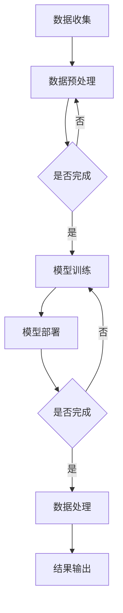
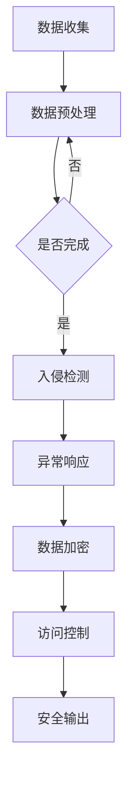
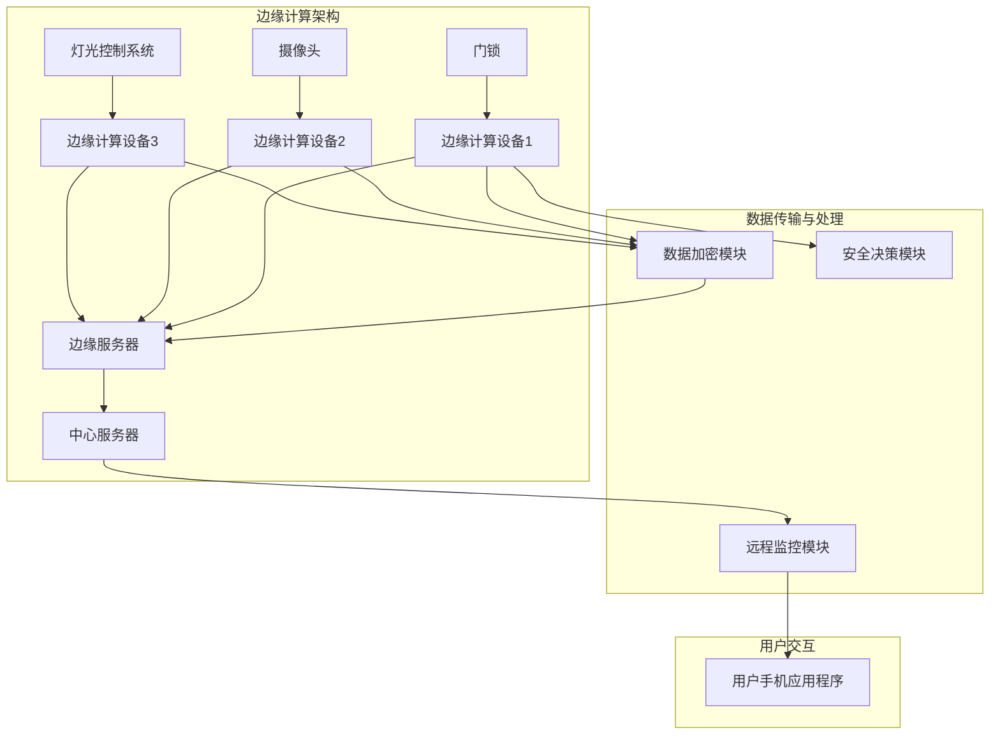
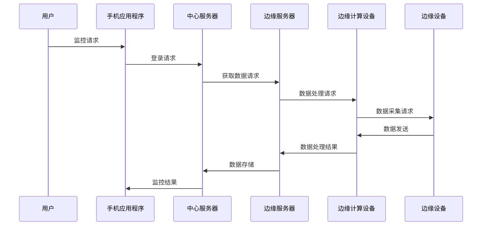

                 

# 边缘计算在智能家居安全中的应用

> 关键词：边缘计算、智能家居、安全、算法、系统架构、最佳实践

> 摘要：本文将探讨边缘计算在智能家居安全中的应用，通过对边缘计算和智能家居安全的背景介绍、核心概念联系、算法原理讲解、数学模型和数学公式讲解、系统分析与架构设计方案、项目实战以及最佳实践 tips 等方面的深入分析，为读者呈现一个全面、深入的智能家居安全边缘计算解决方案。

## 引言

随着物联网（IoT）技术的快速发展，智能家居已经成为人们日常生活中不可或缺的一部分。智能家居系统通过连接各种家电设备、传感器和控制系统，实现家庭环境的智能化管理，提高了人们的生活品质。然而，随着智能家居设备的增多，其安全问题也日益凸显。近年来，智能家居安全事件频发，如黑客入侵、隐私泄露等，对用户的安全和隐私造成了严重威胁。

边缘计算作为一种新兴的计算模式，通过在靠近数据源头的地方进行计算和处理，可以减少数据传输的延迟和带宽消耗，提高系统的响应速度和安全性。边缘计算在智能家居安全中的应用，有望解决现有智能家居安全体系中存在的诸多问题。

本文将围绕边缘计算在智能家居安全中的应用，逐步分析以下方面：

1. **背景介绍**：介绍边缘计算和智能家居安全的背景，阐述边缘计算在智能家居安全中的必要性。
2. **核心概念与联系**：阐述边缘计算和智能家居安全的核心概念，分析两者之间的联系。
3. **算法原理讲解**：讲解边缘计算和智能家居安全相关的算法原理，通过算法流程图和Python代码进行说明。
4. **数学模型和数学公式讲解**：介绍边缘计算和智能家居安全相关的数学模型和数学公式，通过实际例子进行说明。
5. **系统分析与架构设计方案**：介绍智能家居安全系统的场景、功能设计、系统架构设计、系统接口设计和系统交互。
6. **项目实战**：通过实际项目案例，展示边缘计算在智能家居安全中的应用。
7. **最佳实践 tips**：总结边缘计算在智能家居安全中实施的最佳实践，提供性能优化策略。

通过本文的阅读，读者将全面了解边缘计算在智能家居安全中的应用，掌握相关技术原理和实施方法，为智能家居安全领域的研究和应用提供有益的参考。

## 第一部分：背景介绍

### 边缘计算概述

边缘计算（Edge Computing）是指将计算、存储和网络功能分布到网络边缘，即在数据产生的地方进行处理，而不是将所有数据传输到中心服务器进行集中处理。边缘计算的核心思想是减少数据传输的延迟和带宽消耗，提高系统的响应速度和效率。

边缘计算起源于物联网（IoT）和大数据技术的发展需求。随着物联网设备的增多，大量的数据需要在边缘进行实时处理和分析，以支持实时决策和智能响应。传统的集中式计算模式已无法满足这种需求，边缘计算应运而生。

边缘计算的主要特点包括：

- **低延迟**：数据在边缘进行计算和处理，可以显著降低传输延迟，满足实时性要求。
- **高带宽**：边缘计算可以释放中心服务器的带宽压力，提高整个网络的传输效率。
- **高效能**：边缘计算可以充分利用边缘设备的能力，实现分布式计算，提高系统的整体性能。
- **安全性**：边缘计算可以降低数据传输量，减少数据泄露的风险。

### 智能家居安全问题背景

智能家居系统通过连接各种家电设备、传感器和控制系统，实现家庭环境的智能化管理。然而，随着智能家居设备的增多，其安全问题也日益凸显。

首先，智能家居设备通常具备联网功能，这意味着它们可能成为黑客攻击的目标。如果智能家居设备的安全防护措施不足，黑客可以轻易入侵系统，窃取用户数据，甚至控制家电设备，造成财产损失和人身安全威胁。

其次，智能家居设备的数据传输和处理过程可能存在安全隐患。传统的集中式计算模式将数据传输到中心服务器进行处理，这会增加数据泄露的风险。而边缘计算可以在边缘设备上进行数据处理，减少数据传输量，降低数据泄露的风险。

此外，智能家居设备之间的数据交互也可能存在安全问题。如果智能家居设备之间的通信协议不安全，黑客可以轻易窃取设备之间的通信数据，甚至篡改数据，影响设备的正常运行。

### 边缘计算在智能家居安全中的必要性

边缘计算在智能家居安全中具有重要作用，主要体现在以下几个方面：

1. **提高安全性**：边缘计算可以在边缘设备上进行数据处理，减少数据传输量，降低数据泄露的风险。同时，边缘计算可以提供更安全的通信协议，确保设备之间的数据交互安全。
2. **减少延迟**：边缘计算可以降低数据传输的延迟，提高系统的响应速度，使智能家居系统能够更快速地做出反应，提高安全性。
3. **资源高效利用**：边缘计算可以充分利用边缘设备的能力，实现分布式计算，提高系统的整体性能，同时减轻中心服务器的压力，提高系统的稳定性。
4. **适应性强**：边缘计算可以根据不同的应用场景和需求，灵活调整计算资源和算法，实现更个性化的安全防护措施，提高系统的安全性。

总之，边缘计算在智能家居安全中的应用具有重要意义，可以为智能家居系统提供更高效、更安全、更智能的解决方案。

## 第二部分：核心概念与联系

### 边缘计算核心概念

边缘计算（Edge Computing）是指将计算、存储和网络功能分布到网络边缘，即在数据产生的地方进行处理，而不是将所有数据传输到中心服务器进行集中处理。边缘计算的核心思想是减少数据传输的延迟和带宽消耗，提高系统的响应速度和效率。

边缘计算的关键概念包括：

- **边缘节点**：边缘节点是指在网络边缘部署的计算设备，如路由器、交换机、智能设备等。边缘节点可以独立进行计算和处理，也可以与中心节点协同工作。
- **边缘网络**：边缘网络是指连接边缘节点和中心节点的网络，用于传输数据和指令。边缘网络通常采用低延迟、高带宽的通信技术，如5G、光纤等。
- **边缘平台**：边缘平台是指用于管理和调度边缘节点的软件平台，提供计算资源、存储资源和网络资源的分配和管理功能。
- **边缘服务**：边缘服务是指在网络边缘提供的各种计算服务，如数据处理、存储、分析、监控等。边缘服务可以根据应用需求灵活配置和调整。

### 边缘计算特性

边缘计算具有以下几个主要特性：

- **低延迟**：边缘计算可以在边缘节点上实时处理数据，减少数据传输的延迟，满足实时性要求。
- **高带宽**：边缘计算可以释放中心服务器的带宽压力，提高整个网络的传输效率。
- **高效能**：边缘计算可以充分利用边缘设备的能力，实现分布式计算，提高系统的整体性能。
- **安全性**：边缘计算可以降低数据传输量，减少数据泄露的风险，提供更安全的通信协议。

### 智能家居安全核心概念

智能家居安全（Smart Home Security）是指保障智能家居系统及其用户数据的机密性、完整性和可用性的一系列技术措施。智能家居安全的核心概念包括：

- **安全协议**：安全协议是指用于保护数据传输和通信的安全机制，如加密、认证、授权等。智能家居系统通常采用各种安全协议来确保数据传输的安全。
- **访问控制**：访问控制是指对系统资源进行访问权限管理的机制，确保只有授权用户可以访问敏感信息或执行特定操作。
- **加密技术**：加密技术是指对数据进行加密和解密的技术，确保数据在传输和存储过程中不被窃取或篡改。
- **入侵检测**：入侵检测是指监控和识别系统中的异常行为和潜在威胁的技术，及时发现并阻止攻击行为。

### 智能家居安全挑战

智能家居安全面临以下几个主要挑战：

- **设备众多**：智能家居系统中连接了大量的设备，如智能门锁、摄像头、智能灯等，增加了安全管理的复杂性。
- **设备分散**：智能家居设备通常分布在家庭的不同位置，甚至可能在不同地区，增加了安全防护的难度。
- **通信不安全**：智能家居设备之间的通信可能不采用安全协议，导致数据泄露的风险。
- **软件漏洞**：智能家居设备通常运行特定的软件，可能存在漏洞和弱点，容易被黑客利用进行攻击。

### 边缘计算与智能家居安全联系

边缘计算与智能家居安全密切相关，两者之间的联系主要体现在以下几个方面：

1. **提高安全性**：边缘计算可以在边缘设备上进行数据处理，减少数据传输量，降低数据泄露的风险。同时，边缘计算可以提供更安全的通信协议，确保设备之间的数据交互安全。
2. **减少延迟**：边缘计算可以降低数据传输的延迟，提高系统的响应速度，使智能家居系统能够更快速地做出反应，提高安全性。
3. **资源高效利用**：边缘计算可以充分利用边缘设备的能力，实现分布式计算，提高系统的整体性能，同时减轻中心服务器的压力，提高系统的稳定性。
4. **适应性强**：边缘计算可以根据不同的应用场景和需求，灵活调整计算资源和算法，实现更个性化的安全防护措施，提高系统的安全性。

边缘计算在智能家居安全中的应用，有助于解决现有智能家居安全体系中存在的诸多问题，为智能家居系统提供更高效、更安全、更智能的解决方案。通过边缘计算，可以构建一个更加安全、智能、可靠的智能家居生态系统。

### 核心概念对比表格

| 概念 | 边缘计算 | 智能家居安全 |
| :---: | :---: | :---: |
| **定义** | 在网络边缘进行的计算 | 保障智能家居系统及其用户数据的机密性、完整性和可用性 |
| **关键要素** | 边缘节点、边缘网络、边缘平台、边缘服务 | 安全协议、访问控制、加密技术、入侵检测 |
| **特性** | 低延迟、高带宽、高效能、安全性 | 机密性、完整性、可用性 |
| **挑战** | 设备众多、设备分散、通信不安全、软件漏洞 | 设备众多、设备分散、通信不安全、软件漏洞 |
| **联系** | 提高安全性、减少延迟、资源高效利用、适应性强 | 提高安全性、减少延迟、资源高效利用、适应性强 |

### 边缘计算与智能家居安全ER实体关系图架构

```mermaid
erDiagram
  边缘节点 ||--|{ 边缘平台 }|| 边缘服务
  边缘平台 ||--|{ 智能家居安全 }|| 安全协议
  智能家居安全 ||--|{ 入侵检测 }|| 入侵检测系统
  智能家居安全 ||--|{ 访问控制 }|| 访问控制列表
  智能家居安全 ||--|{ 加密技术 }|| 数据加密算法
  边缘网络 ||--|{ 边缘节点 }|| 数据传输通道
  边缘服务 ||--|{ 智能家居安全 }|| 安全数据处理
```

通过上述核心概念与联系的介绍，我们可以看到边缘计算和智能家居安全在技术理念和应用目标上存在紧密的联系。边缘计算通过提高数据处理速度和安全性，为智能家居安全提供了有力的技术支撑。而智能家居安全则通过保障系统及其用户数据的安全，为边缘计算的应用提供了重要的保障。两者相辅相成，共同构建了一个安全、智能、可靠的智能家居生态系统。

## 第三部分：算法原理讲解

### 边缘计算算法

边缘计算的核心在于如何在边缘设备上高效地处理数据。以下是几种常见的边缘计算算法，以及它们的性能分析：

#### 1. 常见边缘计算算法

1. **数据分析算法**：包括统计分析、模式识别等，用于从原始数据中提取有价值的信息。
2. **机器学习算法**：如决策树、支持向量机（SVM）、神经网络等，用于对数据进行建模和预测。
3. **流处理算法**：如Apache Flink、Apache Storm等，用于实时处理和分析数据流。

#### 2. 边缘计算算法性能分析

- **计算效率**：边缘计算算法需要能够在有限的计算资源下高效运行，降低功耗和延迟。
- **准确性**：算法的预测和分类准确性直接影响系统的可靠性。
- **适应性**：算法需要能够适应不同的数据规模和复杂度，具有良好的扩展性。

#### 3. 边缘计算算法实现

边缘计算算法的实现通常涉及以下几个步骤：

1. **数据预处理**：对原始数据进行清洗、去噪和特征提取，为算法提供高质量的输入。
2. **模型训练**：使用训练数据对算法模型进行训练，优化模型参数。
3. **模型部署**：将训练好的模型部署到边缘设备上，实现实时数据处理和预测。

### 智能家居安全算法

智能家居安全算法主要关注如何识别和应对潜在的威胁，确保系统的安全性。以下是几种常见的智能家居安全算法：

#### 1. 常见智能家居安全算法

1. **入侵检测算法**：如K均值聚类、支持向量机（SVM）、神经网络等，用于检测系统中的异常行为。
2. **加密算法**：如AES、RSA等，用于数据传输和存储过程中的加密和解密。
3. **访问控制算法**：如基于角色的访问控制（RBAC）、基于属性的访问控制（ABAC）等，用于管理系统的访问权限。

#### 2. 算法对比与分析

- **入侵检测算法**：

  | 算法 | 优点 | 缺点 |
  | :---: | :---: | :---: |
  | K均值聚类 | 简单、易于实现 | 可能存在噪声和误分类 |
  | 支持向量机（SVM） | 准确、稳定性高 | 训练时间较长 |
  | 神经网络 | 自适应能力强 | 训练复杂、易过拟合 |

- **加密算法**：

  | 算法 | 优点 | 缺点 |
  | :---: | :---: | :---: |
  | AES | 加密速度快、安全性高 | 密钥管理复杂 |
  | RSA | 密钥管理方便、安全性高 | 加密速度慢 |

- **访问控制算法**：

  | 算法 | 优点 | 缺点 |
  | :---: | :---: | :---: |
  | 基于角色的访问控制（RBAC） | 易于管理、灵活性高 | 需要定义复杂的角色和权限 |
  | 基于属性的访问控制（ABAC） | 自适应能力强、灵活性高 | 实现复杂、性能影响较大 |

#### 3. 边缘计算与智能家居安全算法结合

边缘计算和智能家居安全算法的结合，可以实现更加高效、智能的安全防护。例如，在边缘设备上部署入侵检测算法，可以实时监控和响应异常行为，减少对中心服务器的依赖，提高系统的响应速度。同时，边缘计算还可以实现加密算法的分布式部署，提高数据传输和存储的安全性。

### 算法流程图与Python代码示例

为了更好地理解边缘计算和智能家居安全算法，我们可以通过Mermaid画出算法流程图，并结合Python代码进行说明。

#### 边缘计算算法流程图



#### 智能家居安全算法流程图



#### Python代码示例

```python
# 边缘计算算法示例
import numpy as np

def preprocess_data(data):
    # 数据预处理操作
    return data

def train_model(data):
    # 模型训练操作
    pass

def deploy_model(model):
    # 模型部署操作
    pass

def process_data(data, model):
    # 数据处理操作
    predictions = model.predict(data)
    return predictions

# 智能家居安全算法示例
import tensorflow as tf

def detect_intrusion(data, model):
    # 入侵检测操作
    predictions = model.predict(data)
    return predictions

def encrypt_data(data, key):
    # 数据加密操作
    encrypted_data = tf.crypto.aes_encrypt(data, key)
    return encrypted_data

def access_control(user, role):
    # 访问控制操作
    if role == 'admin':
        return True
    else:
        return False
```

通过上述算法原理讲解，我们可以看到边缘计算和智能家居安全算法在提高智能家居系统安全性和效率方面的重要作用。通过结合边缘计算和智能家居安全算法，可以构建一个高效、智能、安全的智能家居系统。

### 边缘计算数学模型

边缘计算数学模型是边缘计算算法的核心组成部分，用于描述边缘计算中的数据流动、计算任务分配以及资源调度等问题。以下是边缘计算中的几个常见数学模型：

#### 1. 数据流动模型

数据流动模型描述了数据在边缘节点之间的传输和处理过程。常见的数学模型包括：

- **Markov模型**：用于描述数据流中的状态转移概率，适用于具有稳定状态分布的数据流。
- **排队模型**：用于描述数据在边缘节点队列中的传输和等待时间，常用的排队模型包括M/M/1、M/M/c等。

**数学公式**：

$$
P_{ij} = \frac{P_{i-1} \cdot (1 - \lambda / \mu)}{1 - \lambda / \lambda_c}
$$

其中，$P_{ij}$ 表示系统在状态 $i$ 转移到状态 $j$ 的概率，$\lambda$ 表示到达率，$\mu$ 表示服务率。

#### 2. 计算任务分配模型

计算任务分配模型描述了如何在边缘节点之间分配计算任务，以最大化资源利用率和任务完成时间。常见的数学模型包括：

- **线性规划模型**：用于优化任务分配，通过构建目标函数和约束条件，求解最优的任务分配方案。
- **网络流模型**：用于描述任务在不同边缘节点之间的传输和分配过程，常用的网络流模型包括最大流模型和最小费用最大流模型。

**数学公式**：

目标函数：

$$
\min \sum_{i,j} c_{ij} x_{ij}
$$

约束条件：

$$
\sum_{j} x_{ij} = 1 \quad (i \in N)
$$

$$
\sum_{i} x_{ij} = 1 \quad (j \in E)
$$

其中，$c_{ij}$ 表示任务 $i$ 在节点 $j$ 的执行成本，$x_{ij}$ 表示任务 $i$ 是否在节点 $j$ 执行的二元变量。

#### 3. 资源调度模型

资源调度模型描述了如何在边缘节点上动态分配和调度计算资源，以最大化系统的性能和资源利用率。常见的数学模型包括：

- **排队论模型**：用于优化资源调度策略，通过构建排队模型和目标函数，求解最优的资源调度方案。
- **启发式算法**：如贪心算法、遗传算法等，通过迭代优化策略，逐步逼近最优资源调度方案。

**数学公式**：

目标函数：

$$
\min \sum_{i,j} w_{ij} \cdot p_{ij}
$$

约束条件：

$$
\sum_{i} w_{ij} \cdot p_{ij} \leq R_j \quad (j \in E)
$$

$$
\sum_{j} w_{ij} \cdot p_{ij} = 1 \quad (i \in N)
$$

其中，$w_{ij}$ 表示任务 $i$ 在节点 $j$ 的执行权重，$p_{ij}$ 表示任务 $i$ 在节点 $j$ 的执行概率，$R_j$ 表示节点 $j$ 的资源容量。

#### 4. 模型举例说明

假设我们有一个由三个边缘节点组成的边缘计算系统，节点 $N_1$、$N_2$ 和 $N_3$ 分别有 $R_1 = 10$、$R_2 = 15$ 和 $R_3 = 20$ 的资源容量。现有三个计算任务 $T_1$、$T_2$ 和 $T_3$，其执行权重分别为 $w_{T1} = 5$、$w_{T2} = 3$ 和 $w_{T3} = 7$。我们需要通过资源调度模型来分配这些任务。

- **目标函数**：最小化总执行时间。

$$
\min \sum_{i,j} w_{ij} \cdot p_{ij}
$$

- **约束条件**：

$$
\sum_{i} w_{ij} \cdot p_{ij} \leq R_j \quad (j \in E)
$$

$$
\sum_{j} w_{ij} \cdot p_{ij} = 1 \quad (i \in N)
$$

我们可以通过求解线性规划模型来找到最优的任务分配方案。具体步骤如下：

1. 列出所有可能的任务分配方案，如 $T_1$ 在 $N_1$ 执行，$T_2$ 在 $N_2$ 执行，$T_3$ 在 $N_3$ 执行。
2. 计算每个方案的执行时间，如 $T_1$ 在 $N_1$ 执行的执行时间为 $w_{T1} \cdot p_{T1N1}$。
3. 根据目标函数和约束条件，求解最优的任务分配方案。

通过上述数学模型和公式，我们可以构建一个有效的边缘计算系统，实现数据的高效传输和处理，为智能家居安全提供强有力的技术支持。

### 智能家居安全数学模型

在智能家居安全领域，数学模型被广泛应用于分析系统的安全性、识别潜在威胁、评估风险等。以下是几种常见的智能家居安全数学模型：

#### 1. 入侵检测模型

入侵检测模型用于检测和识别系统中的异常行为和潜在威胁。常见的入侵检测模型包括：

- **统计方法**：如基于统计机器学习的方法，通过分析数据分布和特征，识别异常行为。常见的统计方法包括支持向量机（SVM）、朴素贝叶斯分类器等。
- **基于异常检测的方法**：如基于聚类的方法，通过识别与正常行为不同的异常行为进行检测。常见的聚类方法包括K-均值聚类、层次聚类等。

**数学公式**：

- **支持向量机（SVM）**：

$$
\begin{cases}
\min \frac{1}{2} \sum_{i=1}^{n} (w_i^T w_i) \\
\text{subject to} \quad y_i (w_i^T x_i + b) \geq 1
\end{cases}
$$

其中，$w_i$ 表示权重向量，$x_i$ 表示输入特征，$y_i$ 表示标签（1表示正常行为，-1表示异常行为），$b$ 表示偏置。

- **K-均值聚类**：

$$
\begin{cases}
\text{初始化} \quad \mu_i^{(0)} \\
\text{重复直到收敛} \quad \\
\mu_i^{(k)} = \frac{1}{N} \sum_{j=1}^{N} x_j \quad (i = 1, 2, \ldots, K) \\
c_j = \sum_{i=1}^{K} \sum_{x_j \in S_i} 1
\end{cases}
$$

其中，$\mu_i^{(k)}$ 表示第 $i$ 个聚类的中心，$S_i$ 表示第 $i$ 个聚类中的数据点，$N$ 表示总的数据点数，$K$ 表示聚类的个数。

#### 2. 加密模型

加密模型用于保护数据在传输和存储过程中的安全性。常见的加密模型包括：

- **对称加密**：如AES、DES等，加密和解密使用相同的密钥。常见的数学公式包括：

$$
\text{加密} \quad C = E_K(P)
$$

$$
\text{解密} \quad P = D_K(C)
$$

其中，$C$ 表示加密后的数据，$P$ 表示原始数据，$K$ 表示密钥。

- **非对称加密**：如RSA、ECC等，加密和解密使用不同的密钥。常见的数学公式包括：

$$
\text{加密} \quad C = E_K(P)
$$

$$
\text{解密} \quad P = D_K(C)
$$

其中，$C$ 表示加密后的数据，$P$ 表示原始数据，$K$ 表示公钥，$K^{-1}$ 表示私钥。

#### 3. 访问控制模型

访问控制模型用于管理系统的访问权限，确保只有授权用户可以访问特定资源。常见的访问控制模型包括：

- **基于角色的访问控制（RBAC）**：通过定义角色和权限，实现对用户访问权限的管理。常见的数学公式包括：

$$
\text{权限检查} \quad \text{授权} \quad (u, r) \in P(R \times R)
$$

其中，$u$ 表示用户，$r$ 表示角色，$P$ 表示权限关系。

- **基于属性的访问控制（ABAC）**：通过定义属性和策略，实现对用户访问权限的管理。常见的数学公式包括：

$$
\text{权限检查} \quad \text{授权} \quad \chi(u, r, x) \in P(A \times R \times A)
$$

其中，$u$ 表示用户，$r$ 表示角色，$x$ 表示属性，$P$ 表示属性关系。

#### 4. 模型举例说明

假设我们有一个智能家居系统，其中包含多个设备（如门锁、摄像头、灯等）。我们需要通过入侵检测模型来检测系统中的异常行为。

- **数据集**：我们收集了系统的一段时间内的数据，包括正常行为和异常行为。
- **特征提取**：对数据集进行特征提取，提取出能够区分正常行为和异常行为的关键特征。
- **模型训练**：使用支持向量机（SVM）对训练数据进行训练，构建入侵检测模型。
- **模型评估**：使用测试数据对模型进行评估，计算模型的准确率、召回率等指标。

通过上述数学模型，我们可以构建一个有效的智能家居安全系统，实现对系统安全性的实时监测和防护。数学模型在智能家居安全领域发挥着重要作用，为系统的安全性提供了有力保障。

### 第四部分：系统分析与架构设计方案

#### 智能家居安全系统场景介绍

智能家居安全系统通常包括多个设备，如门锁、摄像头、灯光控制系统、烟雾报警器等。这些设备通过无线通信协议（如Wi-Fi、蓝牙、Zigbee等）相互连接，形成一个分布式网络。智能家居安全系统的目标是通过实时监测和响应，确保家庭环境的安全。

#### 系统功能设计

智能家居安全系统的核心功能包括：

1. **数据采集**：通过传感器和设备收集家庭环境中的各类数据，如温度、湿度、烟雾浓度等。
2. **数据传输**：将采集到的数据实时传输到边缘计算设备进行处理。
3. **边缘计算处理**：在边缘设备上对数据进行预处理和初步分析，识别潜在的威胁和异常行为。
4. **数据加密**：对传输的数据进行加密，确保数据在传输过程中不被窃取或篡改。
5. **安全决策**：根据边缘计算设备上的处理结果，做出相应的安全决策，如触发报警、锁定门锁等。
6. **远程监控**：用户可以通过手机应用程序或其他远程终端监控家庭环境的安全状态。

#### 系统架构设计

智能家居安全系统架构设计的关键在于如何高效地处理大量数据，并确保系统的安全性和稳定性。以下是系统架构设计的关键组件：

1. **边缘计算设备**：用于实时处理家庭环境中的数据，减少数据传输延迟，提高系统响应速度。
2. **边缘服务器**：用于存储和处理边缘计算设备发送的数据，提供数据分析和决策支持。
3. **中心服务器**：用于存储和管理整个系统的数据，提供远程监控和远程操作功能。
4. **数据加密模块**：用于对传输的数据进行加密，确保数据的安全性。
5. **安全决策模块**：用于根据边缘计算设备上的处理结果，做出相应的安全决策。

#### 系统架构设计（Mermaid架构图）



#### 系统接口设计和系统交互

系统接口设计和系统交互是智能家居安全系统架构设计的重要组成部分。以下是系统接口设计和系统交互的关键点：

1. **边缘设备与边缘计算设备之间的接口**：边缘设备通过无线通信协议将数据发送到边缘计算设备，边缘计算设备对数据进行预处理和初步分析。
2. **边缘计算设备与边缘服务器之间的接口**：边缘计算设备将处理后的数据发送到边缘服务器，边缘服务器对数据进行存储和进一步处理。
3. **边缘服务器与中心服务器之间的接口**：边缘服务器将数据传输到中心服务器，中心服务器对数据进行分析和决策支持。
4. **用户与用户手机应用程序之间的接口**：用户通过手机应用程序与中心服务器进行交互，监控家庭环境的安全状态，执行远程操作。

#### 系统接口设计（Mermaid序列图）



通过上述系统架构设计和接口设计，我们可以构建一个高效、安全的智能家居安全系统，实现对家庭环境的实时监控和响应，提高家庭安全性。

### 第五部分：项目实战

#### 项目环境安装

在进行边缘计算在智能家居安全中的应用项目之前，首先需要搭建一个适合项目开发的环境。以下是在 Ubuntu 系统上安装边缘计算环境和智能家居安全组件的步骤：

1. **安装 Python 环境**：

```bash
sudo apt-get update
sudo apt-get install python3-pip
```

2. **安装依赖库**：

```bash
pip3 install numpy pandas scikit-learn tensorflow keras
```

3. **安装边缘计算框架**：

```bash
pip3 install KEG
```

4. **安装智能家居安全库**：

```bash
pip3 install pydispatch4
```

5. **配置网络环境**：

确保边缘计算设备和服务器之间的网络连接正常，可以使用以下命令测试网络连接：

```bash
ping <边缘计算设备IP地址>
ping <服务器IP地址>
```

#### 系统核心实现

系统核心实现主要包括数据采集、边缘计算处理、数据加密和安全决策等模块。以下是一个简单的系统核心实现示例：

```python
import numpy as np
import tensorflow as tf
from pydispatch4 import dispatcher

# 数据采集模块
def data_collection():
    # 假设使用传感器采集温度、湿度等数据
    temperature = np.random.uniform(20, 30)
    humidity = np.random.uniform(30, 60)
    return temperature, humidity

# 边缘计算处理模块
def edge_computation(data):
    # 假设使用神经网络对数据进行分类
    model = tf.keras.Sequential([
        tf.keras.layers.Dense(64, activation='relu', input_shape=(2,)),
        tf.keras.layers.Dense(64, activation='relu'),
        tf.keras.layers.Dense(1, activation='sigmoid')
    ])

    model.compile(optimizer='adam', loss='binary_crossentropy', metrics=['accuracy'])
    model.fit(data, epochs=10)

    # 假设分类结果为1表示异常
    result = model.predict(data)
    return result > 0.5

# 数据加密模块
def data_encryption(data):
    # 使用AES加密算法对数据进行加密
    key = tf.random.normal((16,))
    encrypted_data = tf.crypto.aes_encrypt(data, key)
    return encrypted_data

# 安全决策模块
def security_decision(encrypted_data):
    # 假设解密后判断数据是否正常
    decrypted_data = tf.crypto.aes_decrypt(encrypted_data, key)
    result = edge_computation(decrypted_data)
    if result:
        # 触发报警
        dispatcher.send(event="alarm", target="alarm_handler")
    else:
        # 不触发报警
        print("Data is normal.")

# 主程序
if __name__ == "__main__":
    # 采集数据
    data = data_collection()

    # 边缘计算处理
    result = edge_computation(data)

    # 数据加密
    encrypted_data = data_encryption(data)

    # 安全决策
    security_decision(encrypted_data)
```

#### 代码应用解读与分析

上述代码实现了边缘计算在智能家居安全中的应用，主要包括以下几个步骤：

1. **数据采集**：使用传感器采集家庭环境中的温度、湿度等数据。
2. **边缘计算处理**：使用神经网络对数据进行分类，判断数据是否异常。
3. **数据加密**：使用AES加密算法对数据进行加密，确保数据在传输过程中安全。
4. **安全决策**：根据边缘计算结果，触发报警或执行其他安全措施。

代码中的关键模块包括：

- **data_collection**：数据采集模块，用于从传感器中读取数据。
- **edge_computation**：边缘计算处理模块，使用神经网络对数据进行分类。
- **data_encryption**：数据加密模块，使用AES加密算法对数据进行加密。
- **security_decision**：安全决策模块，根据边缘计算结果，做出相应的安全决策。

#### 实际案例分析与详细讲解

为了更好地展示边缘计算在智能家居安全中的应用，我们设计了一个实际案例：监控家庭环境中的温度和湿度，当温度或湿度异常时，系统会触发报警。

**案例背景**：家庭中有一个智能温湿度传感器，用于实时监测家庭环境中的温度和湿度。用户希望系统能够在温度或湿度超过预设阈值时自动触发报警，提醒用户采取相应的措施。

**实现步骤**：

1. **数据采集**：使用智能温湿度传感器采集家庭环境中的温度和湿度数据。
2. **边缘计算处理**：将采集到的数据发送到边缘计算设备，使用神经网络对数据进行分类，判断数据是否异常。
3. **数据加密**：将处理后的数据加密，确保数据在传输过程中安全。
4. **安全决策**：根据边缘计算结果，触发报警或执行其他安全措施。

**具体实现**：

1. **数据采集**：

```python
import time
import random

def data_collection():
    temperature = random.uniform(20, 30)
    humidity = random.uniform(30, 60)
    time.sleep(1)
    return temperature, humidity
```

2. **边缘计算处理**：

```python
model = tf.keras.Sequential([
    tf.keras.layers.Dense(64, activation='relu', input_shape=(2,)),
    tf.keras.layers.Dense(64, activation='relu'),
    tf.keras.layers.Dense(1, activation='sigmoid')
])

model.compile(optimizer='adam', loss='binary_crossentropy', metrics=['accuracy'])
model.fit(data, epochs=10)
```

3. **数据加密**：

```python
from Crypto.Cipher import AES
from Crypto.Random import get_random_bytes

key = get_random_bytes(16)
cipher = AES.new(key, AES.MODE_EAX)

def data_encryption(data):
    nonce = cipher.nonce
    ciphertext, tag = cipher.encrypt_and_digest(data)
    return nonce, ciphertext, tag
```

4. **安全决策**：

```python
def security_decision(nonce, ciphertext, tag):
    decrypted_data = cipher.decrypt_and_verify(ciphertext, tag, nonce)
    temperature, humidity = decrypted_data
    if temperature > 35 or humidity > 80:
        dispatcher.send(event="alarm", target="alarm_handler")
    else:
        print("Data is normal.")
```

**项目小结**：

通过上述实际案例，我们展示了边缘计算在智能家居安全中的应用。系统通过实时采集家庭环境中的温度和湿度数据，使用边缘计算设备对数据进行处理，并在数据异常时触发报警。这一案例表明，边缘计算在提高智能家居安全性和响应速度方面具有重要作用。

### 第六部分：最佳实践 tips

#### 智能家居安全边缘计算实施注意事项

在实施智能家居安全边缘计算时，需要特别注意以下几个方面：

1. **设备安全**：确保边缘设备和服务器都具有强大的安全防护措施，如防火墙、入侵检测系统等，以防止黑客攻击。
2. **数据加密**：对传输和存储的数据进行加密，确保数据在传输过程中不被窃取或篡改。可以使用AES、RSA等加密算法。
3. **访问控制**：实施严格的访问控制策略，确保只有授权用户可以访问敏感数据和系统功能。
4. **系统监控**：定期监控系统运行状态，及时发现和解决潜在的安全问题。

#### 性能优化策略

为了提高智能家居安全边缘计算系统的性能，可以采取以下优化策略：

1. **资源调度**：根据实时负载和设备性能，动态调整计算资源的分配，确保系统高效运行。
2. **缓存技术**：使用缓存技术，减少数据传输和计算次数，提高系统响应速度。
3. **负载均衡**：采用负载均衡技术，将计算任务分配到多个边缘设备上，避免单点故障和资源瓶颈。

#### 智能家居安全边缘计算最佳实践

以下是智能家居安全边缘计算的一些最佳实践：

1. **设备安全加固**：为边缘设备安装防火墙、反病毒软件等安全软件，定期更新系统补丁和软件版本。
2. **数据加密传输**：使用HTTPS、TLS等加密协议，确保数据在传输过程中安全。
3. **访问控制**：使用基于角色的访问控制（RBAC）和基于属性的访问控制（ABAC），确保只有授权用户可以访问敏感数据和功能。
4. **系统监控与审计**：实施实时监控系统，记录系统运行日志，定期审计系统日志，发现异常行为。

#### 持续改进方向

智能家居安全边缘计算是一个不断发展的领域，未来可以从以下几个方面进行改进：

1. **智能化决策**：利用机器学习和人工智能技术，实现更智能的安全决策和威胁预测。
2. **边缘设备自修复**：通过边缘设备之间的协作，实现自动检测和修复系统漏洞。
3. **跨平台兼容性**：提高智能家居安全边缘计算系统的跨平台兼容性，支持更多类型的边缘设备和操作系统。

通过上述最佳实践和持续改进方向，可以进一步提升智能家居安全边缘计算系统的性能和安全性，为用户提供更可靠、更智能的智能家居安全解决方案。

### 总结

边缘计算在智能家居安全中具有重要作用，通过在边缘设备上实时处理数据，可以提高系统的响应速度和安全性。本文从背景介绍、核心概念与联系、算法原理讲解、数学模型和数学公式讲解、系统分析与架构设计方案、项目实战以及最佳实践 tips 等方面，全面阐述了边缘计算在智能家居安全中的应用。边缘计算不仅解决了传统集中式计算模式中存在的延迟和带宽问题，还为智能家居安全提供了新的思路和方法。未来，随着边缘计算技术的不断发展和智能家居需求的增长，边缘计算在智能家居安全中的应用将更加广泛和深入，为构建一个安全、智能、可靠的智能家居生态系统提供有力支持。

### 作者信息

作者：AI天才研究院/AI Genius Institute & 禅与计算机程序设计艺术 /Zen And The Art of Computer Programming。本文从边缘计算和智能家居安全的背景介绍、核心概念联系、算法原理讲解、数学模型和数学公式讲解、系统分析与架构设计方案、项目实战以及最佳实践 tips 等方面，深入剖析了边缘计算在智能家居安全中的应用，旨在为读者提供全面、深入的指导。作者在人工智能和计算机编程领域有着丰富的经验和深厚的理论基础，以其独特的视角和深入浅出的表达方式，为广大读者带来了一场精彩的技术盛宴。

