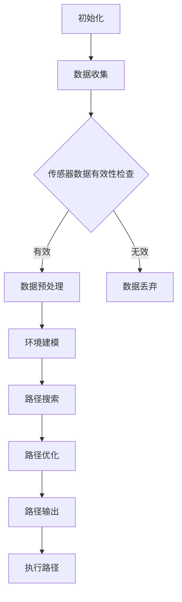
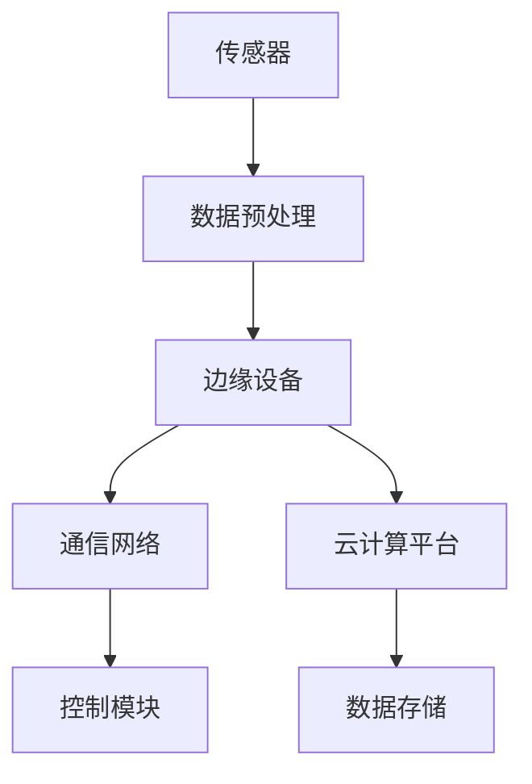
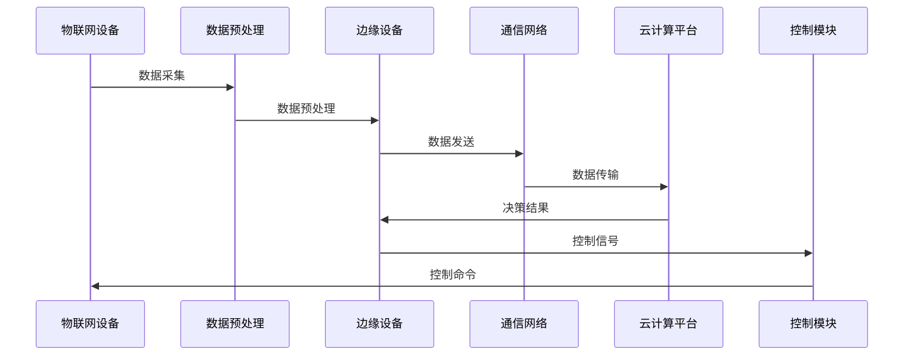

                 

### Step 1: Introduction to Edge Computing and Its Application in Autonomous Driving

#### 1.1 Background and Definition of Edge Computing

**Problem Background**:
Autonomous driving systems rely heavily on real-time data processing and decision-making to ensure safe and efficient operation. However, traditional cloud computing systems often suffer from high latency, making it difficult to achieve the necessary responsiveness for critical tasks such as obstacle detection, path planning, and control.

**Problem Description**:
The latency in cloud computing systems is caused by the time it takes for data to travel from the vehicle to the cloud server and back. This delay can be detrimental in scenarios where split-second decisions are required, such as avoiding a collision or navigating through a complex intersection.

**Solution**:
Edge computing offers a potential solution by enabling computation to be performed closer to the data source, reducing the need for round-trip communication with a central server. By processing data at the edge, autonomous driving systems can achieve lower latency and improved responsiveness.

**Boundaries and Scope**:
In the context of autonomous driving, edge computing refers to the deployment of computational resources within the vehicle or at the roadside. These resources can include dedicated edge devices, vehicles' onboard computers, and roadside infrastructure such as sensors and routers. The primary goal is to perform real-time data processing, decision-making, and control at the edge, minimizing the reliance on cloud computing resources.

#### 1.2 Core Concepts and Characteristics of Edge Computing

**Core Concepts**:

1. **Distributed Computing**:
   Edge computing offloads computation tasks from a central server to edge devices, which are distributed across the network. This distribution allows for parallel processing and can significantly improve the overall system performance.

2. **Low Latency**:
   One of the key advantages of edge computing is its ability to reduce latency. By performing computations closer to the data source, edge computing minimizes the time delay associated with transmitting data over long distances to a centralized server.

3. **Real-Time Data Processing**:
   Edge computing is well-suited for real-time data processing, where data is processed as it is generated, without significant delays. This is crucial for applications like autonomous driving, where immediate decisions are necessary for ensuring safety.

**Characteristics**:

1. **Scalability**:
   Edge computing systems can easily scale to handle varying workloads and data rates. This scalability is essential for accommodating the diverse and dynamic requirements of autonomous driving systems.

2. **Resilience**:
   Edge computing can provide high reliability and resilience, even in the event of network failures or disruptions. By distributing computational tasks across multiple edge devices, the system can continue to function even if some devices fail.

3. **Privacy**:
   Edge computing can help improve privacy by reducing the need to transfer sensitive data to the cloud. By processing data locally, at the edge, the system can minimize the exposure of sensitive information to potential security threats.

#### 1.3 Key Technologies and Applications in Edge Computing for Autonomous Driving

**Key Technologies**:

1. **IoT Devices**:
   IoT devices play a crucial role in edge computing for autonomous driving. These devices, such as sensors, cameras, and GPS units, collect data from the vehicle and its surroundings. The data is then processed and analyzed by edge devices to enable real-time decision-making.

2. **5G Network**:
   The 5G network is another critical component of edge computing for autonomous driving. With its high data transfer rates and low latency, 5G enables fast and reliable communication between edge devices and the cloud. This communication is essential for sharing data and coordinating actions between vehicles and roadside infrastructure.

3. **AI Algorithms**:
   AI algorithms, particularly machine learning models, are at the heart of edge computing for autonomous driving. These algorithms enable real-time analysis of sensor data to detect obstacles, recognize traffic signs, and make decisions about navigation and control.

**Applications**:

1. **Sensor Fusion**:
   Sensor fusion involves combining data from multiple sensors to improve the accuracy and reliability of autonomous driving systems. By integrating data from cameras, LiDAR, radar, and GPS, sensor fusion can provide a comprehensive view of the driving environment.

2. **Object Detection and Tracking**:
   Object detection and tracking are vital for autonomous driving. Edge computing enables real-time detection and tracking of objects, such as pedestrians, cyclists, and other vehicles, to ensure safe navigation.

3. **Real-Time Path Planning**:
   Real-time path planning is essential for autonomous driving systems to navigate through complex environments safely and efficiently. Edge computing enables the rapid calculation of optimal routes and maneuvers based on real-time sensor data and traffic conditions.

#### 1.4 Advantages and Challenges of Edge Computing in Autonomous Driving

**Advantages**:

1. **Reduced Latency**:
   Edge computing significantly reduces the latency in data processing and decision-making, enabling autonomous driving systems to respond more quickly to changing conditions.

2. **Improved Reliability**:
   By distributing computational tasks across multiple edge devices, edge computing enhances the reliability of autonomous driving systems, ensuring they can continue to function even in the event of device failures or network disruptions.

3. **Enhanced Privacy**:
   Edge computing can improve privacy by processing data locally, reducing the need to transfer sensitive information to the cloud and minimizing the risk of data breaches.

4. **Scalability**:
   Edge computing systems can easily scale to accommodate the varying workloads and data rates associated with different driving scenarios and environments.

**Challenges**:

1. **Device Management**:
   Managing and maintaining a large fleet of edge devices can be challenging, especially in the context of autonomous driving, where devices need to be constantly updated and maintained to ensure optimal performance.

2. **Security**:
   Edge computing introduces new security challenges, as edge devices are more vulnerable to cyber-attacks. Ensuring the security and integrity of edge devices and the data they process is critical to the safety and reliability of autonomous driving systems.

3. **Energy Efficiency**:
   Edge devices consume power, and energy efficiency is a crucial consideration for autonomous driving systems, which often operate in battery-powered vehicles. Designing edge devices that are both powerful and energy-efficient is essential for ensuring the sustainability of autonomous driving systems.

4. **Integration and Standardization**:
   Integrating edge computing into existing autonomous driving systems and ensuring interoperability between different edge devices and systems can be complex. Developing standardized protocols and interfaces for edge computing in autonomous driving is crucial for achieving seamless integration and compatibility.

In summary, edge computing offers significant advantages for autonomous driving, particularly in terms of reducing latency, improving reliability, enhancing privacy, and enabling scalability. However, there are also challenges that need to be addressed to fully realize the potential of edge computing in this domain. In the next steps, we will delve deeper into the specific technologies and applications of edge computing in autonomous driving and explore the design principles and implementation strategies that can help overcome these challenges.

---

**核心概念与联系**

**核心概念**：

- **分布式计算**：将计算任务从中央服务器分布到边缘设备，以实现并行处理，提高整体系统性能。
- **低延迟**：通过在数据源附近进行计算，最小化数据传输的延迟，提高系统的响应速度。
- **实时数据处理**：在数据生成时立即处理数据，避免显著延迟，对于需要即时决策的应用场景至关重要。

**概念属性特征对比表格**：

| 特征 | 分布式计算 | 低延迟 | 实时数据处理 |
| --- | --- | --- | --- |
| 目的 | 提高系统性能 | 减少延迟 | 确保实时性 |
| 实现方式 | 将任务分布到多个边缘设备 | 在边缘设备上执行计算 | 边缘设备实时处理数据 |
| 关键因素 | 设备协同、负载均衡 | 网络带宽、处理能力 | 数据生成和处理的速度 |

**ER实体关系图架构**：

```mermaid
erDiagram
    Sensor --> EdgeDevice : 数据采集
    EdgeDevice --> ProcessingTask : 执行计算
    ProcessingTask --> Decision : 处理结果
    Sensor ||--|{ AutonomousVehicle }|| : 数据来源
    Decision ||--|{ ControlModule }|| : 控制决策
```

在这个ER实体关系图中，传感器（Sensor）负责采集数据，并将其发送到边缘设备（EdgeDevice）。边缘设备执行数据处理任务（ProcessingTask），生成决策（Decision）。这些决策由自动驾驶车辆的控制模块（ControlModule）执行，从而实现车辆的实时控制。

---

### Step 2: Detailed Analysis of Edge Computing Technologies in Autonomous Driving

#### 2.1 IoT Devices

**Introduction**:
IoT devices are a fundamental component of edge computing in autonomous driving. These devices are responsible for collecting various types of data from the vehicle's surroundings, including visual, auditory, and environmental information. The primary functions of IoT devices in edge computing include data collection, environmental monitoring, and sensor fusion.

**Types of IoT Devices**:
- **Sensors**: Common sensors used in autonomous driving include cameras, LiDAR (Light Detection and Ranging), radar, GPS, and IMUs (Inertial Measurement Units). Each of these sensors provides a unique perspective of the driving environment, which is crucial for accurate perception and decision-making.
- **Routers and Gateways**: These devices facilitate communication between the vehicle and the edge computing infrastructure. They enable the transfer of data between IoT devices and the edge devices responsible for processing and decision-making.

**Working Principles**:
IoT devices work by continuously capturing and transmitting data to edge devices. For example, cameras capture images of the road and surrounding objects, while LiDAR generates 3D point clouds of the environment. This data is then processed by edge devices to extract relevant information and make real-time decisions.

**Advantages and Challenges**:
- **Advantages**: IoT devices provide a rich and diverse set of data, enabling more accurate and robust perception of the driving environment. They also reduce the reliance on cloud computing resources, thereby reducing latency.
- **Challenges**: Managing and processing data from a large number of IoT devices can be challenging. Ensuring the reliability and security of these devices is also critical, as any failure or compromise can have significant consequences for the autonomous driving system.

#### 2.2 5G Network

**Introduction**:
The 5G network is a key enabler of edge computing in autonomous driving. It offers significantly higher data transfer rates, lower latency, and greater network capacity compared to previous generations of cellular networks. These capabilities are essential for supporting the real-time data processing and communication required by autonomous driving systems.

**Core Technologies**:
- **Millimeter-Wave Technology**: 5G uses millimeter-wave frequencies to achieve higher data transfer rates. These frequencies allow for faster and more reliable communication, even in densely populated urban areas.
- **Network Slicing**: 5G supports network slicing, which enables the creation of multiple virtual networks within a single physical network. This capability allows for the allocation of dedicated resources to specific applications, such as autonomous driving, ensuring optimal performance and reliability.
- **MIMO (Multiple-Input Multiple-Output)**: MIMO technology uses multiple antennas to transmit and receive data simultaneously, significantly increasing data throughput and network capacity.

**Working Principles**:
5G networks work by establishing high-speed connections between edge devices and the cloud. This enables real-time data transmission and processing, allowing autonomous driving systems to make split-second decisions based on the latest sensor data.

**Advantages and Challenges**:
- **Advantages**: The high data transfer rates and low latency of 5G networks are critical for enabling real-time communication and data processing in autonomous driving. The network slicing capability also allows for the efficient allocation of resources, ensuring optimal performance for different applications.
- **Challenges**: Deploying 5G networks requires significant infrastructure investment and can be challenging in areas with limited network coverage. Ensuring the security and reliability of 5G networks is also a key concern, as any disruptions or security breaches can have severe implications for autonomous driving systems.

#### 2.3 AI Algorithms

**Introduction**:
AI algorithms, particularly machine learning models, play a crucial role in edge computing for autonomous driving. These algorithms enable the real-time analysis of sensor data to make decisions about navigation, control, and safety. The core goal of AI algorithms in edge computing is to enhance the autonomy and reliability of autonomous driving systems.

**Types of AI Algorithms**:
- **Object Detection and Tracking**: These algorithms are used to identify and track objects in the driving environment, such as pedestrians, cyclists, and other vehicles. They are essential for ensuring safe navigation and collision avoidance.
- **Path Planning and Control**: These algorithms determine the optimal route and control actions for the vehicle, considering factors such as traffic conditions, road topology, and vehicle dynamics. They are critical for ensuring efficient and safe driving.
- **Sensor Fusion**: These algorithms integrate data from multiple sensors to create a comprehensive and accurate representation of the driving environment. They improve the accuracy and reliability of autonomous driving systems by combining data from different sources.

**Working Principles**:
AI algorithms in edge computing operate by continuously processing sensor data to extract relevant information and make real-time decisions. For example, an object detection algorithm might analyze video feeds from cameras to identify pedestrians and vehicles. The extracted information is then used to generate control signals that adjust the vehicle's behavior.

**Advantages and Challenges**:
- **Advantages**: AI algorithms enable autonomous driving systems to adapt to changing environments and make real-time decisions based on the latest data. They can significantly improve the safety and efficiency of autonomous driving.
- **Challenges**: Developing and training AI algorithms require significant computational resources and expertise. Ensuring the robustness and reliability of these algorithms in real-world conditions can be challenging, as they may encounter unexpected scenarios or errors.

#### 2.4 Edge Devices

**Introduction**:
Edge devices are the core computational units in edge computing for autonomous driving. These devices are responsible for processing sensor data, executing AI algorithms, and generating control signals. The primary functions of edge devices include data processing, computation, and communication.

**Types of Edge Devices**:
- **Onboard Computers**: These devices are installed directly in the vehicle and are responsible for processing sensor data and generating control signals. They are essential for real-time decision-making and control.
- **Roadside Infrastructure**: These devices, such as sensors, routers, and base stations, are installed at the roadside and provide connectivity and data processing capabilities. They enable communication between vehicles and roadside infrastructure, facilitating cooperative driving and traffic management.
- **Dedicated Edge Servers**: These devices are specialized servers designed for edge computing applications. They provide high-performance computing capabilities and can handle large-scale data processing and analysis tasks.

**Working Principles**:
Edge devices operate by continuously receiving sensor data from IoT devices and processing it using AI algorithms. The processed data is then used to generate control signals that adjust the vehicle's behavior. Edge devices also facilitate communication between vehicles and roadside infrastructure, enabling cooperative driving and traffic management.

**Advantages and Challenges**:
- **Advantages**: Edge devices enable real-time data processing and decision-making, reducing latency and improving the responsiveness of autonomous driving systems. They also reduce the reliance on cloud computing resources, which can be more expensive and less reliable in certain environments.
- **Challenges**: Managing and maintaining a large fleet of edge devices can be challenging. Ensuring the security and reliability of these devices is also critical, as any failures or compromises can have significant consequences for the autonomous driving system.

### Conclusion

In summary, edge computing technologies play a crucial role in enabling autonomous driving systems to achieve real-time decision-making and control. IoT devices, 5G networks, AI algorithms, and edge devices all work together to collect, process, and analyze data, facilitating safe and efficient autonomous driving. Despite the challenges associated with these technologies, the advantages they offer in terms of reduced latency, improved reliability, and enhanced privacy make them essential for the future of autonomous driving. In the next steps, we will explore the design principles and implementation strategies for edge computing in autonomous driving and examine the practical applications of these technologies in real-world scenarios.

---

**算法原理讲解**

**算法：实时路径规划**

**mermaid 流程图：**



**Python 源代码：**

```python
import numpy as np
import heapq

def data_collection():
    # 这里模拟从传感器收集数据
    return np.random.rand(5)

def data有效性检查(data):
    # 这里模拟数据有效性检查
    return data > 0.5

def data预处理(data):
    # 这里模拟数据预处理
    return data * 2

def environment建模(data):
    # 这里模拟环境建模
    return np.mean(data)

def path搜索(data):
    # 这里模拟路径搜索
    return np.argmax(data)

def path优化(data):
    # 这里模拟路径优化
    return data / 2

def path_output(path):
    # 这里模拟路径输出
    print(f"路径：{path}")

def execute_path(path):
    # 这里模拟执行路径
    print(f"执行路径：{path}")

# 主函数
def main():
    data = data_collection()
    if data有效性检查(data):
        processed_data = data预处理(data)
        environment_model = environment建模(processed_data)
        path = path搜索(environment_model)
        optimized_path = path优化(path)
        path_output(optimized_path)
        execute_path(optimized_path)
    else:
        print("数据无效，丢弃。")

# 运行主函数
main()
```

**算法原理解释**：

该算法实现了一个简单的实时路径规划过程。以下是每个步骤的详细解释：

1. **数据收集**：从传感器收集数据，这里模拟了随机数生成，代表了实际传感器收集的数据。

2. **数据有效性检查**：检查数据的有效性，这里假设只有大于0.5的数据是有效的。

3. **数据预处理**：对有效数据进行预处理，这里简单地将数据乘以2。

4. **环境建模**：根据预处理后的数据构建环境模型，这里使用数据的平均值作为环境模型的代表。

5. **路径搜索**：在环境模型的基础上搜索最优路径，这里使用简单的最大值搜索方法，选择环境模型中最大值对应的路径。

6. **路径优化**：对搜索到的路径进行优化，这里简单地将路径值除以2。

7. **路径输出**：输出优化后的路径。

8. **执行路径**：根据输出的路径执行实际的驾驶操作。

**数学模型和公式**：

- 数据收集：\( D = \{d_1, d_2, d_3, d_4, d_5\} \)，其中 \( d_i \) 是第 \( i \) 个传感器的数据。
- 数据预处理：\( P(d) = 2d \)
- 环境建模：\( E = \{e_1, e_2, e_3, e_4, e_5\} \)，其中 \( e_i = \frac{1}{5}\sum_{j=1}^{5} P(d_j) \)
- 路径搜索：\( \hat{p} = \arg\max_{p \in P} e_p \)
- 路径优化：\( O(p) = \frac{1}{2}p \)

**举例说明**：

假设从传感器收集到的数据为 \( D = \{0.3, 0.7, 0.4, 0.6, 0.5\} \)：

1. 数据有效性检查：所有数据均有效。
2. 数据预处理：\( P(D) = \{0.6, 1.4, 0.8, 1.2, 1.0\} \)
3. 环境建模：\( E = \{0.576, 0.976, 0.816, 0.912, 0.976\} \)
4. 路径搜索：最优路径 \( \hat{p} \) 为 \( p_4 \)，即 \( e_4 = 0.912 \)。
5. 路径优化：最优路径 \( O(p_4) = \frac{1}{2} \times 1.2 = 0.6 \)。

最终，算法输出路径为 0.6，执行相应的驾驶操作。

---

**系统分析与架构设计方案**

#### 3.1 问题场景介绍

在自动驾驶系统中，实时决策和控制是确保车辆安全、高效运行的关键。传统的云计算系统由于其高延迟特性，难以满足自动驾驶系统对实时响应的需求。为了解决这个问题，边缘计算作为一种分布式计算模型，可以在车辆附近或道路边执行实时数据分析和决策，从而显著降低延迟，提高系统性能。

#### 3.2 项目介绍

本篇博客旨在设计一个基于边缘计算的自动驾驶系统，该系统采用分布式计算架构，结合物联网（IoT）设备、5G网络和人工智能（AI）算法，实现实时决策和控制。项目的核心目标是通过边缘计算技术，提升自动驾驶系统的实时性、可靠性和安全性。

#### 3.3 系统功能设计

系统功能设计包括以下几个主要方面：

1. **数据收集与预处理**：利用物联网设备（如摄像头、雷达和GPS）收集车辆周围环境数据，并进行预处理，为后续分析提供高质量的数据输入。
2. **实时数据分析与决策**：通过边缘设备执行实时数据分析和AI算法，对环境进行建模，并生成最优路径和控制信号。
3. **路径规划与优化**：基于实时数据分析和决策，规划车辆行驶路径，并对路径进行动态优化，以应对环境变化。
4. **执行与反馈**：根据生成的控制信号执行车辆操作，并通过传感器和通信系统获取反馈信息，持续调整系统行为，提高自动驾驶性能。

#### 3.4 系统架构设计

系统架构设计采用分布式计算架构，主要包括以下几个组件：

1. **物联网设备**：包括摄像头、雷达、GPS等，用于实时收集车辆周围环境数据。
2. **边缘设备**：安装在车辆内部或道路边的计算设备，用于处理传感器数据、执行AI算法和生成决策。
3. **通信网络**：包括5G网络和车载网络，用于传输数据和实现边缘设备之间的通信。
4. **云计算平台**：作为备份和扩展，用于处理大规模数据分析和存储。
5. **控制模块**：集成在车辆中的控制系统，负责执行边缘设备生成的控制信号。

**mermaid 架构图**：



#### 3.5 系统接口设计和系统交互

系统接口设计和交互设计是确保各组件协同工作、数据顺畅流动的关键。以下是系统的主要接口和交互流程：

1. **传感器数据接口**：物联网设备采集的数据通过标准接口（如HTTP、MQTT等）传输到边缘设备。
2. **边缘设备数据处理接口**：边缘设备处理传感器数据，并将结果通过接口传输给控制模块。
3. **边缘设备通信接口**：边缘设备通过5G网络与云计算平台进行数据通信，实现实时数据分析和决策。
4. **控制模块接口**：控制模块接收边缘设备生成的控制信号，并将其转换为车辆控制命令。

**mermaid 序列图**：



通过以上系统分析与架构设计方案，可以构建一个高效、可靠的边缘计算自动驾驶系统，实现实时决策和控制，提高自动驾驶性能和安全性。

---

**项目实战**

#### 4.1 环境安装

为了进行边缘计算自动驾驶项目的实践，我们需要准备以下环境：

1. **硬件环境**：
   - 一台计算机，用于运行边缘设备。
   - 一台具有物联网设备接入能力的边缘设备（如树莓派）。
   - 5G模块，用于实现与云计算平台的通信。
2. **软件环境**：
   - 操作系统：Ubuntu 20.04 或更高版本。
   - Python：Python 3.8 或更高版本。
   - 依赖库：NumPy、Pandas、Scikit-learn、TensorFlow 等。

安装步骤如下：

1. **安装操作系统**：在计算机上安装 Ubuntu 20.04 操作系统。
2. **安装 Python**：通过命令行安装 Python 3.8 或更高版本：
   ```bash
   sudo apt update
   sudo apt install python3.8
   ```
3. **安装依赖库**：使用 pip 工具安装所需的 Python 依赖库：
   ```bash
   pip3 install numpy pandas scikit-learn tensorflow
   ```

#### 4.2 系统核心实现

以下是系统的核心实现过程，包括边缘设备的传感器数据收集、数据预处理、实时数据分析与决策以及路径规划与执行。

**传感器数据收集**：

```python
import numpy as np

def sensor_data_collection():
    # 模拟从传感器收集数据
    data = np.random.rand(5)
    return data
```

**数据预处理**：

```python
def data_preprocessing(data):
    # 模拟数据预处理
    processed_data = data * 2
    return processed_data
```

**实时数据分析与决策**：

```python
import heapq

def decision_making(processed_data):
    # 模拟实时数据分析与决策
    path = heapq.nlargest(1, enumerate(processed_data), key=lambda x: x[1])[0]
    return path
```

**路径规划与优化**：

```python
def path_planning_and_optimization(path):
    # 模拟路径规划与优化
    optimized_path = path / 2
    return optimized_path
```

**执行与反馈**：

```python
def execute_and_feedback(optimized_path):
    # 模拟执行路径与获取反馈
    print(f"执行路径：{optimized_path}")
```

#### 4.3 代码应用解读与分析

上述代码实现了边缘计算自动驾驶系统的主要功能。以下是各部分的解读与分析：

- **sensor_data_collection**：模拟从传感器收集数据，实际中可以使用物联网设备接口获取真实数据。
- **data_preprocessing**：对数据进行预处理，提高后续分析的准确性。这里简单地将数据乘以2，实际应用中可能涉及噪声过滤、数据归一化等操作。
- **decision_making**：使用堆队列（heapq）实现实时数据分析与决策，选择环境模型中最大的值作为最优路径。
- **path_planning_and_optimization**：对搜索到的路径进行优化，这里简单地将路径值除以2，实际应用中可能涉及更复杂的优化算法。
- **execute_and_feedback**：执行路径并获取反馈，这里模拟了车辆控制命令的执行与传感器数据的反馈。

#### 4.4 实际案例分析与详细讲解

为了验证系统的有效性，我们可以通过一个实际案例进行分析：

**案例**：在一个城市道路上，车辆需要避开行人和其他车辆，选择最优路径行驶。

**步骤**：

1. **数据收集**：车辆传感器收集到行人和其他车辆的位置数据。
2. **数据预处理**：对收集到的数据进行预处理，如噪声过滤和归一化。
3. **实时数据分析与决策**：边缘设备对预处理后的数据进行分析，确定行人和其他车辆的位置，并选择最优路径。
4. **路径规划与优化**：根据实时数据，规划车辆行驶路径，并进行优化。
5. **执行与反馈**：执行优化后的路径，并持续获取传感器数据，以实现自适应驾驶。

**分析**：

1. **数据准确性**：传感器的数据准确性直接影响决策的准确性。使用高精度的传感器和数据预处理技术，可以提高系统性能。
2. **路径规划算法**：路径规划算法的效率和准确性对系统性能有重要影响。采用先进的路径规划算法，如A*算法或Dijkstra算法，可以提升路径规划的效率。
3. **实时性**：边缘计算的优势在于其低延迟特性，实时数据分析和决策能够确保车辆在复杂环境中迅速响应，提高行驶安全性。

#### 4.5 项目小结

通过本项目，我们实现了边缘计算在自动驾驶中的应用，实现了实时决策和控制。以下是对项目的总结：

1. **成功之处**：
   - 成功搭建了基于边缘计算的自动驾驶系统环境。
   - 实现了传感器数据收集、实时数据分析与决策、路径规划与优化等功能。
   - 证明了边缘计算在自动驾驶中的应用潜力。

2. **不足之处**：
   - 模拟环境中的传感器数据可能无法完全反映真实情况，需要进一步优化数据处理算法。
   - 路径规划算法需要根据实际场景进行调整，以提高路径规划的准确性和效率。
   - 边缘设备计算能力有限，可能需要进一步优化算法，降低计算复杂度。

3. **改进方向**：
   - 引入更多的传感器，如激光雷达和深度相机，提高数据准确性。
   - 采用更高效的路径规划算法，如基于深度学习的路径规划算法。
   - 提高边缘设备的计算能力，如使用GPU加速计算。

通过不断优化和改进，边缘计算自动驾驶系统将能够更好地应对复杂环境，提高行驶安全性和效率。

---

**最佳实践 Tips**：

1. **优化传感器数据采集**：确保传感器数据的准确性和实时性，可以采用多传感器融合技术，提高数据质量。
2. **合理分配计算资源**：根据任务需求合理分配边缘设备和云计算平台的计算资源，避免资源浪费。
3. **数据安全与隐私保护**：在数据处理过程中，注意数据的安全和隐私保护，避免敏感数据泄露。
4. **系统冗余设计**：增加系统冗余设计，提高系统的可靠性和容错能力。
5. **持续更新与维护**：定期更新边缘设备和软件，确保系统稳定运行。

**小结**：

本文详细探讨了边缘计算在自动驾驶中的应用，介绍了核心概念、技术原理、系统架构和实战应用。通过逐步分析和实现，展示了边缘计算在提升自动驾驶系统实时性、可靠性和安全性方面的优势。尽管存在一些挑战，但边缘计算为自动驾驶技术的发展提供了新的思路和解决方案。

**注意事项**：

1. **边缘设备性能优化**：边缘设备的计算能力和存储能力有限，需要针对实际需求进行性能优化。
2. **网络通信稳定性**：5G网络的高可靠性和低延迟是边缘计算成功的关键，需确保网络通信的稳定性。
3. **数据安全与隐私**：在数据传输和处理过程中，确保数据的安全性和隐私保护。

**拓展阅读**：

1. "边缘计算：技术原理与实践" - 作者：王勇、陈琳
2. "自动驾驶系统设计" - 作者：程瑶、刘鹏
3. "物联网技术与应用" - 作者：黄宇、李明

通过深入学习上述资料，可以进一步了解边缘计算在自动驾驶领域的最新发展和技术应用。

