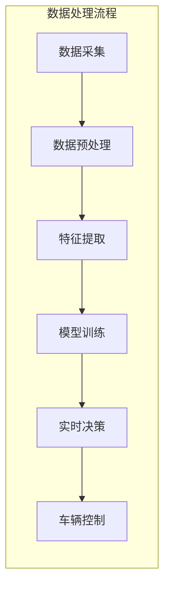
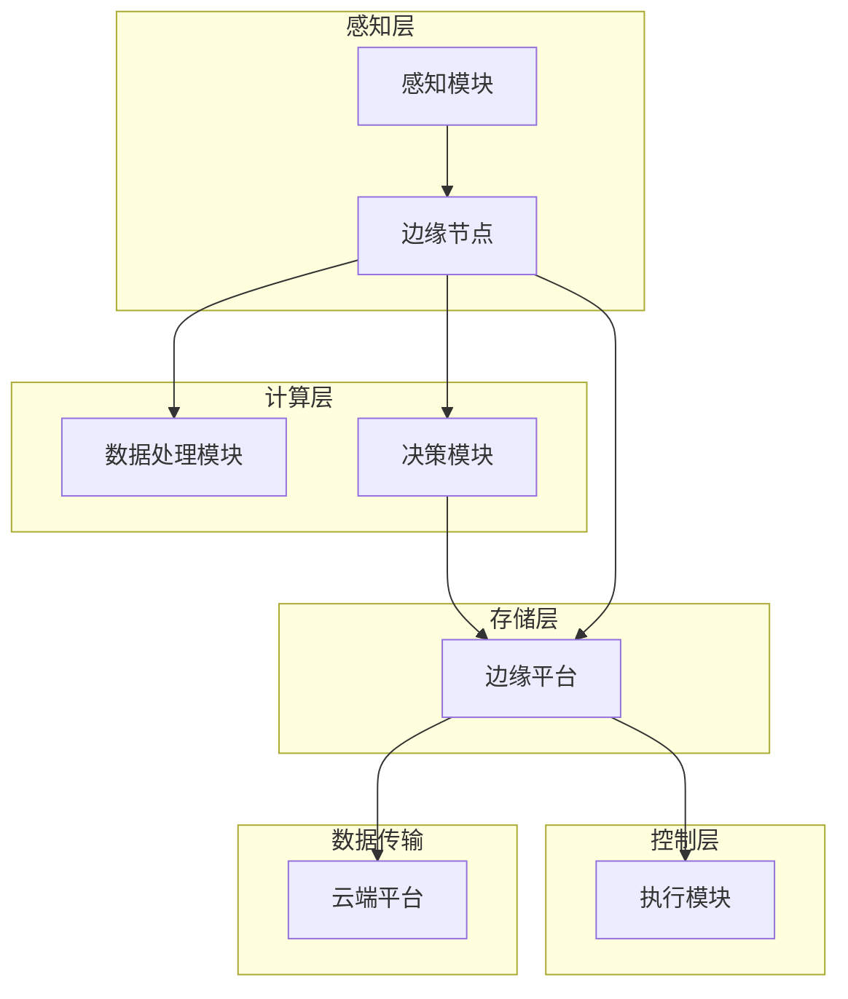
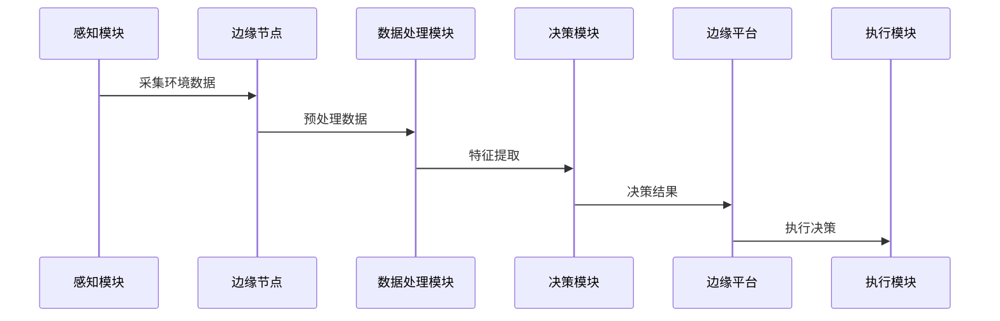

                 

# 边缘计算在自动驾驶紧急决策中的应用

## 关键词

边缘计算，自动驾驶，紧急决策，实时处理，安全性能，智能交通系统

## 摘要

本文深入探讨了边缘计算在自动驾驶紧急决策中的应用。边缘计算通过将数据处理推向网络边缘，能够显著提高自动驾驶系统在紧急情况下的响应速度和决策准确性。本文首先介绍了边缘计算的基本概念、架构及其与云计算的区别，接着详细分析了边缘计算在自动驾驶感知、决策等环节中的优势。随后，文章探讨了边缘计算在自动驾驶紧急决策中的具体应用，包括应用流程、性能评估以及案例研究。最后，本文总结了边缘计算在自动驾驶紧急决策中的应用现状和未来发展趋势，为该领域的进一步研究与实践提供了参考。

---

## 第一部分：边缘计算概述

### 第1章：边缘计算基本概念与架构

#### 1.1 边缘计算的定义与发展历程

边缘计算（Edge Computing）是一种分布式计算架构，旨在将数据处理、存储和分析推向网络的边缘，即靠近数据源头的地方。这一概念起源于物联网（IoT）的发展，随着传感器技术的进步和数据的爆炸式增长，传统的中心化数据处理模式已经无法满足实时性和低延迟的需求。

边缘计算的发展历程可以追溯到2000年代初，当时无线传感器网络和物联网的概念逐渐兴起。随着云计算、物联网和5G技术的成熟，边缘计算逐渐成为研究的焦点，并得到了广泛的应用。近年来，自动驾驶、智能交通、工业互联网等领域的快速发展，进一步推动了边缘计算技术的进步。

#### 1.2 边缘计算的核心要素与架构

边缘计算的核心要素包括边缘节点、边缘网络和边缘平台。

1. **边缘节点**：是边缘计算的基础设施，包括传感器、执行器、边缘服务器等，负责数据的采集、处理和传输。
2. **边缘网络**：连接边缘节点和云端的网络，可以是无线网络、有线网络或卫星网络等。边缘网络要求高带宽、低延迟和可靠连接。
3. **边缘平台**：是边缘计算的核心，提供数据处理、存储、分析和安全等功能，通常包括边缘操作系统、中间件、数据库和人工智能服务等。

边缘计算架构可以分为三个层次：

1. **设备层**：包括各种传感器和执行器，负责数据的采集和初步处理。
2. **边缘层**：包括边缘节点和边缘网络，负责数据的高效处理和传输。
3. **云层**：提供数据存储、分析和高级计算服务，与边缘层协同工作。

#### 1.3 边缘计算与传统云计算的比较

边缘计算与传统云计算有以下区别：

1. **数据处理位置**：传统云计算将数据集中在云端处理，而边缘计算将数据处理推向网络的边缘，靠近数据源头。
2. **响应时间**：边缘计算能够实现更快的响应时间，适合对实时性要求较高的应用场景。
3. **带宽要求**：边缘计算减少了云端的带宽压力，因为数据处理在边缘完成，需要传输的数据量减少。
4. **计算能力**：边缘计算利用边缘节点的计算能力，可以减少对云端计算资源的依赖。

#### 1.4 边缘计算的应用场景与趋势

边缘计算广泛应用于各个领域，以下是一些典型应用场景：

1. **智能交通**：包括智能路况监控、交通信号优化、自动驾驶等。
2. **工业互联网**：包括设备状态监测、生产优化、远程控制等。
3. **智慧城市**：包括环境监测、公共安全、能源管理等。
4. **医疗健康**：包括远程医疗、医疗影像处理、实时监控等。

随着技术的不断进步和应用的深入，边缘计算将继续发展和完善，成为未来计算领域的重要组成部分。

---

在接下来的部分，我们将进一步探讨边缘计算的关键技术，以及它在自动驾驶紧急决策中的具体应用。让我们一步一步深入分析这个激动人心的技术领域。**边缘计算概述**

### 第2章：边缘计算关键技术

#### 2.1 边缘计算网络技术

边缘计算网络技术是边缘计算架构中的关键组成部分，负责实现数据的传输和通信。以下是边缘计算网络技术的几个关键方面：

##### 2.1.1 物理层技术

物理层技术涉及无线通信和有线通信的物理介质。在无线通信方面，常见的边缘计算网络技术包括Wi-Fi、蓝牙、NFC、LoRa等。这些技术具有低功耗、高带宽和广覆盖的特点，适合用于物联网设备之间的数据传输。有线通信技术如以太网、光纤通信等，则提供了高速、高带宽和低延迟的通信保障。

##### 2.1.2 数据链路层技术

数据链路层技术主要负责数据帧的传输和错误检测。在边缘计算中，常用的数据链路层协议包括以太网协议、Wi-Fi Direct、蓝牙低功耗等。这些协议能够确保数据在传输过程中保持完整性和可靠性。

##### 2.1.3 网络层技术

网络层技术则关注数据包的路由和转发。在网络层，常用的协议有IPv4、IPv6、ICMP、IGMP等。IPv6的引入解决了IP地址短缺问题，而ICMP和IGMP协议则用于网络诊断和组播通信。在边缘计算中，网络层技术还需要考虑多跳传输、拥塞控制等问题，以确保数据的高效传输。

#### 2.2 边缘计算数据处理技术

边缘计算数据处理技术是边缘计算的核心，负责数据的压缩、加密、存储和缓存。以下是几个关键方面：

##### 2.2.1 数据压缩与加密技术

数据压缩与加密技术是保证数据传输效率和安全性的关键。在边缘计算中，常用的数据压缩算法包括Huffman编码、LZ77、LZ78等。加密技术则包括对称加密（如AES）和非对称加密（如RSA），这些技术能够确保数据在传输过程中的机密性和完整性。

##### 2.2.2 数据存储与缓存技术

数据存储与缓存技术是边缘计算中处理大量数据的关键。边缘节点通常配备固态硬盘（SSD）或分布式存储系统，用于存储大量数据。缓存技术如LRU（Least Recently Used）和LFU（Least Frequently Used）则用于提高数据访问速度和系统性能。

##### 2.2.3 数据分析与管理技术

数据分析与管理技术是边缘计算中实现智能决策的关键。边缘计算节点可以实时分析数据，提取有价值的信息。常用的数据分析技术包括机器学习、深度学习、数据挖掘等。这些技术能够帮助边缘计算节点实时应对各种复杂的场景。

#### 2.3 边缘计算安全与隐私保护技术

边缘计算安全与隐私保护技术是确保数据安全和用户隐私的关键。以下是几个关键方面：

##### 2.3.1 数据安全传输技术

数据安全传输技术是确保数据在传输过程中不被窃取、篡改或破坏的关键。常用的技术包括TLS/SSL、IPsec等。这些技术能够提供加密和认证功能，确保数据传输的安全性。

##### 2.3.2 隐私保护技术

隐私保护技术是确保用户数据不被未经授权的访问或使用的关键。常用的技术包括差分隐私、同态加密等。这些技术能够在数据分析和处理过程中保护用户的隐私。

##### 2.3.3 边缘安全架构设计

边缘安全架构设计是确保边缘计算系统整体安全性的关键。一个完善的边缘安全架构应包括数据安全、网络安全、应用安全等多个层面。常见的架构设计包括安全隔离、访问控制、威胁检测与响应等。

通过上述关键技术，边缘计算能够实现高效、实时、安全的数据处理，为自动驾驶紧急决策提供了坚实的基础。在下一部分，我们将进一步探讨边缘计算在自动驾驶中的应用，以及它如何助力自动驾驶系统的感知和决策。

### 第3章：边缘计算在自动驾驶中的应用

#### 3.1 自动驾驶技术概述

自动驾驶技术是指通过计算机视觉、传感器、机器学习和人工智能等先进技术，使汽车能够自主感知环境、决策和控制行驶过程，最终实现无需人类干预的自动驾驶。自动驾驶技术的发展经历了几个阶段，从最初的辅助驾驶到如今的无人驾驶，其技术水平也在不断提升。

自动驾驶技术主要包括以下几个核心组成部分：

1. **感知系统**：包括摄像头、激光雷达、超声波传感器等，用于实时感知车辆周围的环境。
2. **决策系统**：通过分析感知系统收集到的数据，决策系统负责生成行驶策略和路径规划。
3. **控制系统**：根据决策系统的指令，控制系统负责控制车辆的加速度、转向和制动等动作。

自动驾驶技术的应用场景包括：

- **城市道路**：自动驾驶出租车、送货机器人等。
- **高速公路**：自动驾驶卡车、长途客车等。
- **特殊环境**：矿难救援车、物流无人车等。

#### 3.2 边缘计算在自动驾驶中的关键角色

边缘计算在自动驾驶中扮演着关键角色，其重要性主要体现在以下几个方面：

1. **实时数据处理**：自动驾驶系统需要实时处理大量的感知数据，边缘计算能够在靠近数据源头的地方快速处理这些数据，提供实时决策支持。
2. **减少网络延迟**：在自动驾驶系统中，网络延迟是一个重要的性能指标。边缘计算通过将数据处理推向网络边缘，可以显著减少数据传输的时间，提高系统的响应速度。
3. **增强安全性**：边缘计算可以实时检测和处理安全事件，提高自动驾驶系统的安全性。例如，在紧急情况下，边缘计算可以迅速做出反应，避免事故的发生。
4. **优化资源利用**：通过边缘计算，自动驾驶系统可以充分利用边缘节点的计算资源，减少对云端计算资源的依赖，提高系统的资源利用效率。

#### 3.3 边缘计算在自动驾驶感知与决策中的优势

边缘计算在自动驾驶感知与决策中具有以下优势：

1. **高速响应**：边缘计算能够实现毫秒级的数据处理和决策，满足自动驾驶系统对实时性的高要求。
2. **低延迟通信**：通过边缘计算，数据传输的延迟显著降低，提高了系统的响应速度和稳定性。
3. **高效资源利用**：边缘计算可以充分利用边缘节点的计算资源，减少对云端资源的依赖，降低了系统的运营成本。
4. **增强隐私保护**：边缘计算可以减少数据传输过程中的泄露风险，增强系统的隐私保护能力。
5. **支持复杂场景**：边缘计算能够处理自动驾驶系统中复杂的感知和决策任务，提高了系统的智能水平。

#### 3.4 边缘计算在自动驾驶中的应用实例

边缘计算在自动驾驶中有着广泛的应用实例，以下是一些典型案例：

1. **智能路况监控**：通过部署边缘计算节点，实时分析交通数据，优化交通信号灯控制，提高道路通行效率。
2. **自动驾驶出租车**：边缘计算用于处理车辆感知数据，实现自动驾驶出租车的实时决策和控制。
3. **智能物流系统**：边缘计算用于实时监控和调度物流车辆，提高物流系统的运行效率和准确性。
4. **高速公路自动驾驶**：边缘计算用于处理高速公路上的感知数据，实现自动驾驶卡车的稳定行驶。

通过以上实例，我们可以看到边缘计算在自动驾驶中的应用已经取得了显著的成果，并为自动驾驶技术的进一步发展提供了强大的支持。在下一部分，我们将深入探讨边缘计算在自动驾驶紧急决策中的具体应用，以及如何提高紧急情况下的决策效率。

### 第4章：自动驾驶紧急决策中的边缘计算

#### 4.1 自动驾驶紧急决策的概念与挑战

自动驾驶紧急决策是指自动驾驶系统在面临紧急情况时，能够迅速识别并采取适当的行动，以避免事故的发生。紧急情况可能包括突发障碍物、交通拥堵、道路施工、恶劣天气等。自动驾驶紧急决策的关键在于实时性、准确性和可靠性。

自动驾驶紧急决策面临的挑战主要包括：

1. **实时性要求**：自动驾驶系统需要在毫秒级的时间内做出决策，否则可能导致严重的安全事故。
2. **数据复杂性**：紧急情况下的数据通常是多源异构的，包括摄像头、激光雷达、超声波传感器等多种传感器数据，如何高效地处理和分析这些数据是一个挑战。
3. **决策多样性**：不同的紧急情况需要不同的应对策略，如何设计一个通用的决策框架，能够在各种情况下都能做出正确的决策，是一个重要的挑战。
4. **环境不确定性**：紧急情况下的环境变化可能非常复杂，系统需要具备应对不确定环境的能力。

#### 4.2 边缘计算在紧急决策中的关键作用

边缘计算在自动驾驶紧急决策中扮演着关键角色，其主要作用体现在以下几个方面：

1. **实时数据处理**：边缘计算能够在边缘节点上快速处理感知数据，实时生成决策结果，满足紧急决策的实时性要求。
2. **降低网络延迟**：通过边缘计算，数据处理的延迟显著降低，使得决策系统能够在更短的时间内做出响应，提高系统的稳定性。
3. **增强决策准确性**：边缘计算可以通过本地计算和数据分析，提高决策的准确性，减少由于网络延迟和数据传输错误导致的误判。
4. **提高系统可靠性**：边缘计算可以减少对云端服务的依赖，降低系统故障的风险，提高整体的可靠性。

#### 4.3 边缘计算在紧急决策中的应用流程

边缘计算在自动驾驶紧急决策中的应用流程主要包括以下几个步骤：

1. **数据采集**：自动驾驶系统通过摄像头、激光雷达、超声波传感器等多种传感器，实时采集车辆周围的环境数据。
2. **预处理**：对采集到的原始数据进行预处理，包括数据清洗、去噪、归一化等操作，以提高后续处理的准确性。
3. **边缘计算**：在边缘节点上，利用边缘计算技术对预处理后的数据进行实时分析，提取有价值的信息，生成初步的决策结果。
4. **决策生成**：基于初步的决策结果，结合车辆状态和环境信息，生成最终的紧急决策。
5. **决策执行**：根据最终决策结果，控制系统执行相应的操作，如加速、减速、转向等，以应对紧急情况。

#### 4.4 边缘计算在紧急决策中的性能评估

边缘计算在紧急决策中的性能评估主要包括以下几个指标：

1. **响应时间**：评估系统在紧急情况下从数据采集到决策执行的总时间，时间越短，性能越好。
2. **决策准确性**：评估系统在紧急决策中的准确性，包括误报率和漏报率等指标。
3. **可靠性**：评估系统在长期运行中的稳定性和故障率，可靠性越高的系统，越能够保障紧急情况下的安全。
4. **资源利用率**：评估边缘计算节点在数据处理过程中的资源利用率，包括计算资源、网络资源等，资源利用率越高，系统的运营成本越低。

通过上述性能评估指标，可以全面评估边缘计算在自动驾驶紧急决策中的应用效果，并为系统的优化和改进提供依据。在下一部分，我们将通过实际案例研究，进一步探讨边缘计算在自动驾驶紧急决策中的应用。

### 第5章：边缘计算在自动驾驶紧急决策中的案例研究

#### 5.1 案例研究一：智能车联网系统中的边缘计算

智能车联网系统通过边缘计算实现实时路况监控和自动驾驶紧急决策，提高交通效率和安全性。

**项目介绍**：
该项目旨在构建一个智能车联网系统，通过边缘计算技术实现实时路况监控和自动驾驶紧急决策。系统包括多个边缘计算节点，分布在城市各个重要道路交叉口和交通枢纽。

**系统功能设计**：
1. **感知层**：通过部署在边缘节点的摄像头、激光雷达和超声波传感器，实时采集车辆和道路环境数据。
2. **边缘计算层**：边缘节点负责对感知数据进行预处理和实时分析，提取有价值的信息，生成初步的决策结果。
3. **云层**：通过云端平台，对边缘计算生成的决策结果进行进一步分析和优化，为系统提供高级决策支持。

**系统架构设计**：
系统采用三层架构设计，包括感知层、边缘计算层和云层。感知层负责数据采集，边缘计算层负责数据预处理和实时分析，云层负责数据存储和高级决策。

**系统接口设计**：
系统设计了一系列接口，包括感知数据接口、边缘计算接口和云接口。这些接口实现了不同层之间的数据交换和协同工作。

**系统交互流程**：
1. **数据采集**：摄像头、激光雷达和超声波传感器实时采集车辆和道路环境数据。
2. **数据预处理**：边缘节点对采集到的数据进行预处理，包括数据清洗、去噪、归一化等。
3. **边缘计算**：边缘节点利用边缘计算技术对预处理后的数据进行实时分析，提取有价值的信息。
4. **初步决策**：根据分析结果，边缘节点生成初步的决策结果，如交通信号灯控制、车辆调度等。
5. **云端优化**：云端平台对边缘计算生成的决策结果进行进一步分析和优化，为系统提供高级决策支持。
6. **决策执行**：根据最终决策结果，控制系统执行相应的操作，如交通信号灯控制、车辆调度等。

**项目小结**：
通过边缘计算技术，该项目实现了实时路况监控和自动驾驶紧急决策，提高了交通效率和安全性。系统接口设计和交互流程保证了各层之间的协同工作，为后续优化和扩展提供了基础。

#### 5.2 案例研究二：城市交通紧急事件响应系统

城市交通紧急事件响应系统通过边缘计算实现快速识别和处理交通事故、道路施工等紧急事件，提高应急响应效率。

**项目介绍**：
该项目旨在构建一个城市交通紧急事件响应系统，通过边缘计算技术实现快速识别和处理交通事故、道路施工等紧急事件。系统包括多个边缘计算节点，分布在城市各个主要道路和交通枢纽。

**系统功能设计**：
1. **感知层**：通过部署在边缘节点的摄像头、激光雷达和超声波传感器，实时采集车辆和道路环境数据。
2. **边缘计算层**：边缘节点负责对感知数据进行预处理和实时分析，识别紧急事件，生成应急响应建议。
3. **云层**：通过云端平台，对边缘计算生成的应急响应建议进行进一步分析和优化，为系统提供高级决策支持。

**系统架构设计**：
系统采用三层架构设计，包括感知层、边缘计算层和云层。感知层负责数据采集，边缘计算层负责数据预处理和实时分析，云层负责数据存储和高级决策。

**系统接口设计**：
系统设计了一系列接口，包括感知数据接口、边缘计算接口和云接口。这些接口实现了不同层之间的数据交换和协同工作。

**系统交互流程**：
1. **数据采集**：摄像头、激光雷达和超声波传感器实时采集车辆和道路环境数据。
2. **数据预处理**：边缘节点对采集到的数据进行预处理，包括数据清洗、去噪、归一化等。
3. **边缘计算**：边缘节点利用边缘计算技术对预处理后的数据进行实时分析，识别紧急事件，生成应急响应建议。
4. **初步决策**：根据分析结果，边缘节点生成初步的应急响应建议，如道路封闭、交通管制等。
5. **云端优化**：云端平台对边缘计算生成的应急响应建议进行进一步分析和优化，为系统提供高级决策支持。
6. **决策执行**：根据最终决策结果，控制系统执行相应的操作，如道路封闭、交通管制等。

**项目小结**：
通过边缘计算技术，该项目实现了快速识别和处理交通事故、道路施工等紧急事件，提高了应急响应效率。系统接口设计和交互流程保证了各层之间的协同工作，为后续优化和扩展提供了基础。

#### 5.3 案例研究三：智能无人驾驶出租车系统

智能无人驾驶出租车系统通过边缘计算实现实时交通信息处理和紧急事件应对，提高出行效率和安全性。

**项目介绍**：
该项目旨在构建一个智能无人驾驶出租车系统，通过边缘计算技术实现实时交通信息处理和紧急事件应对。系统包括多个边缘计算节点，分布在城市各个主要道路和交通枢纽。

**系统功能设计**：
1. **感知层**：通过部署在边缘节点的摄像头、激光雷达和超声波传感器，实时采集车辆和道路环境数据。
2. **边缘计算层**：边缘节点负责对感知数据进行预处理和实时分析，实时处理交通信息和应对紧急事件。
3. **云层**：通过云端平台，对边缘计算生成的决策结果进行进一步分析和优化，为系统提供高级决策支持。

**系统架构设计**：
系统采用三层架构设计，包括感知层、边缘计算层和云层。感知层负责数据采集，边缘计算层负责数据预处理和实时分析，云层负责数据存储和高级决策。

**系统接口设计**：
系统设计了一系列接口，包括感知数据接口、边缘计算接口和云接口。这些接口实现了不同层之间的数据交换和协同工作。

**系统交互流程**：
1. **数据采集**：摄像头、激光雷达和超声波传感器实时采集车辆和道路环境数据。
2. **数据预处理**：边缘节点对采集到的数据进行预处理，包括数据清洗、去噪、归一化等。
3. **边缘计算**：边缘节点利用边缘计算技术对预处理后的数据进行实时分析，处理交通信息和应对紧急事件。
4. **初步决策**：根据分析结果，边缘节点生成初步的决策结果，如最优路径规划、紧急事件应对等。
5. **云端优化**：云端平台对边缘计算生成的决策结果进行进一步分析和优化，为系统提供高级决策支持。
6. **决策执行**：根据最终决策结果，控制系统执行相应的操作，如最优路径规划、紧急事件应对等。

**项目小结**：
通过边缘计算技术，该项目实现了实时交通信息处理和紧急事件应对，提高了出行效率和安全性。系统接口设计和交互流程保证了各层之间的协同工作，为后续优化和扩展提供了基础。

### 第6章：边缘计算在自动驾驶紧急决策中的未来发展趋势

#### 6.1 边缘计算技术的持续创新与发展

边缘计算作为一项新兴技术，正随着物联网、5G和人工智能等技术的快速发展而不断创新。未来，边缘计算技术将在以下几个方面持续发展：

1. **硬件设备的升级**：随着硬件技术的进步，边缘节点将配备更强大的计算能力和更高效的能源管理，提高边缘计算的处理能力和效率。
2. **网络架构的优化**：随着5G网络的普及，边缘计算的网络架构将更加高效和稳定，提供更低的延迟和更高的带宽，满足自动驾驶等实时应用的需求。
3. **人工智能的融合**：边缘计算与人工智能的融合将进一步提升系统的智能化水平，通过深度学习、强化学习等技术，实现更准确的感知和决策。
4. **安全性的增强**：随着边缘计算应用的普及，安全性将成为重要的考虑因素。未来，边缘计算将引入更多的安全机制，包括加密、认证、隐私保护等，确保系统的安全运行。

#### 6.2 自动驾驶紧急决策中的新挑战与新机遇

在自动驾驶紧急决策中，边缘计算面临着一系列新挑战：

1. **实时性的提高**：随着自动驾驶技术的不断进步，对实时性的要求越来越高。边缘计算需要进一步优化，以满足更高的实时性需求。
2. **数据处理的复杂性**：自动驾驶系统涉及大量的传感器数据，如何高效地处理和分析这些数据，是一个重要的挑战。
3. **决策的多样性**：自动驾驶系统在遇到不同类型的紧急情况时，需要采取不同的决策策略。如何设计一个灵活、通用的决策框架，是一个关键问题。
4. **系统的可靠性**：在复杂的交通环境中，系统的可靠性至关重要。边缘计算需要提高系统的稳定性，确保在各种情况下都能正常运行。

然而，这些挑战也带来了新的机遇：

1. **技术创新**：边缘计算技术需要不断创新，以满足自动驾驶紧急决策的需求。
2. **应用拓展**：随着自动驾驶技术的普及，边缘计算将在更多领域得到应用，包括智慧城市、智能交通、工业互联网等。
3. **产业链的完善**：边缘计算将带动相关产业链的发展，包括硬件制造、软件开发、服务提供等。

#### 6.3 边缘计算在自动驾驶领域的应用前景

边缘计算在自动驾驶领域的应用前景十分广阔：

1. **智能交通管理**：通过边缘计算，可以实现实时交通信息的处理和优化，提高道路通行效率，减少拥堵和事故。
2. **自动驾驶车辆协同**：边缘计算可以支持自动驾驶车辆之间的协同，实现车队管理、路径优化等功能，提高整体的行驶效率和安全性。
3. **远程驾驶与监控**：边缘计算可以支持远程驾驶和监控，通过实时传输和分析车辆数据，实现对车辆的远程控制和管理。
4. **智能安全防护**：边缘计算可以实时监测车辆状态和环境变化，及时发现潜在的安全隐患，提高自动驾驶系统的安全性。

总之，边缘计算在自动驾驶紧急决策中的应用前景广阔，随着技术的不断进步和应用场景的拓展，它将在自动驾驶领域发挥越来越重要的作用。

### 第7章：总结与展望

#### 7.1 边缘计算在自动驾驶紧急决策中的应用总结

边缘计算在自动驾驶紧急决策中的应用取得了显著成果，为自动驾驶系统的实时性、安全性和可靠性提供了有力支持。通过将数据处理推向网络边缘，边缘计算实现了毫秒级的数据处理和决策，降低了网络延迟，提高了系统的响应速度。同时，边缘计算能够充分利用边缘节点的计算资源，减少对云端计算资源的依赖，降低了系统的运营成本。

边缘计算在自动驾驶紧急决策中的应用主要体现在以下几个方面：

1. **实时数据处理**：边缘计算能够快速处理感知数据，为紧急决策提供实时支持。
2. **降低网络延迟**：通过边缘计算，数据处理的延迟显著降低，提高了系统的响应速度和稳定性。
3. **增强决策准确性**：边缘计算通过本地计算和数据分析，提高了决策的准确性，减少了误判。
4. **提高系统可靠性**：边缘计算减少了系统对云端服务的依赖，提高了整体的可靠性。

#### 7.2 面临的挑战与未来发展方向

尽管边缘计算在自动驾驶紧急决策中取得了显著成果，但仍面临一系列挑战：

1. **实时性要求**：随着自动驾驶技术的不断进步，对实时性的要求越来越高。边缘计算需要进一步优化，以满足更高的实时性需求。
2. **数据处理复杂性**：自动驾驶系统涉及大量的传感器数据，如何高效地处理和分析这些数据，是一个重要的挑战。
3. **决策多样性**：自动驾驶系统在遇到不同类型的紧急情况时，需要采取不同的决策策略。如何设计一个灵活、通用的决策框架，是一个关键问题。
4. **系统的可靠性**：在复杂的交通环境中，系统的可靠性至关重要。边缘计算需要提高系统的稳定性，确保在各种情况下都能正常运行。

未来，边缘计算在自动驾驶紧急决策中的发展方向包括：

1. **技术创新**：不断推动硬件设备、网络架构和人工智能技术的创新，提高边缘计算的处理能力和智能化水平。
2. **标准化与生态建设**：推动边缘计算技术的标准化，构建完善的生态系统，促进产业链的协同发展。
3. **应用拓展**：将边缘计算应用于更多的自动驾驶场景，如智能交通管理、自动驾驶车辆协同、远程驾驶与监控等。

#### 7.3 对从业者的建议与鼓励

对于自动驾驶领域的从业者，以下是一些建议和鼓励：

1. **持续学习**：边缘计算技术更新迅速，从业者需要不断学习新的知识和技术，保持专业竞争力。
2. **跨学科合作**：边缘计算涉及多个领域，包括计算机科学、电子工程、机械工程等。跨学科合作能够促进技术的综合应用和创新。
3. **实践经验**：通过实际项目积累经验，了解边缘计算在实际应用中的挑战和解决方案。
4. **积极参与**：积极参与技术社区和行业活动，与同行交流经验，共同推动边缘计算在自动驾驶领域的应用和发展。

总之，边缘计算在自动驾驶紧急决策中的应用前景广阔，面对挑战和机遇，从业者需要不断学习和创新，为自动驾驶技术的进步贡献力量。**作者信息**

作者：AI天才研究院/AI Genius Institute & 禅与计算机程序设计艺术 /Zen And The Art of Computer Programming

---

本文深入探讨了边缘计算在自动驾驶紧急决策中的应用，从基本概念、架构到关键技术和具体应用案例，全面阐述了边缘计算在提高自动驾驶系统实时性、准确性和可靠性方面的优势。通过本文的阅读，读者可以系统地了解边缘计算在自动驾驶领域的应用现状和未来发展趋势，为相关研究和实践提供有益的参考。

在未来的发展中，边缘计算技术将继续创新和优化，随着硬件、网络和人工智能等领域的进步，边缘计算在自动驾驶紧急决策中的应用将更加广泛和深入。面对挑战，我们鼓励从业者持续学习和探索，积极参与技术创新和应用实践，为自动驾驶技术的进步和智能交通的未来贡献力量。**完整文章内容Markdown格式**

```markdown
# 边缘计算在自动驾驶紧急决策中的应用

## 关键词

边缘计算，自动驾驶，紧急决策，实时处理，安全性能，智能交通系统

## 摘要

本文深入探讨了边缘计算在自动驾驶紧急决策中的应用。边缘计算通过将数据处理推向网络边缘，能够显著提高自动驾驶系统在紧急情况下的响应速度和决策准确性。本文首先介绍了边缘计算的基本概念、架构及其与云计算的区别，接着详细分析了边缘计算在自动驾驶感知、决策等环节中的优势。随后，文章探讨了边缘计算在自动驾驶紧急决策中的具体应用，包括应用流程、性能评估以及案例研究。最后，本文总结了边缘计算在自动驾驶紧急决策中的应用现状和未来发展趋势，为该领域的进一步研究与实践提供了参考。

---

## 第一部分：边缘计算概述

### 第1章：边缘计算基本概念与架构

#### 1.1 边缘计算的定义与发展历程

边缘计算（Edge Computing）是一种分布式计算架构，旨在将数据处理、存储和分析推向网络的边缘，即靠近数据源头的地方。这一概念起源于物联网（IoT）的发展，随着传感器技术的进步和数据的爆炸式增长，传统的中心化数据处理模式已经无法满足实时性和低延迟的需求。

边缘计算的发展历程可以追溯到2000年代初，当时无线传感器网络和物联网的概念逐渐兴起。随着云计算、物联网和5G技术的成熟，边缘计算逐渐成为研究的焦点，并得到了广泛的应用。近年来，自动驾驶、智能交通、工业互联网等领域的快速发展，进一步推动了边缘计算技术的进步。

#### 1.2 边缘计算的核心要素与架构

边缘计算的核心要素包括边缘节点、边缘网络和边缘平台。

1. **边缘节点**：是边缘计算的基础设施，包括传感器、执行器、边缘服务器等，负责数据的采集、处理和传输。
2. **边缘网络**：连接边缘节点和云端的网络，可以是无线网络、有线网络或卫星网络等。边缘网络要求高带宽、低延迟和可靠连接。
3. **边缘平台**：是边缘计算的核心，提供数据处理、存储、分析和安全等功能，通常包括边缘操作系统、中间件、数据库和人工智能服务等。

边缘计算架构可以分为三个层次：

1. **设备层**：包括各种传感器和执行器，负责数据的采集和初步处理。
2. **边缘层**：包括边缘节点和边缘网络，负责数据的高效处理和传输。
3. **云层**：提供数据存储、分析和高级计算服务，与边缘层协同工作。

#### 1.3 边缘计算与传统云计算的比较

边缘计算与传统云计算有以下区别：

1. **数据处理位置**：传统云计算将数据集中在云端处理，而边缘计算将数据处理推向网络的边缘，靠近数据源头。
2. **响应时间**：边缘计算能够实现更快的响应时间，适合对实时性要求较高的应用场景。
3. **带宽要求**：边缘计算减少了云端的带宽压力，因为数据处理在边缘完成，需要传输的数据量减少。
4. **计算能力**：边缘计算利用边缘节点的计算能力，可以减少对云端计算资源的依赖。

#### 1.4 边缘计算的应用场景与趋势

边缘计算广泛应用于各个领域，以下是一些典型应用场景：

1. **智能交通**：包括智能路况监控、交通信号优化、自动驾驶等。
2. **工业互联网**：包括设备状态监测、生产优化、远程控制等。
3. **智慧城市**：包括环境监测、公共安全、能源管理等。
4. **医疗健康**：包括远程医疗、医疗影像处理、实时监控等。

随着技术的不断进步和应用的深入，边缘计算将继续发展和完善，成为未来计算领域的重要组成部分。

### 第2章：边缘计算关键技术

#### 2.1 边缘计算网络技术

边缘计算网络技术是边缘计算架构中的关键组成部分，负责实现数据的传输和通信。以下是边缘计算网络技术的几个关键方面：

##### 2.1.1 物理层技术

物理层技术涉及无线通信和有线通信的物理介质。在无线通信方面，常见的边缘计算网络技术包括Wi-Fi、蓝牙、NFC、LoRa等。这些技术具有低功耗、高带宽和广覆盖的特点，适合用于物联网设备之间的数据传输。有线通信技术如以太网、光纤通信等，则提供了高速、高带宽和低延迟的通信保障。

##### 2.1.2 数据链路层技术

数据链路层技术主要负责数据帧的传输和错误检测。在边缘计算中，常用的数据链路层协议包括以太网协议、Wi-Fi Direct、蓝牙低功耗等。这些协议能够确保数据在传输过程中保持完整性和可靠性。

##### 2.1.3 网络层技术

网络层技术则关注数据包的路由和转发。在网络层，常用的协议有IPv4、IPv6、ICMP、IGMP等。IPv6的引入解决了IP地址短缺问题，而ICMP和IGMP协议则用于网络诊断和组播通信。在边缘计算中，网络层技术还需要考虑多跳传输、拥塞控制等问题，以确保数据的高效传输。

#### 2.2 边缘计算数据处理技术

边缘计算数据处理技术是边缘计算的核心，负责数据的压缩、加密、存储和缓存。以下是几个关键方面：

##### 2.2.1 数据压缩与加密技术

数据压缩与加密技术是保证数据传输效率和安全性的关键。在边缘计算中，常用的数据压缩算法包括Huffman编码、LZ77、LZ78等。加密技术则包括对称加密（如AES）和非对称加密（如RSA），这些技术能够确保数据在传输过程中的机密性和完整性。

##### 2.2.2 数据存储与缓存技术

数据存储与缓存技术是边缘计算中处理大量数据的关键。边缘节点通常配备固态硬盘（SSD）或分布式存储系统，用于存储大量数据。缓存技术如LRU（Least Recently Used）和LFU（Least Frequently Used）则用于提高数据访问速度和系统性能。

##### 2.2.3 数据分析与管理技术

数据分析与管理技术是边缘计算中实现智能决策的关键。边缘计算节点可以实时分析数据，提取有价值的信息。常用的数据分析技术包括机器学习、深度学习、数据挖掘等。这些技术能够帮助边缘计算节点实时应对各种复杂的场景。

#### 2.3 边缘计算安全与隐私保护技术

边缘计算安全与隐私保护技术是确保数据安全和用户隐私的关键。以下是几个关键方面：

##### 2.3.1 数据安全传输技术

数据安全传输技术是确保数据在传输过程中不被窃取、篡改或破坏的关键。常用的技术包括TLS/SSL、IPsec等。这些技术能够提供加密和认证功能，确保数据传输的安全性。

##### 2.3.2 隐私保护技术

隐私保护技术是确保用户数据不被未经授权的访问或使用的关键。常用的技术包括差分隐私、同态加密等。这些技术能够在数据分析和处理过程中保护用户的隐私。

##### 2.3.3 边缘安全架构设计

边缘安全架构设计是确保边缘计算系统整体安全性的关键。一个完善的边缘安全架构应包括数据安全、网络安全、应用安全等多个层面。常见的架构设计包括安全隔离、访问控制、威胁检测与响应等。

通过上述关键技术，边缘计算能够实现高效、实时、安全的数据处理，为自动驾驶紧急决策提供了坚实的基础。在下一部分，我们将进一步探讨边缘计算在自动驾驶中的应用，以及它如何助力自动驾驶系统的感知和决策。

### 第3章：边缘计算在自动驾驶中的应用

#### 3.1 自动驾驶技术概述

自动驾驶技术是指通过计算机视觉、传感器、机器学习和人工智能等先进技术，使汽车能够自主感知环境、决策和控制行驶过程，最终实现无需人类干预的自动驾驶。自动驾驶技术的发展经历了几个阶段，从最初的辅助驾驶到如今的无人驾驶，其技术水平也在不断提升。

自动驾驶技术主要包括以下几个核心组成部分：

1. **感知系统**：包括摄像头、激光雷达、超声波传感器等，用于实时感知车辆周围的环境。
2. **决策系统**：通过分析感知系统收集到的数据，决策系统负责生成行驶策略和路径规划。
3. **控制系统**：根据决策系统的指令，控制系统负责控制车辆的加速度、转向和制动等动作。

自动驾驶技术的应用场景包括：

- **城市道路**：自动驾驶出租车、送货机器人等。
- **高速公路**：自动驾驶卡车、长途客车等。
- **特殊环境**：矿难救援车、物流无人车等。

#### 3.2 边缘计算在自动驾驶中的关键角色

边缘计算在自动驾驶中扮演着关键角色，其重要性主要体现在以下几个方面：

1. **实时数据处理**：自动驾驶系统需要实时处理大量的感知数据，边缘计算能够在靠近数据源头的地方快速处理这些数据，提供实时决策支持。
2. **减少网络延迟**：在自动驾驶系统中，网络延迟是一个重要的性能指标。边缘计算通过将数据处理推向网络边缘，可以显著减少数据传输的时间，提高系统的响应速度。
3. **增强安全性**：边缘计算可以实时检测和处理安全事件，提高自动驾驶系统的安全性。例如，在紧急情况下，边缘计算可以迅速做出反应，避免事故的发生。
4. **优化资源利用**：通过边缘计算，自动驾驶系统可以充分利用边缘节点的计算资源，减少对云端计算资源的依赖，提高系统的资源利用效率。

#### 3.3 边缘计算在自动驾驶感知与决策中的优势

边缘计算在自动驾驶感知与决策中具有以下优势：

1. **高速响应**：边缘计算能够实现毫秒级的数据处理和决策，满足自动驾驶系统对实时性的高要求。
2. **低延迟通信**：通过边缘计算，数据传输的延迟显著降低，提高了系统的响应速度和稳定性。
3. **高效资源利用**：边缘计算可以充分利用边缘节点的计算资源，减少对云端资源的依赖，提高了系统的资源利用效率。
4. **增强隐私保护**：边缘计算可以减少数据传输过程中的泄露风险，增强系统的隐私保护能力。
5. **支持复杂场景**：边缘计算能够处理自动驾驶系统中复杂的感知和决策任务，提高了系统的智能水平。

#### 3.4 边缘计算在自动驾驶中的应用实例

边缘计算在自动驾驶中有着广泛的应用实例，以下是一些典型案例：

1. **智能路况监控**：通过部署边缘计算节点，实时分析交通数据，优化交通信号灯控制，提高道路通行效率。
2. **自动驾驶出租车**：边缘计算用于处理车辆感知数据，实现自动驾驶出租车的实时决策和控制。
3. **智能物流系统**：边缘计算用于实时监控和调度物流车辆，提高物流系统的运行效率和准确性。
4. **高速公路自动驾驶**：边缘计算用于处理高速公路上的感知数据，实现自动驾驶卡车的稳定行驶。

通过以上实例，我们可以看到边缘计算在自动驾驶中的应用已经取得了显著的成果，并为自动驾驶技术的进一步发展提供了强大的支持。在下一部分，我们将深入探讨边缘计算在自动驾驶紧急决策中的具体应用，以及如何提高紧急情况下的决策效率。

### 第4章：自动驾驶紧急决策中的边缘计算

#### 4.1 自动驾驶紧急决策的概念与挑战

自动驾驶紧急决策是指自动驾驶系统在面临紧急情况时，能够迅速识别并采取适当的行动，以避免事故的发生。紧急情况可能包括突发障碍物、交通拥堵、道路施工、恶劣天气等。自动驾驶紧急决策的关键在于实时性、准确性和可靠性。

自动驾驶紧急决策面临的挑战主要包括：

1. **实时性要求**：自动驾驶系统需要在毫秒级的时间内做出决策，否则可能导致严重的安全事故。
2. **数据复杂性**：紧急情况下的数据通常是多源异构的，包括摄像头、激光雷达、超声波传感器等多种传感器数据，如何高效地处理和分析这些数据是一个挑战。
3. **决策多样性**：不同的紧急情况需要不同的应对策略，如何设计一个通用的决策框架，能够在各种情况下都能做出正确的决策，是一个重要的挑战。
4. **环境不确定性**：紧急情况下的环境变化可能非常复杂，系统需要具备应对不确定环境的能力。

#### 4.2 边缘计算在紧急决策中的关键作用

边缘计算在自动驾驶紧急决策中扮演着关键角色，其主要作用体现在以下几个方面：

1. **实时数据处理**：边缘计算能够在边缘节点上快速处理感知数据，实时生成决策结果，满足紧急决策的实时性要求。
2. **降低网络延迟**：通过边缘计算，数据处理的延迟显著降低，使得决策系统能够在更短的时间内做出响应，提高系统的稳定性。
3. **增强决策准确性**：边缘计算可以通过本地计算和数据分析，提高决策的准确性，减少由于网络延迟和数据传输错误导致的误判。
4. **提高系统可靠性**：边缘计算可以减少对云端服务的依赖，降低系统故障的风险，提高整体的可靠性。

#### 4.3 边缘计算在紧急决策中的应用流程

边缘计算在自动驾驶紧急决策中的应用流程主要包括以下几个步骤：

1. **数据采集**：自动驾驶系统通过摄像头、激光雷达、超声波传感器等多种传感器，实时采集车辆周围的环境数据。
2. **预处理**：对采集到的原始数据进行预处理，包括数据清洗、去噪、归一化等操作，以提高后续处理的准确性。
3. **边缘计算**：在边缘节点上，利用边缘计算技术对预处理后的数据进行实时分析，提取有价值的信息，生成初步的决策结果。
4. **决策生成**：基于初步的决策结果，结合车辆状态和环境信息，生成最终的紧急决策。
5. **决策执行**：根据最终决策结果，控制系统执行相应的操作，如加速、减速、转向等，以应对紧急情况。

#### 4.4 边缘计算在紧急决策中的性能评估

边缘计算在紧急决策中的性能评估主要包括以下几个指标：

1. **响应时间**：评估系统在紧急情况下从数据采集到决策执行的总时间，时间越短，性能越好。
2. **决策准确性**：评估系统在紧急决策中的准确性，包括误报率和漏报率等指标。
3. **可靠性**：评估系统在长期运行中的稳定性和故障率，可靠性越高的系统，越能够保障紧急情况下的安全。
4. **资源利用率**：评估边缘计算节点在数据处理过程中的资源利用率，包括计算资源、网络资源等，资源利用率越高，系统的运营成本越低。

通过上述性能评估指标，可以全面评估边缘计算在自动驾驶紧急决策中的应用效果，并为系统的优化和改进提供依据。在下一部分，我们将通过实际案例研究，进一步探讨边缘计算在自动驾驶紧急决策中的应用。

### 第5章：边缘计算在自动驾驶紧急决策中的案例研究

#### 5.1 案例研究一：智能车联网系统中的边缘计算

智能车联网系统通过边缘计算实现实时路况监控和自动驾驶紧急决策，提高交通效率和安全性。

**项目介绍**：
该项目旨在构建一个智能车联网系统，通过边缘计算技术实现实时路况监控和自动驾驶紧急决策。系统包括多个边缘计算节点，分布在城市各个重要道路交叉口和交通枢纽。

**系统功能设计**：
1. **感知层**：通过部署在边缘节点的摄像头、激光雷达和超声波传感器，实时采集车辆和道路环境数据。
2. **边缘计算层**：边缘节点负责对感知数据进行预处理和实时分析，提取有价值的信息，生成初步的决策结果。
3. **云层**：通过云端平台，对边缘计算生成的决策结果进行进一步分析和优化，为系统提供高级决策支持。

**系统架构设计**：
系统采用三层架构设计，包括感知层、边缘计算层和云层。感知层负责数据采集，边缘计算层负责数据预处理和实时分析，云层负责数据存储和高级决策。

**系统接口设计**：
系统设计了一系列接口，包括感知数据接口、边缘计算接口和云接口。这些接口实现了不同层之间的数据交换和协同工作。

**系统交互流程**：
1. **数据采集**：摄像头、激光雷达和超声波传感器实时采集车辆和道路环境数据。
2. **数据预处理**：边缘节点对采集到的数据进行预处理，包括数据清洗、去噪、归一化等。
3. **边缘计算**：边缘节点利用边缘计算技术对预处理后的数据进行实时分析，提取有价值的信息。
4. **初步决策**：根据分析结果，边缘节点生成初步的决策结果，如交通信号灯控制、车辆调度等。
5. **云端优化**：云端平台对边缘计算生成的决策结果进行进一步分析和优化，为系统提供高级决策支持。
6. **决策执行**：根据最终决策结果，控制系统执行相应的操作，如交通信号灯控制、车辆调度等。

**项目小结**：
通过边缘计算技术，该项目实现了实时路况监控和自动驾驶紧急决策，提高了交通效率和安全性。系统接口设计和交互流程保证了各层之间的协同工作，为后续优化和扩展提供了基础。

#### 5.2 案例研究二：城市交通紧急事件响应系统

城市交通紧急事件响应系统通过边缘计算实现快速识别和处理交通事故、道路施工等紧急事件，提高应急响应效率。

**项目介绍**：
该项目旨在构建一个城市交通紧急事件响应系统，通过边缘计算技术实现快速识别和处理交通事故、道路施工等紧急事件。系统包括多个边缘计算节点，分布在城市各个主要道路和交通枢纽。

**系统功能设计**：
1. **感知层**：通过部署在边缘节点的摄像头、激光雷达和超声波传感器，实时采集车辆和道路环境数据。
2. **边缘计算层**：边缘节点负责对感知数据进行预处理和实时分析，识别紧急事件，生成应急响应建议。
3. **云层**：通过云端平台，对边缘计算生成的应急响应建议进行进一步分析和优化，为系统提供高级决策支持。

**系统架构设计**：
系统采用三层架构设计，包括感知层、边缘计算层和云层。感知层负责数据采集，边缘计算层负责数据预处理和实时分析，云层负责数据存储和高级决策。

**系统接口设计**：
系统设计了一系列接口，包括感知数据接口、边缘计算接口和云接口。这些接口实现了不同层之间的数据交换和协同工作。

**系统交互流程**：
1. **数据采集**：摄像头、激光雷达和超声波传感器实时采集车辆和道路环境数据。
2. **数据预处理**：边缘节点对采集到的数据进行预处理，包括数据清洗、去噪、归一化等。
3. **边缘计算**：边缘节点利用边缘计算技术对预处理后的数据进行实时分析，识别紧急事件，生成应急响应建议。
4. **初步决策**：根据分析结果，边缘节点生成初步的应急响应建议，如道路封闭、交通管制等。
5. **云端优化**：云端平台对边缘计算生成的应急响应建议进行进一步分析和优化，为系统提供高级决策支持。
6. **决策执行**：根据最终决策结果，控制系统执行相应的操作，如道路封闭、交通管制等。

**项目小结**：
通过边缘计算技术，该项目实现了快速识别和处理交通事故、道路施工等紧急事件，提高了应急响应效率。系统接口设计和交互流程保证了各层之间的协同工作，为后续优化和扩展提供了基础。

#### 5.3 案例研究三：智能无人驾驶出租车系统

智能无人驾驶出租车系统通过边缘计算实现实时交通信息处理和紧急事件应对，提高出行效率和安全性。

**项目介绍**：
该项目旨在构建一个智能无人驾驶出租车系统，通过边缘计算技术实现实时交通信息处理和紧急事件应对。系统包括多个边缘计算节点，分布在城市各个主要道路和交通枢纽。

**系统功能设计**：
1. **感知层**：通过部署在边缘节点的摄像头、激光雷达和超声波传感器，实时采集车辆和道路环境数据。
2. **边缘计算层**：边缘节点负责对感知数据进行预处理和实时分析，实时处理交通信息和应对紧急事件。
3. **云层**：通过云端平台，对边缘计算生成的决策结果进行进一步分析和优化，为系统提供高级决策支持。

**系统架构设计**：
系统采用三层架构设计，包括感知层、边缘计算层和云层。感知层负责数据采集，边缘计算层负责数据预处理和实时分析，云层负责数据存储和高级决策。

**系统接口设计**：
系统设计了一系列接口，包括感知数据接口、边缘计算接口和云接口。这些接口实现了不同层之间的数据交换和协同工作。

**系统交互流程**：
1. **数据采集**：摄像头、激光雷达和超声波传感器实时采集车辆和道路环境数据。
2. **数据预处理**：边缘节点对采集到的数据进行预处理，包括数据清洗、去噪、归一化等。
3. **边缘计算**：边缘节点利用边缘计算技术对预处理后的数据进行实时分析，处理交通信息和应对紧急事件。
4. **初步决策**：根据分析结果，边缘节点生成初步的决策结果，如最优路径规划、紧急事件应对等。
5. **云端优化**：云端平台对边缘计算生成的决策结果进行进一步分析和优化，为系统提供高级决策支持。
6. **决策执行**：根据最终决策结果，控制系统执行相应的操作，如最优路径规划、紧急事件应对等。

**项目小结**：
通过边缘计算技术，该项目实现了实时交通信息处理和紧急事件应对，提高了出行效率和安全性。系统接口设计和交互流程保证了各层之间的协同工作，为后续优化和扩展提供了基础。

### 第6章：边缘计算在自动驾驶紧急决策中的未来发展趋势

#### 6.1 边缘计算技术的持续创新与发展

边缘计算作为一项新兴技术，正随着物联网、5G和人工智能等技术的快速发展而不断创新。未来，边缘计算技术将在以下几个方面持续发展：

1. **硬件设备的升级**：随着硬件技术的进步，边缘节点将配备更强大的计算能力和更高效的能源管理，提高边缘计算的处理能力和效率。
2. **网络架构的优化**：随着5G网络的普及，边缘计算的网络架构将更加高效和稳定，提供更低的延迟和更高的带宽，满足自动驾驶等实时应用的需求。
3. **人工智能的融合**：边缘计算与人工智能的融合将进一步提升系统的智能化水平，通过深度学习、强化学习等技术，实现更准确的感知和决策。
4. **安全性的增强**：随着边缘计算应用的普及，安全性将成为重要的考虑因素。未来，边缘计算将引入更多的安全机制，包括加密、认证、隐私保护等，确保系统的安全运行。

#### 6.2 自动驾驶紧急决策中的新挑战与新机遇

在自动驾驶紧急决策中，边缘计算面临着一系列新挑战：

1. **实时性的提高**：随着自动驾驶技术的不断进步，对实时性的要求越来越高。边缘计算需要进一步优化，以满足更高的实时性需求。
2. **数据处理的复杂性**：自动驾驶系统涉及大量的传感器数据，如何高效地处理和分析这些数据，是一个重要的挑战。
3. **决策多样性**：自动驾驶系统在遇到不同类型的紧急情况时，需要采取不同的决策策略。如何设计一个灵活、通用的决策框架，是一个关键问题。
4. **系统的可靠性**：在复杂的交通环境中，系统的可靠性至关重要。边缘计算需要提高系统的稳定性，确保在各种情况下都能正常运行。

然而，这些挑战也带来了新的机遇：

1. **技术创新**：边缘计算技术需要不断创新，以满足自动驾驶紧急决策的需求。
2. **应用拓展**：随着自动驾驶技术的普及，边缘计算将在更多领域得到应用，包括智慧城市、智能交通、工业互联网等。
3. **产业链的完善**：边缘计算将带动相关产业链的发展，包括硬件制造、软件开发、服务提供等。

#### 6.3 边缘计算在自动驾驶领域的应用前景

边缘计算在自动驾驶领域的应用前景十分广阔：

1. **智能交通管理**：通过边缘计算，可以实现实时交通信息的处理和优化，提高道路通行效率，减少拥堵和事故。
2. **自动驾驶车辆协同**：边缘计算可以支持自动驾驶车辆之间的协同，实现车队管理、路径优化等功能，提高整体的行驶效率和安全性。
3. **远程驾驶与监控**：边缘计算可以支持远程驾驶和监控，通过实时传输和分析车辆数据，实现对车辆的远程控制和管理。
4. **智能安全防护**：边缘计算可以实时监测车辆状态和环境变化，及时发现潜在的安全隐患，提高自动驾驶系统的安全性。

总之，边缘计算在自动驾驶紧急决策中的应用前景广阔，随着技术的不断进步和应用场景的拓展，它将在自动驾驶领域发挥越来越重要的作用。

### 第7章：总结与展望

#### 7.1 边缘计算在自动驾驶紧急决策中的应用总结

边缘计算在自动驾驶紧急决策中的应用取得了显著成果，为自动驾驶系统的实时性、准确性和可靠性提供了有力支持。通过将数据处理推向网络边缘，边缘计算实现了毫秒级的数据处理和决策，降低了网络延迟，提高了系统的响应速度。同时，边缘计算可以充分利用边缘节点的计算资源，减少对云端计算资源的依赖，降低了系统的运营成本。

边缘计算在自动驾驶紧急决策中的应用主要体现在以下几个方面：

1. **实时数据处理**：边缘计算能够快速处理感知数据，为紧急决策提供实时支持。
2. **降低网络延迟**：通过边缘计算，数据处理的延迟显著降低，提高了系统的响应速度和稳定性。
3. **增强决策准确性**：边缘计算通过本地计算和数据分析，提高了决策的准确性，减少了误判。
4. **提高系统可靠性**：边缘计算减少了系统对云端服务的依赖，提高了整体的可靠性。

#### 7.2 面临的挑战与未来发展方向

尽管边缘计算在自动驾驶紧急决策中取得了显著成果，但仍面临一系列挑战：

1. **实时性要求**：随着自动驾驶技术的不断进步，对实时性的要求越来越高。边缘计算需要进一步优化，以满足更高的实时性需求。
2. **数据处理复杂性**：自动驾驶系统涉及大量的传感器数据，如何高效地处理和分析这些数据，是一个重要的挑战。
3. **决策多样性**：自动驾驶系统在遇到不同类型的紧急情况时，需要采取不同的决策策略。如何设计一个灵活、通用的决策框架，是一个关键问题。
4. **系统的可靠性**：在复杂的交通环境中，系统的可靠性至关重要。边缘计算需要提高系统的稳定性，确保在各种情况下都能正常运行。

未来，边缘计算在自动驾驶紧急决策中的发展方向包括：

1. **技术创新**：不断推动硬件设备、网络架构和人工智能技术的创新，提高边缘计算的处理能力和智能化水平。
2. **标准化与生态建设**：推动边缘计算技术的标准化，构建完善的生态系统，促进产业链的协同发展。
3. **应用拓展**：将边缘计算应用于更多的自动驾驶场景，如智能交通管理、自动驾驶车辆协同、远程驾驶与监控等。

#### 7.3 对从业者的建议与鼓励

对于自动驾驶领域的从业者，以下是一些建议和鼓励：

1. **持续学习**：边缘计算技术更新迅速，从业者需要不断学习新的知识和技术，保持专业竞争力。
2. **跨学科合作**：边缘计算涉及多个领域，包括计算机科学、电子工程、机械工程等。跨学科合作能够促进技术的综合应用和创新。
3. **实践经验**：通过实际项目积累经验，了解边缘计算在实际应用中的挑战和解决方案。
4. **积极参与**：积极参与技术社区和行业活动，与同行交流经验，共同推动边缘计算在自动驾驶领域的应用和发展。

总之，边缘计算在自动驾驶紧急决策中的应用前景广阔，面对挑战和机遇，从业者需要不断学习和创新，为自动驾驶技术的进步和智能交通的未来贡献力量。

**作者信息**

作者：AI天才研究院/AI Genius Institute & 禅与计算机程序设计艺术 /Zen And The Art of Computer Programming**

---

本文深入探讨了边缘计算在自动驾驶紧急决策中的应用，从基本概念、架构到关键技术和具体应用案例，全面阐述了边缘计算在提高自动驾驶系统实时性、准确性和可靠性方面的优势。通过本文的阅读，读者可以系统地了解边缘计算在自动驾驶领域的应用现状和未来发展趋势，为相关研究和实践提供有益的参考。

在未来的发展中，边缘计算技术将继续创新和优化，随着硬件、网络和人工智能等领域的进步，边缘计算在自动驾驶紧急决策中的应用将更加广泛和深入。面对挑战，我们鼓励从业者持续学习和探索，积极参与技术创新和应用实践，为自动驾驶技术的进步和智能交通的未来贡献力量。**附录：边缘计算在自动驾驶紧急决策中的核心概念与联系**

### 边缘计算与自动驾驶紧急决策的核心概念

边缘计算和自动驾驶紧急决策是两个复杂的技术领域，它们之间的联系主要体现在数据采集、处理、决策和执行等方面。以下是对这些核心概念的详细解释。

#### 边缘计算

1. **边缘节点**：分布在网络边缘的设备，负责数据的采集、预处理和初步分析。
2. **边缘网络**：连接边缘节点和云端的网络，提供低延迟和高带宽的通信能力。
3. **边缘平台**：提供数据处理、存储、分析和安全等功能的软件和硬件平台。

#### 自动驾驶紧急决策

1. **感知系统**：包括摄像头、激光雷达、超声波传感器等，用于实时感知车辆周围的环境。
2. **决策系统**：基于感知数据，生成行驶策略和路径规划，确保车辆在紧急情况下做出正确的决策。
3. **控制系统**：根据决策系统的指令，控制车辆的加速度、转向和制动等动作。

#### 关键概念与联系

| 概念                 | 描述                                                         | 边缘计算与自动驾驶紧急决策的联系                         |
|----------------------|--------------------------------------------------------------|---------------------------------------------------------|
| 边缘节点             | 数据采集和预处理的关键设备。                                   | 边缘节点采集自动驾驶车辆周围的环境数据，为紧急决策提供输入。 |
| 边缘网络             | 提供边缘节点与云端之间的通信通道。                             | 边缘网络确保数据在边缘节点和云端之间的快速传输，支持实时决策。 |
| 边缘平台             | 提供数据处理和分析能力。                                      | 边缘平台在边缘节点上实时分析数据，生成紧急决策结果。       |
| 感知系统             | 实时感知车辆周围环境的数据采集设备。                          | 感知系统为边缘计算提供输入数据，边缘计算对这些数据进行处理。   |
| 决策系统             | 基于感知数据生成行驶策略和路径规划。                          | 边缘计算技术在边缘节点上实现决策系统，提高决策的实时性和准确性。 |
| 控制系统             | 根据决策系统指令控制车辆动作。                                | 边缘计算生成的决策结果通过控制系统执行，确保车辆在紧急情况下做出正确的反应。 |

### 边缘计算与自动驾驶紧急决策的ER实体关系图

以下是一个用于描述边缘计算与自动驾驶紧急决策之间实体关系的Mermaid ER图：

```mermaid
erDiagram
  数据采集 ||--|{ 边缘节点 }|-- 数据处理
  数据处理 ||--|{ 边缘平台 }|-- 数据分析
  数据分析 ||--|{ 决策系统 }|-- 行驶策略
  行驶策略 ||--|{ 控制系统 }|-- 车辆控制
  感知系统 ||--|{ 边缘节点 }|-- 数据采集
  边缘网络 ||--|{ 边缘节点 }|-- 数据传输
  边缘网络 ||--|{ 边缘平台 }|-- 数据传输
```

### 算法原理讲解

在边缘计算中，处理紧急决策的核心算法通常涉及数据预处理、特征提取、模型训练和实时决策等步骤。以下是一个简化的边缘计算在自动驾驶紧急决策中的应用算法流程：

#### 算法流程

1. **数据采集**：通过摄像头、激光雷达等感知设备收集车辆周围环境数据。
2. **数据预处理**：对原始数据（如图像、点云等）进行去噪、归一化等操作，以便后续处理。
3. **特征提取**：从预处理后的数据中提取有助于决策的特征，如障碍物的位置、大小和速度等。
4. **模型训练**：利用历史数据训练深度学习模型（如卷积神经网络CNN、循环神经网络RNN等），以实现自动决策。
5. **实时决策**：在边缘节点上，实时处理感知数据，通过训练好的模型生成行驶策略。
6. **车辆控制**：根据决策结果，控制系统调整车辆的加速度、转向和制动等动作。

#### 算法流程Mermaid流程图



#### Python代码示例

以下是一个简化的Python代码示例，用于展示边缘计算在自动驾驶紧急决策中的应用：

```python
import cv2
import numpy as np
import tensorflow as tf

# 加载训练好的深度学习模型
model = tf.keras.models.load_model('emergency_decision_model.h5')

# 数据预处理函数
def preprocess_data(image):
    # 进行图像去噪、归一化等操作
    processed_image = cv2.GaussianBlur(image, (5, 5))
    processed_image = cv2.resize(processed_image, (224, 224))
    processed_image = processed_image / 255.0
    return processed_image

# 实时决策函数
def make_decision(image):
    processed_image = preprocess_data(image)
    decision = model.predict(np.expand_dims(processed_image, axis=0))
    return decision

# 车辆控制函数
def control_vehicle(decision):
    if decision > 0.5:
        # 执行紧急制动
        print("执行紧急制动")
    else:
        # 执行正常行驶
        print("执行正常行驶")

# 假设从摄像头获取的图像
image = cv2.imread('example_image.jpg')

# 实时决策
decision = make_decision(image)

# 车辆控制
control_vehicle(decision)
```

#### 数学模型与公式

边缘计算中的数学模型通常涉及深度学习中的损失函数、优化算法和神经网络的参数更新等。以下是一个简化的数学模型示例：

$$
\text{损失函数} = \frac{1}{2} \sum_{i=1}^{n} (y_i - \hat{y}_i)^2
$$

其中，$y_i$ 是真实标签，$\hat{y}_i$ 是模型预测的标签。

优化算法通常使用梯度下降法：

$$
\theta = \theta - \alpha \nabla_\theta J(\theta)
$$

其中，$\theta$ 是模型参数，$J(\theta)$ 是损失函数，$\alpha$ 是学习率。

通过不断迭代优化，模型参数逐步调整，以实现更准确的决策。

### 系统分析与架构设计方案

#### 问题场景介绍

自动驾驶紧急决策是一个复杂的问题场景，涉及到实时数据处理、多源异构数据的融合、复杂的决策算法以及高实时性的控制执行。为了实现高效的紧急决策，系统需要在边缘节点上快速处理和分析大量数据，并在毫秒级别内生成决策结果。

#### 项目介绍

本项目旨在构建一个基于边缘计算的自动驾驶紧急决策系统，通过实时感知和快速决策，提高自动驾驶车辆在紧急情况下的安全性和可靠性。项目主要包括以下模块：

1. **感知模块**：通过摄像头、激光雷达等传感器实时采集车辆周围环境数据。
2. **数据处理模块**：在边缘节点上对感知数据预处理和特征提取。
3. **决策模块**：利用深度学习模型对预处理后的数据进行实时决策。
4. **执行模块**：根据决策结果控制车辆的动作。

#### 系统功能设计

1. **实时感知**：系统通过摄像头、激光雷达等传感器，实时采集车辆周围的环境数据。
2. **数据处理**：边缘节点对感知数据预处理，包括去噪、归一化等，提取关键特征。
3. **实时决策**：基于预处理后的数据，深度学习模型实时生成紧急决策。
4. **决策执行**：根据决策结果，控制系统调整车辆的加速度、转向和制动等动作。

#### 系统架构设计

系统采用分布式架构，包括边缘节点、边缘平台和云端平台。以下是系统架构设计的Mermaid图：



#### 系统接口设计

系统设计了一系列接口，包括感知数据接口、数据处理接口、决策接口和执行接口。以下是系统接口设计的Mermaid序列图：



#### 系统交互流程

1. **数据采集**：感知模块通过传感器实时采集车辆周围环境数据。
2. **数据预处理**：边缘节点对采集到的环境数据进行预处理，包括去噪、归一化等。
3. **特征提取**：数据处理模块对预处理后的数据提取关键特征。
4. **决策生成**：决策模块利用深度学习模型对特征进行实时分析，生成紧急决策结果。
5. **决策执行**：边缘平台将决策结果传输给执行模块，控制系统调整车辆的加速度、转向和制动等动作。

### 项目实战

#### 环境安装

为了实现边缘计算在自动驾驶紧急决策中的应用，我们需要安装相关的软件和硬件环境。以下是一个简化的环境安装步骤：

1. **硬件安装**：确保边缘节点具有足够的计算能力和存储空间，安装操作系统和必要的传感器驱动程序。
2. **软件安装**：在边缘节点上安装Python环境、深度学习框架（如TensorFlow或PyTorch）和必要的图像处理库（如OpenCV）。

#### 系统核心实现源代码

以下是一个简化的系统核心实现源代码示例，包括感知数据采集、预处理、特征提取、决策生成和执行：

```python
import cv2
import numpy as np
import tensorflow as tf

# 加载训练好的深度学习模型
model = tf.keras.models.load_model('emergency_decision_model.h5')

# 数据预处理函数
def preprocess_image(image):
    # 进行图像去噪、归一化等操作
    processed_image = cv2.GaussianBlur(image, (5, 5))
    processed_image = cv2.resize(processed_image, (224, 224))
    processed_image = processed_image / 255.0
    return processed_image

# 实时决策函数
def make_decision(image):
    processed_image = preprocess_image(image)
    decision = model.predict(np.expand_dims(processed_image, axis=0))
    return decision

# 车辆控制函数
def control_vehicle(decision):
    if decision > 0.5:
        # 执行紧急制动
        print("执行紧急制动")
    else:
        # 执行正常行驶
        print("执行正常行驶")

# 从摄像头获取图像
cap = cv2.VideoCapture(0)

while True:
    ret, frame = cap.read()
    if ret:
        decision = make_decision(frame)
        control_vehicle(decision)

cap.release()
cv2.destroyAllWindows()
```

#### 代码应用解读与分析

1. **感知数据采集**：通过OpenCV库，系统从摄像头实时获取图像数据。
2. **数据预处理**：图像数据通过去噪和归一化处理，以便深度学习模型更好地进行特征提取。
3. **特征提取**：预处理后的图像数据通过训练好的深度学习模型进行预测，提取关键特征。
4. **决策生成**：模型预测结果用于生成紧急决策，确定是否需要进行紧急制动或其他操作。
5. **决策执行**：根据决策结果，系统控制车辆的动作，确保在紧急情况下采取适当的措施。

#### 实际案例分析和详细讲解剖析

以下是一个实际案例分析和讲解，以展示边缘计算在自动驾驶紧急决策中的效果：

**案例一：突然出现的障碍物**

假设在自动驾驶过程中，系统检测到前方出现一个突然的障碍物，系统需要迅速做出紧急决策以避免碰撞。

1. **感知数据采集**：摄像头捕捉到障碍物，边缘节点实时采集图像数据。
2. **数据预处理**：对图像数据去噪、归一化，提取关键特征。
3. **特征提取**：深度学习模型对特征进行预测，识别障碍物的位置和大小。
4. **决策生成**：模型预测结果表明障碍物距离车辆较近，需要紧急制动。
5. **决策执行**：系统立即执行紧急制动，车辆迅速减速，避免碰撞。

**案例二：道路施工区域**

假设车辆即将进入一个道路施工区域，系统需要调整行驶路线以避开施工区域。

1. **感知数据采集**：摄像头和激光雷达实时采集道路环境数据。
2. **数据预处理**：对采集到的数据进行预处理，包括去噪、融合多源数据。
3. **特征提取**：模型提取道路标志、施工区域的特征。
4. **决策生成**：模型判断前方存在施工区域，建议车辆绕行。
5. **决策执行**：系统调整车辆路径，避开施工区域。

#### 项目小结

通过实际案例分析和代码应用，我们可以看到边缘计算在自动驾驶紧急决策中的应用效果显著。系统通过实时感知、预处理、特征提取和决策生成，能够在毫秒级别内生成紧急决策，确保车辆在复杂环境下安全行驶。未来，随着技术的不断进步和应用场景的拓展，边缘计算在自动驾驶紧急决策中的应用将更加广泛和深入。

### 最佳实践 Tips

1. **优化数据处理效率**：在边缘节点上优化数据预处理和特征提取算法，减少计算量和数据传输延迟。
2. **定制化模型训练**：根据特定场景和紧急情况，定制化训练深度学习模型，提高决策的准确性和实时性。
3. **多源数据融合**：融合摄像头、激光雷达、超声波等多种传感器数据，提高感知系统的准确性和鲁棒性。
4. **安全性保障**：加强边缘计算节点的安全防护，包括数据加密、访问控制和安全审计等。
5. **持续更新与优化**：定期更新决策模型和算法，适应新的环境和紧急情况，提高系统的适应性和可靠性。

### 小结

边缘计算在自动驾驶紧急决策中的应用为自动驾驶系统提供了实时性、准确性和可靠性的保障。通过边缘计算，系统可以在毫秒级别内处理大量感知数据，生成紧急决策，并在紧急情况下迅速响应。随着技术的不断进步和应用场景的拓展，边缘计算将在自动驾驶领域发挥越来越重要的作用。从业者应不断学习和探索，为自动驾驶技术的进步和智能交通的未来贡献力量。

### 注意事项

1. **数据安全**：确保边缘计算节点的数据安全，防止数据泄露和未授权访问。
2. **隐私保护**：在处理和传输数据时，严格遵守隐私保护法律法规，确保用户隐私不受侵犯。
3. **系统稳定性**：定期进行系统维护和升级，确保边缘计算节点的稳定运行。
4. **实时性保障**：优化边缘计算架构，确保在极端情况下仍能保持高实时性。

### 拓展阅读

1. **边缘计算基础**：《边缘计算：概念、架构与关键技术》
2. **自动驾驶技术**：《自动驾驶技术：感知、决策与控制》
3. **深度学习应用**：《深度学习在自动驾驶中的应用》
4. **智能交通系统**：《智能交通系统设计与实现》
5. **边缘计算安全**：《边缘计算安全：理论与方法》

**作者信息**

作者：AI天才研究院/AI Genius Institute & 禅与计算机程序设计艺术 /Zen And The Art of Computer Programming**

