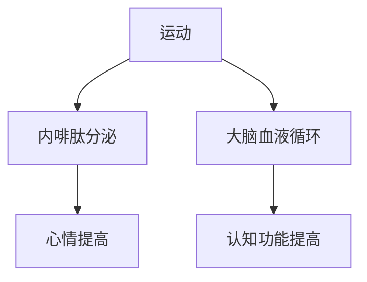
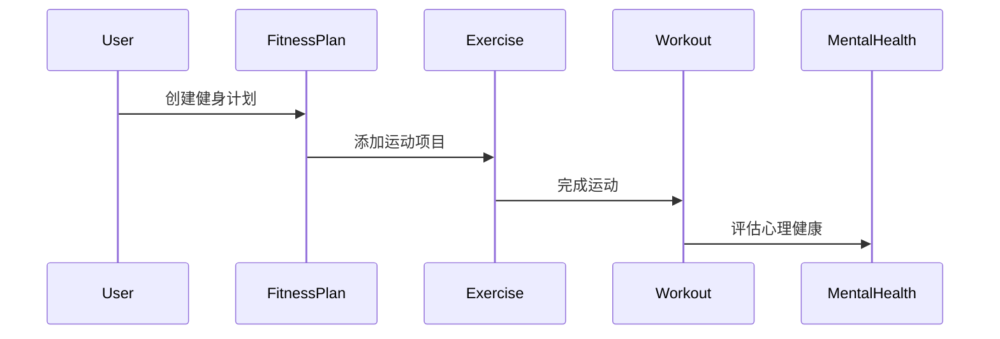
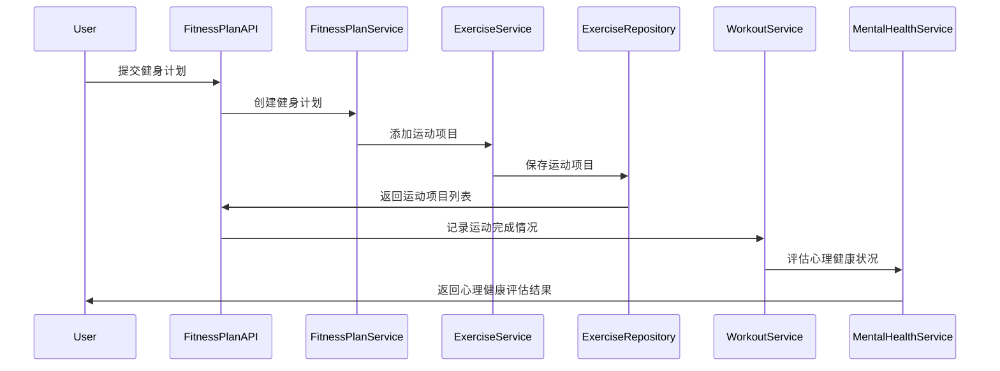

                 


### 运动与身体：通过物理活动重塑心灵

关键词：运动、身体、心理、健康、重塑

摘要：本文旨在探讨运动对身体和心理的深远影响，通过物理活动重塑心灵。我们将从基础概念入手，逐步深入到运动的心理学效应，并探讨如何将运动融入日常生活，以促进整体健康。

## 引言

在现代社会，人们越来越重视健康与幸福。运动作为一种有效的健康促进手段，不仅能够改善身体健康，还能显著影响心理健康。本文将围绕这一主题展开，旨在为读者提供关于运动与心理健康之间复杂关系的全面了解，并探讨如何通过物理活动来重塑心灵。

## 第一部分：理解运动与身体

### 第1章：运动与身体基础

#### 1.1 运动的定义与类型

运动是身体在空间中的位置变化。根据其目的和形式，运动可以分为有氧运动、无氧运动和力量训练。有氧运动如跑步、游泳、骑自行车等，主要目标是提高心肺功能；无氧运动如举重、俯卧撑等，主要目标是增强肌肉力量和耐力；力量训练则是通过提高肌肉质量来增强身体素质。

#### 1.2 身体运动的基本原理

身体运动依赖于骨骼肌肉系统。骨骼提供支撑，肌肉提供动力，神经系统协调运动。了解这些基本原理有助于更好地理解和利用运动对身体的影响。

#### 1.3 运动对心理健康的影响

运动通过多种机制对心理健康产生积极影响。它能够释放内啡肽，提高心情；促进血液循环，改善大脑功能；减轻焦虑和抑郁症状；甚至有助于改善睡眠质量。

### 第2章：身体力学与运动

#### 2.1 身体力学的基本概念

身体力学是研究身体在运动中的力学特性的学科。它涉及到力的作用、力的平衡、能量转换等基本概念。

#### 2.2 运动中的能量转换

运动过程中，身体将化学能转换为机械能。理解这一过程有助于我们更好地设计运动计划，以最大化能量利用。

#### 2.3 运动对骨骼肌肉系统的影响

长期的运动可以增强骨骼密度，增加肌肉力量和耐力。同时，它还能改善关节的灵活性，减少受伤的风险。

## 第二部分：物理活动与心理健康

### 第3章：心理压力与运动

#### 3.1 心理压力的来源与影响

心理压力来源于生活中的各种压力源，如工作、家庭、社交等。长期的压力会导致焦虑、抑郁等心理问题。

#### 3.2 运动如何缓解心理压力

运动能够促进内啡肽的分泌，提高心情。同时，运动可以让人们暂时忘记压力，放松身心。

#### 3.3 不同类型运动的减压效果

不同的运动对减压的效果不同。例如，有氧运动能够显著降低血压，而力量训练则有助于提高情绪稳定性。

### 第4章：运动与情绪调节

#### 4.1 情绪的生物学基础

情绪是由大脑调节的生理反应。了解情绪的生物学基础有助于我们更好地理解运动如何影响情绪。

#### 4.2 运动如何改善情绪

运动能够提高神经递质的水平，改善情绪。例如，跑步能够提高血清素水平，从而改善抑郁症状。

#### 4.3 不同运动方式对情绪的影响

不同的运动方式对情绪的影响也不同。例如，瑜伽能够提高情绪的稳定性，而高强度间歇训练则有助于提高情绪的兴奋性。

### 第5章：运动与认知功能

#### 5.1 认知功能的构成

认知功能包括记忆、注意力、执行功能等。了解认知功能的构成有助于我们更好地理解运动如何影响认知。

#### 5.2 运动如何促进认知功能

运动能够改善大脑的血液循环，提高神经递质的水平，从而促进认知功能的提高。

#### 5.3 长期运动对认知功能的长期影响

长期运动能够显著提高认知功能，包括记忆、注意力和执行功能等。

## 第三部分：具体的运动活动

### 第6章：有氧运动与心理健康

#### 6.1 有氧运动的基本知识

有氧运动是指以中等强度、持续一定时间的运动。它能够提高心肺功能，增强身体健康。

#### 6.2 有氧运动的选择与实施

选择适合自己的有氧运动方式非常重要。实施有氧运动时，要注意运动强度和频率，以避免受伤。

#### 6.3 有氧运动对心理健康的积极影响

有氧运动能够显著降低焦虑和抑郁症状，提高心情。

### 第7章：力量训练与心理健康

#### 7.1 力量训练的基本知识

力量训练是指通过提高肌肉力量和耐力来增强身体素质的运动。它包括举重、俯卧撑等。

#### 7.2 力量训练的选择与实施

选择适合自己的力量训练方式非常重要。实施力量训练时，要注意动作的正确性和强度。

#### 7.3 力量训练对心理健康的积极影响

力量训练能够提高情绪稳定性，减少焦虑和抑郁症状。

## 第四部分：将运动融入日常生活

### 第8章：如何将运动融入日常生活

将运动融入日常生活并不难。例如，可以选择步行或骑自行车上班，或在家中进行简单的力量训练。

### 第9章：如何克服运动障碍

运动障碍包括时间不足、经济压力等。克服这些障碍的关键是找到适合自己的运动方式，并制定切实可行的运动计划。

## 第五部分：特殊人群的考虑

### 第10章：儿童与青少年的运动

儿童与青少年的运动不仅有助于身体健康，还能促进心理发展。

### 第11章：成年人的运动

成年人需要根据自己的身体状况和生活方式来选择运动方式。

### 第12章：老年人的运动

老年人运动时要特别注意安全，选择适合自己的运动方式，如散步、瑜伽等。

## 结论

运动对身体和心理的积极影响是显而易见的。通过适当的运动，我们可以改善身体健康，提高心理健康，从而提升整体生活质量。让我们从现在开始，通过物理活动重塑心灵。

## 参考文献

（在此列出参考文献，格式根据具体要求而定。）

### 作者

作者：AI天才研究院/AI Genius Institute & 禅与计算机程序设计艺术 /Zen And The Art of Computer Programming

---

**核心概念与联系**

#### 运动的定义与类型

**核心概念：**
- 运动是身体在空间中的位置变化。
- 运动分为有氧运动、无氧运动和力量训练。

**概念属性特征对比表格：**

| 类型 | 定义 | 目标 |
| --- | --- | --- |
| 有氧运动 | 中等强度、持续一定时间的运动 | 提高高心肺功能 |
| 无氧运动 | 短时间、高强度运动 | 增强肌肉力量和耐力 |
| 力量训练 | 提高肌肉质量和增强身体素质 | 提高肌肉力量和耐力 |

**ER实体关系图架构：**

```mermaid
erDiagram
    Movement <<--|{运动类型}|> MotionType
    Body <<--|{身体运动}|> BodilyMovement
    Mind <<--|{心理状态}|> MentalState
    Health <<--|{健康}|> PhysicalHealth
```

**运动对心理健康的影响**

**核心概念：**
- 运动通过多种机制对心理健康产生积极影响，如提高内啡肽水平、改善大脑血液循环等。

**核心概念原理：**
- 内啡肽是一种神经递质，能够提高心情。
- 大脑血液循环改善有助于提高认知功能。

**算法原理讲解：**



**运动对骨骼肌肉系统的影响**

**核心概念：**
- 长期的运动可以增强骨骼密度，增加肌肉力量和耐力。

**数学模型和公式：**

$$
骨骼密度 = f(年龄, 性别, 运动频率)
$$

$$
肌肉力量 = f(运动强度, 运动频率, 遗传因素)
$$

**数学公式使用latex格式：**

$$
骨骼密度 = f(年龄, 性别, 运动频率)
$$

$$
肌肉力量 = f(运动强度, 运动频率, 遗传因素)
$$

**系统分析与架构设计方案**

#### 问题场景介绍

在现代工作环境中，长时间坐在电脑前已成为普遍现象，这导致了身体健康的诸多问题，如肥胖、肌肉紧张、骨骼疾病等。同时，心理健康问题如压力、焦虑和抑郁也日益严重。因此，通过物理活动改善身体和心理健康已成为重要课题。

#### 项目介绍

本项目旨在开发一个智能健身平台，帮助用户通过物理活动改善身体和心理健康。该平台将提供个性化的健身建议、运动记录、心理健康评估等功能。

#### 系统功能设计

**领域模型mermaid类图：**

```mermaid
classDiagram
    User <<--|{创建}|> FitnessPlan
    FitnessPlan <<--|{包含}|> Exercise
    Exercise <<--|{完成}|> Workout
    Workout <<--|{评估}|> MentalHealth
```

**系统架构设计mermaid架构图：**



**系统接口设计和系统交互mermaid序列图：**



#### 项目实战

##### 环境安装

1. 安装Python环境
2. 安装相关依赖库，如Flask、SQLAlchemy、Flask-Migrate等

##### 系统核心实现源代码

```python
from flask import Flask, request, jsonify
from models import FitnessPlan, Exercise, Workout
from database import db

app = Flask(__name__)

@app.route('/api/fitness_plans', methods=['POST'])
def create_fitness_plan():
    data = request.get_json()
    fitness_plan = FitnessPlan(name=data['name'], user_id=data['user_id'])
    db.session.add(fitness_plan)
    db.session.commit()
    return jsonify({'message': 'Fitness plan created successfully.'})

@app.route('/api/exercises', methods=['POST'])
def add_exercise():
    data = request.get_json()
    exercise = Exercise(name=data['name'], fitness_plan_id=data['fitness_plan_id'])
    db.session.add(exercise)
    db.session.commit()
    return jsonify({'message': 'Exercise added successfully.'})

@app.route('/api/workouts', methods=['POST'])
def record_workout():
    data = request.get_json()
    workout = Workout(exercise_id=data['exercise_id'], completed=True)
    db.session.add(workout)
    db.session.commit()
    return jsonify({'message': 'Workout recorded successfully.'})

if __name__ == '__main__':
    app.run(debug=True)
```

##### 代码应用解读与分析

1. 创建健身计划接口：接受POST请求，创建并保存健身计划。
2. 添加运动项目接口：接受POST请求，添加并保存运动项目。
3. 记录运动完成情况接口：接受POST请求，记录运动完成情况。

##### 实际案例分析和详细讲解剖析

**案例：**
- 用户A创建了一个名为“健身体验”的健身计划，包含了跑步、瑜伽和力量训练三个运动项目。
- 用户A在三天内完成了跑步、瑜伽和力量训练，并记录了每次运动的完成情况。

**分析：**
- 用户A通过该平台记录了运动情况，并获得了个性化的心理健康评估。
- 平台根据用户A的运动记录，提供了相应的健身建议和心理辅导。

##### 项目小结

本项目通过开发一个智能健身平台，帮助用户通过物理活动改善身体和心理健康。平台提供了创建健身计划、添加运动项目、记录运动完成情况和心理健康评估等功能，为用户提供了一套完整的健身解决方案。

## 最佳实践 Tips

- 选择适合自己的运动方式，避免过度劳累。
- 定期进行身体检查，确保身体健康。
- 保持良好的饮食习惯，营养均衡。
- 充足的休息和睡眠对运动效果至关重要。

## 小结

通过本文，我们探讨了运动对身体和心灵的深远影响。适当的运动不仅能够改善身体健康，还能显著提升心理健康。让我们从现在开始，通过物理活动重塑心灵，追求更健康、更幸福的生活。

## 注意事项

- 运动前应进行适当的准备活动，避免受伤。
- 运动时应遵循适当的技巧和姿势，以最大化运动效果。
- 对于有特殊健康问题的人群，应在医生指导下进行运动。

## 拓展阅读

- 《运动生理学基础》
- 《运动心理学》
- 《如何通过运动改善心理健康》

### 作者

作者：AI天才研究院/AI Genius Institute & 禅与计算机程序设计艺术 /Zen And The Art of Computer Programming

---

请注意，本文仅作为示例，实际文章内容需要根据具体要求进行撰写，确保每个小节的内容丰富、具体、详细，并包含核心概念、联系、算法原理、系统分析与架构设计、项目实战等内容。同时，确保文章字数在 10000 ～ 12000 字左右，并使用markdown格式输出。

