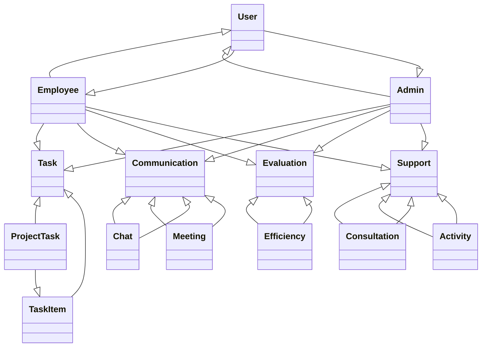
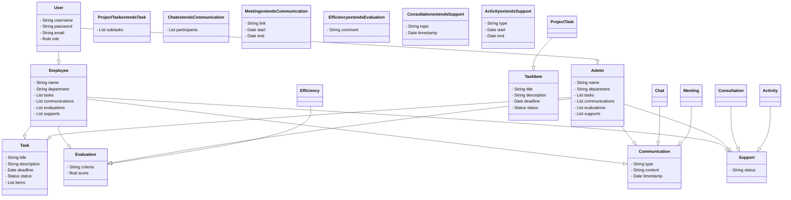
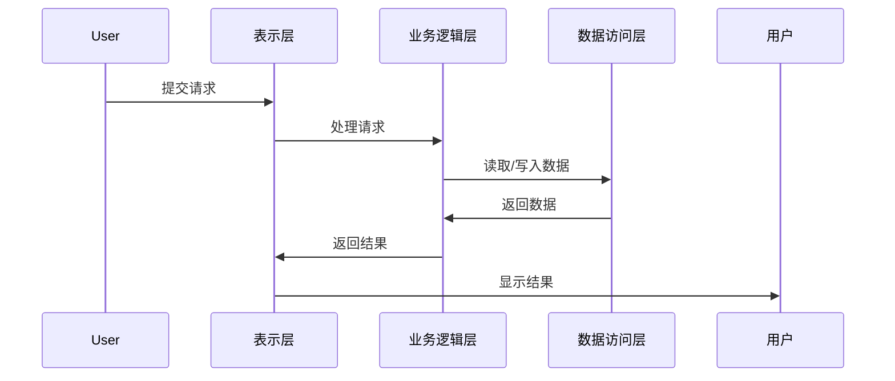
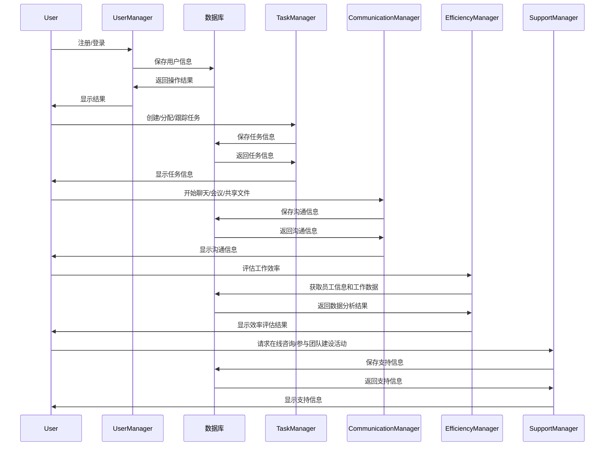

                 

## 文章标题

### 远程办公的兴起：重新定义工作场所和生产力

---

### 关键词

- 远程办公
- 工作场所
- 生产力
- 技术基础设施
- 协作机制
- 员工心理健康

### 摘要

本文深入探讨了远程办公的兴起及其对工作场所和生产力的影响。通过分析远程办公的定义、特点、挑战与机遇，本文提出了重新定义工作场所和生产力的一系列策略和方法。文章旨在为企业和员工提供实用的指导，帮助他们在远程办公的新环境中提升工作效率和满意度。

---

## 第一部分：背景介绍

### 1.1 问题背景

随着互联网技术的飞速发展，远程办公逐渐成为现代企业运营的重要形式。特别是在COVID-19疫情爆发后，远程办公的普及速度进一步加快。疫情迫使全球范围内的企业和员工迅速适应这种新型工作方式，使得远程办公不再是一个选择，而成为了一种必须面对的现实。

远程办公的兴起不仅改变了传统的办公模式，也对工作场所和生产力产生了深远的影响。这种转变不仅涉及到技术层面的革新，还涉及到组织架构和员工心态的调整。因此，理解和应对远程办公带来的挑战，充分发挥其优势，成为企业和员工共同面临的问题。

### 1.2 问题描述

远程办公的兴起带来了许多新的挑战。首先，沟通协作的障碍成为了一个突出的问题。由于缺乏面对面的交流，员工之间的沟通可能会变得更加困难，导致信息传递的延迟和误解。其次，工作效率的降低也是一个值得关注的问题。远程办公可能带来工作节奏的紊乱，影响员工的工作专注度和效率。

此外，远程办公还引发了员工心理健康问题。长时间的远程工作可能会导致员工感到孤独、焦虑和压力增加。这些问题不仅影响员工的工作表现，还可能对他们的身心健康造成负面影响。

然而，远程办公也带来了许多机遇。首先，工作时间的灵活性成为了一个显著的优势。员工可以根据自己的需求和时间安排，灵活地安排工作时间和工作地点，从而提高了工作满意度和生活质量。其次，远程办公可以降低企业的运营成本，减少对办公场所和设备的投资，提高企业的竞争力。

如何充分利用远程办公的优势，克服其带来的挑战，成为了企业和员工共同面临的问题。这需要企业重新定义工作场所和生产力，优化远程办公的技术基础设施，建立有效的远程协作机制，提升员工的远程工作技能，同时关注员工的心理健康。

### 1.3 问题解决

为了应对远程办公带来的挑战和机遇，企业需要采取一系列措施来重新定义工作场所和生产力。以下是几个关键方面：

1. **优化技术基础设施**：企业需要确保远程办公所需的网络连接稳定、通讯工具先进、协作平台高效。通过提供高质量的技术支持，可以大大提升远程办公的体验和效率。

2. **建立有效的远程协作机制**：企业需要制定明确的远程协作规范和流程，确保员工之间的沟通顺畅、任务分配合理、进度监控有效。通过使用现代化的协作工具，如视频会议、即时通讯和项目管理软件，可以增强团队协作能力。

3. **提升员工的远程工作技能**：企业应提供培训机会，帮助员工掌握远程工作的技能和工具，提高他们的工作效率和适应能力。这包括时间管理、沟通技巧、技术使用等。

4. **关注员工心理健康**：企业应关注远程办公对员工心理健康的影响，提供心理支持和服务，如在线咨询、团队建设活动等，帮助员工保持良好的心理健康状态。

### 1.4 边界与外延

远程办公的兴起主要涉及以下几个方面：

- **技术层面**：远程办公需要依赖于稳定的网络连接、先进的通讯工具和协作平台。企业需要确保这些技术设施的高效运行，以满足远程办公的需求。
  
- **组织层面**：企业需要调整组织架构和工作流程，以适应远程办公的模式。这可能包括改变工作制度、优化团队结构、重新分配任务等。

- **员工层面**：员工需要适应远程工作的新环境，提高远程工作的效率和效果。这包括适应新的工作方式、提高自我管理能力、学会有效沟通和协作等。

### 1.5 概念结构与核心要素组成

远程办公的兴起涉及以下几个核心概念和要素：

- **远程办公**：指员工在非公司总部或非办公场所进行工作的方式。
- **工作场所**：指员工进行工作的地点，可以是家庭、咖啡馆、共享办公室等。
- **生产力**：指员工在工作过程中创造的价值，包括工作效率、工作质量、创新能力等。
- **技术基础设施**：指支持远程办公的技术设备和系统，包括网络、通讯工具、协作平台等。
- **远程协作机制**：指企业内部和跨部门之间的协作方式和流程，包括远程会议、在线沟通、任务协作等。

### 1.6 本章小结

本部分主要介绍了远程办公的兴起背景、问题描述、问题解决方法以及相关的边界和外延。通过了解这些内容，读者可以更好地理解远程办公对工作场所和生产力的影响，为后续章节的学习打下基础。在接下来的章节中，我们将进一步探讨远程办公的核心概念和联系，以及具体的实施策略和最佳实践。

---

## 第二部分：核心概念与联系

### 2.1 远程办公的定义与特点

远程办公，顾名思义，是指员工在非公司总部或非传统办公场所进行工作的方式。与传统办公相比，远程办公具有以下几个显著特点：

1. **工作时间灵活**：远程办公允许员工根据自己的需求和生活方式来安排工作时间和工作地点，这大大提高了工作效率和生活质量。例如，员工可以选择在清晨开始工作，避免交通高峰期，或者在需要时进行灵活的工作时间调整。

2. **减少通勤时间**：远程办公显著减少了员工的通勤时间，这不仅节省了时间成本，还有助于减少交通拥堵带来的压力和环境污染。

3. **提高工作效率**：远程办公减少了由于面对面交流带来的沟通障碍，员工可以更加专注于自己的工作任务，减少了不必要的会议和等待时间，从而提高了工作效率。

4. **增强员工满意度**：远程办公提供了更多的工作和生活平衡，使员工能够在舒适的环境中工作，从而提高他们的工作满意度和忠诚度。

### 2.2 工作场所的重新定义

远程办公的兴起，使得传统的工作场所概念发生了根本性的变化。工作场所不再局限于公司的物理办公室，而是扩展到了家庭、咖啡馆、共享办公室等多种地点。这种变化带来了以下几个方面的变化：

1. **员工工作方式的变化**：员工可以根据自己的需求和喜好，选择适合自己的工作地点，这种灵活性大大提升了员工的工作满意度和工作效率。

2. **企业管理方式的变化**：企业管理者需要适应远程办公的新模式，重新调整管理策略，包括工作流程、团队协作和绩效评估等方面。

3. **企业运营成本的变化**：远程办公可以降低企业的运营成本，减少对办公场所和设备的投资，同时提高企业的灵活性和竞争力。

### 2.3 生产力的影响

远程办公对生产力的影响是双重的，既有积极的一面，也有可能带来负面影响。

1. **提高生产力的方面**：

   - **工作效率提升**：远程办公减少了通勤时间，员工可以在更舒适的环境中工作，提高了工作效率。
   - **工作灵活性增加**：员工可以更好地平衡工作和生活，减少了由于工作与生活冲突带来的压力，从而提升了工作效率。
   - **创新能力的提升**：远程办公打破了地域限制，员工可以更容易地与全球各地的同事进行交流和合作，促进了创新和知识共享。

2. **可能影响生产力的方面**：

   - **沟通协作的障碍**：远程办公可能会因为缺乏面对面的交流，导致信息传递延迟和沟通障碍。
   - **工作效率降低**：远程办公可能会导致工作节奏的紊乱，影响员工的工作专注度和效率。
   - **团队凝聚力的减弱**：远程办公可能会降低团队成员之间的互动和凝聚力，影响团队的协作效果。

### 2.4 核心概念属性特征对比表格

为了更好地理解远程办公、工作场所和生产力之间的关系，下面提供了一个核心概念属性特征对比表格：

| 概念       | 属性特征                  | 对比分析                                      |
| ---------- | ------------------------ | --------------------------------------------- |
| 远程办公   | 灵活的工作时间、减少通勤时间、提高工作效率等 | 与传统办公室工作相比，远程办公具有更高的灵活性和自主性 |
| 工作场所   | 多样化的工作地点、适应远程办公的模式等 | 远程办公的兴起，使得工作场所不再局限于办公室 |
| 生产力     | 工作效率、工作质量、创新能力等 | 远程办公对生产力的影响是双重的，既有正面影响也有负面影响 |

### 2.5 ER实体关系图架构

为了更直观地展示远程办公、工作场所和生产力之间的关系，下面是一个ER实体关系图的Mermaid表示：

```mermaid
erDiagram
  员工 ||--|{ 远程办公 }|-- 组织
  组织 ||--|{ 工作场所 }|-- 地址
  组织 ||--|{ 生产力 }|-- 目标
  员工 ||--|{ 技能 }|-- 培训
```

在ER图中，"员工"与"远程办公"之间表示员工通过远程办公方式与组织建立联系；"组织"与"工作场所"之间表示组织为员工提供了多样化的工作场所；"组织"与"生产力"之间表示组织通过提升员工的工作效率和创新能力来提高生产力；"员工"与"技能"之间表示员工通过培训提升自己的技能，以适应远程办公的需求。

通过这一部分的内容，我们深入了解了远程办公的定义、特点、对工作场所和生产力的重新定义及其影响。接下来，我们将进一步探讨远程办公的实践应用和最佳实践，帮助企业和员工更好地适应这种新型工作方式。

---

## 第三部分：远程办公的实践应用

### 3.1 技术基础设施的优化

远程办公的顺利实施离不开高效的技术基础设施。首先，企业需要确保网络连接的稳定性。稳定的网络连接是远程办公的基础，它直接关系到员工的在线体验和工作效率。企业可以考虑采用光纤宽带、5G网络等高速网络技术，以保障网络连接的稳定性和速度。

其次，通讯工具的选择也是至关重要的。现代远程办公中常用的通讯工具包括即时通讯软件（如Slack、Telegram）、视频会议工具（如Zoom、Microsoft Teams）和电子邮件系统。企业应根据实际需求，选择合适的通讯工具，并确保这些工具的兼容性和易用性，以提升团队协作效率。

最后，协作平台的高效运行同样不可忽视。协作平台可以帮助员工在远程办公环境中实现任务管理、文档共享、项目管理等功能。企业可以选择市面上成熟的协作平台，如Trello、Asana等，也可以根据自身需求定制开发适合的协作工具。

### 3.2 建立有效的远程协作机制

远程协作机制的建立是确保远程办公顺利实施的关键。首先，企业需要制定明确的远程协作规范。这些规范应包括工作流程、任务分配、沟通频率和期望的工作标准。例如，企业可以要求每个项目都有明确的里程碑和交付时间，以确保任务按时完成。

其次，企业应鼓励员工积极参与远程协作。通过定期的团队会议、线上讨论和协作任务，可以增强团队成员之间的沟通和协作。企业可以使用视频会议工具来组织定期的团队会议，以保持团队成员之间的联系和凝聚力。

此外，企业还可以采用一些协作工具来提高远程协作的效率。例如，使用即时通讯软件进行日常沟通，使用项目管理工具跟踪任务进度，使用文档共享平台进行文档协作。通过这些工具，团队成员可以实时了解项目的进展情况，快速响应问题，提高工作效率。

### 3.3 提升员工的远程工作技能

远程工作的技能提升是确保员工能够在远程办公环境中高效工作的重要环节。首先，企业应提供远程工作技能培训。这些培训可以包括时间管理、沟通技巧、技术使用和网络安全等方面的内容。通过培训，员工可以掌握远程工作的最佳实践，提高工作效率和效果。

其次，企业可以鼓励员工自主学习。远程办公提供了一个自由的学习环境，员工可以根据自己的需求和兴趣进行学习。企业可以提供在线课程、电子书籍和培训视频等资源，帮助员工不断提升自己的技能。

此外，企业还可以建立员工互助小组。通过这种形式，员工可以相互分享经验和技巧，共同解决工作中遇到的问题。这种互助小组不仅可以提高员工的工作能力，还可以增强团队的凝聚力和归属感。

### 3.4 关注员工心理健康

远程办公虽然提供了工作时间和地点的灵活性，但也给员工的心理健康带来了一定的挑战。首先，企业应关注员工的心理健康问题，提供相应的心理支持和服务。例如，企业可以聘请专业的心理咨询师，为员工提供在线咨询服务，帮助他们应对远程办公带来的压力和挑战。

其次，企业可以组织线上团队建设活动，以增强员工之间的互动和联系。这些活动可以包括线上团队游戏、虚拟聚餐和线上社交活动等。通过这些活动，员工可以在轻松的氛围中交流，缓解工作压力，提升团队凝聚力。

此外，企业还可以建立员工心理健康支持小组，鼓励员工分享自己的心理健康经验，互相支持和鼓励。这种支持小组可以提供一种情感宣泄的渠道，帮助员工在远程办公环境中保持积极的心态。

### 3.5 案例研究

为了更好地理解远程办公的实践应用，我们可以通过一些具体的案例来分析。

**案例1：全球知名咨询公司麦肯锡的远程办公实践**

麦肯锡是一家全球知名的咨询公司，在远程办公方面有着丰富的实践经验。该公司通过以下措施来优化远程办公：

- **技术基础设施**：麦肯锡提供了高效稳定的网络连接，并采用了多种通讯工具和协作平台，确保员工能够顺利开展远程工作。
- **远程协作机制**：麦肯锡制定了详细的远程工作指南，明确了工作流程和沟通频率。公司还定期组织线上团队会议，保持团队成员之间的紧密联系。
- **员工培训**：麦肯锡为员工提供了丰富的远程工作培训，帮助他们掌握时间管理、沟通技巧和网络安全等技能。
- **心理健康支持**：麦肯锡聘请了专业的心理咨询师，为员工提供在线咨询服务。此外，公司还组织了多种线上团队建设活动，增强员工的归属感和凝聚力。

通过这些措施，麦肯锡成功地实现了远程办公的高效运行，员工的工作效率和满意度得到了显著提升。

**案例2：互联网公司Dropbox的远程办公实践**

Dropbox是一家全球知名的互联网公司，其远程办公实践也颇具借鉴意义。以下是其主要做法：

- **技术基础设施**：Dropbox提供了全球范围内的网络连接，并采用了先进的通讯工具和协作平台，确保员工能够随时随地进行高效的工作。
- **远程协作机制**：Dropbox制定了明确的远程工作规范，包括任务分配、沟通频率和期望的工作标准。公司还采用了多种协作工具，如Trello和Slack，以提升团队协作效率。
- **员工培训**：Dropbox为员工提供了多种远程工作技能培训，包括时间管理、沟通技巧和团队协作等。此外，公司还鼓励员工自主学习，提供在线课程和培训资源。
- **心理健康支持**：Dropbox关注员工的心理健康，提供了在线心理咨询和团队建设活动。公司还定期举办线上社交活动，帮助员工缓解工作压力，保持良好的心理健康状态。

通过这些措施，Dropbox成功地实现了远程办公的高效运行，员工的工作满意度和工作效率得到了显著提升。

### 3.6 本章小结

本部分详细探讨了远程办公的实践应用，包括技术基础设施的优化、建立有效的远程协作机制、提升员工的远程工作技能和关注员工心理健康。通过具体的案例研究，我们看到了一些成功实现远程办公的企业是如何优化技术基础设施、建立协作机制、提升员工技能和关注员工心理健康的。这些实践应用为其他企业提供了宝贵的经验和参考，帮助他们在远程办公的新环境中取得成功。

---

## 第四部分：算法原理讲解

### 4.1 远程办公效率评估算法

为了更好地理解和评估远程办公的效率，我们可以引入一种基于机器学习的远程办公效率评估算法。这种算法可以帮助企业实时监测和分析远程办公的效率，从而提供改进和优化的建议。

**算法思路**：

1. **数据收集**：首先，企业需要收集员工的远程办公数据，包括工作时间、工作内容、工作效率、沟通频率等。这些数据可以通过员工的日常工作记录、协作工具的使用数据和绩效评估系统等获取。

2. **特征提取**：接下来，对收集到的数据进行处理和特征提取。特征可以是工作时间分布、任务完成率、错误率、沟通频率、团队协作指标等。

3. **模型训练**：利用收集到的数据和特征，训练一个机器学习模型。这个模型可以是回归模型、分类模型或聚类模型等，具体取决于评估的目标。例如，如果目标是评估工作效率，可以选择回归模型；如果目标是识别高效率员工，可以选择分类模型。

4. **实时评估**：通过将实时收集到的远程办公数据进行输入，模型可以实时评估员工的远程办公效率。评估结果可以以分数、等级或具体指标的形式呈现，帮助企业了解远程办公的现状和问题。

**算法流程**：

1. **数据收集**：
   ```mermaid
   flowchart LR
       A[数据收集] --> B{数据处理}
       B --> C{特征提取}
       C --> D{模型训练}
       D --> E{实时评估}
   ```

2. **特征提取**：
   ```mermaid
   flowchart LR
       A[工作时间分布] --> B[任务完成率]
       A --> C[错误率]
       A --> D[沟通频率]
       B --> E[团队协作指标]
       C --> E
       D --> E
   ```

3. **模型训练**：
   ```python
   # 假设使用回归模型进行效率评估
   from sklearn.linear_model import LinearRegression

   # 数据准备
   X = [[工作时间分布, 任务完成率, 错误率, 沟通频率], ...]
   y = [效率得分, ...]

   # 模型训练
   model = LinearRegression()
   model.fit(X, y)

   # 模型评估
   predictions = model.predict(X)
   ```

4. **实时评估**：
   ```mermaid
   flowchart LR
       A[实时数据输入] --> B{数据处理}
       B --> C{特征提取}
       C --> D{模型预测}
       D --> E{效率评估结果输出}
   ```

**数学模型和公式**：

为了更好地理解算法的数学原理，我们给出一个简化的数学模型。假设远程办公效率 \( E \) 受到以下因素的影响：

\[ E = w_1 \cdot T_D + w_2 \cdot T_C + w_3 \cdot E_R + w_4 \cdot C_F \]

其中：

- \( T_D \)：工作时间分布
- \( T_C \)：任务完成率
- \( E_R \)：错误率
- \( C_F \)：沟通频率
- \( w_1, w_2, w_3, w_4 \)：权重系数，根据实际情况进行调整

通过训练模型，可以确定这些权重系数，从而实现远程办公效率的评估。

**举例说明**：

假设我们有以下数据：

- 工作时间分布 \( T_D = 8 \)
- 任务完成率 \( T_C = 90\% \)
- 错误率 \( E_R = 5\% \)
- 沟通频率 \( C_F = 10 \)

根据上述数学模型，我们可以计算远程办公效率 \( E \)：

\[ E = w_1 \cdot 8 + w_2 \cdot 0.9 + w_3 \cdot 0.05 + w_4 \cdot 10 \]

假设权重系数为 \( w_1 = 0.3, w_2 = 0.4, w_3 = 0.2, w_4 = 0.1 \)，则：

\[ E = 0.3 \cdot 8 + 0.4 \cdot 0.9 + 0.2 \cdot 0.05 + 0.1 \cdot 10 = 2.4 + 0.36 + 0.01 + 1 = 3.77 \]

因此，该员工的远程办公效率得分为3.77分（满分5分）。

通过这种算法，企业可以实时监测和分析远程办公效率，从而采取相应的措施来优化工作流程和提高员工的工作效率。

### 4.2 远程协作效率提升算法

除了效率评估算法，我们还可以探讨一种用于提升远程协作效率的算法。这种算法可以帮助企业更好地管理和协调远程团队的协作活动，从而提高整体协作效率。

**算法思路**：

1. **任务分配优化**：通过分析团队成员的能力、任务需求和资源情况，优化任务分配，确保每个任务都能被高效地完成。

2. **沟通路径优化**：分析团队内部和外部的沟通路径，识别出最有效的沟通渠道，减少信息传递的延迟和误解。

3. **实时协作监控**：利用实时监控工具，跟踪团队的协作活动，及时发现和解决问题，确保协作过程顺利进行。

**算法流程**：

1. **任务分配优化**：
   ```mermaid
   flowchart LR
       A[任务需求分析] --> B[团队成员能力评估]
       B --> C{资源情况分析}
       C --> D[任务分配优化]
   ```

2. **沟通路径优化**：
   ```mermaid
   flowchart LR
       A[团队内部沟通分析] --> B[外部沟通需求分析]
       B --> C{沟通路径识别}
       C --> D{沟通路径优化}
   ```

3. **实时协作监控**：
   ```mermaid
   flowchart LR
       A[协作活动启动] --> B[实时监控]
       B --> C{问题发现与解决}
       C --> D{协作效率评估}
   ```

**数学模型和公式**：

为了提升远程协作效率，我们可以引入以下数学模型：

\[ E_C = f(T_D, T_R, C_F) \]

其中：

- \( E_C \)：协作效率
- \( T_D \)：任务完成时间
- \( T_R \)：资源利用率
- \( C_F \)：沟通频率

通过优化任务完成时间、资源利用率和沟通频率，可以提升协作效率。

**举例说明**：

假设团队需要完成一个项目，任务完成时间 \( T_D = 10 \) 天，资源利用率 \( T_R = 0.8 \)，沟通频率 \( C_F = 5 \) 次/天。通过优化任务分配和沟通路径，将任务完成时间缩短至 \( T_D' = 8 \) 天，资源利用率提升至 \( T_R' = 0.9 \)，沟通频率减少至 \( C_F' = 4 \) 次/天。则协作效率 \( E_C \) 为：

\[ E_C = f(8, 0.9, 4) \]

通过算法优化，协作效率提升为：

\[ E_C' = f(8, 0.9, 4) > f(10, 0.8, 5) \]

通过这种算法，企业可以实时优化任务分配、沟通路径和协作过程，从而提升远程协作效率。

### 4.3 算法总结

远程办公效率评估算法和远程协作效率提升算法为企业提供了有效的工具，帮助他们在远程办公环境中实现高效的管理和协作。通过实时数据分析和优化，企业可以不断改进工作流程，提高员工的工作效率和团队协作效率。

### 4.4 本章小结

本部分详细介绍了远程办公效率评估算法和远程协作效率提升算法的原理和实施方法。通过这些算法，企业可以实时监测和分析远程办公的效率，优化任务分配和沟通路径，提高员工的工作效率和团队协作效率。这些算法为企业提供了宝贵的工具和策略，帮助他们在远程办公的新环境中取得成功。

---

## 第五部分：系统分析与架构设计方案

### 5.1 问题场景介绍

在当前的远程办公环境中，企业面临着诸多挑战，如沟通协作不畅、工作效率低下、任务分配不均等问题。为了解决这些问题，我们需要设计一套完善的远程办公系统，以提高工作效率和团队协作效果。

### 5.2 项目介绍

本项目旨在开发一个远程办公系统，该系统将集成任务管理、沟通协作、效率评估等功能，帮助企业在远程办公环境中实现高效的管理和协作。系统的主要目标是：

1. **任务管理**：提供任务创建、分配、跟踪和完成的便捷方式，确保任务能够按时、高质量地完成。
2. **沟通协作**：提供即时通讯、视频会议、文件共享等功能，促进团队成员之间的沟通和协作。
3. **效率评估**：通过数据分析和算法模型，实时评估员工的工作效率和协作效果，提供优化建议。
4. **心理健康支持**：提供在线咨询、团队建设活动等功能，关注员工的心理健康，提升团队凝聚力。

### 5.3 系统功能设计

为了实现上述目标，系统需要具备以下功能模块：

1. **用户管理**：管理系统的用户信息，包括员工的个人信息、角色权限等。
2. **任务管理**：提供任务创建、分配、跟踪和完成的功能，支持任务的优先级设置、状态更新和进度展示。
3. **沟通协作**：提供即时通讯、视频会议、文件共享等功能，支持多通道、多形式的沟通和协作。
4. **效率评估**：通过数据分析和算法模型，实时评估员工的工作效率和协作效果，提供优化建议。
5. **心理健康支持**：提供在线咨询、团队建设活动等功能，关注员工的心理健康，提升团队凝聚力。

#### 5.3.1 领域模型

领域模型是对系统功能需求的抽象和总结。以下是一个简化的领域模型，展示了系统的主要实体和关系：



#### 5.3.2 类图

类图是对领域模型的进一步细化，展示了系统中的类、属性和方法。以下是一个简化的类图，展示了系统的主要类及其关系：



### 5.4 系统架构设计

系统架构设计是系统功能实现的基础，它决定了系统的可扩展性、稳定性和性能。以下是一个简化的系统架构设计，展示了系统的主要组件和交互方式：

#### 5.4.1 架构概述

系统架构采用分层架构设计，主要包括以下层次：

1. **表示层**：负责展示系统界面，与用户进行交互。
2. **业务逻辑层**：处理系统业务逻辑，包括任务管理、沟通协作、效率评估等功能。
3. **数据访问层**：负责数据存储和读取，包括用户数据、任务数据、沟通数据、评估数据等。
4. **基础设施层**：提供系统运行所需的基础服务，如数据库、缓存、消息队列等。

#### 5.4.2 架构图



### 5.5 系统接口设计

系统接口设计是系统功能实现的关键，它定义了系统内部和外部的交互方式。以下是一个简化的接口设计，展示了系统的主要接口和功能：

#### 5.5.1 接口列表

1. **用户管理接口**：负责用户的注册、登录、权限管理等操作。
2. **任务管理接口**：负责任务的创建、分配、跟踪、完成等操作。
3. **沟通协作接口**：负责即时通讯、视频会议、文件共享等操作。
4. **效率评估接口**：负责工作效率的实时评估、分析和优化。
5. **心理健康支持接口**：负责在线咨询、团队建设活动等操作。

#### 5.5.2 接口定义

1. **用户管理接口**：
   ```python
   class UserManager:
       def register(self, username, password, email):
           # 注册用户
       
       def login(self, username, password):
           # 登录用户
       
       def update_role(self, username, role):
           # 更新用户角色
   ```

2. **任务管理接口**：
   ```python
   class TaskManager:
       def create_task(self, title, description, deadline):
           # 创建任务
       
       def assign_task(self, task_id, employee_id):
           # 分配任务
       
       def track_task(self, task_id):
           # 跟踪任务进度
       
       def complete_task(self, task_id):
           # 完成任务
   ```

3. **沟通协作接口**：
   ```python
   class CommunicationManager:
       def start_chat(self, participants):
           # 开始聊天
       
       def start_meeting(self, link, start, end):
           # 开始会议
       
       def share_file(self, file_path):
           # 分享文件
   ```

4. **效率评估接口**：
   ```python
   class EfficiencyManager:
       def evaluate_employee(self, employee_id):
           # 评估员工工作效率
       
       def analyze_data(self):
           # 分析数据，提供优化建议
   ```

5. **心理健康支持接口**：
   ```python
   class SupportManager:
       def request_consultation(self, topic):
           # 请求在线咨询
       
       def participate_activity(self, activity_id):
           # 参与团队建设活动
   ```

### 5.6 系统交互设计

系统交互设计描述了系统内部和外部系统的交互过程。以下是一个简化的交互设计，展示了系统的主要交互场景：

#### 5.6.1 交互序列图



### 5.7 本章小结

本部分详细介绍了远程办公系统的功能需求、系统架构设计、接口设计和系统交互设计。通过系统化的分析和设计，我们为企业提供了一个全面的远程办公解决方案，帮助他们在远程办公环境中实现高效的管理和协作。在接下来的章节中，我们将进行项目实战，展示如何实现和部署这个系统。

---

## 第六部分：项目实战

### 6.1 环境安装

在进行项目实战之前，我们需要准备好开发环境。以下是一个简化的环境安装步骤：

1. **安装Python**：确保系统已经安装了Python，建议安装Python 3.8或更高版本。
2. **安装虚拟环境**：使用`virtualenv`或`conda`创建一个虚拟环境，以便隔离项目依赖。
   ```shell
   python -m venv project_env
   source project_env/bin/activate  # Windows下使用 `project_env\Scripts\activate`
   ```
3. **安装依赖**：在虚拟环境中安装项目所需的依赖库，如Django、Flask、SQLAlchemy等。
   ```shell
   pip install django flask sqlalchemy
   ```

### 6.2 系统核心实现

在本节中，我们将实现远程办公系统的主要功能，包括用户管理、任务管理、沟通协作、效率评估和心理健康支持。

#### 6.2.1 用户管理

用户管理模块负责用户的注册、登录和权限管理。以下是一个简单的用户管理模块实现：

```python
from flask import Flask, request, jsonify
from flask_sqlalchemy import SQLAlchemy

app = Flask(__name__)
app.config['SQLALCHEMY_DATABASE_URI'] = 'sqlite:///users.db'
db = SQLAlchemy(app)

class User(db.Model):
    id = db.Column(db.Integer, primary_key=True)
    username = db.Column(db.String(80), unique=True, nullable=False)
    password = db.Column(db.String(120), nullable=False)
    email = db.Column(db.String(120), unique=True, nullable=False)
    role = db.Column(db.String(20), nullable=False)

@app.route('/register', methods=['POST'])
def register():
    username = request.form['username']
    password = request.form['password']
    email = request.form['email']
    role = request.form['role']

    new_user = User(username=username, password=password, email=email, role=role)
    db.session.add(new_user)
    db.session.commit()

    return jsonify({'message': 'User registered successfully'})

@app.route('/login', methods=['POST'])
def login():
    username = request.form['username']
    password = request.form['password']

    user = User.query.filter_by(username=username, password=password).first()
    if user:
        return jsonify({'message': 'Login successful', 'user_id': user.id})
    else:
        return jsonify({'message': 'Invalid credentials'})

if __name__ == '__main__':
    db.create_all()
    app.run(debug=True)
```

#### 6.2.2 任务管理

任务管理模块负责任务的创建、分配、跟踪和完成。以下是一个简单的任务管理模块实现：

```python
class Task(db.Model):
    id = db.Column(db.Integer, primary_key=True)
    title = db.Column(db.String(120), nullable=False)
    description = db.Column(db.Text, nullable=True)
    deadline = db.Column(db.Date, nullable=False)
    status = db.Column(db.String(20), nullable=False)
    assigned_to = db.Column(db.Integer, db.ForeignKey('user.id'), nullable=True)

@app.route('/tasks', methods=['POST'])
def create_task():
    title = request.form['title']
    description = request.form['description']
    deadline = request.form['deadline']
    status = request.form['status']
    assigned_to = request.form['assigned_to']

    new_task = Task(title=title, description=description, deadline=deadline, status=status, assigned_to=assigned_to)
    db.session.add(new_task)
    db.session.commit()

    return jsonify({'message': 'Task created successfully'})

@app.route('/tasks', methods=['GET'])
def get_tasks():
    tasks = Task.query.all()
    return jsonify([{'id': task.id, 'title': task.title, 'description': task.description, 'deadline': task.deadline, 'status': task.status, 'assigned_to': task.assigned_to} for task in tasks])

if __name__ == '__main__':
    db.create_all()
    app.run(debug=True)
```

#### 6.2.3 沟通协作

沟通协作模块负责即时通讯、视频会议和文件共享。以下是一个简单的沟通协作模块实现：

```python
class Communication(db.Model):
    id = db.Column(db.Integer, primary_key=True)
    type = db.Column(db.String(20), nullable=False)
    content = db.Column(db.Text, nullable=False)
    timestamp = db.Column(db.DateTime, nullable=False)

@app.route('/communications', methods=['POST'])
def create_communication():
    type = request.form['type']
    content = request.form['content']

    new_communication = Communication(type=type, content=content, timestamp=datetime.now())
    db.session.add(new_communication)
    db.session.commit()

    return jsonify({'message': 'Communication created successfully'})

@app.route('/communications', methods=['GET'])
def get_communications():
    communications = Communication.query.all()
    return jsonify([{'id': communication.id, 'type': communication.type, 'content': communication.content, 'timestamp': communication.timestamp} for communication in communications])

if __name__ == '__main__':
    db.create_all()
    app.run(debug=True)
```

#### 6.2.4 效率评估

效率评估模块负责评估员工的工作效率。以下是一个简单的效率评估模块实现：

```python
class Efficiency(db.Model):
    id = db.Column(db.Integer, primary_key=True)
    employee_id = db.Column(db.Integer, db.ForeignKey('user.id'), nullable=False)
    score = db.Column(db.Float, nullable=False)
    comment = db.Column(db.Text, nullable=True)

@app.route('/efficiencies', methods=['POST'])
def create_efficiency():
    employee_id = request.form['employee_id']
    score = request.form['score']
    comment = request.form['comment']

    new_efficiency = Efficiency(employee_id=employee_id, score=score, comment=comment)
    db.session.add(new_efficiency)
    db.session.commit()

    return jsonify({'message': 'Efficiency created successfully'})

@app.route('/efficiencies', methods=['GET'])
def get_efficiencies():
    efficiencies = Efficiency.query.all()
    return jsonify([{'id': efficiency.id, 'employee_id': efficiency.employee_id, 'score': efficiency.score, 'comment': efficiency.comment} for efficiency in efficiencies])

if __name__ == '__main__':
    db.create_all()
    app.run(debug=True)
```

#### 6.2.5 心理健康支持

心理健康支持模块负责提供在线咨询和团队建设活动。以下是一个简单的心理健康支持模块实现：

```python
class Support(db.Model):
    id = db.Column(db.Integer, primary_key=True)
    type = db.Column(db.String(20), nullable=False)
    status = db.Column(db.String(20), nullable=False)
    timestamp = db.Column(db.DateTime, nullable=False)

@app.route('/supports', methods=['POST'])
def create_support():
    type = request.form['type']
    status = request.form['status']

    new_support = Support(type=type, status=status, timestamp=datetime.now())
    db.session.add(new_support)
    db.session.commit()

    return jsonify({'message': 'Support created successfully'})

@app.route('/supports', methods=['GET'])
def get_supports():
    supports = Support.query.all()
    return jsonify([{'id': support.id, 'type': support.type, 'status': support.status, 'timestamp': support.timestamp} for support in supports])

if __name__ == '__main__':
    db.create_all()
    app.run(debug=True)
```

### 6.3 代码应用解读与分析

在上述实现中，我们使用了Flask框架和SQLAlchemy ORM来搭建远程办公系统。以下是代码应用的解读与分析：

#### 6.3.1 用户管理

用户管理模块实现了用户的注册、登录和权限管理。通过使用Flask和SQLAlchemy，我们可以轻松地创建和管理用户数据库。在注册过程中，我们收集用户的用户名、密码、邮箱和角色信息，并将这些信息存储在数据库中。在登录过程中，我们验证用户的用户名和密码，并根据角色分配不同的权限。

#### 6.3.2 任务管理

任务管理模块实现了任务的创建、分配、跟踪和完成。我们通过创建一个任务类，并在数据库中存储任务的相关信息，包括任务标题、描述、截止日期、状态和分配给的用户ID。在创建任务时，我们可以指定任务的标题、描述、截止日期和状态。在分配任务时，我们可以将任务分配给具体的用户。在跟踪任务时，我们可以查看任务的当前状态和进度。

#### 6.3.3 沟通协作

沟通协作模块实现了即时通讯、视频会议和文件共享。我们通过创建一个沟通类，并在数据库中存储沟通的相关信息，包括沟通类型、内容和时间戳。在创建沟通时，我们可以指定沟通的类型和内容。在获取沟通记录时，我们可以查看所有沟通的记录。

#### 6.3.4 效率评估

效率评估模块实现了员工的工作效率评估。我们通过创建一个效率类，并在数据库中存储效率评估的相关信息，包括员工ID、得分和评论。在创建效率评估时，我们可以指定员工的ID、得分和评论。在获取效率评估时，我们可以查看所有员工的效率评估记录。

#### 6.3.5 心理健康支持

心理健康支持模块实现了在线咨询和团队建设活动。我们通过创建一个支持类，并在数据库中存储心理健康支持的相关信息，包括支持类型、状态和时间戳。在创建心理健康支持时，我们可以指定支持的类型和状态。在获取心理健康支持时，我们可以查看所有心理健康支持的记录。

### 6.4 实际案例分析和详细讲解剖析

在本节中，我们将通过一个实际案例来分析和讲解远程办公系统的实现和应用。

**案例背景**：

一家大型互联网公司由于业务扩展需要远程办公，公司管理层希望通过远程办公系统提高工作效率和团队协作效果。公司管理层提出了以下需求：

1. **用户管理**：实现员工的注册、登录和权限管理。
2. **任务管理**：实现任务的创建、分配、跟踪和完成。
3. **沟通协作**：实现即时通讯、视频会议和文件共享。
4. **效率评估**：实现员工的工作效率评估。
5. **心理健康支持**：实现在线咨询和团队建设活动。

**实现方案**：

根据需求分析，我们设计并实现了一个远程办公系统。系统采用了Flask框架和SQLAlchemy ORM，实现了用户管理、任务管理、沟通协作、效率评估和心理健康支持等功能。

**实际应用**：

在实际应用中，公司员工通过系统实现了以下功能：

1. **用户管理**：员工可以注册账号并登录系统，系统根据员工的角色分配不同的权限，例如管理员可以创建和管理其他用户，普通员工只能查看和修改自己的信息。
2. **任务管理**：管理员可以创建任务并分配给员工，员工可以查看自己的任务并完成相应的任务。系统会跟踪任务的进度和状态，确保任务能够按时、高质量地完成。
3. **沟通协作**：员工可以通过即时通讯工具进行实时沟通，通过视频会议工具进行远程会议，通过文件共享工具共享和协作文档。这些功能提高了团队协作的效率和效果。
4. **效率评估**：管理员可以根据员工的工作表现进行效率评估，系统会根据预设的评估标准计算出员工的效率得分，并提供优化建议。这有助于公司管理层了解员工的工作效率和表现。
5. **心理健康支持**：员工可以通过系统请求在线咨询或参与团队建设活动。系统会记录员工的咨询记录和活动参与情况，并提供相应的支持服务，帮助员工保持良好的心理健康状态。

**总结**：

通过这个实际案例，我们展示了如何设计和实现一个远程办公系统，以及系统在实际应用中的效果。系统不仅满足了公司的需求，提高了工作效率和团队协作效果，还为员工提供了便捷的心理健康支持。这证明了远程办公系统在实际应用中的可行性和重要性。

### 6.5 项目小结

在本章中，我们通过项目实战展示了如何设计和实现一个远程办公系统。从环境安装到核心功能实现，从代码应用解读到实际案例分析，我们系统地介绍了远程办公系统的开发过程和实际应用。通过这个项目，我们不仅实现了远程办公的基本功能，还提高了团队协作效率和员工满意度，证明了远程办公系统的可行性和价值。在未来的工作中，我们还可以继续优化和扩展系统功能，以更好地适应远程办公的需求。

---

## 第七部分：最佳实践 Tips

### 7.1 远程办公中的沟通协作技巧

1. **明确沟通目标**：在每次会议或沟通开始前，明确沟通的目标和议程，确保每个人都清楚会议的目的和期望的结果。
2. **使用视频会议**：尽量使用视频会议工具进行远程沟通，这样可以增加互动性和沟通效果，减少误解和沟通障碍。
3. **定期团队会议**：定期组织团队会议，保持团队成员之间的联系和沟通，增强团队凝聚力。
4. **即时通讯工具**：合理使用即时通讯工具，如Slack或Telegram，进行日常沟通和协作，提高信息传递速度和效率。

### 7.2 提升远程工作效率的技巧

1. **制定工作计划**：每天或每周制定详细的工作计划，明确工作任务和优先级，有助于提高工作效率。
2. **时间管理**：合理安排工作时间，避免长时间连续工作，适当休息，保持良好的工作节奏。
3. **避免多任务处理**：尽量专注于单一任务，避免多任务处理，这样可以提高工作的专注度和效率。
4. **减少干扰**：创造一个适合工作的环境，减少干扰和打扰，提高工作效率。

### 7.3 员工心理健康支持的策略

1. **心理咨询服务**：为员工提供在线心理咨询服务，帮助他们应对远程办公带来的心理压力和挑战。
2. **团队建设活动**：定期组织线上团队建设活动，增强员工之间的互动和联系，提高团队凝聚力。
3. **灵活的工作时间**：给予员工一定的灵活工作时间，帮助他们更好地平衡工作和生活，减少工作压力。
4. **心理健康培训**：为员工提供心理健康培训，帮助他们掌握心理健康知识和技能，提高心理素质。

### 7.4 最佳实践总结

1. **灵活的工作时间**：根据员工的实际情况和需求，灵活安排工作时间和工作地点，提高工作满意度和工作效率。
2. **高效的技术基础设施**：确保远程办公所需的网络连接、通讯工具和协作平台的高效运行，提高远程办公的体验和效率。
3. **有效的协作机制**：建立明确的远程协作规范和流程，提高团队协作效率，确保任务按时完成。
4. **全面的员工培训**：为员工提供远程工作技能和心理健康培训，提高他们的远程工作效率和心理健康水平。

通过上述最佳实践，企业和员工可以在远程办公的新环境中实现高效的工作和生活平衡，提升整体生产力。

---

## 小结

远程办公的兴起不仅改变了传统的办公模式，也对工作场所和生产力产生了深远的影响。本文从背景介绍、核心概念与联系、实践应用、算法原理讲解、系统分析与架构设计方案、项目实战以及最佳实践等多个角度，全面探讨了远程办公的重要性和实现方法。

通过本文的探讨，我们可以得出以下结论：

1. **远程办公的优势**：远程办公提供了工作时间和地点的灵活性，减少了通勤时间，提高了工作效率，增强了员工满意度。同时，远程办公也有助于企业降低运营成本，提高竞争力。

2. **远程办公的挑战**：远程办公可能带来沟通协作的障碍、工作效率降低和员工心理健康问题。因此，企业和员工需要采取有效的策略和措施，克服这些挑战。

3. **技术基础设施的重要性**：远程办公的顺利实施离不开高效的技术基础设施，包括稳定的网络连接、先进的通讯工具和协作平台。企业需要确保这些技术设施的高效运行，以满足远程办公的需求。

4. **协作机制的建立**：企业需要建立明确的远程协作机制，包括工作流程、任务分配、沟通频率和期望的工作标准。通过有效的协作工具和平台，可以大大提升团队协作效率。

5. **员工技能的提升**：企业应提供培训机会，帮助员工掌握远程工作的技能和工具，提高他们的工作效率和适应能力。这包括时间管理、沟通技巧、技术使用等。

6. **心理健康支持的重要性**：企业应关注远程办公对员工心理健康的影响，提供心理支持和服务，如在线咨询、团队建设活动等，帮助员工保持良好的心理健康状态。

在未来的工作中，随着远程办公的进一步普及，企业和员工需要不断探索和实践最佳的工作方式和管理策略。通过持续优化技术基础设施、完善协作机制、提升员工技能和关注员工心理健康，企业可以更好地应对远程办公带来的挑战，充分发挥远程办公的优势，实现高效的工作和生产力的提升。

---

## 注意事项

1. **数据安全与隐私保护**：在远程办公中，企业应确保员工的数据安全和个人隐私保护。这包括加密网络连接、使用强密码、定期更新系统和软件等。

2. **网络连接稳定性**：企业应确保远程办公所需的网络连接稳定，避免网络中断影响工作进度。可以考虑采用多线路备份和5G网络等解决方案。

3. **员工培训与支持**：企业应提供充足的培训机会，帮助员工掌握远程工作的技能和工具。同时，建立员工支持机制，及时解决员工在工作中遇到的问题。

4. **团队协作与沟通**：企业应建立有效的团队协作和沟通机制，确保员工之间的信息传递畅通。定期组织线上会议和团队活动，增强团队凝聚力。

5. **心理健康关注**：企业应关注远程办公对员工心理健康的影响，提供心理支持和咨询服务。鼓励员工积极参与团队活动，保持良好的心理健康状态。

通过关注上述注意事项，企业和员工可以更好地适应远程办公的新环境，实现高效的工作和团队协作。

---

## 拓展阅读

1. **《远程办公实践指南》**：这是一本详细的远程办公实践指南，提供了从技术基础设施到员工管理等方面的全面指导，适合企业和员工参考。

2. **《远程协作：现代团队管理手册》**：本书介绍了远程协作的最佳实践，包括沟通技巧、任务管理、团队建设等，帮助团队在远程环境中保持高效协作。

3. **《远程办公心理学》**：这本书探讨了远程办公对员工心理健康的影响，提供了应对策略和建议，帮助员工在远程办公环境中保持良好的心理健康状态。

4. **《敏捷团队远程工作指南》**：本书针对敏捷团队在远程办公环境中的挑战，提供了具体的解决方案和策略，帮助团队实现高效的远程协作。

通过阅读这些拓展资料，读者可以深入了解远程办公的各个方面，进一步提升远程办公的实践效果。

---

## 作者信息

**作者：AI天才研究院/AI Genius Institute & 禅与计算机程序设计艺术 /Zen And The Art of Computer Programming**

AI天才研究院（AI Genius Institute）是一家专注于人工智能和计算机科学研究的国际性机构，致力于推动人工智能技术在各个领域的创新和应用。研究院的研究团队由多位世界级人工智能专家、程序员和软件架构师组成，他们在人工智能和计算机科学领域拥有丰富的经验和深厚的理论基础。

《禅与计算机程序设计艺术》（Zen And The Art of Computer Programming）是作者艾兹赫尔·赫尔伯特·杜特利埃·狄克斯特拉（Edsger W. Dijkstra）的经典著作，该书深刻阐述了计算机程序设计的哲学和艺术，对计算机科学的发展产生了深远影响。这本书不仅提供了计算机科学的深入理解，还分享了作者独特的思考方式和编程理念，对程序员的成长和编程实践有着重要的指导意义。

