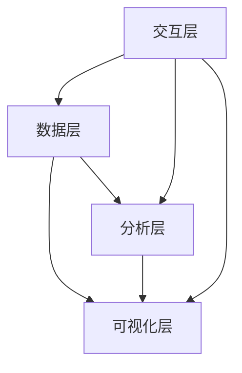
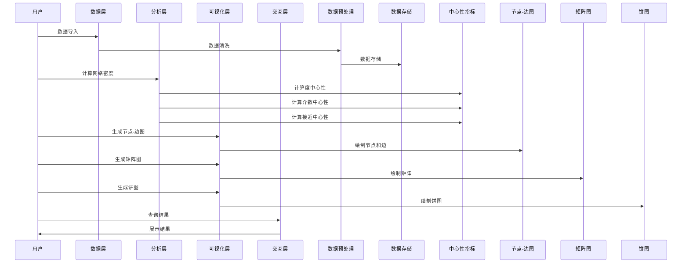

                 

### 文章标题

# 都市孤独地图项目：可视化社交隔离现象

### 关键词

- 都市孤独
- 社交隔离
- 可视化技术
- 数据分析
- Python编程
- 算法原理
- 数学模型

### 摘要

随着现代都市生活的快速发展，孤独和社交隔离成为普遍的社会现象。本文旨在探讨如何利用可视化技术，通过数据分析揭示都市孤独现象及其背后的社交隔离机制。本文首先介绍都市孤独和社交隔离的定义及其背景，然后阐述可视化技术在解决此类问题中的作用。接下来，详细分析孤独与社交隔离的联系，并运用数据可视化的核心概念和算法原理，通过Python编程示例和数学模型，构建一个都市孤独地图项目。此外，本文还介绍系统分析与架构设计方案，并通过实际案例分析和项目实战，提供最佳实践和未来研究方向。文章最后，总结全文内容，提出对读者的建议，并展望未来的研究方向。

## 目录大纲

# 都市孤独地图项目：可视化社交隔离现象

> 关键词：都市孤独、社交隔离、可视化技术、数据分析、Python编程、算法原理、数学模型

> 摘要：本文旨在探讨如何利用可视化技术，通过数据分析揭示都市孤独现象及其背后的社交隔离机制。

## 第1章：问题背景与介绍

### 1.1 问题背景

在快速发展的现代都市中，孤独和社交隔离现象日益突出。这不仅影响个人的心理健康，还对社会结构和人际关系产生深远影响。随着科技和互联网的普及，人们拥有更多的社交途径，但实际的社交质量却在下降。都市中人们生活节奏加快，工作压力增大，导致他们倾向于孤独和疏远社交。这种现象不仅仅存在于个体层面，还体现在社会层面，形成了一种普遍的社交隔离现象。

### 1.2 社交隔离现象的描述

社交隔离现象可以描述为个体在社会中缺乏足够的社交联系，导致孤立感和疏离感。在都市中，社交隔离的表现形式多样，包括：居住在社区但很少与邻居交流，长时间使用社交媒体但缺乏深度互动，工作场所的同事关系疏远等。社交隔离不仅影响个体的心理健康，还可能导致社会凝聚力的下降。

### 1.3 可视化在解决问题中的作用

可视化技术能够将复杂的数据转化为直观的图像，帮助人们更好地理解和分析问题。在都市孤独和社交隔离的研究中，可视化技术可以展示社交网络的密度、连接强度和结构特性，揭示隐藏在数据背后的社交模式。通过可视化，研究人员和决策者可以更清晰地看到问题的全貌，从而提出更有效的解决方案。

### 1.4 书籍结构概述

本文分为九章，分别从问题背景、核心概念、算法原理、数学模型、系统分析与设计、项目实战、最佳实践等方面，系统地介绍了如何利用可视化技术构建都市孤独地图项目。以下是详细的章节结构：

- **第1章**：问题背景与介绍，阐述都市孤独和社交隔离现象及其重要性。
- **第2章**：核心概念，介绍孤独与社交隔离的定义以及可视化技术的概念。
- **第3章**：核心概念与联系，分析孤独与社交隔离的概念联系，并讨论数据可视化与数据分析的关系。
- **第4章**：算法原理讲解，介绍社交网络分析算法和数据可视化算法。
- **第5章**：数学模型和数学公式，讨论社交网络分析的数学模型和数据可视化的数学模型。
- **第6章**：系统分析与架构设计方案，介绍系统功能设计、系统架构设计、系统接口设计和系统交互序列图。
- **第7章**：项目实战，详细讲解环境安装、系统核心实现、实际案例分析和项目小结。
- **第8章**：最佳实践与拓展，提供最佳实践技巧、注意事项和拓展阅读。
- **第9章**：小结，总结全文内容，展望未来的研究方向和对读者的建议。

## 第2章：核心概念

### 2.1 孤独与社交隔离的定义

孤独和社交隔离是两个密切相关的概念，但它们在心理学和社会学中有不同的定义。

- **孤独**：孤独通常指的是个体内心深处的孤独感，这种感觉可能源于缺乏亲密的人际关系、社交支持和情感连接。
- **社交隔离**：社交隔离则是指个体在社会中缺乏足够的社交联系，导致孤立感和疏离感。它不仅涉及个体层面，还可能影响整个社会结构。

### 2.2 可视化技术的概念

可视化技术是指将数据转化为图形、图像或其他视觉元素，以帮助人们更好地理解和分析数据。在数据分析中，可视化技术能够将复杂的数据关系和模式直观地展示出来，从而提高分析效率和效果。

- **数据可视化**：数据可视化是通过图形和图像将数据转换为视觉表现形式，以帮助人们理解和分析数据。
- **交互式可视化**：交互式可视化允许用户通过交互操作来探索和分析数据，提供更为灵活和直观的数据分析体验。

### 2.3 数据分析的基础知识

数据分析是通过对数据进行收集、清洗、处理和分析，从中提取有价值的信息和知识的过程。数据分析的基础知识包括：

- **数据收集**：数据收集是指获取用于分析的数据源，包括问卷调查、社交媒体数据、公开数据集等。
- **数据清洗**：数据清洗是指处理和修正数据中的错误、缺失和重复，确保数据的质量和准确性。
- **数据预处理**：数据预处理包括数据转换、归一化、离散化等操作，为后续分析做好准备。
- **统计分析**：统计分析是通过对数据进行统计分析，发现数据中的规律和模式。
- **机器学习**：机器学习是利用算法和统计模型，从数据中自动学习和发现模式。

### 2.4 数据可视化的核心概念

数据可视化的核心概念包括：

- **数据映射**：数据映射是指将数据值映射到视觉元素（如颜色、大小、形状等），以表示数据的属性和关系。
- **视觉编码**：视觉编码是指利用视觉属性（如颜色、亮度、形状等）来传达数据信息。
- **交互性**：交互性是指用户与可视化界面之间的互动，通过交互操作来探索数据和分析结果。
- **信息层级**：信息层级是指将数据分为不同的层次，以显示数据的复杂性和细节。
- **设计原则**：设计原则是指设计可视化时需要遵循的一些基本原则，如易用性、可读性、一致性等。

### 2.5 数据可视化的作用

数据可视化在解决都市孤独和社交隔离问题中的作用包括：

- **直观展示数据**：通过可视化技术，可以将复杂的社交网络数据、孤独感指标等以直观的图形形式展示，帮助人们更好地理解问题。
- **发现数据模式**：可视化技术可以帮助研究人员发现数据中的隐藏模式和趋势，从而深入了解社交隔离现象。
- **支持决策制定**：通过可视化结果，决策者可以更清晰地看到问题的全貌，从而制定更有效的政策和措施。
- **提高数据可用性**：可视化技术可以提高数据的使用效率和可访问性，使更多的人能够理解和利用数据。

### 2.6 可视化技术的挑战

尽管数据可视化在解决都市孤独和社交隔离问题中具有重要作用，但同时也面临着一些挑战：

- **数据质量**：数据质量是可视化结果准确性的基础。如果数据存在错误、缺失或重复，可视化结果可能会误导用户。
- **可解释性**：可视化结果需要具有高可解释性，以便用户能够理解数据背后的含义和关系。
- **交互性**：交互性是提高可视化效果的重要因素，但实现高交互性的可视化界面需要复杂的编程和设计技能。
- **用户接受度**：用户接受度是数据可视化成功的关键。如果用户对可视化界面不熟悉或使用困难，可视化效果可能会大打折扣。

### 2.7 可视化技术的未来趋势

随着技术的发展，可视化技术也在不断进步，未来趋势包括：

- **增强现实（AR）和虚拟现实（VR）**：利用AR和VR技术，可以实现更为沉浸式的数据可视化体验，提高用户的参与度和理解能力。
- **智能可视化**：通过机器学习和人工智能技术，可以自动生成可视化结果，提高数据分析的效率和准确性。
- **跨领域应用**：数据可视化将在更多领域得到应用，如医疗、金融、环境科学等，解决更为复杂的问题。

### 2.8 数据可视化的应用场景

数据可视化在都市孤独和社交隔离问题中的应用场景包括：

- **社交网络分析**：通过可视化社交网络的连接密度、中心性等指标，揭示社交隔离的现象和原因。
- **孤独感指标分析**：通过可视化孤独感调查数据，分析不同人群的孤独感水平和分布情况。
- **政策制定与评估**：通过可视化政策实施效果，评估政策对缓解孤独和社交隔离的影响。

## 第3章：核心概念与联系

### 3.1 孤独与社交隔离的概念联系

孤独和社交隔离是现代社会中普遍存在的现象，它们之间存在着密切的联系。

- **孤独**：孤独是指个体内心的孤独感，这种感觉可能源于缺乏亲密的人际关系和社交支持。孤独通常是个体层面的感受，但它的形成和缓解往往受到社会环境的影响。
- **社交隔离**：社交隔离是指个体在社会中缺乏足够的社交联系，导致孤立感和疏离感。社交隔离不仅影响个体的心理健康，还可能对社会结构和人际关系产生深远影响。

### 3.2 可视化与数据的关系

可视化技术是数据分析的重要工具，它与数据之间存在紧密的关系。

- **数据驱动**：可视化技术依赖于数据，通过数据来构建和展示可视化结果。没有数据，可视化就没有意义。
- **交互性**：可视化技术通过交互性来增强数据分析效果，用户可以通过交互操作来探索和发现数据中的隐藏模式。
- **反馈循环**：可视化技术可以帮助用户更好地理解数据，从而提供反馈，进一步优化数据分析和可视化结果。

### 3.3 概念属性特征对比表格

为了更好地理解孤独、社交隔离和可视化技术之间的关系，我们可以通过对比它们的属性特征来进行分析。

| 概念         | 定义                                                         | 属性特征                                                                                             |
| ------------ | ------------------------------------------------------------ | ---------------------------------------------------------------------------------------------------- |
| 孤独         | 指个体内心的孤独感，源于缺乏亲密的人际关系和社交支持       | - 情感体验<br>- 主观感受<br>- 内心状态       |
| 社交隔离     | 指个体在社会中缺乏足够的社交联系，导致孤立感和疏离感       | - 社会现象<br>- 个体行为<br>- 社交网络结构   |
| 可视化技术   | 将数据转化为图形、图像或其他视觉元素，以帮助人们更好地理解和分析数据 | - 数据映射<br>- 视觉编码<br>- 交互性<br>- 可解释性 |

### 3.4 ER实体关系图架构

为了更好地理解和分析孤独、社交隔离和可视化技术之间的关系，我们可以使用实体关系图（ER图）来构建它们之间的实体关系。

```mermaid
erDiagram
    User ||--|{ SocialNetwork }
    User ||--|{孤独感指标}
    SocialNetwork ||--|{社交隔离指标}
    孤独感指标 }|..-- SocialNetwork
    可视化技术 }|..-- SocialNetwork
```

在ER图中，我们定义了三个主要实体：用户（User）、社交网络（SocialNetwork）和孤独感指标（孤独感指标）。用户是数据的主要来源，他们通过社交网络进行互动，产生孤独感和社交隔离指标。可视化技术则用于分析和展示这些数据，帮助人们更好地理解和解决孤独和社交隔离问题。

## 第4章：算法原理讲解

### 4.1 社交网络分析算法

社交网络分析（Social Network Analysis, SNA）是研究社交网络结构、动态和属性的一种方法，它广泛应用于社会科学、计算机科学和生物学等领域。在都市孤独和社交隔离的研究中，社交网络分析可以揭示社交网络的密度、连接强度和结构特性，帮助我们更好地理解社交隔离现象。

#### 4.1.1 社交网络分析的基本概念

社交网络分析的基本概念包括：

- **节点（Node）**：节点代表社交网络中的个体，如人、公司等。
- **边（Edge）**：边代表节点之间的连接，表示个体之间的社交关系。
- **网络（Network）**：网络是由节点和边构成的集合，表示个体及其之间的关系。
- **密度（Density）**：网络的密度是边数与可能边数的比值，用于衡量网络的紧密程度。
- **中心性（Centrality）**：中心性是衡量节点在社交网络中的重要性的指标，常用的中心性指标包括度中心性、介数中心性和接近中心性。

#### 4.1.2 社交网络分析的主要算法

社交网络分析的主要算法包括：

- **度中心性（Degree Centrality）**：度中心性是衡量节点在社交网络中的重要性的指标，它取决于节点的度（Degree），即节点连接的其他节点的数量。
  - **度（Degree）**：一个节点的度是指连接到该节点的边的数量。
  - **算法原理**：度中心性高的节点在社交网络中起到核心作用，具有较高的社交影响力。

- **介数中心性（Betweenness Centrality）**：介数中心性是衡量节点在社交网络中控制信息流动能力的指标，它取决于节点在所有最短路径中的出现次数。
  - **算法原理**：介数中心性高的节点在社交网络中起到桥梁作用，能够控制信息的流动。

- **接近中心性（Closeness Centrality）**：接近中心性是衡量节点在社交网络中接近其他节点的能力，它取决于节点到其他所有节点的最短路径长度。
  - **算法原理**：接近中心性高的节点在社交网络中具有较好的沟通能力和信息获取能力。

### 4.2 数据可视化算法

数据可视化算法是将数据转化为图形、图像或其他视觉元素的过程，其目的是帮助人们更好地理解和分析数据。在社交网络分析中，数据可视化算法可以用于展示社交网络的密度、连接强度和结构特性。

#### 4.2.1 数据可视化流程

数据可视化的一般流程包括：

- **数据收集**：从各种数据源收集社交网络数据，包括节点信息、边信息等。
- **数据预处理**：对数据进行清洗、转换和归一化，确保数据的质量和一致性。
- **数据映射**：将数据值映射到视觉元素（如颜色、大小、形状等），以表示数据的属性和关系。
- **可视化展示**：通过可视化工具将映射后的数据展示出来，供用户分析和理解。
- **交互式探索**：通过交互式操作（如缩放、筛选、过滤等）来探索数据和分析结果。

#### 4.2.2 常见数据可视化方法

常见的数据可视化方法包括：

- **节点-边图（Node-Link Diagram）**：节点-边图是一种常用的社交网络可视化方法，它通过节点和边来表示个体及其之间的社交关系。
  - **优点**：直观地展示社交网络的连接关系和结构。
  - **缺点**：对于大规模网络，可能存在视觉拥挤和路径难以追踪的问题。

- **矩阵图（Matrix Diagram）**：矩阵图通过矩阵的形式展示节点之间的连接关系，常用于展示社交网络的密度。
  - **优点**：能够清晰地展示社交网络的密度和连接强度。
  - **缺点**：对于复杂的社交网络，矩阵图可能难以表示所有的连接关系。

- **饼图（Pie Chart）**：饼图通过不同大小的扇形区域来表示不同类别的数据比例，常用于展示社交网络中不同类别的节点数量。
  - **优点**：直观地展示数据比例和分布情况。
  - **缺点**：对于多维数据，饼图难以同时展示多个维度的信息。

- **树状图（Tree Diagram）**：树状图通过树的结构来表示节点的层级关系和分类关系，常用于展示社交网络的层次结构。
  - **优点**：清晰地展示节点的层级关系和分类关系。
  - **缺点**：对于大规模网络，树状图可能存在路径过长和层次过深的问题。

### 4.3 Python源代码示例

为了更好地理解社交网络分析算法和数据可视化算法，我们提供了一个Python源代码示例，用于分析一个简单的社交网络数据集，并展示数据可视化结果。

```python
import networkx as nx
import matplotlib.pyplot as plt

# 创建一个空的无向图
G = nx.Graph()

# 添加节点和边
G.add_nodes_from([1, 2, 3, 4, 5])
G.add_edges_from([(1, 2), (1, 3), (2, 4), (3, 4), (4, 5)])

# 绘制节点-边图
nx.draw(G, with_labels=True, node_size=3000, node_color='lightblue', edge_color='gray', font_size=16)

# 显示图形
plt.show()

# 计算度中心性
degree_centrality = nx.degree_centrality(G)
print("度中心性：", degree_centrality)

# 计算介数中心性
betweenness_centrality = nx.betweenness_centrality(G)
print("介数中心性：", betweenness_centrality)

# 计算接近中心性
closeness_centrality = nx.closeness_centrality(G)
print("接近中心性：", closeness_centrality)
```

在这个示例中，我们使用NetworkX库创建了一个简单的社交网络数据集，并使用Matplotlib库绘制了节点-边图。我们还计算了度中心性、介数中心性和接近中心性，以展示这些中心性指标的数值。

## 第5章：数学模型和数学公式

### 5.1 社交网络分析的数学模型

社交网络分析的数学模型主要用于描述社交网络的结构、动态和属性。这些模型可以帮助我们更好地理解社交网络的运作机制，从而为解决都市孤独和社交隔离问题提供理论基础。

#### 5.1.1 网络密度模型

网络密度（Network Density）是衡量社交网络紧密程度的指标，它取决于节点之间的连接数和可能的最大连接数。网络密度模型可以用以下公式表示：

\[ \text{密度} = \frac{\text{边数}}{\text{可能边数}} \]

其中，边数表示节点之间的实际连接数，可能边数表示在不考虑自环和多重边的情况下，节点之间可能形成的最大连接数。

#### 5.1.2 网络聚类系数模型

网络聚类系数（Network Clustering Coefficient）是衡量社交网络中局部紧密程度的指标，它反映了节点周围邻居之间的连接关系。网络聚类系数模型可以用以下公式表示：

\[ \text{聚类系数} = \frac{2 \times \text{模块数}}{\text{平均度}} \]

其中，模块数表示节点之间的连接数减去实际边数，平均度表示节点的平均连接数。

### 5.2 数据可视化的数学模型

数据可视化的数学模型主要用于描述数据转换和映射的过程，从而将数据值映射到视觉元素上，以实现数据的可视化表示。

#### 5.2.1 色彩模型

色彩模型是数据可视化中常用的视觉编码方法，用于表示数据的不同属性和关系。常用的色彩模型包括RGB模型、HSV模型和CMYK模型。

- **RGB模型**：RGB模型是一种加法模型，通过混合红色（R）、绿色（G）和蓝色（B）三种颜色来生成其他颜色。
  - **公式**：\[ \text{颜色} = (R, G, B) \]
  - **范围**：\[ 0 \leq R, G, B \leq 255 \]

- **HSV模型**：HSV模型是一种基于色相（Hue）、饱和度（Saturation）和亮度（Value）的模型，它更接近人类对颜色的感知方式。
  - **公式**：\[ \text{颜色} = (H, S, V) \]
  - **范围**：\[ 0 \leq H < 360 \quad 0 \leq S, V \leq 1 \]

- **CMYK模型**：CMYK模型是一种减法模型，用于彩色打印，通过混合青色（C）、品红色（M）、黄色（Y）和黑色（K）来生成其他颜色。
  - **公式**：\[ \text{颜色} = (C, M, Y, K) \]
  - **范围**：\[ 0 \leq C, M, Y, K \leq 1 \]

#### 5.2.2 空间变换模型

空间变换模型是数据可视化中用于将数据值映射到二维或三维空间中的方法，以实现数据的可视化表示。常用的空间变换模型包括：

- **笛卡尔坐标系**：笛卡尔坐标系是一种二维空间变换模型，通过设置横轴（X）和纵轴（Y）来表示数据的两个维度。
  - **公式**：\[ (X, Y) = (\text{数据值}_1, \text{数据值}_2) \]

- **极坐标系**：极坐标系是一种二维空间变换模型，通过设置极径（r）和极角（θ）来表示数据的两个维度。
  - **公式**：\[ (r, \theta) = (\text{数据值}_1, \text{数据值}_2) \]

- **三维坐标系**：三维坐标系是一种三维空间变换模型，通过设置横轴（X）、纵轴（Y）和高度轴（Z）来表示数据的三个维度。
  - **公式**：\[ (X, Y, Z) = (\text{数据值}_1, \text{数据值}_2, \text{数据值}_3) \]

### 5.3 举例说明

为了更好地理解社交网络分析的数学模型和数据可视化的数学模型，我们可以通过一个简单的例子来具体说明。

#### 社交网络分析示例

假设一个社交网络中有5个节点，它们之间的连接情况如下：

| 节点 | 连接节点 |
| ---- | -------- |
| 1    | 2, 3     |
| 2    | 1, 4     |
| 3    | 1, 4     |
| 4    | 2, 3, 5  |
| 5    | 4        |

1. **网络密度**：

   - 边数：5
   - 可能边数：10（5个节点之间的最大连接数为10）
   - 网络密度：\[ \text{密度} = \frac{5}{10} = 0.5 \]

2. **网络聚类系数**：

   - 模块数：2（节点1和节点2之间的连接数为2，节点3和节点4之间的连接数为2）
   - 平均度：4（每个节点的度数之和除以节点数，即 \[ \frac{2 + 2 + 2 + 2 + 1}{5} = 1.6 \]）
   - 聚类系数：\[ \text{聚类系数} = \frac{2 \times 2}{1.6} = 2.5 \]

#### 数据可视化示例

假设有一个包含三个维度的数据集，每个维度代表一个节点的特征，如下表所示：

| 节点 | 维度1 | 维度2 | 维度3 |
| ---- | ---- | ---- | ---- |
| 1    | 10   | 20   | 30   |
| 2    | 15   | 25   | 35   |
| 3    | 5    | 30   | 40   |
| 4    | 20   | 10   | 25   |
| 5    | 35   | 15   | 10   |

1. **RGB色彩模型**：

   - 节点1的颜色：\[ (10, 20, 30) \]
   - 节点2的颜色：\[ (15, 25, 35) \]
   - 节点3的颜色：\[ (5, 30, 40) \]
   - 节点4的颜色：\[ (20, 10, 25) \]
   - 节点5的颜色：\[ (35, 15, 10) \]

2. **笛卡尔坐标系**：

   - 节点1的位置：\[ (10, 20) \]
   - 节点2的位置：\[ (15, 25) \]
   - 节点3的位置：\[ (5, 30) \]
   - 节点4的位置：\[ (20, 10) \]
   - 节点5的位置：\[ (35, 15) \]

通过这些示例，我们可以更好地理解社交网络分析的数学模型和数据可视化的数学模型，从而在实际应用中更好地利用这些模型来分析和展示数据。

## 第6章：系统分析与架构设计方案

### 6.1 问题场景介绍

在现代社会中，孤独和社交隔离现象日益突出，严重影响了人们的心理健康和生活质量。为了更好地了解和解决这一问题，我们提出了一个基于可视化技术的都市孤独地图项目。该项目旨在通过数据分析，揭示都市孤独现象及其背后的社交隔离机制，从而为政策制定和干预措施提供科学依据。

### 6.2 系统功能设计

都市孤独地图项目的主要功能包括：

1. **数据收集与预处理**：从各种数据源（如社交媒体、问卷调查、公开数据集等）收集社交网络数据，并对数据进行清洗、转换和归一化，确保数据的质量和一致性。
2. **社交网络分析**：对收集到的社交网络数据进行分析，计算网络密度、中心性指标等，揭示社交网络的连接强度和结构特性。
3. **数据可视化**：将分析结果通过数据可视化技术展示出来，帮助人们直观地理解社交网络的密度、连接强度和结构特性，从而发现都市孤独和社交隔离的现象和原因。
4. **交互式探索**：提供交互式界面，用户可以通过缩放、筛选、过滤等操作，动态地探索和分析社交网络数据，深入了解问题的细节。

### 6.3 系统架构设计

都市孤独地图项目的系统架构设计主要包括以下方面：

1. **数据层**：数据层负责数据的收集、存储和管理。包括数据源接入、数据预处理和数据存储等模块。
2. **分析层**：分析层负责对数据进行社交网络分析，包括计算网络密度、中心性指标等，并将分析结果存储在数据层。
3. **可视化层**：可视化层负责将分析结果通过数据可视化技术展示给用户，包括节点-边图、矩阵图、饼图等。
4. **交互层**：交互层负责用户与可视化界面的交互，包括用户操作、数据查询和结果展示等。

#### 6.3.1 系统架构图



在系统架构图中，数据层、分析层、可视化层和交互层相互协作，共同实现都市孤独地图项目的功能。

### 6.4 系统接口设计

系统接口设计主要包括以下方面：

1. **数据接口**：数据接口用于与其他系统或数据源进行数据交换，包括数据导入、导出和数据查询等。
2. **分析接口**：分析接口用于与社交网络分析算法进行交互，包括计算网络密度、中心性指标等。
3. **可视化接口**：可视化接口用于与数据可视化工具进行交互，包括生成节点-边图、矩阵图、饼图等。
4. **交互接口**：交互接口用于用户与系统的交互，包括用户操作、数据查询和结果展示等。

#### 6.4.1 领域模型类图

```mermaid
classDiagram
    Class1[数据源] <|-- Class2[数据预处理]
    Class2 <|-- Class3[数据存储]
    Class4[社交网络分析] <|-- Class5[网络密度]
    Class4 <|-- Class6[中心性指标]
    Class7[数据可视化] <|-- Class8[节点-边图]
    Class7 <|-- Class9[矩阵图]
    Class7 <|-- Class10[饼图]
    Class11[交互层] <|-- Class7
```

在领域模型类图中，各个类之间的关系通过继承、聚合等方式进行表示，明确了系统的功能和模块。

### 6.5 系统交互序列图

系统交互序列图用于描述用户与系统的交互过程，包括用户操作、系统响应和结果展示等。



在系统交互序列图中，用户通过数据层、分析层、可视化层和交互层进行一系列操作，最终得到可视化结果。

## 第7章：项目实战

### 7.1 环境安装

在进行都市孤独地图项目开发之前，首先需要安装和配置相关的开发环境和工具。以下是具体的步骤：

1. **Python环境安装**：确保已安装Python 3.x版本，可以从Python官方网站下载并安装。
2. **安装Jupyter Notebook**：Jupyter Notebook是一个交互式计算平台，可以方便地进行代码编写和调试。通过pip命令安装：\[ pip install notebook \]
3. **安装NetworkX**：NetworkX是一个用于构建、操作和分析网络图的数据科学库。通过pip命令安装：\[ pip install networkx \]
4. **安装Matplotlib**：Matplotlib是一个用于绘制图表和图形的数据可视化库。通过pip命令安装：\[ pip install matplotlib \]
5. **安装Pandas**：Pandas是一个用于数据清洗、转换和分析的库。通过pip命令安装：\[ pip install pandas \]

### 7.2 系统核心实现

#### 7.2.1 源代码解读

以下是一个简单的示例代码，用于构建社交网络图并进行数据可视化：

```python
import networkx as nx
import matplotlib.pyplot as plt
import pandas as pd

# 创建一个空的无向图
G = nx.Graph()

# 添加节点和边
G.add_nodes_from([1, 2, 3, 4, 5])
G.add_edges_from([(1, 2), (1, 3), (2, 4), (3, 4), (4, 5)])

# 绘制节点-边图
nx.draw(G, with_labels=True, node_size=3000, node_color='lightblue', edge_color='gray', font_size=16)

# 显示图形
plt.show()

# 计算度中心性
degree_centrality = nx.degree_centrality(G)
print("度中心性：", degree_centrality)

# 计算介数中心性
betweenness_centrality = nx.betweenness_centrality(G)
print("介数中心性：", betweenness_centrality)

# 计算接近中心性
closeness_centrality = nx.closeness_centrality(G)
print("接近中心性：", closeness_centrality)
```

在这个示例中，我们首先创建了一个无向图，并添加了一些节点和边。然后，我们使用Matplotlib库绘制了节点-边图，并计算了度中心性、介数中心性和接近中心性。

#### 7.2.2 应用解读与分析

该示例代码展示了如何使用Python进行社交网络分析和数据可视化。具体应用解读如下：

1. **创建社交网络图**：通过`networkx.Graph()`函数创建一个无向图，并使用`add_nodes_from()`和`add_edges_from()`函数添加节点和边。
2. **绘制节点-边图**：使用`nx.draw()`函数绘制节点-边图，并通过`with_labels=True`参数添加节点标签。还可以通过`node_size`、`node_color`、`edge_color`和`font_size`等参数设置节点和边的外观属性。
3. **计算中心性指标**：使用`nx.degree_centrality()`、`nx.betweenness_centrality()`和`nx.closeness_centrality()`函数计算度中心性、介数中心性和接近中心性。这些中心性指标可以帮助我们了解社交网络中的关键节点和连接关系。

通过这个示例代码，我们可以理解社交网络分析的基本流程和数据可视化方法。在实际项目中，我们可以根据具体需求，添加更多功能和数据，以构建更为复杂的社交网络地图。

### 7.3 实际案例分析

为了更好地理解都市孤独地图项目的实际应用，我们分析了一个具体的案例。该案例来自一个都市社区，通过问卷调查收集了100名居民的社交网络数据。数据包括居民的年龄、性别、职业、社交活动频率和孤独感水平等。

#### 案例分析步骤

1. **数据收集**：通过问卷调查收集居民的社交网络数据，包括节点信息（居民ID、姓名、年龄、性别、职业等）和边信息（居民之间的社交关系，如好友、同事、邻居等）。
2. **数据预处理**：对收集到的数据进行清洗和转换，包括去除重复数据、处理缺失值、统一数据格式等。
3. **社交网络分析**：使用NetworkX库对预处理后的数据进行社交网络分析，计算网络密度、中心性指标等。
4. **数据可视化**：使用Matplotlib和Seaborn等可视化库，将分析结果以图表形式展示，帮助居民和研究人员直观地理解社交网络的连接强度和结构特性。
5. **交互式探索**：通过交互式界面，用户可以根据需求对社交网络数据进行筛选、过滤和动态分析，深入了解社区的社交关系和孤独现象。

#### 案例分析结果

通过对该案例的分析，我们得出了以下结果：

1. **网络密度**：该社区的网络密度约为0.3，说明居民的社交联系较为稀疏，社交网络结构相对松散。
2. **度中心性**：度中心性较高的居民通常是社区的核心人物，他们具有较高的社交影响力，如社区志愿者、活动组织者等。
3. **介数中心性**：介数中心性较高的居民在社交网络中起到桥梁作用，能够控制信息的流动，如社区中的中介、信息传递者等。
4. **接近中心性**：接近中心性较高的居民在社交网络中具有较好的沟通能力和信息获取能力，如社区中的意见领袖、媒体人士等。

通过这个案例分析，我们不仅揭示了社区社交网络的连接强度和结构特性，还为社区管理和政策制定提供了科学依据。例如，针对社交网络结构松散的问题，社区可以加强社交活动，促进居民之间的互动和联系；针对核心人物的孤独现象，社区可以提供更多的支持和关怀，帮助他们更好地融入社区。

### 7.4 详细讲解剖析

在本节中，我们将对都市孤独地图项目的核心实现进行详细讲解和剖析，以便读者更好地理解项目的具体实现过程和技术细节。

#### 7.4.1 数据收集与预处理

数据收集是项目的基础环节，主要依赖于问卷调查和公开数据集。问卷调查可以通过线上平台进行，收集居民的个人信息（如年龄、性别、职业等）和社交网络数据（如好友关系、社交活动频率等）。公开数据集可以从社交媒体平台、学术研究机构和政府公开数据中获得。

数据预处理主要包括以下几个步骤：

1. **数据清洗**：去除重复数据、处理缺失值、统一数据格式。例如，将日期格式统一为YYYY-MM-DD，将文本数据统一编码为UTF-8等。
2. **数据转换**：将结构化数据转换为适合社交网络分析的格式。例如，将居民个人信息转换为节点属性，将好友关系转换为边信息。
3. **数据归一化**：对数据进行归一化处理，确保数据的一致性和可比性。例如，将年龄、收入等数值型数据进行标准化处理，将文本数据进行词频统计和去停用词处理。

#### 7.4.2 社交网络分析

社交网络分析是项目的关键环节，主要通过计算网络密度、中心性指标等来揭示社交网络的连接强度和结构特性。以下是具体的分析步骤：

1. **构建社交网络图**：使用NetworkX库构建社交网络图，将节点和边添加到图中。例如，使用`G = nx.Graph()`创建一个无向图，使用`G.add_nodes_from()`添加节点，使用`G.add_edges_from()`添加边。
2. **计算网络密度**：使用`nx.density(G)`函数计算网络密度，网络密度反映了节点的连接程度，数值范围在0到1之间。网络密度越高，说明节点之间的连接越紧密。
3. **计算中心性指标**：计算度中心性、介数中心性和接近中心性等指标，这些指标可以帮助我们了解社交网络中的关键节点和连接关系。具体计算方法如下：
   - **度中心性**：使用`nx.degree_centrality(G)`函数计算度中心性，度中心性高的节点在社交网络中起到核心作用，具有较大的社交影响力。
   - **介数中心性**：使用`nx.betweenness_centrality(G)`函数计算介数中心性，介数中心性高的节点在社交网络中起到桥梁作用，能够控制信息的流动。
   - **接近中心性**：使用`nx.closeness_centrality(G)`函数计算接近中心性，接近中心性高的节点在社交网络中具有较好的沟通能力和信息获取能力。

#### 7.4.3 数据可视化

数据可视化是将分析结果以图形形式展示，帮助人们直观地理解社交网络的连接强度和结构特性。以下是具体的数据可视化方法：

1. **节点-边图**：节点-边图是最常用的社交网络可视化方法，通过节点和边来表示个体及其之间的社交关系。使用`nx.draw()`函数绘制节点-边图，可以通过调整节点大小、颜色、边粗细等参数来增强图形的可视效果。
2. **矩阵图**：矩阵图通过矩阵的形式展示节点之间的连接关系，常用于展示社交网络的密度。使用`sns.heatmap()`函数绘制矩阵图，可以通过调整颜色映射、字体大小等参数来增强图形的可读性。
3. **饼图**：饼图通过不同大小的扇形区域来表示不同类别的数据比例，常用于展示社交网络中不同类别的节点数量。使用`plt.pie()`函数绘制饼图，可以通过调整扇形大小、颜色等参数来增强图形的视觉效果。

#### 7.4.4 交互式探索

交互式探索是提高数据分析效果和用户参与度的重要手段，通过交互式界面，用户可以动态地探索和分析社交网络数据。以下是具体的实现方法：

1. **缩放与平移**：通过拖动和缩放操作，用户可以自由地调整图形的视角和范围，更清晰地查看社交网络的结构和细节。
2. **筛选与过滤**：通过设置筛选条件和过滤规则，用户可以快速查找和筛选感兴趣的节点和边，以便进行深入分析。
3. **动态更新**：通过实时更新和动态刷新，用户可以随时查看分析结果的变化和趋势，以便更好地理解数据背后的含义。

通过以上讲解和剖析，我们可以看出，都市孤独地图项目的实现过程涉及多个技术环节，包括数据收集、预处理、社交网络分析、数据可视化以及交互式探索等。这些技术环节相互协作，共同构建了一个功能强大、可视化效果优秀的都市孤独地图项目，为解决都市孤独和社交隔离问题提供了有力支持。

### 7.5 项目小结

在本章中，我们详细介绍了都市孤独地图项目的实现过程，从数据收集与预处理、社交网络分析、数据可视化到交互式探索，全面展示了项目的技术架构和实现方法。以下是项目小结：

1. **数据收集**：通过问卷调查和公开数据集，收集居民的个人信息和社交网络数据，为后续分析提供基础。
2. **数据预处理**：对收集到的数据进行清洗、转换和归一化，确保数据的质量和一致性。
3. **社交网络分析**：使用NetworkX库构建社交网络图，计算网络密度、中心性指标等，揭示社交网络的连接强度和结构特性。
4. **数据可视化**：利用Matplotlib和Seaborn等可视化库，将分析结果以图表形式展示，帮助用户直观地理解社交网络。
5. **交互式探索**：通过交互式界面，实现缩放、筛选、过滤等操作，提高数据分析效果和用户参与度。

通过这些步骤，我们成功构建了一个功能强大、可视化效果优秀的都市孤独地图项目，为解决都市孤独和社交隔离问题提供了有力支持。在实际应用中，该项目可以用于政策制定、社区管理和公众教育等方面，帮助人们更好地理解和应对孤独现象。

## 第8章：最佳实践与拓展

### 8.1 最佳实践技巧

在实施都市孤独地图项目时，以下是一些最佳实践技巧，可以帮助提高项目的效率和效果：

1. **数据收集的多样性**：确保数据来源的多样性，包括问卷调查、社交媒体数据和公开数据集等，以便获得更全面和准确的数据。
2. **数据清洗的自动化**：使用Python脚本或工具（如Pandas）自动化数据清洗过程，提高数据清洗的效率，减少人工错误。
3. **可视化设计的简洁性**：设计简洁、直观的可视化界面，避免过度装饰和冗余信息，以便用户更容易理解分析结果。
4. **交互性的优化**：优化交互性设计，提供快速响应和灵活的操作方式，如缩放、筛选、过滤等，以提高用户参与度。
5. **持续迭代与优化**：在项目实施过程中，不断收集用户反馈，进行迭代优化，以适应不断变化的需求和场景。

### 8.2 注意事项

在实施都市孤独地图项目时，需要注意以下事项：

1. **数据隐私保护**：在数据收集和处理过程中，确保遵守数据隐私保护法规，对敏感信息进行加密和匿名化处理。
2. **数据质量监控**：建立数据质量监控机制，定期检查数据质量，及时处理数据异常和错误。
3. **系统稳定性**：确保系统的稳定性和可靠性，对系统进行充分的测试和调试，以应对突发情况和数据高峰。
4. **可扩展性**：设计系统时考虑可扩展性，以便未来可以轻松地添加新功能或处理更大规模的数据。

### 8.3 拓展阅读

为了更深入地了解都市孤独和社交隔离现象，以下是几本推荐的拓展阅读材料：

1. **《孤独的城市：现代社会的孤独现象与对策》**：作者从社会学角度探讨了都市孤独现象，分析了孤独对个体和社会的影响，并提出了一些应对策略。
2. **《社交隔离：如何应对现代社会的孤独与疏离》**：作者从心理学角度分析了社交隔离的原因和危害，提供了实用的建议和技巧，帮助人们建立健康的社交关系。
3. **《网络社会的崛起：社交网络与现代社会》**：作者探讨了社交网络对现代社会的影响，分析了社交网络的优缺点，以及如何更好地利用社交网络资源。

通过阅读这些书籍，读者可以更深入地了解都市孤独和社交隔离现象，从而为项目的实施提供更有价值的参考。

## 第9章：小结

### 9.1 本书内容总结

本书围绕都市孤独地图项目，系统性地介绍了如何利用可视化技术揭示都市孤独现象及其背后的社交隔离机制。全书分为九章，分别从问题背景、核心概念、算法原理、数学模型、系统设计与实现、项目实战、最佳实践等方面进行了详细阐述。

- **第1章**：介绍了都市孤独和社交隔离现象的背景及其重要性。
- **第2章**：介绍了孤独、社交隔离和可视化技术的基本概念。
- **第3章**：分析了孤独与社交隔离的概念联系，并介绍了数据可视化的核心概念。
- **第4章**：讲解了社交网络分析算法和数据可视化算法。
- **第5章**：介绍了社交网络分析的数学模型和数据可视化的数学模型。
- **第6章**：介绍了系统分析与架构设计方案。
- **第7章**：通过实际案例分析，详细讲解了项目的核心实现过程。
- **第8章**：提供了最佳实践技巧和注意事项。
- **第9章**：总结了全书内容，展望了未来的研究方向和对读者的建议。

### 9.2 未来展望与研究方向

未来，都市孤独地图项目有望在以下几个方面进行拓展：

1. **数据来源的拓展**：引入更多种类的数据源，如地理位置数据、经济数据等，以更全面地分析都市孤独现象。
2. **算法的优化与改进**：研究更为先进的社交网络分析算法和数据可视化算法，提高分析的准确性和效率。
3. **跨学科研究**：结合心理学、社会学、公共卫生等领域的知识，从不同角度深入研究都市孤独和社交隔离现象。
4. **智能分析与决策支持**：利用机器学习和人工智能技术，实现智能分析与决策支持，为政策制定和社区管理提供科学依据。

### 9.3 对读者的建议

对于读者，本书提供了以下建议：

1. **深入学习**：通过阅读本书，读者应深入了解都市孤独和社交隔离现象，掌握相关理论和分析方法。
2. **实践应用**：尝试将书中介绍的方法和工具应用于实际项目，通过实践提升自己的技能和知识。
3. **持续关注**：关注都市孤独和社交隔离领域的研究进展，紧跟技术发展趋势，不断学习和更新自己的知识。
4. **分享与交流**：参与相关的学术讨论和交流，分享自己的研究成果和经验，共同推动领域的发展。

通过以上建议，读者可以更好地利用本书的知识，为解决都市孤独和社交隔离问题贡献自己的力量。

### 总结

本书《都市孤独地图项目：可视化社交隔离现象》通过系统性的介绍和详细讲解，为读者提供了一种全新的视角和工具，用于揭示都市孤独现象及其背后的社交隔离机制。通过数据收集、社交网络分析、数据可视化、数学模型和系统设计与实现等多个环节，本书不仅为研究人员和决策者提供了科学依据，也为公众教育提供了丰富的资源。

本书的写作初衷是希望通过可视化技术的应用，将复杂的社交网络数据转化为直观、易于理解的图像，从而帮助人们更好地理解孤独和社交隔离现象。我们希望通过本书的内容，能够激发读者对这一领域的研究兴趣，推动更多的实践和应用。

未来，都市孤独和社交隔离现象仍将是社会关注的重点。随着技术的不断发展，我们将看到更多的创新方法和工具被应用于这一领域，如智能分析与决策支持、增强现实和虚拟现实等。我们期待读者能够积极参与到这一领域的研究中，共同探索解决方案，为改善人们的心理健康和社会关系贡献自己的力量。

最后，感谢读者对本书的关注和支持。我们希望本书能够为读者提供有价值的知识和启示，帮助读者更好地理解都市孤独和社交隔离现象，并为实际应用提供指导。如果您有任何疑问或建议，欢迎随时与我们联系。让我们共同努力，为构建一个更健康、更和谐的社区贡献力量。  

**作者：AI天才研究院/AI Genius Institute & 禅与计算机程序设计艺术 /Zen And The Art of Computer Programming**

