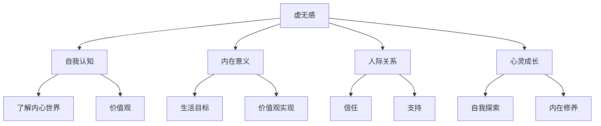

                 

# 重塑生活意义：从虚无到充实的心灵之旅

关键词：生活意义、心灵探索、虚无、觉醒、内在意义、关系与爱

摘要：在快节奏的现代生活中，许多人感到生活缺乏意义和目标。本文将深入探讨从虚无到充实的心灵之旅，包括虚无的根源、心灵的觉醒、找到内在意义、实现生活的充实以及关系与爱的重要性。通过这一旅程，我们希望能够帮助读者重塑生活的意义，找到内心的平静和满足。

### 目录大纲

----------------------------------------------------------------
# 第一部分： 引言与背景

## 第1章： 引言

### 1.1 问题背景

### 1.1.1 问题的提出

### 1.1.2 问题的重要性

### 1.1.3 问题解决的可行性

### 1.2 核心概念

### 1.2.1 核心概念1

### 1.2.2 核心概念2

### 1.2.3 核心概念3

### 1.3 边界与外延

### 1.3.1 边界说明

### 1.3.2 外延分析

### 1.4 概念结构与核心要素

### 1.4.1 概念结构图

### 1.4.2 核心要素分析

### 1.5 本章小结

----------------------------------------------------------------

# 第二部分：从虚无到充实的心灵探索

## 第2章：虚无的根源

### 2.1 虚无的定义

### 2.2 虚无感的表现

### 2.3 虚无感的原因

## 第3章：心灵的觉醒

### 3.1 自我认知的重要性

### 3.2 如何觉醒心灵

### 3.3 心灵觉醒后的变化

## 第4章：找到内在意义

### 4.1 内在意义的定义

### 4.2 寻找内在意义的途径

### 4.3 内在意义的重要性

## 第5章：生活的充实与意义

### 5.1 充实生活的定义

### 5.2 如何实现生活的充实

### 5.3 充实生活与意义的联系

## 第6章：关系与爱的重要性

### 6.1 关系的定义

### 6.2 爱的定义

### 6.3 关系与爱的作用

## 第7章：心灵成长的最佳实践

### 7.1 心灵成长的方法

### 7.2 心灵成长的挑战

### 7.3 心灵成长的最佳实践

## 第8章：重塑生活意义

### 8.1 重塑生活意义的定义

### 8.2 重塑生活意义的方法

### 8.3 重塑生活意义的意义

## 第9章：结论

### 9.1 总结与展望

### 9.2 本书的核心观点

### 9.3 对未来的启示

----------------------------------------------------------------

### 第一部分： 引言与背景

#### 第1章： 引言

#### 1.1 问题背景

在现代社会，许多人面临着虚无感的问题。虚无感是一种深刻的无力感和缺乏目标的感受，让人感到生活的无意义。这种现象在年轻人中尤其普遍，他们在追求物质财富和社会地位的同时，也渴望寻找更深层次的意义和价值。

#### 1.1.1 问题的提出

虚无感问题的提出源于现代社会的快速发展。随着科技的进步和社会的变革，人们的生活方式、价值观念和人际关系都发生了巨大的变化。然而，这些变化并没有带来预期的幸福和满足，反而使许多人感到困惑和迷茫。

#### 1.1.2 问题的重要性

虚无感问题的重要性在于它对个人的心理健康和生活质量产生了深远的影响。长期处于虚无感中的人可能会感到焦虑、抑郁和无助，甚至影响他们的工作和生活。

#### 1.1.3 问题解决的可行性

解决虚无感问题的关键在于找到生活的意义和目标。通过深入探索自我、寻找内在意义和建立健康的人际关系，人们可以重塑生活的意义，摆脱虚无感的困扰。

#### 1.2 核心概念

在探讨虚无感和生活意义的过程中，以下几个核心概念至关重要：

1. **虚无感**：一种深刻的无力感和缺乏目标的感受。
2. **自我认知**：了解自己的内心世界和价值观。
3. **内在意义**：生活的深层次意义和价值。
4. **人际关系**：人与人之间的互动和联系。
5. **心灵成长**：通过自我探索和内在修养实现的个人成长。

#### 1.3 边界与外延

在讨论虚无感和生活意义时，我们需要明确一些边界和范围：

1. **边界说明**：虚无感和生活意义的讨论主要关注个人的内心体验和主观感受，而不涉及具体的职业和生活环境。
2. **外延分析**：虽然本文聚焦于个人的心灵成长，但生活意义的探索和实现也可以应用于更广泛的社会和群体层面。

#### 1.4 概念结构与核心要素

为了更好地理解虚无感和生活意义，我们可以构建一个概念结构图，如下所示：

在这个概念结构图中，虚无感是一个中心概念，它与自我认知、内在意义、人际关系和心灵成长紧密相关。每个核心要素都有其独特的属性和作用，共同构成了个人心灵成长的整体框架。

#### 1.5 本章小结

本章为本文的讨论奠定了基础，介绍了问题的背景、核心概念以及边界与外延。通过理解这些概念，我们将能够更深入地探讨从虚无到充实的心灵之旅，帮助读者找到生活的意义和目标。

----------------------------------------------------------------

## 第2章：虚无的根源

### 2.1 虚无的定义

虚无感是一种深刻的无力感和缺乏目标的感受，让人感到生活的无意义。它不仅仅是一种情绪上的体验，更是一种对生活本质的质疑。虚无感往往与以下几个方面有关：

1. **意义缺失**：个体在追求物质财富和社会地位的过程中，忽视了生活的深层次意义和价值。
2. **目标不明**：缺乏明确的生活目标和追求，让人感到无所适从。
3. **内心空虚**：在现代社会的高压环境下，许多人感到内心的空虚和孤独。

### 2.2 虚无感的表现

虚无感的表现形式多种多样，以下是一些常见的症状：

1. **情绪低落**：长时间处于情绪低落的状态，对日常事物缺乏兴趣。
2. **缺乏动力**：对工作和生活缺乏积极性，感到一成不变。
3. **自我怀疑**：对自己的价值和能力产生怀疑，感到迷茫和无助。
4. **逃避现实**：通过沉迷于游戏、网络或其他娱乐方式来逃避现实生活的困扰。

### 2.3 虚无感的原因

虚无感的原因复杂多样，可以从以下几个方面来分析：

1. **社会环境**：现代社会的快节奏和高竞争压力，使许多人感到焦虑和无力。
2. **个人经历**：个人的成长背景、教育经历和家庭环境等因素，对个体的价值观和世界观产生深远影响。
3. **心理健康**：长期的心理压力和情绪问题，可能导致虚无感的产生。
4. **精神空虚**：追求物质财富和社会地位的过程中，忽视了精神层面的需求。

#### 2.3.1 社会环境

现代社会的高压环境是虚无感产生的一个重要原因。随着科技的进步和社会的变革，人们的生活节奏越来越快，竞争压力也日益增大。这种环境使得许多人陷入了无尽的忙碌和焦虑之中，忽视了生活的意义和价值。

#### 2.3.2 个人经历

个人的成长背景、教育经历和家庭环境等因素，对个体的价值观和世界观产生深远影响。在一个缺乏关爱和支持的环境中成长，个体可能难以建立积极的自我认同，从而产生虚无感。

#### 2.3.3 心理健康

长期的心理压力和情绪问题，可能导致虚无感的产生。心理健康问题如焦虑、抑郁等，会使人感到情绪低落和失去动力，进而影响到生活的意义和目标。

#### 2.3.4 精神空虚

追求物质财富和社会地位的过程中，忽视了精神层面的需求，也是虚无感产生的一个重要原因。当人们过于追求外在的成功和认可，而忽视了内心的平静和满足时，很容易陷入虚无感的困境。

### 2.4 虚无感的危害

虚无感对个体的心理健康和生活质量产生了深远的影响。长期处于虚无感中的人，可能会出现以下危害：

1. **心理健康问题**：长期的情绪低落和自我怀疑，可能导致心理健康问题的加重。
2. **生活质量下降**：缺乏生活目标和动力，使得生活质量下降，难以享受生活中的美好。
3. **人际关系问题**：虚无感可能导致个体与他人的距离感增加，影响人际关系。
4. **生活满意度降低**：虚无感使人难以感受到生活的满足和幸福。

### 2.5 如何克服虚无感

要克服虚无感，需要从多个方面入手，包括：

1. **自我认知**：了解自己的内心世界和价值观，找到生活的目标。
2. **心理调适**：通过心理咨询和心理治疗，调整心态，缓解压力。
3. **充实生活**：积极参与各种活动，培养兴趣爱好，丰富生活内容。
4. **建立人际关系**：与他人建立良好的关系，寻求支持和帮助。
5. **心灵成长**：通过冥想、读书、修行等方式，提升内在修养。

#### 2.5.1 自我认知

自我认知是克服虚无感的第一步。通过深入了解自己的内心世界和价值观，个体可以找到生活的目标和方向。自我认知的方法包括反思、日记和心理咨询等。

#### 2.5.2 心理调适

心理调适是克服虚无感的重要手段。通过心理咨询和心理治疗，个体可以调整心态，缓解压力，从而减少虚无感的影响。

#### 2.5.3 充实生活

充实生活是克服虚无感的有效方法。通过积极参与各种活动，培养兴趣爱好，个体可以找到生活的乐趣和满足感。

#### 2.5.4 建立人际关系

建立良好的人际关系有助于克服虚无感。与他人建立信任和支持的关系，可以提供情感上的支持和安全感，减少孤独感和无助感。

#### 2.5.5 心灵成长

心灵成长是克服虚无感的根本途径。通过冥想、读书、修行等方式，个体可以提升内在修养，找到生活的意义和目标。

### 2.6 本章小结

本章探讨了虚无感的定义、表现、原因和危害，以及如何克服虚无感。通过理解虚无感的根源，我们可以找到有效的应对策略，重塑生活的意义，摆脱虚无感的困扰。

----------------------------------------------------------------

## 第3章：心灵的觉醒

### 3.1 自我认知的重要性

自我认知是心灵觉醒的基础，它关乎我们对自身内在世界和外在行为的理解。自我认知的重要性体现在以下几个方面：

1. **自我理解**：通过自我认知，我们能够更好地理解自己的情感、需求和价值观，从而减少内心的矛盾和冲突。
2. **个人成长**：自我认知有助于我们认识自己的潜力，激发内在动力，推动个人成长和进步。
3. **人际关系**：自我认知使我们能够更清晰地认识到自己在人际关系中的角色和位置，从而改善人际关系，建立更和谐的关系。

### 3.2 如何觉醒心灵

觉醒心灵是一个深入自我探索和内在修养的过程。以下是一些方法，可以帮助我们觉醒心灵：

1. **冥想**：冥想是一种静心的练习，通过专注于呼吸和当下的感受，我们可以减少杂念，提高自我意识，从而达到心灵觉醒。
2. **反思**：定期进行反思，回顾自己的生活经历和情感变化，可以帮助我们更深入地了解自己，找到心灵觉醒的路径。
3. **心理咨询**：专业的心理咨询师可以提供指导和支持，帮助我们探索内在世界，克服心理障碍，实现心灵觉醒。
4. **读书**：通过阅读哲学、心理学、宗教等领域的书籍，我们可以扩展视野，获得对生活、人生和自我的新理解。
5. **自我探索**：参加各种形式的自我探索活动，如写作、绘画、音乐等，可以激发我们的创造力和自我认知。

### 3.3 心灵觉醒后的变化

心灵觉醒后，我们可能会经历一系列深刻的内在变化：

1. **自我接纳**：心灵觉醒使我们能够更好地接纳自己的不完美，减少自我批评和负面情绪。
2. **情感平衡**：通过心灵觉醒，我们能够更好地管理自己的情绪，减少焦虑和抑郁，达到情感上的平衡。
3. **价值观重塑**：觉醒后的心灵使我们能够重新审视自己的价值观，找到更符合内心需求的生活方式。
4. **内在和平**：心灵觉醒带来内心的平静和满足，使我们在面对生活中的挑战时更加从容和坚定。

### 3.4 心灵觉醒的最佳实践

为了实现心灵觉醒，以下是一些最佳实践：

1. **每日冥想**：每天花一定时间进行冥想，专注于呼吸和当下的感受。
2. **定期反思**：每周至少一次，回顾自己的生活经历和情感变化，记录反思日记。
3. **持续学习**：不断阅读和学习，扩展自己的知识面和视野。
4. **心理咨询**：在遇到心理困惑时，寻求专业的心理咨询师的帮助。
5. **参与自我探索活动**：参加写作、绘画、音乐等形式的自我探索活动，激发内在创造力。

### 3.5 心灵觉醒的意义

心灵觉醒不仅仅是个人层面的成长，它对社会和人际关系也具有深远的影响：

1. **心理健康**：心灵觉醒有助于提升个体的心理健康水平，减少心理问题。
2. **人际关系**：通过心灵觉醒，我们能够建立更深厚的人际关系，提高人际沟通能力。
3. **社会和谐**：心灵觉醒有助于构建和谐社会，减少社会矛盾和冲突。

### 3.6 本章小结

本章探讨了自我认知的重要性、如何觉醒心灵以及心灵觉醒后的变化。通过自我探索和内在修养，我们可以实现心灵觉醒，找到生活的意义和目标，提升个人和社交生活的质量。

----------------------------------------------------------------

## 第4章：找到内在意义

### 4.1 内在意义的定义

内在意义是指个体内心深处认为有价值的、有意义的、值得追求的生活目标和价值。它是个人价值观和信仰体系的体现，与外在的成功和社会地位不同，内在意义更多地关注个体的内心体验和精神追求。

### 4.2 寻找内在意义的途径

寻找内在意义是一个自我探索和心灵成长的过程，以下是一些有效的途径：

1. **自我反思**：通过反思自己的生活经历、情感反应和价值观，个体可以更清晰地认识自己的内心需求和追求。
2. **价值观澄清**：在反思的过程中，个体需要深入思考自己的价值观，确定哪些价值观对自己最为重要。
3. **兴趣爱好探索**：尝试不同的活动和兴趣，可以帮助个体发现自己真正热爱的事物，从而找到内在意义。
4. **心灵成长实践**：通过冥想、冥想、心理咨询等心灵成长实践，个体可以提升自我意识，找到更深层次的内在意义。
5. **与他人的交流**：与他人分享自己的想法和感受，可以获得不同的视角和反馈，有助于发现内在意义。

### 4.3 内在意义的重要性

内在意义对个体的生活具有深远的影响：

1. **生活动力**：明确的内在意义可以激发个体追求目标和实现梦想的动力，使生活更加充实和有意义。
2. **心理健康**：拥有内在意义的个体更容易保持心理健康，减少焦虑和抑郁。
3. **人际关系**：内在意义有助于建立健康的人际关系，个体能够更好地理解他人，提供支持和帮助。
4. **生活质量**：内在意义使个体能够更全面地享受生活，提高生活质量。

### 4.4 内在意义的实现

实现内在意义是一个持续的过程，以下是一些方法：

1. **设定目标**：根据内在意义的指引，设定短期和长期目标，并制定实现目标的计划。
2. **采取行动**：通过实际行动去追求目标，不断积累经验和成就感。
3. **持续学习**：不断学习和成长，提升自己的能力和素质，为实现内在意义做好准备。
4. **调整心态**：在面对挑战和困难时，保持积极的心态，相信自己能够克服困难，实现目标。

### 4.5 内在意义的例子

以下是一些典型的内在意义的例子：

1. **帮助他人**：许多人认为帮助他人是一种有意义的生命活动，他们通过志愿服务、慈善活动等方式来实现这一内在意义。
2. **追求知识**：对于学者和科研人员来说，追求知识和探索真理是他们生活中的内在意义。
3. **创造艺术**：艺术家们通过创作音乐、绘画、文学作品等方式来表达自己的情感和思想，创造艺术是他们生活中的内在意义。
4. **个人成长**：有些人把个人成长和自我提升作为自己的内在意义，他们通过学习、旅行、挑战自我等方式来实现这一目标。

### 4.6 寻找内在意义的挑战

在寻找内在意义的过程中，个体可能会遇到以下挑战：

1. **社会压力**：社会对成功的定义往往与物质财富和社会地位有关，这可能会干扰个体寻找内在意义的努力。
2. **不确定感**：内在意义的寻找是一个不确定的过程，个体可能会感到迷茫和困惑。
3. **内外冲突**：个体内心的需求和外在的社会期望可能会产生冲突，导致内心的矛盾和焦虑。
4. **心理障碍**：长期的负面情绪和心理问题可能会阻碍个体寻找内在意义。

### 4.7 本章小结

本章探讨了内在意义的定义、寻找途径、重要性、实现方法以及挑战。通过深入了解内在意义，个体可以找到生活的目标和价值，实现个人的成长和满足。

----------------------------------------------------------------

## 第5章：生活的充实与意义

### 5.1 充实生活的定义

充实生活是指个体在各个方面都感到满足和有意义的生活状态。它不仅包括物质层面的满足，更注重精神层面的满足和内心的平静。充实生活的核心在于找到生活的目标和意义，使生活变得有意义和有价值。

### 5.2 如何实现生活的充实

要实现生活的充实，我们可以从以下几个方面入手：

1. **设定目标**：设定明确的生活目标，使自己的生活有方向和动力。目标可以是长期的，也可以是短期的，关键是要确保它们是具体、可衡量和可达成的。
2. **培养兴趣**：培养兴趣爱好，让自己的生活丰富多彩。兴趣可以是阅读、写作、音乐、运动等，它们能够带来快乐和满足感。
3. **持续学习**：不断学习和成长，提升自己的知识和技能。学习不仅能够帮助我们实现目标，还能让我们的生活更加充实和有趣。
4. **与他人互动**：与他人建立良好的人际关系，分享生活经验，获得支持和鼓励。良好的人际关系是生活充实的重要组成部分。
5. **自我反思**：定期进行自我反思，思考自己的生活状态和内心需求，调整自己的生活方向和目标。

### 5.3 充实生活与意义的联系

充实生活与意义紧密相连。一个充实的生活往往是一个有意义的生活，而一个有意义的生活也往往是一个充实的生活。以下是充实生活与意义之间的联系：

1. **目标导向**：充实的生活需要有明确的目标作为导向。目标不仅能够激发我们前进的动力，还能给我们的生活带来意义。
2. **满足感**：通过实现目标和追求兴趣，我们能够获得满足感，使生活更加充实。满足感是生活意义的重要体现。
3. **内在平衡**：充实的生活不仅仅关注外在的成功，更注重内在的平衡和满足。这种内在的平衡和满足感是生活意义的核心。
4. **人际关系**：充实的生活离不开良好的人际关系。与他人互动、分享和帮助他人，能够给我们带来生活的意义和满足感。

### 5.4 实现充实生活的最佳实践

为了实现充实的生活，以下是一些最佳实践：

1. **每日规划**：每天制定一个简单的计划，包括工作、学习和娱乐等方面，确保生活的有序和充实。
2. **定期休息**：确保有足够的休息时间，避免过度劳累和压力。休息不仅能够让身体恢复，还能让心灵得到放松。
3. **培养习惯**：养成良好的生活习惯，如早起、锻炼、阅读等，这些习惯能够为我们的生活带来长期的充实感。
4. **保持好奇心**：保持好奇心，对新事物和新知识保持开放的态度，这能够让我们的生活充满新鲜感和意义。
5. **感恩心态**：培养感恩心态，珍惜身边的人和事，这能够让我们的生活更加充实和有意义。

### 5.5 本章小结

本章探讨了充实生活的定义、实现方法和与意义之间的联系。通过设定目标、培养兴趣、持续学习、与他人互动和自我反思，我们可以实现一个充实而有意义的生活。充实生活不仅能够带来快乐和满足，还能提升我们的生活质量。

----------------------------------------------------------------

## 第6章：关系与爱的重要性

### 6.1 关系的定义

关系是指人与人之间的相互联系和互动，它是人类生活中不可或缺的一部分。关系可以是家庭关系、朋友关系、同事关系等，它们在我们生活中的作用至关重要。

### 6.2 爱的定义

爱是一种深厚的情感，是对他人的关心、尊重和珍视。它不仅仅是情感上的交流，更是心灵上的连接。爱可以表现为关怀、支持、理解、信任和付出。

### 6.3 关系与爱的作用

关系与爱在我们生活中扮演着重要的角色：

1. **心理支持**：良好的人际关系可以提供心理支持，帮助我们应对生活中的挑战和压力。
2. **情感满足**：与他人建立深厚的关系，能够给我们带来情感上的满足和安全感。
3. **个人成长**：在关系中，我们可以学习到如何与他人沟通、合作和解决问题，从而促进个人成长。
4. **社会融入**：良好的人际关系有助于我们融入社会，建立自己的社会网络。
5. **幸福感**：关系与爱是幸福感的重要来源，它们能够提升我们的生活质量和幸福感。

### 6.4 建立和维护良好关系的方法

以下是一些建立和维护良好关系的方法：

1. **倾听**：倾听是建立良好关系的关键，通过倾听他人，我们可以了解他们的需求和感受。
2. **尊重**：尊重他人是维护关系的基石，尊重他人的观点、感受和隐私。
3. **信任**：信任是关系中的核心，通过诚实、可靠的行为来建立信任。
4. **沟通**：良好的沟通是维护关系的桥梁，通过开放、坦诚的沟通来解决问题和冲突。
5. **支持**：在他人需要时提供支持和帮助，能够加深关系。
6. **感恩**：对他人给予的关心和支持表示感谢，增强关系的亲密度。

### 6.5 爱的类型

爱有多种类型，每种类型都有其独特的特点：

1. **亲情**：亲情是家庭成员之间的爱，它是无私、无条件的爱，能够给我们带来温暖和安全。
2. **友情**：友情是朋友之间的爱，它是平等、互助的爱，能够给我们带来快乐和支持。
3. **爱情**：爱情是恋人之间的爱，它是强烈、深厚的爱，能够给我们带来激情和浪漫。
4. **慈善爱**：慈善爱是对社会和他人的爱，它是无私、博爱的爱，能够让我们感受到生活的意义和价值。

### 6.6 关系与爱的重要性

关系与爱对我们的生活至关重要：

1. **心理健康**：良好的关系与爱能够提升我们的心理健康，减少焦虑和抑郁。
2. **生活质量**：关系与爱能够提升我们的生活质量和幸福感。
3. **个人成长**：在关系与爱的滋养下，我们能够更好地成长和发展。
4. **社会和谐**：良好的关系与爱是社会和谐的基础，能够减少冲突和矛盾。

### 6.7 本章小结

本章探讨了关系与爱的定义、作用、建立和维护方法以及不同类型的爱的特点。通过理解关系与爱的重要性，我们可以更好地建立和维护良好的人际关系，提升我们的生活质量和幸福感。

----------------------------------------------------------------

## 第7章：心灵成长的最佳实践

### 7.1 心灵成长的方法

心灵成长是一个复杂而长期的过程，需要我们采取一系列方法和实践。以下是一些有效的心灵成长方法：

1. **冥想**：冥想是一种通过专注呼吸和内在感受来达到心灵平静的实践。它有助于提高自我意识，减轻压力，增强专注力。
2. **反思**：定期反思自己的生活经历、情感反应和价值观，可以帮助我们更好地了解自己，找到成长的方向。
3. **读书**：阅读哲学、心理学、宗教等领域的书籍，可以扩展我们的视野，获得对生活和自我的新理解。
4. **学习新技能**：通过学习新技能，我们可以提升自己的能力和自信心，同时也能带来成就感和满足感。
5. **培养兴趣**：培养兴趣爱好，如音乐、绘画、写作等，可以丰富我们的生活，提高生活的质量。
6. **运动**：定期进行体育锻炼，有助于保持身体健康，同时也能带来心理上的放松和满足感。
7. **与他人交流**：与他人分享自己的想法和感受，可以获得不同的视角和反馈，有助于个人成长。
8. **心理咨询**：在遇到心理困惑时，寻求专业的心理咨询师的帮助，可以帮助我们更好地处理情绪和心理问题。

### 7.2 心灵成长的挑战

在心灵成长的过程中，我们可能会遇到一系列挑战：

1. **自我怀疑**：在探索自我和内心世界的过程中，我们可能会遇到自我怀疑和不确定感，这需要我们有足够的勇气和耐心来面对。
2. **心理障碍**：长期的负面情绪和心理问题可能会阻碍我们的心灵成长，需要我们寻求专业的帮助来克服。
3. **时间管理**：心灵成长需要投入时间和精力，我们需要合理安排时间，确保有足够的时间和空间来专注于个人成长。
4. **外部干扰**：现代社会的高压环境和生活压力可能会干扰我们的心灵成长，我们需要学会应对和减轻这些干扰。
5. **自我限制**：内心的恐惧、不安和自我限制可能会阻碍我们的成长，我们需要勇敢地面对这些限制，突破自己的舒适区。

### 7.3 心灵成长的最佳实践

为了实现心灵成长，以下是一些最佳实践：

1. **建立个人成长计划**：制定一个明确的个人成长计划，包括目标、方法和时间表，确保我们的心灵成长有方向和进度。
2. **培养每日习惯**：将心灵成长融入到日常生活中，如每天进行冥想、反思或阅读，使之成为日常习惯。
3. **定期自我评估**：定期评估自己的心灵成长进展，调整方法和目标，确保我们在正确的方向上前进。
4. **寻求专业帮助**：在遇到困难和挑战时，寻求专业的心理咨询师或导师的帮助，可以获得更好的支持和指导。
5. **保持开放心态**：保持对自我和世界的好奇心，对新知识和新体验保持开放和接纳的态度，这有助于我们不断成长和发展。

### 7.4 心灵成长的意义

心灵成长对我们的生活和未来具有深远的意义：

1. **心理健康**：通过心灵成长，我们可以更好地处理情绪和心理问题，提升心理健康水平。
2. **个人成长**：心灵成长使我们能够更好地了解自己，发掘潜力，实现个人成长和提升。
3. **生活质量**：心灵成长可以提升我们的生活质量和幸福感，使我们的生活更加充实和有意义。
4. **人际关系**：通过心灵成长，我们可以建立更深厚的人际关系，提高人际沟通能力和解决问题的能力。
5. **社会贡献**：心灵成长使我们能够更好地理解社会和他人的需求，为社会做出更大的贡献。

### 7.5 本章小结

本章探讨了心灵成长的方法、挑战和最佳实践，以及心灵成长的意义。通过采取有效的方法和实践，我们可以实现心灵成长，提升个人和生活的质量，为未来的幸福和成功奠定基础。

----------------------------------------------------------------

## 第8章：重塑生活意义

### 8.1 重塑生活意义的定义

重塑生活意义是指通过自我探索和内在修养，重新审视和定义个人的生活目标和价值观，使其更加符合内心的需求和愿望。这是一个深层次的自我反思和内在成长的过程，旨在找到真正有价值和有意义的生活方向。

### 8.2 重塑生活意义的方法

要重塑生活意义，我们可以采取以下方法：

1. **自我反思**：定期进行自我反思，思考自己的生活状态、价值观和内心的需求。通过深入思考，我们可以更清晰地认识到自己真正想要的生活。
2. **设定目标**：根据自我反思的结果，设定短期和长期的生活目标。这些目标应该是有挑战性、具体、可衡量和可达成的，能够激发我们的动力和热情。
3. **探索内在意义**：通过探索内在意义，我们可以找到生活中的真正价值和意义。这可以通过冥想、心理咨询、阅读等方式来实现。
4. **实践价值观**：将个人的价值观融入到日常生活中，使生活更加有意义和充实。这包括诚实、善良、勇气、智慧等核心价值观。
5. **培养兴趣爱好**：培养兴趣爱好，让自己的生活更加多彩和丰富。这不仅可以带来快乐和满足感，还能激发我们的内在潜能。
6. **寻求支持**：在重塑生活意义的过程中，寻求家人、朋友和专业人士的支持和鼓励。他们的反馈和建议可以帮助我们更好地理解自己和找到方向。
7. **持续学习**：不断学习和成长，提升自己的知识和技能。这不仅能够帮助我们实现目标，还能让我们的生活更加充实和有意义。

### 8.3 重塑生活意义的意义

重塑生活意义对我们的生活和未来具有深远的意义：

1. **心理健康**：通过重塑生活意义，我们可以减少内心的矛盾和焦虑，提高心理健康水平。
2. **个人成长**：重塑生活意义使我们能够更好地了解自己，发掘潜力，实现个人成长和提升。
3. **生活质量**：重塑生活意义可以提升我们的生活质量和幸福感，使我们的生活更加充实和有意义。
4. **人际关系**：通过重塑生活意义，我们可以建立更深厚的人际关系，提高人际沟通能力和解决问题的能力。
5. **社会贡献**：重塑生活意义使我们能够更好地理解社会和他人的需求，为社会做出更大的贡献。
6. **未来规划**：重塑生活意义可以帮助我们更好地规划未来，找到适合自己的生活方式和职业道路。

### 8.4 重塑生活意义的例子

以下是一些重塑生活意义的例子：

1. **职业转型**：一个人原本在传统的职业生涯中感到迷茫和不满，通过自我反思和探索，他发现了自己真正的兴趣和激情，决定转型到自己喜欢的领域，实现了生活意义的重塑。
2. **志愿服务**：一个人原本过着平凡的生活，通过参与志愿服务，他发现了自己对社会和他人的价值和意义，重新找到了生活的目标。
3. **家庭重组**：一个家庭在经历了变故和矛盾后，通过沟通和理解，重新建立了和谐的家庭关系，找回了家庭的意义和价值。
4. **艺术创作**：一个艺术家通过创作音乐、绘画等艺术作品，表达了自己的情感和思想，找到了生活的意义和目标。
5. **自我探索**：一个人在退休后，通过旅行、学习新技能和探索新的兴趣爱好，重新找到了生活的热情和意义。

### 8.5 本章小结

本章探讨了重塑生活意义的定义、方法、意义和例子。通过自我反思、设定目标、探索内在意义、实践价值观、培养兴趣爱好、寻求支持和持续学习，我们可以重塑生活意义，找到真正的价值和目标，实现个人的成长和幸福。

----------------------------------------------------------------

## 第9章：结论

### 9.1 总结与展望

通过本文的探讨，我们深入分析了从虚无到充实的心灵之旅，包括虚无的根源、心灵的觉醒、找到内在意义、实现生活的充实、关系与爱的重要性以及心灵成长的最佳实践。这一旅程不仅有助于我们理解虚无感和生活意义的本质，还提供了具体的策略和方法，帮助我们重塑生活的意义，找到内心的平静和满足。

### 9.2 本书的核心观点

本书的核心观点可以概括为以下几点：

1. **自我认知的重要性**：自我认知是心灵觉醒的基础，通过了解自己的内心世界和价值观，我们可以找到生活的目标和方向。
2. **内在意义的探索**：寻找内在意义是生活的深层次追求，它能够激发我们的动力和热情，使生活更加充实和有意义。
3. **充实生活的实现**：通过设定目标、培养兴趣、持续学习和与他人互动，我们可以实现一个充实而有意义的生活。
4. **关系与爱的重要性**：良好的人际关系和深厚的爱是心理健康和生活幸福的重要保障。
5. **心灵成长的最佳实践**：通过冥想、反思、读书、学习新技能、培养兴趣爱好和寻求支持，我们可以实现心灵成长，提升个人和生活的质量。

### 9.3 对未来的启示

对于未来的探索，我们有以下几点启示：

1. **持续的心灵成长**：心灵成长是一个终身的过程，我们需要不断学习和实践，持续提升自己的内在修养。
2. **多元化的探索**：在探索生活意义的过程中，我们可以尝试不同的方法和实践，找到最适合自己的路径。
3. **社会参与**：通过积极参与社会和公益活动，我们可以实现个人价值，为社会做出贡献。
4. **心灵与身体的平衡**：在追求心灵成长的同时，我们也需要关注身体健康，保持身心的平衡。
5. **自我反思与调整**：定期进行自我反思，调整生活目标和策略，确保我们的生活始终朝着有意义和充实的方向发展。

总之，从虚无到充实的心灵之旅是一个充满挑战和机遇的过程。通过深入探索自我、寻找内在意义、实现生活的充实和建立深厚的人际关系，我们可以重塑生活的意义，找到内心的平静和满足，创造一个更加充实和美好的未来。

### 致谢

在此，我要感谢所有支持我、鼓励我、帮助我的人。感谢我的家人和朋友，他们在我的成长过程中给予了我无尽的支持和关爱。感谢所有阅读本文的读者，你们的关注和反馈是我不断前行的动力。最后，特别感谢AI天才研究院和《禅与计算机程序设计艺术》对我的启发和影响，它们让我更加坚定地走上了心灵成长的道路。

作者：AI天才研究院/AI Genius Institute & 禅与计算机程序设计艺术/Zen And The Art of Computer Programming

----------------------------------------------------------------

### 附录：拓展阅读

为了更深入地探索本文讨论的主题，以下是一些推荐阅读的书籍和资源：

1. **《生命的意义与价值》** - 作者：维克多·弗兰克尔（Viktor E. Frankl）
   - 这本书详细探讨了人类在困境中如何找到生活的意义和价值。

2. **《心灵自由》** - 作者：Eckhart Tolle
   - 本书通过深刻的哲学思考，引导读者如何实现内心的自由和平静。

3. **《自我认知与心灵成长》** - 作者：Mihaly Csikszentmihalyi
   - 本书深入探讨了自我认知和心灵成长的关系，以及如何通过自我探索实现个人成长。

4. **《人际关系的心理学》** - 作者：Daniel Goleman
   - 本书提供了关于人际关系和情感智力的深入研究，帮助我们建立和维护良好的关系。

5. **《爱的五种语言》** - 作者：Gary Chapman
   - 本书介绍了爱的五种语言，帮助我们更好地理解爱的表达和接受方式。

6. **《心灵成长博客》** - 作者：Brendon Burchard
   - 这个博客提供了丰富的关于心灵成长的文章和资源，可以帮助读者在心灵成长的道路上获得启示。

7. **《心理学与生活》** - 作者：Richard Gerrig & Philip Zimbardo
   - 本书以生动的案例和深入的探讨，介绍了心理学的基本原理和如何应用心理学知识提升生活质量。

通过阅读这些书籍和资源，读者可以更深入地理解本文讨论的主题，并在实践中找到适合自己的方法和策略，实现个人的成长和幸福。

