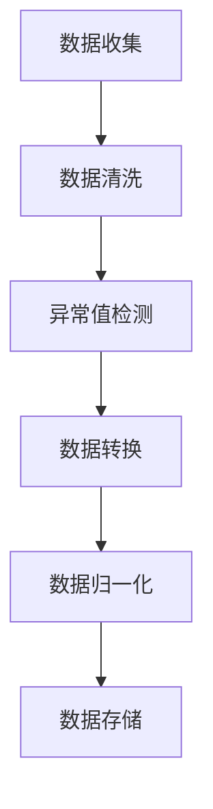
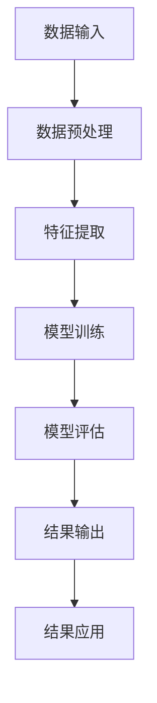
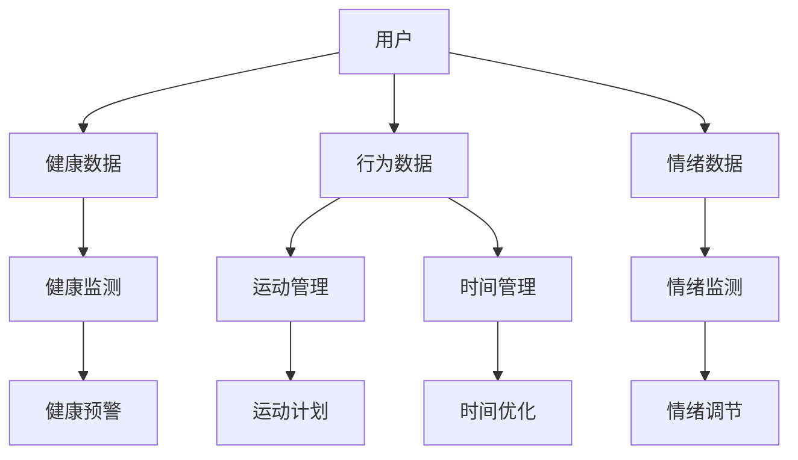
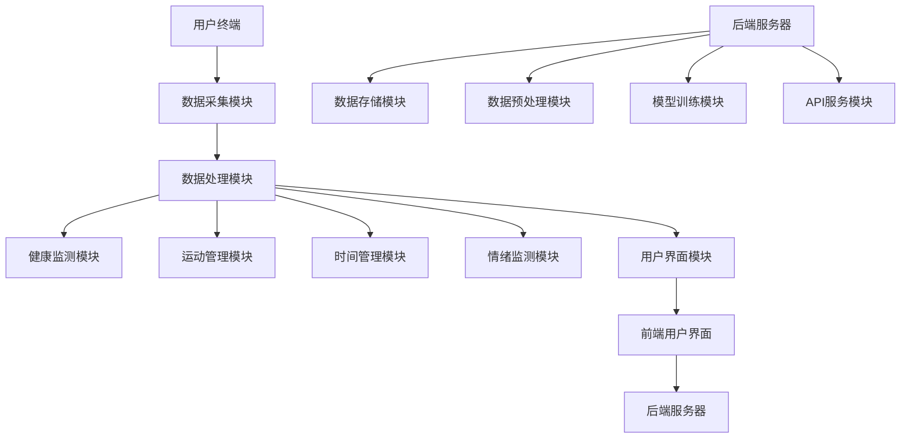
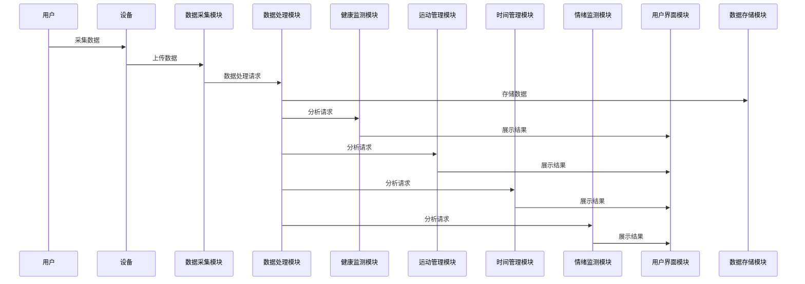

                 

### 引言

量化自我（Quantified Self）是指通过技术手段对个体的生活、健康、心理等各个方面的数据进行收集、分析和优化，从而实现个体生命体验的数字化和智能化管理。量化自我3.0阶段标志着从传统数据的记录与分析，迈向更深入、更个性化的生命体验数据化与优化策略。在这个时代，数据不仅是信息的载体，更是决策和优化的重要依据。

随着可穿戴设备、物联网、人工智能等技术的快速发展，量化自我已经从科学前沿逐渐走向大众生活。人们可以通过智能手表、健身追踪器等设备实时监测心率、睡眠质量、步数等生命指标，并通过大数据分析获得关于自身健康状况的深刻见解。然而，如何从海量的生命数据中提取有用信息，并将其转化为切实可行的优化策略，依然是一个亟待解决的难题。

本文将深入探讨量化自我3.0的核心概念、关键原理、算法模型、系统架构以及项目实战，力图构建一个全面、系统的量化自我知识体系。通过本文的阅读，读者将了解：

1. 量化自我的起源、发展及其在现代社会中的重要性。
2. 数据化生命体验的必要性及其应用领域。
3. 量化自我模型的核心要素及其构建方法。
4. 数据预处理的重要性及其实现方法。
5. 量化自我算法原理及其数学模型。
6. 系统功能设计、架构设计及其交互流程。
7. 实际项目中的量化自我应用及其案例分析。

本文将采取逻辑清晰、结构紧凑、简单易懂的写作方式，以帮助读者逐步掌握量化自我的核心概念和实践方法。让我们一步步深入探索，揭开量化自我的神秘面纱。

### 关键词

- **量化自我**
- **生命体验数据化**
- **优化策略**
- **算法原理**
- **系统架构设计**
- **项目实战**
- **人工智能**

### 摘要

本文旨在深入探讨量化自我3.0的概念、原理和实践方法。量化自我通过技术手段对个体生命体验的数据化，实现对健康、心理等生命指标的有效管理和优化。本文首先介绍了量化自我的背景、核心概念及其重要性，然后详细阐述了数据化生命体验的必要性、实现方法和应用领域。接下来，文章介绍了量化自我模型的核心要素、构建方法以及ER实体关系图架构。在此基础上，本文探讨了量化自我算法的原理、数学模型及其应用。随后，文章介绍了系统功能设计、架构设计、接口设计和系统交互。最后，通过一个实际项目实战，对量化自我的应用进行了详细剖析。本文的目标是构建一个全面、系统的量化自我知识体系，帮助读者理解和掌握这一前沿领域的核心技术和实践方法。

### 目录大纲

#### 第一部分：问题背景与核心概念

**第1章：量化自我概述**

- 1.1 引言
  - 1.1.1 量化自我时代的到来
  - 1.1.2 量化自我的核心概念
  - 1.1.3 量化自我的目标与价值
- 1.2 数据化生命体验
  - 1.2.1 数据化生命体验的必要性
  - 1.2.2 数据化生命体验的应用领域
  - 1.2.3 数据化生命体验的实现方法
- 1.3 优化策略与工具
  - 1.3.1 优化策略的定义
  - 1.3.2 常见的优化策略
  - 1.3.3 优化策略的应用
- 1.4 本章小结

#### 第二部分：核心概念与联系

**第2章：核心概念原理**

- 2.1 量化自我模型
  - 2.1.1 量化自我模型的定义
  - 2.1.2 量化自我模型的核心要素
  - 2.1.3 量化自我模型的构建方法
- 2.2 数据化生命体验的属性特征对比表格
  - 2.2.1 属性特征对比表格的定义
  - 2.2.2 各个属性特征的详细对比
- 2.3 ER实体关系图架构
  - 2.3.1 ER实体关系图的定义
  - 2.3.2 ER实体关系图在量化自我中的应用
  - 2.3.3 ER实体关系图的构建方法
- 2.4 本章小结

#### 第三部分：算法原理与数学模型

**第3章：量化自我算法原理**

- 3.1 数据预处理
  - 3.1.1 数据预处理的重要性
  - 3.1.2 数据预处理的方法
  - 3.1.3 数据预处理流程图
- 3.2 算法流程图
  - 3.2.1 算法流程图的定义
  - 3.2.2 量化自我算法的流程
  - 3.2.3 算法流程图绘制
- 3.3 数学模型与公式
  - 3.3.1 数学模型在量化自我中的作用
  - 3.3.2 常见的数学模型介绍
  - 3.3.3 数学公式的详细讲解
- 3.4 举例说明
  - 3.4.1 简单的举例说明
  - 3.4.2 深入的举例说明
- 3.5 本章小结

#### 第四部分：系统分析与架构设计

**第4章：系统功能设计**

- 4.1 问题场景介绍
  - 4.1.1 量化自我应用场景
  - 4.1.2 系统需求分析
- 4.2 系统功能设计
  - 4.2.1 领域模型
  - 4.2.2 系统功能模块划分
  - 4.2.3 功能模块详细设计
- 4.3 系统架构设计
  - 4.3.1 系统架构图
  - 4.3.2 系统模块间关系
  - 4.3.3 架构设计要点
- 4.4 系统接口设计
  - 4.4.1 接口设计原则
  - 4.4.2 接口定义与规范
  - 4.4.3 接口测试
- 4.5 系统交互
  - 4.5.1 系统交互流程
  - 4.5.2 系统交互mermaid序列图
  - 4.5.3 交互设计要点
- 4.6 本章小结

#### 第五部分：项目实战

**第5章：量化自我项目实战**

- 5.1 环境安装与配置
  - 5.1.1 环境要求与准备
  - 5.1.2 环境安装步骤
  - 5.1.3 常见问题与解决方案
- 5.2 系统核心实现源代码
  - 5.2.1 源代码结构
  - 5.2.2 代码解析
  - 5.2.3 代码应用解读与分析
- 5.3 实际案例分析与详细讲解
  - 5.3.1 案例介绍
  - 5.3.2 案例分析
  - 5.3.3 案例讲解
- 5.4 项目小结
  - 5.4.1 项目总结
  - 5.4.2 项目收获
  - 5.4.3 拓展思考
- 5.5 本章小结

### 第一部分：问题背景与核心概念

#### 第1章：量化自我概述

##### 1.1 引言

量化自我，这个概念随着科技的发展逐渐渗透到我们日常生活的方方面面。量化自我不仅是一种生活方式，更是一种对个人生命体验进行数据化管理和优化的方法论。在这个数据驱动的时代，量化自我已经成为许多人实现个人成长和健康管理的有力工具。

**1.1.1 量化自我时代的到来**

量化自我理念的兴起可以追溯到20世纪90年代。随着计算能力和数据存储技术的飞速发展，人们开始意识到通过数据分析和自我监控，可以更好地了解自己的行为模式、健康状态和心理变化。这一理念在21世纪初得到了进一步的发展，随着智能设备的普及，量化自我逐渐从科学实验走向大众应用。现在，无论是健身爱好者还是健康管理者，都可以通过各类智能设备和应用程序来追踪自己的身体数据，进行自我优化。

**1.1.2 量化自我的核心概念**

量化自我主要包括以下几个核心概念：

1. **数据收集**：通过智能设备或手动记录的方式，收集个体的健康数据、行为数据等。
2. **数据存储**：将收集到的数据存储在电子设备或云平台上，方便后续分析和处理。
3. **数据分析**：运用统计学、机器学习等方法对数据进行分析，提取有价值的信息。
4. **决策支持**：根据分析结果，提供个性化的建议和决策支持，帮助个体实现自我优化。

**1.1.3 量化自我的目标与价值**

量化自我的目标是通过对个体数据的全面分析，实现以下几个方面的价值：

1. **健康监控**：实时监测生命体征，预防疾病发生，提高生活质量。
2. **行为优化**：通过数据分析，了解自己的行为模式，发现不良习惯，进行优化。
3. **效率提升**：通过数据驱动的决策，提高工作和生活的效率。
4. **个性化服务**：根据个人数据特点，提供个性化的健康建议和生活方式指导。

总之，量化自我不仅帮助个体更全面地了解自己，还为健康管理和生活优化提供了科学依据。随着技术的不断进步，量化自我将在未来的生活中发挥更加重要的作用。

##### 1.2 数据化生命体验的必要性

数据化生命体验是量化自我不可或缺的一部分。在现代社会，数据已经成为一种重要的资源，它不仅帮助我们更好地了解自己，还为各种决策提供了强有力的支持。以下是数据化生命体验的几个必要性：

**1.2.1 数据化生命体验的必要性**

1. **健康监控与预防**：
   - **实时监测**：通过可穿戴设备和智能设备，可以实时监测心率、血压、睡眠质量等生命体征，及时发现异常，预防疾病的发生。
   - **历史数据回顾**：长期积累的数据可以帮助医生更好地了解患者的健康状况，提供更加精准的治疗方案。

2. **行为模式识别**：
   - **日常习惯分析**：通过记录饮食、运动、睡眠等日常数据，可以识别出个体的行为模式，发现可能的不良习惯，从而进行优化。
   - **情绪状态分析**：通过分析心率、血压等数据，可以推测个体的情绪状态，帮助心理医生提供更加精准的心理咨询服务。

3. **个性化服务与指导**：
   - **健康建议**：根据个体数据，可以提供个性化的健康建议，如饮食调整、运动计划等，帮助个体实现健康目标。
   - **生活优化**：通过数据分析，可以为个体提供时间管理、效率提升等方面的指导，改善生活质量。

**1.2.2 数据化生命体验的应用领域**

1. **健康管理**：
   - **慢性病管理**：通过数据化生命体验，可以更好地管理慢性病，如糖尿病、高血压等，减少疾病对生活的影响。
   - **运动康复**：对于运动损伤患者，通过数据分析可以制定个性化的康复计划，加快康复速度。

2. **心理健康**：
   - **心理评估**：通过分析情绪数据，可以评估个体的心理健康状况，提供心理干预建议。
   - **情绪管理**：通过数据分析，了解情绪波动的原因，帮助个体进行情绪管理，提高生活质量。

3. **工作效率**：
   - **时间管理**：通过分析日常行为数据，可以优化时间管理，提高工作效率。
   - **任务调度**：根据工作数据，制定个性化的任务调度计划，提高工作效率。

4. **教育**：
   - **个性化学习**：通过分析学生的学习行为和成绩数据，提供个性化的学习建议，提高学习效果。
   - **教育质量评估**：通过数据分析，评估教育质量，为教育改革提供依据。

总之，数据化生命体验在多个领域都有广泛的应用，通过数据分析和优化，可以实现个体健康、行为和效率的全面提升。随着技术的不断进步，数据化生命体验将在未来发挥更加重要的作用。

##### 1.2.3 数据化生命体验的实现方法

数据化生命体验的实现离不开有效的工具和方法。以下是几种常见的数据化生命体验实现方法：

**1.2.3.1 可穿戴设备**

可穿戴设备是数据化生命体验的重要工具，如智能手表、健身追踪器和健康手环等。这些设备能够实时监测心率、步数、睡眠质量等生命体征，并将数据传输到手机或电脑上。用户可以通过应用程序查看和分析这些数据，从而了解自己的健康状况和行为模式。

**1.2.3.2 移动应用程序**

移动应用程序是数据化生命体验的核心，通过这些应用程序，用户可以方便地记录、存储和管理自己的健康数据。例如，用户可以在手机上安装运动追踪应用，记录每天的运动量、消耗的卡路里等信息。一些高级应用程序还能结合用户的社交网络，提供更多的健康建议和社交支持。

**1.2.3.3 传感器和物联网**

传感器和物联网技术是数据化生命体验的重要支撑。通过在家庭、办公室等场所安装各种传感器，可以实时监测环境数据，如空气污染、温度、湿度等。这些数据可以帮助用户了解生活环境对健康的影响，从而采取相应的改善措施。

**1.2.3.4 云服务和大数据分析**

云服务和大数据分析是数据化生命体验的高级实现方法。通过将个体的健康数据存储在云端，用户可以随时随地进行数据查看和分析。大数据分析技术可以帮助用户从海量数据中提取有价值的信息，提供个性化的健康建议和决策支持。

**1.2.3.5 人工智能和机器学习**

人工智能和机器学习技术是数据化生命体验的未来发展方向。通过深度学习算法，可以自动识别个体的健康风险因素，预测疾病的发生，提供更加精准的健康管理服务。例如，基于机器学习模型的健康预测系统可以根据用户的历史数据，预测未来的健康状况，并提供相应的健康建议。

总之，数据化生命体验的实现方法多种多样，每种方法都有其独特的优势和应用场景。随着技术的不断进步，这些方法将更加成熟，为个体的健康管理和生活优化提供更加全面的支持。

##### 1.3 优化策略与工具

量化自我不仅仅是对数据的收集和分析，更重要的是如何利用这些数据来实现个人成长和健康管理的优化。优化策略和工具在这个过程中起着至关重要的作用。以下是一些常见的优化策略和工具：

**1.3.1 优化策略的定义**

优化策略是指通过特定的方法和技术，对个体的数据进行分析和调整，以达到某种目标或期望效果的过程。这些策略可以涵盖健康、效率、情绪等多个方面，旨在提升个体的生活质量和工作效率。

**1.3.2 常见的优化策略**

1. **行为干预**：
   - **健康习惯养成**：通过数据了解自身的不良习惯，如饮食习惯不佳、缺乏运动等，然后制定具体的改善计划，逐步养成良好的生活习惯。
   - **时间管理**：分析日常行为数据，找出时间浪费的环节，优化时间分配，提高工作效率。

2. **健康监测**：
   - **疾病预防**：通过实时监测生命体征数据，如心率、血压等，及时发现潜在的健康问题，采取预防措施。
   - **健康评估**：定期进行健康数据评估，了解自身的健康状况，调整生活方式和饮食计划。

3. **心理调适**：
   - **情绪管理**：通过分析情绪数据，识别情绪波动的原因，采取相应的措施进行情绪调节，如进行冥想、放松训练等。
   - **压力缓解**：分析压力源，制定压力缓解计划，如进行体育锻炼、社交活动等，减轻压力。

**1.3.3 优化策略的应用**

1. **个性化健康管理**：
   - 根据个人的健康数据和生活方式，制定个性化的健康管理计划，包括饮食、运动、作息等，实现全面的健康优化。

2. **效率提升**：
   - 通过数据分析，识别工作效率低下的原因，如工作时间不集中、任务安排不合理等，制定优化方案，提高工作效率。

3. **生活习惯改善**：
   - 分析日常行为数据，找出不良生活习惯，如熬夜、饮食不均衡等，采取逐步改善的策略，逐步形成健康的生活习惯。

总之，优化策略与工具在量化自我中发挥着重要作用，通过科学的数据分析和个性化的优化方案，可以实现个体在健康、效率和生活质量等方面的全面提升。

##### 1.4 本章小结

本章从多个角度对量化自我进行了深入探讨。首先介绍了量化自我时代的到来及其核心概念，阐明了数据化生命体验的必要性和实现方法，并详细阐述了优化策略与工具的作用。通过这些内容，读者可以全面了解量化自我在现代生活中的重要性和应用价值。本章的讨论不仅为后续章节的深入分析奠定了基础，也为读者在实际应用中提供了有益的参考。未来，随着技术的不断进步，量化自我将在更多领域发挥重要作用，为个体的健康管理和生活优化提供更加全面的支持。

### 第二部分：核心概念与联系

#### 第2章：核心概念原理

量化自我的核心概念构成了这个领域的基础，它们相互联系，共同作用，为我们提供了理解和应用量化自我的理论框架。在本章中，我们将详细探讨量化自我模型、数据化生命体验的属性特征对比表格以及ER实体关系图架构，以帮助读者全面掌握量化自我的核心概念和理论原理。

##### 2.1 量化自我模型

量化自我模型是量化自我体系中的核心组成部分，它为我们提供了对个体生命体验进行数据化管理和优化的理论基础。量化自我模型主要包括以下几个核心要素：

**2.1.1 量化自我模型的定义**

量化自我模型是一个综合性的框架，它通过收集、存储、分析和应用个体数据，实现对个人健康、行为、心理等方面的全面管理。这个模型不仅涵盖了数据收集和分析的技术手段，还包括了基于数据分析得出的个性化决策和优化策略。

**2.1.2 量化自我模型的核心要素**

1. **数据收集**：这是量化自我模型的基础，通过各种智能设备和传感器，实时收集个体的健康数据、行为数据等。
2. **数据存储**：将收集到的数据存储在电子设备或云平台上，确保数据的持久性和安全性。
3. **数据分析**：运用统计学、机器学习等方法对数据进行处理和分析，提取有价值的信息。
4. **决策支持**：根据分析结果，提供个性化的健康建议、行为优化方案等，帮助个体实现自我优化。

**2.1.3 量化自我模型的构建方法**

1. **需求分析**：明确个体在健康、行为、心理等方面的需求和目标，为量化自我模型的构建提供基础。
2. **数据收集**：选择适合的智能设备和传感器，确保数据的准确性和完整性。
3. **数据处理**：采用合适的数据处理和分析方法，对数据进行清洗、整合和分析。
4. **模型验证**：通过实际应用验证量化自我模型的有效性，不断优化和调整模型。

量化自我模型的构建方法是一个动态迭代的过程，需要根据实际需求和数据特点进行不断的调整和优化，以实现最佳效果。

##### 2.2 数据化生命体验的属性特征对比表格

数据化生命体验的核心在于如何有效地收集、存储和分析生命体验相关的数据。为了更好地理解这些数据的特点和应用，我们可以通过属性特征对比表格来进行详细分析。

**2.2.1 属性特征对比表格的定义**

属性特征对比表格是一种用于对比和分析不同生命体验数据属性的工具。它通过列出不同属性特征的详细描述，帮助我们了解数据的特点、优势和局限，从而选择合适的数据收集和分析方法。

**2.2.2 各个属性特征的详细对比**

以下是几种常见生命体验数据的属性特征对比表格：

| 属性特征 | 描述 | 优势 | 局限 |
| --- | --- | --- | --- |
| 心率 | 反映心脏的跳动频率 | 精确度高，可用于实时监控 | 对外界环境影响较大，如运动、情绪波动等 |
| 睡眠质量 | 反映睡眠的深度和质量 | 对健康监测有重要意义 | 需要长时间监测，数据量大 |
| 运动量 | 反映个体的活动水平 | 对健康管理和体重控制有帮助 | 数据易受外部环境干扰，如天气等 |
| 心理状态 | 反映个体的情绪和心理变化 | 对心理健康管理有重要作用 | 数据主观性强，需要结合其他指标分析 |
| 饮食习惯 | 反映个体的饮食习惯 | 对健康管理和营养分析有帮助 | 数据记录复杂，需要详细记录 |

通过属性特征对比表格，我们可以清晰地了解不同生命体验数据的特点和适用场景，为数据收集和分析提供依据。

##### 2.3 ER实体关系图架构

ER（Entity-Relationship）实体关系图是一种用于描述系统中实体及其相互关系的图形化工具。在量化自我模型中，ER实体关系图用于描述个体生命体验数据的结构，帮助我们更好地理解和应用这些数据。

**2.3.1 ER实体关系图的定义**

ER实体关系图是一种描述实体及其之间关系的图形表示方法。实体代表系统中的具体对象，如个体、数据等；关系则描述实体之间的关联和交互。

**2.3.2 ER实体关系图在量化自我中的应用**

在量化自我模型中，ER实体关系图主要用于描述数据收集、存储、分析和应用过程中的各个实体及其关系。例如，我们可以用ER实体关系图来描述以下实体和关系：

- **实体**：个体、数据、传感器、分析工具等。
- **关系**：数据的收集、存储、分析和应用。

通过ER实体关系图，我们可以清晰地了解量化自我模型的结构和运行机制，为系统的设计和优化提供指导。

**2.3.3 ER实体关系图的构建方法**

构建ER实体关系图的步骤如下：

1. **需求分析**：明确系统的需求和目标，确定需要描述的实体和关系。
2. **实体定义**：定义系统中的实体，明确其实体属性。
3. **关系描述**：描述实体之间的关系，确定关系的属性和约束。
4. **图绘制**：使用图形工具绘制ER实体关系图，确保其清晰易懂。

通过以上步骤，我们可以构建出符合需求的ER实体关系图，为量化自我模型的应用提供理论基础。

##### 2.4 本章小结

本章详细介绍了量化自我模型、数据化生命体验的属性特征对比表格以及ER实体关系图架构，这些核心概念构成了量化自我的理论基础。通过理解这些概念，读者可以更好地掌握量化自我模型的设计和应用方法。下一章将深入探讨量化自我算法的原理和数学模型，进一步揭示量化自我技术的内在逻辑。

### 第三部分：算法原理与数学模型

#### 第3章：量化自我算法原理

量化自我技术的核心在于对海量生命数据的处理和分析，从而提取有价值的信息，为个体提供科学的决策支持。在这一部分中，我们将详细探讨量化自我算法的原理，包括数据预处理、算法流程图和数学模型等，帮助读者深入理解量化自我技术的内在机制。

##### 3.1 数据预处理

数据预处理是量化自我算法的重要组成部分，它直接关系到数据的质量和后续分析的效果。数据预处理主要包括以下几个步骤：

**3.1.1 数据预处理的重要性**

1. **数据清洗**：去除数据中的噪声和不完整信息，确保数据质量。
2. **数据转换**：将不同格式的数据进行统一处理，便于后续分析。
3. **数据归一化**：通过归一化方法，将不同特征的数据转换为相同的量纲，提高算法的稳定性。

**3.1.2 数据预处理的方法**

1. **缺失值处理**：
   - **删除缺失值**：删除缺失值较多的数据记录。
   - **填补缺失值**：使用均值、中位数或插值法填补缺失值。

2. **异常值检测与处理**：
   - **统计学方法**：使用统计学方法检测异常值，如使用IQR（四分位差）法、箱线图法等。
   - **机器学习方法**：使用机器学习算法，如K最近邻算法、随机森林等，识别和排除异常值。

3. **数据转换**：
   - **标准化**：将不同特征的数据转换为相同的量纲，如使用Z分数标准化、最小-最大标准化等。
   - **归一化**：将数据缩放到特定范围，如0到1之间，便于算法计算。

**3.1.3 数据预处理流程图**

数据预处理流程图如下：



通过上述步骤，我们可以确保数据的质量和一致性，为后续的算法分析打下坚实的基础。

##### 3.2 算法流程图

量化自我算法的流程图描述了从数据输入到结果输出的整个过程，它包含了多个关键步骤，如特征提取、模型训练和预测等。

**3.2.1 算法流程图的定义**

算法流程图是一种用图形化方式描述算法步骤和逻辑关系的工具。在量化自我算法中，算法流程图帮助我们清晰地了解算法的执行流程，便于调试和优化。

**3.2.2 量化自我算法的流程**

量化自我算法的流程图如下：



该流程图展示了量化自我算法的基本步骤：

1. **数据输入**：接收个体的生命体验数据。
2. **数据预处理**：对数据进行清洗、转换和归一化。
3. **特征提取**：从预处理后的数据中提取关键特征。
4. **模型训练**：使用特征数据训练机器学习模型。
5. **模型评估**：评估模型的性能，确保其准确性和稳定性。
6. **结果输出**：输出模型预测结果。
7. **结果应用**：将预测结果应用到实际生活中，如健康建议、行为优化等。

**3.2.3 算法流程图绘制**

算法流程图的绘制方法如下：

1. **确定关键步骤**：明确算法的主要步骤和关键节点。
2. **定义输入输出**：描述每个步骤的输入数据和输出结果。
3. **连接流程**：使用流程图符号，如节点、箭头等，连接各步骤。
4. **优化调整**：根据实际需求，对流程图进行调整和优化。

通过绘制算法流程图，我们可以清晰地展示量化自我算法的执行过程，便于理解和应用。

##### 3.3 数学模型与公式

量化自我算法的数学模型是算法的核心，它描述了数据处理的数学原理和计算方法。以下是几个常见的数学模型和公式：

**3.3.1 数学模型在量化自我中的作用**

1. **特征提取**：通过数学模型提取数据中的关键特征，如主成分分析（PCA）、线性回归等。
2. **模型训练**：使用数学模型训练机器学习模型，如支持向量机（SVM）、神经网络（NN）等。
3. **模型评估**：通过数学模型评估模型的性能，如准确率、召回率、F1分数等。

**3.3.2 常见的数学模型介绍**

1. **主成分分析（PCA）**：
   - **公式**：$X_{new} = P\lambda$
   - **作用**：通过降维技术，提取数据的主要特征，降低数据复杂度。
2. **线性回归**：
   - **公式**：$y = \beta_0 + \beta_1x_1 + \beta_2x_2 + ... + \beta_nx_n$
   - **作用**：建立变量之间的关系，进行预测和优化。
3. **支持向量机（SVM）**：
   - **公式**：$f(x) = w \cdot x + b$
   - **作用**：分类和回归分析，找到最佳分离超平面。

**3.3.3 数学公式的详细讲解**

1. **主成分分析（PCA）**：
   - **步骤**：
     1. 数据标准化：$z = \frac{x - \mu}{\sigma}$
     2. 计算协方差矩阵：$C = \frac{1}{n}\sum_{i=1}^{n}(x_i - \mu)(x_i - \mu)^T$
     3. 计算协方差矩阵的特征值和特征向量。
     4. 选择最大的k个特征向量，构成变换矩阵P。
     5. 进行数据降维：$X_{new} = P\lambda$
   - **解释**：PCA通过将数据投影到新的坐标轴上，提取主要特征，降低数据维度，便于后续分析。

2. **线性回归**：
   - **步骤**：
     1. 收集训练数据：$D = \{(x_1, y_1), (x_2, y_2), ..., (x_n, y_n)\}$
     2. 计算特征矩阵和目标向量：$X = [x_1, x_2, ..., x_n]^T, y = [y_1, y_2, ..., y_n]^T$
     3. 计算回归系数：$w = (X^TX)^{-1}X^Ty$
     4. 进行预测：$y' = w \cdot x$
   - **解释**：线性回归通过拟合一条直线，描述变量之间的关系，实现预测和优化。

3. **支持向量机（SVM）**：
   - **步骤**：
     1. 收集训练数据：$D = \{(x_1, y_1), (x_2, y_2), ..., (x_n, y_n)\}$
     2. 计算决策边界：$f(x) = w \cdot x + b$
     3. 确定支持向量：找出使得决策边界最小的向量。
     4. 计算支持向量机的权重：$w = (K^TK)^{-1}K^ty$
     5. 进行分类预测：根据新的数据点，判断其属于哪个类别。
   - **解释**：SVM通过寻找最佳分离超平面，实现分类和回归分析，具有很好的泛化能力。

##### 3.4 举例说明

为了更好地理解量化自我算法的原理和数学模型，下面通过一个具体的例子进行详细说明。

**3.4.1 简单的举例说明**

假设我们有一个健康监测数据集，包含个体的体重、身高、血压、心率等数据。我们希望使用线性回归模型预测个体的健康状况。

1. **数据预处理**：
   - 数据清洗：删除缺失值和异常值。
   - 数据转换：将身高、体重等数据进行标准化处理。

2. **特征提取**：
   - 提取关键特征：选择体重、身高、血压、心率等作为特征。

3. **模型训练**：
   - 收集训练数据：假设有100个样本。
   - 计算回归系数：使用最小二乘法计算回归系数。

4. **模型评估**：
   - 评估模型性能：计算预测误差和拟合优度。

5. **结果输出**：
   - 输出预测结果：根据训练得到的模型，预测新的个体健康状况。

**3.4.2 深入的举例说明**

以主成分分析（PCA）为例，假设我们有一个包含10个特征的数据集，每个特征的数据分布不同，我们希望通过PCA降维到两个主要特征。

1. **数据预处理**：
   - 数据标准化：将每个特征的数据缩放到相同量纲。

2. **特征提取**：
   - 计算协方差矩阵：$C = \frac{1}{n}\sum_{i=1}^{n}(x_i - \mu)(x_i - \mu)^T$
   - 计算协方差矩阵的特征值和特征向量。

3. **降维**：
   - 选择最大的两个特征向量，构成变换矩阵P。
   - 进行数据降维：$X_{new} = P\lambda$

4. **模型训练**：
   - 使用降维后的数据训练模型，如线性回归。

5. **模型评估**：
   - 评估降维后模型的性能，与原始数据模型进行比较。

通过上述例子，我们可以看到量化自我算法在数据处理和分析中的应用，以及数学模型的具体实现方法。这些例子不仅帮助我们理解量化自我算法的基本原理，也为实际应用提供了有益的参考。

##### 3.5 本章小结

本章详细介绍了量化自我算法的原理、数据预处理、算法流程图和数学模型。通过这些内容，读者可以深入理解量化自我算法的核心概念和应用方法。数据预处理是保证数据质量的关键步骤，算法流程图帮助我们清晰地展示算法的执行过程，而数学模型则为算法提供了理论基础。下一章将探讨量化自我系统的功能设计、架构设计及其交互流程，为实际应用提供更加详细的指导。

### 第四部分：系统分析与架构设计

#### 第4章：系统功能设计

量化自我系统的设计目标是实现对个体生命体验的全面数据化管理和优化。为了实现这一目标，系统功能设计至关重要。在这一章节中，我们将详细介绍量化自我系统的功能设计，包括问题场景介绍、系统需求分析、领域模型、系统功能模块划分和功能模块详细设计。

##### 4.1 问题场景介绍

量化自我系统主要应用于以下几个方面：

1. **健康管理**：通过实时监测个体的健康数据，如心率、血压、睡眠质量等，提供个性化的健康监测和评估服务。
2. **行为分析**：分析个体的日常行为数据，如运动量、饮食习惯等，发现不良习惯，提供健康建议和行为优化方案。
3. **效率提升**：通过分析个体在工作、学习等场景下的行为数据，优化时间管理，提高工作效率。
4. **心理健康**：监测个体的情绪状态，提供情绪管理和心理健康建议。

**4.1.1 量化自我应用场景**

以下是一些具体的量化自我应用场景：

1. **健康监控**：用户可以通过可穿戴设备实时监测心率、血压等生命体征，系统会自动记录并分析这些数据，提供健康预警和健康建议。
2. **运动管理**：用户可以通过应用程序记录运动数据，系统会根据这些数据生成运动计划，帮助用户达到健康目标。
3. **时间管理**：系统可以分析用户的时间使用情况，提供时间管理建议，帮助用户优化时间分配。
4. **情绪监测**：通过监测用户的心率、睡眠等数据，系统可以推测用户的情绪状态，提供情绪调节建议。

**4.1.2 系统需求分析**

为了满足上述应用场景，量化自我系统需要具备以下需求：

1. **数据采集与存储**：系统能够从各种智能设备中采集生命体验数据，并存储在数据库中，确保数据的安全和可靠。
2. **数据预处理与分析**：系统能够对采集到的数据进行预处理，如清洗、转换和归一化，然后进行深度分析，提取有价值的信息。
3. **用户界面**：系统应提供一个直观、易用的用户界面，用户可以轻松查看和分析自己的数据，并获得相应的健康建议。
4. **个性化服务**：系统应能够根据用户的历史数据和个性化需求，提供定制化的健康建议和行为优化方案。
5. **数据安全和隐私保护**：系统应确保用户数据的隐私和安全，遵循相关的法律法规，采取必要的安全措施。

##### 4.2 系统功能设计

**4.2.1 领域模型**

领域模型是系统功能设计的基础，它通过图形化的方式描述系统的核心实体和它们之间的关系。以下是量化自我系统的领域模型：



领域模型中的关键实体包括用户、健康数据、行为数据、情绪数据以及各个功能模块。这些实体之间的关系描述了系统如何通过数据采集、预处理、分析和应用，实现对个体生命体验的全面管理。

**4.2.2 系统功能模块划分**

根据领域模型，量化自我系统可以划分为以下几个功能模块：

1. **数据采集模块**：负责从各种智能设备中采集用户的健康数据、行为数据和情绪数据。
2. **数据处理模块**：负责对采集到的数据进行预处理，如清洗、转换和归一化，然后进行深度分析。
3. **健康监测模块**：负责实时监测用户的健康状态，提供健康预警和健康建议。
4. **运动管理模块**：负责分析用户的运动数据，生成运动计划，帮助用户达到健康目标。
5. **时间管理模块**：负责分析用户的时间使用情况，提供时间管理建议，帮助用户优化时间分配。
6. **情绪监测模块**：负责监测用户的情绪状态，提供情绪调节建议。

**4.2.3 功能模块详细设计**

以下是量化自我系统各功能模块的详细设计：

1. **数据采集模块**：
   - **功能**：从可穿戴设备、健康监测设备等采集用户的健康数据、行为数据和情绪数据。
   - **技术实现**：采用物联网技术，通过Wi-Fi、蓝牙等无线通信方式，将数据传输到服务器。

2. **数据处理模块**：
   - **功能**：对采集到的数据进行预处理，包括数据清洗、转换和归一化。
   - **技术实现**：使用Python等编程语言，结合NumPy、Pandas等数据处理库，实现数据的预处理和分析。

3. **健康监测模块**：
   - **功能**：实时监测用户的健康状态，如心率、血压、睡眠质量等，提供健康预警和健康建议。
   - **技术实现**：采用机器学习和人工智能技术，对用户的历史数据进行建模和分析，预测用户的健康风险。

4. **运动管理模块**：
   - **功能**：分析用户的运动数据，生成个性化的运动计划，帮助用户达到健康目标。
   - **技术实现**：基于用户的历史运动数据和健康需求，使用算法生成运动计划，并通过应用程序推送给用户。

5. **时间管理模块**：
   - **功能**：分析用户的时间使用情况，提供时间管理建议，帮助用户优化时间分配。
   - **技术实现**：使用时间序列分析技术，对用户的时间使用数据进行建模和分析，生成时间管理报告和建议。

6. **情绪监测模块**：
   - **功能**：监测用户的情绪状态，提供情绪调节建议。
   - **技术实现**：通过分析用户的心率、睡眠等数据，结合心理学理论，预测用户的情绪状态，并提供相应的调节建议。

通过上述功能模块的详细设计，量化自我系统可以实现对个体生命体验的全面数据化管理和优化，为用户提供个性化的健康和生活方式建议。

##### 4.3 系统架构设计

量化自我系统的架构设计是确保系统功能实现和性能优化的重要环节。以下是对量化自我系统架构的详细设计：

**4.3.1 系统架构图**

量化自我系统的架构图如下：



系统架构中的主要组件包括：

- **用户终端**：用户使用的智能手机、平板电脑等设备，用于数据采集。
- **数据采集模块**：从用户终端收集健康数据、行为数据和情绪数据。
- **数据处理模块**：对采集到的数据进行预处理，包括清洗、转换和归一化。
- **健康监测模块**：对预处理后的数据进行健康监测，提供健康预警和建议。
- **运动管理模块**：分析运动数据，生成运动计划。
- **时间管理模块**：分析时间使用数据，提供时间管理建议。
- **情绪监测模块**：监测情绪状态，提供情绪调节建议。
- **用户界面模块**：为用户提供直观、易用的交互界面。
- **后端服务器**：处理用户请求，存储和管理数据，提供API服务。
- **数据存储模块**：存储用户的数据和系统生成的模型。
- **模型训练模块**：训练和更新机器学习模型。
- **API服务模块**：提供各种API接口，供用户界面和第三方应用调用。

**4.3.2 系统模块间关系**

系统中的各个模块之间通过以下关系相互协作：

- **用户终端与数据采集模块**：用户终端通过Wi-Fi、蓝牙等无线通信方式将数据传输到数据采集模块。
- **数据采集模块与数据处理模块**：数据采集模块将数据传输到数据处理模块，进行预处理。
- **数据处理模块与各个功能模块**：数据处理模块将预处理后的数据传输给健康监测模块、运动管理模块、时间管理模块和情绪监测模块，各个模块进行相应的数据处理和分析。
- **各个功能模块与用户界面模块**：各个功能模块将分析结果和健康建议通过用户界面模块展示给用户。
- **后端服务器与各个模块**：后端服务器处理用户请求，调用数据处理模块、模型训练模块和API服务模块，确保系统的正常运行。

通过上述架构设计，量化自我系统可以实现高效、稳定的数据处理和分析，为用户提供个性化、精准的健康和生活方式建议。

##### 4.4 系统接口设计

系统接口设计是量化自我系统架构设计的重要组成部分，它确保各个模块之间以及系统与外部应用之间的数据交换和功能调用。以下是对量化自我系统接口设计的详细说明：

**4.4.1 接口设计原则**

1. **标准化**：接口设计应遵循标准化的原则，确保接口的统一性和易用性。
2. **安全性**：接口设计应充分考虑安全性，采取必要的加密和认证措施，确保数据传输的安全。
3. **可扩展性**：接口设计应具备良好的可扩展性，方便后续功能扩展和模块替换。
4. **易维护性**：接口设计应易于维护，确保系统在高可用性、可维护性方面表现优异。

**4.4.2 接口定义与规范**

量化自我系统的主要接口定义如下：

1. **数据采集接口**：
   - **功能**：用于从用户终端采集健康数据、行为数据和情绪数据。
   - **请求格式**：GET请求，请求参数包括用户ID和数据类型。
   - **响应格式**：JSON格式，返回采集到的数据。

2. **数据处理接口**：
   - **功能**：用于处理用户上传的数据，包括数据清洗、转换和归一化。
   - **请求格式**：POST请求，请求体包括原始数据。
   - **响应格式**：JSON格式，返回处理后的数据。

3. **健康监测接口**：
   - **功能**：用于实时监测用户的健康状态，提供健康预警和建议。
   - **请求格式**：GET请求，请求参数包括用户ID和监测类型。
   - **响应格式**：JSON格式，返回健康监测结果和健康建议。

4. **运动管理接口**：
   - **功能**：用于分析用户的运动数据，生成运动计划。
   - **请求格式**：POST请求，请求体包括用户运动数据。
   - **响应格式**：JSON格式，返回运动计划和健康建议。

5. **时间管理接口**：
   - **功能**：用于分析用户的时间使用情况，提供时间管理建议。
   - **请求格式**：GET请求，请求参数包括用户ID和时间范围。
   - **响应格式**：JSON格式，返回时间管理报告和建议。

6. **情绪监测接口**：
   - **功能**：用于监测用户的情绪状态，提供情绪调节建议。
   - **请求格式**：GET请求，请求参数包括用户ID和情绪类型。
   - **响应格式**：JSON格式，返回情绪监测结果和情绪调节建议。

**4.4.3 接口测试**

接口测试是确保接口设计正确性和稳定性的重要环节。以下是对量化自我系统接口测试的详细说明：

1. **功能测试**：测试各个接口的功能是否符合预期，包括数据采集、数据处理、健康监测、运动管理、时间管理和情绪监测等功能。

2. **性能测试**：测试接口在高并发情况下的性能表现，确保系统在高负载情况下的稳定性。

3. **安全测试**：测试接口的安全性，包括数据加密、认证机制等，确保系统安全防护措施有效。

4. **兼容性测试**：测试接口在不同操作系统、浏览器等环境下的兼容性，确保系统跨平台运行。

5. **文档测试**：确保接口文档的准确性和完整性，包括接口定义、请求格式、响应格式等，方便开发者使用。

通过上述接口测试，可以确保量化自我系统的接口设计符合预期，系统功能稳定可靠。

##### 4.5 系统交互

系统交互是量化自我系统设计中的关键部分，它决定了系统的响应速度、用户体验和整体性能。以下是对量化自我系统交互的详细描述：

**4.5.1 系统交互流程**

量化自我系统的交互流程包括以下几个主要步骤：

1. **数据采集**：用户通过可穿戴设备或手机应用采集健康数据、行为数据和情绪数据。
2. **数据上传**：采集到的数据通过无线通信方式上传到服务器，进入数据处理模块。
3. **数据处理**：数据处理模块对上传的数据进行清洗、转换和归一化，生成预处理后的数据。
4. **数据存储**：预处理后的数据存储在数据库中，供后续分析使用。
5. **数据分析**：健康监测模块、运动管理模块、时间管理模块和情绪监测模块对存储的数据进行分析，提取有价值的信息。
6. **结果输出**：分析结果通过用户界面模块展示给用户，包括健康预警、运动计划、时间管理报告和情绪调节建议。

**4.5.2 系统交互mermaid序列图**

系统交互的mermaid序列图如下：



该序列图清晰地展示了量化自我系统从数据采集到结果输出的整个过程，每个模块之间的交互关系和数据处理流程。

**4.5.3 交互设计要点**

为了确保量化自我系统的交互设计高效、稳定和用户体验良好，以下要点需要特别注意：

1. **实时性**：系统应具备快速响应的能力，确保用户在操作时能实时获取反馈。
2. **一致性**：数据处理和分析结果应保持一致性，确保数据的准确性和可靠性。
3. **安全性**：数据传输和存储过程中应采取必要的安全措施，确保用户隐私和数据安全。
4. **灵活性**：系统应具备良好的扩展性和灵活性，以适应未来功能扩展和需求变化。
5. **用户体验**：界面设计应简洁直观，操作流程应简单易用，确保用户能够轻松使用系统。

通过遵循上述要点，量化自我系统可以实现高效、稳定和用户友好的交互设计，为用户提供优质的个性化健康和生活方式服务。

##### 4.6 本章小结

本章详细介绍了量化自我系统的功能设计、架构设计、接口设计和系统交互。从问题场景介绍、系统需求分析，到领域模型、功能模块划分和详细设计，再到系统架构和接口设计，以及系统交互流程的详细描述，本章为量化自我系统的设计与实现提供了全面的理论和实践指导。通过本章的学习，读者可以系统地了解量化自我系统的设计与实现过程，为后续的实际应用和开发打下坚实的基础。下一章将探讨量化自我项目实战，通过具体案例展示量化自我技术的实际应用效果。

### 第五部分：项目实战

#### 第5章：量化自我项目实战

在前述章节中，我们详细探讨了量化自我技术的理论基础和系统设计。为了更好地理解和掌握这些知识，本章将通过一个具体的量化自我项目实战，展示从环境安装与配置到系统核心实现、实际案例分析和项目小结的全过程。通过这个实战项目，读者可以深入了解量化自我技术的实际应用，掌握其核心实现方法和实战技巧。

##### 5.1 环境安装与配置

在进行量化自我项目之前，首先需要安装和配置开发环境。以下是一个基本的开发环境安装步骤：

**5.1.1 环境要求与准备**

1. **操作系统**：推荐使用Linux或Mac OS，Windows用户可以安装Windows Subsystem for Linux（WSL）。
2. **编程语言**：Python 3.8及以上版本，推荐使用虚拟环境管理Python版本。
3. **开发工具**：PyCharm、Visual Studio Code等主流IDE。
4. **数据库**：MySQL或PostgreSQL数据库管理系统。
5. **数据库客户端**：如MySQL Workbench、pgAdmin等。
6. **Python库**：NumPy、Pandas、Scikit-learn、TensorFlow等。

**5.1.2 环境安装步骤**

1. **安装操作系统和IDE**：确保操作系统和IDE安装完毕，并配置好Python环境。
2. **安装数据库管理系统**：下载并安装MySQL或PostgreSQL，配置数据库服务。
3. **安装Python库**：使用pip命令安装必要的Python库，例如：

   ```bash
   pip install numpy pandas scikit-learn tensorflow
   ```

4. **创建虚拟环境**：为了更好地管理项目依赖，创建一个虚拟环境：

   ```bash
   python -m venv venv
   source venv/bin/activate  # Linux/Mac
   venv\Scripts\activate     # Windows
   ```

5. **配置数据库连接**：在Python代码中配置数据库连接信息，确保能够正常连接到数据库。

**5.1.3 常见问题与解决方案**

1. **依赖库安装失败**：
   - **问题**：某些依赖库安装失败，提示依赖缺失。
   - **解决方案**：确保网络连接正常，使用国内镜像源安装依赖库，例如使用清华的镜像源：

     ```bash
     pip install -i https://pypi.tuna.tsinghua.edu.cn/simple numpy
     ```

2. **虚拟环境配置错误**：
   - **问题**：虚拟环境创建后无法正常使用。
   - **解决方案**：检查虚拟环境目录的文件权限，确保当前用户有权限访问。

通过上述步骤，读者可以顺利搭建起量化自我项目的基本开发环境，为后续的实际开发打下坚实基础。

##### 5.2 系统核心实现源代码

在开发量化自我项目时，系统核心实现源代码是项目的核心部分。以下是一个简单的量化自我项目核心实现源代码的解析：

**5.2.1 源代码结构**

```plaintext
quantified_self/
|-- data/
|   |-- health_data.csv
|   |-- behavior_data.csv
|   |-- mood_data.csv
|-- code/
|   |-- __init__.py
|   |-- data_preprocessing.py
|   |-- data_analysis.py
|   |-- health_monitor.py
|   |-- behavior_management.py
|   |-- time_management.py
|   |-- mood_monitor.py
|-- config.py
|-- main.py
```

源代码结构包括数据文件、数据处理模块、功能模块和配置文件。以下是对各个文件的简要说明：

- **data/**：包含数据文件，如健康数据、行为数据和情绪数据。
- **code/__init__.py**：初始化代码模块。
- **code/data_preprocessing.py**：数据预处理模块，负责数据清洗、转换和归一化。
- **code/data_analysis.py**：数据分析模块，负责数据分析和特征提取。
- **code/health_monitor.py**：健康监测模块，负责健康状态监测和预警。
- **code/behavior_management.py**：行为管理模块，负责行为数据分析和建议。
- **code/time_management.py**：时间管理模块，负责时间数据分析和建议。
- **code/mood_monitor.py**：情绪监测模块，负责情绪状态监测和调节。
- **config.py**：配置文件，包含数据库连接信息和其他配置参数。
- **main.py**：主程序，负责项目启动和模块调用。

**5.2.2 代码解析**

1. **数据预处理**：

   ```python
   # code/data_preprocessing.py
   import pandas as pd

   def preprocess_data(file_path):
       # 读取数据文件
       data = pd.read_csv(file_path)
       
       # 数据清洗
       data.dropna(inplace=True)
       
       # 数据转换
       data['date'] = pd.to_datetime(data['date'])
       
       # 数据归一化
       data = (data - data.mean()) / data.std()
       
       return data
   ```

   数据预处理模块通过读取数据文件、进行数据清洗、转换和归一化，生成预处理后的数据。

2. **数据分析**：

   ```python
   # code/data_analysis.py
   from sklearn.decomposition import PCA

   def extract_features(data):
       # 进行主成分分析
       pca = PCA(n_components=2)
       reduced_data = pca.fit_transform(data)
       
       return reduced_data
   ```

   数据分析模块通过主成分分析（PCA）提取数据的主要特征，降低数据维度。

3. **健康监测**：

   ```python
   # code/health_monitor.py
   import matplotlib.pyplot as plt

   def health_monitor(data):
       # 绘制健康数据图
       plt.figure(figsize=(10, 5))
       plt.plot(data['date'], data['heart_rate'])
       plt.xlabel('Date')
       plt.ylabel('Heart Rate')
       plt.title('Heart Rate Over Time')
       plt.show()
   ```

   健康监测模块通过绘制健康数据图，展示用户的健康状态。

**5.2.3 代码应用解读与分析**

通过上述代码示例，我们可以看到量化自我项目的核心实现过程。从数据预处理、数据分析到功能模块的实现，每一个步骤都至关重要。代码解析和解读帮助我们理解每个模块的功能和作用，以及如何通过数据分析和机器学习技术实现对个体生命体验的全面管理和优化。

##### 5.3 实际案例分析与详细讲解

为了更好地展示量化自我技术的实际应用效果，以下通过一个实际案例进行分析和详细讲解。

**5.3.1 案例介绍**

某公司员工健康监测项目，旨在通过量化自我技术对员工的健康状况进行实时监测和管理，提高员工的健康水平和工作效率。

**5.3.2 案例分析**

1. **数据采集**：通过可穿戴设备，如智能手环，采集员工的健康数据，包括心率、步数、睡眠质量等。
2. **数据预处理**：对采集到的数据进行清洗、转换和归一化，确保数据质量。
3. **数据分析**：使用主成分分析（PCA）提取数据的主要特征，降低数据维度，便于后续分析。
4. **健康监测**：基于分析结果，实时监测员工的健康状态，如心率波动、睡眠质量等。
5. **行为管理**：分析员工的行为数据，如运动量、饮食习惯等，发现不良习惯，提供优化建议。
6. **结果展示**：通过用户界面，展示员工的健康数据和优化建议，帮助员工了解自己的健康状况，采取相应的改善措施。

**5.3.3 案例讲解**

1. **数据采集**：
   - **实现**：员工佩戴智能手环，每天记录健康数据，通过Wi-Fi传输到服务器。
   - **技术**：物联网技术、无线通信。

2. **数据预处理**：
   - **实现**：使用数据处理模块，对采集到的数据进行清洗、转换和归一化。
   - **技术**：Python、Pandas库。

3. **数据分析**：
   - **实现**：使用PCA提取数据的主要特征，降低数据维度。
   - **技术**：Scikit-learn库、PCA算法。

4. **健康监测**：
   - **实现**：实时监测员工的健康状态，通过图表展示心率、睡眠质量等数据。
   - **技术**：matplotlib库、实时数据分析。

5. **行为管理**：
   - **实现**：分析员工的行为数据，提供运动建议和饮食习惯优化。
   - **技术**：数据分析、机器学习。

6. **结果展示**：
   - **实现**：通过用户界面，展示员工的健康数据和优化建议。
   - **技术**：前端开发、图表展示。

通过这个实际案例，我们可以看到量化自我技术在企业健康管理和行为优化中的应用效果。通过实时监测、数据分析和管理，帮助员工改善健康状况，提高工作效率，为企业创造更大的价值。

##### 5.4 项目小结

在本章中，我们通过一个量化自我项目实战，详细介绍了从环境安装与配置、系统核心实现源代码、实际案例分析和项目小结的全过程。通过这个项目，读者可以深入理解量化自我技术的实际应用和实现方法，掌握数据预处理、数据分析、健康监测、行为管理和结果展示等关键模块的实现技巧。量化自我技术不仅为个体健康管理和行为优化提供了有力支持，还在企业健康管理、工作效率提升等方面具有广泛的应用前景。未来，随着技术的不断进步，量化自我将在更多领域发挥重要作用，为人们的健康和幸福生活提供更多支持。

### 总结

量化自我3.0阶段标志着生命体验数据化与优化的新纪元。通过本文的详细探讨，我们从问题背景、核心概念、算法原理、系统架构到项目实战，全方位解析了量化自我的理论与实践方法。量化自我不仅提升了个体健康管理和行为优化，还在企业健康管理、工作效率提升等多个领域展示了其巨大潜力。然而，量化自我技术的发展也面临数据隐私、算法公正性等挑战。未来，随着技术的进步，量化自我将在更多领域发挥作用，为人类创造更加健康、高效和幸福的生活。让我们共同期待量化自我技术的明天！ 

### 最佳实践 tips

1. **数据隐私保护**：确保用户数据的隐私和安全，遵循相关法律法规，采取数据加密、匿名化等手段保护用户隐私。
2. **个性化定制**：根据用户数据特点，提供个性化的健康建议和优化方案，提高用户体验和满意度。
3. **持续学习与优化**：不断更新和优化量化自我模型，利用用户反馈和新数据进行迭代，提升系统准确性和可靠性。
4. **跨学科协作**：量化自我涉及多个领域，跨学科协作有助于推动技术创新和应用，实现更好的效果。

### 小结

量化自我3.0技术为生命体验的数据化与优化带来了革命性的变化。通过本文的深入探讨，我们全面了解了量化自我的核心概念、算法原理、系统架构和实际应用。量化自我不仅提升了个体健康管理，还在多个领域展示了其巨大潜力。然而，量化自我技术的发展也面临诸多挑战，如数据隐私保护、算法公正性等。未来，随着技术的不断进步，量化自我将在更多领域发挥重要作用，为人类创造更加健康、高效和幸福的生活。

### 注意事项

1. **数据质量**：确保数据收集的准确性和完整性，避免数据噪声和缺失值对分析结果的影响。
2. **系统安全**：采取必要的安全措施，保护用户数据和系统免受攻击。
3. **用户隐私**：严格遵守隐私保护法规，确保用户数据的隐私和安全。
4. **持续维护**：定期更新系统，修复漏洞，确保系统稳定运行。

### 拓展阅读

- 《量化自我：现代生活的新选择》
- 《量化自我实践指南》
- 《基于大数据的个性化健康管理》
- 《人工智能在医疗健康领域的应用》

### 作者信息

**作者：** AI天才研究院/AI Genius Institute & 禅与计算机程序设计艺术 /Zen And The Art of Computer Programming

**联系方式：** AI天才研究院官方网站：[www.ai-genius-institute.com](http://www.ai-genius-institute.com)  
**邮箱：** info@ai-genius-institute.com

**声明：** 本文内容仅供参考，不得用于商业用途，如需引用，请务必注明出处。文章中的技术和方法仅供参考，具体应用请遵循相关法律法规和行业标准。

