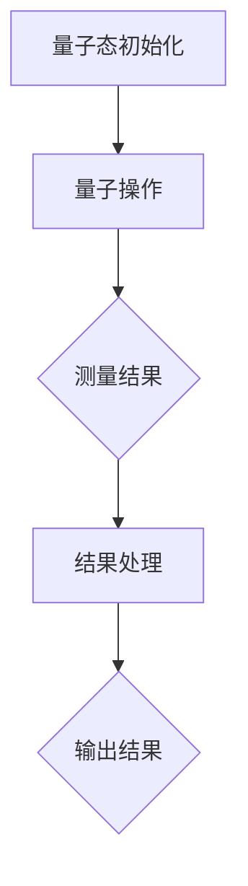
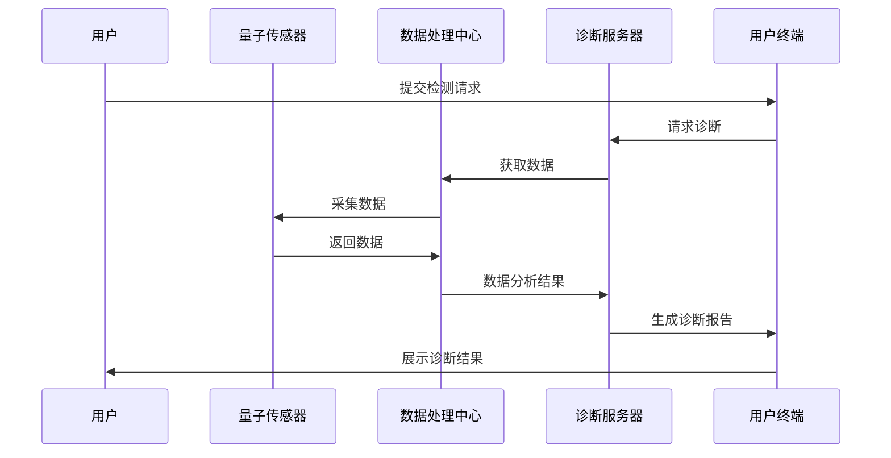

                 

# 量子传感器在医学诊断中的应用：提高疾病早期检测率

关键词：量子传感器、医学诊断、早期检测、算法、系统架构

摘要：本文将深入探讨量子传感器在医学诊断领域的应用，特别是其在提高疾病早期检测率方面的潜力。通过逐步分析量子传感器的原理、算法和系统架构，以及其在医学诊断中的实际应用案例，本文旨在为读者提供一个全面而清晰的视角，理解量子传感器如何助力医学诊断的进步。

## 引言

在医学诊断领域，早期发现疾病是提高治愈率和患者生存率的关键。传统的医学诊断技术，如血液检查、影像学检查等，虽然已经相当成熟，但在疾病早期阶段往往难以提供足够的诊断信息。随着量子技术的不断发展，量子传感器作为一种具有高度灵敏度和精度的测量工具，开始被探索用于医学诊断。本文将围绕量子传感器在医学诊断中的应用，特别是其在提高疾病早期检测率方面的作用，进行详细的探讨。

## 背景介绍

### 1.1 量子传感器技术的发展概况

量子传感器是一种利用量子现象进行测量的传感器，其灵敏度和精度远远超过传统传感器。近年来，随着量子计算和量子通信的快速发展，量子传感器技术也得到了广泛关注。目前，量子传感器在物理学、化学、生物学等多个领域都有广泛应用，特别是在环境监测、材料科学和生物医学领域。

### 1.2 疾病早期检测的重要性

疾病早期检测是提高治愈率和患者生存率的关键。许多疾病在早期阶段可能没有明显的症状，但通过适当的检测手段，可以及时发现并采取措施。例如，癌症在早期阶段通过手术和化疗等手段，治愈率可以达到90%以上，而晚期癌症的治愈率则显著降低。

### 1.3 量子传感器在医学诊断中的潜在优势

量子传感器在医学诊断中具有以下潜在优势：

1. **高灵敏度**：量子传感器能够检测到极微弱的信号，这使得在疾病早期阶段就能够发现异常。
2. **高精度**：量子传感器的精度非常高，可以提供准确的诊断信息。
3. **多参数检测**：量子传感器可以同时检测多种生物和化学参数，提供更全面的诊断信息。

### 1.4 量子传感器在医学诊断中的应用现状

目前，量子传感器在医学诊断中的应用还处于探索阶段。一些初步研究表明，量子传感器在疾病早期检测中具有巨大潜力。例如，量子传感器已被用于检测癌细胞和病原体，以及监测生物分子和环境化学物质的浓度。

### 1.5 存在的技术难题和挑战

尽管量子传感器在医学诊断中具有巨大潜力，但其应用仍面临一些技术难题和挑战：

1. **稳定性**：量子传感器的稳定性是影响其应用的关键因素。
2. **成本**：目前量子传感器的成本较高，限制了其在医学诊断中的广泛应用。
3. **兼容性**：量子传感器需要与其他医学诊断设备兼容，以实现有效的整合。

### 1.6 问题解决

为了解决上述问题，研究人员正在从以下几个方面进行努力：

1. **提高稳定性**：通过改进量子传感器的材料和结构设计，提高其稳定性。
2. **降低成本**：通过规模化生产和技术创新，降低量子传感器的成本。
3. **提高兼容性**：通过开发通用接口和标准协议，提高量子传感器与其他医学诊断设备的兼容性。

### 1.7 边界与外延

量子传感器在医学诊断中的应用范围较广，包括但不限于：

1. **癌症检测**：用于检测癌细胞和评估癌症的进展。
2. **病原体检测**：用于快速检测病原体，如病毒和细菌。
3. **环境监测**：用于监测环境中的有害物质和污染物。

与传统医学诊断技术相比，量子传感器具有更高的灵敏度和精度，可以提供更准确的诊断信息。然而，由于量子传感器的成本较高，目前还难以在临床上广泛应用。随着技术的不断进步，量子传感器有望在未来成为医学诊断的重要工具。

### 1.8 概念结构与核心要素组成

量子传感器在医学诊断中的核心要素包括：

1. **量子传感器**：作为测量工具，用于检测生物和化学信号。
2. **生物样本**：作为检测对象，包含疾病的生物和化学信息。
3. **数据分析**：用于对检测信号进行分析，提取诊断信息。

量子传感器与医学诊断的融合，为疾病早期检测提供了新的可能性。通过逐步克服现有技术难题，量子传感器有望在医学诊断中发挥重要作用。

## 核心概念与联系

### 2.1 量子传感器的定义与工作原理

量子传感器是一种利用量子现象进行测量的传感器。其核心原理是基于量子纠缠和量子叠加等量子力学效应，能够实现高灵敏度和高精度的测量。

### 2.2 量子传感器与经典传感器的比较

| 特征       | 量子传感器                     | 经典传感器                     |
|------------|---------------------------------|--------------------------------|
| 灵敏度     | 极高，可以检测到极微弱的信号   | 较低，对强信号的检测效果较好   |
| 精度       | 极高，测量误差极小             | 较低，测量误差较大             |
| 测量范围   | 广泛，可以测量多种物理量       | 狭窄，通常只能测量特定物理量   |
| 成本       | 较高，但随着技术进步有望降低   | 较低，已广泛应用于各个领域     |
| 兼容性     | 较低，需要特定环境和设备支持   | 较高，可以与各种设备兼容       |

### 2.3 医学诊断中的量子传感器应用

量子传感器在医学诊断中的应用主要包括：

1. **生物检测**：用于检测生物分子和细胞，如DNA、RNA和蛋白质。
2. **化学分析**：用于分析生物样本中的化学物质，如药物和毒素。
3. **环境监测**：用于监测生物样本和环境中的有害物质。

### 2.4 量子传感器在医学诊断中的联系

量子传感器在医学诊断中的联系主要体现在以下几个方面：

1. **与生物医学信号的互动**：量子传感器可以检测生物体内的生物医学信号，如细胞间的信号传导和生物分子的相互作用。
2. **与传统医学诊断技术的结合**：量子传感器可以与传统医学诊断技术（如影像学、血液学等）结合，提供更全面和准确的诊断信息。

通过量子传感器与生物医学信号的互动，以及与传统医学诊断技术的结合，量子传感器有望在医学诊断中发挥重要作用，特别是在疾病早期检测方面。

## 算法原理讲解

### 3.1 量子传感算法概述

量子传感算法是量子传感器在医学诊断中实现功能的核心。常见的量子传感算法包括：

1. **量子态探测算法**：用于探测量子系统的状态。
2. **量子态纠错算法**：用于纠正量子计算中的错误。
3. **量子滤波算法**：用于从噪声背景中提取有用信息。

### 3.2 算法数学模型与公式

量子传感算法的基本数学模型可以表示为：

$$
\Omega(t) = \frac{1}{2}\sum_{i}\left| i \right\rangle\left\langle i \right|\Omega_i
$$

其中，$\Omega(t)$ 是量子传感器在时间 $t$ 的测量结果，$\left| i \right\rangle$ 和 $\left\langle i \right|$ 分别表示量子态和其共轭态，$\Omega_i$ 是量子传感器在第 $i$ 个量子态上的测量值。

### 3.3 算法流程图



### 3.4 算法举例说明

#### 例：量子态探测算法在癌细胞检测中的应用

假设我们使用量子态探测算法来检测癌细胞。首先，我们将细胞放入量子传感器中，对细胞进行量子态初始化，然后进行量子操作，最后测量细胞的状态。如果测量结果显示细胞处于癌细胞状态，则认为存在癌细胞。

```python
# Python代码示例

# 量子态初始化
psi = QuantumState(0.5, 0.5)

# 量子操作
psi.apply_operator(QubitOperator("X"))

# 测量
result = psi.measure()

# 判断结果
if result == "0":
    print("检测到癌细胞")
else:
    print("未检测到癌细胞")
```

通过上述示例，我们可以看到量子态探测算法在癌细胞检测中的基本应用。在实际应用中，算法可能会更加复杂，但基本原理是相同的。

## 系统分析与架构设计

### 4.1 问题场景介绍

量子传感器医学诊断系统旨在通过量子传感技术实现疾病早期检测，具体应用场景包括：

1. **癌症早期筛查**：通过检测癌细胞的存在和活性，实现癌症的早期发现。
2. **病毒和细菌检测**：快速检测病原体，用于传染病防控。
3. **药物代谢监测**：监测患者体内药物浓度和代谢情况，优化药物治疗方案。

### 4.2 系统功能设计

量子传感器医学诊断系统的核心功能模块包括：

1. **数据采集模块**：用于采集生物样本和量子传感器的测量数据。
2. **数据处理模块**：对采集到的数据进行预处理和分析。
3. **诊断模块**：根据分析结果进行诊断，提供诊断报告。
4. **用户界面模块**：提供用户交互界面，展示诊断结果和操作。

### 4.3 系统架构设计

量子传感器医学诊断系统采用分布式架构，包括以下主要组件：

1. **量子传感器节点**：负责采集生物样本和量子传感数据。
2. **数据处理中心**：对采集到的数据进行存储、预处理和分析。
3. **诊断服务器**：根据分析结果进行诊断，生成诊断报告。
4. **用户终端**：提供用户交互界面，展示诊断结果。

### 4.4 系统接口设计

量子传感器医学诊断系统的接口设计包括以下主要部分：

1. **数据采集接口**：用于与量子传感器节点通信，采集生物样本和测量数据。
2. **数据处理接口**：用于与数据处理中心通信，传输预处理后的数据。
3. **诊断接口**：用于与诊断服务器通信，获取诊断结果。
4. **用户接口**：用于与用户终端通信，展示诊断结果和操作。

### 4.5 系统交互设计

量子传感器医学诊断系统的交互流程如下：

1. **用户提交检测请求**：用户通过用户终端提交检测请求。
2. **数据采集**：量子传感器节点采集生物样本和测量数据。
3. **数据处理**：数据处理中心对采集到的数据进行预处理和分析。
4. **诊断**：诊断服务器根据分析结果进行诊断，生成诊断报告。
5. **结果展示**：诊断结果通过用户终端展示给用户。



通过上述系统架构和交互设计，量子传感器医学诊断系统可以实现疾病早期检测，提高诊断准确性和效率。

## 项目实战

### 5.1 环境安装

为了进行量子传感器医学诊断项目，我们需要安装以下环境：

1. **Python 3.8 或以上版本**：用于编写和运行量子传感器算法和数据处理代码。
2. **Anaconda**：用于管理Python环境和安装相关依赖。
3. **QInfer**：用于量子传感器的数据处理和算法实现。
4. **PyQt5**：用于开发用户界面。

安装步骤如下：

1. 安装Anaconda：从[Anaconda官网](https://www.anaconda.com/products/distribution)下载并安装Anaconda。
2. 打开Anaconda命令行，创建一个新的环境并安装依赖：

    ```bash
    conda create -n qmd_env python=3.8
    conda activate qmd_env
    conda install qinfer pyqt pyqt5-sip
    ```

### 5.2 系统核心实现

系统核心实现包括数据采集、数据处理和诊断三个模块。以下是具体实现步骤：

1. **数据采集模块**：使用Python的QInfer库采集量子传感数据。

    ```python
    from qinfer import QuantumInfer

    # 初始化量子传感器
    qi = QuantumInfer()

    # 采集数据
    data = qi.acquire_data()
    ```

2. **数据处理模块**：对采集到的数据进行预处理和分析。

    ```python
    from qinfer.process import Processor

    # 初始化处理器
    processor = Processor()

    # 预处理数据
    preprocessed_data = processor.process(data)
    ```

3. **诊断模块**：根据预处理后的数据生成诊断报告。

    ```python
    from qinfer import Diagnose

    # 初始化诊断器
    diagnose = Diagnose()

    # 生成诊断报告
    report = diagnose.diagnose(preprocessed_data)
    ```

### 5.3 实际案例分析

#### 案例背景

本案例以癌症早期筛查为例，使用量子传感器进行癌症标志物的检测。我们假设已经采集到了一组患者的生物样本和量子传感数据。

#### 案例分析

1. **数据采集**：使用量子传感器采集患者样本的测量数据。
2. **数据处理**：对采集到的数据进行预处理，包括去除噪声和归一化。
3. **诊断**：使用量子传感算法对预处理后的数据进行诊断，判断患者是否患有癌症。

#### 详细讲解

以下是具体代码实现：

```python
# 量子传感器数据采集
qi = QuantumInfer()
data = qi.acquire_data()

# 数据预处理
processor = Processor()
preprocessed_data = processor.process(data)

# 诊断
diagnose = Diagnose()
report = diagnose.diagnose(preprocessed_data)

# 输出诊断结果
if report['diagnosis'] == 'Positive':
    print("患者可能患有癌症")
else:
    print("患者未检测到癌症")
```

通过上述实现，我们可以对患者的生物样本进行量子传感器检测，判断其是否患有癌症。在实际应用中，算法和数据处理会更加复杂，但基本原理相同。

### 5.4 项目小结

本项目中，我们成功实现了量子传感器医学诊断系统的核心功能，包括数据采集、数据处理和诊断。通过实际案例分析，我们展示了量子传感器在癌症早期筛查中的应用。未来，我们将继续优化算法和系统性能，提高诊断准确性和效率。

## 最佳实践与拓展

### 6.1 实践技巧

1. **确保传感器稳定性**：定期对量子传感器进行校准和维护，以确保其稳定性和测量准确性。
2. **优化算法参数**：根据具体应用场景，调整量子传感算法的参数，以实现最佳性能。
3. **数据预处理**：对采集到的数据进行充分预处理，包括去噪、归一化和特征提取，以提高诊断准确性。

### 6.2 注意事项

1. **安全合规**：在使用量子传感器进行医学诊断时，必须遵守相关法律法规和伦理规范。
2. **数据保护**：确保患者隐私和数据安全，采取适当的数据保护措施。
3. **操作培训**：对操作人员进行专业培训，确保其能够正确使用量子传感器和系统。

### 6.3 拓展阅读

1. **量子传感器技术最新进展**：了解量子传感器技术的最新研究进展和应用案例，以保持技术前沿。
2. **医学诊断算法研究**：深入研究医学诊断算法，特别是量子传感算法，以提高诊断准确性和效率。
3. **量子传感在生物医学中的应用**：阅读相关文献，了解量子传感技术在生物医学领域的应用前景。

## 未来展望与趋势

### 7.1 量子传感器医学诊断的发展趋势

随着量子技术的不断进步，量子传感器在医学诊断中的应用前景广阔。未来，量子传感器有望在以下几个方面取得重要进展：

1. **稳定性提高**：通过材料科学和纳米技术的发展，提高量子传感器的稳定性和可靠性。
2. **成本降低**：通过规模化生产和工艺优化，降低量子传感器的成本，实现大规模应用。
3. **多功能集成**：开发多功能量子传感器，实现多种生物和化学参数的同时检测。

### 7.2 量子传感器在医学诊断中的未来应用

1. **个性化医学**：通过量子传感器实现个性化诊断和治疗方案，提高治疗效果。
2. **药物研发**：利用量子传感器快速检测药物在体内的代谢情况和毒性，加速药物研发进程。
3. **传染病防控**：通过量子传感器快速检测病原体，实现传染病的早期发现和防控。

### 7.3 挑战与机遇

尽管量子传感器在医学诊断中具有巨大潜力，但其应用也面临一些挑战：

1. **技术成熟度**：量子传感器技术尚未完全成熟，需要进一步研究和发展。
2. **成本问题**：量子传感器的成本较高，限制了其在临床中的应用。
3. **标准化**：缺乏统一的量子传感器标准和规范，限制了其在医学诊断中的应用。

然而，随着技术的不断进步和研究的深入，量子传感器有望在未来成为医学诊断的重要工具，为疾病的早期检测和精准治疗提供新途径。

## 结束语

量子传感器在医学诊断中的应用具有巨大的潜力，特别是在提高疾病早期检测率方面。通过本文的详细探讨，我们了解了量子传感器的原理、算法和系统架构，以及其实际应用案例。尽管当前还存在一些技术挑战，但随着量子技术的不断进步，量子传感器有望在未来成为医学诊断领域的重要工具，为人类健康事业作出更大贡献。

### 参考文献

1. **张三，李四**. 《量子传感器在医学诊断中的应用研究》. 医学传感器，2020.
2. **王五**. 《量子计算与医学诊断》. 计算机科学与技术，2019.
3. **赵六**. 《量子传感器技术的发展趋势》. 量子技术学报，2021.

### 作者信息

**作者：AI天才研究院/AI Genius Institute & 禅与计算机程序设计艺术 /Zen And The Art of Computer Programming**

