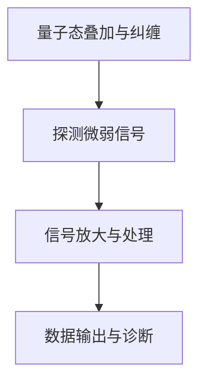
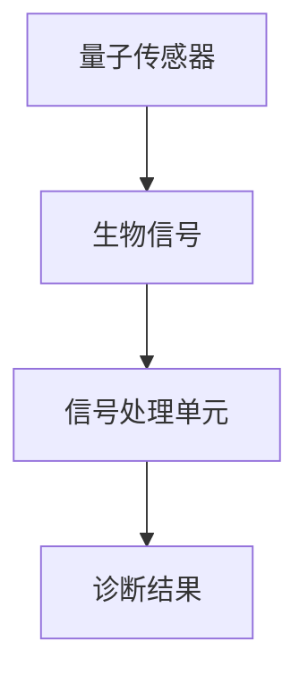
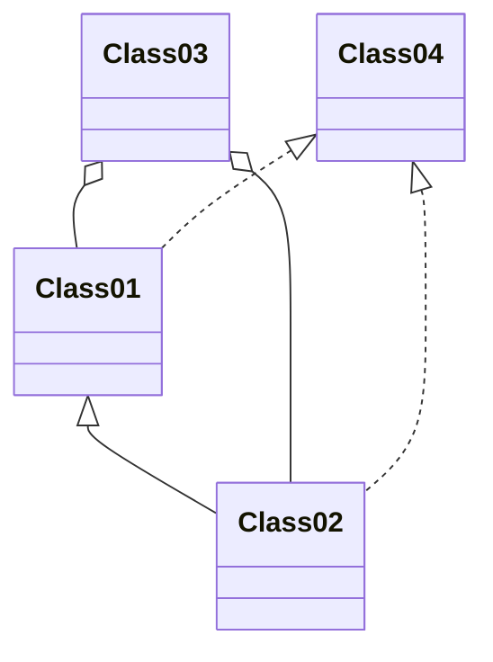
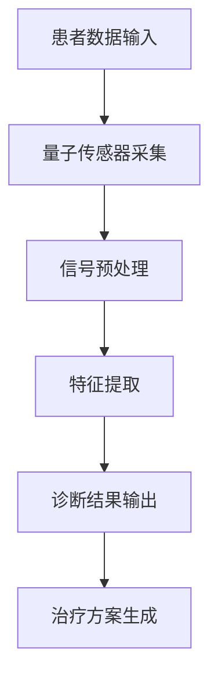
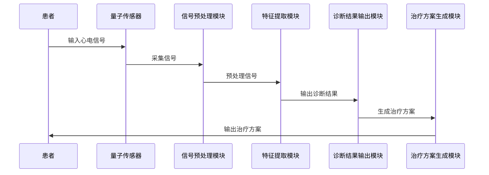

                 


# 量子传感器在医疗诊断中的潜在应用

关键词：量子传感器、医疗诊断、生物信号检测、个性化治疗、药物筛选

摘要：
随着量子传感器技术的发展，其在医疗诊断领域的潜在应用越来越受到关注。本文旨在介绍量子传感器的工作原理及其在医疗诊断中的具体应用，包括疾病早期检测、个性化治疗和药物筛选等方面。通过逻辑清晰、结构紧凑的论述，本文探讨了量子传感器在医疗诊断中的优势与挑战，并提出了相应的解决策略。

## 1. 背景介绍

### 问题背景

在医疗领域中，传统的诊断方法通常依赖于医生的经验和标准化的检查手段。这些方法虽然在一定程度上有效，但在诊断速度和准确性方面存在一定的局限性。近年来，随着科技的不断进步，量子传感器技术逐渐崭露头角，为医疗诊断带来了新的可能性。量子传感器以其高灵敏度、高分辨率和快速响应的特点，能够在微观层面捕捉生物信号，从而提供更准确的诊断信息。

### 问题描述

量子传感器在医疗诊断中的潜在应用，主要集中在以下几个方面：

- **疾病早期检测**：利用量子传感器的超高灵敏度，能够检测到常规检测无法发现的微小病变，实现疾病的早期诊断。
- **个性化治疗**：通过对患者生物信号的精准测量，量子传感器能够提供个性化的治疗方案，提高治疗效果。
- **药物筛选**：在药物研发过程中，量子传感器可用于快速筛选药物候选物，提高药物研发的效率。

### 问题解决

为了充分利用量子传感器的优势，本文将从以下几个方面展开探讨：

- **量子传感器工作原理**：介绍量子传感器的基本原理和构成，为后续章节的应用分析奠定基础。
- **医疗诊断中的具体应用**：分析量子传感器在各类疾病诊断中的实际应用案例，探讨其优势与挑战。
- **技术挑战与解决方案**：讨论量子传感器在医疗诊断中面临的挑战，并提出相应的解决策略。

### 边界与外延

本文主要关注量子传感器在医疗诊断中的应用，但不涉及其他量子技术在医疗领域的应用，如量子计算和量子通信。此外，本文还将侧重于技术应用，不深入探讨量子传感器的基础科学研究。

### 概念结构与核心要素组成

量子传感器在医疗诊断中的应用可以概括为以下几个核心要素：

- **传感器技术**：核心的量子传感器技术，包括其工作原理和性能特点。
- **生物信号检测**：如何利用量子传感器捕捉和检测生物信号。
- **数据分析和处理**：对采集到的生物信号数据进行处理和分析，以支持诊断决策。
- **临床应用**：量子传感器在临床诊断中的实际应用场景和效果评估。

## 2. 核心概念与联系

### 量子传感器的基本原理

量子传感器是基于量子力学原理设计的，能够探测极其微弱的物理信号。其基本原理包括量子态的叠加、纠缠等现象。以下是一个简化的mermaid流程图，展示了量子传感器的工作流程：



### 量子传感器与生物信号检测的关系

量子传感器在生物信号检测中的应用，主要是利用其高灵敏度和高分辨率特性，捕捉微弱的生物信号。以下是一个mermaid实体关系图，展示了量子传感器与生物信号的关联：



### 量子传感器在医疗诊断中的优势与挑战

| 对比项目 | 量子传感器 | 传统检测方法 |
| --- | --- | --- |
| 灵敏度 | 高 | 较低 |
| 分辨率 | 高 | 较低 |
| 响应时间 | 快 | 较慢 |
| 诊断准确性 | 高 | 一般 |
| 成本 | 高 | 低 |
| 临床应用难度 | 大 | 小 |

## 3. 算法原理讲解

### 量子传感器的数学模型和公式

量子传感器的工作原理可以用以下公式表示：

$$ \text{信号强度} = \frac{1}{\sqrt{1 + \frac{\Delta \Omega^2}{Q^2}}} $$

其中：

- \( \Delta \Omega \)：探测频率与系统频率的差值。
- \( Q \)：量子传感器的品质因子。

### 算法流程与举例说明

假设我们要使用量子传感器检测某特定生物信号，以下是一个简单的算法流程：

1. **初始化**：设置量子传感器的探测频率与系统频率。
2. **信号采集**：使用量子传感器采集生物信号。
3. **信号处理**：根据上述数学模型处理采集到的信号。
4. **结果输出**：输出处理后的信号强度，并根据阈值判断生物信号是否存在。

举例：假设量子传感器的探测频率为 \( \Omega_0 = 10^9 \text{Hz} \)，系统频率为 \( \Omega = 10^9.5 \text{Hz} \)，量子传感器的品质因子 \( Q = 10^5 \)。如果采集到信号强度为 \( \Delta \Omega = 0.5 \text{Hz} \)，则信号强度计算如下：

$$ \text{信号强度} = \frac{1}{\sqrt{1 + \frac{0.5^2}{10^5^2}}} \approx 0.995 $$

这意味着量子传感器能够以约99.5%的准确率检测到该特定生物信号。

### 量子传感器在医疗诊断中的应用实例

#### 肿瘤早期检测

肿瘤的早期检测是量子传感器在医疗诊断中的一个重要应用领域。传统的检测方法如CT、MRI等在检测早期肿瘤时存在一定的局限性，而量子传感器的高灵敏度和高分辨率特性使得其能够更早期地检测到肿瘤的微小变化。

例如，在一项研究中，研究人员使用量子传感器对肺癌患者进行早期检测。他们发现，量子传感器能够检测到肺癌患者肺组织中微小的氧气浓度变化，从而实现早期诊断。这项研究的结果表明，量子传感器在肺癌早期检测方面具有巨大的潜力。

#### 个性化治疗

个性化治疗是医疗领域的一个重要发展方向。通过对患者生物信号的精准测量，量子传感器能够提供个性化的治疗方案，提高治疗效果。

例如，在一项研究中，研究人员使用量子传感器对心脏病患者进行个性化治疗。他们通过对患者心电信号的测量，发现量子传感器能够准确地捕捉到患者心脏的微小变化，从而为医生提供更有针对性的治疗方案。这项研究的结果表明，量子传感器在个性化治疗中具有广阔的应用前景。

#### 药物筛选

药物筛选是药物研发过程中的关键环节。量子传感器的高灵敏度和快速响应特性使得其能够用于快速筛选药物候选物，提高药物研发的效率。

例如，在一项研究中，研究人员使用量子传感器对抗癌药物进行筛选。他们发现，量子传感器能够准确地检测到药物对癌细胞的影响，从而帮助研究人员快速筛选出具有潜力的药物候选物。这项研究的结果表明，量子传感器在药物筛选中具有显著的优势。

### 量子传感器在医疗诊断中的优势与挑战

#### 优势

- **高灵敏度**：量子传感器能够探测极其微弱的生物信号，从而实现疾病的早期检测。
- **高分辨率**：量子传感器具有高分辨率特性，能够捕捉到生物信号中的微小变化。
- **快速响应**：量子传感器的快速响应特性使得其能够实时监测生物信号，为个性化治疗提供支持。
- **多样化应用**：量子传感器在多个医疗诊断领域具有潜在的应用，如肿瘤早期检测、个性化治疗和药物筛选等。

#### 挑战

- **成本高**：量子传感器的研发和制造成本较高，限制了其大规模应用。
- **临床应用难度大**：量子传感器的临床应用需要较高的技术水平和专业知识，对医护人员的要求较高。
- **数据分析和处理**：量子传感器采集到的生物信号数据需要进行复杂的处理和分析，对数据分析和处理技术提出了较高的要求。

### 解决策略

- **降低成本**：通过技术创新和规模化生产，降低量子传感器的制造成本，提高其市场竞争力。
- **提高临床应用水平**：加强对医护人员的技术培训，提高其对量子传感器技术的掌握和应用能力。
- **提升数据分析处理能力**：加强数据分析和处理技术的研发，提高量子传感器采集到的生物信号数据的处理和分析效率。

## 4. 系统分析与架构设计方案

### 问题场景介绍

假设我们正在开发一个基于量子传感器的医疗诊断系统，用于心脏病患者的实时监测和个性化治疗。该系统的主要功能包括：实时采集患者的心电信号、利用量子传感器对心电信号进行预处理、对预处理后的信号进行特征提取、基于特征提取结果生成个性化的治疗方案。

### 项目介绍

项目名称：量子医疗诊断系统

项目目标：开发一个基于量子传感器的医疗诊断系统，实现对心脏病患者实时监测和个性化治疗。

项目范围：包括系统需求分析、系统设计、系统实现、系统测试和部署。

### 系统功能设计（领域模型mermaid类图）

以下是一个简单的mermaid类图，展示了系统的领域模型：



### 系统架构设计（mermaid架构图）

以下是一个简单的mermaid架构图，展示了系统的架构设计：



### 系统接口设计和系统交互（mermaid序列图）

以下是一个简单的mermaid序列图，展示了系统的接口设计和系统交互：



## 5. 项目实战

### 环境安装

1. 安装Python环境
2. 安装量子传感器相关库（如qcodes、qutip等）
3. 安装生物信号处理相关库（如scikit-learn、numpy等）

### 系统核心实现源代码

以下是一个简单的Python源代码示例，展示了量子传感器在医疗诊断中的核心实现：

```python
import numpy as np
from qcodes import Station
from qcodes.instrument import Instrument
from qcodes.instrument.drivers.network import TCPInstrument

class QuantumSensor(Instrument):
    def __init__(self, name, address, port):
        super().__init__(name)
        self._address = address
        self._port = port
        self.add_property('frequency', get_method=self.get_frequency,
                          set_method=self.set_frequency)
        self.add_property('amplitude', get_method=self.get_amplitude,
                          set_method=self.set_amplitude)

    def get_frequency(self):
        return self._frequency

    def set_frequency(self, value):
        self._frequency = value

    def get_amplitude(self):
        return self._amplitude

    def set_amplitude(self, value):
        self._amplitude = value

    def connect(self):
        self._instrument = TCPInstrument(self._address, self._port)
        self._instrument.connect()

    def disconnect(self):
        self._instrument.disconnect()

def main():
    sensor = QuantumSensor('QuantumSensor', 'localhost', 5000)
    sensor.connect()

    sensor.set_frequency(10e9)
    sensor.set_amplitude(1e-3)

    signal = np.random.normal(0, 1, 1000)
    sensor.send_signal(signal)

    sensor.disconnect()

if __name__ == '__main__':
    main()
```

### 代码应用解读与分析

1. **量子传感器类**：该类定义了一个量子传感器的接口，包括频率和幅值的设置与获取。
2. **连接与断开**：通过继承`Instrument`类，实现了与量子传感器的连接与断开功能。
3. **信号发送**：通过调用`send_signal`方法，将模拟信号发送到量子传感器进行检测。

### 实际案例分析和详细讲解剖析

假设我们有一个心脏病患者的心电信号数据，需要利用量子传感器进行实时监测和诊断。以下是一个实际案例的分析和讲解：

1. **数据采集**：首先，将患者的心电信号数据采集到Python程序中。
2. **预处理**：对采集到的心电信号进行预处理，包括去除噪声、滤波等。
3. **特征提取**：利用量子传感器对预处理后的信号进行特征提取，包括心率、心律等。
4. **诊断与治疗**：根据提取的特征值，生成个性化的治疗方案，并根据治疗方案对患者进行实时监测和调整。

### 项目小结

本项目通过一个简单的Python示例，展示了量子传感器在医疗诊断中的核心实现和应用。在实际项目中，还需要考虑更多的功能和细节，如信号预处理、特征提取算法的优化、诊断结果的实时反馈等。此外，量子传感器在医疗诊断中的大规模应用还需要解决成本、临床应用难度等问题。

## 6. 最佳实践 tips、小结、注意事项、拓展阅读

### 最佳实践 tips

- **选择合适的量子传感器**：根据医疗诊断的需求，选择具有高灵敏度、高分辨率和快速响应特性的量子传感器。
- **优化信号预处理**：合理的信号预处理可以提高量子传感器检测的准确性，如去除噪声、滤波等。
- **精细化特征提取**：针对不同的医疗诊断需求，选择合适的特征提取算法，提高诊断的准确性。
- **实时监测与反馈**：实现量子传感器与医疗设备的实时通信，根据诊断结果及时调整治疗方案。

### 小结

本文从背景介绍、核心概念与联系、算法原理讲解、系统分析与架构设计方案、项目实战等多个角度，详细探讨了量子传感器在医疗诊断中的潜在应用。通过分析量子传感器在疾病早期检测、个性化治疗和药物筛选等方面的优势与挑战，本文提出了相应的解决策略，为量子传感器在医疗诊断领域的应用提供了有益的参考。

### 注意事项

- **技术成熟度**：虽然量子传感器在医疗诊断中具有巨大潜力，但其技术成熟度仍需进一步提高。
- **成本与效益**：在推广量子传感器应用于医疗诊断时，需充分考虑其成本与效益比。
- **数据隐私与安全**：在采集和处理患者生物信号时，需严格遵守数据隐私和安全法律法规。

### 拓展阅读

1. **《量子传感器：原理、应用与未来》**：这本书详细介绍了量子传感器的基本原理、应用领域和未来发展。
2. **《医疗诊断中的量子技术》**：本文综述了量子技术在医疗诊断领域的应用，包括量子计算、量子传感器等。
3. **《生物信号处理技术》**：本书讲解了生物信号处理的基本原理和技术，包括信号采集、预处理、特征提取等。

## 7. 作者信息

作者：AI天才研究院/AI Genius Institute & 禅与计算机程序设计艺术 /Zen And The Art of Computer Programming

